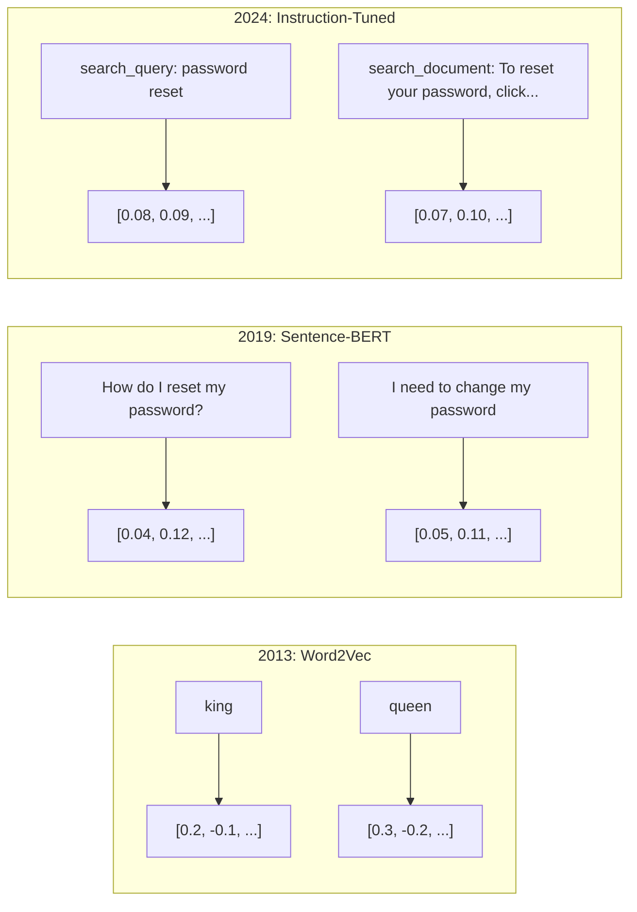
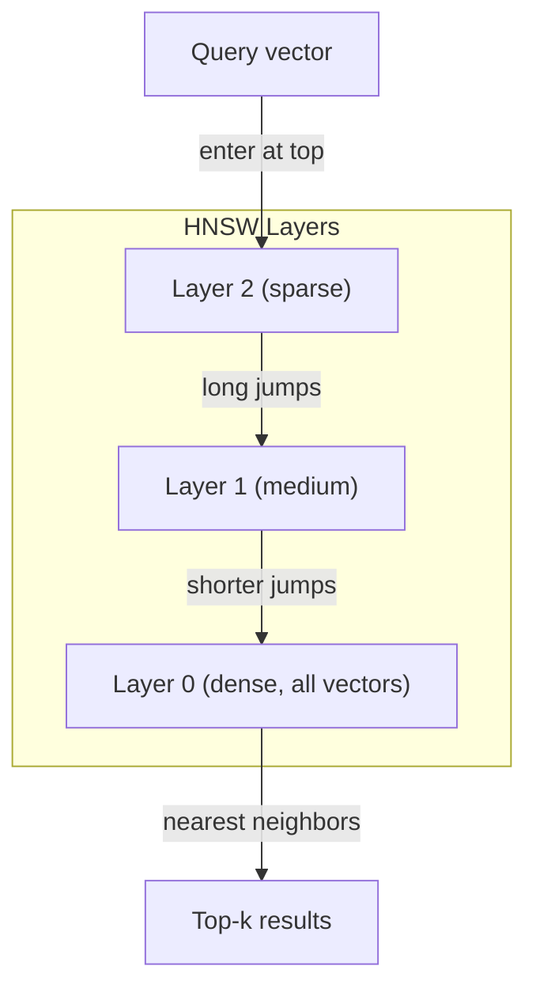
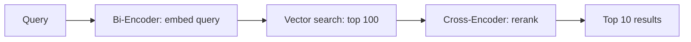

# 04 · 嵌入与向量表示

> 文本是离散的，数学是连续的。每当你让大语言模型（LLM）去寻找"相似"文档、比较语义，或进行超越关键词的搜索时，你都依赖于连接这两个世界的桥梁。这座桥梁就是嵌入（embedding）。如果你不理解嵌入，那你并没有真正理解现代 AI，你只是在使用它。

**类型：** 实战构建
**语言：** Python
**前置：** 第 11 阶段，第 01 课（提示工程）
**相关：** 第 5 阶段 · 22（嵌入模型深度剖析）讲解了稠密（dense）、稀疏（sparse）与多向量（multi-vector）的对比、套娃（Matryoshka）截断，以及按维度选型。本课聚焦生产管线（向量数据库、HNSW、相似度数学）。在选型之前，请先阅读第 5 阶段 · 22。

## 学习目标

- 使用 API 服务商与开源模型生成文本嵌入，并计算它们之间的余弦相似度（cosine similarity）
- 解释为什么嵌入能解决关键词搜索无法处理的词汇不匹配（vocabulary mismatch）问题
- 构建一个语义检索索引，按语义而非精确关键词匹配来检索文档
- 使用检索基准（precision@k、recall）评估嵌入质量，并为你的任务选出合适的嵌入模型

## 问题所在

你有 10,000 条客服工单。一位客户写道"my payment didn't go through"（我的付款没成功）。你需要找出相似的历史工单。关键词搜索能找到包含"payment"和"didn't go through"的工单，却会漏掉"transaction failed"（交易失败）、"charge was declined"（扣款被拒）和"billing error"（账单错误）。这些工单描述的是完全相同的问题，用的却是截然不同的措辞。

这就是词汇不匹配问题。人类语言有数十种方式表达同一件事。关键词搜索把每个词当作一个独立的、没有含义的符号，它无法知道"declined"与"didn't go through"指向的是同一个概念。

你需要一种文本表示，让相似度由语义而非拼写来决定。你需要一种方法，能把"my payment didn't go through"和"transaction was declined"放在某个数学空间中彼此靠近，同时把"my payment arrived on time"（我的付款准时到账）推得很远——尽管它们都包含"payment"这个词。

这种表示就是嵌入。

## 核心概念

### 什么是嵌入？

嵌入是一个由浮点数构成的稠密向量（dense vector），用来表示文本的语义。"稠密"这个词很关键——每一个维度都承载着信息，这与稀疏表示（sparse representation，如词袋、TF-IDF）不同，后者大多数维度都是零。

"The cat sat on the mat"会变成类似 `[0.023, -0.041, 0.087, ..., 0.012]` 这样的东西——一个由 768 到 3072 个数字组成的列表，具体长度取决于模型。这些数字编码了语义。你从不直接查看它们，而是去比较它们。

### Word2Vec 的突破

2013 年，Google 的 Tomas Mikolov 及其同事发表了 Word2Vec。核心洞见是：训练一个神经网络，用某个词的邻居来预测这个词（或反过来用某个词预测它的邻居），那么隐藏层的权重就成了有意义的向量表示。

著名的结果是：

```
king - man + woman = queen
```

对词嵌入做向量运算可以捕捉语义关系。从"man"到"woman"的方向，大致与从"king"到"queen"的方向相同。正是在这一刻，整个领域意识到几何可以编码语义。

Word2Vec 产生 300 维向量。每个词无论上下文如何都只有一个向量。"river bank"（河岸）和"bank account"（银行账户）中的"bank"拥有相同的嵌入。这一局限推动了接下来十年的研究。

### 从词到句

词嵌入表示的是单个词元（token）。生产系统需要嵌入整句、整段或整篇文档。由此出现了四种方法：

**取平均（Averaging）**：取句子中所有词向量的均值。廉价、有损，但对短文本意外地还不错。它完全丢失了词序——"dog bites man"（狗咬人）和"man bites dog"（人咬狗）得到的嵌入完全相同。

**CLS 词元（CLS token）**：Transformer 模型（BERT，2018）会输出一个特殊的 [CLS] 词元嵌入，用以表示整个输入。它比取平均更好，但 [CLS] 词元是为下一句预测（next-sentence prediction）而非相似度训练的。

**对比学习（Contrastive learning）**：显式地训练模型，把相似对拉近、把不相似对推远。Sentence-BERT（Reimers & Gurevych，2019）采用了这种方法，并成为现代嵌入模型的基础。给定"How do I reset my password?"和"I need to change my password"，模型学到这两者应当拥有几乎相同的向量。

**指令微调嵌入（Instruction-tuned embeddings）**：最新的方法。E5、GTE 这类模型接受一个任务前缀（"search_query:"、"search_document:"），告诉模型要产出哪种嵌入。这让一个模型能服务于多种任务。



### 现代嵌入模型

市场已经收敛到少数几个生产级选项（MTEB 分数截至 2026 年初，MTEB v2）：

| 模型 | 服务商 | 维度 | MTEB | 上下文 | 成本 / 1M tokens |
|-------|----------|-----------|------|---------|------------------|
| Gemini Embedding 2 | Google | 3072 (Matryoshka) | 67.7 (检索) | 8192 | $0.15 |
| embed-v4 | Cohere | 1024 (Matryoshka) | 65.2 | 128K | $0.12 |
| voyage-4 | Voyage AI | 1024/2048 (Matryoshka) | 66.8 | 32K | $0.12 |
| text-embedding-3-large | OpenAI | 3072 (Matryoshka) | 64.6 | 8192 | $0.13 |
| text-embedding-3-small | OpenAI | 1536 (Matryoshka) | 62.3 | 8192 | $0.02 |
| BGE-M3 | BAAI | 1024 (dense+sparse+ColBERT) | 63.0 多语言 | 8192 | 开放权重 |
| Qwen3-Embedding | Alibaba | 4096 (Matryoshka) | 66.9 | 32K | 开放权重 |
| Nomic-embed-v2 | Nomic | 768 (Matryoshka) | 63.1 | 8192 | 开放权重 |

MTEB（Massive Text Embedding Benchmark，大规模文本嵌入基准）v2 覆盖了检索、分类、聚类、重排序和摘要等 100 多项任务。分数越高越好。到 2026 年，开放权重模型（Qwen3-Embedding、BGE-M3）在大多数维度上已追平或超越闭源托管模型。Gemini Embedding 2 在纯检索上领先；Voyage/Cohere 在特定领域（金融、法律、代码）领先。在确定选型之前，务必用你自己的查询做基准测试。

### 相似度度量

给定两个嵌入向量，有三种方式衡量它们的相似程度：

**余弦相似度（Cosine similarity）**：两个向量夹角的余弦值。范围从 -1（方向相反）到 1（方向一致）。它忽略向量的模长——只要方向相同，一个 10 词的句子和一篇 500 词的文档也能得到 1.0 的分数。这是 90% 使用场景的默认选择。

```
cosine_sim(a, b) = dot(a, b) / (||a|| * ||b||)
```

**点积（Dot product）**：两个向量的原始内积。当向量已归一化（单位长度）时，它与余弦相似度完全等价。计算更快。OpenAI 的嵌入是归一化的，所以点积和余弦给出相同的排序。

```
dot(a, b) = sum(a_i * b_i)
```

**欧氏（L2）距离（Euclidean distance）**：向量空间中的直线距离。越小越相似。对模长差异敏感。当你关心的是空间中的绝对位置而不仅仅是方向时使用它。

```
L2(a, b) = sqrt(sum((a_i - b_i)^2))
```

何时用哪一种：

| 度量 | 适用场景 | 不适用场景 |
|--------|----------|------------|
| 余弦相似度 | 比较不同长度的文本；大多数检索任务 | 模长本身携带信息 |
| 点积 | 嵌入已经归一化；追求最快速度 | 向量模长差异很大 |
| 欧氏距离 | 聚类；空间最近邻问题 | 比较长度差异极大的文档 |

### 向量数据库与 HNSW

暴力相似度搜索（brute-force search）会拿查询与每一个存储的向量逐一比较。在 100 万个 1536 维向量的规模下，每次查询就是 15 亿次乘加运算。太慢了。

向量数据库用近似最近邻（Approximate Nearest Neighbor，ANN）算法来解决这个问题。最主流的算法是 HNSW（Hierarchical Navigable Small World，分层可导航小世界）：

1. 构建一个多层的向量图
2. 顶层稀疏——在相距很远的簇之间建立长程连接
3. 底层稠密——在邻近向量之间建立细粒度连接
4. 搜索从顶层开始，贪心地向下逐层细化
5. 以 O(log n) 而非 O(n) 的时间返回近似的 top-k 结果

HNSW 用很小的精度损失（通常召回率为 95–99%）换取巨大的速度提升。在 1000 万个向量的规模下，暴力搜索需要数秒，HNSW 只需毫秒。



生产选项：

| 数据库 | 类型 | 最适合 | 最大规模 |
|----------|------|----------|-----------|
| Pinecone | 托管 SaaS | 零运维生产环境 | 数十亿 |
| Weaviate | 开源 | 自托管、混合检索 | 1 亿+ |
| Qdrant | 开源 | 高性能、过滤 | 1 亿+ |
| ChromaDB | 嵌入式 | 原型开发、本地开发 | 100 万 |
| pgvector | Postgres 扩展 | 已经在用 Postgres | 1000 万 |
| FAISS | 库 | 进程内、科研 | 10 亿+ |

### 分块策略

文档太长，无法作为单个向量嵌入。一份 50 页的 PDF 涵盖数十个主题——它的嵌入会变成所有内容的平均，反而和任何具体内容都不相似。你需要把文档切成块（chunk），逐块嵌入。

**固定大小分块（Fixed-size chunking）**：每 N 个词元切一次，相邻块重叠 M 个词元。简单且可预测。当文档没有清晰结构时效果不错。一个 512 词元的块、50 词元的重叠：块 1 是词元 0–511，块 2 是词元 462–973。

**基于句子的分块（Sentence-based chunking）**：在句子边界处切分，把句子聚合到接近词元上限为止。每个块至少是一个完整的句子。比固定大小更好，因为你永远不会把一个完整的想法拦腰截断。

**递归分块（Recursive chunking）**：先尝试在最大的边界处切分（章节标题）。如果仍然太大，再尝试段落边界、然后句子边界、最后是字符上限。这就是 LangChain 的 `RecursiveCharacterTextSplitter`，对混合格式语料效果很好。

**语义分块（Semantic chunking）**：先嵌入每个句子，再把嵌入相似的连续句子聚到一起。当嵌入相似度跌破阈值时，就开启一个新块。开销大（需要单独嵌入每个句子），但产出的块最为连贯。

| 策略 | 复杂度 | 质量 | 最适合 |
|----------|-----------|---------|----------|
| 固定大小 | 低 | 还行 | 无结构文本、日志 |
| 基于句子 | 低 | 好 | 文章、邮件 |
| 递归 | 中 | 好 | Markdown、HTML、混合文档 |
| 语义 | 高 | 最好 | 检索质量至关重要的场景 |

大多数系统的最佳区间：256–512 词元的块，搭配 50 词元的重叠。

### 双编码器 vs 交叉编码器

双编码器（bi-encoder）独立地嵌入查询和文档，然后比较向量。快——查询只嵌入一次，再与预先算好的文档嵌入比较。检索就用它。

交叉编码器（cross-encoder）把查询和文档作为单个输入一起送入，输出一个相关性分数。慢——它要让每个"查询-文档"对都完整地过一遍模型。但准确得多，因为它能同时跨查询和文档的词元进行注意力计算。

生产模式是：双编码器召回 top-100 候选，交叉编码器把它们重排到 top-10。这就是"先检索后重排"（retrieve-then-rerank）管线。



重排序模型：Cohere Rerank 3.5（每 1000 次查询 $2）、BGE-reranker-v2（免费、开源）、Jina Reranker v2（免费、开源）。

### 套娃嵌入（Matryoshka Embeddings）

传统嵌入是全有或全无的。一个 1536 维的向量就要用满 1536 个浮点数。你无法在不重新训练的情况下把它截断到 256 维。

套娃表示学习（Matryoshka Representation Learning，Kusupati 等，2022）解决了这个问题。模型经过训练，使得前 N 个维度捕捉最重要的信息，就像俄罗斯套娃一样。把一个 1536 维的套娃嵌入截断到 256 维，会损失一些精度，但仍然可用。

OpenAI 的 text-embedding-3-small 和 text-embedding-3-large 通过 `dimensions` 参数支持套娃截断。请求 256 维而非 1536 维，可将存储缩减为原来的 1/6，在 MTEB 基准上大约只损失 3–5% 的精度。

### 二值量化（Binary Quantization）

一个 1536 维的嵌入以 float32 存储要用 6,144 字节。乘以 1000 万篇文档：仅向量就占 61 GB。

二值量化把每个浮点数转成单个比特：正值变 1，负值变 0。存储从 6,144 字节降到 192 字节——缩减 32 倍。相似度用汉明距离（Hamming distance，统计不同比特的数量）计算，CPU 一条指令就能完成。

精度损失在检索召回率上约为 5–10%。常见模式是：先用二值量化在数百万向量上做一遍粗筛，再用全精度向量对 top-1000 重新打分。这样能在内存少 32 倍的情况下，达到全精度 95%+ 的精度。

## 动手构建

我们从零构建一个语义搜索引擎。不用向量数据库，不用外部嵌入 API。纯 Python，数学部分用 numpy。

### 第 1 步：文本分块

```python
def chunk_text(text, chunk_size=200, overlap=50):
    words = text.split()
    chunks = []
    start = 0
    while start < len(words):
        end = start + chunk_size
        chunk = " ".join(words[start:end])
        chunks.append(chunk)
        start += chunk_size - overlap
    return chunks


def chunk_by_sentences(text, max_chunk_tokens=200):
    sentences = text.replace("\n", " ").split(".")
    sentences = [s.strip() + "." for s in sentences if s.strip()]
    chunks = []
    current_chunk = []
    current_length = 0
    for sentence in sentences:
        sentence_length = len(sentence.split())
        if current_length + sentence_length > max_chunk_tokens and current_chunk:
            chunks.append(" ".join(current_chunk))
            current_chunk = []
            current_length = 0
        current_chunk.append(sentence)
        current_length += sentence_length
    if current_chunk:
        chunks.append(" ".join(current_chunk))
    return chunks
```

### 第 2 步：从零构建嵌入

我们用带 L2 归一化的 TF-IDF 实现一个简单的稠密嵌入。这不是神经嵌入，但它遵循相同的契约：输入文本，输出固定大小的向量，相似文本产生相似向量。

```python
import math
import numpy as np
from collections import Counter

class SimpleEmbedder:
    def __init__(self):
        self.vocab = []
        self.idf = []
        self.word_to_idx = {}

    def fit(self, documents):
        vocab_set = set()
        for doc in documents:
            vocab_set.update(doc.lower().split())
        self.vocab = sorted(vocab_set)
        self.word_to_idx = {w: i for i, w in enumerate(self.vocab)}
        n = len(documents)
        self.idf = np.zeros(len(self.vocab))
        for i, word in enumerate(self.vocab):
            doc_count = sum(1 for doc in documents if word in doc.lower().split())
            self.idf[i] = math.log((n + 1) / (doc_count + 1)) + 1

    def embed(self, text):
        words = text.lower().split()
        count = Counter(words)
        total = len(words) if words else 1
        vec = np.zeros(len(self.vocab))
        for word, freq in count.items():
            if word in self.word_to_idx:
                tf = freq / total
                vec[self.word_to_idx[word]] = tf * self.idf[self.word_to_idx[word]]
        norm = np.linalg.norm(vec)
        if norm > 0:
            vec = vec / norm
        return vec
```

### 第 3 步：相似度函数

```python
def cosine_similarity(a, b):
    dot = np.dot(a, b)
    norm_a = np.linalg.norm(a)
    norm_b = np.linalg.norm(b)
    if norm_a == 0 or norm_b == 0:
        return 0.0
    return float(dot / (norm_a * norm_b))


def dot_product(a, b):
    return float(np.dot(a, b))


def euclidean_distance(a, b):
    return float(np.linalg.norm(a - b))
```

### 第 4 步：带暴力搜索的向量索引

```python
class VectorIndex:
    def __init__(self):
        self.vectors = []
        self.texts = []
        self.metadata = []

    def add(self, vector, text, meta=None):
        self.vectors.append(vector)
        self.texts.append(text)
        self.metadata.append(meta or {})

    def search(self, query_vector, top_k=5, metric="cosine"):
        scores = []
        for i, vec in enumerate(self.vectors):
            if metric == "cosine":
                score = cosine_similarity(query_vector, vec)
            elif metric == "dot":
                score = dot_product(query_vector, vec)
            elif metric == "euclidean":
                score = -euclidean_distance(query_vector, vec)
            else:
                raise ValueError(f"Unknown metric: {metric}")
            scores.append((i, score))
        scores.sort(key=lambda x: x[1], reverse=True)
        results = []
        for idx, score in scores[:top_k]:
            results.append({
                "text": self.texts[idx],
                "score": score,
                "metadata": self.metadata[idx],
                "index": idx
            })
        return results

    def size(self):
        return len(self.vectors)
```

### 第 5 步：语义搜索引擎

```python
class SemanticSearchEngine:
    def __init__(self, chunk_size=200, overlap=50):
        self.embedder = SimpleEmbedder()
        self.index = VectorIndex()
        self.chunk_size = chunk_size
        self.overlap = overlap

    def index_documents(self, documents, source_names=None):
        all_chunks = []
        all_sources = []
        for i, doc in enumerate(documents):
            chunks = chunk_text(doc, self.chunk_size, self.overlap)
            all_chunks.extend(chunks)
            name = source_names[i] if source_names else f"doc_{i}"
            all_sources.extend([name] * len(chunks))
        self.embedder.fit(all_chunks)
        for chunk, source in zip(all_chunks, all_sources):
            vec = self.embedder.embed(chunk)
            self.index.add(vec, chunk, {"source": source})
        return len(all_chunks)

    def search(self, query, top_k=5, metric="cosine"):
        query_vec = self.embedder.embed(query)
        return self.index.search(query_vec, top_k, metric)

    def search_with_scores(self, query, top_k=5):
        results = self.search(query, top_k)
        return [
            {
                "text": r["text"][:200],
                "source": r["metadata"].get("source", "unknown"),
                "score": round(r["score"], 4)
            }
            for r in results
        ]
```

### 第 6 步：比较相似度度量

```python
def compare_metrics(engine, query, top_k=3):
    results = {}
    for metric in ["cosine", "dot", "euclidean"]:
        hits = engine.search(query, top_k=top_k, metric=metric)
        results[metric] = [
            {"score": round(h["score"], 4), "preview": h["text"][:80]}
            for h in hits
        ]
    return results
```

## 实际使用

换成生产级嵌入 API，架构完全不变。只有嵌入器（embedder）需要替换：

```python
from openai import OpenAI

client = OpenAI()

def openai_embed(texts, model="text-embedding-3-small", dimensions=None):
    kwargs = {"model": model, "input": texts}
    if dimensions:
        kwargs["dimensions"] = dimensions
    response = client.embeddings.create(**kwargs)
    return [item.embedding for item in response.data]
```

用 OpenAI 做套娃截断——同一个模型，更少的维度，更低的存储：

```python
full = openai_embed(["semantic search query"], dimensions=1536)
compact = openai_embed(["semantic search query"], dimensions=256)
```

256 维的向量存储减少 6 倍。对于 1000 万篇文档，就是 10 GB 对比 61 GB。在标准基准上的精度损失约为 3–5%。

用 Cohere 做重排序：

```python
import cohere

co = cohere.ClientV2()

results = co.rerank(
    model="rerank-v3.5",
    query="What is the refund policy?",
    documents=["Full refund within 30 days...", "No refunds after 90 days..."],
    top_n=3
)
```

不依赖 API 的本地嵌入：

```python
from sentence_transformers import SentenceTransformer

model = SentenceTransformer("BAAI/bge-small-en-v1.5")
embeddings = model.encode(["semantic search query", "another document"])
```

我们构建的 VectorIndex 类适用于上述任意一种。换掉嵌入函数，保留搜索逻辑即可。

## 交付产物

本课产出：
- `outputs/prompt-embedding-advisor.md` —— 一个用于为特定场景挑选嵌入模型与策略的提示词
- `outputs/skill-embedding-patterns.md` —— 一个教智能体在生产中高效使用嵌入的技能（skill）

## 练习

1. **度量对比**：用余弦相似度、点积和欧氏距离，对样本文档运行相同的 5 个查询。记录每种度量的 top-3 结果。哪些查询上各度量出现了分歧？为什么？

2. **块大小实验**：以 50、100、200、500 词的块大小对样本文档建立索引。对每种情况运行 5 个查询，记录 top-1 相似度分数。绘制块大小与检索质量的关系图。找出更大的块开始损害质量的拐点。

3. **套娃模拟**：构建一个产生 500 维向量的 SimpleEmbedder。将其截断到 50、100、200、500 维。测量每个截断点上检索召回率的退化程度。这能在不需要真正训练技巧的情况下模拟套娃行为。

4. **二值量化**：取搜索引擎产出的嵌入，将其转为二值（正为 1，负为 0），并实现汉明距离搜索。将 top-10 结果与全精度余弦相似度对比，测量重叠百分比。

5. **基于句子的分块**：用 `chunk_by_sentences` 替换固定大小分块。运行相同的查询并对比检索分数。尊重句子边界是否改善了结果？

## 关键术语

| 术语 | 人们常说 | 实际含义 |
|------|----------------|----------------------|
| 嵌入（Embedding） | "文本转数字" | 一个稠密向量，其几何上的邻近性编码了语义相似度 |
| Word2Vec | "嵌入鼻祖" | 2013 年的模型，通过预测上下文词来学习词向量；证明了向量运算能编码语义 |
| 余弦相似度（Cosine similarity） | "两个向量有多相似" | 向量夹角的余弦；1 = 方向一致，0 = 正交，-1 = 方向相反 |
| HNSW | "快速向量搜索" | 分层可导航小世界图——多层结构，支持 O(log n) 的近似最近邻搜索 |
| 双编码器（Bi-encoder） | "分别嵌入，快速比较" | 把查询和文档独立编码成向量；支持预计算与快速检索 |
| 交叉编码器（Cross-encoder） | "慢但准的重排器" | 把"查询-文档"对联合送入完整模型；精度更高，无法预计算 |
| 套娃嵌入（Matryoshka embeddings） | "可截断的向量" | 经过训练让前 N 个维度捕捉最重要信息的嵌入，支持可变大小存储 |
| 二值量化（Binary quantization） | "1 比特嵌入" | 把浮点向量转为二值（仅保留符号位），存储缩减 32 倍，配合汉明距离搜索 |
| 分块（Chunking） | "切分文档以便嵌入" | 把文档切成 256–512 词元的片段，使每段可独立嵌入与检索 |
| 向量数据库（Vector database） | "嵌入的搜索引擎" | 为存储向量并大规模执行近似最近邻搜索而优化的数据存储 |
| 对比学习（Contrastive learning） | "靠对比来训练" | 一种训练方法，把相似对的嵌入拉近、把不相似对的嵌入推远 |
| MTEB | "嵌入基准" | 大规模文本嵌入基准——涵盖 8 类任务的 56 个数据集；比较嵌入模型的标准 |

## 延伸阅读

- Mikolov 等，《Efficient Estimation of Word Representations in Vector Space》(2013) —— Word2Vec 论文，以 king-queen 类比开启了嵌入革命
- Reimers & Gurevych，《Sentence-BERT: Sentence Embeddings using Siamese BERT-Networks》(2019) —— 如何为句子级相似度训练双编码器，现代嵌入模型的基础
- Kusupati 等，《Matryoshka Representation Learning》(2022) —— 可变维度嵌入背后的技术，OpenAI 在 text-embedding-3 中采用
- Malkov & Yashunin，《Efficient and Robust Approximate Nearest Neighbor using Hierarchical Navigable Small World Graphs》(2018) —— HNSW 论文，大多数生产级向量搜索背后的算法
- OpenAI 嵌入指南 (platform.openai.com/docs/guides/embeddings) —— text-embedding-3 模型的实用参考，含套娃降维
- MTEB 排行榜 (huggingface.co/spaces/mteb/leaderboard) —— 跨任务与语言对比所有嵌入模型的实时基准
- [Muennighoff 等，《MTEB: Massive Text Embedding Benchmark》(EACL 2023)](https://arxiv.org/abs/2210.07316) —— 定义了排行榜所报告的 8 类任务（分类、聚类、对分类、重排序、检索、STS、摘要、双语文本挖掘）的基准；在轻信任何单一 MTEB 分数前请先阅读
- [Sentence Transformers 文档](https://www.sbert.net/) —— 双编码器 vs 交叉编码器、池化策略，以及本课所实现的"摄取-切分-嵌入-存储"RAG 管线的权威参考
