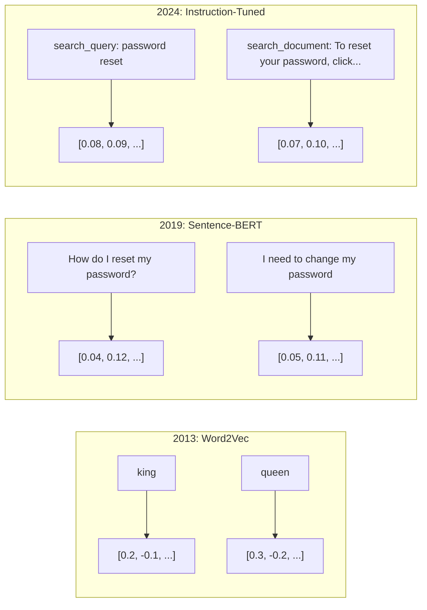
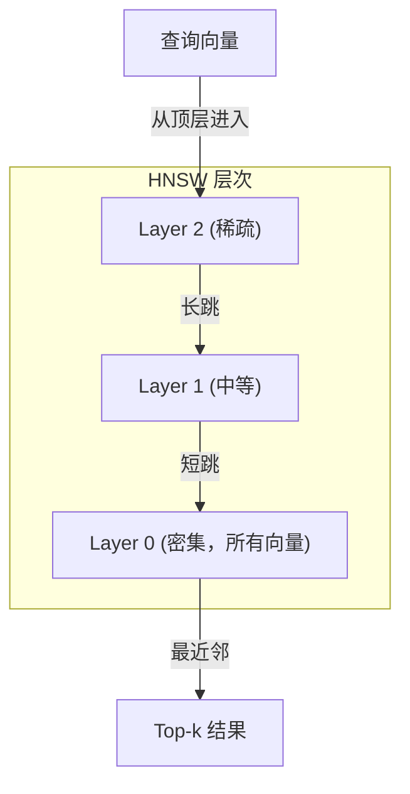

# 嵌入与向量表示（Embeddings & Vector Representations）

> 文本是离散的。数学是连续的。每次你让大语言模型查找"相似"文档、比较含义或进行超越关键词的搜索时，你都在依赖这两者之间的桥梁。这座桥梁就是嵌入。如果你不理解嵌入，你就不理解现代AI。你只是在用它。

**类型:** 构建
**语言:** Python
**前置知识:** 阶段11，课程01（提示工程）
**时间:** ~75分钟
**相关:** 阶段5 · 22（深入嵌入模型）涵盖密集 vs 稀疏 vs 多向量、套娃截断和按轴模型选择。本课程专注于生产管线（向量数据库、HNSW、相似度数学）。在选择模型前请先阅读阶段5 · 22。

## 学习目标

- 使用API提供商和开源模型生成文本嵌入，并计算它们之间的余弦相似度
- 解释为什么嵌入能解决关键词搜索无法处理的词汇不匹配问题
- 构建一个语义搜索索引，根据含义而非精确关键词匹配检索文档
- 使用检索基准（precision@k、recall）评估嵌入质量，并为你的任务选择合适的嵌入模型

## 问题

你有10,000个支持工单。客户写道"我的付款没有通过。"你需要找到相似的过往工单。关键词搜索能找到包含"payment"和"didn't go through"的工单。它漏掉了"transaction failed"、"charge was declined"和"billing error"。这些工单用完全不同的词语描述了完全相同的问题。

这就是词汇不匹配问题。人类语言有几十种方式来表达同一件事。关键词搜索将每个词视为独立的符号，没有含义。它无法知道"declined"和"didn't go through"指的是同一概念。

你需要一种文本表示，其中含义而非拼写决定相似度。你需要一种方法，将"my payment didn't go through"和"transaction was declined"在某个数学空间中放置得很近，同时将"my payment arrived on time"推得很远，尽管它们共享单词"payment"。

这种表示就是嵌入。

## 概念

### 什么是嵌入？

嵌入是一个密集的浮点数向量，代表文本的含义。"密集"很重要——每个维度都携带信息，而稀疏表示（词袋、TF-IDF）中大多数维度为零。

"The cat sat on the mat"变成类似`[0.023, -0.041, 0.087, ..., 0.012]`的东西——一个包含768到3072个数字的列表，具体取决于模型。这些数字编码了含义。你从不直接检查它们。你比较它们。

### Word2Vec 的突破

2013年，Google的Tomas Mikolov及其同事发表了Word2Vec。核心洞察：训练一个神经网络，根据单词的邻居预测单词（或根据单词预测邻居），隐藏层权重就变成了有意义的向量表示。

著名结果：

```
king - man + woman = queen
```

词嵌入上的向量算术捕捉到了语义关系。从"man"到"woman"的方向大致等同于从"king"到"queen"的方向。这是该领域意识到几何可以编码含义的时刻。

Word2Vec生成了300维向量。每个词无论上下文如何都得到一个向量。"bank"在"river bank"和"bank account"中具有相同的嵌入。这一局限性推动了接下来十年的研究。

### 从单词到句子

词嵌入表示单个标记。生产系统需要嵌入整个句子、段落或文档。出现了四种方法：

**平均（Averaging）**：取句子中所有词向量的均值。廉价、有损、对短文本意外地不错。完全丢失了词序——"dog bites man"和"man bites dog"得到相同的嵌入。

**CLS标记**：Transformer模型（BERT，2018）输出一个特殊的[CLS]标记嵌入，代表整个输入。比平均更好，但[CLS]标记是为下一句预测训练的，而非相似度。

**对比学习（Contrastive learning）**：明确训练模型将相似对推近，不相似对拉远。Sentence-BERT（Reimers & Gurevych，2019）使用了这种方法，成为现代嵌入模型的基础。给定"How do I reset my password?"和"I need to change my password"，模型学习到它们应该具有几乎相同的向量。

**指令调优嵌入（Instruction-tuned embeddings）**：最新方法。像E5和GTE这样的模型接受任务前缀（"search_query:"、"search_document:"），告诉模型生成哪种类型的嵌入。这使得一个模型可以服务于多个任务。



### 现代嵌入模型

市场已稳定在少数几个生产级选项上（截至2026年初的MTEB分数，MTEB v2）：

| 模型 | 提供商 | 维度 | MTEB | 上下文长度 | 成本 / 1M 标记 |
|-------|----------|-----------|------|---------|------------------|
| Gemini Embedding 2 | Google | 3072（套娃） | 67.7（检索） | 8192 | $0.15 |
| embed-v4 | Cohere | 1024（套娃） | 65.2 | 128K | $0.12 |
| voyage-4 | Voyage AI | 1024/2048（套娃） | 66.8 | 32K | $0.12 |
| text-embedding-3-large | OpenAI | 3072（套娃） | 64.6 | 8192 | $0.13 |
| text-embedding-3-small | OpenAI | 1536（套娃） | 62.3 | 8192 | $0.02 |
| BGE-M3 | BAAI | 1024（密集+稀疏+ColBERT） | 63.0 多语言 | 8192 | 开放权重 |
| Qwen3-Embedding | 阿里巴巴 | 4096（套娃） | 66.9 | 32K | 开放权重 |
| Nomic-embed-v2 | Nomic | 768（套娃） | 63.1 | 8192 | 开放权重 |

MTEB（大规模文本嵌入基准，Massive Text Embedding Benchmark）v2涵盖检索、分类、聚类、重排序和摘要等100+任务。分数越高越好。到2026年，开放权重模型（Qwen3-Embedding、BGE-M3）在大多数指标上匹配或超越封闭托管模型。Gemini Embedding 2在纯检索上领先；Voyage/Cohere在特定领域（金融、法律、代码）领先。在承诺使用前，始终在你的查询上自己进行基准测试。

### 相似度度量

给定两个嵌入向量，有三种衡量它们相似度的方法：

**余弦相似度（Cosine similarity）**：两个向量之间夹角的余弦。范围从-1（相反）到1（方向相同）。忽略幅度——一个10词的句子和一个500词的文档如果方向相同可以得1.0。这是90%用例的默认选择。

```
cosine_sim(a, b) = dot(a, b) / (||a|| * ||b||)
```

**点积（Dot product）**：两个向量的原始内积。当向量被归一化（单位长度）时，与余弦相似度相同。计算更快。OpenAI的嵌入是归一化的，因此点积和余弦给出相同的排名。

```
dot(a, b) = sum(a_i * b_i)
```

**欧几里得距离（Euclidean (L2) distance）**：向量空间中的直线距离。越小越相似。对幅度差异敏感。当空间中的绝对位置而非方向也重要时使用。

```
L2(a, b) = sqrt(sum((a_i - b_i)^2))
```

何时使用哪种：

| 度量 | 何时使用 | 何时避免 |
|--------|----------|------------|
| 余弦相似度 | 比较不同长度的文本；多数检索任务 | 幅度携带信息 |
| 点积 | 嵌入已归一化；追求最快速度 | 向量幅度不同 |
| 欧几里得距离 | 聚类；空间最近邻问题 | 比较长度差异巨大的文档 |

### 向量数据库与HNSW

暴力相似度搜索将查询与每个存储的向量进行比较。在100万个1536维向量时，每次查询需要15亿次乘加运算。太慢了。

向量数据库通过近似最近邻（ANN）算法解决这一问题。主导算法是HNSW（分层可导航小世界，Hierarchical Navigable Small World）：

1. 构建向量的多层图
2. 顶层稀疏——远距离簇之间的长程连接
3. 底层稠密——附近向量之间的细粒度连接
4. 搜索从顶层开始，贪婪地向下细化
5. 以O(log n)时间而非O(n)返回近似top-k结果

HNSW以较小的精度损失（通常95-99%召回率）换取巨大的速度提升。在1000万个向量上，暴力搜索需要数秒。HNSW只需毫秒。



生产选项：

| 数据库 | 类型 | 最适合 | 最大规模 |
|----------|------|----------|-----------|
| Pinecone | 托管SaaS | 零运维生产 | 数十亿 |
| Weaviate | 开源 | 自托管、混合搜索 | 1亿+ |
| Qdrant | 开源 | 高性能、过滤 | 1亿+ |
| ChromaDB | 嵌入式 | 原型开发、本地开发 | 100万 |
| pgvector | Postgres扩展 | 已在使用Postgres | 1000万 |
| FAISS | 库 | 进程内、研究 | 10亿+ |

### 分块策略

文档太长，无法作为单个向量嵌入。一份50页的PDF涵盖了数十个主题——它的嵌入变成了所有内容的平均值，与任何具体内容都不相似。你将文档分割成块，并分别嵌入每个块。

**固定大小分块（Fixed-size chunking）**：每N个标记一次分割，有M个标记重叠。简单且可预测。当文档没有明确结构时效果很好。512个标记的块，50个标记重叠：块1为标记0-511，块2为标记462-973。

**基于句子的分块（Sentence-based chunking）**：在句子边界分割，将句子分组直到达到标记限制。每个块至少包含一个完整句子。比固定大小更好，因为你永远不会把一句话切成两半。

**递归分块（Recursive chunking）**：首先尝试在最大的边界（章节标题）分割。如果仍然太大，尝试段落边界。然后是句子边界。最后是字符限制。这是LangChain的`RecursiveCharacterTextSplitter`，适用于混合格式的语料库。

**语义分块（Semantic chunking）**：嵌入每个句子，然后将嵌入相似度高的连续句子分组。当嵌入相似度低于阈值时，开始新块。开销大（需要单独嵌入每个句子），但生成最连贯的块。

| 策略 | 复杂度 | 质量 | 最适合 |
|----------|-----------|---------|----------|
| 固定大小 | 低 | 一般 | 非结构化文本、日志 |
| 基于句子 | 低 | 好 | 文章、邮件 |
| 递归 | 中 | 好 | Markdown、HTML、混合文档 |
| 语义 | 高 | 最佳 | 关键检索质量 |

大多数系统的理想选择：256-512标记的块，50标记重叠。

### 双编码器 vs 交叉编码器

双编码器独立嵌入查询和文档，然后比较向量。速度快——你嵌入一次查询，然后与预先计算的文档嵌入进行比较。这就是你用于检索的方案。

交叉编码器将查询和文档作为单个输入，并输出一个相关性分数。速度慢——它通过完整模型处理每个查询-文档对。但准确得多，因为它可以同时关注查询和文档标记。

生产模式：双编码器检索top-100候选，交叉编码器将其重新排序为top-10。这就是检索-然后-重排序流水线。


重排序模型：Cohere Rerank 3.5（每1000次查询$2），BGE-reranker-v2（免费，开源），Jina Reranker v2（免费，开源）。

### 套娃嵌入（Matryoshka Embeddings）

传统嵌入要么全有要么全无。1536维向量使用1536个浮点数。你不能在不重新训练的情况下截断到256维。

套娃表示学习（Matryoshka Representation Learning，Kusupati等人，2022）解决了这个问题。模型经过训练，使得前N个维度捕获最重要的信息，就像俄罗斯套娃一样。将1536维的套娃嵌入截断到256维会损失一些准确性，但仍然可用。

OpenAI的text-embedding-3-small和text-embedding-3-large通过`dimensions`参数支持套娃截断。请求256维而非1536维可将存储减少6倍，同时在MTEB基准上大约损失3-5%的准确性。

### 二值量化（Binary Quantization）

1536维的浮点32嵌入占用6,144字节。乘以1000万文档：仅向量就需要61 GB。

二值量化将每个浮点数转换为一个比特：正值变为1，负值变为0。存储从6,144字节降至192字节——32倍减少。相似度使用汉明距离（计算不同位的数量）计算，CPU可以在一条指令中完成。

准确性损失大约在检索召回率上降低5-10%。常见模式：在数百万向量的首轮搜索中使用二值量化，然后使用全精度向量对top-1000重新评分。这样可以用32倍的内存获得全精度95%以上的准确率。

## 构建它

我们从头构建一个语义搜索引擎。没有向量数据库。没有外部嵌入API。纯Python，用numpy做数学。

### 第一步：文本分块

```python
def chunk_text(text, chunk_size=200, overlap=50):
    words = text.split()
    chunks = []
    start = 0
    while start < len(words):
        end = start + chunk_size
        chunk = " ".join(words[start:end])
        chunks.append(chunk)
        start += chunk_size - overlap
    return chunks


def chunk_by_sentences(text, max_chunk_tokens=200):
    sentences = text.replace("\n", " ").split(".")
    sentences = [s.strip() + "." for s in sentences if s.strip()]
    chunks = []
    current_chunk = []
    current_length = 0
    for sentence in sentences:
        sentence_length = len(sentence.split())
        if current_length + sentence_length > max_chunk_tokens and current_chunk:
            chunks.append(" ".join(current_chunk))
            current_chunk = []
            current_length = 0
        current_chunk.append(sentence)
        current_length += sentence_length
    if current_chunk:
        chunks.append(" ".join(current_chunk))
    return chunks
```

### 第二步：从头构建嵌入

我们实现一个简单的密集嵌入，使用TF-IDF和L2归一化。这不是神经嵌入，但它遵循相同的约定：输入文本，输出固定大小的向量，相似文本产生相似向量。

```python
import math
import numpy as np
from collections import Counter

class SimpleEmbedder:
    def __init__(self):
        self.vocab = []
        self.idf = []
        self.word_to_idx = {}

    def fit(self, documents):
        vocab_set = set()
        for doc in documents:
            vocab_set.update(doc.lower().split())
        self.vocab = sorted(vocab_set)
        self.word_to_idx = {w: i for i, w in enumerate(self.vocab)}
        n = len(documents)
        self.idf = np.zeros(len(self.vocab))
        for i, word in enumerate(self.vocab):
            doc_count = sum(1 for doc in documents if word in doc.lower().split())
            self.idf[i] = math.log((n + 1) / (doc_count + 1)) + 1

    def embed(self, text):
        words = text.lower().split()
        count = Counter(words)
        total = len(words) if words else 1
        vec = np.zeros(len(self.vocab))
        for word, freq in count.items():
            if word in self.word_to_idx:
                tf = freq / total
                vec[self.word_to_idx[word]] = tf * self.idf[self.word_to_idx[word]]
        norm = np.linalg.norm(vec)
        if norm > 0:
            vec = vec / norm
        return vec
```

### 第三步：相似度函数

```python
def cosine_similarity(a, b):
    dot = np.dot(a, b)
    norm_a = np.linalg.norm(a)
    norm_b = np.linalg.norm(b)
    if norm_a == 0 or norm_b == 0:
       