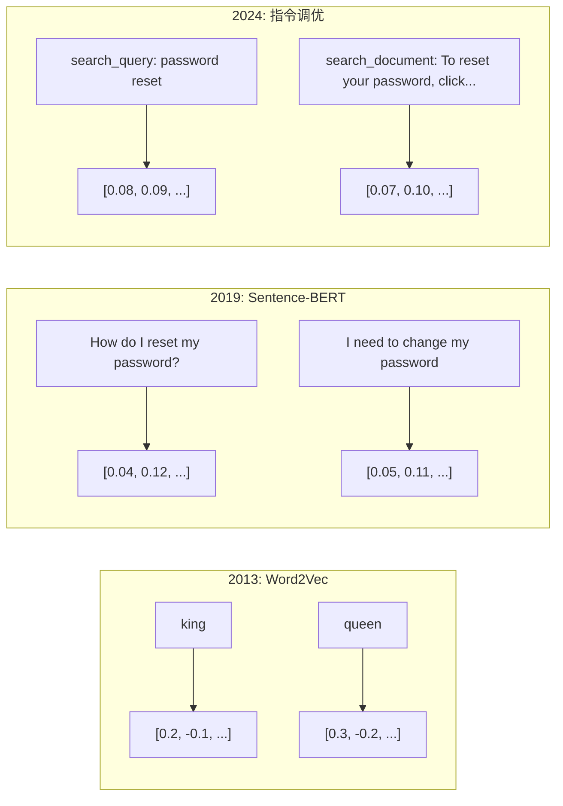
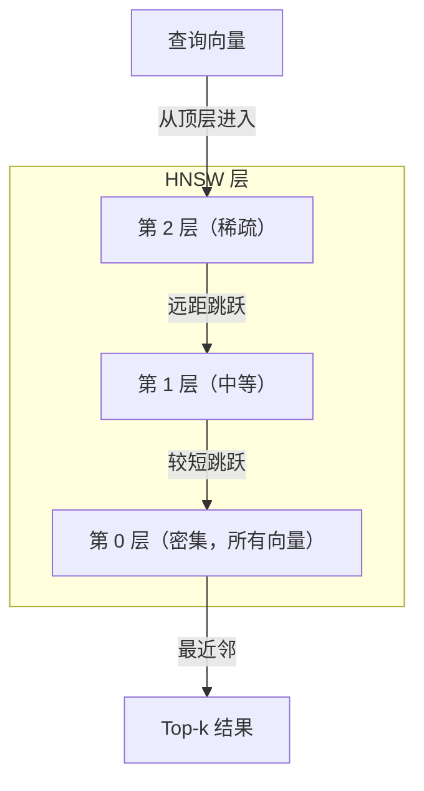

# 嵌入与向量表示

> 文本是离散的，而数学是连续的。每当你要求 LLM 查找"相似"文档、比较含义或超越关键词搜索时，你都在依赖连接这两个世界的桥梁。这座桥梁就是嵌入（embedding）。如果你不理解嵌入，你就不理解现代 AI——你只是在使用它。

**类型：** 构建
**语言：** Python
**前置要求：** 阶段 11，第 01 课（提示工程）
**时间：** ~75 分钟
**相关：** 阶段 5 · 第 22 课（嵌入模型深度研究）涵盖了密集 vs 稀疏 vs 多向量、Matryoshka 截断以及逐轴模型选择。本课侧重于生产管道（向量数据库、HNSW、相似度数学）。在选择模型之前，请先阅读阶段 5 · 第 22 课。

## 学习目标

- 使用 API 提供商和开源模型生成文本嵌入，并计算它们之间的余弦相似度
- 解释为什么嵌入能解决关键词搜索无法处理的词汇不匹配问题
- 构建一个按含义而非精确关键词匹配来检索文档的语义搜索索引
- 使用检索基准（precision@k、recall）评估嵌入质量，并为你的任务选择合适的嵌入模型

## 问题

你有 10,000 个支持工单。一位客户写道"我的付款没成功。"你需要找到相似的历史工单。关键词搜索能找到包含"付款"和"没成功"的工单。但它会漏掉"交易失败"、"扣款被拒绝"和"账单错误"。这些工单描述的是完全相同的问题，却使用了完全不同的词汇。

这就是**词汇不匹配问题**。人类语言有几十种方式来表达同一件事。关键词搜索将每个词视为独立且无意义的符号。它无法知道"被拒绝"和"没成功"指的是同一个概念。

你需要一种文本表示方式，让含义而非拼写决定相似度。你需要一种方式，将"我的付款没成功"和"交易被拒绝"在某个数学空间中放在一起，同时将"我的付款准时到账"推得远远的，尽管它们共享"付款"这个词。

这种表示方式就是嵌入。

## 概念

### 什么是嵌入？

嵌入是一个密集的浮点数向量，表示文本的含义。"密集"这个词很关键——每一个维度都携带信息，这与大多数维度为零的稀疏表示（词袋、TF-IDF）不同。

"The cat sat on the mat" 变成了类似 `[0.023, -0.041, 0.087, ..., 0.012]` 这样的形式——根据模型不同，这是一个包含 768 到 3072 个数字的列表。这些数字编码了含义。你从不直接检查它们。你只比较它们。

### Word2Vec 的突破

2013 年，Tomas Mikolov 及其在 Google 的同事发表了 Word2Vec。核心洞察是：训练一个神经网络根据上下文词预测一个词（或根据一个词预测上下文词），隐藏层的权重就变成了有意义的向量表示。

著名结果：

```
king - man + woman = queen
```

对词嵌入进行向量运算可以捕捉语义关系。从"man"到"woman"的方向与从"king"到"queen"的方向大致相同。这一刻，该领域意识到几何学可以编码含义。

Word2Vec 产生了 300 维的向量。每个词只有一个向量，不考虑上下文。"river bank"中的"bank"和"bank account"中的"bank"具有相同的嵌入。这个限制推动了接下来十年的研究。

### 从词到句子

词嵌入表示单个词元。生产系统需要嵌入整个句子、段落或文档。出现了四种方法：

**平均法**：取句子中所有词向量的均值。廉价、有损，对短文本效果出奇地好。完全丢失了词序——"dog bites man"和"man bites dog"会得到完全相同的嵌入。

**CLS 词元**：Transformer 模型（BERT，2018）会输出一个特殊的 [CLS] 词元嵌入，代表整个输入。优于平均法，但 [CLS] 词元是为下一句预测训练的，而不是为相似度。

**对比学习**：显式训练模型，将相似对推近，将不相似对推远。Sentence-BERT（Reimers & Gurevych，2019）使用了这种方法，并成为现代嵌入模型的基础。给定"How do I reset my password?"和"I need to change my password"，模型会学习到这两个句子应该具有几乎相同的向量。

**指令调优嵌入**：最新的方法。E5 和 GTE 等模型接受一个任务前缀（"search_query:"、"search_document:"），告诉模型要生成哪种嵌入。这让一个模型可以服务于多个任务。


```mermaid
graph LR
    subgraph "2013: Word2Vec"
        W1["king"] --> V1["[0.2, -0.1, ...]"]
        W2["queen"] --> V2["[0.3, -0.2, ...]"]
    end

    subgraph "2019: Sentence-BERT"
        S1["How do I reset my password?"] --> E1["[0.04, 0.12, ...]"]
        S2["I need to change my password"] --> E2["[0.05, 0.11, ...]"]
    end

    subgraph "2024: 指令调优"
        I1["search_query: password reset"] --> T1["[0.08, 0.09, ...]"]
        I2["search_document: To reset your password, click..."] --> T2["[0.07, 0.10, ...]"]
    end
```

### 现代嵌入模型

市场已经收敛到少数几种生产级选择（截至 2026 年初的 MTEB 分数，MTEB v2）：

| 模型 | 提供商 | 维度 | MTEB | 上下文 | 成本 / 1M 词元 |
|-------|----------|-----------|------|---------|------------------|
| Gemini Embedding 2 | Google | 3072 (Matryoshka) | 67.7 (检索) | 8192 | $0.15 |
| embed-v4 | Cohere | 1024 (Matryoshka) | 65.2 | 128K | $0.12 |
| voyage-4 | Voyage AI | 1024/2048 (Matryoshka) | 66.8 | 32K | $0.12 |
| text-embedding-3-large | OpenAI | 3072 (Matryoshka) | 64.6 | 8192 | $0.13 |
| text-embedding-3-small | OpenAI | 1536 (Matryoshka) | 62.3 | 8192 | $0.02 |
| BGE-M3 | BAAI | 1024 (密集+稀疏+ColBERT) | 63.0 多语言 | 8192 | 开放权重 |
| Qwen3-Embedding | Alibaba | 4096 (Matryoshka) | 66.9 | 32K | 开放权重 |
| Nomic-embed-v2 | Nomic | 768 (Matryoshka) | 63.1 | 8192 | 开放权重 |

MTEB（大规模文本嵌入基准）v2 涵盖 100 多项任务，涵盖检索、分类、聚类、重排序和摘要。分数越高越好。到 2026 年，开放权重模型（Qwen3-Embedding、BGE-M3）在大多数方面已匹配或超越封闭托管模型。Gemini Embedding 2 在纯检索方面领先；Voyage/Cohere 在特定领域（金融、法律、代码）领先。在确定方案之前，请务必在你的实际查询上进行基准测试。

### 相似度度量

给定两个嵌入向量，有三种衡量相似度的方法：

**余弦相似度**：两个向量之间夹角的余弦值。范围从 -1（相反）到 1（方向相同）。忽略幅度——一个 10 词的句子和一个 500 词的文档如果方向相同，得分可以是 1.0。这是 90% 用例的默认选择。

```
cosine_sim(a, b) = dot(a, b) / (||a|| * ||b||)
```

**点积**：两个向量的原始内积。当向量被归一化（单位长度）时与余弦相似度相同。计算更快。OpenAI 的嵌入已归一化，因此点积和余弦给出相同的排序。

```
dot(a, b) = sum(a_i * b_i)
```

**欧几里得（L2）距离**：向量空间中的直线距离。越小越相似。对幅度差异敏感。当空间中的绝对位置而非方向重要时使用。

```
L2(a, b) = sqrt(sum((a_i - b_i)^2))
```

何时使用哪种度量：

| 度量 | 使用场景 | 避免场景 |
|--------|----------|------------|
| 余弦相似度 | 比较不同长度的文本；大多数检索任务 | 幅度携带信息时 |
| 点积 | 嵌入已归一化；追求最大速度 | 向量幅度差异大时 |
| 欧几里得距离 | 聚类；空间最近邻问题 | 比较长度悬殊的文档 |

### 向量数据库与 HNSW

暴力相似度搜索将查询与每个存储的向量进行比较。在 100 万个 1536 维向量上，每次查询需要 15 亿次乘加运算。太慢了。

向量数据库通过近似最近邻（ANN）算法解决这个问题。主导算法是 HNSW（分层可导航小世界）：

1. 构建一个多层向量图
2. 顶层稀疏——远距离簇之间的长程连接
3. 底层密集——附近向量之间的细粒度连接
4. 搜索从顶层开始，贪婪地向下细化
5. 以 O(log n) 而非 O(n) 的时间返回近似 top-k 结果

HNSW 以微小的精度损失（通常 95-99% 召回率）换取巨大的速度提升。在 1000 万个向量上，暴力搜索需要数秒。HNSW 只需毫秒。


```mermaid
graph TD
    subgraph "HNSW 层"
        L2["第 2 层（稀疏）"] -->|"远距跳跃"| L1["第 1 层（中等）"]
        L1 -->|"较短跳跃"| L0["第 0 层（密集，所有向量）"]
    end

    Q["查询向量"] -->|"从顶层进入"| L2
    L0 -->|"最近邻"| R["Top-k 结果"]
```

生产选项：

| 数据库 | 类型 | 最适合 | 最大规模 |
|----------|------|----------|-----------|
| Pinecone | 托管 SaaS | 零运维生产环境 | 数十亿 |
| Weaviate | 开源 | 自托管、混合搜索 | 1 亿+ |
| Qdrant | 开源 | 高性能、过滤 | 1 亿+ |
| ChromaDB | 嵌入式 | 原型开发、本地开发 | 100 万 |
| pgvector | Postgres 扩展 | 已在使用 Postgres | 1000 万 |
| FAISS | 库 | 进程内、研究 | 10 亿+ |

### 分块策略

文档太长，无法作为单个向量嵌入。一份 50 页的 PDF 涵盖了数十个主题——它的嵌入变成了所有内容的平均值，对任何具体内容都不相似。你需要将文档拆分成块，并对每个块进行嵌入。

**固定大小分块**：每 N 个词元切一块，相邻块重叠 M 个词元。简单且可预测。当文档没有明确结构时效果良好。512 词元的块，重叠 50 词元：块 1 是词元 0-511，块 2 是词元 462-973。

**基于句子的分块**：在句子边界处分块，将句子分组直到达到词元限制。每个块至少包含一个完整的句子。优于固定大小，因为你永远不会在句子中间截断。

**递归分块**：首先尝试在最大的边界处分割（章节标题）。如果仍然太大，尝试段落边界。然后是句子边界。最后是字符限制。这就是 LangChain 的 `RecursiveCharacterTextSplitter`，它对混合格式的语料库效果良好。

**语义分块**：嵌入每个句子，然后对嵌入相似的连续句子进行分组。当嵌入相似度低于阈值时，开始一个新的块。成本高（需要单独嵌入每个句子），但能产生最连贯的块。

| 策略 | 复杂度 | 质量 | 最适合 |
|----------|-----------|---------|----------|
| 固定大小 | 低 | 尚可 | 非结构化文本、日志 |
| 基于句子 | 低 | 良好 | 文章、邮件 |
| 递归 | 中 | 良好 | Markdown、HTML、混合文档 |
| 语义 | 高 | 最佳 | 对检索质量要求严格的场景 |

大多数系统的最佳选择：256-512 词元的块，重叠 50 词元。

### 双编码器 vs 交叉编码器

双编码器独立地对查询和文档进行嵌入，然后比较向量。速度快——你将查询嵌入一次，然后与预计算的文档嵌入进行比较。这就是你用于检索的方式。

交叉编码器将查询和文档作为单个输入，输出一个相关性分数。速度慢——它通过完整的模型处理每个查询-文档对。但准确性高得多，因为它可以同时关注查询和文档中的词元。

生产模式：双编码器检索前 100 个候选，交叉编码器将它们重排序为前 10 个。这就是先检索后重排序的流水线。


```mermaid
graph LR
    Q["查询"] --> BE["双编码器：嵌入查询"]
    BE --> VS["向量搜索：top 100"]
    VS --> CE["交叉编码器：重排序"]
    CE --> R["Top 10 结果"]
```

重排序模型：Cohere Rerank 3.5（每 1000 次查询 $2）、BGE-reranker-v2（免费、开源）、Jina Reranker v2（免费、开源）。

### Matryoshka 嵌入

传统嵌入是全有或全无的。1536 维向量使用 1536 个浮点数。你不能在不重新训练的情况下将其截断为 256 维。

Matryoshka 表示学习（Kusupati 等，2022）解决了这个问题。模型经过训练，使得前 N 个维度捕获最重要的信息，就像俄罗斯套娃一样。将 1536 维的 Matryoshka 嵌入截断为 256 维会损失一些准确性，但仍然可用。

OpenAI 的 text-embedding-3-small 和 text-embedding-3-large 通过 `dimensions` 参数支持 Matryoshka 截断。请求 256 维而非 1536 维可将存储减少 6 倍，在 MTEB 基准上大约只损失 3-5% 的准确性。

### 二值量化

1536 维的嵌入以 float32 存储需要 6,144 字节。乘以 1000 万份文档：仅向量就需要 61 GB。

二值量化将每个浮点数转换为一个比特：正值变为 1，负值变为 0。存储从 6,144 字节降至 192 字节——减少了 32 倍。使用汉明距离（计算不同的比特数）计算相似度，CPU 可以在一条指令内完成。

准确性损失约为检索召回率的 5-10%。常见模式：在百万级向量的首次搜索中使用二值量化，然后使用全精度向量对 top-1000 重新评分。这能在 32 倍内存节省下获得 95% 以上的全精度准确性。

```figure
cosine-similarity
```

## 动手构建

我们将从头开始构建一个语义搜索引擎。没有向量数据库。没有外部嵌入 API。纯 Python，使用 numpy 做数学运算。

### 步骤 1：文本分块

```python
def chunk_text(text, chunk_size=200, overlap=50):
    words = text.split()
    chunks = []
    start = 0
    while start < len(words):
        end = start + chunk_size
        chunk = " ".join(words[start:end])
        chunks.append(chunk)
        start += chunk_size - overlap
    return chunks


def chunk_by_sentences(text, max_chunk_tokens=200):
    sentences = text.replace("\n", " ").split(".")
    sentences = [s.strip() + "." for s in sentences if s.strip()]
    chunks = []
    current_chunk = []
    current_length = 0
    for sentence in sentences:
        sentence_length = len(sentence.split())
        if current_length + sentence_length > max_chunk_tokens and current_chunk:
            chunks.append(" ".join(current_chunk))
            current_chunk = []
            current_length = 0
        current_chunk.append(sentence)
        current_length += sentence_length
    if current_chunk:
        chunks.append(" ".join(current_chunk))
    return chunks
```

### 步骤 2：从零构建嵌入

我们使用 TF-IDF 和 L2 归一化实现一个简单的密集嵌入。这不是神经嵌入，但它遵循相同的约定：文本输入，固定大小的向量输出，相似的文本产生相似的向量。

```python
import math
import numpy as np
from collections import Counter

class SimpleEmbedder:
    def __init__(self):
        self.vocab = []
        self.idf = []
        self.word_to_idx = {}

    def fit(self, documents):
        vocab_set = set()
        for doc in documents:
            vocab_set.update(doc.lower().split())
        self.vocab = sorted(vocab_set)
        self.word_to_idx = {w: i for i, w in enumerate(self.vocab)}
        n = len(documents)
        self.idf = np.zeros(len(self.vocab))
        for i, word in enumerate(self.vocab):
            doc_count = sum(1 for doc in documents if word in doc.lower().split())
            self.idf[i] = math.log((n + 1) / (doc_count + 1)) + 1

    def embed(self, text):
        words = text.lower().split()
        count = Counter(words)
        total = len(words) if words else 1
        vec = np.zeros(len(self.vocab))
        for word, freq in count.items():
            if word in self.word_to_idx:
                tf = freq / total
                vec[self.word_to_idx[word]] = tf * self.idf[self.word_to_idx[word]]
        norm = np.linalg.norm(vec)
        if norm > 0:
            vec = vec / norm
        return vec
```

### 步骤 3：相似度函数

```python
def cosine_similarity(a, b):
    dot = np.dot(a, b)
    norm_a = np.linalg.norm(a)
    norm_b = np.linalg.norm(b)
    if norm_a == 0 or norm_b == 0:
        return 0.0
    return float(dot / (norm_a * norm_b))


def dot_product(a, b):
    return float(np.dot(a, b))


def euclidean_distance(a, b):
    return float(np.linalg.norm(a - b))
```

### 步骤 4：带暴力搜索的向量索引

```python
class VectorIndex:
    def __init__(self):
        self.vectors = []
        self.texts = []
        self.metadata = []

    def add(self, vector, text, meta=None):
        self.vectors.append(vector)
        self.texts.append(text)
        self.metadata.append(meta or {})

    def search(self, query_vector, top_k=5, metric="cosine"):
        scores = []
        for i, vec in enumerate(self.vectors):
            if metric == "cosine":
                score = cosine_similarity(query_vector, vec)
            elif metric == "dot":
                score = dot_product(query_vector, vec)
            elif metric == "euclidean":
                score = -euclidean_distance(query_vector, vec)
            else:
                raise ValueError(f"未知度量: {metric}")
            scores.append((i, score))
        scores.sort(key=lambda x: x[1], reverse=True)
        results = []
        for idx, score in scores[:top_k]:
            results.append({
                "text": self.texts[idx],
                "score": score,
                "metadata": self.metadata[idx],
                "index": idx
            })
        return results

    def size(self):
        return len(self.vectors)
```

### 步骤 5：语义搜索引擎

```python
class SemanticSearchEngine:
    def __init__(self, chunk_size=200, overlap=50):
        self.embedder = SimpleEmbedder()
        self.index = VectorIndex()
        self.chunk_size = chunk_size
        self.overlap = overlap

    def index_documents(self, documents, source_names=None):
        all_chunks = []
        all_sources = []
        for i, doc in enumerate(documents):
            chunks = chunk_text(doc, self.chunk_size, self.overlap)
            all_chunks.extend(chunks)
            name = source_names[i] if source_names else f"doc_{i}"
            all_sources.extend([name] * len(chunks))
        self.embedder.fit(all_chunks)
        for chunk, source in zip(all_chunks, all_sources):
            vec = self.embedder.embed(chunk)
            self.index.add(vec, chunk, {"source": source})
        return len(all_chunks)

    def search(self, query, top_k=5, metric="cosine"):
        query_vec = self.embedder.embed(query)
        return self.index.search(query_vec, top_k, metric)

    def search_with_scores(self, query, top_k=5):
        results = self.search(query, top_k)
        return [
            {
                "text": r["text"][:200],
                "source": r["metadata"].get("source", "unknown"),
                "score": round(r["score"], 4)
            }
            for r in results
        ]
```

### 步骤 6：比较相似度度量

```python
def compare_metrics(engine, query, top_k=3):
    results = {}
    for metric in ["cosine", "dot", "euclidean"]:
        hits = engine.search(query, top_k=top_k, metric=metric)
        results[metric] = [
            {"score": round(h["score"], 4), "preview": h["text"][:80]}
            for h in hits
        ]
    return results
```

## 使用示例

使用生产级嵌入 API 时，架构保持不变。只有嵌入器发生变化：

```python
from openai import OpenAI

client = OpenAI()

def openai_embed(texts, model="text-embedding-3-small", dimensions=None):
    kwargs = {"model": model, "input": texts}
    if dimensions:
        kwargs["dimensions"] = dimensions
    response = client.embeddings.create(**kwargs)
    return [item.embedding for item in response.data]
```

使用 OpenAI 进行 Matryoshka 截断——同一模型，更少维度，更低存储：

```python
full = openai_embed(["semantic search query"], dimensions=1536)
compact = openai_embed(["semantic search query"], dimensions=256)
```

256 维向量使用的存储减少 6 倍。对于 1000 万份文档，这相当于 10 GB 对比 61 GB。在标准基准上准确性损失约为 3-5%。

使用 Cohere 进行重排序：

```python
import cohere

co = cohere.ClientV2()

results = co.rerank(
    model="rerank-v3.5",
    query="What is the refund policy?",
    documents=["Full refund within 30 days...", "No refunds after 90 days..."],
    top_n=3
)
```

使用本地嵌入，无需 API 依赖：

```python
from sentence_transformers import SentenceTransformer

model = SentenceTransformer("BAAI/bge-small-en-v1.5")
embeddings = model.encode(["semantic search query", "another document"])
```

我们构建中的 VectorIndex 类适用于上述任何一种方式。更换嵌入函数，保留搜索逻辑。

## 交付物

本课产生以下输出：
- `outputs/prompt-embedding-advisor.md` —— 一个用于为特定用例选择嵌入模型和策略的提示词
- `outputs/skill-embedding-patterns.md` —— 一个技能文件，教授 Agent 如何在生产中有效使用嵌入

## 练习

1. **度量比较**：对示例文档使用余弦相似度、点积和欧几里得距离运行相同的 5 个查询。记录每种度量的 top-3 结果。哪些查询的度量结果不一致？为什么？

2. **分块大小实验**：使用 50、100、200 和 500 词的分块大小对示例文档建立索引。对每种大小运行 5 个查询，记录 top-1 相似度分数。绘制分块大小与检索质量之间的关系图。找到更大分块开始损害性能的临界点。

3. **Matryoshka 模拟**：构建一个生成 500 维向量的 SimpleEmbedder。分别截断为 50、100、200 和 500 维。测量每次截断时检索召回率的下降情况。这模拟了 Matryoshka 的行为，无需使用真实的训练技巧。

4. **二值量化**：从搜索引擎获取嵌入，将其转换为二值形式（正数为 1，负数为 0），并实现汉明距离搜索。将 top-10 结果与全精度余弦相似度进行比较。测量重叠百分比。

5. **基于句子的分块**：将固定大小分块替换为 `chunk_by_sentences`。运行相同的查询并比较检索分数。尊重句子边界是否能改善结果？

## 关键术语

| 术语 | 人们怎么说 | 实际含义 |
|------|----------------|----------------------|
| 嵌入（Embedding） | "文本转数字" | 一种密集向量，其中几何接近度编码了语义相似度 |
| Word2Vec | "嵌入的鼻祖" | 2013 年的模型，通过预测上下文词学习词向量；证明了向量运算可以编码含义 |
| 余弦相似度（Cosine similarity） | "两个向量有多相似" | 向量夹角的余弦值；1 = 方向相同，0 = 正交，-1 = 相反 |
| HNSW | "快速向量搜索" | 分层可导航小世界图——支持 O(log n) 近似最近邻搜索的多层结构 |
| 双编码器（Bi-encoder） | "分别嵌入，快速比较" | 将查询和文档独立编码为向量；支持预计算和快速检索 |
| 交叉编码器（Cross-encoder） | "慢但准确的重排序器" | 通过完整模型联合处理查询-文档对；准确率更高，不支持预计算 |
| Matryoshka 嵌入 | "可截断的向量" | 经过训练的嵌入，前 N 个维度捕获最重要的信息，支持可变大小存储 |
| 二值量化（Binary quantization） | "1 比特嵌入" | 将浮点向量转换为二值（仅符号位），实现 32 倍存储缩减并使用汉明距离搜索 |
| 分块（Chunking） | "拆分文档以嵌入" | 将文档分割为 256-512 词元的片段，使每个片段可以被独立嵌入和检索 |
| 向量数据库（Vector database） | "嵌入的搜索引擎" | 专为存储向量和执行大规模近似最近邻搜索而优化的数据存储 |
| 对比学习（Contrastive learning） | "通过比较训练" | 将相似对的嵌入推近、不相似对的嵌入推远的训练方法 |
| MTEB | "嵌入基准" | 大规模文本嵌入基准——涵盖 8 项任务的 56 个数据集；比较嵌入模型的标准 |

## 延伸阅读

- Mikolov 等，《Vector Space 中词表示的高效估计》（2013）—— 以 king-queen 类比开启嵌入革命的 Word2Vec 论文
- Reimers & Gurevych，《Sentence-BERT：使用 Siamese BERT 网络的句子嵌入》（2019）—— 如何训练用于句子级相似度的双编码器，现代嵌入模型的基础
- Kusupati 等，《Matryoshka 表示学习》（2022）—— OpenAI 为 text-embedding-3 采用的可变维度嵌入技术背后的方法
- Malkov & Yashunin，《使用分层可导航小世界图的高效且鲁棒的近似最近邻搜索》（2018）—— HNSW 论文，大多数生产级向量搜索背后的算法
- OpenAI 嵌入指南（platform.openai.com/docs/guides/embeddings）—— text-embedding-3 模型（包括 Matryoshka 维度缩减）的实用参考
- MTEB 排行榜（huggingface.co/spaces/mteb/leaderboard）—— 实时基准，跨任务和语言比较所有嵌入模型
- [Muennighoff 等，《MTEB：大规模文本嵌入基准》（EACL 2023）](https://arxiv.org/abs/2210.07316) —— 定义了排行榜报告的 8 个任务类别（分类、聚类、配对分类、重排序、检索、语义文本相似度、摘要、双语文本挖掘）的基准；在相信任何单一 MTEB 分数之前请先阅读此文。
- [Sentence Transformers 文档](https://www.sbert.net/) —— 关于双编码器与交叉编码器、池化策略以及本课实现的摄取-分割-嵌入-存储 RAG 流水线的权威参考。
