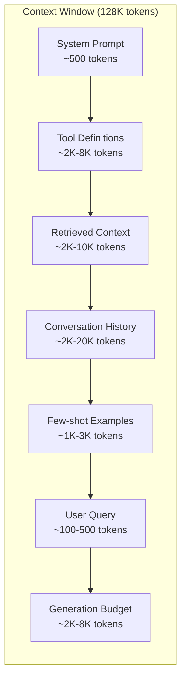

# Context Engineering: Windows, Budgets, Memory, and Retrieval

> Prompt engineeringは一部にすぎません。Context engineeringは全体です。promptは入力する文字列ですが、contextはsystem instructions、retrieved documents、tool definitions、conversation history、few-shot examples、prompt自体など、modelのwindowへ入るすべてです。2026年の優れたAI engineerはcontext engineerです。何を入れ、何を除外し、どの順序にするかを決めます。

**種別:** 構築
**言語:** Python
**前提条件:** Phase 10 (LLMs from Scratch), Phase 11 Lesson 01-02
**所要時間:** 約90分
**Related:** Phase 11 · 15 (Prompt Caching) はcacheしやすいlayoutを扱い、context engineeringの延長です。Phase 5 · 28 (Long-Context Evaluation) はNIAH/RULERでlost-in-the-middleを測る方法を扱います。

## Learning Objectives

- system prompt、tools、history、retrieved docs、generation headroomをまたぐtoken budgetを計算する
- conversation historyに対してtruncation、summarization、sliding windowなどのcontext window管理戦略を実装する
- modelの注意が最も関連する情報へ向くようにcontext componentsを優先順位付けし、並べる
- query typeと利用可能なwindow容量に応じてtokensを動的配分するcontext assemblerを構築する

## 問題

Claude Opus 4.7は200K token window（betaでは1M）を持ちます。GPT-5は400K、Gemini 3 Proは2M、Llama 4は10Mを主張します。巨大に見えますが、実際にはすぐ埋まります。

coding assistantの内訳を考えます。System promptは500 tokens。50個のtool definitionsは8,000 tokens。Retrieved documentationは4,000 tokens。10ターンのconversation historyは6,000 tokens。現在のuser queryは200 tokens。generation budgetは4,000 tokens。合計22,700 tokensで、128K windowの18%にすぎません。

しかしattentionはcontext lengthに対して線形に良くなるわけではありません。vanilla transformerではattention costはO(n^2)で増えますし、多くのproduction modelが効率的なattention variantを使っていても、retrieval accuracyは低下します。Needle in a Haystack testは、長いcontextの中央に置かれた情報をmodelが見つけにくいことを示しました。Liu et al. (2023) は、LLMが長いcontextの先頭と末尾の情報は高精度で取得する一方、中央（contextの40-70%付近）の情報では精度が10-20%落ちることを示しています。

実務上の教訓は明確です。200K tokensが使えることと、200K tokensを使うことが有効であることは違います。慎重に選んだ10K token contextは、雑に詰めた100K token contextを上回ることがよくあります。Context engineeringは、context window内のsignal-to-noise ratioを最大化する訓練です。

## The Concept

### The Context Window is a Scarce Resource

context windowはdiskではなくRAMだと考えます。高速で直接参照できますが、限られています。すべては入りません。選ぶ必要があります。

各componentは容量を奪い合います。tool definitionsを増やせばconversation historyの余地は減ります。retrieved contextを増やせばfew-shot examplesの余地が減ります。Context engineeringは、task performanceを最大化するようこの予算を配分する技術です。

### Lost-in-the-Middle

context engineeringで最も重要な経験的発見です。modelはcontextの先頭と末尾にある情報へより強く注意します。中央の情報はattention scoreが下がり、無視されやすくなります。

Liu et al. (2023) は、20個の無関係文書の中に関連文書を1つ置き、位置を変えてanswer accuracyを測りました。関連文書が最初または最後にあるとaccuracyは85-90%でしたが、中央（20個中10番目）では60-70%に落ちました。

直接的な設計上の含意があります。

- 最重要情報は先頭に置く（system prompt、critical instructions）
- 現在のqueryと最も関連するcontextは末尾に置く（recency biasが効く）
- context中央は最低優先度の領域として扱う
- 中央に情報を入れる必要がある場合、key pointを末尾でも繰り返す

### Context Components

**System prompt**: persona、constraints、behavioral rulesを設定します。最初に置かれ、turnをまたいで一定です。短く保ちます。system promptのすべての単語はAPI callごとに繰り返されます。

**Tool definitions**: 各toolはname、description、parameter schemaで50-200 tokensを追加します。50 tools x 150 tokensなら会話前に7,500 tokensです。現在のqueryに関係するtoolだけ含めるdynamic tool selectionで60-80%削減できます。

**Retrieved context**: vector database、search results、file contentsなどから得た文書です。retrieval品質がresponse品質を直接決めます。悪いretrievalはwindowをnoiseで埋め、modelを誤誘導するため、retrievalなしより悪いことがあります。

**Conversation history**: 過去のuser messageとassistant responseです。会話長に線形に増えます。50ターン、1ターン200 tokensなら10,000 tokensで、その多くは現在のqueryに不要です。

**Few-shot examples**: 望ましい振る舞いを示すinput/output pairです。よく選んだ2-3例は、何千tokenものinstructionsより品質を上げることがありますが、容量を使います。

**Generation budget**: modelのresponse用に予約するtokensです。windowを完全に埋めるとanswerする余地がありません。少なくとも2,000-4,000 tokensを予約します。

### Context Compression Strategies

**History summarization**: すべての過去turnを逐語保持せず、定期的に会話を要約します。「Xを議論し、Yを決定し、userはZを望んでいる」という100 tokensで、2,000 tokensの10ターンを置き換えられます。

**Relevance filtering**: 各retrieved documentをcurrent queryに対してscoreし、しきい値未満を落とします。10 chunks取得して3つだけ関連するなら、残り7つは捨てます。

**Tool pruning**: user query intentを分類し、そのintentに関係するtoolだけ含めます。code questionにcalendar toolsは不要です。scheduling questionにfile system toolsは不要です。

**Recursive summarization**: 非常に長い文書では段階的に要約します。sectionごとに要約し、その要約をさらに要約します。50-page documentをkey points入りの500-token digestにできます。

### Memory Systems

Context engineeringは3つの時間軸を扱います。

**Short-term memory**: 現在の会話。context windowへ直接入ります。各turnで増え、summarizationとtruncationで管理します。

**Long-term memory**: 会話をまたいで残る事実や好みです。「user prefers TypeScript」「project uses PostgreSQL」など。databaseに保存し、session startで取得します。

**Episodic memory**: 関連する可能性がある過去の具体的なinteractionです。「先週auth moduleで似た問題をdebugした」など。embeddingとして保存し、現在の会話と似ているときに取得します。

### Dynamic Context Assembly

重要な洞察は、queryごとに必要なcontextが違うことです。static system prompt + static tools + static historyは浪費です。良いsystemはqueryごとにcontextを動的に組み立てます。

1. query intentを分類する
2. relevant toolsを選ぶ（全toolsではない）
3. relevant documentsを取得する（固定集合ではない）
4. relevant history turnsを含める（全historyではない）
5. task typeに合うfew-shot examplesを追加する
6. criticalを先頭、importantを末尾、optionalを中央に置く

modelは同じでもcontextが違えば結果は変わります。良いAI applicationと優れたAI applicationを分けるのは、多くの場合contextです。

## 実装

このlessonでは、token counter、budget manager、lost-in-the-middle reorder、conversation compressor、dynamic tool selector、full context assembly pipelineを実装します。実装は `code/main.py` と `code/main.ts` にあります。中心となる考え方は、各componentのtokensを測り、上限を設け、queryごとにsystem prompt、tools、retrieved context、history、user queryを再構成することです。

## Use It

### Claude Code's Context Strategy

Claude Codeはlayered approachでcontextを管理します。system promptにはbehavioral rulesとtool definitionsが含まれます。fileを開くと内容がcontextへ注入され、searchするとresultsが追加されます。古いconversation turnsは要約され、CLAUDE.mdはsessionsをまたいで残るlong-term memoryを提供します。

重要なengineering判断は、codebase全体をcontextへdumpしないことです。必要に応じて関連fileを取得します。これが実践としてのcontext engineeringです。

### Cursor's Dynamic Context Loading

Cursorはcodebase全体をembeddingsへindexします。queryを入力すると、vector similarityで最も関連するfilesとcode blocksを取得します。context windowに入るのはその部分だけです。500K-line codebaseも、5-10個の最関連code blocksへ圧縮されます。

### ChatGPT Memory

ChatGPTはuser preferencesとfactsをlong-term memoryとして保存します。各conversation startで関連memoryが取得され、system promptに含められます。「The user prefers Python」は5 tokens程度ですが、会話をまたいで何百tokensもの繰り返し指示を節約します。

### RAG as Context Engineering

Retrieval-Augmented Generationは形式化されたcontext engineeringです。知識をmodel weights（training）やsystem prompt（static context）へ詰める代わりに、query timeで関連documentsを取得してcontext windowへ注入します。chunking、embedding、retrieval、rerankingからなるRAG pipeline全体は、正しい情報をcontext windowに置くためにあります。

## Ship It

このlessonは `outputs/prompt-context-optimizer.md` を生成します。これはcontext assembly strategyを監査し、最適化を提案する再利用可能なpromptです。system prompt、tool count、average history length、retrieval strategyを渡すと、token wasteを見つけて改善案を出します。

また `outputs/skill-context-engineering.md` も生成します。これはtask type、context window size、latency budgetに基づいてcontext assembly pipelinesを設計するdecision frameworkです。

## Exercises

1. ContextBudget classに「token waste detector」を追加します。予算の30%以上を使うcomponentsをflagし、component typeごとのcompression strategyを提案してください。
2. retrieved contextのsemantic deduplicationを実装します。2つのdocumentsが80%以上似ていれば、高scoreの方だけ残します。
3. 「context replay」toolを作ります。conversation transcriptをContextEngineに流し、turnごとのbudget allocation変化を可視化します。
4. priority-based tool selectorを実装します。binary include/excludeではなく、current queryへのrelevance scoreを各toolに付け、budgetが尽きるまで高score順に含めます。
5. multi-strategy context compressorを作ります。truncation、summarization、key sentence extractionを実装し、compression ratioとinformation retentionのtradeoffを測ります。

## Key Terms

| Term | What people say | What it actually means |
|------|----------------|----------------------|
| Context window | 「modelが読める量」 | modelが1回のforward passで処理できる最大tokens（input + output） |
| Context engineering | 「高度なprompt engineering」 | context windowへ何を、どの順序で、どの優先度で入れるかを決める discipline |
| Lost-in-the-middle | 「modelは中央を忘れる」 | contextの先頭と末尾に比べ、中央の情報でaccuracyが落ちる経験的現象 |
| Token budget | 「残りtokens」 | system prompt、tools、history、retrieval、generationへの明示的な容量配分 |
| Dynamic context | 「必要に応じて読み込む」 | intent classification、tool selection、retrieval resultsに基づきqueryごとにcontextを組み立てること |
| History summarization | 「会話を圧縮する」 | 古い会話turnを簡潔なsummaryに置き換えること |
| Tool pruning | 「関係するtoolsだけ入れる」 | query intentを分類し、一致するtool definitionsだけ含めること |
| Long-term memory | 「sessionsをまたいで覚える」 | databaseに保存され、session startで取得されるfactsやpreferences |
| Episodic memory | 「過去の具体的な出来事を覚える」 | past interactionsをembeddingsとして保存し、類似queryで取得すること |
| Generation budget | 「回答用の余地」 | model output用に予約するtokens |

## 参考文献

- [Liu et al., 2023 -- "Lost in the Middle: How Language Models Use Long Contexts"](https://arxiv.org/abs/2307.03172) -- position-dependent attentionの決定的研究
- [Anthropic's Contextual Retrieval blog post](https://www.anthropic.com/news/contextual-retrieval) -- context-aware chunk retrievalの実践
- [Simon Willison's "Context Engineering"](https://simonwillison.net/2025/Jun/27/context-engineering/) -- このdisciplineを名付け、prompt engineeringと区別した記事
- [LangChain documentation on RAG](https://python.langchain.com/docs/tutorials/rag/) -- context engineering patternとしてのRAG実装
- [Greg Kamradt's Needle in a Haystack test](https://github.com/gkamradt/LLMTest_NeedleInAHaystack) -- position-dependent retrieval failuresを示したbenchmark
- [Pope et al., "Efficiently Scaling Transformer Inference" (2022)](https://arxiv.org/abs/2211.05102) -- context lengthがmemoryとlatencyに与える影響
- [Agrawal et al., "SARATHI" (2023)](https://arxiv.org/abs/2308.16369) -- long promptsがTTFTとTPOTに与える実務的影響
- [Ainslie et al., "GQA" (EMNLP 2023)](https://arxiv.org/abs/2305.13245) -- KV memoryを削減するgrouped-query attention
