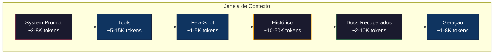

# Context Engineering: Janelas, Orçamentos, Memória e Retrieval

> Prompt engineering é um subconjunto. Context engineering é o jogo inteiro. Um prompt é uma string que você digita. Contexto é tudo que entra na janela do modelo: instruções do sistema, documentos recuperados, definições de tools, histórico de conversa, exemplos few-shot e o próprio prompt. Os melhores engenheiros de IA em 2026 são engenheiros de contexto. Eles decidem o que entra, o que fica de fora e em que ordem.

**Tipo:** Construção
**Linguagens:** Python
**Pré-requisitos:** Fase 10 (LLMs do Zero), Fase 11 Aulas 01-02
**Tempo:** ~90 minutos
**Relacionado:** Fase 11 · 15 (Prompt Caching) — o layout amigável a cache é uma extensão do context engineering. Fase 5 · 28 (Long-Context Evaluation) para como medir lost-in-the-middle com NIAH/RULER.

## Objetivos de Aprendizado

- Calcular orçamentos de token em todos os componentes da janela de contexto (system prompt, tools, history, docs recuperados, espaço para geração)
- Implementar estratégias de gerenciamento da janela de contexto: truncamento, sumarização e sliding window para histórico de conversa
- Priorizar e ordenar componentes de contexto para maximizar a atenção do modelo nas informações mais relevantes
- Construir um montador de contexto que aloca tokens dinamicamente baseado no tipo de consulta e espaço disponível na janela

## O Problema

Claude Opus 4 tem uma janela de contexto de 200K tokens. Parece muito. Mas vamos contar:

- System prompt: ~4.000 tokens
- Definições de tools: ~8.000 tokens (20 ferramentas com schemas)
- Exemplos few-shot: ~3.000 tokens
- Histórico da conversa: ~50.000 tokens (20 turnos)
- Documentos recuperados: ~10.000 tokens
- Espaço para resposta: ~4.000 tokens

Total: ~79.000 tokens. Ainda cabe. Mas quando o histórico cresce para 40 turnos e você precisa de 50 documentos recuperados, estoura. O modelo começa a ignorar informações do meio (lost-in-the-middle) ou você precisa truncar — e perde dados que importam.

## O Conceito

### A Anatomia da Janela de Contexto



### Lost-in-the-Middle

Estudos mostram que LLMs prestam mais atenção ao início e fim do contexto. Informações no meio sofrem queda de 10-20% na acurácia. A solução: reposicionar documentos mais relevantes no início e fim, menos relevantes no meio.

```python
def reorder_lost_in_middle(documents, scores):
    """Reordena documentos colocando os mais relevantes no início e fim."""
    paired = list(zip(documents, scores))
    paired.sort(key=lambda x: x[1], reverse=True)
    
    reordered = []
    for i, (doc, score) in enumerate(paired):
        if i % 2 == 0:
            reordered.append(doc)  # Posições ímpares: início
        else:
            reordered.insert(0, doc)  # Posições pares: fim
    return reordered
```

### Gerenciamento de Orçamento de Token

```python
class ContextBudget:
    def __init__(self, total_budget=128000):
        self.total = total_budget
        self.allocation = {
            "system_prompt": 4000,
            "tools": 8000,
            "few_shot": 3000,
            "history": 0,  # Dinâmico
            "retrieval": 0,  # Dinâmico
            "generation": 4000,
        }
    
    def calculate_remaining(self):
        fixed = sum(v for k, v in self.allocation.items() 
                   if k not in ["history", "retrieval"])
        return self.total - fixed
    
    def allocate_dynamic(self, history_ratio=0.6, retrieval_ratio=0.4):
        remaining = self.calculate_remaining()
        self.allocation["history"] = int(remaining * history_ratio)
        self.allocation["retrieval"] = int(remaining * retrieval_ratio)
        return self.allocation
    
    def fits(self, new_content, component):
        current = self.allocation.get(component, 0)
        return current + new_content <= self.total
```

### Seleção Dinâmica de Tools

Em vez de mandar todas as ferramentas no prompt, classifique a intenção da consulta e inclua apenas as relevantes:

```python
TOOL_DEFINITIONS = {
    "code": {"name": "code_execution", "tokens": 200},
    "search": {"name": "web_search", "tokens": 150},
    "database": {"name": "db_consulta", "tokens": 180},
    "calendar": {"name": "calendar_api", "tokens": 120},
    "email": {"name": "send_email", "tokens": 160},
}

def classify_intent(consulta):
    intents = []
    q = consulta.lower()
    if any(w in q for w in ["código", "code", "executar", "python"]):
        intents.append("code")
    if any(w in q for w in ["buscar", "search", "encontrar", "web"]):
        intents.append("search")
    if any(w in q for w in ["banco", "database", "sql", "consulta"]):
        intents.append("database")
    if any(w in q for w in ["reunião", "meeting", "agenda", "calendário"]):
        intents.append("calendar")
    if any(w in q for w in ["email", "enviar", "mandar"]):
        intents.append("email")
    return intents if intents else ["search"]

def select_tools(consulta, max_tokens=5000):
    intents = classify_intent(consulta)
    selected = {}
    total_tokens = 0
    for intent in intents:
        ferramenta = TOOL_DEFINITIONS.get(intent)
        if ferramenta and total_tokens + tool["tokens"] <= max_tokens:
            selected[tool["name"]] = tool
            total_tokens += tool["tokens"]
    return selected, total_tokens
```

### Sumarização de Histórico

```python
def summarize_history(conversation, max_turns=5):
    """Mantém os últimos N turnos e sumariza os anteriores."""
    if len(conversation) <= max_turns:
        return conversation
    
    old_turns = conversation[:-max_turns]
    recent_turns = conversation[-max_turns:]
    
    summary = f"[Resumo da conversa anterior]: "
    summary += f"O usuário perguntou sobre {len(old_turns)} tópicos. "
    summary += "Pontos principais: " + "; ".join(
        turn["content"][:50] for turn in old_turns[:3]
    )
    
    return [{"role": "system", "content": summary}] + recent_turns
```

## Use

### Estratégias de Contexto na Prática

```python
# Claude Code: contexto em camadas
# - System prompt com regras comportamentais (~6K tokens)
# - Arquivos abertos injetados como contexto
# - Resultados de busca adicionados
# - Turnos antigos sumarizados
# - CLAUDE.md como memória de longo prazo

# ChatGPT Memory:
# - Preferências do usuário armazenadas como memória
# - "O usuário prefere Python" custa 5 tokens
# - Economiza centenas de tokens de instruções repetidas

# Cursor:
# - Indexa codebase inteiro em embeddings
# - Busca os arquivos mais relevantes por consulta
# - Apenas esses pedaços entram na janela
```

## Entregue

Esta aula produz `outputs/prompt-context-optimizer.md` — um prompt reutilizável que audita uma estratégia de montagem de contexto e recomenda otimizações.

Também produz `outputs/skill-context-engineering.md` — um framework de decisão para projetar pipelines de montagem de contexto baseado no tipo de tarefa, tamanho da janela e orçamento de latência.

## Exercícios

1. Adicione um "detector de desperdício de token" à classe ContextBudget. Ele deve sinalizar componentes usando mais de 30% do orçamento.

2. Implemente deduplicação semântica para contexto recuperado. Se dois documentos recuperados são mais de 80% similares, mantenha apenas o de maior pontuação.

3. Construa uma ferramenta de "replay de contexto". Dada uma transcrição de conversa, reabra-a pela ContextEngine e visualize como a alocação de orçamento muda a cada turno.

4. Implemente um seletor de ferramentas baseado em prioridade. Em vez de incluir/excluir binariamente, atribua uma pontuação de relevância a cada tool.

5. Construa um compressor de contexto multi-estratégia. Implemente três estratégias (truncamento, sumarização, extração de frases-chave) e faça benchmark em 20 documentos.

## Termos-Chave

| Termo | O que o pessoal diz | O que realmente significa |
|-------|--------------------|-----------------------|
| Context window | "Quanto o modelo lê" | Número máximo de tokens (entrada + saída) que o modelo processa em uma única passagem |
| Context engineering | "Prompt engineering avançado" | Disciplina de decidir o que entra na janela de contexto, em que ordem e com que prioridade |
| Lost-in-the-middle | "Modelos esquecem do meio" | Empírico: LLMs prestam mais atenção ao início e fim do contexto, com queda de 10-20% no meio |
| Token budget | "Quantos tokens sobram" | Alocação explícita da capacidade da janela entre componentes com limites por componente |
| Dynamic context | "Carregar coisas em tempo real" | Montar a janela de contexto diferente para cada consulta baseado em classificação de intenção |

## Leitura Adicional

- [Liu et al., 2023 — "Lost in the Middle"](https://arxiv.org/abs/2307.03172) — estudo definitivo sobre atenção dependente de posição
- [Simon Willison's "Context Engineering"](https://simonwillison.net/2025/Jun/27/context-engineering/) — o post que nomeou a disciplina
- [Anthropic's Contextual Retrieval](https://www.anthropic.com/news/contextual-retrieval) — como a Anthropic aborda chunk retrieval consciente de contexto
- [Pope et al., "Efficiently Scaling Transformer Inference" (2022)](https://arxiv.org/abs/2211.05102) — por que comprimento de contexto gera memória e latência
