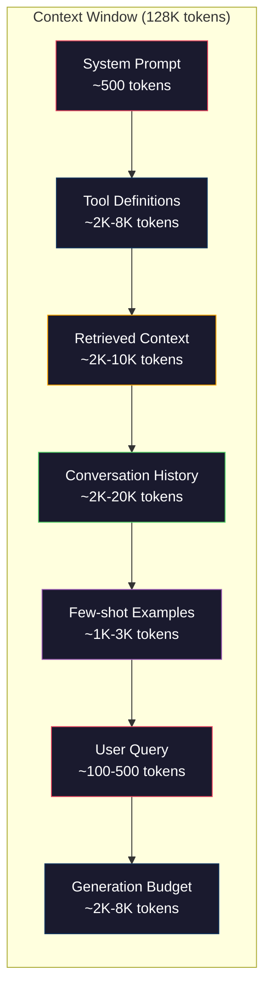
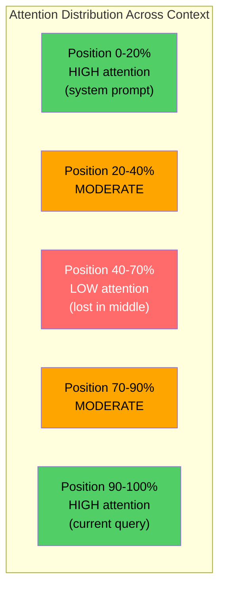
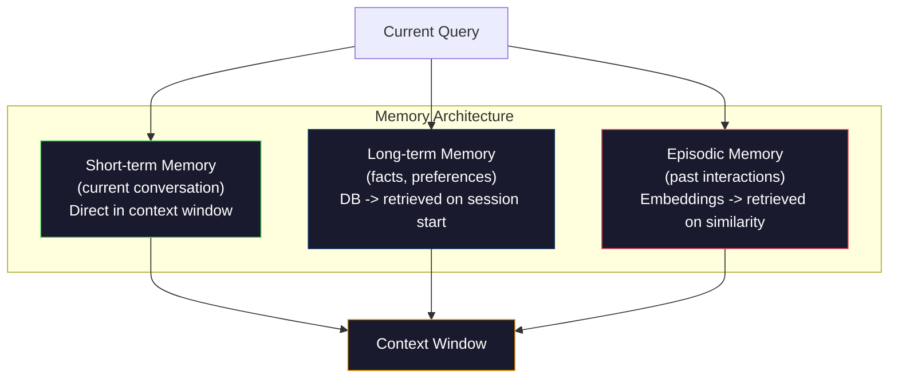

# Bağlam Mühendisliği: Windows, Bütçeler, Bellek ve Erişim

> Prompt mühendislik bir alt kümedir. Bağlam mühendisliği oyunun tamamıdır. prompt yazdığınız bir dizedir. Context is everything that goes into the model's window: system instructions, retrieved documents, tool definitions, conversation history, few-shot examples, and the prompt itself. 2026'nın en iyi yapay zeka mühendisleri bağlam mühendisleridir. Neyin gireceğine, neyin dışarıda kalacağına ve hangi sırayla karar veriyorlar.

**Tür:** Yapım
**Diller:** Python
**Önkoşullar:** Aşama 10 (Sıfırdan Yüksek Lisans), Aşama 11 Ders 01-02
**Süre:** ~90 dakika
**İlgili:** Aşama 11 · 15 (Prompt Önbelleğe Alma) — önbellek dostu düzen, bağlam mühendisliğinin bir uzantısıdır. NIAH/RULER ile ortada kaybolmanın nasıl ölçüleceğine ilişkin Aşama 5 · 28 (Uzun Bağlam Değerlendirmesi).

## Öğrenme Hedefleri

- Tüm context window bileşenlerinde token bütçelerini hesaplayın (sistem prompt, araçlar, geçmiş, alınan belgeler, nesil boşluk payı)
- context window yönetim stratejilerini uygulayın: konuşma geçmişi için kesme, özetleme ve kayan pencere
- Modelin en alakalı bilgilere olan ilgisini en üst düzeye çıkarmak için bağlam bileşenlerini önceliklendirin ve sıralayın
- token'leri sorgu türüne ve kullanılabilir pencere alanına göre dinamik olarak tahsis eden bir bağlam birleştirici oluşturun

## Sorun

Claude Opus 4.7, 200K token penceresine sahiptir (betada 1M). GPT-5'te 400K var. Gemini 3 Pro'da 2M var. Lama 4, 10 milyon iddia ediyor. Bu sayılar siz onları doldurana kadar kulağa çok büyük geliyor.

İşte bir kodlama asistanı için gerçek bir döküm. Sistem prompt: 500 token. 50 takım için takım tanımları: 8.000 token. Alınan belgeler: 4.000 token. Konuşma geçmişi (10 dönüş): 6.000 token. Mevcut kullanıcı sorgusu: 200 token. Üretim bütçesi (maksimum çıkış): 4.000 token. Toplam: 22.700 token. Bu, 128K pencerenin yalnızca %18'idir.

Ancak dikkat, bağlam uzunluğuyla doğrusal olarak ölçeklenmez. 128K token bağlamına sahip bir model, ikinci dereceden dikkat maliyeti (olağan transformer'lerde O(n^2)) öder, ancak çoğu üretim modeli verimli dikkat varyantlarını kullanır). Daha da önemlisi, erişim doğruluğu azalır. "Samanlıktaki İğne" testi, modellerin uzun bağlamların ortasına yerleştirilen bilgileri bulmakta zorlandığını gösteriyor. Liu ve arkadaşlarının araştırması. (2023), LLM'lerin uzun bağlamların başında ve sonunda bilgiyi neredeyse mükemmel bir doğrulukla aldığını, ancak ortaya yerleştirilen bilgiler için doğruluğun %10-20 düştüğünü (bağlamın %40-70'i konumları) gösterdi. Bu "ortada kaybolma" etkisi modele göre değişir ancak mevcut tüm mimarileri etkiler.

Pratik ders: 200 bin token'nin mevcut olması, 200 bin token kullanmanın etkili olduğu anlamına gelmez. Dikkatlice seçilmiş bir 10K token bağlamı çoğu zaman dökümlü bir 100K token bağlamından daha iyi performans gösterir. Bağlam mühendisliği, context window dahilinde sinyal-gürültü oranını en üst düzeye çıkarma disiplinidir.

Pencereye yerleştirdiğiniz her token, daha alakalı bilgiler taşıyabilecek bir token'nin yerini alır. Her alakasız araç tanımı, her bayat konuşma akışı, soruyu yanıtlamayan her metin parçası, modelin görevini biraz daha kötü yapmasına neden olur.

## Konsept

### Context Window Kıt Bir Kaynaktır

context window'yi disk değil RAM olarak düşünün. Hızlıdır ve doğrudan erişilebilirdir ancak sınırlıdır. Her şeye uyum sağlayamazsınız. Seçmelisiniz.



Her bileşen alan için rekabet eder. Daha fazla araç tanımı eklemek, konuşma geçmişi için daha az yer anlamına gelir. Daha fazla geri getirilen bağlamın eklenmesi, birkaç çekimli örnekler için daha az yer anlamına gelir. Bağlam mühendisliği, bu bütçeyi görev performansını en üst düzeye çıkarmak için tahsis etme sanatıdır.

### Ortada Kayıp

Bağlam mühendisliğindeki en önemli ampirik bulgu. Modeller, bağlamın başındaki ve sonundaki bilgilere daha iyi katılırlar. Ortadaki bilgiler daha düşük dikkat puanı alır ve göz ardı edilme olasılığı daha yüksektir.

Liu ve diğerleri. (2023) bunu sistematik olarak test etti. İlgisiz 20 belgenin arasına ilgili bir belgeyi çeşitli konumlara yerleştirdiler ve yanıtın doğruluğunu ölçtüler. İlgili belge ilk veya son olduğunda doğruluk %85-90 idi. Ortadayken (20 konum 10) doğruluk %60-70'e düştü.

Bunun doğrudan mühendislik sonuçları vardır:

- En önemli bilgiyi ilk sıraya koyun (prompt sistemi, kritik talimatlar)
- Geçerli sorguyu ve en alakalı bağlamı en sona koyun (yenilik eğilimi yardımcı olur)
- Bağlamın ortasını en düşük öncelikli bölge olarak ele alın
- Ortaya bilgi eklemeniz gerekiyorsa, sondaki anahtar noktayı kopyalayın



### Bağlam Bileşenleri

**Sistem prompt**: kişiliği, kısıtlamaları ve davranış kurallarını belirler. Bu önce gider ve dönüşler boyunca sabit kalır. Claude Code, prompt sistemi için araç tanımları ve davranış talimatları dahil olmak üzere yaklaşık 6.000 token kullanıyor. Sıkı tut. prompt sistemindeki her kelime, her API çağrısında tekrarlanır.

**Araç tanımları**: her araç 50-200 token (ad, açıklama, parametre şeması) ekler. Herhangi bir konuşma gerçekleşmeden önce 150 token'deki 50 aracın her biri 7.500 token'dir. Yalnızca mevcut sorguyla ilgili araçları içeren dinamik araç seçimi, bunu %60-80 oranında azaltabilir.

**Alınan içerik**: vector database'deki belgeler, arama sonuçları, dosya içerikleri. Erişimin kalitesi doğrudan yanıtın kalitesini belirler. Kötü geri alma, hiç almamaktan daha kötüdür; pencereyi gürültüyle doldurur ve modeli aktif olarak yanıltır.

**Konuşma geçmişi**: önceki tüm kullanıcı mesajları ve asistan yanıtları. Konuşma uzunluğuyla doğrusal olarak büyür. Tur başına 200 token ile 50 turluk bir konuşma, 10.000 token geçmişidir. Çoğunun mevcut sorguyla alakası yok.

**Birkaç örnek**: istenen davranışı gösteren giriş/çıkış çiftleri. İyi seçilmiş iki ila üç örnek genellikle çıktı kalitesini binlerce token talimattan daha fazla artırır. Ama yer kaplıyorlar.

**Nesil bütçesi**: Modelin yanıtı için ayrılan token'ler. Pencereyi kapasitesine kadar doldurursanız modelin yanıt verecek yeri kalmaz. Oluşturma için en az 2.000-4.000 token ayırın.

### Bağlam Sıkıştırma Stratejileri

**Geçmişi özetleme**: Önceki tüm dönüşleri kelimesi kelimesine tutmak yerine, konuşmayı periyodik olarak özetleyin. 100 token'deki "X'i tartıştık, Y'ye karar verdik ve kullanıcı Z istiyor", 2.000 token alan 10 dönüşün yerini alıyor. Geçmiş bir eşiği (e.g., 5.000 token) aştığında özetlemeyi çalıştırın.

**İlgililik filtreleme**: Alınan her belgeyi geçerli sorguya göre puanlayın ve belgeleri bir eşiğin altına bırakın. 10 parça aldıysanız ancak yalnızca 3 tanesi alakalıysa, diğer 7 parçayı atın. 10 vasat parça yerine yüksek düzeyde alakalı 3 parçaya sahip olmak daha iyidir.

**Araç budama**: Kullanıcının sorgu amacını sınıflandırın ve yalnızca bu amaç ile ilgili araçları ekleyin. Kod sorusunun takvim araçlarına ihtiyacı yoktur. Bir planlama sorusunun dosya sistemi araçlarına ihtiyacı yoktur. Bu, takım tanımlarını 8.000 token'den 1.000'e düşürebilir.

**Yinelemeli özetleme**: Çok uzun belgeler için aşamalar halinde özetleyin. Önce her bölümü özetleyin, ardından özetleri özetleyin. 50 sayfalık bir belge, önemli noktaları yakalayan 500-token özete dönüşür.

### Bellek Sistemleri

Bağlam mühendisliği üç zaman dilimini kapsar.

**Kısa süreli hafıza**: mevcut konuşma. Doğrudan context window'de saklanır. Her dönüşte büyür. Özetleme ve kesme ile yönetilir.

**Uzun süreli hafıza**: konuşmalar boyunca kalıcı olan gerçekler ve tercihler. "Kullanıcı TypeScript'i tercih ediyor." "Proje PostgreSQL kullanıyor." Bir veritabanında saklanır, oturum başlangıcında alınır. Claude Code bunu CLAUDE.md dosyalarında saklar. ChatGPT bunu kendi hafıza özelliğinde saklar.

**Olaysal bellek**: alakalı olabilecek belirli geçmiş etkileşimler. "Geçen Salı, kimlik doğrulama modülünde benzer bir sorunun hatalarını ayıkladık." embedding'ler olarak saklanır ve mevcut konuşma geçmiş bir bölümle eşleştiğinde alınır.



### Dinamik Bağlam Düzeneği

Temel fikir: farklı sorguların farklı bağlamlara ihtiyacı vardır. Statik bir sistem prompt + statik araçlar + statik geçmiş israftır. En iyi sistemler, sorgu başına bağlamı dinamik olarak birleştirir.

1. Sorgu amacını sınıflandırın
2. İlgili araçları seçin (tüm araçları değil)
3. İlgili belgeleri alın (sabit bir dizi değil)
4. İlgili geçmiş dönüşleri dahil edin (geçmişin tamamını değil)
5. Görev türüne uygun birkaç çekimlik örnekler ekleyin
6. Her şeyi önemine göre sıralayın: önce kritik, sonda önemli, ortada isteğe bağlı

İyi bir yapay zeka uygulamasını harika bir uygulamadan ayıran şey budur. Model aynı. Bağlam farklılaştırıcıdır.

## İnşa Et

### Adım 1: Token Sayacı

Ölçemediğiniz şeyin bütçesini yapamazsınız. Basit bir token sayacı oluşturun (tam sayı tokenizer'ye bağlı olduğundan boşluk bölmeyi kullanarak yaklaşık hesaplama yapın).

```python
import json
import numpy as np
from collections import OrderedDict

def count_tokens(text):
    if not text:
        return 0
    return int(len(text.split()) * 1.3)

def count_tokens_json(obj):
    return count_tokens(json.dumps(obj))
```

### Adım 2: Bağlam Bütçe Yöneticisi

Temel soyutlama. Bir bütçe yöneticisi, her bir bileşenin kaç token kullandığını ve limitleri uyguladığını izler.

```python
class ContextBudget:
    def __init__(self, max_tokens=128000, generation_reserve=4000):
        self.max_tokens = max_tokens
        self.generation_reserve = generation_reserve
        self.available = max_tokens - generation_reserve
        self.allocations = OrderedDict()

    def allocate(self, component, content, max_tokens=None):
        tokens = count_tokens(content)
        if max_tokens and tokens > max_tokens:
            words = content.split()
            target_words = int(max_tokens / 1.3)
            content = " ".join(words[:target_words])
            tokens = count_tokens(content)

        used = sum(self.allocations.values())
        if used + tokens > self.available:
            allowed = self.available - used
            if allowed <= 0:
                return None, 0
            words = content.split()
            target_words = int(allowed / 1.3)
            content = " ".join(words[:target_words])
            tokens = count_tokens(content)

        self.allocations[component] = tokens
        return content, tokens

    def remaining(self):
        used = sum(self.allocations.values())
        return self.available - used

    def utilization(self):
        used = sum(self.allocations.values())
        return used / self.max_tokens

    def report(self):
        total_used = sum(self.allocations.values())
        lines = []
        lines.append(f"Context Budget Report ({self.max_tokens:,} token window)")
        lines.append("-" * 50)
        for component, tokens in self.allocations.items():
            pct = tokens / self.max_tokens * 100
            bar = "#" * int(pct / 2)
            lines.append(f"  {component:<25} {tokens:>6} tokens ({pct:>5.1f}%) {bar}")
        lines.append("-" * 50)
        lines.append(f"  {'Used':<25} {total_used:>6} tokens ({total_used/self.max_tokens*100:.1f}%)")
        lines.append(f"  {'Generation reserve':<25} {self.generation_reserve:>6} tokens")
        lines.append(f"  {'Remaining':<25} {self.remaining():>6} tokens")
        return "\n".join(lines)
```

### Adım 3: Ortada Kaybolan Yeniden Sıralama

Yeniden sıralama stratejisini uygulayın: En önemli öğeler ilk ve sonuncuya, en az önemli öğeler ise ortaya konur.

```python
def reorder_lost_in_middle(items, scores):
    paired = sorted(zip(scores, items), reverse=True)
    sorted_items = [item for _, item in paired]

    if len(sorted_items) <= 2:
        return sorted_items

    first_half = sorted_items[::2]
    second_half = sorted_items[1::2]
    second_half.reverse()

    return first_half + second_half

def score_relevance(query, documents):
    query_words = set(query.lower().split())
    scores = []
    for doc in documents:
        doc_words = set(doc.lower().split())
        if not query_words:
            scores.append(0.0)
            continue
        overlap = len(query_words & doc_words) / len(query_words)
        scores.append(round(overlap, 3))
    return scores
```

### Adım 4: Konuşma Geçmişi Sıkıştırıcısı

token bütçesini geri almak için eski konuşma dönüşlerini özetleyin.

```python
class ConversationManager:
    def __init__(self, max_history_tokens=5000):
        self.turns = []
        self.summaries = []
        self.max_history_tokens = max_history_tokens

    def add_turn(self, role, content):
        self.turns.append({"role": role, "content": content})
        self._compress_if_needed()

    def _compress_if_needed(self):
        total = sum(count_tokens(t["content"]) for t in self.turns)
        if total <= self.max_history_tokens:
            return

        while total > self.max_history_tokens and len(self.turns) > 4:
            old_turns = self.turns[:2]
            summary = self._summarize_turns(old_turns)
            self.summaries.append(summary)
            self.turns = self.turns[2:]
            total = sum(count_tokens(t["content"]) for t in self.turns)

    def _summarize_turns(self, turns):
        parts = []
        for t in turns:
            content = t["content"]
            if len(content) > 100:
                content = content[:100] + "..."
            parts.append(f"{t['role']}: {content}")
        return "Previous: " + " | ".join(parts)

    def get_context(self):
        parts = []
        if self.summaries:
            parts.append("[Conversation Summary]")
            for s in self.summaries:
                parts.append(s)
        parts.append("[Recent Conversation]")
        for t in self.turns:
            parts.append(f"{t['role']}: {t['content']}")
        return "\n".join(parts)

    def token_count(self):
        return count_tokens(self.get_context())
```

### Adım 5: Dinamik Araç Seçici

Yalnızca geçerli sorguyla ilgili araçları ekleyin. Amacı sınıflandırın, ardından filtreleyin.

```python
TOOL_REGISTRY = {
    "read_file": {
        "description": "Read contents of a file",
        "tokens": 120,
        "categories": ["code", "files"],
    },
    "write_file": {
        "description": "Write content to a file",
        "tokens": 150,
        "categories": ["code", "files"],
    },
    "search_code": {
        "description": "Search for patterns in codebase",
        "tokens": 130,
        "categories": ["code"],
    },
    "run_command": {
        "description": "Execute a shell command",
        "tokens": 140,
        "categories": ["code", "system"],
    },
    "create_calendar_event": {
        "description": "Create a new calendar event",
        "tokens": 180,
        "categories": ["calendar"],
    },
    "list_emails": {
        "description": "List recent emails",
        "tokens": 160,
        "categories": ["email"],
    },
    "send_email": {
        "description": "Send an email message",
        "tokens": 200,
        "categories": ["email"],
    },
    "web_search": {
        "description": "Search the web for information",
        "tokens": 140,
        "categories": ["research"],
    },
    "query_database": {
        "description": "Run a SQL query on the database",
        "tokens": 170,
        "categories": ["code", "data"],
    },
    "generate_chart": {
        "description": "Generate a chart from data",
        "tokens": 190,
        "categories": ["data", "visualization"],
    },
}

def classify_intent(query):
    query_lower = query.lower()

    intent_keywords = {
        "code": ["code", "function", "bug", "error", "file", "implement", "refactor", "debug", "test"],
        "calendar": ["meeting", "schedule", "calendar", "appointment", "event"],
        "email": ["email", "mail", "send", "inbox", "message"],
        "research": ["search", "find", "what is", "how does", "explain", "look up"],
        "data": ["data", "query", "database", "chart", "graph", "analytics", "sql"],
    }

    scores = {}
    for intent, keywords in intent_keywords.items():
        score = sum(1 for kw in keywords if kw in query_lower)
        if score > 0:
            scores[intent] = score

    if not scores:
        return ["code"]

    max_score = max(scores.values())
    return [intent for intent, score in scores.items() if score >= max_score * 0.5]

def select_tools(query, token_budget=2000):
    intents = classify_intent(query)
    relevant = {}
    total_tokens = 0

    for name, tool in TOOL_REGISTRY.items():
        if any(cat in intents for cat in tool["categories"]):
            if total_tokens + tool["tokens"] <= token_budget:
                relevant[name] = tool
                total_tokens += tool["tokens"]

    return relevant, total_tokens
```

### Adım 6: Tam Bağlamlı Montaj İşlem Hattı

Her şeyi birbirine bağlayın. Bir sorgu verildiğinde, en uygun bağlamı dinamik olarak birleştirin.

```python
class ContextEngine:
    def __init__(self, max_tokens=128000, generation_reserve=4000):
        self.budget = ContextBudget(max_tokens, generation_reserve)
        self.conversation = ConversationManager(max_history_tokens=5000)
        self.system_prompt = (
            "You are a helpful AI assistant. You have access to tools for "
            "code editing, file management, web search, and data analysis. "
            "Use the appropriate tools for each task. Be concise and accurate."
        )
        self.knowledge_base = [
            "Python 3.12 introduced type parameter syntax for generic classes using bracket notation.",
            "The project uses PostgreSQL 16 with pgvector for embedding storage.",
            "Authentication is handled by Supabase Auth with JWT tokens.",
            "The frontend is built with Next.js 15 using the App Router.",
            "API rate limits are set to 100 requests per minute per user.",
            "The deployment pipeline uses GitHub Actions with Docker multi-stage builds.",
            "Test coverage must be above 80% for all new modules.",
            "The codebase follows the repository pattern for data access.",
        ]

    def assemble(self, query):
        self.budget = ContextBudget(self.budget.max_tokens, self.budget.generation_reserve)

        system_content, _ = self.budget.allocate("system_prompt", self.system_prompt, max_tokens=1000)

        tools, tool_tokens = select_tools(query, token_budget=2000)
        tool_text = json.dumps(list(tools.keys()))
        tool_content, _ = self.budget.allocate("tools", tool_text, max_tokens=2000)

        relevance = score_relevance(query, self.knowledge_base)
        threshold = 0.1
        relevant_docs = [
            doc for doc, score in zip(self.knowledge_base, relevance)
            if score >= threshold
        ]

        if relevant_docs:
            doc_scores = [s for s in relevance if s >= threshold]
            reordered = reorder_lost_in_middle(relevant_docs, doc_scores)
            doc_text = "\n".join(reordered)
            doc_content, _ = self.budget.allocate("retrieved_context", doc_text, max_tokens=3000)

        history_text = self.conversation.get_context()
        if history_text.strip():
            history_content, _ = self.budget.allocate("conversation_history", history_text, max_tokens=5000)

        query_content, _ = self.budget.allocate("user_query", query, max_tokens=500)

        return self.budget

    def chat(self, query):
        self.conversation.add_turn("user", query)
        budget = self.assemble(query)
        response = f"[Response to: {query[:50]}...]"
        self.conversation.add_turn("assistant", response)
        return budget


def run_demo():
    print("=" * 60)
    print("  Context Engineering Pipeline Demo")
    print("=" * 60)

    engine = ContextEngine(max_tokens=128000, generation_reserve=4000)

    print("\n--- Query 1: Code task ---")
    budget = engine.chat("Fix the bug in the authentication module where JWT tokens expire too early")
    print(budget.report())

    print("\n--- Query 2: Research task ---")
    budget = engine.chat("What is the best approach for implementing vector search in PostgreSQL?")
    print(budget.report())

    print("\n--- Query 3: After conversation history builds up ---")
    for i in range(8):
        engine.conversation.add_turn("user", f"Follow-up question number {i+1} about the implementation details of the system")
        engine.conversation.add_turn("assistant", f"Here is the response to follow-up {i+1} with technical details about the architecture")

    budget = engine.chat("Now implement the changes we discussed")
    print(budget.report())

    print("\n--- Tool Selection Examples ---")
    test_queries = [
        "Fix the bug in auth.py",
        "Schedule a meeting with the team for Tuesday",
        "Show me the database query performance stats",
        "Search for best practices on error handling",
    ]

    for q in test_queries:
        tools, tokens = select_tools(q)
        intents = classify_intent(q)
        print(f"\n  Query: {q}")
        print(f"  Intents: {intents}")
        print(f"  Tools: {list(tools.keys())} ({tokens} tokens)")

    print("\n--- Lost-in-the-Middle Reordering ---")
    docs = ["Doc A (most relevant)", "Doc B (somewhat relevant)", "Doc C (least relevant)",
            "Doc D (relevant)", "Doc E (moderately relevant)"]
    scores = [0.95, 0.60, 0.20, 0.80, 0.50]
    reordered = reorder_lost_in_middle(docs, scores)
    print(f"  Original order: {docs}")
    print(f"  Scores:         {scores}")
    print(f"  Reordered:      {reordered}")
    print(f"  (Most relevant at start and end, least relevant in middle)")
```

## Kullan onu

### Donanımla Yönetilen Bağlam

Claude Code, bağlamı katmanlı bir yaklaşımla yönetir. prompt sistemi davranış kurallarını ve araç tanımlarını içerir (~6K token). Bir dosyayı açtığınızda içeriği bağlam olarak enjekte edilir. Arama yaptığınızda sonuçlar eklenir. Eski konuşma dönüşleri özetlenmiştir. CLAUDE.md, oturumlar boyunca kalıcı olan uzun süreli bellek sağlar.

Anahtar mühendislik kararı: Claude Code, kod tabanınızın tamamını bağlama dahil etmez. Talep üzerine ilgili dosyaları alır. Bu, pratikte bağlam mühendisliğidir.

### Dinamik İçerik Yükleme

İmleç kod tabanınızın tamamını embedding'lere indeksler. Bir sorgu yazdığınızda, vektör benzerliğini kullanarak en alakalı dosyaları ve kod bloklarını alır. Sadece bu parçalar context window'ye giriyor. 500K satırlık bir kod tabanı, en alakalı 5-10 kod bloğuna sıkıştırılır.

Kalıp şu: her şeyi yerleştir, talep üzerine al, yalnızca önemli olanı dahil et.

### Yardımcı Uzun Süreli Bellek

ChatGPT, kullanıcı tercihlerini ve gerçeklerini uzun süreli bellek olarak saklar. Her konuşma başlangıcında ilgili anılar alınır ve prompt sistemine dahil edilir. "Kullanıcı Python'u tercih ediyor" maliyeti 5 token'dir ancak konuşmalar boyunca yüzlerce token tekrarlanan talimattan tasarruf sağlar.

Bağlam Mühendisliği olarak ### RAG

Alma-Artırılmış Üretim, bağlam mühendisliğinin resmileştirilmiş halidir. Bilgiyi modelin ağırlıklarına (eğitim) veya prompt sistemine (statik bağlam) doldurmak yerine, ilgili belgeleri sorgulama zamanında alır ve bunları context window'ye enjekte edersiniz. Tüm RAG işlem hattı (parçalama, embedding, alma, yeniden sıralama) tek bir sorunu çözmek için mevcuttur: context window'ye doğru bilgiyi koymak.

## Gönderin

Bu ders, bağlam derleme stratejisini denetleyen ve optimizasyonlar öneren yeniden kullanılabilir bir prompt olan `outputs/prompt-context-optimizer.md`'yi üretir. Sisteminize prompt, araç sayısını, ortalama geçmiş uzunluğunu ve alma stratejisini besleyin; token israfını tanımlar ve iyileştirmeler önerir.

Ayrıca, görev türüne, context window boyutuna ve gecikme bütçesine dayalı olarak bağlam derleme işlem hatlarını tasarlamaya yönelik bir karar olan framework olan `outputs/skill-context-engineering.md`'yi de üretir.

## Egzersizler

1. ContextBudget sınıfına bir "token atık dedektörü" ekleyin. Bütçenin %30'undan fazlasını kullanan bileşenleri işaretlemeli ve her bileşen türüne özel sıkıştırma stratejileri önermelidir (geçmişi özetleme, araçları budama, belgeleri yeniden sıralama).

2. Geri alınan bağlam için anlamsal veri tekilleştirmeyi uygulayın. Alınan iki belge %80'den fazla benzerse (kelime çakışması veya embedding'lerinin kosinüs benzerliği açısından), yalnızca yüksek puanlı olanı saklayın. Bunun ne kadar token bütçesini kurtardığını ölçün.

3. Bir "bağlam yeniden oynatma" aracı oluşturun. Bir konuşma metni verildiğinde, bunu ContextEngine aracılığıyla tekrar oynatın ve bütçe tahsisinin adım adım nasıl değiştiğini görselleştirin. Zaman içinde bileşen başına token kullanımının grafiğini çıkarın. Bağlamın sıkıştırılmaya başladığı dönüşü belirleyin.

4. Önceliğe dayalı bir araç seçici uygulayın. İkili dahil etme/hariç tutma yerine, her araca mevcut sorguya bir alaka puanı atayın. Araç bütçesi tükenene kadar araçları azalan ilgi sırasına göre dahil edin. Görev performansını dahil edilen 5, 10, 20 ve 50 araçla karşılaştırın.

5. Çoklu strateji bağlamı sıkıştırıcısı oluşturun. Üç sıkıştırma stratejisini (kesme, özetleme, anahtar cümlelerin çıkarılması) uygulayın ve bunları 20 belgelik bir sette benchmark yapın. Sıkıştırma oranı ile bilgi saklama arasındaki dengeyi ölçün (sıkıştırılmış sürüm hâlâ sorgunun cevabını içeriyor mu?).

## Anahtar Terimler

| Dönem | İnsanlar ne diyor | Aslında ne anlama geliyor |
|------|----------------|----------------------|
| Context window | "Modelin ne kadar okuyabildiği" | Modelin tek bir ileri geçişte işlediği maksimum token (giriş + çıkış) sayısı - GPT-5 için 400K, Claude Opus 4.7 için 200K (1M beta), Gemini 3 Pro |
| Bağlam mühendisliği | "İleri düzey prompt mühendisliği" | context window'ye neyin, hangi sırayla ve hangi öncelikte gireceğine karar verme disiplini, geri alma, sıkıştırma, araç seçimi ve bellek yönetimini kapsar |
| Ortada kaybolmuş | "Modeller ortadaki şeyleri unutuyor" | Yüksek Lisans'ın bağlamın başlangıcına ve sonuna daha iyi katıldığını ve ortaya yerleştirilen bilgilerde %10-20 doğruluk düşüşü yaşadığını gösteren ampirik bulgu |
| Token bütçe | "Kaç tane token kaldı" | context window kapasitesinin, bileşen başına limitlerle birlikte bileşenler (sistem prompt, araçlar, geçmiş, erişim, oluşturma) arasında açık bir şekilde tahsis edilmesi |
| Dinamik bağlam | "Eşyaları anında yükleme" | Amaç sınıflandırmasına, ilgili araç seçimine ve alma sonuçlarına göre context window'yi her sorgu için farklı şekilde birleştirme |
| Tarih özeti | "Konuşmayı sıkıştırmak" | Kelimenin tam anlamıyla eski konuşma dönüşlerini kısa bir özetle değiştirmek, önemli bilgileri korurken token maliyetini azaltmak |
| Takım budama | "Yalnızca ilgili araçlar dahil" | Sorgu amacının sınıflandırılması ve yalnızca eşleşen araç tanımlarının dahil edilmesi, token aracının maliyetini %60-80 oranında azaltma |
| Uzun süreli hafıza | "Oturumlar arasında hatırlama" | Bir veritabanında saklanan ve oturum başlangıcında alınan bilgiler ve tercihler - CLAUDE.md, ChatGPT Belleği ve benzer sistemler |
| Epizodik hafıza | "Belirli geçmiş olayları hatırlamak" | Geçmiş etkileşimler embedding olarak saklanır ve mevcut sorgu geçmiş bir konuşmaya benzer olduğunda alınır |
| Üretim bütçesi | "Cevap için yer var" | Modelin çıktısı için ayrılan Token'ler -- bağlam pencereyi tamamen doldurursa modelin yanıt verecek yeri kalmaz |

## Daha Fazla Okuma

- [Liu ve diğerleri, 2023 -- "Lost in the Middle: How Language Models Use Long Contexts"](https://arxiv.org/abs/2307.03172) -- modellerin uzun bağlamların ortasında bilgiyle boğuştuğunu gösteren, konuma bağlı dikkat üzerine kesin çalışma
- [Anthropic'in Bağlamsal Erişim blog yazısı](https://www.anthropic.com/news/contextual-retrieval) -- Anthropic bağlama duyarlı parça alımına nasıl yaklaşıyor ve alma hatasını %49 oranında azaltıyor
- [Simon Willison'ın "Bağlam Mühendisliği"](https://simonwillison.net/2025/Jun/27/context-engineering/) -- disipline isim veren ve onu prompt mühendisliğinden ayıran blog yazısı
- [RAG ile ilgili LangChain belgeleri](https://python.langchain.com/docs/tutorials/rag/) -- bağlam mühendisliği modeli olarak geri almayla artırılmış oluşturmanın pratik uygulaması
- [Greg Kamradt'ın Saman Yığınındaki İğne testi](https://github.com/gkamradt/LLMTest_NeedleInAHaystack) -- tüm önemli modellerde konuma bağlı alma hatalarını ortaya çıkaran benchmark
- [Pope ve diğerleri, "Etkin Şekilde Ölçeklendirme Transformer Inference" (2022)](https://arxiv.org/abs/2211.05102) -- bağlam uzunluğunun neden belleği ve gecikmeyi artırdığı ve KV önbelleği, MQA ve GQA'nın bütçe hesaplamasını nasıl değiştirdiği.
- [Agrawal ve diğerleri, "SARATHI: Efficient LLM Inference by Piggybacking Decodes with Chunked Prefills" (2023)](https://arxiv.org/abs/2308.16369) -- uzun prompt'leri TTFT'de pahalı, ancak TPOT'ta ucuz yapan inference'nin iki aşaması; bağlam paketleme değiş tokuşlarının ardındaki temel gerçek.
- [Ainslie ve diğerleri, "GQA: Çok Kafalı Kontrol Noktalarından Genelleştirilmiş Çoklu Sorgu Transformer Modellerinin Eğitimi" (EMNLP 2023)](https://arxiv.org/abs/2305.13245) -- üretim kod çözücülerinde kalite kaybı olmadan KV belleğini 8 kat kesen gruplandırılmış sorgu dikkat kağıdı.
