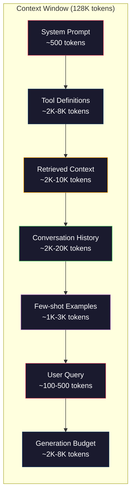
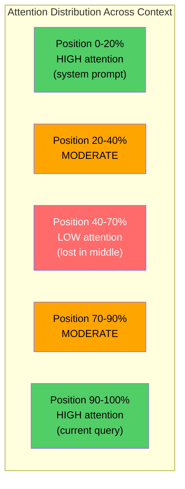
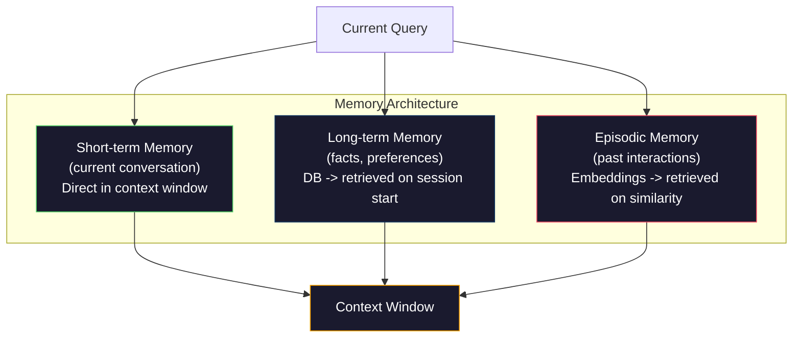

# 05 · 上下文工程：窗口、预算、记忆与检索

> 提示工程（Prompt Engineering）只是其中一个子集。上下文工程（Context Engineering）才是全局。提示是你敲进去的一段字符串，而上下文是进入模型窗口的一切：系统指令、检索到的文档、工具定义、对话历史、少样本示例（few-shot examples），以及提示本身。2026 年最优秀的 AI 工程师都是上下文工程师。他们决定什么放进去、什么排除在外，以及以何种顺序排列。

**类型：** 构建（Build）
**语言：** Python
**前置：** 阶段 10（从零实现 LLM）、阶段 11 第 01-02 课
**时长：** 约 90 分钟
**相关：** 阶段 11 · 15（提示缓存 / Prompt Caching）—— 缓存友好的布局是上下文工程的延伸。阶段 5 · 28（长上下文评测 / Long-Context Evaluation）讲解如何用 NIAH/RULER 衡量「中间迷失」问题。

## 学习目标

- 计算覆盖上下文窗口所有组成部分的 token 预算（系统提示、工具、历史、检索文档、生成余量）
- 实现上下文窗口管理策略：截断（truncation）、摘要（summarization）以及对话历史的滑动窗口（sliding window）
- 对上下文各组件进行优先级排序与排列，使模型把注意力最大限度地集中在最相关的信息上
- 构建一个上下文装配器（context assembler），根据查询类型和可用窗口空间动态分配 token

## 问题所在

Claude Opus 4.7 拥有 200K token 的窗口（测试版可达 1M）。GPT-5 是 400K。Gemini 3 Pro 是 2M。Llama 4 号称达到 10M。在你真正填满它们之前，这些数字听起来大得惊人。

下面是一个编程助手的真实分解。系统提示：500 token。50 个工具的工具定义：8,000 token。检索到的文档：4,000 token。对话历史（10 轮）：6,000 token。当前用户查询：200 token。生成预算（最大输出）：4,000 token。总计：22,700 token。这仅占 128K 窗口的 18%。

但注意力并不会随上下文长度线性增长。一个拥有 128K token 上下文的模型要付出二次方的注意力代价（原始 transformer 中为 O(n^2)，尽管大多数生产模型使用高效注意力变体）。更重要的是，检索准确率会下降。「大海捞针」（Needle in a Haystack）测试表明，模型很难找到放置在长上下文中间位置的信息。Liu 等人（2023）的研究显示，LLM 在长上下文的开头和结尾检索信息时准确率近乎完美，但对于放置在中间位置（上下文的 40-70% 处）的信息，准确率会下降 10-20%。这种「中间迷失」（lost-in-the-middle）效应因模型而异，但影响所有现有架构。

实践教训是：拥有 200K token 可用，并不意味着用满 200K token 就有效。一个精心筛选的 10K token 上下文，往往胜过一个随意堆砌的 100K token 上下文。上下文工程就是在上下文窗口内最大化信噪比的学问。

你放进窗口的每一个 token，都会挤掉一个本可承载更相关信息的 token。每一个不相关的工具定义、每一轮过时的对话、每一段无法回答问题的检索文本——每一项都会让模型在任务上稍微变差一点。

## 核心概念

### 上下文窗口是稀缺资源

把上下文窗口想象成 RAM，而不是磁盘。它快速且可直接访问，但容量有限。你装不下所有东西，必须做出取舍。



每个组件都在争夺空间。增加更多工具定义意味着留给对话历史的空间更少。增加更多检索上下文意味着留给少样本示例的空间更少。上下文工程就是分配这份预算、以最大化任务表现的艺术。

### 中间迷失

这是上下文工程中最重要的实证发现。模型对上下文开头和结尾的信息关注得更好。中间的信息获得的注意力分数较低，更容易被忽略。

Liu 等人（2023）系统地验证了这一点。他们把一份相关文档放在 20 份无关文档中的不同位置，并测量回答准确率。当相关文档位于第一或最后位置时，准确率为 85-90%。当它位于中间（20 份中的第 10 份）时，准确率降至 60-70%。

这对工程实践有直接影响：

- 把最重要的信息放在最前面（系统提示、关键指令）
- 把当前查询和最相关的上下文放在最后（近因偏好 / recency bias 有帮助）
- 把上下文的中间部分视为优先级最低的区域
- 如果你必须把信息放在中间，就在末尾重复一遍关键要点



### 上下文组件

**系统提示（System prompt）**：设定人设、约束和行为规则。它放在最前面，并在各轮对话中保持不变。Claude Code 的系统提示（包含工具定义和行为指令）大约占用 6,000 token。要保持精简。系统提示中的每一个词都会在每次 API 调用时被重复一次。

**工具定义（Tool definitions）**：每个工具增加 50-200 token（名称、描述、参数 schema）。50 个工具，每个 150 token，在任何对话发生之前就已经是 7,500 token。动态工具选择——只纳入与当前查询相关的工具——可以将其减少 60-80%。

**检索上下文（Retrieved context）**：来自向量数据库的文档、搜索结果、文件内容。检索质量直接决定回答质量。糟糕的检索比不检索更糟——它用噪声填满窗口，并主动误导模型。

**对话历史（Conversation history）**：之前每一条用户消息和助手回复。它随对话长度线性增长。一段 50 轮的对话，每轮 200 token，就是 10,000 token 的历史。其中大部分与当前查询无关。

**少样本示例（Few-shot examples）**：演示期望行为的输入/输出对。两到三个精选示例，往往比成千上万 token 的指令更能提升输出质量。但它们会占用空间。

**生成预算（Generation budget）**：为模型回复预留的 token。如果你把窗口填到极限，模型就没有空间作答了。至少为生成预留 2,000-4,000 token。

### 上下文压缩策略

**历史摘要（History summarization）**：与其逐字保留之前所有轮次，不如周期性地对对话做摘要。「我们讨论了 X，决定采用 Y，用户想要 Z」用 100 token 就能替代占用 2,000 token 的 10 轮对话。当历史超过某个阈值（例如 5,000 token）时运行摘要。

**相关性过滤（Relevance filtering）**：对每份检索到的文档相对当前查询打分，丢弃低于阈值的文档。如果你检索了 10 个文本块但只有 3 个相关，就丢掉另外 7 个。拥有 3 个高度相关的块，胜过 10 个平庸的块。

**工具裁剪（Tool pruning）**：对用户查询的意图进行分类，只纳入与该意图相关的工具。代码问题不需要日历工具，排程问题不需要文件系统工具。这能把工具定义从 8,000 token 减少到 1,000 token。

**递归摘要（Recursive summarization）**：对于非常长的文档，分阶段摘要。先对每个章节做摘要，再对这些摘要做摘要。一份 50 页的文档变成一份 500 token 的摘要，抓住关键要点。

### 记忆系统

上下文工程跨越三个时间尺度。

**短期记忆（Short-term memory）**：当前对话。直接存储在上下文窗口中，随每一轮增长。通过摘要和截断来管理。

**长期记忆（Long-term memory）**：跨对话持久存在的事实和偏好。「用户偏好 TypeScript。」「项目使用 PostgreSQL。」存储在数据库中，在会话开始时检索。Claude Code 把它存储在 CLAUDE.md 文件中。ChatGPT 把它存储在其记忆功能中。

**情景记忆（Episodic memory）**：可能相关的特定过往交互。「上周二，我们在 auth 模块调试过一个类似的问题。」以嵌入向量（embeddings）形式存储，当当前对话与某次过往情景匹配时被检索出来。



### 动态上下文装配

关键洞见是：不同的查询需要不同的上下文。静态系统提示 + 静态工具 + 静态历史是一种浪费。最优秀的系统会针对每个查询动态装配上下文。

1. 对查询意图进行分类
2. 选择相关工具（不是全部工具）
3. 检索相关文档（不是固定的一组）
4. 纳入相关的历史轮次（不是全部历史）
5. 添加与任务类型匹配的少样本示例
6. 按重要性排序一切：关键的放最前，重要的放最后，可选的放中间

这就是区分「好的 AI 应用」和「卓越的 AI 应用」的地方。模型是同一个，上下文才是差异所在。

## 动手构建

### 第 1 步：Token 计数器

无法度量，就无法做预算。构建一个简单的 token 计数器（用空白分隔来近似，因为精确计数取决于分词器）。

```python
import json
import numpy as np
from collections import OrderedDict

def count_tokens(text):
    if not text:
        return 0
    return int(len(text.split()) * 1.3)

def count_tokens_json(obj):
    return count_tokens(json.dumps(obj))
```

### 第 2 步：上下文预算管理器

核心抽象。预算管理器追踪每个组件占用多少 token，并强制执行上限。

```python
class ContextBudget:
    def __init__(self, max_tokens=128000, generation_reserve=4000):
        self.max_tokens = max_tokens
        self.generation_reserve = generation_reserve
        self.available = max_tokens - generation_reserve
        self.allocations = OrderedDict()

    def allocate(self, component, content, max_tokens=None):
        tokens = count_tokens(content)
        if max_tokens and tokens > max_tokens:
            words = content.split()
            target_words = int(max_tokens / 1.3)
            content = " ".join(words[:target_words])
            tokens = count_tokens(content)

        used = sum(self.allocations.values())
        if used + tokens > self.available:
            allowed = self.available - used
            if allowed <= 0:
                return None, 0
            words = content.split()
            target_words = int(allowed / 1.3)
            content = " ".join(words[:target_words])
            tokens = count_tokens(content)

        self.allocations[component] = tokens
        return content, tokens

    def remaining(self):
        used = sum(self.allocations.values())
        return self.available - used

    def utilization(self):
        used = sum(self.allocations.values())
        return used / self.max_tokens

    def report(self):
        total_used = sum(self.allocations.values())
        lines = []
        lines.append(f"Context Budget Report ({self.max_tokens:,} token window)")
        lines.append("-" * 50)
        for component, tokens in self.allocations.items():
            pct = tokens / self.max_tokens * 100
            bar = "#" * int(pct / 2)
            lines.append(f"  {component:<25} {tokens:>6} tokens ({pct:>5.1f}%) {bar}")
        lines.append("-" * 50)
        lines.append(f"  {'Used':<25} {total_used:>6} tokens ({total_used/self.max_tokens*100:.1f}%)")
        lines.append(f"  {'Generation reserve':<25} {self.generation_reserve:>6} tokens")
        lines.append(f"  {'Remaining':<25} {self.remaining():>6} tokens")
        return "\n".join(lines)
```

### 第 3 步：中间迷失重排序

实现重排序策略：最重要的项放在最前和最后，最不重要的放在中间。

```python
def reorder_lost_in_middle(items, scores):
    paired = sorted(zip(scores, items), reverse=True)
    sorted_items = [item for _, item in paired]

    if len(sorted_items) <= 2:
        return sorted_items

    first_half = sorted_items[::2]
    second_half = sorted_items[1::2]
    second_half.reverse()

    return first_half + second_half

def score_relevance(query, documents):
    query_words = set(query.lower().split())
    scores = []
    for doc in documents:
        doc_words = set(doc.lower().split())
        if not query_words:
            scores.append(0.0)
            continue
        overlap = len(query_words & doc_words) / len(query_words)
        scores.append(round(overlap, 3))
    return scores
```

### 第 4 步：对话历史压缩器

对旧的对话轮次做摘要，以回收 token 预算。

```python
class ConversationManager:
    def __init__(self, max_history_tokens=5000):
        self.turns = []
        self.summaries = []
        self.max_history_tokens = max_history_tokens

    def add_turn(self, role, content):
        self.turns.append({"role": role, "content": content})
        self._compress_if_needed()

    def _compress_if_needed(self):
        total = sum(count_tokens(t["content"]) for t in self.turns)
        if total <= self.max_history_tokens:
            return

        while total > self.max_history_tokens and len(self.turns) > 4:
            old_turns = self.turns[:2]
            summary = self._summarize_turns(old_turns)
            self.summaries.append(summary)
            self.turns = self.turns[2:]
            total = sum(count_tokens(t["content"]) for t in self.turns)

    def _summarize_turns(self, turns):
        parts = []
        for t in turns:
            content = t["content"]
            if len(content) > 100:
                content = content[:100] + "..."
            parts.append(f"{t['role']}: {content}")
        return "Previous: " + " | ".join(parts)

    def get_context(self):
        parts = []
        if self.summaries:
            parts.append("[Conversation Summary]")
            for s in self.summaries:
                parts.append(s)
        parts.append("[Recent Conversation]")
        for t in self.turns:
            parts.append(f"{t['role']}: {t['content']}")
        return "\n".join(parts)

    def token_count(self):
        return count_tokens(self.get_context())
```

### 第 5 步：动态工具选择器

只纳入与当前查询相关的工具。先对意图分类，再过滤。

```python
TOOL_REGISTRY = {
    "read_file": {
        "description": "Read contents of a file",
        "tokens": 120,
        "categories": ["code", "files"],
    },
    "write_file": {
        "description": "Write content to a file",
        "tokens": 150,
        "categories": ["code", "files"],
    },
    "search_code": {
        "description": "Search for patterns in codebase",
        "tokens": 130,
        "categories": ["code"],
    },
    "run_command": {
        "description": "Execute a shell command",
        "tokens": 140,
        "categories": ["code", "system"],
    },
    "create_calendar_event": {
        "description": "Create a new calendar event",
        "tokens": 180,
        "categories": ["calendar"],
    },
    "list_emails": {
        "description": "List recent emails",
        "tokens": 160,
        "categories": ["email"],
    },
    "send_email": {
        "description": "Send an email message",
        "tokens": 200,
        "categories": ["email"],
    },
    "web_search": {
        "description": "Search the web for information",
        "tokens": 140,
        "categories": ["research"],
    },
    "query_database": {
        "description": "Run a SQL query on the database",
        "tokens": 170,
        "categories": ["code", "data"],
    },
    "generate_chart": {
        "description": "Generate a chart from data",
        "tokens": 190,
        "categories": ["data", "visualization"],
    },
}

def classify_intent(query):
    query_lower = query.lower()

    intent_keywords = {
        "code": ["code", "function", "bug", "error", "file", "implement", "refactor", "debug", "test"],
        "calendar": ["meeting", "schedule", "calendar", "appointment", "event"],
        "email": ["email", "mail", "send", "inbox", "message"],
        "research": ["search", "find", "what is", "how does", "explain", "look up"],
        "data": ["data", "query", "database", "chart", "graph", "analytics", "sql"],
    }

    scores = {}
    for intent, keywords in intent_keywords.items():
        score = sum(1 for kw in keywords if kw in query_lower)
        if score > 0:
            scores[intent] = score

    if not scores:
        return ["code"]

    max_score = max(scores.values())
    return [intent for intent, score in scores.items() if score >= max_score * 0.5]

def select_tools(query, token_budget=2000):
    intents = classify_intent(query)
    relevant = {}
    total_tokens = 0

    for name, tool in TOOL_REGISTRY.items():
        if any(cat in intents for cat in tool["categories"]):
            if total_tokens + tool["tokens"] <= token_budget:
                relevant[name] = tool
                total_tokens += tool["tokens"]

    return relevant, total_tokens
```

### 第 6 步：完整的上下文装配流水线

把一切串联起来。给定一个查询，动态装配出最优上下文。

```python
class ContextEngine:
    def __init__(self, max_tokens=128000, generation_reserve=4000):
        self.budget = ContextBudget(max_tokens, generation_reserve)
        self.conversation = ConversationManager(max_history_tokens=5000)
        self.system_prompt = (
            "You are a helpful AI assistant. You have access to tools for "
            "code editing, file management, web search, and data analysis. "
            "Use the appropriate tools for each task. Be concise and accurate."
        )
        self.knowledge_base = [
            "Python 3.12 introduced type parameter syntax for generic classes using bracket notation.",
            "The project uses PostgreSQL 16 with pgvector for embedding storage.",
            "Authentication is handled by Supabase Auth with JWT tokens.",
            "The frontend is built with Next.js 15 using the App Router.",
            "API rate limits are set to 100 requests per minute per user.",
            "The deployment pipeline uses GitHub Actions with Docker multi-stage builds.",
            "Test coverage must be above 80% for all new modules.",
            "The codebase follows the repository pattern for data access.",
        ]

    def assemble(self, query):
        self.budget = ContextBudget(self.budget.max_tokens, self.budget.generation_reserve)

        system_content, _ = self.budget.allocate("system_prompt", self.system_prompt, max_tokens=1000)

        tools, tool_tokens = select_tools(query, token_budget=2000)
        tool_text = json.dumps(list(tools.keys()))
        tool_content, _ = self.budget.allocate("tools", tool_text, max_tokens=2000)

        relevance = score_relevance(query, self.knowledge_base)
        threshold = 0.1
        relevant_docs = [
            doc for doc, score in zip(self.knowledge_base, relevance)
            if score >= threshold
        ]

        if relevant_docs:
            doc_scores = [s for s in relevance if s >= threshold]
            reordered = reorder_lost_in_middle(relevant_docs, doc_scores)
            doc_text = "\n".join(reordered)
            doc_content, _ = self.budget.allocate("retrieved_context", doc_text, max_tokens=3000)

        history_text = self.conversation.get_context()
        if history_text.strip():
            history_content, _ = self.budget.allocate("conversation_history", history_text, max_tokens=5000)

        query_content, _ = self.budget.allocate("user_query", query, max_tokens=500)

        return self.budget

    def chat(self, query):
        self.conversation.add_turn("user", query)
        budget = self.assemble(query)
        response = f"[Response to: {query[:50]}...]"
        self.conversation.add_turn("assistant", response)
        return budget


def run_demo():
    print("=" * 60)
    print("  Context Engineering Pipeline Demo")
    print("=" * 60)

    engine = ContextEngine(max_tokens=128000, generation_reserve=4000)

    print("\n--- Query 1: Code task ---")
    budget = engine.chat("Fix the bug in the authentication module where JWT tokens expire too early")
    print(budget.report())

    print("\n--- Query 2: Research task ---")
    budget = engine.chat("What is the best approach for implementing vector search in PostgreSQL?")
    print(budget.report())

    print("\n--- Query 3: After conversation history builds up ---")
    for i in range(8):
        engine.conversation.add_turn("user", f"Follow-up question number {i+1} about the implementation details of the system")
        engine.conversation.add_turn("assistant", f"Here is the response to follow-up {i+1} with technical details about the architecture")

    budget = engine.chat("Now implement the changes we discussed")
    print(budget.report())

    print("\n--- Tool Selection Examples ---")
    test_queries = [
        "Fix the bug in auth.py",
        "Schedule a meeting with the team for Tuesday",
        "Show me the database query performance stats",
        "Search for best practices on error handling",
    ]

    for q in test_queries:
        tools, tokens = select_tools(q)
        intents = classify_intent(q)
        print(f"\n  Query: {q}")
        print(f"  Intents: {intents}")
        print(f"  Tools: {list(tools.keys())} ({tokens} tokens)")

    print("\n--- Lost-in-the-Middle Reordering ---")
    docs = ["Doc A (most relevant)", "Doc B (somewhat relevant)", "Doc C (least relevant)",
            "Doc D (relevant)", "Doc E (moderately relevant)"]
    scores = [0.95, 0.60, 0.20, 0.80, 0.50]
    reordered = reorder_lost_in_middle(docs, scores)
    print(f"  Original order: {docs}")
    print(f"  Scores:         {scores}")
    print(f"  Reordered:      {reordered}")
    print(f"  (Most relevant at start and end, least relevant in middle)")
```

## 实战应用

### Claude Code 的上下文策略

Claude Code 用一种分层方式管理上下文。系统提示包含行为规则和工具定义（约 6K token）。当你打开一个文件时，其内容会作为上下文注入。当你搜索时，结果会被添加进来。旧的对话轮次会被摘要。CLAUDE.md 提供跨会话持久存在的长期记忆。

关键的工程决策是：Claude Code 不会把你的整个代码库一股脑塞进上下文。它按需检索相关文件。这就是上下文工程在实践中的样子。

### Cursor 的动态上下文加载

Cursor 把你的整个代码库索引为嵌入向量。当你输入一个查询时，它用向量相似度检索出最相关的文件和代码块。只有这些片段会进入上下文窗口。一个 50 万行的代码库被压缩成最相关的 5-10 个代码块。

这就是那个范式：把一切嵌入，按需检索，只纳入真正重要的部分。

### ChatGPT 记忆

ChatGPT 把用户偏好和事实存储为长期记忆。在每次对话开始时，相关记忆会被检索出来并纳入系统提示。「用户偏好 Python」只花费 5 token，却能在多次对话中节省数百 token 的重复指令。

### RAG 即上下文工程

检索增强生成（Retrieval-Augmented Generation，RAG）就是被形式化的上下文工程。与其把知识塞进模型权重（训练）或系统提示（静态上下文），不如在查询时检索相关文档并注入上下文窗口。整条 RAG 流水线——分块（chunking）、嵌入、检索、重排序（reranking）——存在的目的只有一个：把正确的信息放进上下文窗口。

## 交付成果

本课产出 `outputs/prompt-context-optimizer.md` —— 一个可复用的提示，用于审计上下文装配策略并推荐优化方案。把你的系统提示、工具数量、平均历史长度和检索策略喂给它，它会识别 token 浪费并给出改进建议。

本课还产出 `outputs/skill-context-engineering.md` —— 一个决策框架，用于根据任务类型、上下文窗口大小和延迟预算来设计上下文装配流水线。

## 练习

1. 给 ContextBudget 类添加一个「token 浪费检测器」。它应当标记出占用预算超过 30% 的组件，并针对每种组件类型给出具体的压缩策略建议（摘要历史、裁剪工具、重排序文档）。

2. 为检索上下文实现语义去重。如果两份检索到的文档相似度超过 80%（按词汇重叠或其嵌入的余弦相似度），只保留得分较高的那一份。测量这能回收多少 token 预算。

3. 构建一个「上下文回放」工具。给定一段对话记录，让它通过 ContextEngine 回放，并可视化预算分配如何逐轮变化。绘制各组件随时间变化的 token 使用量。识别出上下文开始被压缩的那一轮。

4. 实现一个基于优先级的工具选择器。不再是二元的纳入/排除，而是为每个工具分配一个相对当前查询的相关性分数。按相关性降序纳入工具，直到工具预算耗尽。比较纳入 5、10、20、50 个工具时的任务表现。

5. 构建一个多策略上下文压缩器。实现三种压缩策略（截断、摘要、关键句抽取），并在一组 20 份文档上对它们进行基准测试。测量压缩率与信息保留之间的权衡（压缩后的版本是否仍包含查询的答案？）。

## 关键术语

| 术语 | 人们怎么说 | 它实际指什么 |
|------|----------------|----------------------|
| 上下文窗口（Context window） | 「模型能读多少」 | 模型在单次前向传播中处理的最大 token 数（输入 + 输出）—— GPT-5 为 400K，Claude Opus 4.7 为 200K（测试版 1M），Gemini 3 Pro 为 2M |
| 上下文工程（Context engineering） | 「高级提示工程」 | 决定什么进入上下文窗口、以何种顺序、以何种优先级的学问 —— 涵盖检索、压缩、工具选择和记忆管理 |
| 中间迷失（Lost-in-the-middle） | 「模型会忘掉中间的东西」 | 实证发现：LLM 对上下文开头和结尾关注得更好，放在中间的信息准确率下降 10-20% |
| Token 预算（Token budget） | 「你还剩多少 token」 | 把上下文窗口容量在各组件（系统提示、工具、历史、检索、生成）间做显式分配，并设定每个组件的上限 |
| 动态上下文（Dynamic context） | 「即时加载东西」 | 基于意图分类、相关工具选择和检索结果，为每个查询以不同方式装配上下文窗口 |
| 历史摘要（History summarization） | 「压缩对话」 | 用简洁摘要替代逐字保留的旧对话轮次，在保留关键信息的同时降低 token 成本 |
| 工具裁剪（Tool pruning） | 「只纳入相关工具」 | 对查询意图分类，只纳入匹配的工具定义，将工具 token 成本降低 60-80% |
| 长期记忆（Long-term memory） | 「跨会话记忆」 | 存储在数据库中并在会话开始时检索的事实与偏好 —— CLAUDE.md、ChatGPT Memory 及类似系统 |
| 情景记忆（Episodic memory） | 「记住特定的过往事件」 | 以嵌入向量形式存储的过往交互，当当前查询与某次过往对话相似时被检索出来 |
| 生成预算（Generation budget） | 「留给答案的空间」 | 为模型输出预留的 token —— 如果上下文把窗口完全填满，模型就没有空间作答 |

## 延伸阅读

- [Liu et al., 2023 —— "Lost in the Middle: How Language Models Use Long Contexts"](https://arxiv.org/abs/2307.03172) —— 关于位置相关注意力的权威研究，证明模型难以处理长上下文中间的信息
- [Anthropic 的上下文检索博客文章](https://www.anthropic.com/news/contextual-retrieval) —— Anthropic 如何处理上下文感知的分块检索，将检索失败率降低 49%
- [Simon Willison 的 "Context Engineering"](https://simonwillison.net/2025/Jun/27/context-engineering/) —— 为这一学科命名、并将其与提示工程区分开来的博客文章
- [LangChain 关于 RAG 的文档](https://python.langchain.com/docs/tutorials/rag/) —— 作为一种上下文工程范式的检索增强生成的实践实现
- [Greg Kamradt 的大海捞针测试](https://github.com/gkamradt/LLMTest_NeedleInAHaystack) —— 揭示所有主流模型位置相关检索失败的基准测试
- [Pope et al., "Efficiently Scaling Transformer Inference" (2022)](https://arxiv.org/abs/2211.05102) —— 为什么上下文长度驱动内存与延迟，以及 KV 缓存、MQA 和 GQA 如何改变预算计算
- [Agrawal et al., "SARATHI: Efficient LLM Inference by Piggybacking Decodes with Chunked Prefills" (2023)](https://arxiv.org/abs/2308.16369) —— 推理的两个阶段，它们使长提示在 TTFT 上昂贵、在 TPOT 上廉价；这是上下文打包权衡背后的底层真相
- [Ainslie et al., "GQA: Training Generalized Multi-Query Transformer Models from Multi-Head Checkpoints" (EMNLP 2023)](https://arxiv.org/abs/2305.13245) —— 分组查询注意力（grouped-query attention）论文，在不损失质量的前提下将生产解码器的 KV 内存削减 8 倍
