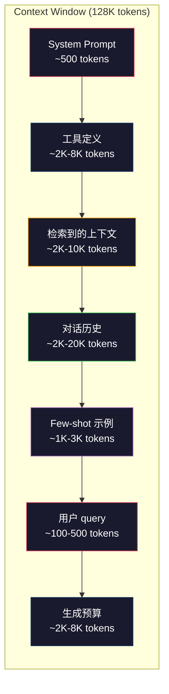
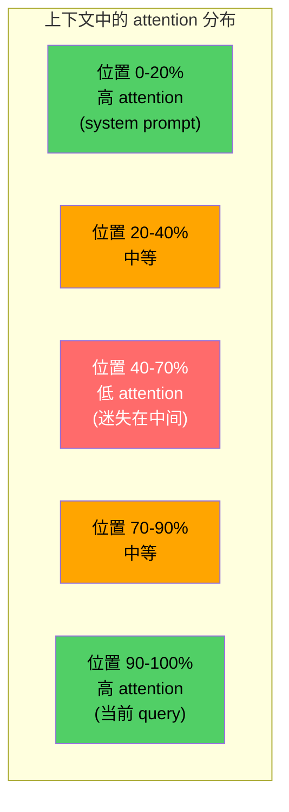
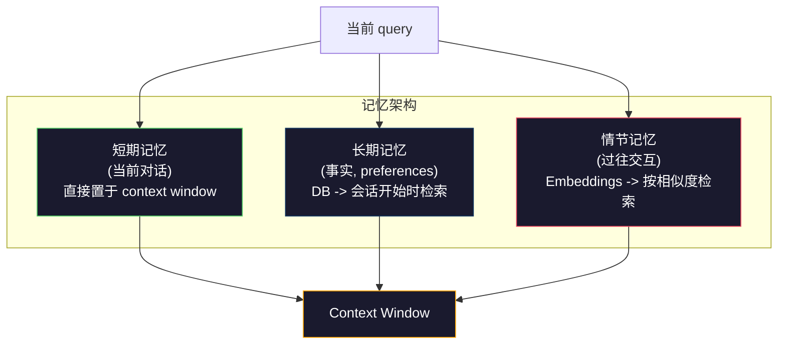

# Context Engineering：窗口、预算、记忆与检索

> 译注：本文译自同目录 [`en.md`](./en.md)。术语遵循仓根 [TRANSLATION_GUIDE.md](../../../../TRANSLATION_GUIDE.md)。

> prompt engineering 只是子集。Context engineering（上下文工程）才是全部游戏。prompt 是你敲进去的一段字符串。Context（上下文）则是模型窗口里所有的东西：system prompt、检索到的文档、工具定义、对话历史、few-shot 示例，以及 prompt 本身。2026 年顶尖的 AI 工程师都是 context engineer：他们决定什么进、什么出、以什么顺序进。

**Type:** Build
**Languages:** Python
**Prerequisites:** Phase 10（LLMs from Scratch）、Phase 11 Lesson 01-02
**Time:** 约 90 分钟
**Related:** Phase 11 · 15（Prompt Caching）—— 缓存友好的布局是 context engineering 的延伸；Phase 5 · 28（Long-Context Evaluation）—— 用 NIAH/RULER 衡量 lost-in-the-middle 的方法。

## 学习目标（Learning Objectives）

- 计算 context window 各组件（system prompt、tools、history、检索文档、生成预留）的 token 预算
- 实现 context window 管理策略：truncation、summarization 与对话历史的滑动窗口
- 给 context 组件排优先级、定顺序，把模型的 attention 集中在最相关的信息上
- 构建一个 context 装配器，根据 query 类型与可用窗口空间动态分配 token

## 问题（Problem）

Claude Opus 4.7 有 200K token 窗口（beta 1M）。GPT-5 有 400K。Gemini 3 Pro 有 2M。Llama 4 号称 10M。听起来很夸张，等你真去填就知道了。

来看一个编程助手的真实拆解。System prompt：500 tokens；50 个工具的定义：8,000 tokens；检索到的文档：4,000 tokens；对话历史（10 轮）：6,000 tokens；当前用户 query：200 tokens；生成预算（最大输出）：4,000 tokens。合计 22,700 tokens —— 才用了 128K 窗口的 18%。

但 attention（注意力）成本并不会随上下文长度线性扩展。128K token 上下文的模型，attention 是平方级开销（vanilla transformer 是 O(n^2)，多数生产模型用更高效的 attention 变种）。更要命的是检索准确率会下降。"Needle in a Haystack" 测试显示：放在长上下文中段的信息，模型很难找到。Liu 等人（2023）的研究表明，LLM 对长上下文开头和结尾的信息几乎能完美检索，但放在中段（位置 40%-70%）时准确率掉 10-20%。这种 "lost-in-the-middle" 效应因模型而异，但所有当下的架构都受影响。

实操结论：可用 200K token 不等于用 200K token 就有效。一份精心策划的 10K token 上下文，往往比胡乱堆进去的 100K token 上下文表现更好。Context engineering 的本质就是：在 context window 里把信噪比拉到最大。

你塞进窗口的每一个 token，都挤掉了一个本可以承载更相关信息的 token 位。每个无关的工具定义、每条过期的对话轮次、每段答非所问的检索片段 —— 都在让模型在任务上稍稍变差一点。

## 概念（Concept）

### Context Window 是稀缺资源

把 context window 当成 RAM，不是磁盘。它快、可直接访问，但有限。塞不下所有东西，你必须取舍。



每个组件都在抢空间。多塞工具定义就少了对话历史的位置；多塞检索内容就少了 few-shot 示例的位置。Context engineering 就是分配这份预算、把任务表现最大化的艺术。

### Lost-in-the-Middle

context engineering 里最重要的实证发现。模型对上下文开头和结尾的信息 attention 更高，中间部分 attention 分数更低，更容易被忽略。

Liu 等人（2023）系统地测过：把一份相关文档放在 20 份无关文档之中、变换不同位置，再测回答准确率。相关文档放第一或最后时，准确率 85-90%；放在中段（20 份里第 10 份）时，准确率掉到 60-70%。

这给工程实践带来直接的启示：

- 把最重要的信息放最前面（system prompt、关键指令）
- 把当前 query 与最相关的上下文放最后（recency bias 会帮你）
- 把上下文中段当作最低优先级区域
- 如果实在要把信息放中间，那就在末尾再重复一遍关键点



### Context 各组件

**System prompt**：定 persona、约束和行为规则。放最前，跨轮次保持不变。Claude Code 的 system prompt 加上工具定义和行为指令大约 6,000 tokens。要紧凑：system prompt 里的每一个词，都会在每次 API 调用里重复一遍。

**Tool definitions**（工具定义）：每个工具占 50-200 tokens（名字、描述、参数 schema）。50 个工具按每个 150 tokens 算就是 7,500 tokens —— 还没开始对话就用掉了。动态工具选择 —— 只放进当前 query 相关的工具 —— 能砍掉 60-80%。

**Retrieved context**（检索上下文）：来自向量数据库的文档、搜索结果、文件内容。检索质量直接决定回答质量。差的检索比不检索更糟 —— 它把窗口塞满噪声，还会主动误导模型。

**Conversation history**（对话历史）：每一条历史用户消息和助手响应。随对话长度线性增长。50 轮对话每轮 200 tokens 就是 10,000 tokens 的历史，其中大部分跟当前 query 都没关系。

**Few-shot examples**：演示期望行为的输入/输出对。两到三个精挑细选的示例，往往比上千 tokens 的指令更能提升输出质量。代价是占空间。

**Generation budget**（生成预算）：留给模型回答的 tokens。如果窗口塞满了，模型就没空间答了。至少留 2,000-4,000 tokens 给生成。

### Context 压缩策略

**History summarization**（历史摘要）：与其把每一轮原文照搬，不如周期性地给对话做摘要。"我们讨论了 X，定下了 Y，用户想要 Z" —— 100 tokens 替掉 10 轮、2,000 tokens 的历史。当历史超过阈值（比如 5,000 tokens）时跑摘要。

**Relevance filtering**（相关性过滤）：给每份检索到的文档相对当前 query 打分，分数低于阈值的丢掉。检索回 10 段、只有 3 段相关，那就把另外 7 段扔掉。3 段高相关比 10 段平庸的好。

**Tool pruning**（工具裁剪）：先分类用户 query 的意图，再只放相关意图的工具。代码问题不需要日历工具；排程问题不需要文件系统工具。这能把工具定义从 8,000 tokens 砍到 1,000。

**Recursive summarization**（递归摘要）：超长文档分阶段摘。先摘每一节，再摘所有摘要。一份 50 页文档变成 500 tokens 的精华。

### 记忆系统

Context engineering 跨越三种时间尺度。

**Short-term memory**（短期记忆）：当前对话。直接装在 context window 里。每轮增长。靠 summarization 和 truncation 管理。

**Long-term memory**（长期记忆）：跨会话保留的事实和偏好。"用户偏好 TypeScript。""项目用 PostgreSQL。"存在数据库里，会话开始时检索。Claude Code 把这些存在 CLAUDE.md 文件里。ChatGPT 用它的 memory 功能存。

**Episodic memory**（情景记忆）：可能相关的具体过往交互。"上周二我们调过 auth 模块里类似的问题。"以 embedding 形式存储，当前对话与某段过去匹配时被检索回来。



### 动态 Context 装配

关键洞察：不同的 query 需要不同的 context。静态 system prompt + 静态工具 + 静态历史是浪费。最好的系统会按每条 query 动态装配 context。

1. 给 query 意图分类
2. 选相关工具（不是所有工具）
3. 检索相关文档（不是固定一组）
4. 包含相关的历史轮次（不是全部历史）
5. 加入匹配任务类型的 few-shot 示例
6. 按重要性排序：关键的放前面、重要的放最后、可选的塞中间

这就是好的 AI 应用与卓越 AI 应用的分水岭。模型一样。Context 才是差异。

## 动手实现（Build It）

### Step 1：Token 计数器

测不准的预算管不了。先建一个简单的 token 计数器（用空白分词做近似，因为精确数依赖 tokenizer）。

```python
import json
import numpy as np
from collections import OrderedDict

def count_tokens(text):
    if not text:
        return 0
    return int(len(text.split()) * 1.3)

def count_tokens_json(obj):
    return count_tokens(json.dumps(obj))
```

### Step 2：Context 预算管理器

核心抽象。预算管理器记录每个组件用了多少 token，并执行限制。

```python
class ContextBudget:
    def __init__(self, max_tokens=128000, generation_reserve=4000):
        self.max_tokens = max_tokens
        self.generation_reserve = generation_reserve
        self.available = max_tokens - generation_reserve
        self.allocations = OrderedDict()

    def allocate(self, component, content, max_tokens=None):
        tokens = count_tokens(content)
        if max_tokens and tokens > max_tokens:
            words = content.split()
            target_words = int(max_tokens / 1.3)
            content = " ".join(words[:target_words])
            tokens = count_tokens(content)

        used = sum(self.allocations.values())
        if used + tokens > self.available:
            allowed = self.available - used
            if allowed <= 0:
                return None, 0
            words = content.split()
            target_words = int(allowed / 1.3)
            content = " ".join(words[:target_words])
            tokens = count_tokens(content)

        self.allocations[component] = tokens
        return content, tokens

    def remaining(self):
        used = sum(self.allocations.values())
        return self.available - used

    def utilization(self):
        used = sum(self.allocations.values())
        return used / self.max_tokens

    def report(self):
        total_used = sum(self.allocations.values())
        lines = []
        lines.append(f"Context Budget Report ({self.max_tokens:,} token window)")
        lines.append("-" * 50)
        for component, tokens in self.allocations.items():
            pct = tokens / self.max_tokens * 100
            bar = "#" * int(pct / 2)
            lines.append(f"  {component:<25} {tokens:>6} tokens ({pct:>5.1f}%) {bar}")
        lines.append("-" * 50)
        lines.append(f"  {'Used':<25} {total_used:>6} tokens ({total_used/self.max_tokens*100:.1f}%)")
        lines.append(f"  {'Generation reserve':<25} {self.generation_reserve:>6} tokens")
        lines.append(f"  {'Remaining':<25} {self.remaining():>6} tokens")
        return "\n".join(lines)
```

### Step 3：Lost-in-the-Middle 重排

实现重排策略：最重要的项放最前和最后，最不重要的塞中间。

```python
def reorder_lost_in_middle(items, scores):
    paired = sorted(zip(scores, items), reverse=True)
    sorted_items = [item for _, item in paired]

    if len(sorted_items) <= 2:
        return sorted_items

    first_half = sorted_items[::2]
    second_half = sorted_items[1::2]
    second_half.reverse()

    return first_half + second_half

def score_relevance(query, documents):
    query_words = set(query.lower().split())
    scores = []
    for doc in documents:
        doc_words = set(doc.lower().split())
        if not query_words:
            scores.append(0.0)
            continue
        overlap = len(query_words & doc_words) / len(query_words)
        scores.append(round(overlap, 3))
    return scores
```

### Step 4：对话历史压缩器

对老的对话轮次做摘要、回收 token 预算。

```python
class ConversationManager:
    def __init__(self, max_history_tokens=5000):
        self.turns = []
        self.summaries = []
        self.max_history_tokens = max_history_tokens

    def add_turn(self, role, content):
        self.turns.append({"role": role, "content": content})
        self._compress_if_needed()

    def _compress_if_needed(self):
        total = sum(count_tokens(t["content"]) for t in self.turns)
        if total <= self.max_history_tokens:
            return

        while total > self.max_history_tokens and len(self.turns) > 4:
            old_turns = self.turns[:2]
            summary = self._summarize_turns(old_turns)
            self.summaries.append(summary)
            self.turns = self.turns[2:]
            total = sum(count_tokens(t["content"]) for t in self.turns)

    def _summarize_turns(self, turns):
        parts = []
        for t in turns:
            content = t["content"]
            if len(content) > 100:
                content = content[:100] + "..."
            parts.append(f"{t['role']}: {content}")
        return "Previous: " + " | ".join(parts)

    def get_context(self):
        parts = []
        if self.summaries:
            parts.append("[Conversation Summary]")
            for s in self.summaries:
                parts.append(s)
        parts.append("[Recent Conversation]")
        for t in self.turns:
            parts.append(f"{t['role']}: {t['content']}")
        return "\n".join(parts)

    def token_count(self):
        return count_tokens(self.get_context())
```

### Step 5：动态工具选择器

只放进当前 query 相关的工具。先分类意图，再过滤。

```python
TOOL_REGISTRY = {
    "read_file": {
        "description": "Read contents of a file",
        "tokens": 120,
        "categories": ["code", "files"],
    },
    "write_file": {
        "description": "Write content to a file",
        "tokens": 150,
        "categories": ["code", "files"],
    },
    "search_code": {
        "description": "Search for patterns in codebase",
        "tokens": 130,
        "categories": ["code"],
    },
    "run_command": {
        "description": "Execute a shell command",
        "tokens": 140,
        "categories": ["code", "system"],
    },
    "create_calendar_event": {
        "description": "Create a new calendar event",
        "tokens": 180,
        "categories": ["calendar"],
    },
    "list_emails": {
        "description": "List recent emails",
        "tokens": 160,
        "categories": ["email"],
    },
    "send_email": {
        "description": "Send an email message",
        "tokens": 200,
        "categories": ["email"],
    },
    "web_search": {
        "description": "Search the web for information",
        "tokens": 140,
        "categories": ["research"],
    },
    "query_database": {
        "description": "Run a SQL query on the database",
        "tokens": 170,
        "categories": ["code", "data"],
    },
    "generate_chart": {
        "description": "Generate a chart from data",
        "tokens": 190,
        "categories": ["data", "visualization"],
    },
}

def classify_intent(query):
    query_lower = query.lower()

    intent_keywords = {
        "code": ["code", "function", "bug", "error", "file", "implement", "refactor", "debug", "test"],
        "calendar": ["meeting", "schedule", "calendar", "appointment", "event"],
        "email": ["email", "mail", "send", "inbox", "message"],
        "research": ["search", "find", "what is", "how does", "explain", "look up"],
        "data": ["data", "query", "database", "chart", "graph", "analytics", "sql"],
    }

    scores = {}
    for intent, keywords in intent_keywords.items():
        score = sum(1 for kw in keywords if kw in query_lower)
        if score > 0:
            scores[intent] = score

    if not scores:
        return ["code"]

    max_score = max(scores.values())
    return [intent for intent, score in scores.items() if score >= max_score * 0.5]

def select_tools(query, token_budget=2000):
    intents = classify_intent(query)
    relevant = {}
    total_tokens = 0

    for name, tool in TOOL_REGISTRY.items():
        if any(cat in intents for cat in tool["categories"]):
            if total_tokens + tool["tokens"] <= token_budget:
                relevant[name] = tool
                total_tokens += tool["tokens"]

    return relevant, total_tokens
```

### Step 6：完整 Context 装配流水线

把所有部件接起来。给定一条 query，动态装配出最优 context。

```python
class ContextEngine:
    def __init__(self, max_tokens=128000, generation_reserve=4000):
        self.budget = ContextBudget(max_tokens, generation_reserve)
        self.conversation = ConversationManager(max_history_tokens=5000)
        self.system_prompt = (
            "You are a helpful AI assistant. You have access to tools for "
            "code editing, file management, web search, and data analysis. "
            "Use the appropriate tools for each task. Be concise and accurate."
        )
        self.knowledge_base = [
            "Python 3.12 introduced type parameter syntax for generic classes using bracket notation.",
            "The project uses PostgreSQL 16 with pgvector for embedding storage.",
            "Authentication is handled by Supabase Auth with JWT tokens.",
            "The frontend is built with Next.js 15 using the App Router.",
            "API rate limits are set to 100 requests per minute per user.",
            "The deployment pipeline uses GitHub Actions with Docker multi-stage builds.",
            "Test coverage must be above 80% for all new modules.",
            "The codebase follows the repository pattern for data access.",
        ]

    def assemble(self, query):
        self.budget = ContextBudget(self.budget.max_tokens, self.budget.generation_reserve)

        system_content, _ = self.budget.allocate("system_prompt", self.system_prompt, max_tokens=1000)

        tools, tool_tokens = select_tools(query, token_budget=2000)
        tool_text = json.dumps(list(tools.keys()))
        tool_content, _ = self.budget.allocate("tools", tool_text, max_tokens=2000)

        relevance = score_relevance(query, self.knowledge_base)
        threshold = 0.1
        relevant_docs = [
            doc for doc, score in zip(self.knowledge_base, relevance)
            if score >= threshold
        ]

        if relevant_docs:
            doc_scores = [s for s in relevance if s >= threshold]
            reordered = reorder_lost_in_middle(relevant_docs, doc_scores)
            doc_text = "\n".join(reordered)
            doc_content, _ = self.budget.allocate("retrieved_context", doc_text, max_tokens=3000)

        history_text = self.conversation.get_context()
        if history_text.strip():
            history_content, _ = self.budget.allocate("conversation_history", history_text, max_tokens=5000)

        query_content, _ = self.budget.allocate("user_query", query, max_tokens=500)

        return self.budget

    def chat(self, query):
        self.conversation.add_turn("user", query)
        budget = self.assemble(query)
        response = f"[Response to: {query[:50]}...]"
        self.conversation.add_turn("assistant", response)
        return budget


def run_demo():
    print("=" * 60)
    print("  Context Engineering Pipeline Demo")
    print("=" * 60)

    engine = ContextEngine(max_tokens=128000, generation_reserve=4000)

    print("\n--- Query 1: Code task ---")
    budget = engine.chat("Fix the bug in the authentication module where JWT tokens expire too early")
    print(budget.report())

    print("\n--- Query 2: Research task ---")
    budget = engine.chat("What is the best approach for implementing vector search in PostgreSQL?")
    print(budget.report())

    print("\n--- Query 3: After conversation history builds up ---")
    for i in range(8):
        engine.conversation.add_turn("user", f"Follow-up question number {i+1} about the implementation details of the system")
        engine.conversation.add_turn("assistant", f"Here is the response to follow-up {i+1} with technical details about the architecture")

    budget = engine.chat("Now implement the changes we discussed")
    print(budget.report())

    print("\n--- Tool Selection Examples ---")
    test_queries = [
        "Fix the bug in auth.py",
        "Schedule a meeting with the team for Tuesday",
        "Show me the database query performance stats",
        "Search for best practices on error handling",
    ]

    for q in test_queries:
        tools, tokens = select_tools(q)
        intents = classify_intent(q)
        print(f"\n  Query: {q}")
        print(f"  Intents: {intents}")
        print(f"  Tools: {list(tools.keys())} ({tokens} tokens)")

    print("\n--- Lost-in-the-Middle Reordering ---")
    docs = ["Doc A (most relevant)", "Doc B (somewhat relevant)", "Doc C (least relevant)",
            "Doc D (relevant)", "Doc E (moderately relevant)"]
    scores = [0.95, 0.60, 0.20, 0.80, 0.50]
    reordered = reorder_lost_in_middle(docs, scores)
    print(f"  Original order: {docs}")
    print(f"  Scores:         {scores}")
    print(f"  Reordered:      {reordered}")
    print(f"  (Most relevant at start and end, least relevant in middle)")
```

## 用起来（Use It）

### Claude Code 的 Context 策略

Claude Code 用分层方式管理 context。System prompt 包含行为规则与工具定义（约 6K tokens）。你打开一个文件，文件内容会被注入为 context。你做搜索，结果会被加进来。老对话轮次会被摘要。CLAUDE.md 提供跨会话保留的长期记忆。

关键的工程决策：Claude Code 不会把你整个 codebase 倒进 context。它按需检索相关文件。这就是 context engineering 的实战。

### Cursor 的动态 Context 加载

Cursor 把你整个 codebase 索引成 embedding。当你输入 query，它用向量相似度检索最相关的文件和代码块。只有这些片段进 context window。一份 50 万行的 codebase 被压缩成最相关的 5-10 个代码块。

模式就是这样：把所有东西 embed 起来，按需检索，只放进真正重要的部分。

### ChatGPT Memory

ChatGPT 把用户偏好和事实作为长期记忆存起来。每次对话开始时，相关记忆被检索出来注入 system prompt。"用户偏好 Python" 只占 5 tokens，却能在跨对话中省掉成百 tokens 的重复指令。

### RAG 即 Context Engineering

Retrieval-Augmented Generation（RAG）是 context engineering 的形式化版本。你不再把知识塞进模型权重（训练）或 system prompt（静态 context），而是在 query 时检索相关文档、注入 context window。整条 RAG 流水线 —— chunking（切片）、embedding、检索、reranker —— 都是为了解决一个问题：把对的信息放进 context window。

## 上线部署（Ship It）

本课产出 `outputs/prompt-context-optimizer.md` —— 一个可复用 prompt，用来审计 context 装配策略并给出优化建议。把你的 system prompt、工具数量、平均历史长度、检索策略喂进去，它会指出 token 浪费在哪、并给出改进建议。

也产出 `outputs/skill-context-engineering.md` —— 一个根据任务类型、context window 大小、延迟预算来设计 context 装配流水线的决策框架。

## 练习（Exercises）

1. 给 ContextBudget 类加一个「token 浪费检测器」。它要标出占用超过预算 30% 的组件，并按组件类型给出针对性的压缩建议（摘要历史、裁剪工具、文档重排）。

2. 给检索上下文实现语义去重。如果两份检索文档相似度超过 80%（按词重叠或 embedding 余弦相似度），只保留分数高的那份。测一下能回收多少 token 预算。

3. 构建一个「context replay」工具。给定一份对话 transcript，让它跑过 ContextEngine，并可视化预算分配如何随轮次变化。把每个组件的 token 用量随时间的变化画出来。找出 context 开始被压缩的那一轮。

4. 实现按优先级的工具选择器。不再是二元的纳入/排除，而是给每个工具相对当前 query 算一个相关度分数。按相关度降序纳入，直到工具预算耗尽。比较纳入 5、10、20、50 个工具时的任务表现。

5. 构建多策略 context 压缩器。实现三种压缩策略（truncation、summarization、关键句抽取），在一组 20 份文档上做 benchmark。衡量压缩比与信息保留之间的权衡（压缩后是否还包含 query 的答案？）。

## 关键术语（Key Terms）

| 术语 | 大家通常怎么说 | 实际含义 |
|------|----------------|----------------------|
| Context window | "模型能读多少" | 模型在一次前向传播中处理的最大 token 数（输入 + 输出）—— GPT-5 是 400K，Claude Opus 4.7 是 200K（beta 1M），Gemini 3 Pro 是 2M |
| Context engineering | "进阶版 prompt engineering" | 决定什么进 context window、以什么顺序、什么优先级的学科 —— 涵盖检索、压缩、工具选择和记忆管理 |
| Lost-in-the-middle | "模型会忘掉中间的东西" | 实证发现：LLM 对上下文开头和结尾的 attention 更高，中段的信息准确率会掉 10-20% |
| Token budget | "你还剩多少 token" | 显式地把 context window 容量分配到各组件（system prompt、tools、history、检索、生成），并对每个组件设上限 |
| Dynamic context | "现场加载" | 按每条 query 不同地装配 context window，依据是意图分类、相关工具选择、检索结果 |
| History summarization | "压缩对话" | 用简短摘要替换原文照搬的旧对话轮次，在保留关键信息的同时降低 token 成本 |
| Tool pruning | "只放相关工具" | 给 query 意图分类，只放进匹配的工具定义，工具的 token 成本能降 60-80% |
| Long-term memory | "跨会话记住" | 存在数据库里、会话开始时检索的事实和偏好 —— CLAUDE.md、ChatGPT Memory 等都是这一类 |
| Episodic memory | "记住具体的过去" | 过往交互以 embedding 形式存储，当前 query 与过去对话相似时检索出来 |
| Generation budget | "回答的预留空间" | 给模型输出预留的 tokens —— 如果 context 把窗口塞满，模型就没空间回应了 |

## 延伸阅读（Further Reading）

- [Liu et al., 2023 — "Lost in the Middle: How Language Models Use Long Contexts"](https://arxiv.org/abs/2307.03172) —— 关于位置依赖 attention 的权威研究，证明模型在长上下文中段的信息表现挣扎
- [Anthropic 的 Contextual Retrieval 博文](https://www.anthropic.com/news/contextual-retrieval) —— Anthropic 如何处理 context-aware 的 chunk 检索，把检索失败率降低 49%
- [Simon Willison 的 "Context Engineering"](https://simonwillison.net/2025/Jun/27/context-engineering/) —— 给这个学科命名、并把它与 prompt engineering 区分开的那篇博文
- [LangChain 的 RAG 文档](https://python.langchain.com/docs/tutorials/rag/) —— 把 RAG 作为 context engineering 模式来落地的实操指南
- [Greg Kamradt 的 Needle in a Haystack 测试](https://github.com/gkamradt/LLMTest_NeedleInAHaystack) —— 那套揭示主流模型位置依赖检索失败的 benchmark
- [Pope et al., "Efficiently Scaling Transformer Inference"（2022）](https://arxiv.org/abs/2211.05102) —— 为什么 context length 决定显存和延迟，以及 KV cache、MQA、GQA 如何改变预算计算
- [Agrawal et al., "SARATHI: Efficient LLM Inference by Piggybacking Decodes with Chunked Prefills"（2023）](https://arxiv.org/abs/2308.16369) —— 推理两阶段为何让长 prompt 在 TTFT 上昂贵、在 TPOT 上便宜；context-packing 取舍背后的真相
- [Ainslie et al., "GQA: Training Generalized Multi-Query Transformer Models from Multi-Head Checkpoints"（EMNLP 2023）](https://arxiv.org/abs/2305.13245) —— grouped-query attention 的论文，在生产 decoder 中无质量损失地把 KV 显存削减 8 倍
