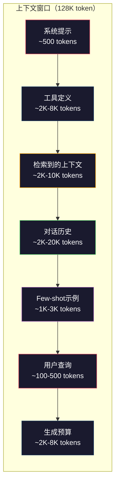
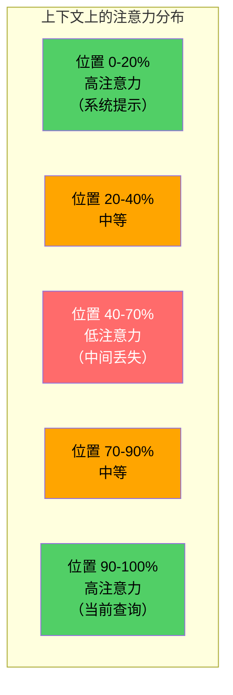
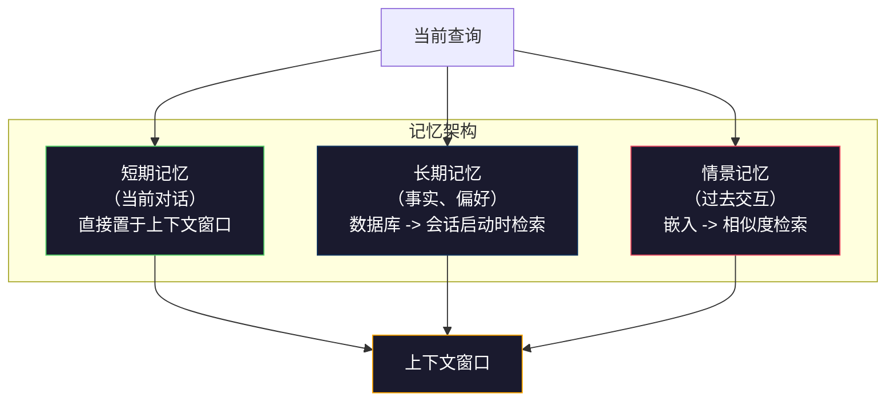

# 上下文工程：窗口、预算、记忆与检索

> 提示工程（Prompt Engineering）是一个子集。上下文工程（Context Engineering）才是全局游戏。提示是你输入的一个字符串。上下文是进入模型窗口的一切：系统指令、检索到的文档、工具定义、对话历史、Few-shot示例以及提示本身。2026年最优秀的AI工程师都是上下文工程师。他们决定什么进入窗口、什么排除在外，以及以什么顺序排列。

**类型：** 构建
**语言：** Python
**先决条件：** 第10阶段（从头构建LLM）、第11阶段第01-02课
**时间：** 约90分钟
**相关：** 第11阶段·15（提示缓存）——缓存友好布局是上下文工程的扩展。第5阶段·28（长上下文评估）——了解如何使用NIAH/RULER衡量"中间丢失"问题。

## 学习目标

- 计算所有上下文窗口组件的token预算（系统提示、工具、历史记录、检索到的文档、生成预留）
- 实现上下文窗口管理策略：截断、摘要和对话历史的滑动窗口
- 对上下文组件进行优先级排序和排序，以最大化模型对最相关信息的关注
- 构建一个上下文组装器，根据查询类型和可用窗口空间动态分配token

## 问题

Claude Opus 4.7 拥有200K token窗口（测试版为1M）。GPT-5为400K。Gemini 3 Pro为2M。Llama 4声称有10M。这些数字听起来巨大，直到你真正填充它们。

以下是编码助手的真实分解。系统提示：500个token。50个工具的工具定义：8,000个token。检索到的文档：4,000个token。对话历史（10轮）：6,000个token。当前用户查询：200个token。生成预算（最大输出）：4,000个token。总计：22,700个token。这仅占128K窗口的18%。

但注意力不会随上下文长度线性扩展。一个拥有128K token上下文的模型需要二次注意力代价（在标准Transformer中为O(n²)，尽管大多数生产模型使用高效的注意力变体）。更重要的是，检索准确性会下降。"大海捞针"测试表明，模型难以找到放置在长上下文中间的信息。Liu等人（2023）的研究显示，LLM在长上下文的开头和结尾检索信息时几乎完美准确，但对于放置在中间位置（上下文的40%-70%）的信息，准确性下降10-20%。这种"中间丢失"效应因模型而异，但影响所有当前架构。

实际教训：拥有200K token可用并不意味着使用200K token是有效的。精心策划的10K token上下文通常胜过随意填充的100K token上下文。上下文工程是在上下文窗口内最大化信噪比的学科。

你放入窗口的每个 token 都会取代一个可能携带更相关信息的 token。每个无关的工具定义、每轮过时的对话、每个检索到的但未回答问题的文本块——每一个都会让模型在任务上表现稍差。

## 概念

### 上下文窗口是稀缺资源

将上下文窗口视为 RAM，而非磁盘。它快速且可直接访问，但容量有限。你无法容纳所有内容。你必须做出选择。



每个组件都在争夺空间。增加更多工具定义意味着对话历史的空间更少。增加更多检索到的上下文意味着Few-shot示例的空间更少。上下文工程是分配此预算以最大化任务性能的艺术。

### 中间丢失

上下文工程中最重要的实证发现。模型更容易关注上下文的开头和结尾部分的信息。中间部分的信息获得的注意力分数较低，更有可能被忽略。

Liu等人（2023）系统地测试了这一点。他们将一个相关文档放置在20个不相关文档的不同位置，并测量回答准确性。当相关文档位于首位或末尾时，准确性为85-90%。当它位于中间（20个中的第10个位置）时，准确性降至60-70%。

这对工程具有直接影响：

- 将最重要的信息放在开头（系统提示、关键指令）
- 将当前查询和最相关的上下文放在最后（近因偏差有所帮助）
- 将上下文的中间部分视为最低优先级区域
- 如果必须将信息放在中间，则在末尾重复关键点



### 上下文组件

**系统提示**：设置角色、约束和行为规则。这部分放在开头，在对话轮次中保持不变。Claude Code的系统提示大约占用6,000个token，包括工具定义和行为指令。保持精炼。系统提示中的每个词都会在每次API调用时重复。

**工具定义**：每个工具增加50-200个token（名称、描述、参数模式）。50个工具，每个150个token，在发生任何对话之前就已经占用7,500个token。动态工具选择——只包含与当前查询相关的工具——可以将此减少60-80%。

**检索到的上下文**：来自向量数据库的文档、搜索结果、文件内容。检索质量直接决定响应质量。糟糕的检索比没有检索更糟糕——它会用噪声填满窗口，并主动误导模型。

**对话历史**：每个先前的用户消息和助手响应。随着对话长度线性增长。一轮50轮的对话，每轮200个token，历史记录为10,000个token。其中大部分与当前查询无关。

**Few-shot示例**：展示所需行为的输入/输出对。两到三个精心挑选的示例通常比数千个token的指令更能提高输出质量。但它们会占用空间。

**生成预算**：为模型响应预留的token。如果你将窗口填满至容量，模型就没有空间来回答。至少预留2,000-4,000个token用于生成。

### 上下文压缩策略

**历史摘要**：不要完全保留所有先前的轮次，而是定期总结对话。"我们讨论了X，决定Y，用户想要Z"，用100个token替换了原来占用2,000个token的10轮对话。当历史记录超过阈值（例如5,000个token）时运行摘要。

**相关性过滤**：根据当前查询对每个检索到的文档进行评分，并丢弃低于阈值的文档。如果你检索了10个块但只有3个相关，则丢弃其他7个。拥有3个高度相关的块比10个平庸的块更好。

**工具修剪**：对用户的查询意图进行分类，只包含与该意图相关的工具。代码问题不需要日历工具。排程问题不需要文件系统工具。这可以将工具定义从8,000个token减少到1,000个。

**递归摘要**：对于非常长的文档，分阶段进行摘要。首先总结每个部分，然后总结摘要。一份50页的文档变成500个token的摘要，捕捉关键点。

### 记忆系统

上下文工程跨越三个时间跨度。

**短期记忆**：当前对话。直接存储在上下文窗口中。随着每个轮次增长。通过摘要和截断进行管理。

**长期记忆**：跨对话持久化的事实和偏好。"用户偏好TypeScript。""项目使用PostgreSQL。"存储在数据库中，在会话启动时检索。Claude Code将其存储在CLAUDE.md文件中。ChatGPT将其存储在其记忆功能中。

**情景记忆**：可能相关的特定过去交互。"上周二，我们调试了身份验证模块中的类似问题。"存储为嵌入，在当前对话与过去的某个情节匹配时检索。



### 动态上下文组装

关键洞见：不同的查询需要不同的上下文。静态的系统提示 + 静态的工具 + 静态的历史记录是浪费的。最佳系统根据每个查询动态组装上下文。

1. 对查询意图进行分类
2. 选择相关工具（而非所有工具）
3. 检索相关文档（而非固定集合）
4. 包含相关的历史轮次（而非所有历史记录）
5. 添加与任务类型匹配的Few-shot示例
6. 按重要性排序：关键内容在前，重要内容在后，可选内容在中间

这就是优秀AI应用与卓越AI应用的区别所在。模型相同，上下文才是差异的关键。

## 构建

### 步骤1：Token计数器

你无法管理无法衡量的东西。构建一个简单的token计数器（使用空格分割近似计算，因为确切计数取决于分词器）。

```python
import json
import numpy as np
from collections import OrderedDict

def count_tokens(text):
    if not text:
        return 0
    return int(len(text.split()) * 1.3)

def count_tokens_json(obj):
    return count_tokens(json.dumps(obj))
```

### 步骤2：上下文预算管理器

核心抽象。预算管理器跟踪每个组件使用的token数量并强制执行限制。

```python
class ContextBudget:
    def __init__(self, max_tokens=128000, generation_reserve=4000):
        self.max_tokens = max_tokens
        self.generation_reserve = generation_reserve
        self.available = max_tokens - generation_reserve
        self.allocations = OrderedDict()

    def allocate(self, component, content, max_tokens=None):
        tokens = count_tokens(content)
        if max_tokens and tokens > max_tokens:
            words = content.split()
            target_words = int(max_tokens / 1.3)
            content = " ".join(words[:target_words])
            tokens = count_tokens(content)

        used = sum(self.allocations.values())
        if used + tokens > self.available:
            allowed = self.available - used
            if allowed <= 0:
                return None, 0
            words = content.split()
            target_words = int(allowed / 1.3)
            content = " ".join(words[:target_words])
            tokens = count_tokens(content)

        self.allocations[component] = tokens
        return content, tokens

    def remaining(self):
        used = sum(self.allocations.values())
        return self.available - used

    def utilization(self):
        used = sum(self.allocations.values())
        return used / self.max_tokens

    def report(self):
        total_used = sum(self.allocations.values())
        lines = []
        lines.append(f"上下文预算报告（{self.max_tokens:,} token窗口）")
        lines.append("-" * 50)
        for component, tokens in self.allocations.items():
            pct = tokens / self.max_tokens * 100
            bar = "#" * int(pct / 2)
            lines.append(f"  {component:<25} {tokens:>6} tokens ({pct:>5.1f}%) {bar}")
        lines.append("-" * 50)
        lines.append(f"  {'已使用':<25} {total_used:>6} tokens ({total_used/self.max_tokens*100:.1f}%)")
        lines.append(f"  {'生成预留':<25} {self.generation_reserve:>6} tokens")
        lines.append(f"  {'剩余':<25} {self.remaining():>6} tokens")
        return "\n".join(lines)
```

### 步骤3：中间丢失重排序

实现重排序策略：最重要的项目放在开头和结尾，最不重要的放在中间。

```python
def reorder_lost_in_middle(items, scores):
    paired = sorted(zip(scores, items), reverse=True)
    sorted_items = [item for _, item in paired]

    if len(sorted_items) <= 2:
        return sorted_items

    first_half = sorted_items[::2]
    second_half = sorted_items[1::2]
    second_half.reverse()

    return first_half + second_half

def score_relevance(query, documents):
    query_words = set(query.lower().split())
    scores = []
    for doc in documents:
        doc_words = set(doc.lower().split())
        if not query_words:
            scores.append(0.0)
            continue
        overlap = len(query_words & doc_words) / len(query_words)
        scores.append(round(overlap, 3))
    return scores
```

### 步骤4：对话历史压缩器

总结旧的对话轮次以回收token预算。

```python
class ConversationManager:
    def __init__(self, max_history_tokens=5000):
        self.turns = []
        self.summaries = []
        self.max_history_tokens = max_history_tokens

    def add_turn(self, role, content):
        self.turns.append({"role": role, "content": content})
        self._compress_if_needed()

    def _compress_if_needed(self):
        total = sum(count_tokens(t["content"]) for t in self.turns)
        if total <= self.max_history_tokens:
            return

        while total > self.max_history_tokens and len(self.turns) > 4:
            old_turns = self.turns[:2]
            summary = self._summarize_turns(old_turns)
            self.summaries.append(summary)
            self.turns = self.turns[2:]
            total = sum(count_tokens(t["content"]) for t in self.turns)

    def _summarize_turns(self, turns):
        parts = []
        for t in turns:
            content = t["content"]
            if len(content) > 100:
                content = content[:100] + "..."
            parts.append(f"{t['role']}: {content}")
        return "先前对话： " + " | ".join(parts)

    def get_context(self):
        parts = []
        if self.summaries:
            parts.append("[对话摘要]")
            for s in self.summaries:
                parts.append(s)
        parts.append("[近期对话]")
        for t in self.turns:
            parts.append(f"{t['role']}: {t['content']}")
        return "\n".join(parts)

    def token_count(self):
        return count_tokens(self.get_context())
```

### 步骤5：动态工具选择器

只包含与当前查询相关的工具。对意图进行分类，然后进行过滤。

```python
TOOL_REGISTRY = {
    "read_file": {
        "description": "读取文件内容",
        "tokens": 120,
        "categories": ["code", "files"],
    },
    "write_file": {
        "description": "将内容写入文件",
        "tokens": 150,
        "categories": ["code", "files"],
    },
    "search_code": {
        "description": "在代码库中搜索模式",
        "tokens": 130,
        "