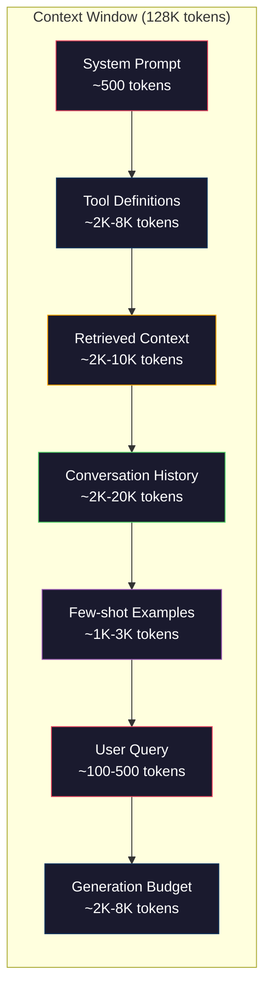
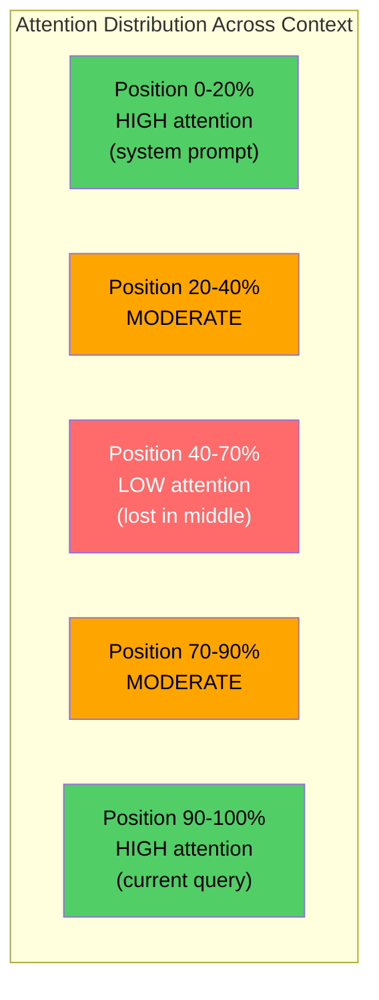
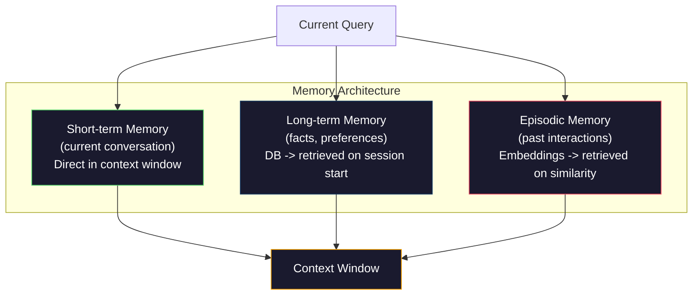

# 上下文工程：窗口、预算、内存与检索

> 提示工程是子集。上下文工程是整场游戏。提示是你输入的字符串。上下文是进入模型窗口的一切：系统指令、检索文档、工具定义、对话历史、少样本示例和提示本身。2026年最优秀的AI工程师是上下文工程师。他们决定什么放入、什么排除、以及以什么顺序。

**类型：** Build
**语言：** Python
**前置知识：** 第10阶段（从头构建LLM），第11阶段第01-02课
**时间：** ~90分钟
**相关：** 第11阶段 · 15（提示缓存）——缓存友好的布局是上下文工程的延伸。第5阶段 · 28（长上下文评估）用于如何使用NIAH/RULER测量"迷失在 middle"。

## 学习目标

- 计算所有上下文窗口组件的token预算（系统提示、工具、历史、检索文档、生成余量）
- 实现上下文窗口管理策略：截断、摘要和对话历史的滑动窗口
- 优先排序和排序上下文组件，以最大化模型对最相关信息的注意力
- 构建上下文组装器，根据查询类型和可用窗口空间动态分配token

## 问题背景

Claude Opus 4.7有200K token窗口（beta版1M）。GPT-5有400K。Gemini 3 Pro有2M。Llama 4声称10M。这些数字听起来巨大，直到你填满它们。

以下是一个编码助手的真实分解。系统提示：500 token。50个工具的工具定义：8,000 token。检索文档：4,000 token。对话历史（10轮）：6,000 token。当前用户查询：200 token。生成预算（最大输出）：4,000 token。总计：22,700 token。这仅占128K窗口的18%。

但注意力不会随上下文长度线性扩展。具有128K token上下文的模型支付二次注意力成本（普通transformer中是O(n^2)，尽管大多数生产模型使用高效注意力变体）。更重要的是，检索准确率会下降。"大海捞针"测试显示，模型难以在长上下文的中间找到信息。Liu等人（2023）的研究表明，LLM在上下文开头和结尾检索信息的准确率接近完美，但对于放在中间的信息（上下文的40-70%位置），准确率下降10-20%。这种"迷失在 middle"效应因模型而异，但影响所有当前架构。

实际教训：拥有200K token可用并不意味着使用200K token是有效的。精心策划的10K token上下文通常胜过倾倒的100K token上下文。上下文工程是在上下文窗口内最大化信噪比的学科。

你放入窗口的每个token都会取代可能携带更相关信息的token。每个不相关的工具定义、每个陈旧的对话轮次、每个不回答问题的检索文本块——每一个都让模型在任务上稍微变差。

## 核心概念

### 上下文窗口是稀缺资源

将上下文窗口视为RAM，而非磁盘。它快速且可直接访问，但有限。你无法放入所有内容。你必须选择。



每个组件争夺空间。添加更多工具定义意味着对话历史的更少空间。添加更多检索上下文意味着少样本示例的更少空间。上下文工程是分配此预算以最大化任务性能的艺术。

### 迷失在 Middle

上下文工程中最重要的实证发现。模型对上下文开头和结尾的信息注意力更好。中间的信息获得较低注意力分数，更可能被忽略。

Liu等人（2023）系统地测试了这一点。他们将相关文档放在20个不相关文档中的不同位置，并测量回答准确率。当相关文档是第一个或最后一个时，准确率为85-90%。当它在中间（20个中的第10个）时，准确率下降到60-70%。

这有直接工程含义：

- 将最重要的信息放在最前（系统提示、关键指令）
- 将当前查询和最相关的上下文放在最后（近因偏见有帮助）
- 将上下文的中间视为最低优先级区域
- 如果必须在中间包含信息，在末尾重复关键点



### 上下文组件

**System prompt**：设置角色、约束和行为规则。这放在第一位，在轮次之间保持不变。Claude Code的系统提示大约使用6,000 token，包括工具定义和行为指令。保持紧凑。系统提示中的每个词在每次API调用时都会重复。

**Tool definitions**：每个工具添加50-200 token（名称、描述、参数schema）。50个工具各150 token，在任何对话发生前就是7,500 token。动态工具选择——仅包含与当前查询相关的工具——可以减少60-80%。

**Retrieved context**：来自向量数据库的文档、搜索结果、文件内容。检索质量直接决定响应质量。糟糕的检索比没有检索更糟——它用噪声填满窗口并主动误导模型。

**Conversation history**：每个先前的用户消息和助手响应。随对话长度线性增长。50轮对话每轮200 token就是10,000 token的历史。其中大部分与当前查询无关。

**Few-shot examples**：演示期望行为的输入/输出对。两三个精选示例通常比数千token的指令更能提高输出质量。但它们占用空间。

**Generation budget**：为模型响应预留的token。如果你将窗口填满到容量，模型就没有回答的空间。为生成预留至少2,000-4,000 token。

### 上下文压缩策略

**History summarization**：不是逐字保留所有先前轮次，而是定期总结对话。"我们讨论了X，决定了Y，用户想要Z"用100 token取代了占用2,000 token的10轮。当历史超过阈值（例如5,000 token）时运行总结。

**Relevance filtering**：对每个检索文档与当前查询的相关性打分，并丢弃低于阈值的文档。如果你检索了10个块但只有3个相关，丢弃其他7个。3个高度相关的块胜过10个平庸的块。

**Tool pruning**：分类用户查询意图，只包含与该意图相关的工具。代码问题不需要日历工具。调度问题不需要文件系统工具。这可以将工具定义从8,000 token减少到1,000。

**Recursive summarization**：对于非常长的文档，分阶段总结。首先总结每个部分，然后总结这些总结。一份50页的文档变成捕获关键点的500 token摘要。

### 内存系统

上下文工程跨越三个时间跨度。

**Short-term memory**：当前对话。直接存储在上下文窗口中。随每轮增长。通过摘要和截断管理。

**Long-term memory**：跨对话持续存在的事实和偏好。"用户偏好TypeScript。""项目使用PostgreSQL。"存储在数据库中，会话开始时检索。Claude Code将其存储在CLAUDE.md文件中。ChatGPT将其存储在记忆功能中。

**Episodic memory**：可能相关的特定过去交互。"上周二，我们在auth模块中调试了类似问题。"存储为嵌入，当当前对话匹配过去情节时检索。



### 动态上下文组装

关键洞察：不同查询需要不同上下文。静态系统提示 + 静态工具 + 静态历史是浪费的。最好的系统按查询动态组装上下文。

1. 分类查询意图
2. 选择相关工具（不是所有工具）
3. 检索相关文档（不是固定集合）
4. 包含相关历史轮次（不是所有历史）
5. 添加匹配任务类型的少样本示例
6. 按重要性排序一切：关键优先，重要最后，可选在中间

这就是区分好的AI应用和伟大的AI应用的地方。模型是相同的。上下文是差异化因素。

## 动手构建

### 步骤1：Token计数器

你无法预算你无法测量的东西。构建一个简单的token计数器（使用空格分割近似，因为精确计数取决于tokenizer）。

```python
import json
import numpy as np
from collections import OrderedDict

def count_tokens(text):
    if not text:
        return 0
    return int(len(text.split()) * 1.3)

def count_tokens_json(obj):
    return count_tokens(json.dumps(obj))
```

### 步骤2：上下文预算管理器

核心抽象。预算管理器跟踪每个组件使用多少token并强制执行限制。

```python
class ContextBudget:
    def __init__(self, max_tokens=128000, generation_reserve=4000):
        self.max_tokens = max_tokens
        self.generation_reserve = generation_reserve
        self.available = max_tokens - generation_reserve
        self.allocations = OrderedDict()

    def allocate(self, component, content, max_tokens=None):
        tokens = count_tokens(content)
        if max_tokens and tokens > max_tokens:
            words = content.split()
            target_words = int(max_tokens / 1.3)
            content = " ".join(words[:target_words])
            tokens = count_tokens(content)

        used = sum(self.allocations.values())
        if used + tokens > self.available:
            allowed = self.available - used
            if allowed <= 0:
                return None, 0
            words = content.split()
            target_words = int(allowed / 1.3)
            content = " ".join(words[:target_words])
            tokens = count_tokens(content)

        self.allocations[component] = tokens
        return content, tokens

    def remaining(self):
        used = sum(self.allocations.values())
        return self.available - used

    def utilization(self):
        used = sum(self.allocations.values())
        return used / self.max_tokens

    def report(self):
        total_used = sum(self.allocations.values())
        lines = []
        lines.append(f"Context Budget Report ({self.max_tokens:,} token window)")
        lines.append("-" * 50)
        for component, tokens in self.allocations.items():
            pct = tokens / self.max_tokens * 100
            bar = "#" * int(pct / 2)
            lines.append(f"  {component:<25} {tokens:>6} tokens ({pct:>5.1f}%) {bar}")
        lines.append("-" * 50)
        lines.append(f"  {'Used':<25} {total_used:>6} tokens ({total_used/self.max_tokens*100:.1f}%)")
        lines.append(f"  {'Generation reserve':<25} {self.generation_reserve:>6} tokens")
        lines.append(f"  {'Remaining':<25} {self.remaining():>6} tokens")
        return "\n".join(lines)
```

### 步骤3：迷失在 Middle 重排序

实现重排序策略：最重要的项放在第一和最后，最不重要的放在中间。

```python
def reorder_lost_in_middle(items, scores):
    paired = sorted(zip(scores, items), reverse=True)
    sorted_items = [item for _, item in paired]

    if len(sorted_items) <= 2:
        return sorted_items

    first_half = sorted_items[::2]
    second_half = sorted_items[1::2]
    second_half.reverse()

    return first_half + second_half

def score_relevance(query, documents):
    query_words = set(query.lower().split())
    scores = []
    for doc in documents:
        doc_words = set(doc.lower().split())
        if not query_words:
            scores.append(0.0)
            continue
        overlap = len(query_words & doc_words) / len(query_words)
        scores.append(round(overlap, 3))
    return scores
```

### 步骤4：对话历史压缩器

总结旧对话轮次以回收token预算。

```python
class ConversationManager:
    def __init__(self, max_history_tokens=5000):
        self.turns = []
        self.summaries = []
        self.max_history_tokens = max_history_tokens

    def add_turn(self, role, content):
        self.turns.append({"role": role, "content": content})
        self._compress_if_needed()

    def _compress_if_needed(self):
        total = sum(count_tokens(t["content"]) for t in self.turns)
        if total <= self.max_history_tokens:
            return

        while total > self.max_history_tokens and len(self.turns) > 4:
            old_turns = self.turns[:2]
            summary = self._summarize_turns(old_turns)
            self.summaries.append(summary)
            self.turns = self.turns[2:]
            total = sum(count_tokens(t["content"]) for t in self.turns)

    def _summarize_turns(self, turns):
        parts = []
        for t in turns:
            content = t["content"]
            if len(content) > 100:
                content = content[:100] + "..."
            parts.append(f"{t['role']}: {content}")
        return "Previous: " + " | ".join(parts)

    def get_context(self):
        parts = []
        if self.summaries:
            parts.append("[Conversation Summary]")
            for s in self.summaries:
                parts.append(s)
        parts.append("[Recent Conversation]")
        for t in self.turns:
            parts.append(f"{t['role']}: {t['content']}")
        return "\n".join(parts)

    def token_count(self):
        return count_tokens(self.get_context())
```

### 步骤5：动态工具选择器

只包含与当前查询相关的工具。分类意图，然后过滤。

```python
TOOL_REGISTRY = {
    "read_file": {
        "description": "Read contents of a file",
        "tokens": 120,
        "categories": ["code", "files"],
    },
    "write_file": {
        "description": "Write content to a file",
        "tokens": 150,
        "categories": ["code", "files"],
    },
    "search_code": {
        "description": "Search for patterns in codebase",
        "tokens": 130,
        "categories": ["code"],
    },
    "run_command": {
        "description": "Execute a shell command",
        "tokens": 140,
        "categories": ["code", "system"],
    },
    "create_calendar_event": {
        "description": "Create a new calendar event",
        "tokens": 180,
        "categories": ["calendar"],
    },
    "list_emails": {
        "description": "List recent emails",
        "tokens": 160,
        "categories": ["email"],
    },
    "send_email": {
        "description": "Send an email message",
        "tokens": 200,
        "categories": ["email"],
    },
    "web_search": {
        "description": "Search the web for information",
        "tokens": 140,
        "categories": ["research"],
    },
    "query_database": {
        "description": "Run a SQL query on the database",
        "tokens": 170,
        "categories": ["code", "data"],
    },
    "generate_chart": {
        "description": "Generate a chart from data",
        "tokens": 190,
        "categories": ["data", "visualization"],
    },
}

def classify_intent(query):
    query_lower = query.lower()

    intent_keywords = {
        "code": ["code", "function", "bug", "error", "file", "implement", "refactor", "debug", "test"],
        "calendar": ["meeting", "schedule", "calendar", "appointment", "event"],
        "email": ["email", "mail", "send", "inbox", "message"],
        "research": ["search", "find", "what is", "how does", "explain", "look up"],
        "data": ["data", "query", "database", "chart", "graph", "analytics", "sql"],
    }

    scores = {}
    for intent, keywords in intent_keywords.items():
        score = sum(1 for kw in keywords if kw in query_lower)
        if score > 0:
            scores[intent] = score

    if not scores:
        return ["code"]

    max_score = max(scores.values())
    return [intent for intent, score in scores.items() if score >= max_score * 0.5]

def select_tools(query, token_budget=2000):
    intents = classify_intent(query)
    relevant = {}
    total_tokens = 0

    for name, tool in TOOL_REGISTRY.items():
        if any(cat in intents for cat in tool["categories"]):
            if total_tokens + tool["tokens"] <= token_budget:
                relevant[name] = tool
                total_tokens += tool["tokens"]

    return relevant, total_tokens
```

### 步骤6：完整上下文组装Pipeline

将所有内容连接起来。给定查询，动态组装最优上下文。

```python
class ContextEngine:
    def __init__(self, max_tokens=128000, generation_reserve=4000):
        self.budget = ContextBudget(max_tokens, generation_reserve)
        self.conversation = ConversationManager(max_history_tokens=5000)
        self.system_prompt = (
            "You are a helpful AI assistant. You have access to tools for "
            "code editing, file management, web search, and data analysis. "
            "Use the appropriate tools for each task. Be concise and accurate."
        )
        self.knowledge_base = [
            "Python 3.12 introduced type parameter syntax for generic classes using bracket notation.",
            "The project uses PostgreSQL 16 with pgvector for embedding storage.",
            "Authentication is handled by Supabase Auth with JWT tokens.",
            "The frontend is built with Next.js 15 using the App Router.",
            "API rate limits are set to 100 requests per minute per user.",
            "The deployment pipeline uses GitHub Actions with Docker multi-stage builds.",
            "Test coverage must be above 80% for all new modules.",
            "The codebase follows the repository pattern for data access.",
        ]

    def assemble(self, query):
        self.budget = ContextBudget(self.budget.max_tokens, self.budget.generation_reserve)

        system_content, _ = self.budget.allocate("system_prompt", self.system_prompt, max_tokens=1000)

        tools, tool_tokens = select_tools(query, token_budget=2000)
        tool_text = json.dumps(list(tools.keys()))
        tool_content, _ = self.budget.allocate("tools", tool_text, max_tokens=2000)

        relevance = score_relevance(query, self.knowledge_base)
        threshold = 0.1
        relevant_docs = [
