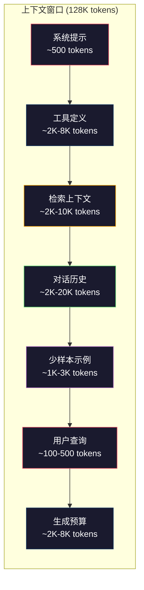
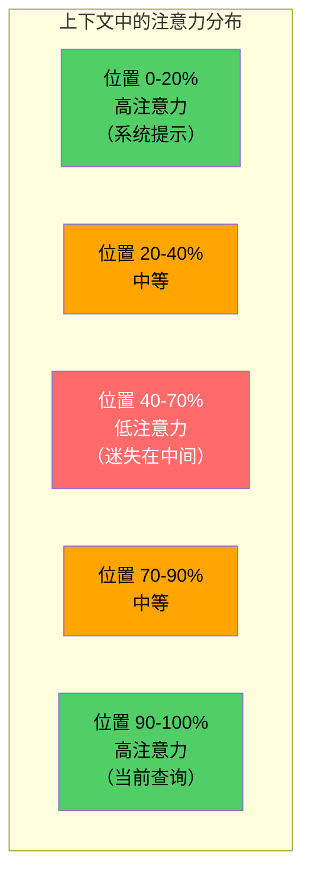
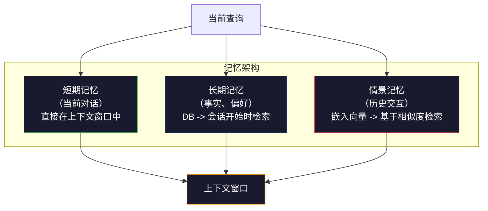

# 上下文工程：窗口、预算、记忆与检索

> 提示工程是一个子集。上下文工程才是全局游戏。提示是你输入的字符串。上下文是进入模型窗口的一切：系统指令、检索到的文档、工具定义、对话历史、少样本示例以及提示本身。2026 年最优秀的 AI 工程师都是上下文工程师。他们决定什么该进去、什么该排除、以及按照什么顺序。

**类型：** 构建
**语言：** Python
**前置要求：** 阶段 10（从零构建 LLM），阶段 11 课程 01-02
**时间：** ~90 分钟
**相关：** 阶段 11 · 15（提示缓存）——缓存友好的布局是上下文工程的延伸。阶段 5 · 28（长上下文评估）——了解如何使用 NIAH/RULER 衡量"迷失在中间"。

## 学习目标

- 计算所有上下文窗口组件的 Token 预算（系统提示、工具、历史、检索文档、生成预留空间）
- 实现上下文窗口管理策略：对话历史的截断、摘要和滑动窗口
- 对上下文组件进行优先级排序和排序，以最大化模型对最相关信息的注意力
- 构建一个上下文组装器，根据查询类型和可用窗口空间动态分配 Token

## 问题

Claude Opus 4.7 拥有 200K Token 窗口（Beta 版 1M）。GPT-5 拥有 400K。Gemini 3 Pro 拥有 2M。Llama 4 号称 10M。这些数字听起来巨大无比，直到你真的去填满它们。

这是一个编码助手的真实分解。系统提示：500 Token。50 个工具的工具定义：8,000 Token。检索到的文档：4,000 Token。对话历史（10 轮）：6,000 Token。当前用户查询：200 Token。生成预算（最大输出）：4,000 Token。总计：22,700 Token。这仅占 128K 窗口的 18%。

但注意力并不会随上下文长度线性扩展。一个拥有 128K Token 上下文的模型需要付出二次注意力的代价（在标准 Transformer 中为 O(n²)，尽管大多数生产模型使用高效注意力变体）。更重要的是，检索准确率会下降。"大海捞针"测试表明，模型难以找到放在长上下文中间位置的信息。Liu 等人（2023）的研究表明，LLM 能以近乎完美的准确率检索长上下文开头和结尾的信息，但对于放在中间位置（上下文 40-70% 的位置）的信息，准确率下降 10-20%。这种"迷失在中间"的效果因模型而异，但影响所有当前的架构。

实际教训：拥有 200K Token 的可用空间并不意味着使用 200K Token 是有效的。一个精心策划的 10K Token 上下文通常胜过随意倾倒的 100K Token 上下文。上下文工程就是在上下文窗口内最大化信噪比的技艺。

你放入窗口的每一个 Token 都会挤掉一个可能承载更相关信息的 Token。每一个无关的工具定义、每一轮陈旧的对话、每一段不能回答问题的检索文本——每一处都让模型在任务上的表现稍微变差。

## 概念

### 上下文窗口是稀缺资源

把上下文窗口想象成 RAM，而不是磁盘。它快速、可直接访问，但空间有限。你无法容纳一切。你必须做出选择。


```mermaid
graph TD
    subgraph Window["上下文窗口 (128K tokens)"]
        direction TB
        S["系统提示\n~500 tokens"] --> T["工具定义\n~2K-8K tokens"]
        T --> R["检索上下文\n~2K-10K tokens"]
        R --> H["对话历史\n~2K-20K tokens"]
        H --> F["少样本示例\n~1K-3K tokens"]
        F --> Q["用户查询\n~100-500 tokens"]
        Q --> G["生成预算\n~2K-8K tokens"]
    end

    style S fill:#1a1a2e,stroke:#e94560,color:#fff
    style T fill:#1a1a2e,stroke:#0f3460,color:#fff
    style R fill:#1a1a2e,stroke:#ffa500,color:#fff
    style H fill:#1a1a2e,stroke:#51cf66,color:#fff
    style F fill:#1a1a2e,stroke:#9b59b6,color:#fff
    style Q fill:#1a1a2e,stroke:#e94560,color:#fff
    style G fill:#1a1a2e,stroke:#0f3460,color:#fff
```

每个组件都在争抢空间。添加更多工具定义意味着对话历史的可用空间减少。添加更多检索上下文意味着少样本示例的可用空间减少。上下文工程就是分配这个预算以最大化任务表现的艺术。

### 迷失在中间

上下文工程中最重要的经验发现。模型对上下文开头和结尾的信息关注度更高。中间位置的信息获得的注意力分数更低，更有可能被忽略。

Liu 等人（2023）系统性地测试了这一点。他们将一个相关文档放在 20 个无关文档中的不同位置，并测量回答准确率。当相关文档在开头或结尾时，准确率为 85-90%。当它在中间位置（20 个中的第 10 个）时，准确率降至 60-70%。

这对工程有直接启示：

- 将最重要的信息放在开头（系统提示、关键指令）
- 将当前查询和最相关的上下文放在最后（近因偏差有帮助）
- 将上下文中间视为最低优先级区域
- 如果必须将信息放在中间，在结尾重复关键点


```mermaid
graph LR
    subgraph Attention["上下文中的注意力分布"]
        direction LR
        P1["位置 0-20%\n高注意力\n（系统提示）"]
        P2["位置 20-40%\n中等"]
        P3["位置 40-70%\n低注意力\n（迷失在中间）"]
        P4["位置 70-90%\n中等"]
        P5["位置 90-100%\n高注意力\n（当前查询）"]
    end

    style P1 fill:#51cf66,color:#000
    style P2 fill:#ffa500,color:#000
    style P3 fill:#ff6b6b,color:#fff
    style P4 fill:#ffa500,color:#000
    style P5 fill:#51cf66,color:#000
```

### 上下文组件

**系统提示**：设定角色、约束和行为规则。这部分放在最前面，在整个对话轮次中保持不变。Claude Code 大约使用 6,000 Token 作为系统提示（包括工具定义和行为指令）。保持精简。系统提示中的每一个词都会在每次 API 调用中重复。

**工具定义**：每个工具增加 50-200 Token（名称、描述、参数模式）。50 个工具，每个 150 Token，在发生任何对话之前就已经 7,500 Token。动态工具选择——只包含与当前查询相关的工具——可以减少 60-80% 的开销。

**检索上下文**：来自向量数据库的文档、搜索结果、文件内容。检索的质量直接决定响应的质量。糟糕的检索比没有检索更糟糕——它会用噪声填满窗口，并主动误导模型。

**对话历史**：每一条之前的用户消息和助手响应。随对话长度线性增长。50 轮对话，每轮 200 Token，就是 10,000 Token 的历史。其中大部分与当前查询无关。

**少样本示例**：展示所需行为的输入/输出对。两到三个精心挑选的示例通常比数千 Token 的指令更能改善输出质量。但它们会占用空间。

**生成预算**：为模型响应预留的 Token。如果你把窗口填满到容量上限，模型就没有空间来回答了。至少预留 2,000-4,000 Token 用于生成。

### 上下文压缩策略

**历史摘要**：不保留所有之前轮次的逐字内容，而是定期总结对话。"我们讨论了 X，决定了 Y，用户想要 Z"——用 100 Token 取代了占用 2,000 Token 的 10 轮对话。当历史超过阈值（例如 5,000 Token）时运行摘要。

**相关性过滤**：对每个检索到的文档与当前查询进行评分，丢弃低于阈值的文档。如果你检索了 10 个块但只有 3 个相关，丢弃其余 7 个。拥有 3 个高度相关的块胜过 10 个质量平庸的块。

**工具剪枝**：对用户查询意图进行分类，只包含与该意图相关的工具。一个代码问题不需要日历工具。一个日程安排问题不需要文件系统工具。这可以将工具定义从 8,000 Token 减少到 1,000 Token。

**递归摘要**：对于非常长的文档，分阶段进行摘要。先总结每个章节，然后总结摘要本身。一份 50 页的文档变成 500 Token 的精要摘要，捕捉了关键点。

### 记忆系统

上下文工程跨越三个时间跨度。

**短期记忆**：当前对话。直接存储在上下文窗口中。随每一轮对话增长。通过摘要和截断进行管理。

**长期记忆**：跨对话持久化的事实和偏好。"用户偏好 TypeScript。""项目使用 PostgreSQL。"存储在数据库中，在会话开始时检索。Claude Code 将其存储在 CLAUDE.md 文件中。ChatGPT 则存储在其记忆功能中。

**情景记忆**：可能相关的特定历史交互。"上周二，我们在 auth 模块中调试了类似问题。"存储为嵌入向量，在当前对话与过去情景匹配时检索。


```mermaid
graph TD
    subgraph Memory["记忆架构"]
        direction TB
        STM["短期记忆\n（当前对话）\n直接在上下文窗口中"]
        LTM["长期记忆\n（事实、偏好）\nDB -> 会话开始时检索"]
        EM["情景记忆\n（历史交互）\n嵌入向量 -> 基于相似度检索"]
    end

    Q["当前查询"] --> STM
    Q --> LTM
    Q --> EM

    STM --> CW["上下文窗口"]
    LTM --> CW
    EM --> CW

    style STM fill:#1a1a2e,stroke:#51cf66,color:#fff
    style LTM fill:#1a1a2e,stroke:#0f3460,color:#fff
    style EM fill:#1a1a2e,stroke:#e94560,color:#fff
    style CW fill:#1a1a2e,stroke:#ffa500,color:#fff
```

### 动态上下文组装

关键的洞察：不同的查询需要不同的上下文。静态的系统提示 + 静态的工具 + 静态的历史是一种浪费。最好的系统会为每个查询动态组装上下文。

1. 对查询意图进行分类
2. 选择相关工具（不是所有工具）
3. 检索相关文档（不是固定集合）
4. 包含相关的历史轮次（不是全部历史）
5. 添加与任务类型匹配的少样本示例
6. 按重要性排序：关键在前，重要在后，可选放中间

这就是区分优秀 AI 应用与卓越 AI 应用的关键。模型是一样的。上下文才是差异化的关键。

## 动手构建

### 步骤 1：Token 计数器

你无法预算你无法衡量的东西。构建一个简单的 Token 计数器（使用空白分隔进行近似估算，因为精确计数取决于分词器）。

```python
import json
import numpy as np
from collections import OrderedDict

def count_tokens(text):
    if not text:
        return 0
    return int(len(text.split()) * 1.3)

def count_tokens_json(obj):
    return count_tokens(json.dumps(obj))
```

### 步骤 2：上下文预算管理器

核心抽象。预算管理器跟踪每个组件使用了多少 Token 并强制执行限制。

```python
class ContextBudget:
    def __init__(self, max_tokens=128000, generation_reserve=4000):
        self.max_tokens = max_tokens
        self.generation_reserve = generation_reserve
        self.available = max_tokens - generation_reserve
        self.allocations = OrderedDict()

    def allocate(self, component, content, max_tokens=None):
        tokens = count_tokens(content)
        if max_tokens and tokens > max_tokens:
            words = content.split()
            target_words = int(max_tokens / 1.3)
            content = " ".join(words[:target_words])
            tokens = count_tokens(content)

        used = sum(self.allocations.values())
        if used + tokens > self.available:
            allowed = self.available - used
            if allowed <= 0:
                return None, 0
            words = content.split()
            target_words = int(allowed / 1.3)
            content = " ".join(words[:target_words])
            tokens = count_tokens(content)

        self.allocations[component] = tokens
        return content, tokens

    def remaining(self):
        used = sum(self.allocations.values())
        return self.available - used

    def utilization(self):
        used = sum(self.allocations.values())
        return used / self.max_tokens

    def report(self):
        total_used = sum(self.allocations.values())
        lines = []
        lines.append(f"上下文预算报告（{self.max_tokens:,} Token 窗口）")
        lines.append("-" * 50)
        for component, tokens in self.allocations.items():
            pct = tokens / self.max_tokens * 100
            bar = "#" * int(pct / 2)
            lines.append(f"  {component:<25} {tokens:>6} tokens ({pct:>5.1f}%) {bar}")
        lines.append("-" * 50)
        lines.append(f"  {'已使用':<25} {total_used:>6} tokens ({total_used/self.max_tokens*100:.1f}%)")
        lines.append(f"  {'生成预留':<25} {self.generation_reserve:>6} tokens")
        lines.append(f"  {'剩余':<25} {self.remaining():>6} tokens")
        return "\n".join(lines)
```

### 步骤 3：迷失在中间重排序

实现重排序策略：最重要的项目放在开头和结尾，最不重要的放在中间。

```python
def reorder_lost_in_middle(items, scores):
    paired = sorted(zip(scores, items), reverse=True)
    sorted_items = [item for _, item in paired]

    if len(sorted_items) <= 2:
        return sorted_items

    first_half = sorted_items[::2]
    second_half = sorted_items[1::2]
    second_half.reverse()

    return first_half + second_half

def score_relevance(query, documents):
    query_words = set(query.lower().split())
    scores = []
    for doc in documents:
        doc_words = set(doc.lower().split())
        if not query_words:
            scores.append(0.0)
            continue
        overlap = len(query_words & doc_words) / len(query_words)
        scores.append(round(overlap, 3))
    return scores
```

### 步骤 4：对话历史压缩器

总结旧的对话轮次以回收 Token 预算。

```python
class ConversationManager:
    def __init__(self, max_history_tokens=5000):
        self.turns = []
        self.summaries = []
        self.max_history_tokens = max_history_tokens

    def add_turn(self, role, content):
        self.turns.append({"role": role, "content": content})
        self._compress_if_needed()

    def _compress_if_needed(self):
        total = sum(count_tokens(t["content"]) for t in self.turns)
        if total <= self.max_history_tokens:
            return

        while total > self.max_history_tokens and len(self.turns) > 2:
            oldest = self.turns.pop(0)
            self.summaries.append(oldest)
            total = sum(count_tokens(t["content"]) for t in self.turns)

    def get_context(self):
        parts = []
        if self.summaries:
            summary_text = " ".join(s["content"] for s in self.summaries)
            summary = f"[之前的对话摘要：{summary_text[:200]}]"
            parts.append(summary)
        for t in self.turns:
            parts.append(f"{t['role']}: {t['content']}")
        return "\n".join(parts)

    def get_stats(self):
        turn_tokens = sum(count_tokens(t["content"]) for t in self.turns)
        summary_tokens = sum(count_tokens(s["content"]) for s in self.summaries)
        return {
            "active_turns": len(self.turns),
            "summarized_turns": len(self.summaries),
            "active_tokens": turn_tokens,
            "summary_tokens": summary_tokens,
            "total_tokens": turn_tokens + summary_tokens,
        }
```

### 步骤 5：动态工具选择器

基于查询分类动态选择工具。

```python
TOOL_REGISTRY = {
    "read_file": {
        "description": "Read a file from disk",
        "tokens": 120,
        "categories": ["code", "files"],
    },
    "write_file": {
        "description": "Write content to a file",
        "tokens": 150,
        "categories": ["code", "files"],
    },
    "search_code": {
        "description": "Search for patterns in codebase",
        "tokens": 130,
        "categories": ["code"],
    },
    "run_command": {
        "description": "Execute a shell command",
        "tokens": 140,
        "categories": ["code", "system"],
    },
    "create_calendar_event": {
        "description": "Create a new calendar event",
        "tokens": 180,
        "categories": ["calendar"],
    },
    "list_emails": {
        "description": "List recent emails",
        "tokens": 160,
        "categories": ["email"],
    },
    "send_email": {
        "description": "Send an email message",
        "tokens": 200,
        "categories": ["email"],
    },
    "web_search": {
        "description": "Search the web for information",
        "tokens": 140,
        "categories": ["research"],
    },
    "query_database": {
        "description": "Run a SQL query on the database",
        "tokens": 170,
        "categories": ["code", "data"],
    },
    "generate_chart": {
        "description": "Generate a chart from data",
        "tokens": 190,
        "categories": ["data", "visualization"],
    },
}

def classify_intent(query):
    query_lower = query.lower()

    intent_keywords = {
        "code": ["code", "function", "bug", "error", "file", "implement", "refactor", "debug", "test"],
        "calendar": ["meeting", "schedule", "calendar", "appointment", "event"],
        "email": ["email", "mail", "send", "inbox", "message"],
        "research": ["search", "find", "what is", "how does", "explain", "look up"],
        "data": ["data", "query", "database", "chart", "graph", "analytics", "sql"],
    }

    scores = {}
    for intent, keywords in intent_keywords.items():
        score = sum(1 for kw in keywords if kw in query_lower)
        if score > 0:
            scores[intent] = score

    if not scores:
        return ["code"]

    max_score = max(scores.values())
    return [intent for intent, score in scores.items() if score >= max_score * 0.5]

def select_tools(query, token_budget=2000):
    intents = classify_intent(query)
    relevant = {}
    total_tokens = 0

    for name, tool in TOOL_REGISTRY.items():
        if any(cat in intents for cat in tool["categories"]):
            if total_tokens + tool["tokens"] <= token_budget:
                relevant[name] = tool
                total_tokens += tool["tokens"]

    return relevant, total_tokens
```

### 步骤 6：完整上下文组装管线

将所有内容串联起来。给定一个查询，动态组装最优上下文。

```python
class ContextEngine:
    def __init__(self, max_tokens=128000, generation_reserve=4000):
        self.budget = ContextBudget(max_tokens, generation_reserve)
        self.conversation = ConversationManager(max_history_tokens=5000)
        self.system_prompt = (
            "You are a helpful AI assistant. You have access to tools for "
            "code editing, file management, web search, and data analysis. "
            "Use the appropriate tools for each task. Be concise and accurate."
        )
        self.knowledge_base = [
            "Python 3.12 introduced type parameter syntax for generic classes using bracket notation.",
            "The project uses PostgreSQL 16 with pgvector for embedding storage.",
            "Authentication is handled by Supabase Auth with JWT tokens.",
            "The frontend is built with Next.js 15 using the App Router.",
            "API rate limits are set to 100 requests per minute per user.",
            "The deployment pipeline uses GitHub Actions with Docker multi-stage builds.",
            "Test coverage must be above 80% for all new modules.",
            "The codebase follows the repository pattern for data access.",
        ]

    def assemble(self, query):
        self.budget = ContextBudget(self.budget.max_tokens, self.budget.generation_reserve)

        system_content, _ = self.budget.allocate("system_prompt", self.system_prompt, max_tokens=1000)

        tools, tool_tokens = select_tools(query, token_budget=2000)
        tool_text = json.dumps(list(tools.keys()))
        tool_content, _ = self.budget.allocate("tools", tool_text, max_tokens=2000)

        relevance = score_relevance(query, self.knowledge_base)
        threshold = 0.1
        relevant_docs = [
            doc for doc, score in zip(self.knowledge_base, relevance)
            if score >= threshold
        ]

        if relevant_docs:
            doc_scores = [s for s in relevance if s >= threshold]
            reordered = reorder_lost_in_middle(relevant_docs, doc_scores)
            doc_text = "\n".join(reordered)
            doc_content, _ = self.budget.allocate("retrieved_context", doc_text, max_tokens=3000)

        history_text = self.conversation.get_context()
        if history_text.strip():
            history_content, _ = self.budget.allocate("conversation_history", history_text, max_tokens=5000)

        query_content, _ = self.budget.allocate("user_query", query, max_tokens=500)

        return self.budget

    def chat(self, query):
        self.conversation.add_turn("user", query)
        budget = self.assemble(query)
        response = f"[Response to: {query[:50]}...]"
        self.conversation.add_turn("assistant", response)
        return budget


def run_demo():
    print("=" * 60)
    print("  上下文工程流水线演示")
    print("=" * 60)

    engine = ContextEngine(max_tokens=128000, generation_reserve=4000)

    print("\n--- 查询 1：代码任务 ---")
    budget = engine.chat("Fix the bug in the authentication module where JWT tokens expire too early")
    print(budget.report())

    print("\n--- 查询 2：研究任务 ---")
    budget = engine.chat("What is the best approach for implementing vector search in PostgreSQL?")
    print(budget.report())

    print("\n--- 查询 3：对话历史累积后 ---")
    for i in range(8):
        engine.conversation.add_turn("user", f"Follow-up question number {i+1} about the implementation details of the system")
        engine.conversation.add_turn("assistant", f"Here is the response to follow-up {i+1} with technical details about the architecture")

    budget = engine.chat("Now implement the changes we discussed")
    print(budget.report())

    print("\n--- 工具选择示例 ---")
    test_queries = [
        "Fix the bug in auth.py",
        "Schedule a meeting with the team for Tuesday",
        "Show me the database query performance stats",
        "Search for best practices on error handling",
    ]

    for q in test_queries:
        tools, tokens = select_tools(q)
        intents = classify_intent(q)
        print(f"\n  查询：{q}")
        print(f"  意图：{intents}")
        print(f"  工具：{list(tools.keys())} ({tokens} tokens)")

    print("\n--- 迷失在中间重排序 ---")
    docs = ["Doc A (most relevant)", "Doc B (somewhat relevant)", "Doc C (least relevant)",
            "Doc D (relevant)", "Doc E (moderately relevant)"]
    scores = [0.95, 0.60, 0.20, 0.80, 0.50]
    reordered = reorder_lost_in_middle(docs, scores)
    print(f"  原始顺序：{docs}")
    print(f"  分数：    {scores}")
    print(f"  重排序后：{reordered}")
    print(f"  （最相关在开头和结尾，最不相关在中间）")
```

## 实际应用

### Claude Code 的上下文策略

Claude Code 采用分层方法管理上下文。系统提示包含行为规则和工具定义（约 6K Token）。当你打开一个文件时，其内容被注入为上下文。当你搜索时，结果被添加进来。旧的对话轮次被总结。CLAUDE.md 提供跨会话持久化的长期记忆。

关键的工程决策：Claude Code 不会把你的整个代码库倾倒入上下文。它按需检索相关文件。这就是上下文工程的实践。

### Cursor 的动态上下文加载

Cursor 将你的整个代码库索引为嵌入向量。当你输入查询时，它使用向量相似度检索最相关的文件和代码块。只有这些片段进入上下文窗口。一个 50 万行的代码库被压缩为 5-10 个最相关的代码块。

这就是模式：嵌入一切，按需检索，只包含相关内容。

### ChatGPT 记忆

ChatGPT 将用户的偏好和事实存储为长期记忆。在每个对话开始时，相关的记忆被检索并包含在系统提示中。"用户偏好 Python"只需 5 个 Token，却能节省跨对话重复指令的数百 Token。

### RAG 作为上下文工程

检索增强生成（RAG）是上下文工程的形式化版本。它不是将知识塞进模型的权重（训练）或系统提示（静态上下文），而是在查询时检索相关文档并将其注入上下文窗口。整个 RAG 流水线——分块、嵌入、检索、重排序——存在的目的就是解决一个问题：将正确的信息放入上下文窗口。

## 产出成果

本课程产出 `outputs/prompt-context-optimizer.md`——一个可复用的提示，用于审计上下文组装策略并推荐优化方案。将你的系统提示、工具数量、平均历史长度和检索策略输入其中，它就能识别 Token 浪费并提出改进建议。

同时产出 `outputs/skill-context-engineering.md`——一个决策框架，用于根据任务类型、上下文窗口大小和延迟预算来设计上下文组装流水线。

## 练习

1. 为 `ContextBudget` 类添加一个"Token 浪费检测器"。它应标记使用超过 30% 预算的组件，并针对每种组件类型建议具体的压缩策略（总结历史、剪枝工具、重排序文档）。

2. 为检索上下文实现语义去重。如果两个检索到的文档相似度超过 80%（通过词重叠或嵌入向量的余弦相似度），只保留得分较高的那个。测量这样可以回收多少 Token 预算。

3. 构建一个"上下文回放"工具。给定一个对话记录，通过 `ContextEngine` 回放它，并可视化预算分配如何逐轮变化。绘制每组件的 Token 使用随时间变化的图表。识别上下文开始被压缩的那一轮。

4. 实现一个基于优先级的工具选择器。不是简单的包含/排除，而是为每个工具分配一个与当前查询的相关性分数。按相关性降序包含工具，直到工具预算耗尽。比较包含 5、10、20 和 50 个工具时的任务表现。

5. 构建一个多策略上下文压缩器。实现三种压缩策略（截断、摘要、关键句提取），并在 20 个文档的集合上进行基准测试。衡量压缩比与信息保留之间的权衡（压缩后的版本是否仍然包含问题的答案？）。

## 关键术语

| 术语 | 人们常说的 | 实际含义 |
|------|-----------|---------|
| 上下文窗口 | "模型能读多少" | 模型在一次前向传播中处理的最大 Token 数（输入 + 输出）——GPT-5 为 400K，Claude Opus 4.7 为 200K（Beta 版 1M），Gemini 3 Pro 为 2M |
| 上下文工程 | "高级提示工程" | 决定什么进入上下文窗口、以什么顺序、以什么优先级的学科——涵盖检索、压缩、工具选择和记忆管理 |
| 迷失在中间 | "模型会忘记中间的东西" | 经验发现：LLM 对上下文开头和结尾的注意力更高，中间位置的信息准确率下降 10-20% |
| Token 预算 | "你还剩多少 Token" | 将上下文窗口容量在组件间（系统提示、工具、历史、检索、生成）进行明确分配，并设置每组件的限制 |
| 动态上下文 | "动态加载内容" | 根据查询意图分类、相关工具选择和检索结果，为每个查询以不同方式组装上下文窗口 |
| 历史摘要 | "压缩对话" | 将旧的逐字对话轮次替换为简洁摘要，减少 Token 消耗同时保留关键信息 |
| 工具剪枝 | "只包含相关工具" | 对查询意图进行分类，只包含匹配的工具定义，将工具 Token 成本降低 60-80% |
| 长期记忆 | "跨会话记忆" | 存储在数据库中并在会话开始时检索的事实和偏好——CLAUDE.md、ChatGPT 记忆及类似系统 |
| 情景记忆 | "记住特定的过去事件" | 存储为嵌入向量的历史交互，在当前查询与过去对话相似时检索 |
| 生成预算 | "回答的空间" | 为模型输出预留的 Token——如果上下文完全填满窗口，模型就没有空间来响应 |

## 延伸阅读

- [Liu 等人, 2023 —— "迷失在中间：语言模型如何使用长上下文"](https://arxiv.org/abs/2307.03172) —— 关于位置依赖性注意力的权威研究，展示了模型在长上下文中间位置信息上的困难
- [Anthropic 的上下文检索博文](https://www.anthropic.com/news/contextual-retrieval) —— Anthropic 如何进行上下文感知的分块检索，将检索失败率降低 49%
- [Simon Willison 的"上下文工程"](https://simonwillison.net/2025/Jun/27/context-engineering/) —— 为该学科命名并将其与提示工程区分开来的博文
- [LangChain RAG 文档](https://python.langchain.com/docs/tutorials/rag/) —— 检索增强生成作为上下文工程模式的实践实现
- [Greg Kamradt 的大海捞针测试](https://github.com/gkamradt/LLMTest_NeedleInAHaystack) —— 揭示所有主要模型位置依赖性检索失败的基准测试
- [Pope 等人, "高效扩展 Transformer 推理" (2022)](https://arxiv.org/abs/2211.05102) —— 为什么上下文长度驱动内存和延迟，以及 KV 缓存、MQA 和 GQA 如何改变预算计算
- [Agrawal 等人, "SARATHI：通过分块预填充捎带解码实现高效 LLM 推理" (2023)](https://arxiv.org/abs/2308.16369) —— 使长提示在 TTFT 上昂贵但在 TPOT 上便宜的推理的两个阶段；上下文打包权衡背后的真实原理
- [Ainslie 等人, "GQA：从多头检查点训练广义多查询 Transformer 模型" (EMNLP 2023)](https://arxiv.org/abs/2305.13245) —— 分组查询注意力论文，在生产解码器中将 KV 内存减少 8 倍而不损失质量
