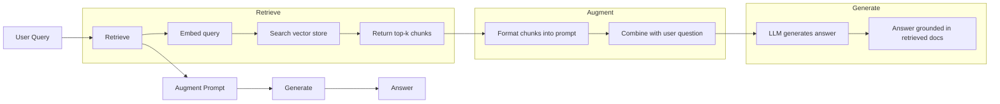
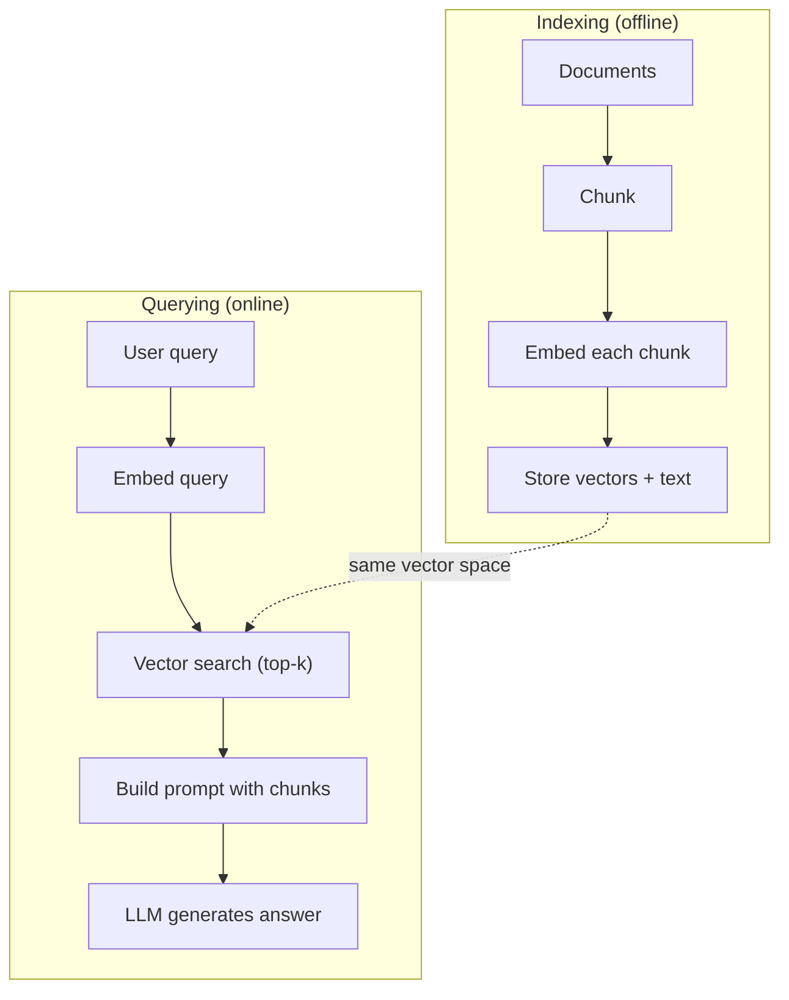

# RAG (Retrieval-Augmented Generation)

> LLMはtraining cutoffまでの一般知識は持っていますが、あなたの会社のdocs、codebase、先週のmeeting notesは知りません。RAGは関連documentsを取得してpromptへ詰めることでこの問題を解きます。production AIで最も広く使われるpatternです。このcourseで1つだけ作るなら、RAG pipelineを作ってください。

**種別:** 構築
**言語:** Python
**前提条件:** Phase 10 (LLMs from Scratch), Phase 11 Lessons 01-05
**所要時間:** 約90分
**Related:** Phase 5 · 23 (Chunking Strategies for RAG) は6つのchunking algorithmsと勝ち筋を扱います。Phase 5 · 22 (Embedding Models Deep Dive) はembedder選定を扱います。Phase 11 · 07 (Advanced RAG) はhybrid search、reranking、query transformationを扱います。

## Learning Objectives

- document loading、chunking、embedding、vector storage、retrieval、generationからなる完全なRAG pipelineを構築する
- ChromaDB、FAISS、Pineconeなどのvector databaseで適切なindexingを行い、semantic searchを実装する
- knowledge-grounded applicationsでRAGがfine-tuningより好まれる理由（cost、freshness、attribution）を説明する
- retrieval metrics（precision、recall）とgeneration metrics（faithfulness、relevance）でRAG品質を評価する

## 問題

会社向けchatbotを作ったとします。顧客が「enterprise planのrefund policyは何ですか」と聞きます。LLMは一般的なSaaS refund policyについて答えます。しかし実際のpolicyは200ページのinternal wikiに埋もれていて、enterprise customersは60-day windowとpro-rated refundsを受けられます。LLMはそのdocumentを見ていません。訓練されていないものは知りようがありません。

fine-tuningは一つの解決策です。LLMをinternal docsでtrainingし、更新modelをdeployします。しかしこれは高価で、documentが変わった瞬間に古くなり、どのsourceから答えたかも追跡しにくくなります。来月別product lineを買収したら、またfine-tuneです。

RAGはもう一つの解決策です。modelは触りません。質問が来たらdocument storeを検索し、関連passagesをpromptに貼り、modelにそのcontextを使って答えさせます。document storeは数分で更新できます。どのdocumentsがretrievedされたか見えます。model自体は変わりません。これがRAGがproductionで支配的な理由です。安く、新鮮で、監査しやすく、どのLLMでも動きます。

## The Concept

### The RAG Pattern

全体は4 stepsです。

Query -> Retrieve -> Augment prompt -> Generate。すべてのRAG systemはこのpatternに従います。production RAGの違いは、chunking、embedding、search、prompt constructionの細部にあります。

### Why RAG Beats Fine-Tuning

| Concern | Fine-tuning | RAG |
|---------|------------|-----|
| Cost | training runごとに$1,000-$100,000+ | queryごとに$0.01-$0.10（embedding + LLM） |
| Freshness | retrainまで古い | docsをre-indexすれば数分で更新 |
| Auditability | answerをsourceへ追跡しにくい | exact retrieved passagesを示せる |
| Hallucination | 自由にhallucinateし得る | retrieved documentsにgroundedされる |
| Data privacy | training dataがweightsに焼き込まれる | documentsはvector storeに留まる |

fine-tuningはmodel weightsを永久に変えます。RAGはmodel contextを一時的に変えます。多くのapplicationsでは一時的contextが必要です。

fine-tuningが勝つ場合は、promptingだけでは得られない特定のstyle、tone、reasoning patternをmodelへ採用させたいときです。factual knowledge retrievalではRAGが勝ちます。

### Embedding Models

embedding modelはtextをdense vectorへ変換します。似た意味のtextは高次元空間で近くなります。「How do I reset my password?」と「I need to change my password」は共有語が少なくても近いvectorsになります。

| Model | Dimensions | Provider | Notes |
|-------|-----------|----------|-------|
| text-embedding-3-small | 1536 (Matryoshka) | OpenAI | 多くの用途で価格性能が高い |
| text-embedding-3-large | 3072 (Matryoshka) | OpenAI | 高精度、256/512/1024へtruncate可能 |
| Gemini Embedding 2 | 3072 (Matryoshka) | Google | MTEB retrieval上位、8K context |
| voyage-4 | 1024/2048 (Matryoshka) | Voyage AI | code、finance、lawなどdomain variants |
| Cohere embed-v4 | 1024 (Matryoshka) | Cohere | multilingualに強く、128K context |
| BGE-M3 | 1024 (dense + sparse + ColBERT) | BAAI (open-weight) | 1 modelから3 views |
| Qwen3-Embedding | 4096 (Matryoshka) | Alibaba (open-weight) | open-weight retrievalで高スコア |
| all-MiniLM-L6-v2 | 384 | Open-weight (Sentence Transformers) | prototyping baseline |

このlessonではTF-IDFで簡易embeddingを作ります。productionで使うためではなく、textがvectorになり、似たtextが似たvectorになる概念を具体化するためです。

### Vector Similarity

2つのvectorsの類似度は主に3通りで測ります。

**Cosine similarity**: 2つのvectorsの角度のcosineです。-1（反対）から1（同一）まで。magnitudeを無視し、directionを見ます。RAGのdefaultです。

**Dot product**: raw inner productです。大きいvectorsほど高scoreになります。magnitudeが意味を持つ場合に有効です。

**L2 (Euclidean) distance**: vector space内の直線距離です。小さいほど似ています。magnitude差に敏感です。

通常「vector search」と言うとcosine similarityを指します。document lengthが違ってもmagnitudeで正規化されるため扱いやすいからです。

### Chunking Strategies

長いdocumentsを1つのvectorにすると、複数topicが混ざった悪いembeddingになります。そこでdocumentsをchunksに分割し、各chunkを個別にembedします。

**Fixed-size chunking**: N tokensごとに分割します。単純で予測可能です。512-token chunkに50-token overlapなら、chunk 1はtokens 0-511、chunk 2は462-973です。

**Semantic chunking**: paragraphs、sections、markdown headersなど自然な境界で分割します。各chunkがまとまった意味単位になります。

**Recursive chunking**: まず大きい境界（section headers）で分割し、まだ大きければparagraph、sentenceへ下げていきます。LangChain RecursiveCharacterTextSplitterの考え方です。

chunk sizeは重要です。

- 小さすぎる（64-128 tokens）: 文脈が足りない
- 大きすぎる（2048+ tokens）: 複数topicが混ざり関連度が薄まる
- ちょうどよい（256-512 tokens）: self-containedで、かつ焦点が絞られる

多くのproduction RAG systemsは256-512 token chunksと50-token overlapを使います。

### Vector Databases

embeddingsを保存し検索する場所が必要です。

| Database | Type | Best for |
|----------|------|----------|
| FAISS | Library (in-process) | prototyping、小-中規模datasets |
| Chroma | Lightweight DB | local development、小規模deployments |
| Pinecone | Managed service | ops負担なしのproduction |
| Weaviate | Open source DB | self-hosted production |
| pgvector | Postgres extension | すでにPostgresを使う場合 |
| Qdrant | Open source DB | high-performance self-hosted |

このlessonではin-memory vector storeを作ります。vectorsをlistへ保存し、brute-force cosine similarity searchを行います。flat indexのFAISSに相当し、遅くなる前に10万vectors程度まで扱えます。productionではHNSWなどのANN algorithmsでmillions of vectorsをmillisecondsで検索します。

### The Full Pipeline

indexing phaseは文書ごとに一度、または文書更新時に走ります。querying phaseはユーザーリクエストごとに走ります。productionではindexingに数時間、queryingには1秒未満が求められます。

### Real Numbers

多くのproduction RAG systemsは次の設定を使います。

- **k = 5 to 10** retrieved chunks per query
- **Chunk size = 256 to 512 tokens** with 50-token overlap
- **Context budget**: queryあたり2,500-5,000 tokensのretrieved content
- **Total prompt**: ~8,000-16,000 tokens
- **Embedding dimension**: modelに応じて384-3072
- **Indexing throughput**: API embeddingsで100-1,000 documents/second
- **Query latency**: retrieval 50-200ms、generation 500-3000ms

## 実装

このlessonでは、document chunking、TF-IDF embeddings、cosine similarity search、RAG prompt construction、complete RAG pipeline、simple generationを実装します。実装は `code/main.py` と `code/main.ts` にあります。productionではTF-IDF部分をOpenAI、Anthropic、Chroma、FAISSなどに置き換えるだけで、pipeline構造は同じです。

## Use It

real embedding modelとLLMを使っても、設計はほとんど変わりません。embedding functionをAPI callへ差し替え、generation functionをchat completionへ差し替え、brute-force searchをvector databaseへ置き換えます。chunking、retrieval、prompt constructionの考え方はmodel vendorに依存しません。

scaleしたvector storageではChroma、FAISS、Pinecone、Weaviate、pgvector、Qdrantなどを使います。重要なのは、indexingとqueryingで同じembedding spaceを使い、retrieved chunksをsource付きでpromptへ入れることです。

## Ship It

このlessonは次を生成します。

- `outputs/prompt-rag-architect.md` -- specific use cases向けにRAG systemsを設計するprompt
- `outputs/skill-rag-pipeline.md` -- agentsにRAG pipelinesの構築とdebugを教えるskill

## Exercises

1. TF-IDF embeddingsをsimple bag-of-words approach（wordが存在すれば1、なければ0）に置き換え、sample documentsでretrieval qualityを比較します。
2. chunk sizes 50、100、200、500 wordsを試し、同じ5 queriesでtop-3にrelevant chunkが入る数を数えます。
3. 各chunkにmetadata（source document name、chunk position）を追加し、prompt templateでsource attributionを含めます。
4. 10個のquestion-answer pairsを使い、retrieved chunksにanswerが含まれる割合を測るsimple evaluationを実装します。
5. last 3 exchangesのhistoryを保持し、retrieved chunksと一緒にpromptへ含めるconversation-aware RAG pipelineを作ります。

## Key Terms

| Term | What people say | What it actually means |
|------|----------------|----------------------|
| RAG | 「docsを読むAI」 | 関連documentsを取得し、promptへ貼り、documentsにgroundedしたanswerを生成すること |
| Embedding | 「textをnumbersに変換する」 | 似た意味が似たvectorsになるdense vector表現 |
| Vector database | 「AI用search engine」 | vectorsを保存し、similarityでnearest neighborsを探すdata store |
| Chunking | 「docsを分割する」 | documentsを小さなsegmentsに分け、個別にembed/retrieveできるようにすること |
| Cosine similarity | 「vectorsの類似度」 | 2 vectorsの角度のcosine。1は同一方向、0は直交、-1は反対 |
| Top-k retrieval | 「k個のbest matchesを取る」 | queryに最も似たk chunksをvector storeから返すこと |
| Context window | 「LLMが見られるtext量」 | LLMがsingle requestで処理できる最大tokens |
| Augmented generation | 「与えられたcontextで答える」 | trained knowledgeだけでなくretrieved documentsをcontextとして使って生成すること |
| TF-IDF | 「word importance scoring」 | Term Frequency x Inverse Document Frequency。corpus内で特徴的なwordsを重くする |
| Indexing | 「docsをsearch用に準備する」 | chunking、embedding、storingを行うoffline process |

## 参考文献

- Lewis et al., "Retrieval-Augmented Generation for Knowledge-Intensive NLP Tasks" (2020) -- retrieve-then-generate patternを形式化したoriginal RAG paper
- Anthropic's RAG documentation -- chunk sizes、prompt construction、evaluationの実践指針
- Pinecone Learning Center, "What is RAG?" -- production considerationsを含む視覚的説明
- Sentence-BERT: Reimers & Gurevych (2019) -- semantic similarity向けbi-encodersの基礎
- [Karpukhin et al., "Dense Passage Retrieval for Open-Domain Question Answering" (EMNLP 2020)](https://arxiv.org/abs/2004.04906) -- dense bi-encoder retrievalがBM25を上回ることを示したDPR paper
- [LlamaIndex High-Level Concepts](https://docs.llamaindex.ai/en/stable/getting_started/concepts.html) -- RAG pipelinesの主要概念
- [LangChain RAG tutorial](https://python.langchain.com/docs/tutorials/rag/) -- retrieve-then-generate patternのchain-of-runnables版
