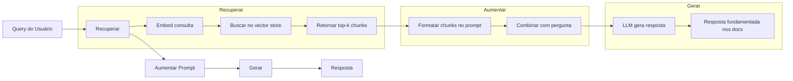

# RAG (Retrieval-Augmented Generation)

> Seu LLM sabe tudo até sua data de corte de treinamento. Não sabe nada sobre os docs da sua empresa, seu codebase ou as notas da reunião da semana passada. RAG resolve isso recuperando documentos relevantes e injetando-os no prompt. É o padrão mais implantado em IA de produção. Se você vai construir uma coisa deste curso, construa uma pipeline de RAG.

**Tipo:** Construção
**Linguagens:** Python
**Pré-requisitos:** Fase 10 (LLMs do Zero), Fase 11 Aulas 01-05
**Tempo:** ~90 minutos
**Relacionado:** Fase 5 · 23 (Chunking Strategies for RAG) para os seis algoritmos de chunking. Fase 5 · 22 (Embedding Models Deep Dive) para escolher o embedder. Fase 11 · 07 (Advanced RAG) para busca híbrida, reranking e transformação de consulta.

## Objetivos de Aprendizado

- Construir uma pipeline de RAG completa: carregamento de documentos, chunking, embedding, armazenamento vetorial, recuperação e geração
- Implementar busca semântica usando banco de dados vetorial (ChromaDB, FAISS ou Pinecone) com indexação adequada
- Explicar por que RAG é preferido a fine-tuning para aplicações baseadas em conhecimento (custo, frescor, auditabilidade)
- Avaliar qualidade de RAG usando métricas de retrieval (precisão, recall) e métricas de geração (fidelidade, relevância)

## O Problema

Você constrói um chatbot para sua empresa. Um cliente pergunta "Qual a política de reembolso para planos enterprise?" O LLM responde com uma resposta genérica sobre políticas típicas de SaaS. A política real, enterrada em um wiki interno de 200 páginas, diz que clientes enterprise têm 60 dias com reembolso proporcional. O LLM nunca viu esse documento.

Fine-tuning é uma solução. Pega o LLM, treina nos seus docs internos e implanta o modelo atualizado. Funciona, mas tem sérios problemas. Fine-tuning custa milhares de dólares. O modelo fica obsoleto no momento em que um documento muda. Você não consegue rastrear de qual fonte o modelo tirou a informação.

RAG é a outra solução. Deixe o modelo intocado. Quando uma pergunta chega, busque no seu store de documentos os trechos relevantes, cole-os no prompt antes da pergunta e deixe o modelo responder usando aqueles trechos como contexto. O store de documentos pode ser atualizado em minutos. Você pode ver exatamente quais documentos foram recuperados. O modelo em si nunca muda.

## O Conceito

### O Padrão RAG



### Por que RAG Supera Fine-Tuning

| Preocupação | Fine-tuning | RAG |
|-------------|------------|-----|
| Custo | $1.000-$100.000+ por treino | $0.01-$0.10 por consulta |
| Frescor | Obsoleto até re-treinar | Atualizado em minutos |
| Auditabilidade | Não rastreia fonte | Mostra trechos exatos |
| Alucinação | Ainda alucina livremente | Fundamentado em docs |
| Privacidade | Dados ficam nos pesos | Docs ficam no seu store |

### Modelos de Embedding (2026)

| Modelo | Dimensões | Provedor | Notas |
|--------|-----------|----------|-------|
| text-embedding-3-small | 1536 (Matryoshka) | OpenAI | Melhor custo/benefício |
| text-embedding-3-large | 3072 (Matryoshka) | OpenAI | Maior acurácia |
| Gemini Embedding 2 | 3072 (Matryoshka) | Google | Top MTEB retrieval |
| voyage-4 | 1024/2048 (Matryoshka) | Voyage AI | Variantes por domínio |
| Cohere embed-v4 | 1024 (Matryoshka) | Cohere | Forte multilingual |
| BGE-M3 | 1024 (dense+sparse+ColBERT) | BAAI | Três visões de um modelo |

### Estratégias de Chunking

- **Tamanho fixo**: Divide a cada N tokens. Simples e previsível.
- **Semântico**: Divide em limites naturais (parágrafos, seções).
- **Recursivo**: Tenta o maior limite primeiro, depois menor.

Tamanho ideal: 256-512 tokens com sobreposição de 50 tokens.

### Similaridade Cosseno

```
cosine_sim(a, b) = dot(a, b) / (||a|| * ||b||)
```

O padrão para RAG. Ignora magnitude, só se importa com direção.

## Construa

### Passo 1: Chunking

```python
def chunk_text(text, chunk_size=200, overlap=50):
    words = text.split()
    chunks = []
    start = 0
    while start < len(words):
        end = start + chunk_size
        chunk = " ".join(words[start:end])
        chunks.append(chunk)
        start += chunk_size - overlap
    return chunks
```

### Passo 2: TF-IDF Embeddings

```python
import math
from collections import Counter

def build_vocabulary(documents):
    vocab = set()
    for doc in documents:
        vocab.update(doc.lower().split())
    return sorted(vocab)

def compute_tf(text, vocab):
    words = text.lower().split()
    count = Counter(words)
    total = len(words)
    return [count.get(word, 0) / total for word in vocab]

def compute_idf(documents, vocab):
    n = len(documents)
    idf = []
    for word in vocab:
        doc_count = sum(1 for doc in documents if word in doc.lower().split())
        idf.append(math.log((n + 1) / (doc_count + 1)) + 1)
    return idf

def tfidf_embed(text, vocab, idf):
    tf = compute_tf(text, vocab)
    return [t * i for t, i in zip(tf, idf)]
```

### Passo 3: Busca por Similaridade Cosseno

```python
def cosine_similarity(a, b):
    dot = sum(x * y for x, y in zip(a, b))
    norm_a = math.sqrt(sum(x * x for x in a))
    norm_b = math.sqrt(sum(x * x for x in b))
    if norm_a == 0 or norm_b == 0:
        return 0.0
    return dot / (norm_a * norm_b)

def search(consulta_embedding, stored_embeddings, top_k=5):
    scores = []
    for i, emb in enumerate(stored_embeddings):
        sim = cosine_similarity(consulta_embedding, emb)
        scores.append((i, sim))
    scores.sort(key=lambda x: x[1], reverse=True)
    return scores[:top_k]
```

### Passo 4: Construção do Prompt

```python
def build_rag_prompt(consulta, retrieved_chunks):
    context = "\n\n---\n\n".join(
        f"[Fonte {i+1}]\n{chunk}"
        for i, chunk in enumerate(retrieved_chunks)
    )
    return f"""Responda à pergunta baseado APENAS no contexto abaixo.
Se o contexto não contiver informação suficiente, diga "Não tenho informação suficiente para responder."

Contexto:
{context}

Pergunta: {consulta}

Resposta:"""
```

### Passo 5: Pipeline RAG Completa

```python
class RAGPipeline:
    def __init__(self):
        self.chunks = []
        self.embeddings = []
        self.vocab = []
        self.idf = []

    def index(self, documents):
        all_chunks = []
        for doc in documents:
            all_chunks.extend(chunk_text(doc))
        self.chunks = all_chunks
        self.vocab = build_vocabulary(all_chunks)
        self.idf = compute_idf(all_chunks, self.vocab)
        self.embeddings = [
            tfidf_embed(chunk, self.vocab, self.idf)
            for chunk in all_chunks
        ]

    def consulta(self, question, top_k=5):
        consulta_emb = tfidf_embed(question, self.vocab, self.idf)
        results = search(consulta_emb, self.embeddings, top_k)
        retrieved = [(self.chunks[i], score) for i, score in results]
        prompt = build_rag_prompt(
            question, [chunk for chunk, _ in retrieved]
        )
        return prompt, retrieved
```

## Use

### Com OpenAI

```python
# from openai import OpenAI
#
# client = OpenAI()
#
# def embed(text):
#     response = client.embeddings.create(
#         model="text-embedding-3-small",
#         input=text
#     )
#     return response.data[0].embedding
#
# def generate(prompt):
#     response = client.chat.completions.create(
#         model="gpt-4o-mini",
#         messages=[{"role": "user", "content": prompt}],
#         temperature=0
#     )
#     return response.choices[0].message.content
```

### Com ChromaDB

```python
# import chromadb
#
# client = chromadb.Client()
# collection = client.create_collection("meus_docs")
#
# collection.add(
#     documents=chunks,
#     ids=[f"chunk_{i}" for i in range(len(chunks))]
# )
#
# results = collection.consulta(
#     consulta_texts=["Qual a política de reembolso?"],
#     n_results=5
# )
```

## Entregue

- `outputs/prompt-rag-architect.md` — prompt para projetar sistemas RAG para casos de uso eespecificaçãoíficos
- `outputs/skill-rag-pipeline.md` — skill que ensina agentes a construir e debugar pipelines RAG

## Exercícios

1. Substitua embeddings TF-IDF por bag-of-words simples. Compare qualidade de retrieval.

2. Experimente com tamanhos de chunk: 50, 100, 200 e 500 palavras. Encontre o sweet spot.

3. Adicione metadados (nome do documento, posição) a cada chunk. Inclua atribuição de fonte no prompt.

4. Implemente avaliação: 10 pares de pergunta-resposta, meça recall@k.

5. Construa pipeline consciente de conversa: mantenha últimas 3 trocas no prompt.

## Termos-Chave

| Termo | O que o pessoal diz | O que realmente significa |
|-------|--------------------|-----------------------|
| RAG | "IA que lê seus docs" | Recuperar documentos relevantes, colar no prompt e gerar resposta fundamentada |
| Embedding | "Converter texto em números" | Representação vetorial densa onde significados similares produzem vetores similares |
| Vector database | "Buscador para IA" | Store otimizado para vetores e busca por vizinhos mais próximos |
| Chunking | "Dividir docs em pedaços" | Quebrar documentos em segmentos menores para embedder e recuperar independentemente |
| Top-k retrieval | "Pegar os k melhores" | Retornar os k chunks mais similares à consulta |
| Context window | "Quanto o LLM enxerga" | Máximo de tokens que o LLM processa em uma requisição |

## Leitura Adicional

- [Lewis et al., "Retrieval-Augmented Generation" (2020)](https://arxiv.org/abs/2005.11906) — paper original do RAG
- [Anthropic's RAG documentation](https://docs.anthropic.com) — guias práticos de chunk sizes e construção de prompt
- [Karpukhin et al., "Dense Passage Retrieval" (EMNLP 2020)](https://arxiv.org/abs/2004.04906) — paper DPR
- [LlamaIndex High-Level Concepts](https://docs.llamaindex.ai) — conceitos principais para RAG
- [LangChain RAG tutorial](https://python.langchain.com/docs/tutorials/rag/) — tutorial RAG do LangChain
