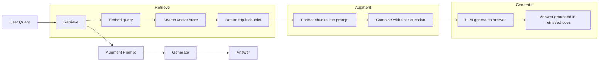
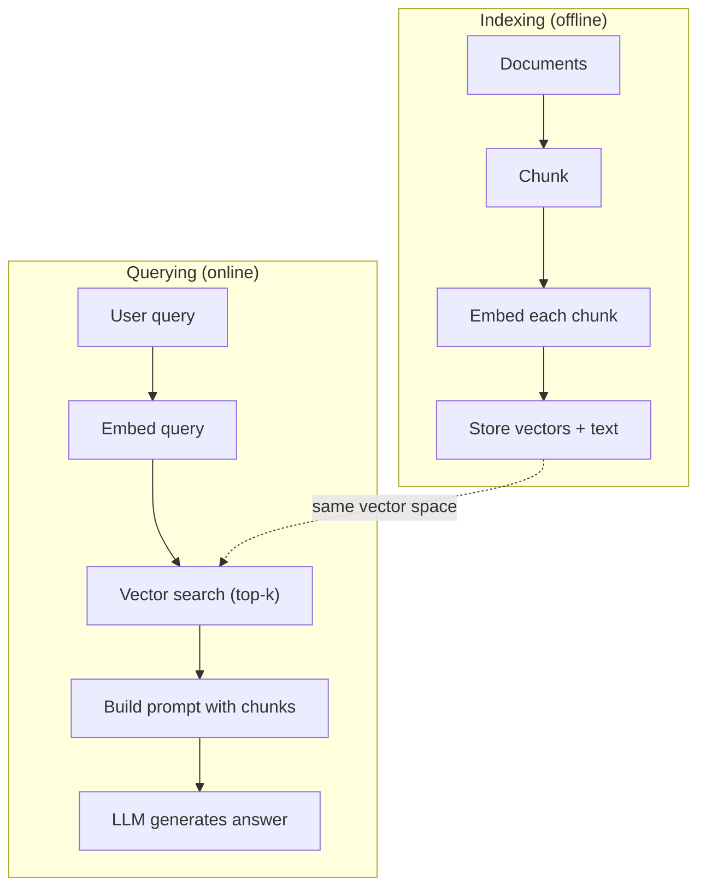

# RAG (Geri Alma-Artırılmış Nesil)

> LLM'niz eğitim sınırına kadar her şeyi bilir. Şirketinizin dokümanları, kod tabanınız veya geçen haftanın toplantı notları hakkında hiçbir şey bilmiyor. RAG, ilgili belgeleri alıp bunları prompt içine doldurarak bu sorunu çözer. Üretim yapay zekasında en çok kullanılan modeldir. Bu kurstan bir şey inşa ederseniz, bir RAG boru hattı oluşturun.

**Tür:** Yapım
**Diller:** Python
**Önkoşullar:** Aşama 10 (Sıfırdan LLM), Aşama 11 Dersleri 01-05
**Süre:** ~90 dakika
**İlgili:** Altı parçalama algoritması için Aşama 5 · 23 (RAG için Parçalama Stratejileri) ve her birinin kazandığı zaman. Yerleştiriciyi seçmek için Aşama 5 · 22 (Embedding Modellerin Derinlemesine İncelemesi). Hibrit arama, yeniden sıralama ve sorgu dönüşümü için Aşama 11 · 07 (Gelişmiş RAG).

## Öğrenme Hedefleri

- Eksiksiz bir RAG ardışık düzeni oluşturun: belge yükleme, parçalama, embedding, vektör depolama, alma ve oluşturma
- Uygun indekslemeyle bir vector database (ChromaDB, FAISS veya Pinecone) kullanarak anlamsal arama uygulayın
- Bilgiye dayalı uygulamalar (maliyet, güncellik, ilişkilendirme) için neden RAG'ın fine-tuning yerine tercih edildiğini açıklayın
- Geri alma metriklerini (hassasiyet, geri çağırma) ve oluşturma metriklerini (sadıklık, uygunluk) kullanarak RAG kalitesini değerlendirin

## Sorun

Şirketiniz için bir chatbot oluşturuyorsunuz. Bir müşteri "Kurumsal planlar için geri ödeme politikası nedir?" diye soruyor. LLM, tipik SaaS geri ödeme politikaları hakkında genel bir yanıtla yanıt verir. 200 sayfalık bir dahili wiki'de gömülü olan gerçek politika, kurumsal müşterilerin eşit olarak dağıtılmış geri ödemelerle 60 günlük bir pencereye sahip olduğunu söylüyor. LLM bu belgeyi hiç görmedi. Hangi konuda eğitim almadığını bilemez.

Fine-tuning bir çözümdür. LLM'yi alın, dahili belgeleriniz üzerinde eğitin ve güncellenmiş modeli dağıtın. Bu işe yarıyor ama ciddi sorunları var. Fine-tuning'nin bilgi işlem maliyeti binlerce dolara mal oluyor. Belge değiştiği anda model eskir. Modelin hangi kaynaktan alındığını bilmenin hiçbir yolu yok. Ve eğer şirket gelecek ay başka bir ürün grubu satın alırsa, yeniden ince ayar yaparsınız.

RAG diğer çözümdür. Modele dokunmadan bırakın. Bir soru geldiğinde, belge deponuzda ilgili pasajları arayın, bunları sorudan önceki prompt alanına yapıştırın ve modelin bu pasajları bağlam olarak kullanarak yanıt vermesine izin verin. Belge deposu dakikalar içinde güncellenebilir. Tam olarak hangi belgelerin alındığını görebilirsiniz. Modelin kendisi asla değişmez. RAG'ın üretimdeki baskın model olmasının nedeni budur: daha ucuzdur, daha yenidir, daha denetlenebilirdir ve herhangi bir LLM ile çalışır.

## Konsept

### RAG Deseni

Tüm model dört adıma uyar:



Sorgu -> Al -> Artır prompt -> Oluştur. Her RAG sistemi bu modeli takip eder. Üretim RAG sistemleri arasındaki farklar her adımın ayrıntılarında yatmaktadır: nasıl parçalayacağınız, nasıl yerleştireceğiniz, nasıl arayacağınız ve prompt'yi nasıl oluşturacağınız.

### RAG Neden Fine-Tuning'ı Geçiyor?

| endişe | Fine-tuning | RAG |
|---------|------------|-----|
| Maliyet | $1,000-$Eğitim çalıştırması başına 100.000+ | $0.01-$Sorgu başına 0,10 (embedding + LLM) |
| Tazelik | Yeniden eğitilene kadar bayat | Dokümanların yeniden indekslenmesiyle dakikalar içinde güncellendi |
| Denetlenebilirlik | Yanıt kaynağına kadar izlenemiyor | Tam olarak alınan pasajları gösterebilir |
| Halüsinasyon | Hala özgürce hallucination üretiyor | Alınan belgelerde gerekçeli |
| Veri gizliliği | Ağırlıklara dönüştürülen eğitim verileri | Belgeler vektör mağazanızda kalır |

Fine-tuning modelin ağırlıklarını kalıcı olarak değiştirir. RAG, modelin içeriğini geçici olarak değiştirir. Çoğu uygulama için istediğiniz şey geçici içeriktir.

fine-tuning'nin kazandığı tek durum: modelin tek başına prompting yoluyla elde edilemeyecek belirli bir tarzı, üslubu veya akıl yürütme modelini benimsemesine ihtiyaç duyduğunuzda. Gerçek bilgiye erişim konusunda RAG her zaman kazanır.

### Embedding Modeller

Bir embedding modeli, metni yoğun bir vektöre dönüştürür. Benzer metinler, bu yüksek boyutlu uzayda birbirine yakın vektörler üretir. "Şifremi nasıl sıfırlarım?" ve "Şifremi değiştirmem gerekiyor", birkaç kelime paylaşmalarına rağmen neredeyse aynı vektörleri üretiyor. "Paspasın üzerine oturan kedi" çok farklı bir vektör üretir.

Yaygın embedding modelleri (2026 serisi - tam analiz için Aşama 5 · 22'ye bakın):

| Modeli | Boyutlar | Sağlayıcı | Notlar |
|-------|-----------|----------|-------|
| text-embedding-3-small | 1536 (Matryoshka) | OpenAI | Çoğu kullanım durumu için en iyi fiyat/performans |
| text-embedding-3-large | 3072 (Matryoshka) | OpenAI | Daha yüksek doğruluk, 256/512/1024'e kısaltılabilir |
| İkizler burcu Embedding 2 | 3072 (Matryoshka) | Google | En iyi MTEB alımı; 8K bağlam |
| yolculuk-4 | 1024/2048 (Matryoshka) | Yapay Zeka Yolculuğu | Alan adı çeşitleri (kod, finans, hukuk) |
| Tutarlı yerleştirme-v4 | 1024 (Matryoshka) | Tutarlı | Güçlü çok dilli, 128K içerik |
| BGE-M3 | 1024 (yoğun + seyrek + ColBERT) | BAAI (açık ağırlık) | Bir modelden üç görünüm |
| Qwen3-Embedding | 4096 (Matryoshka) | Alibaba (açık ağırlık) | En iyi açık ağırlık alma puanı |
| hepsi-MiniLM-L6-v2 | 384 | Açık ağırlık (Cümle Transformers) | Prototipleme temel çizgisi |

Bu ders için TF-IDF'yi kullanarak kendi basit embedding'mızı oluşturuyoruz. Üretim sistemlerinin kullandığı şey TF-IDF olduğu için değil, kavramı somutlaştırdığı için: metin girer, bir vektör çıkar, benzer metinler benzer vektörler üretir.

### Vektör Benzerliği

İki vektör verildiğinde benzerliği nasıl ölçersiniz? Üç seçenek:

**Kosinüs benzerliği**: iki vektör arasındaki açının kosinüsü. -1 (zıt) ile 1 (aynı) arasında değişir. Büyüklüğü göz ardı eder, yalnızca yöne önem verir. Bu, RAG için varsayılandır.

```
cosine_sim(a, b) = dot(a, b) / (||a|| * ||b||)
```

**Nokta çarpım**: ham iç çarpım. Daha büyük vektörler daha yüksek puanlar alır. Büyüklük bilgi taşıdığında kullanışlıdır (daha uzun belgeler daha uygun olabilir).

```
dot(a, b) = sum(a_i * b_i)
```

**L2 (Öklid) mesafesi**: vektör uzayındaki düz çizgi mesafesi. Daha küçük mesafe = daha fazla benzer. Büyüklük farklılıklarına duyarlıdır.

```
L2(a, b) = sqrt(sum((a_i - b_i)^2))
```

Kosinüs benzerliği standarttır. Farklı uzunluklardaki belgeleri büyüklüğe göre normalleştirdiği için sorunsuz bir şekilde işler. Birisi "vektör araması" dediğinde neredeyse her zaman kosinüs benzerliğini kasteder.

### Parçalama Stratejileri

Belgeler tek vektör olarak yerleştirilemeyecek kadar uzun. 50 sayfalık bir PDF, düzinelerce konu içerdiğinden berbat bir embedding üretebilir. Bunun yerine belgeleri parçalara böler ve her parçayı ayrı ayrı gömersiniz.

**Sabit boyutlu parçalama**: her N token saniyede bir bölün. Basit ve öngörülebilir. 50-token örtüşmesi olan 512-token öbeği, öbek 1'in tokens 0-511 olduğu, öbek 2'nin tokens 462-973 olduğu anlamına gelir, vb. Örtüşme, bir cümleyi şanssız bir sınırda bölmemenizi sağlar.

**Anlamsal parçalama**: doğal sınırlarda bölünme. Paragraflar, bölümler veya işaretleme başlıkları. Her parça tutarlı bir anlam birimidir. Uygulanması daha karmaşıktır ancak daha iyi erişim sağlar.

**Özyinelemeli parçalama**: Önce en büyük sınırdan (bölüm başlıkları) bölmeye çalışın. Bölüm hala çok büyükse paragraf sınırlarından bölün. Paragraf hala çok büyükse cümle sınırlarından bölün. Bu, LangChain RecursiveCharacterTextSplitter yaklaşımıdır ve pratikte iyi çalışır.

Parça boyutu insanların düşündüğünden daha önemlidir:

- Çok küçük (64-128 tokens): her parçanın içeriği eksik. "Geçen çeyrekte %15 arttı", "onun" ne anlama geldiğini bilmeden hiçbir şey ifade etmez.
- Çok büyük (2048+ tokens): her parça birden fazla konuyu kapsıyor ve alaka düzeyini azaltıyor. Gelir verilerini aradığınızda, %10'u gelirle ve %90'ı çalışan sayısıyla ilgili bir yığın elde edersiniz.
- Tatlı nokta (256-512 tokens): kendi kendine yetecek kadar bağlam, alakalı olacak kadar odaklanmış.

Çoğu üretim RAG sistemi, 50-token örtüşmeli 256-512 token parça kullanır. Anthropic'in RAG yönergeleri bu aralığı önermektedir.

### Vector Databases

embedding'lara sahip olduğunuzda, bunları saklayacak ve arayacak bir yere ihtiyacınız vardır. Seçenekler:

| Veritabanı | Tür | Şunun için en iyisi |
|----------|------|----------|
| FAISS | Kütüphane (devam ediyor) | Prototip oluşturma, küçük ve orta boy datasets |
| Renk | Hafif DB | Yerel kalkınma, küçük deployment'ler |
| Çam kozalağı | Yönetilen hizmet | Operasyon ek yükü olmadan üretim |
| Dokuma | Açık kaynak DB | Kendi kendine barındırılan prodüksiyon |
| pgvektör | Postgres uzantısı | Zaten Postgres kullanıyor |
| Qdrant | Açık kaynak DB | Yüksek performanslı, kendi kendine barındırılan |

Bu ders için basit bir bellek içi vektör deposu oluşturacağız. Vektörleri bir listede saklar ve kaba kuvvet kosinüs benzerliği araması yapar. Bu, düz indeksli FAISS'e eşdeğerdir. Yavaşlamadan önce belki 100.000 vektöre kadar ölçeklenebilir. Üretim sistemleri, milisaniyeler içinde milyonlarca vektörü aramak için HNSW gibi yaklaşık en yakın komşu (ANN) algoritmalarını kullanır.

### Tam Boru Hattı



Dizin oluşturma aşaması belge başına bir kez (veya belgeler güncellendiğinde) çalıştırılır. Sorgulama aşaması her kullanıcı isteği üzerine çalışır. Üretimde indeksleme milyonlarca belgeyi saatlerce işleyebilir. Sorgulama bir saniyeden kısa sürede yanıt vermelidir.

### Gerçek Sayılar

Çoğu üretim RAG sistemi şu parametreleri kullanır:

- **k = 5 ila 10** sorgu başına alınan parçalar
- **Yığın boyutu = 256 ila 512 tokens**, 50-token örtüşme ile
- **Bağlam bütçesi**: Sorgu başına 2.500-5.000 tokens alınan içerik
- **Toplam prompt**: ~8.000-16.000 tokens (sistem prompt + alınan parçalar + konuşma geçmişi + kullanıcı sorgusu)
- **Embedding boyut**: 384-3072 modele bağlı olarak
- **Dizine ekleme verimi**: API embeddings ile saniyede 100-1.000 belge
- **Sorgu gecikmesi**: Alma için 50-200 ms, oluşturma için 500-3000 ms

```figure
rag-chunking
```

## İnşa Et

### Adım 1: Belgeleri Parçalama

```python
def chunk_text(text, chunk_size=200, overlap=50):
    words = text.split()
    chunks = []
    start = 0
    while start < len(words):
        end = start + chunk_size
        chunk = " ".join(words[start:end])
        chunks.append(chunk)
        start += chunk_size - overlap
    return chunks
```

### Adım 2: TF-IDF Embedding'ler

Basit bir embedding fonksiyonu oluşturuyoruz. TF-IDF (Term Frekansı-Ters Belge Frekansı) sinirsel bir embedding değildir, ancak metni, kelimenin önemini yakalayacak şekilde vektörlere dönüştürür. Bir belgede sık kullanılan kelimeler daha yüksek TF'ye neden olur. Tümcedeki nadir kelimelerin IDF'si daha yüksek olur. Çarpım, önemli, ayırt edici kelimelerin yüksek değerlere sahip olduğu bir vektör verir.

```python
import math
from collections import Counter

def build_vocabulary(documents):
    vocab = set()
    for doc in documents:
        vocab.update(doc.lower().split())
    return sorted(vocab)

def compute_tf(text, vocab):
    words = text.lower().split()
    count = Counter(words)
    total = len(words)
    return [count.get(word, 0) / total for word in vocab]

def compute_idf(documents, vocab):
    n = len(documents)
    idf = []
    for word in vocab:
        doc_count = sum(1 for doc in documents if word in doc.lower().split())
        idf.append(math.log((n + 1) / (doc_count + 1)) + 1)
    return idf

def tfidf_embed(text, vocab, idf):
    tf = compute_tf(text, vocab)
    return [t * i for t, i in zip(tf, idf)]
```

### Adım 3: Kosinüs Benzerliği Araması

```python
def cosine_similarity(a, b):
    dot = sum(x * y for x, y in zip(a, b))
    norm_a = math.sqrt(sum(x * x for x in a))
    norm_b = math.sqrt(sum(x * x for x in b))
    if norm_a == 0 or norm_b == 0:
        return 0.0
    return dot / (norm_a * norm_b)

def search(query_embedding, stored_embeddings, top_k=5):
    scores = []
    for i, emb in enumerate(stored_embeddings):
        sim = cosine_similarity(query_embedding, emb)
        scores.append((i, sim))
    scores.sort(key=lambda x: x[1], reverse=True)
    return scores[:top_k]
```

### Adım 4: Prompt İnşaat

RAG'daki "artırılmış" şeyin gerçekleştiği yer burasıdır. Alınan parçaları alın, bunları bir prompt olarak biçimlendirin ve LLM'tan sağlanan bağlama göre yanıt vermesini isteyin.

```python
def build_rag_prompt(query, retrieved_chunks):
    context = "\n\n---\n\n".join(
        f"[Source {i+1}]\n{chunk}"
        for i, chunk in enumerate(retrieved_chunks)
    )
    return f"""Answer the question based ONLY on the following context.
If the context doesn't contain enough information, say "I don't have enough information to answer that."

Context:
{context}

Question: {query}

Answer:"""
```

### Adım 5: Komple RAG Boru Hattı

```python
class RAGPipeline:
    def __init__(self):
        self.chunks = []
        self.embeddings = []
        self.vocab = []
        self.idf = []

    def index(self, documents):
        all_chunks = []
        for doc in documents:
            all_chunks.extend(chunk_text(doc))
        self.chunks = all_chunks
        self.vocab = build_vocabulary(all_chunks)
        self.idf = compute_idf(all_chunks, self.vocab)
        self.embeddings = [
            tfidf_embed(chunk, self.vocab, self.idf)
            for chunk in all_chunks
        ]

    def query(self, question, top_k=5):
        query_emb = tfidf_embed(question, self.vocab, self.idf)
        results = search(query_emb, self.embeddings, top_k)
        retrieved = [(self.chunks[i], score) for i, score in results]
        prompt = build_rag_prompt(
            question, [chunk for chunk, _ in retrieved]
        )
        return prompt, retrieved
```

### Adım 6: Oluşturma (simüle edilmiş)

Üretimde LLM API'yi buraya çağırırsınız. Bu ders için, alınan bağlamdan en alakalı cümleyi çıkararak oluşturmayı simüle ediyoruz.

```python
def simple_generate(prompt, retrieved_chunks):
    query_words = set(prompt.lower().split("question:")[-1].split())
    best_sentence = ""
    best_score = 0
    for chunk in retrieved_chunks:
        for sentence in chunk.split("."):
            sentence = sentence.strip()
            if not sentence:
                continue
            words = set(sentence.lower().split())
            overlap = len(query_words & words)
            if overlap > best_score:
                best_score = overlap
                best_sentence = sentence
    return best_sentence if best_sentence else "I don't have enough information."
```

## Kullan onu

Gerçek bir embedding modeli ve LLM ile kod neredeyse hiç değişmez:

```python
from openai import OpenAI

client = OpenAI()

def embed(text):
    response = client.embeddings.create(
        model="text-embedding-3-small",
        input=text
    )
    return response.data[0].embedding

def generate(prompt):
    response = client.chat.completions.create(
        model="gpt-4o-mini",
        messages=[{"role": "user", "content": prompt}],
        temperature=0
    )
    return response.choices[0].message.content
```

Veya Anthropic ile:

```python
import anthropic

client = anthropic.Anthropic()

def generate(prompt):
    response = client.messages.create(
        model="claude-sonnet-5",
        max_tokens=1024,
        messages=[{"role": "user", "content": prompt}]
    )
    return response.content[0].text
```

Boru hattı aynı. embedding fonksiyonunu değiştirin. Oluşturma işlevini değiştirin. Alma mantığı, parçalama, prompt yapısı -- hangi modeli kullanırsanız kullanın hepsi aynıdır.

Geniş ölçekte vektör depolaması için kaba kuvvet aramasını uygun bir vector database ile değiştirin:

```python
import chromadb

client = chromadb.Client()
collection = client.create_collection("my_docs")

collection.add(
    documents=chunks,
    ids=[f"chunk_{i}" for i in range(len(chunks))]
)

results = collection.query(
    query_texts=["What is the refund policy?"],
    n_results=5
)
```

Chroma, embedding'yı dahili olarak işler (varsayılan olarak all-MiniLM-L6-v2'yi kullanır) ve vektörleri yerel bir veritabanında saklar. Aynı model, farklı tesisat.

## Gönderin

Bu ders şunları üretir:
- `outputs/prompt-rag-architect.md` -- belirli kullanım örneklerine yönelik RAG sistemleri tasarlamak için bir prompt
- `outputs/skill-rag-pipeline.md` -- agent'lara RAG ardışık düzenlerini nasıl oluşturup hatalarını ayıklayacaklarını öğreten bir beceri

## Egzersizler

1. TF-IDF embedding'leri basit bir kelime çantası yaklaşımıyla değiştirin (ikili: kelime varsa 1, yoksa 0). Örnek belgelerdeki alma kalitesini karşılaştırın. TF-IDF, nadir sözcüklere daha fazla ağırlık verdiği için daha iyi performans göstermeli.

2. Parça boyutlarıyla denemeler yapın: aynı belge kümesinde 50, 100, 200 ve 500 kelimeyi deneyin. Her boyut için aynı 5 sorguyu çalıştırın ve kaç tanesinin ilk 3'te ilgili bir parçayı döndürdüğünü sayın. Geri alma kalitesinin zirve yaptığı en uygun noktayı bulun.

3. Her bir parçaya meta veriler ekleyin (kaynak belge adı, parça konumu). LLM'nin kaynaklarını belirtmesi için prompt şablonunu kaynak ilişkilendirmesini içerecek şekilde değiştirin.

4. Basit bir değerlendirme uygulayın: 10 soru-cevap çifti verildiğinde, her soruyu RAG kanalından geçirin ve alınan parçaların yüzde kaçının cevabı içerdiğini ölçün. Bu, k'deki geri çağırma işlemidir.

5. Konuşmaya duyarlı bir RAG hattı oluşturun: son 3 değişimin geçmişini tutun ve bunları alınan parçaların yanında prompt'ya ekleyin. "Peki ya kurumsal?" gibi takip sorularıyla test edin. Fiyat sorduktan sonra.

## Anahtar Terimler

| Dönem | İnsanlar ne diyor | Aslında ne anlama geliyor |
|------|----------------|----------------------|
| RAG | "Belgelerinizi okuyan yapay zeka" | İlgili belgeleri alın, bunları prompt dosyasına yapıştırın ve bu belgelere dayalı bir yanıt oluşturun |
| Embedding | "Metni sayılara dönüştür" | Benzer anlamların benzer vektörler ürettiği metnin yoğun bir vektör temsili |
| Vector database | "Yapay zeka için arama motoru" | Vektörleri depolamak ve benzerliğe göre en yakın komşuları bulmak için optimize edilmiş bir veri deposu |
| Parçalama | "Belgeleri parçalara ayırın" | Her birinin bağımsız olarak gömülebilmesi ve alınabilmesi için belgeleri daha küçük bölümlere (genellikle 256-512 tokens) bölmek |
| Kosinüs benzerliği | "İki vektör ne kadar benzer" | İki vektör arasındaki açının kosinüsü; 1 = aynı yön, 0 = dik, -1 = zıt |
| En iyi k alımı | "En iyi eşleşmeleri alın" | En benzer k parçayı vektör deposundan sorguya döndürün |
| Context window | "LLM'nin ne kadar metni görebileceği" | LLM'nin tek bir istekte işleyebileceği maksimum token sayısı; alınan parçalar buna sığmalıdır |
| Artırılmış nesil | "Verilen bağlamı kullanarak yanıtla" | Yalnızca eğitimli bilgiye dayanmak yerine, alınan belgeleri bağlam olarak kullanarak yanıt oluşturmak |
| TF-IDF | "Kelime önemi puanlaması" | Dönem Sıklığı çarpı Ters Belge Sıklığı; kelimeleri bir bütünlük içinde ne kadar ayırt edici olduklarına göre ağırlıklandırır |
| İndeksleme | "Dokümanlar arama için hazırlanıyor" | Sorgu zamanında aranabilmeleri için embedding belgeleri parçalama ve depolamadan oluşan çevrimdışı süreç |

## Daha Fazla Okuma

- Lewis ve diğerleri, "Bilgi Yoğun NLP Görevleri için Alma-Artırılmış Üretim" (2020) -- Facebook Yapay Zeka Araştırması'nın, al ve sonra oluştur modelini resmileştiren orijinal RAG makalesi
- Anthropic'in RAG belgeleri (docs.anthropic.com) -- parça boyutları, prompt yapısı ve değerlendirme için pratik yönergeler
- Çam Kozalağı Öğrenme Merkezi, "RAG Nedir?" -- üretim hususlarıyla birlikte RAG boru hattının net görsel açıklamaları
- Sentence-BERT: Reimers & Gurevych (2019) -- tamamı MiniLM embedding modellerinin arkasındaki makale, anlamsal benzerlik için çift kodlayıcıların nasıl eğitileceğini gösteriyor
- [Karpukhin ve diğerleri, "Açık Alan Soru Yanıtlaması için Yoğun Geçiş Erişimi" (EMNLP 2020)](https://arxiv.org/abs/2004.04906) -- Yoğun iki kodlayıcılı erişimin açık alan QA'da BM25'i geride bıraktığını kanıtlayan DPR makalesi ve modern RAG alıcıları için modeli belirledi.
- [LlamaIndex Yüksek Düzey Kavramları](https://docs.llamaindex.ai/en/stable/getting_started/concepts.html) -- RAG ardışık düzenleri oluştururken bilinmesi gereken ana kavramlar: veri yükleyiciler, düğüm ayrıştırıcılar, dizinler, alıcılar, yanıt sentezleyiciler.
- [LangChain RAG öğreticisi](https://python.langchain.com/docs/tutorials/rag/) -- zıt tadın orkestratörü; aynı al ve sonra oluştur modelinin çalıştırılabilirler zinciri görünümü.
