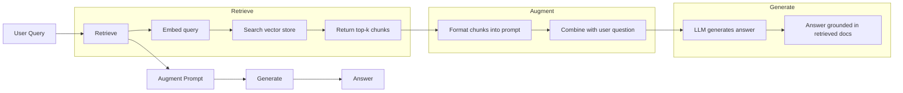
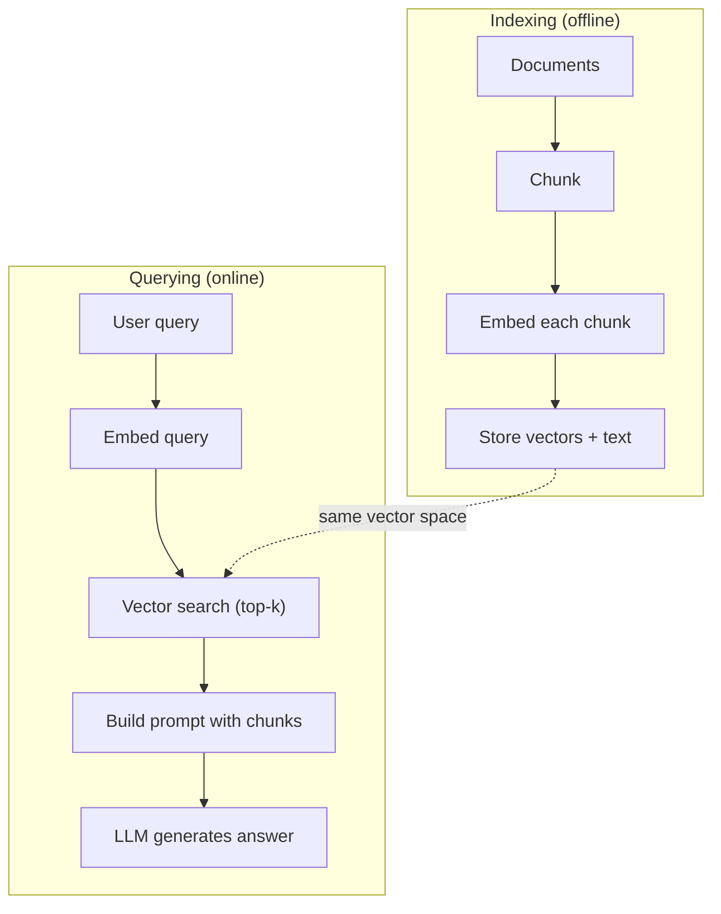

# RAG（检索增强生成）

> 你的LLM知道训练截止前的一切。它对你公司的文档、你的代码库或上周的会议记录一无所知。RAG通过检索相关文档并将它们塞入提示来解决这个问题。它是生产AI中部署最多的模式。如果你从这门课中构建一样东西，就构建一个RAG pipeline。

**类型：** Build
**语言：** Python
**前置知识：** 第10阶段（从头构建LLM），第11阶段第01-05课
**时间：** ~90分钟
**相关：** 第5阶段 · 23（RAG分块策略）了解六种分块算法及各自何时胜出。第5阶段 · 22（嵌入模型深度解析）用于选择嵌入器。第11阶段 · 07（高级RAG）了解混合搜索、重排序和查询转换。

## 学习目标

- 构建完整的RAG pipeline：文档加载、分块、嵌入、向量存储、检索和生成
- 使用向量数据库（ChromaDB、FAISS或Pinecone）实现语义搜索并建立适当索引
- 解释为什么RAG在知识驱动型应用中被优先于微调（成本、新鲜度、可归因性）
- 使用检索指标（precision、recall）和生成指标（faithfulness、relevance）评估RAG质量

## 问题背景

你为公司构建了一个聊天机器人。客户问"What's the refund policy for enterprise plans?" LLM用关于典型SaaS退款政策的通用答案回应。实际政策埋在200页的内部wiki中，说企业客户有60天窗口和按比例退款。LLM从未见过这份文档。它无法知道它没有被训练过的内容。

微调是一种解决方案。拿LLM，用你的内部文档训练它，部署更新后的模型。这有效但有严重问题。微调每次训练运行花费数千美元计算资源。模型在文档变更的那一刻就过时了。你无法知道模型从哪个来源获取信息。如果公司下个月收购另一条产品线，你得再次微调。

RAG是另一种解决方案。保持模型不变。当问题进来时，搜索你的文档存储中的相关段落，将它们粘贴到问题前的提示中，让模型使用这些段落作为上下文回答。文档存储可以在几分钟内更新。你可以确切看到检索了哪些文档。模型本身从不改变。这就是RAG是生产中主导模式的原因：它更便宜、更新鲜、更可审计，并且适用于任何LLM。

## 核心概念

### RAG模式

整个模式包含四个步骤：



Query -> Retrieve -> Augment prompt -> Generate。每个RAG系统都遵循这个模式。生产RAG系统之间的差异在于每个步骤的细节：如何分块、如何嵌入、如何搜索、以及如何构建提示。

### 为什么RAG胜过微调

| 关注点 | 微调 | RAG |
|---------|------------|-----|
| 成本 | 每次训练运行$1,000-$100,000+ | 每次查询$0.01-$0.10（嵌入 + LLM） |
| 新鲜度 | 直到重新训练前都过时 | 通过重新索引文档在几分钟内更新 |
| 可审计性 | 无法追溯答案来源 | 可以显示确切检索的段落 |
| 幻觉 | 仍然自由幻觉 | 基于检索的文档 |
| 数据隐私 | 训练数据烘焙进权重 | 文档保留在你的向量存储中 |

微调永久改变模型的权重。RAG临时改变模型的上下文。对于大多数应用，临时上下文是你想要的。

微调胜出的唯一情况：当你需要模型采用无法仅通过提示实现的特定风格、语气或推理模式时。对于事实知识检索，RAG每次都赢。

### 嵌入模型

嵌入模型将文本转换为稠密向量。相似文本在这个高维空间中产生彼此靠近的向量。"How do I reset my password?"和"I need to change my password"产生几乎相同的向量，尽管共享很少单词。"The cat sat on the mat"产生非常不同的向量。

常见嵌入模型（2026阵容——完整分析见第5阶段 · 22）：

| 模型 | 维度 | 提供商 | 备注 |
|-------|-----------|----------|-------|
| text-embedding-3-small | 1536 (Matryoshka) | OpenAI | 大多数用例的最佳性价比 |
| text-embedding-3-large | 3072 (Matryoshka) | OpenAI | 更高精度，可截断到256/512/1024 |
| Gemini Embedding 2 | 3072 (Matryoshka) | Google | MTEB检索顶级；8K上下文 |
| voyage-4 | 1024/2048 (Matryoshka) | Voyage AI | 领域变体（代码、金融、法律） |
| Cohere embed-v4 | 1024 (Matryoshka) | Cohere | 强多语言，128K上下文 |
| BGE-M3 | 1024 (dense + sparse + ColBERT) | BAAI (open-weight) | 一个模型三种视图 |
| Qwen3-Embedding | 4096 (Matryoshka) | Alibaba (open-weight) | 开源检索分数顶级 |
| all-MiniLM-L6-v2 | 384 | Open-weight (Sentence Transformers) | 原型基线 |

本课中，我们构建自己的简单嵌入，使用TF-IDF。不是因为TF-IDF是生产系统使用的，而是因为它让概念具体化：文本进，向量出，相似文本产生相似向量。

### 向量相似度

给定两个向量，如何测量相似度？三种选项：

**Cosine similarity**：两个向量之间夹角的余弦。范围从-1（相反）到1（相同）。忽略幅度，只关心方向。这是RAG的默认选择。

```
cosine_sim(a, b) = dot(a, b) / (||a|| * ||b||)
```

**Dot product**：原始内积。更大的向量获得更高分数。当幅度携带信息时有用（更长的文档可能更相关）。

```
dot(a, b) = sum(a_i * b_i)
```

**L2 (Euclidean) distance**：向量空间中的直线距离。距离越小=越相似。对幅度差异敏感。

```
L2(a, b) = sqrt(sum((a_i - b_i)^2))
```

Cosine similarity是标准。它优雅地处理不同长度的文档，因为它按幅度归一化。当有人说"vector search"时，他们几乎总是指cosine similarity。

### 分块策略

文档太长，无法作为单个向量嵌入。一份50页的PDF可能产生糟糕的嵌入，因为它包含数十个主题。相反，你将文档分成块，每个块单独嵌入。

**Fixed-size chunking**：每N个token切分。简单且可预测。512 token块，50 token重叠意味着块1是token 0-511，块2是token 462-973，依此类推。重叠确保你不会在不幸的边界处分割句子。

**Semantic chunking**：在自然边界处切分。段落、章节或markdown标题。每个块是一个连贯的意义单元。实现更复杂但产生更好的检索。

**Recursive chunking**：首先尝试在最大边界处切分（章节标题）。如果章节仍然太大，在段落边界处切分。如果段落仍然太大，在句子边界处切分。这是LangChain RecursiveCharacterTextSplitter方法，在实践中效果很好。

分块大小比人们想象的更重要：

- 太小（64-128 token）：每个块缺乏上下文。"It increased 15% last quarter"没有知道"it"指什么就没有意义。
- 太大（2048+ token）：每个块涵盖多个主题，稀释相关性。当你搜索收入数据时，你得到一个10%关于收入、90%关于员工人数的块。
- 最佳点（256-512 token）：足够上下文来自包含，足够聚焦来相关。

大多数生产RAG系统使用256-512 token块，50 token重叠。Anthropic的RAG指南推荐这个范围。

### 向量数据库

有了嵌入后，你需要某个地方存储和搜索它们。选项：

| 数据库 | 类型 | 最佳适用 |
|----------|------|----------|
| FAISS | 库（进程内） | 原型设计，中小数据集 |
| Chroma | 轻量级DB | 本地开发，小型部署 |
| Pinecone | 托管服务 | 无需运维开销的生产 |
| Weaviate | 开源DB | 自托管生产 |
| pgvector | Postgres扩展 | 已使用Postgres |
| Qdrant | 开源DB | 高性能自托管 |

本课中，我们构建简单的内存向量存储。它将向量存储在列表中并进行暴力cosine similarity搜索。这等价于FAISS的flat index。它在变慢前扩展到大约100,000向量。生产系统使用近似最近邻（ANN）算法如HNSW，在毫秒内搜索数百万向量。

### 完整Pipeline



索引阶段每份文档运行一次（或文档更新时）。查询阶段在每个用户请求上运行。生产中，索引可能处理数百万文档，耗时数小时。查询必须在不到一秒内响应。

### 真实数字

大多数生产RAG系统使用这些参数：

- **k = 5 到 10** 每查询检索的块
- **块大小 = 256 到 512 token**，50 token重叠
- **上下文预算**：每查询2,500-5,000 token的检索内容
- **总提示**：~8,000-16,000 token（系统提示 + 检索块 + 对话历史 + 用户查询）
- **嵌入维度**：384-3072，取决于模型
- **索引吞吐量**：使用API嵌入时每秒100-1,000文档
- **查询延迟**：检索50-200ms，生成500-3000ms

## 动手构建

### 步骤1：文档分块

```python
def chunk_text(text, chunk_size=200, overlap=50):
    words = text.split()
    chunks = []
    start = 0
    while start < len(words):
        end = start + chunk_size
        chunk = " ".join(words[start:end])
        chunks.append(chunk)
        start += chunk_size - overlap
    return chunks
```

### 步骤2：TF-IDF嵌入

我们构建一个简单的嵌入函数。TF-IDF（Term Frequency-Inverse Document Frequency）不是神经嵌入，但它以捕获词重要性的方式将文本转换为向量。文档中的频繁词获得更高TF。语料库中的稀有词获得更高IDF。乘积给出一个向量，其中重要、有特色的词具有高值。

```python
import math
from collections import Counter

def build_vocabulary(documents):
    vocab = set()
    for doc in documents:
        vocab.update(doc.lower().split())
    return sorted(vocab)

def compute_tf(text, vocab):
    words = text.lower().split()
    count = Counter(words)
    total = len(words)
    return [count.get(word, 0) / total for word in vocab]

def compute_idf(documents, vocab):
    n = len(documents)
    idf = []
    for word in vocab:
        doc_count = sum(1 for doc in documents if word in doc.lower().split())
        idf.append(math.log((n + 1) / (doc_count + 1)) + 1)
    return idf

def tfidf_embed(text, vocab, idf):
    tf = compute_tf(text, vocab)
    return [t * i for t, i in zip(tf, idf)]
```

### 步骤3：Cosine Similarity搜索

```python
def cosine_similarity(a, b):
    dot = sum(x * y for x, y in zip(a, b))
    norm_a = math.sqrt(sum(x * x for x in a))
    norm_b = math.sqrt(sum(x * x for x in b))
    if norm_a == 0 or norm_b == 0:
        return 0.0
    return dot / (norm_a * norm_b)

def search(query_embedding, stored_embeddings, top_k=5):
    scores = []
    for i, emb in enumerate(stored_embeddings):
        sim = cosine_similarity(query_embedding, emb)
        scores.append((i, sim))
    scores.sort(key=lambda x: x[1], reverse=True)
    return scores[:top_k]
```

### 步骤4：提示构建

这就是RAG中"augmented"发生的地方。取检索的块，将它们格式化成提示，并要求LLM基于提供的上下文回答。

```python
def build_rag_prompt(query, retrieved_chunks):
    context = "\n\n---\n\n".join(
        f"[Source {i+1}]\n{chunk}"
        for i, chunk in enumerate(retrieved_chunks)
    )
    return f"""Answer the question based ONLY on the following context.
If the context doesn't contain enough information, say "I don't have enough information to answer that."

Context:
{context}

Question: {query}

Answer:"""
```

### 步骤5：完整RAG Pipeline

```python
class RAGPipeline:
    def __init__(self):
        self.chunks = []
        self.embeddings = []
        self.vocab = []
        self.idf = []

    def index(self, documents):
        all_chunks = []
        for doc in documents:
            all_chunks.extend(chunk_text(doc))
        self.chunks = all_chunks
        self.vocab = build_vocabulary(all_chunks)
        self.idf = compute_idf(all_chunks, self.vocab)
        self.embeddings = [
            tfidf_embed(chunk, self.vocab, self.idf)
            for chunk in all_chunks
        ]

    def query(self, question, top_k=5):
        query_emb = tfidf_embed(question, self.vocab, self.idf)
        results = search(query_emb, self.embeddings, top_k)
        retrieved = [(self.chunks[i], score) for i, score in results]
        prompt = build_rag_prompt(
            question, [chunk for chunk, _ in retrieved]
        )
        return prompt, retrieved
```

### 步骤6：生成（模拟）

生产中，这是你调用LLM API的地方。本课中，我们通过从检索的上下文中提取最相关的句子来模拟生成。

```python
def simple_generate(prompt, retrieved_chunks):
    query_words = set(prompt.lower().split("question:")[-1].split())
    best_sentence = ""
    best_score = 0
    for chunk in retrieved_chunks:
        for sentence in chunk.split("."):
            sentence = sentence.strip()
            if not sentence:
                continue
            words = set(sentence.lower().split())
            overlap = len(query_words & words)
            if overlap > best_score:
                best_score = overlap
                best_sentence = sentence
    return best_sentence if best_sentence else "I don't have enough information."
```

## 使用它

使用真实嵌入模型和LLM时，代码几乎不变：

```python
from openai import OpenAI

client = OpenAI()

def embed(text):
    response = client.embeddings.create(
        model="text-embedding-3-small",
        input=text
    )
    return response.data[0].embedding

def generate(prompt):
    response = client.chat.completions.create(
        model="gpt-4o-mini",
        messages=[{"role": "user", "content": prompt}],
        temperature=0
    )
    return response.choices[0].message.content
```

或者使用Anthropic：

```python
import anthropic

client = anthropic.Anthropic()

def generate(prompt):
    response = client.messages.create(
        model="claude-sonnet-4-20250514",
        max_tokens=1024,
        messages=[{"role": "user", "content": prompt}]
    )
    return response.content[0].text
```

Pipeline相同。替换嵌入函数。替换生成函数。检索逻辑、分块、提示构建——无论使用哪个模型都完全相同。

对于大规模向量存储，用适当的向量数据库替换暴力搜索：

```python
import chromadb

client = chromadb.Client()
collection = client.create_collection("my_docs")

collection.add(
    documents=chunks,
    ids=[f"chunk_{i}" for i in range(len(chunks))]
)

results = collection.query(
    query_texts=["What is the refund policy?"],
    n_results=5
)
```

Chroma在内部处理嵌入（默认使用all-MiniLM-L6-v2）并将向量存储在本地数据库中。相同模式，不同底层实现。

## 发布它

本课产出：
- `outputs/prompt-rag-architect.md` —— 为特定用例设计RAG系统的提示
- `outputs/skill-rag-pipeline.md` —— 教agent如何构建和调试RAG pipeline的技能

## 练习

1. 用简单的词袋方法（二进制：词存在为1，不存在为0）替换TF-IDF嵌入。在样本文档上比较检索质量。TF-IDF应该表现更好，因为它给稀有词更高权重。

2. 实验分块大小：在相同文档集上尝试50、100、200和500词。对每个大小，运行相同的5个查询并计算有多少在top-3中返回相关块。找到检索质量达到峰值的最佳点。

3. 为每个块添加元数据（源文档名称、块位置）。修改提示模板以包含源归因，使LLM引用其来源。

4. 实现简单评估：给定10个问答对，将每个问题通过RAG pipeline运行，并测量检索块中有多少包含答案。这是k处的检索召回率。

5. 构建对话感知的RAG pipeline：维护最近3次交换的历史，并将它们与检索的块一起包含在提示中。用后续问题测试，如在询问定价后问"What about enterprise?"

## 关键术语

| 术语 | 人们怎么说 | 实际含义 |
|------|----------------|----------------------|
| RAG | "AI读取你的文档" | 检索相关文档，将它们粘贴进提示，并基于这些文档生成答案 |
| Embedding | "将文本转换为数字" | 文本的稠密向量表示，其中相似含义产生相似向量 |
| 向量数据库 | "AI搜索引擎" | 优化存储向量并通过相似度找到最近邻的数据存储 |
| 分块 | "将文档分成碎片" | 将文档分成更小的段（通常256-512 token），以便每个可以独立嵌入和检索 |
| Cosine similarity | "两个向量有多相似" | 两个向量之间夹角的余弦；1 = 相同方向，0 = 正交，-1 = 相反 |
| Top-k检索 | "获取k个最佳匹配" | 从向量存储返回与查询最相似的k个块 |
| 上下文窗口 | "LLM能看到多少文本" | LLM在单次请求中能处理的最大token数；检索的块必须适合其中 |
| 增强生成 | "使用给定上下文回答" | 使用检索的文档作为上下文生成响应，而非仅依赖训练知识 |
| TF-IDF | "词重要性评分" | Term Frequency乘以Inverse Document Frequency；按词在语料库中的独特性加权 |
| 索引 | "为搜索准备文档" | 分块、嵌入和存储文档的离线过程，以便在查询时可以搜索 |

## 延伸阅读

- Lewis等人，"Retrieval-Augmented Generation for Knowledge-Intensive NLP Tasks" (2020) —— Facebook AI Research的原始RAG论文，形式化了retrieve-then-generate模式
- Anthropic的RAG文档（docs.anthropic.com） —— 分块大小、提示构建和评估的实践指南
- Pinecone学习中心，"What is RAG?" —— RAG pipeline的清晰视觉解释及生产考量
- Sentence-BERT: Reimers & Gurevych (2019) —— all-MiniLM嵌入模型背后的论文，展示如何训练bi-encoder进行语义相似性
- [Karpukhin等人，"Dense Passage Retrieval for Open-Domain Question Answering" (EMNLP 2020)](https://arxiv.org/abs/2004.04906) —— DPR论文，证明稠密bi-encoder检索在开放域QA上击败BM25，设定了现代RAG检索器的模式。
