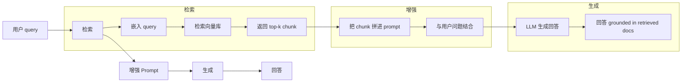
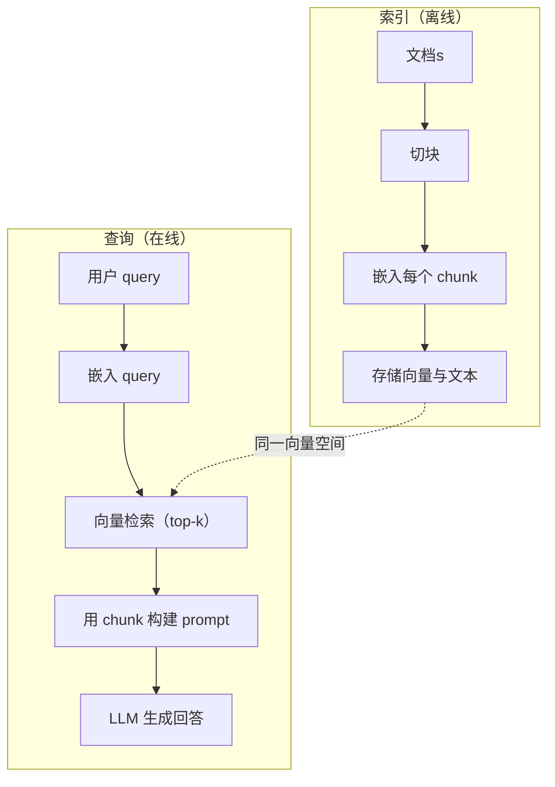

# RAG（检索增强生成，Retrieval-Augmented Generation）

> 译注：本文译自同目录 [`en.md`](./en.md)。术语遵循仓根 [TRANSLATION_GUIDE.md](../../../../TRANSLATION_GUIDE.md)。

> 你的 LLM 知道训练截止日之前的一切。但它不知道你公司的文档、你的代码库、上周的会议纪要。RAG 通过检索相关文档并把它们塞进 prompt 来解决这个问题。它是生产环境里部署最广的模式。如果这门课你只动手做一件事，那就做一个 RAG pipeline。

**Type:** Build
**Languages:** Python
**Prerequisites:** Phase 10（LLMs from Scratch）, Phase 11 Lessons 01-05
**Time:** ~90 分钟
**Related:** Phase 5 · 23（Chunking Strategies for RAG）讲六种 chunking 算法以及各自适用的场景。Phase 5 · 22（Embedding Models Deep Dive）讲怎么挑 embedder。Phase 11 · 07（Advanced RAG）讲 hybrid search、reranking 和 query 改写。

## 学习目标（Learning Objectives）

- 搭一条完整的 RAG pipeline：文档加载、chunking、embedding、向量存储、检索、生成
- 用向量数据库（ChromaDB、FAISS 或 Pinecone）实现语义搜索，并做好索引
- 解释为什么知识落地的应用更适合用 RAG 而不是微调（成本、新鲜度、可追溯）
- 用检索指标（precision、recall）和生成指标（faithfulness、relevance）评估 RAG 质量

## 问题（The Problem）

你给公司做了个 chatbot。客户问：「企业版的退款政策是怎样的？」LLM 回了一段关于一般 SaaS 退款政策的通用答复。真实政策埋在一份 200 页的内部 wiki 里，写着企业客户有 60 天窗口期、按比例退款。LLM 从没见过这份文档。它无法知道它没被训练过的东西。

微调是其中一种解法。把 LLM 拿过来，用你的内部文档训练它，再部署更新后的模型。这能行得通，但问题不少。一次微调动辄上千美元的算力。文档一变，模型立刻过时。你也无从知道模型的回答到底是从哪份文档来的。如果公司下个月又收购了一条产品线，那就再微调一次。

RAG 是另一种解法。模型完全不动。问题进来时，去文档库里检索相关段落，贴到 prompt 里问题前面，让模型基于这些段落作答。文档库几分钟就能更新。你能精确看到检索出了哪些文档。模型本身从不变。这就是 RAG 在生产环境占主导的原因：更便宜、更新鲜、更可审计，而且适配任意 LLM。

## 概念（The Concept）

### RAG 模式（The RAG Pattern）

整套模式四步走：



Query → Retrieve → Augment prompt → Generate。所有 RAG 系统都遵循这个模式。生产 RAG 系统之间的差异在每一步的细节：怎么切（chunk）、怎么 embed、怎么搜、怎么拼 prompt。

### 为什么 RAG 胜过微调（Why RAG Beats Fine-Tuning）

| 关注点 | 微调 | RAG |
|---------|------------|-----|
| 成本 | 每次训练 1,000-100,000+ 美元 | 每次查询 0.01-0.10 美元（embedding + LLM） |
| 新鲜度 | 不重训就是过时的 | 重新索引文档，几分钟就更新 |
| 可审计 | 无法把回答追溯到源 | 能展示具体检索到了哪些段落 |
| Hallucination（幻觉） | 还是会自由发挥 | 答案锚定在检索到的文档上 |
| 数据隐私 | 训练数据烧进权重里 | 文档留在你的向量库里 |

微调永久改变模型的权重。RAG 临时改变模型的上下文。对大多数应用，你想要的就是临时上下文。

唯一一种微调更胜一筹的情况：当你需要模型采用某种特定的风格、语气或推理模式，而仅靠 prompt 做不到时。论事实知识检索，RAG 永远赢。

### Embedding 模型（Embedding Models）

embedding 模型把文本转成稠密向量。意思相近的文本会在这个高维空间里产出靠得很近的向量。「How do I reset my password?」和「I need to change my password」尽管用词几乎不同，向量却几乎一样。「The cat sat on the mat」则会得到差异极大的向量。

常见的 embedding 模型（2026 年的阵容——完整分析见 Phase 5 · 22）：

| 模型 | 维度 | 提供方 | 备注 |
|-------|-----------|----------|-------|
| text-embedding-3-small | 1536 (Matryoshka) | OpenAI | 大多数场景下最佳性价比 |
| text-embedding-3-large | 3072 (Matryoshka) | OpenAI | 精度更高，可截断到 256/512/1024 |
| Gemini Embedding 2 | 3072 (Matryoshka) | Google | MTEB 检索榜首；8K context |
| voyage-4 | 1024/2048 (Matryoshka) | Voyage AI | 有领域变体（代码、金融、法律） |
| Cohere embed-v4 | 1024 (Matryoshka) | Cohere | 多语言强，128K context |
| BGE-M3 | 1024（dense + sparse + ColBERT） | BAAI（开源权重） | 一个模型给三种视图 |
| Qwen3-Embedding | 4096 (Matryoshka) | 阿里（开源权重） | 开源权重里检索分最高 |
| all-MiniLM-L6-v2 | 384 | 开源权重（Sentence Transformers） | 原型实验基线 |

本课里我们用 TF-IDF 自己搓一个简易 embedding。不是因为生产系统会用 TF-IDF，而是它能把概念讲得很具体：文本进去，一个向量出来，相似文本得到相似向量。

### 向量相似度（Vector Similarity）

给定两个向量，怎么衡量相似度？三个选择：

**Cosine similarity（余弦相似度）**：两个向量夹角的余弦。范围从 -1（相反）到 1（一致）。忽略幅度，只看方向。这是 RAG 的默认选择。

```
cosine_sim(a, b) = dot(a, b) / (||a|| * ||b||)
```

**Dot product（点积）**：直接的内积。向量越大，得分越高。当幅度本身携带信息时有用（更长的文档可能更相关）。

```
dot(a, b) = sum(a_i * b_i)
```

**L2（欧氏）距离**：向量空间里的直线距离。距离越小越相似。对幅度差异敏感。

```
L2(a, b) = sqrt(sum((a_i - b_i)^2))
```

cosine similarity 是标准做法。它通过归一化幅度，对长短不一的文档处理得很优雅。当有人说「向量搜索」时，他们几乎都是在说 cosine similarity。

### Chunking 策略（Chunking Strategies）

文档太长，没法当成一个向量来 embed。一个 50 页的 PDF 可能产出一个糟糕的 embedding，因为它涵盖几十个主题。所以你要把文档切成 chunk，每个 chunk 单独 embed。

**Fixed-size chunking（定长切片）**：每 N 个 token 切一刀。简单可预测。chunk 大小 512 token、overlap 50 token，意味着 chunk 1 是 token 0-511，chunk 2 是 token 462-973，依此类推。overlap 保证你不会在某个倒霉位置把句子切两半。

**Semantic chunking（语义切片）**：在自然边界处切。段落、章节、markdown 标题。每个 chunk 是一个完整的意义单元。实现更复杂，但检索效果更好。

**Recursive chunking（递归切片）**：先尝试在最大边界（章节标题）处切。如果某段还太大，再按段落边界切。如果某段落仍太大，按句子边界切。这就是 LangChain 的 RecursiveCharacterTextSplitter 思路，实战很好用。

chunk 大小比大家以为的更重要：

- 太小（64-128 token）：每个 chunk 缺乏上下文。「它上季度涨了 15%」如果不知道「它」指什么就毫无意义。
- 太大（2048+ token）：每个 chunk 涵盖多个主题，相关性被稀释。当你搜营收数据时，得到一个 10% 讲营收、90% 讲人头数的 chunk。
- 甜区（256-512 token）：上下文够多，能自洽；又足够聚焦，能保持相关。

大多数生产 RAG 系统用 256-512 token 的 chunk + 50 token overlap。Anthropic 的 RAG 指南推荐这个范围。

### 向量数据库（Vector Databases）

有了 embedding，你需要找个地方存它们、搜它们。选项：

| 数据库 | 类型 | 适用场景 |
|----------|------|----------|
| FAISS | 库（进程内） | 原型实验，中小规模数据集 |
| Chroma | 轻量 DB | 本地开发，小规模部署 |
| Pinecone | 托管服务 | 不想要运维负担的生产 |
| Weaviate | 开源 DB | 自建生产 |
| pgvector | Postgres 扩展 | 已经在用 Postgres |
| Qdrant | 开源 DB | 高性能自建 |

本课里我们搭一个简易的内存向量库。它把向量存在 list 里，对所有向量做暴力 cosine similarity 搜索。等价于 FAISS 的 flat 索引。能撑到大概 10 万向量再变慢。生产系统用近似最近邻（ANN，approximate nearest neighbor）算法比如 HNSW，能在毫秒级搜索数百万向量。

### 完整 pipeline（The Full Pipeline）



索引阶段每份文档跑一次（或文档更新时跑）。查询阶段每个用户请求都要跑。生产环境里，索引可能要几个小时处理上百万份文档。查询必须在一秒内响应。

### 真实数据（Real Numbers）

大多数生产 RAG 系统用这些参数：

- **k = 5 到 10** 每次查询检索的 chunk 数
- **chunk 大小 = 256 到 512 token**，overlap 50 token
- **上下文预算**：每次查询 2,500-5,000 token 的检索内容
- **整体 prompt**：约 8,000-16,000 token（system prompt + 检索 chunk + 对话历史 + 用户 query）
- **embedding 维度**：384-3072，看模型
- **索引吞吐**：用 API embedding 时每秒 100-1,000 份文档
- **查询延迟**：检索 50-200ms，生成 500-3000ms

## 动手实现（Build It）

### 第 1 步：文档 chunking

```python
def chunk_text(text, chunk_size=200, overlap=50):
    words = text.split()
    chunks = []
    start = 0
    while start < len(words):
        end = start + chunk_size
        chunk = " ".join(words[start:end])
        chunks.append(chunk)
        start += chunk_size - overlap
    return chunks
```

### 第 2 步：TF-IDF embedding

我们写一个简易的 embedding 函数。TF-IDF（Term Frequency-Inverse Document Frequency，词频-逆文档频率）不是神经网络 embedding，但它能把文本转成向量，并捕捉词的重要性。某文档中频繁出现的词获得高 TF。整个语料里罕见的词获得高 IDF。两者乘积得到一个向量，重要、有区分度的词数值高。

```python
import math
from collections import Counter

def build_vocabulary(documents):
    vocab = set()
    for doc in documents:
        vocab.update(doc.lower().split())
    return sorted(vocab)

def compute_tf(text, vocab):
    words = text.lower().split()
    count = Counter(words)
    total = len(words)
    return [count.get(word, 0) / total for word in vocab]

def compute_idf(documents, vocab):
    n = len(documents)
    idf = []
    for word in vocab:
        doc_count = sum(1 for doc in documents if word in doc.lower().split())
        idf.append(math.log((n + 1) / (doc_count + 1)) + 1)
    return idf

def tfidf_embed(text, vocab, idf):
    tf = compute_tf(text, vocab)
    return [t * i for t, i in zip(tf, idf)]
```

### 第 3 步：cosine similarity 搜索

```python
def cosine_similarity(a, b):
    dot = sum(x * y for x, y in zip(a, b))
    norm_a = math.sqrt(sum(x * x for x in a))
    norm_b = math.sqrt(sum(x * x for x in b))
    if norm_a == 0 or norm_b == 0:
        return 0.0
    return dot / (norm_a * norm_b)

def search(query_embedding, stored_embeddings, top_k=5):
    scores = []
    for i, emb in enumerate(stored_embeddings):
        sim = cosine_similarity(query_embedding, emb)
        scores.append((i, sim))
    scores.sort(key=lambda x: x[1], reverse=True)
    return scores[:top_k]
```

### 第 4 步：拼 prompt

这就是 RAG 中「Augmented（增强）」发生的地方。把检索到的 chunk 拿出来，组装进 prompt，让 LLM 基于给定的上下文作答。

```python
def build_rag_prompt(query, retrieved_chunks):
    context = "\n\n---\n\n".join(
        f"[Source {i+1}]\n{chunk}"
        for i, chunk in enumerate(retrieved_chunks)
    )
    return f"""Answer the question based ONLY on the following context.
If the context doesn't contain enough information, say "I don't have enough information to answer that."

Context:
{context}

Question: {query}

Answer:"""
```

### 第 5 步：完整的 RAG pipeline

```python
class RAGPipeline:
    def __init__(self):
        self.chunks = []
        self.embeddings = []
        self.vocab = []
        self.idf = []

    def index(self, documents):
        all_chunks = []
        for doc in documents:
            all_chunks.extend(chunk_text(doc))
        self.chunks = all_chunks
        self.vocab = build_vocabulary(all_chunks)
        self.idf = compute_idf(all_chunks, self.vocab)
        self.embeddings = [
            tfidf_embed(chunk, self.vocab, self.idf)
            for chunk in all_chunks
        ]

    def query(self, question, top_k=5):
        query_emb = tfidf_embed(question, self.vocab, self.idf)
        results = search(query_emb, self.embeddings, top_k)
        retrieved = [(self.chunks[i], score) for i, score in results]
        prompt = build_rag_prompt(
            question, [chunk for chunk, _ in retrieved]
        )
        return prompt, retrieved
```

### 第 6 步：生成（模拟）

生产里这一步是调 LLM API。本课中我们模拟生成，从检索到的上下文里挑出最相关的句子。

```python
def simple_generate(prompt, retrieved_chunks):
    query_words = set(prompt.lower().split("question:")[-1].split())
    best_sentence = ""
    best_score = 0
    for chunk in retrieved_chunks:
        for sentence in chunk.split("."):
            sentence = sentence.strip()
            if not sentence:
                continue
            words = set(sentence.lower().split())
            overlap = len(query_words & words)
            if overlap > best_score:
                best_score = overlap
                best_sentence = sentence
    return best_sentence if best_sentence else "I don't have enough information."
```

## 用起来（Use It）

换上真实的 embedding 模型和 LLM 后，代码几乎不变：

```python
from openai import OpenAI

client = OpenAI()

def embed(text):
    response = client.embeddings.create(
        model="text-embedding-3-small",
        input=text
    )
    return response.data[0].embedding

def generate(prompt):
    response = client.chat.completions.create(
        model="gpt-4o-mini",
        messages=[{"role": "user", "content": prompt}],
        temperature=0
    )
    return response.choices[0].message.content
```

或者用 Anthropic：

```python
import anthropic

client = anthropic.Anthropic()

def generate(prompt):
    response = client.messages.create(
        model="claude-sonnet-4-20250514",
        max_tokens=1024,
        messages=[{"role": "user", "content": prompt}]
    )
    return response.content[0].text
```

pipeline 没变。换掉 embedding 函数。换掉生成函数。检索逻辑、chunking、prompt 拼装——不管你用什么模型，全都一样。

要把向量存储跑到规模上去，把暴力搜索换成正经的向量数据库：

```python
import chromadb

client = chromadb.Client()
collection = client.create_collection("my_docs")

collection.add(
    documents=chunks,
    ids=[f"chunk_{i}" for i in range(len(chunks))]
)

results = collection.query(
    query_texts=["What is the refund policy?"],
    n_results=5
)
```

Chroma 内部自动处理 embedding（默认用 all-MiniLM-L6-v2），并把向量存进本地数据库。模式相同，水管不同。

## 上线部署（Ship It）

本课产出：
- `outputs/prompt-rag-architect.md`——一个为具体场景设计 RAG 系统的 prompt
- `outputs/skill-rag-pipeline.md`——一个教 agent 如何搭建和调试 RAG pipeline 的 skill

## 练习（Exercises）

1. 把 TF-IDF embedding 换成最朴素的 bag-of-words（二值：词出现就 1，不出现就 0）。在示例文档上对比检索质量。TF-IDF 应该胜出，因为它给罕见词更高的权重。

2. 试不同 chunk 大小：在同一组文档上分别试 50、100、200、500 个词。每种大小下，跑同样的 5 个 query，统计 top-3 中包含相关 chunk 的次数。找出检索质量峰值的甜区。

3. 给每个 chunk 加 metadata（来源文档名、chunk 位置）。改 prompt 模板，让 LLM 在回答时引用来源。

4. 实现一个简易评估：给定 10 组「问题—答案」对，把每个问题跑一遍 RAG pipeline，测量检索到的 chunk 中包含答案的比例。这就是 retrieval recall at k。

5. 搭一个对话感知的 RAG pipeline：维护最近 3 轮对话历史，连同检索到的 chunk 一起放进 prompt。在问完定价之后用「企业版呢？」这种追问测试它。

## 关键术语（Key Terms）

| 术语 | 大家怎么说 | 实际含义 |
|------|----------------|----------------------|
| RAG | 「会读你文档的 AI」 | 检索相关文档，贴进 prompt，生成基于这些文档的回答 |
| Embedding | 「把文字变成数字」 | 文本的稠密向量表示，意思相近的文本得到相近的向量 |
| 向量数据库 | 「AI 的搜索引擎」 | 为存储向量并按相似度找最近邻而优化的数据存储 |
| Chunking | 「把文档切成小块」 | 把文档切成更小的片段（通常 256-512 token），以便各自独立 embed 和检索 |
| Cosine similarity | 「两个向量有多像」 | 两个向量夹角的余弦；1 = 同向，0 = 正交，-1 = 反向 |
| Top-k 检索 | 「拿最匹配的 k 个」 | 从向量库中返回与 query 最相似的 k 个 chunk |
| Context window | 「LLM 一次能看多少字」 | LLM 单次请求能处理的最大 token 数；检索到的 chunk 必须装得下 |
| Augmented generation | 「拿上下文作答」 | 用检索到的文档作为上下文生成回答，而不是只靠模型训练时学到的知识 |
| TF-IDF | 「给词打重要性分」 | Term Frequency 乘 Inverse Document Frequency；按词在语料中的区分度加权 |
| 索引（Indexing） | 「为搜索准备文档」 | 离线过程：chunking、embed、入库，让文档能在 query 时被搜索 |

## 延伸阅读（Further Reading）

- Lewis et al., "Retrieval-Augmented Generation for Knowledge-Intensive NLP Tasks" (2020)——出自 Facebook AI Research 的原始 RAG 论文，正式提出「先检索后生成」的模式
- Anthropic 的 RAG 文档（docs.anthropic.com）——关于 chunk 大小、prompt 拼装、评估的实操指南
- Pinecone Learning Center, "What is RAG?"——配清晰可视化讲 RAG pipeline，并涵盖生产考量
- Sentence-BERT: Reimers & Gurevych (2019)——all-MiniLM 系列 embedding 模型背后的论文，展示如何训练用于语义相似度的 bi-encoder
- [Karpukhin et al., "Dense Passage Retrieval for Open-Domain Question Answering" (EMNLP 2020)](https://arxiv.org/abs/2004.04906)——DPR 论文，证明稠密 bi-encoder 检索在开放域 QA 上击败 BM25，奠定了现代 RAG 检索器的范式
- [LlamaIndex High-Level Concepts](https://docs.llamaindex.ai/en/stable/getting_started/concepts.html)——搭 RAG pipeline 时要懂的核心概念：data loader、node parser、index、retriever、response synthesizer
- [LangChain RAG tutorial](https://python.langchain.com/docs/tutorials/rag/)——风格相反的另一个编排框架；用 chain-of-runnables 视角看同一个「先检索后生成」的模式
