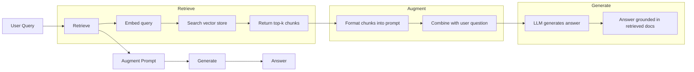
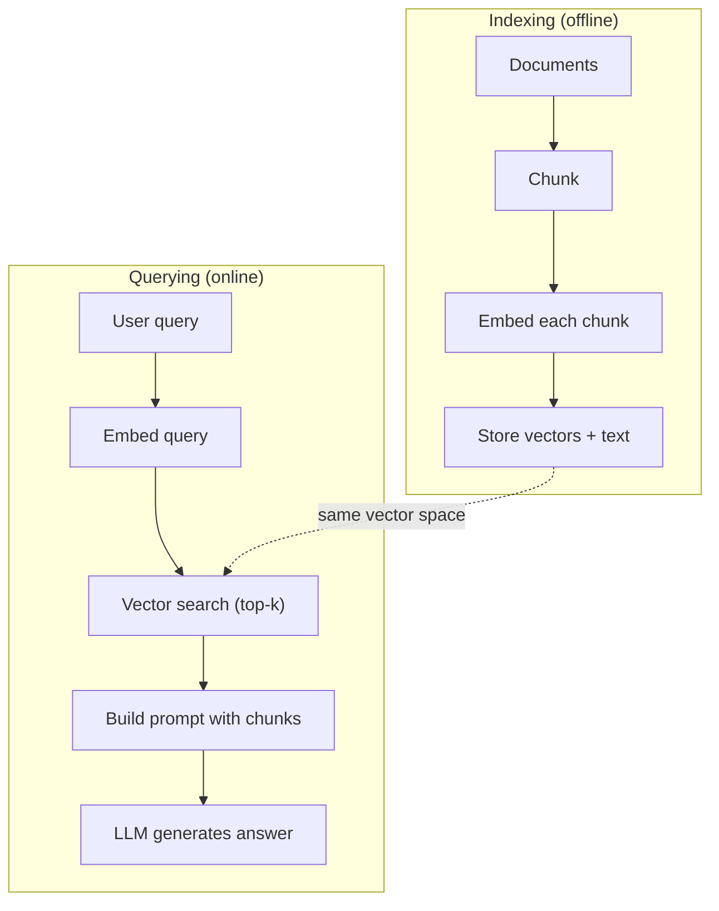

# 06 · RAG（检索增强生成）

> 你的大语言模型（LLM）了解其训练截止日期之前的一切，却对你公司的文档、你的代码库或上周的会议纪要一无所知。RAG 通过检索相关文档并将其塞进提示词来解决这个问题。它是生产环境 AI 中部署最广泛的模式。如果你在本课程中只动手做一样东西，那就做一条 RAG 流水线。

**类型：** 实战构建
**语言：** Python
**前置：** 第 10 阶段（从零构建 LLM）、第 11 阶段第 01-05 课
**时长：** 约 90 分钟
**相关：** 第 5 阶段 · 23（RAG 的分块策略）讲解六种分块算法以及各自的适用场景。第 5 阶段 · 22（嵌入模型深度剖析）讲解如何挑选嵌入器。第 11 阶段 · 07（进阶 RAG）讲解混合检索、重排序与查询变换。

## 学习目标

- 构建一条完整的 RAG 流水线：文档加载、分块、嵌入、向量存储、检索与生成
- 使用向量数据库（ChromaDB、FAISS 或 Pinecone）并配合恰当的索引，实现「语义检索（semantic search）」
- 解释为何在「知识落地（knowledge-grounded）」应用中 RAG 优于「微调（fine-tuning）」（成本、时效性、可溯源性）
- 用检索指标（精确率、召回率）和生成指标（忠实度、相关性）评估 RAG 质量

## 问题所在

你为公司搭建了一个聊天机器人。一位客户问「企业版套餐的退款政策是什么？」LLM 回复了一段关于典型 SaaS 退款政策的泛泛之谈。而真正的政策深埋在一份 200 页的内部维基里，写明企业客户享有 60 天窗口期并按比例退款。LLM 从未见过这份文档。它无法知道自己未曾被训练过的东西。

微调是一种解决方案。把 LLM 拿来，用你的内部文档训练它，然后部署更新后的模型。这行得通，但存在严重问题。微调要花费数千美元的算力。一旦某份文档变更，模型立刻就过时了。你无从得知模型的答案究竟取自哪个来源。而且如果公司下个月又收购了一条产品线，你就得再微调一次。

RAG 是另一种解决方案。模型保持原样不动。当一个问题进来时，在你的文档库中检索相关段落，把它们粘贴到问题之前的提示词里，让模型把这些段落当作上下文来作答。文档库可以在几分钟内更新。你能清楚看到究竟检索到了哪些文档。模型本身始终不变。这正是 RAG 成为生产环境主导模式的原因：它更便宜、更新鲜、更可审计，并且适用于任何 LLM。

## 核心概念

### RAG 模式

整个模式可归纳为四个步骤：



查询 -> 检索 -> 增强提示词 -> 生成。每一个 RAG 系统都遵循这个模式。各家生产级 RAG 系统之间的差异，体现在每一步的细节上：你如何分块、如何嵌入、如何检索，以及如何构造提示词。

### 为何 RAG 胜过微调

| 关注点 | 微调 | RAG |
|---------|------------|-----|
| 成本 | 每次训练 $1,000-$100,000+ | 每次查询 $0.01-$0.10（嵌入 + LLM） |
| 时效性 | 不重新训练就会过时 | 通过重建文档索引在几分钟内更新 |
| 可审计性 | 无法将答案溯源到出处 | 可展示确切的检索段落 |
| 幻觉 | 仍会随意产生幻觉 | 以检索到的文档为依据 |
| 数据隐私 | 训练数据被固化进权重 | 文档留在你自己的向量库中 |

微调永久性地改变模型的权重。RAG 临时性地改变模型的上下文。对大多数应用而言，临时上下文才是你想要的。

唯一一种微调胜出的情形：当你需要模型采用某种仅靠提示词无法实现的特定风格、语气或推理模式时。对于事实性知识检索，RAG 每次都胜出。

### 嵌入模型

「嵌入模型（embedding model）」把文本转换成「稠密向量（dense vector）」。相似的文本会产生在这个高维空间中彼此靠近的向量。「How do I reset my password?」和「I need to change my password」尽管几乎没有共用词汇，却会产生近乎相同的向量。「The cat sat on the mat」则会产生一个截然不同的向量。

常见的嵌入模型（2026 年阵容——完整分析见第 5 阶段 · 22）：

| 模型 | 维度 | 提供方 | 备注 |
|-------|-----------|----------|-------|
| text-embedding-3-small | 1536（Matryoshka） | OpenAI | 大多数场景下性价比最佳 |
| text-embedding-3-large | 3072（Matryoshka） | OpenAI | 精度更高，可截断至 256/512/1024 |
| Gemini Embedding 2 | 3072（Matryoshka） | Google | MTEB 检索榜首；8K 上下文 |
| voyage-4 | 1024/2048（Matryoshka） | Voyage AI | 含领域变体（代码、金融、法律） |
| Cohere embed-v4 | 1024（Matryoshka） | Cohere | 多语言能力强，128K 上下文 |
| BGE-M3 | 1024（稠密 + 稀疏 + ColBERT） | BAAI（开放权重） | 一个模型给出三种视图 |
| Qwen3-Embedding | 4096（Matryoshka） | 阿里巴巴（开放权重） | 开放权重检索得分最高 |
| all-MiniLM-L6-v2 | 384 | 开放权重（Sentence Transformers） | 原型开发基线 |

在本课中，我们用 TF-IDF 自己动手构建一个简单的嵌入。并非因为生产系统会用 TF-IDF，而是因为它能把概念讲透：文本进去，向量出来，相似的文本产生相似的向量。

### 向量相似度

给定两个向量，如何度量相似度？有三种选择：

**余弦相似度（Cosine similarity）**：两个向量夹角的余弦值。取值范围从 -1（相反）到 1（相同）。忽略模长，只关心方向。这是 RAG 的默认选择。

```
cosine_sim(a, b) = dot(a, b) / (||a|| * ||b||)
```

**点积（Dot product）**：原始内积。模长更大的向量得分更高。当模长本身携带信息时很有用（更长的文档可能更相关）。

```
dot(a, b) = sum(a_i * b_i)
```

**L2（欧几里得）距离**：向量空间中的直线距离。距离越小 = 越相似。对模长差异敏感。

```
L2(a, b) = sqrt(sum((a_i - b_i)^2))
```

余弦相似度是标准做法。它能从容处理不同长度的文档，因为它会按模长做归一化。当有人说「向量检索」时，几乎总是指余弦相似度。

### 分块策略

文档太长，无法作为单个向量来嵌入。一份 50 页的 PDF 可能会产生一个糟糕的嵌入，因为它包含数十个主题。正确做法是把文档切分成「块（chunk）」，并分别嵌入每一块。

**固定大小分块（Fixed-size chunking）**：每 N 个 token 切一刀。简单且可预测。一个 512 token 的块配 50 token 重叠，意味着第 1 块是 token 0-511，第 2 块是 token 462-973，以此类推。重叠确保你不会在不巧的位置把一个句子切断。

**语义分块（Semantic chunking）**：在自然边界处切分。段落、章节或 markdown 标题。每一块都是一个连贯的意义单元。实现起来更复杂，但能产生更好的检索效果。

**递归分块（Recursive chunking）**：先尝试在最大的边界处切分（章节标题）。如果某一节仍然太大，就在段落边界处切分。如果某一段仍然太大，就在句子边界处切分。这正是 LangChain RecursiveCharacterTextSplitter 的做法，在实践中效果很好。

块大小的重要性超出多数人的想象：

- 太小（64-128 token）：每一块缺乏上下文。「它上季度增长了 15%」在不知道「它」指代什么的情况下毫无意义。
- 太大（2048+ token）：每一块涵盖多个主题，稀释了相关性。当你检索营收数据时，得到的块可能 10% 关于营收、90% 关于人员编制。
- 甜蜜点（256-512 token）：既有足够上下文做到自包含，又足够聚焦从而保持相关。

大多数生产级 RAG 系统使用 256-512 token 的块，配 50 token 重叠。Anthropic 的 RAG 指南也推荐这个区间。

### 向量数据库

有了嵌入之后，你需要一个地方来存储和检索它们。可选项：

| 数据库 | 类型 | 适用场景 |
|----------|------|----------|
| FAISS | 库（进程内） | 原型开发、中小型数据集 |
| Chroma | 轻量级数据库 | 本地开发、小规模部署 |
| Pinecone | 托管服务 | 无运维负担的生产环境 |
| Weaviate | 开源数据库 | 自托管生产环境 |
| pgvector | Postgres 扩展 | 已经在用 Postgres 的场景 |
| Qdrant | 开源数据库 | 高性能自托管 |

在本课中，我们构建一个简单的内存向量库。它把向量存在一个列表里，做暴力余弦相似度检索。这等价于使用扁平索引（flat index）的 FAISS。它大概能扩展到 10 万条向量，之后就会变慢。生产系统使用 HNSW 这类「近似最近邻（approximate nearest neighbor，ANN）」算法，在毫秒级内检索数百万条向量。

### 完整流水线



索引阶段每份文档只运行一次（或在文档更新时运行）。查询阶段在每次用户请求时运行。在生产环境中，索引可能要花数小时处理数百万份文档。而查询必须在一秒之内响应。

### 真实数字

大多数生产级 RAG 系统使用这些参数：

- **k = 5 到 10** 每次查询检索的块数量
- **块大小 = 256 到 512 token**，配 50 token 重叠
- **上下文预算**：每次查询 2,500-5,000 token 的检索内容
- **整体提示词**：约 8,000-16,000 token（系统提示词 + 检索到的块 + 对话历史 + 用户查询）
- **嵌入维度**：384-3072，取决于模型
- **索引吞吐量**：使用 API 嵌入时每秒 100-1,000 份文档
- **查询延迟**：检索 50-200ms，生成 500-3000ms

## 动手构建

### 第 1 步：文档分块

```python
def chunk_text(text, chunk_size=200, overlap=50):
    words = text.split()
    chunks = []
    start = 0
    while start < len(words):
        end = start + chunk_size
        chunk = " ".join(words[start:end])
        chunks.append(chunk)
        start += chunk_size - overlap
    return chunks
```

### 第 2 步：TF-IDF 嵌入

我们构建一个简单的嵌入函数。TF-IDF（词频-逆文档频率，Term Frequency-Inverse Document Frequency）不是神经网络嵌入，但它以一种能捕捉词语重要性的方式把文本转换成向量。在一篇文档中频繁出现的词获得更高的 TF。在整个语料库中稀有的词获得更高的 IDF。两者相乘得到一个向量，其中重要、有区分度的词具有高值。

```python
import math
from collections import Counter

def build_vocabulary(documents):
    vocab = set()
    for doc in documents:
        vocab.update(doc.lower().split())
    return sorted(vocab)

def compute_tf(text, vocab):
    words = text.lower().split()
    count = Counter(words)
    total = len(words)
    return [count.get(word, 0) / total for word in vocab]

def compute_idf(documents, vocab):
    n = len(documents)
    idf = []
    for word in vocab:
        doc_count = sum(1 for doc in documents if word in doc.lower().split())
        idf.append(math.log((n + 1) / (doc_count + 1)) + 1)
    return idf

def tfidf_embed(text, vocab, idf):
    tf = compute_tf(text, vocab)
    return [t * i for t, i in zip(tf, idf)]
```

### 第 3 步：余弦相似度检索

```python
def cosine_similarity(a, b):
    dot = sum(x * y for x, y in zip(a, b))
    norm_a = math.sqrt(sum(x * x for x in a))
    norm_b = math.sqrt(sum(x * x for x in b))
    if norm_a == 0 or norm_b == 0:
        return 0.0
    return dot / (norm_a * norm_b)

def search(query_embedding, stored_embeddings, top_k=5):
    scores = []
    for i, emb in enumerate(stored_embeddings):
        sim = cosine_similarity(query_embedding, emb)
        scores.append((i, sim))
    scores.sort(key=lambda x: x[1], reverse=True)
    return scores[:top_k]
```

### 第 4 步：提示词构造

这正是 RAG 中「增强（augmented）」发生的地方。把检索到的块拿来，格式化进一个提示词，并要求 LLM 基于所提供的上下文作答。

```python
def build_rag_prompt(query, retrieved_chunks):
    context = "\n\n---\n\n".join(
        f"[Source {i+1}]\n{chunk}"
        for i, chunk in enumerate(retrieved_chunks)
    )
    return f"""Answer the question based ONLY on the following context.
If the context doesn't contain enough information, say "I don't have enough information to answer that."

Context:
{context}

Question: {query}

Answer:"""
```

### 第 5 步：完整的 RAG 流水线

```python
class RAGPipeline:
    def __init__(self):
        self.chunks = []
        self.embeddings = []
        self.vocab = []
        self.idf = []

    def index(self, documents):
        all_chunks = []
        for doc in documents:
            all_chunks.extend(chunk_text(doc))
        self.chunks = all_chunks
        self.vocab = build_vocabulary(all_chunks)
        self.idf = compute_idf(all_chunks, self.vocab)
        self.embeddings = [
            tfidf_embed(chunk, self.vocab, self.idf)
            for chunk in all_chunks
        ]

    def query(self, question, top_k=5):
        query_emb = tfidf_embed(question, self.vocab, self.idf)
        results = search(query_emb, self.embeddings, top_k)
        retrieved = [(self.chunks[i], score) for i, score in results]
        prompt = build_rag_prompt(
            question, [chunk for chunk, _ in retrieved]
        )
        return prompt, retrieved
```

### 第 6 步：生成（模拟）

在生产环境中，这一步你会去调用 LLM API。在本课中，我们通过从检索到的上下文里抽取最相关的句子来模拟生成。

```python
def simple_generate(prompt, retrieved_chunks):
    query_words = set(prompt.lower().split("question:")[-1].split())
    best_sentence = ""
    best_score = 0
    for chunk in retrieved_chunks:
        for sentence in chunk.split("."):
            sentence = sentence.strip()
            if not sentence:
                continue
            words = set(sentence.lower().split())
            overlap = len(query_words & words)
            if overlap > best_score:
                best_score = overlap
                best_sentence = sentence
    return best_sentence if best_sentence else "I don't have enough information."
```

## 实际运用

换上真实的嵌入模型和 LLM，代码几乎不需要改动：

```python
from openai import OpenAI

client = OpenAI()

def embed(text):
    response = client.embeddings.create(
        model="text-embedding-3-small",
        input=text
    )
    return response.data[0].embedding

def generate(prompt):
    response = client.chat.completions.create(
        model="gpt-4o-mini",
        messages=[{"role": "user", "content": prompt}],
        temperature=0
    )
    return response.choices[0].message.content
```

或者换成 Anthropic：

```python
import anthropic

client = anthropic.Anthropic()

def generate(prompt):
    response = client.messages.create(
        model="claude-sonnet-4-20250514",
        max_tokens=1024,
        messages=[{"role": "user", "content": prompt}]
    )
    return response.content[0].text
```

流水线是一样的。换掉嵌入函数。换掉生成函数。检索逻辑、分块、提示词构造——无论你用哪些模型，全都完全相同。

要做规模化的向量存储，请用一个正经的向量数据库替换暴力检索：

```python
import chromadb

client = chromadb.Client()
collection = client.create_collection("my_docs")

collection.add(
    documents=chunks,
    ids=[f"chunk_{i}" for i in range(len(chunks))]
)

results = collection.query(
    query_texts=["What is the refund policy?"],
    n_results=5
)
```

Chroma 在内部处理嵌入（默认使用 all-MiniLM-L6-v2），并把向量存进本地数据库。同样的模式，不同的管道。

## 交付成果

本课产出：
- `outputs/prompt-rag-architect.md` —— 一个用于为特定场景设计 RAG 系统的提示词
- `outputs/skill-rag-pipeline.md` —— 一项教会智能体如何构建和调试 RAG 流水线的技能

## 练习

1. 把 TF-IDF 嵌入替换为一个简单的词袋（bag-of-words）方法（二值：词出现为 1，不出现为 0）。在示例文档上比较检索质量。TF-IDF 应当胜出，因为它给稀有词更高的权重。

2. 实验不同的块大小：在同一组文档上尝试 50、100、200 和 500 个词。对每种大小，运行同样的 5 个查询，并统计有多少个查询在前 3 名中返回了相关的块。找到检索质量达到峰值的甜蜜点。

3. 给每一块添加元数据（来源文档名、块的位置）。修改提示词模板以包含来源标注，让 LLM 引用其出处。

4. 实现一个简单的评估：给定 10 个问答对，让每个问题跑过 RAG 流水线，并度量检索到的块中有多大比例包含答案。这就是 k 处的检索召回率（retrieval recall at k）。

5. 构建一条「对话感知（conversation-aware）」的 RAG 流水线：维护最近 3 轮交流的历史，并把它们连同检索到的块一起放进提示词。用诸如先问价格、再追问「那企业版呢？」之类的后续问题来测试。

## 关键术语

| 术语 | 人们怎么说 | 它的实际含义 |
|------|----------------|----------------------|
| RAG | 「会读你文档的 AI」 | 检索相关文档，把它们粘贴进提示词，并生成一个以这些文档为依据的答案 |
| 嵌入（Embedding） | 「把文本转成数字」 | 文本的稠密向量表示，含义相似的文本会产生相似的向量 |
| 向量数据库（Vector database） | 「给 AI 用的搜索引擎」 | 一种为存储向量、并按相似度查找最近邻而优化的数据存储 |
| 分块（Chunking） | 「把文档切成片」 | 把文档拆成更小的片段（通常 256-512 token），以便各自独立地被嵌入和检索 |
| 余弦相似度（Cosine similarity） | 「两个向量有多像」 | 两个向量夹角的余弦值；1 = 方向相同，0 = 正交，-1 = 相反 |
| Top-k 检索（Top-k retrieval） | 「取最好的 k 个匹配」 | 从向量库中返回与查询最相似的 k 个块 |
| 上下文窗口（Context window） | 「LLM 能看到多少文本」 | LLM 在单次请求中能处理的最大 token 数；检索到的块必须放得进这个范围 |
| 增强生成（Augmented generation） | 「用给定上下文作答」 | 用检索到的文档作为上下文来生成回应，而非仅依赖训练得到的知识 |
| TF-IDF | 「词重要性打分」 | 词频乘以逆文档频率；按词在语料库内的区分度对其加权 |
| 索引（Indexing） | 「为检索准备文档」 | 离线地对文档进行分块、嵌入并存储，使其能在查询时被检索的过程 |

## 延伸阅读

- Lewis 等人，《Retrieval-Augmented Generation for Knowledge-Intensive NLP Tasks》（2020）—— 出自 Facebook AI Research 的原始 RAG 论文，正式确立了「先检索后生成」的模式
- Anthropic 的 RAG 文档（docs.anthropic.com）—— 关于块大小、提示词构造和评估的实用指南
- Pinecone Learning Center，《What is RAG?》—— 对 RAG 流水线的清晰可视化讲解，并涵盖生产环境的考量
- Sentence-BERT：Reimers & Gurevych（2019）—— all-MiniLM 嵌入模型背后的论文，展示了如何训练双编码器（bi-encoder）以实现语义相似度
- [Karpukhin 等人，《Dense Passage Retrieval for Open-Domain Question Answering》（EMNLP 2020）](https://arxiv.org/abs/2004.04906) —— DPR 论文，证明了稠密双编码器检索在开放域问答上胜过 BM25，并为现代 RAG 检索器奠定了模式。
- [LlamaIndex 高层概念](https://docs.llamaindex.ai/en/stable/getting_started/concepts.html) —— 构建 RAG 流水线时需要了解的主要概念：数据加载器、节点解析器、索引、检索器、响应合成器。
- [LangChain RAG 教程](https://python.langchain.com/docs/tutorials/rag/) —— 风格相反的编排器；从可运行链（chain-of-runnables）视角看待同一套「先检索后生成」的模式。
