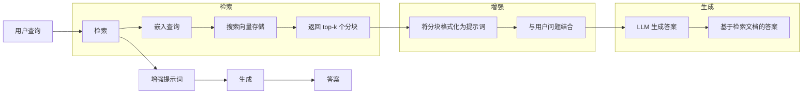
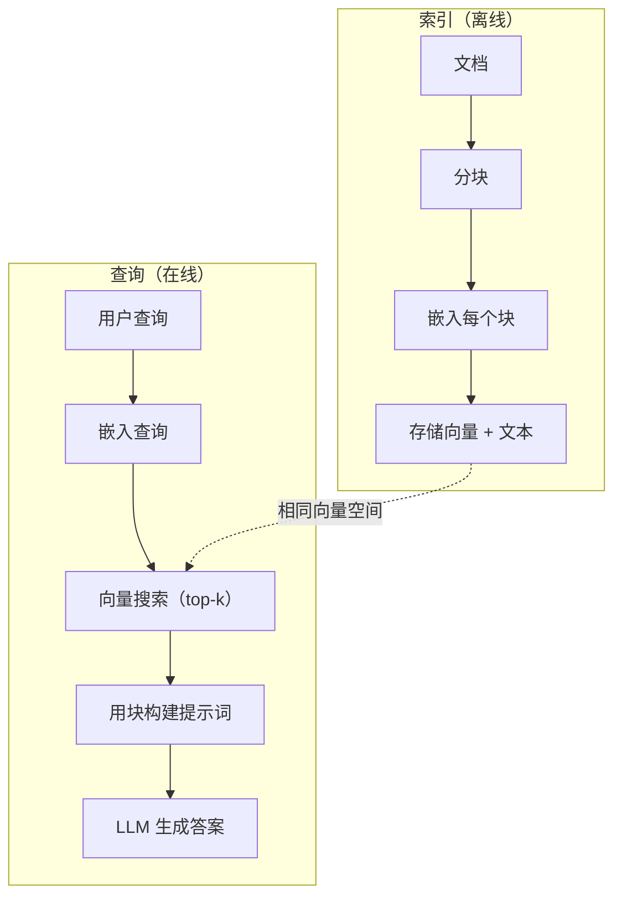

# RAG（检索增强生成，Retrieval-Augmented Generation）

> 你的大语言模型（LLM）知道截至训练截止日期的一切，但对你公司的文档、代码库或上周的会议记录一无所知。RAG 通过检索相关文档并将其塞入提示词中来解决这一问题。这是生产环境 AI 中使用最广泛的模式。如果你只从本课程中构建一个东西，那就搭建一条 RAG 流水线。

**类型：** 构建
**语言：** Python
**前置条件：** 阶段 10（从零构建 LLM），阶段 11 课程 01-05
**时间：** 约 90 分钟
**关联：** 阶段 5 · 23（RAG 的分块策略）介绍六种分块算法及其各自适用场景。阶段 5 · 22（嵌入模型深度剖析）帮助选择嵌入器。阶段 11 · 07（高级 RAG）讲解混合搜索、重排序和查询转换。

## 学习目标

- 构建完整的 RAG 流水线：文档加载、分块、嵌入、向量存储、检索和生成
- 使用向量数据库（ChromaDB、FAISS 或 Pinecone）实现语义搜索，并进行正确的索引
- 解释为何在知识依赖型应用中优先选择 RAG 而非微调（权衡成本、时效性、可归因性）
- 使用检索指标（精确率、召回率）和生成指标（忠实度、相关性）评估 RAG 质量

## 问题所在

你为所在公司构建了一个聊天机器人。客户问“企业计划的退款政策是什么？”LLM 给出了一个关于典型 SaaS 退款政策的通用答案。而实际政策埋藏在一份 200 页的内部百科中，规定企业客户享有 60 天窗口期并按比例退款。LLM 从未见过这份文档。它不可能知道那些未曾训练过的内容。

微调是一种解决方案。获取 LLM，在其内部文档上训练，然后部署更新后的模型。这种方法可行，但存在严重问题。微调的计算成本高达数千美元。一旦文档发生变化，模型就立即变得过时。你无法知道模型引自哪个来源。而且如果公司下个月收购了另一条产品线，你又得重新微调。

RAG 是另一种解决方案。保持模型不变。当问题到来时，在文档库中搜索相关段落，将它们拼接到问题之前的提示词中，然后让模型利用这些段落作为上下文来回答。文档库可以在几分钟内更新。你可以确切看到哪些文档被检索到了。模型本身从未改变。这就是 RAG 成为生产环境中主流模式的原因：它更便宜、更新鲜、更可审计，并且适用于任何 LLM。

## 概念

### RAG 模式

整个模式包含四个步骤：



查询 -> 检索 -> 增强提示词 -> 生成。每个 RAG 系统都遵循此模式。生产级 RAG 系统之间的差异体现在每个步骤的细节上：如何分块、如何嵌入、如何搜索以及如何构建提示词。

### 为什么 RAG 优于微调

| 关注点 | 微调 | RAG |
|--------|------|-----|
| 成本 | 每次训练运行 $1,000-$100,000+ | 每次查询 $0.01-$0.10（嵌入 + LLM） |
| 时效性 | 过时直到重新训练 | 通过重新索引文档，几分钟内更新 |
| 可审计性 | 无法溯源答案到具体来源 | 可以展示检索到的确切段落 |
| 幻觉 | 仍然随意产生幻觉 | 基于检索文档，有据可依 |
| 数据隐私 | 训练数据固化在权重中 | 文档保留在你的向量存储中 |

微调会永久改变模型的权重。RAG 临时改变模型的上下文。对于大多数应用，临时上下文正是你所需要的。

微调胜出的唯一情况：当你需要模型采用某种特定风格、语气或推理模式，而这些无法仅通过提示词实现时。对于事实性知识检索，RAG 每次都能胜出。

### 嵌入模型

嵌入模型将文本转换为稠密向量。相似的文本会在高维空间中产生接近的向量。"How do I reset my password?" 和 "I need to change my password" 尽管共享单词很少，但会产生几乎相同的向量。"The cat sat on the mat" 则会产生截然不同的向量。

常见嵌入模型（2026 年阵容——完整分析见阶段 5 · 22）：

| 模型 | 维度 | 提供商 | 备注 |
|------|------|--------|------|
| text-embedding-3-small | 1536（套娃，Matryoshka） | OpenAI | 大多数用例的最佳性价比 |
| text-embedding-3-large | 3072（套娃） | OpenAI | 更高精度，可截断至 256/512/1024 |
| Gemini Embedding 2 | 3072（套娃） | Google | MTEB 检索最高分；支持 8K 上下文 |
| voyage-4 | 1024/2048（套娃） | Voyage AI | 领域变体（代码、金融、法律） |
| Cohere embed-v4 | 1024（套娃） | Cohere | 强大多语言能力，128K 上下文 |
| BGE-M3 | 1024（稠密 + 稀疏 + ColBERT） | BAAI（开放权重） | 同一个模型提供三种视角 |
| Qwen3-Embedding | 4096（套娃） | Alibaba（开放权重） | 最高开放权重检索得分 |
| all-MiniLM-L6-v2 | 384 | 开放权重（Sentence Transformers） | 原型开发基线 |

在本课程中，我们使用 TF-IDF 构建一个简单的自有嵌入。原因不是 TF-IDF 被生产系统采用，而是它能使概念具体化：文本输入，向量输出，相似文本产生相似向量。

### 向量相似度

给定两个向量，如何衡量相似度？三种选择：

**余弦相似度（Cosine similarity）**：两个向量夹角的余弦。范围从 -1（相反）到 1（相同）。忽略幅度，只关心方向。这是 RAG 的默认选择。

```
cosine_sim(a, b) = dot(a, b) / (||a|| * ||b||)
```

**点积（Dot product）**：原始内积。较大的向量得分更高。当幅度携带信息时有用（较长的文档可能更相关）。

```
dot(a, b) = sum(a_i * b_i)
```

**L2（欧几里得，Euclidean）距离**：向量空间中的直线距离。距离越小 = 越相似。对幅度差异敏感。

```
L2(a, b) = sqrt(sum((a_i - b_i)^2))
```

余弦相似度是标准做法。它通过幅度归一化，从而能优雅地处理不同长度的文档。当人们说“向量搜索”时，他们几乎总是指余弦相似度。

### 分块策略

文档太长，无法作为单个向量嵌入。一份 50 页的 PDF 可能会产生很差的嵌入，因为它包含数十个主题。因此，你需要将文档拆分为多个块，并对每个块分别嵌入。

**固定大小分块**：每 N 个 token 切一块。简单且可预测。512 token 的块，重叠 50 token，意味着块 1 是 token 0-511，块 2 是 token 462-973，依此类推。重叠确保你不会在某个不幸的边界处切分一个句子。

**语义分块**：在自然边界处切分。段落、章节或 Markdown 标题。每个块是一个连贯的语义单元。实现更复杂，但检索质量更好。

**递归分块**：先尝试在最大边界处切分（章节标题）。如果章节仍然太大，则在段落边界处切分。如果段落仍然太大，则在句子边界处切分。这是 LangChain 的 RecursiveCharacterTextSplitter 采用的方法，在实践中效果很好。

块大小的重要性超出人们的想象：

- 太小（64-128 token）：每个块缺少上下文。“它上季度增长了 15%” 如果不知道“它”指什么，就没有意义。
- 太大（2048+ token）：每个块覆盖多个主题，稀释了相关性。当你搜索收入数据时，得到的是一个 10% 关于收入、90% 关于员工人数的块。
- 最佳点（256-512 token）：有足够的上下文做到自包含，又足够聚焦以保持相关。

大多数生产级 RAG 系统使用 256-512 token 的块，重叠 50 token。Anthropic 的 RAG 指南推荐此范围。

### 向量数据库

一旦有了嵌入，就需要一个地方来存储和搜索它们。选项：

| 数据库 | 类型 | 最佳用途 |
|--------|------|----------|
| FAISS | 库（进程内） | 原型开发、中小型数据集 |
| Chroma | 轻量级数据库 | 本地开发、小规模部署 |
| Pinecone | 托管服务 | 生产环境，无需运维 |
| Weaviate | 开源数据库 | 自托管生产环境 |
| pgvector | Postgres 扩展 | 已在使用 Postgres |
| Qdrant | 开源数据库 | 高性能自托管 |

在本课程中，我们构建一个简单的内存向量存储。它将向量存储在列表中，并执行暴力余弦相似度搜索。这相当于使用平坦索引的 FAISS。在速度变慢之前，它大约可扩展至 100,000 个向量。生产系统使用近似最近邻（ANN）算法（如 HNSW）在毫秒内搜索数百万个向量。

### 完整流水线



索引阶段在每次文档更新时运行一次（或文档更新时）。查询阶段在每个用户请求时运行。在生产中，索引可能需要在数小时内处理数百万个文档。查询必须在 1 秒内响应。

### 实际数字

大多数生产级 RAG 系统使用以下参数：

- **k = 5 到 10** 个检索块/查询
- **块大小 = 256 到 512 token**，重叠 50 token
- **上下文预算**：每次查询 2,500-5,000 token 的检索内容
- **总提示词**：约 8,000-16,000 token（系统提示词 + 检索块 + 对话历史 + 用户查询）
- **嵌入维度**：384-3072，取决于模型
- **索引吞吐量**：使用 API 嵌入时，每秒 100-1,000 个文档
- **查询延迟**：检索 50-200ms，生成 500-3000ms

## 动手构建

### 步骤 1：文档分块

```python
def chunk_text(text, chunk_size=200, overlap=50):
    words = text.split()
    chunks = []
    start = 0
    while start < len(words):
        end = start + chunk_size
        chunk = " ".join(words[start:end])
        chunks.append(chunk)
        start += chunk_size - overlap
    return chunks
```

### 步骤 2：TF-IDF 嵌入

我们构建一个简单的嵌入函数。TF-IDF（词频-逆文档频率，Term Frequency-Inverse Document Frequency）不是神经嵌入，但它以捕获单词重要性的方式将文本转换为向量。文档中频繁出现的词获得更高的 TF。整个语料库中罕见的词获得更高的 IDF。二者的乘积得到一个向量，其中重要、独特的词具有较高的值。

```python
import math
from collections import Counter

def build_vocabulary(documents):
    vocab = set()
    for doc in documents:
        vocab.update(doc.lower().split())
    return sorted(vocab)

def compute_tf(text, vocab):
    words = text.lower().split()
    count = Counter(words)
    total = len(words)
    return [count.get(word, 0) / total for word in vocab]

def compute_idf(documents, vocab):
    n = len(documents)
    idf = []
    for word in vocab:
        doc_count = sum(1 for doc in documents if word in doc.lower().split())
        idf.append(math.log((n + 1) / (doc_count + 1)) + 1)
    return idf

def tfidf_embed(text, vocab, idf):
    tf = compute_tf(text, vocab)
    return [t * i for t, i in zip(tf, idf)]
```

### 步骤 3：余弦相似度搜索

```python
def cosine_similarity(a, b):
    dot = sum(x * y for x, y in zip(a, b))
    norm_a = math.sqrt(sum(x * x for x in a))
    norm_b = math.sqrt(sum(x * x for x in b))
    if norm_a == 0 or norm_b == 0:
        return 0.0
    return dot / (norm_a * norm_b)

def search(query_embedding, stored_embeddings, top_k=5):
    scores = []
    for i, emb in enumerate(stored_embeddings):
        sim = cosine_similarity(query_embedding, emb)
        scores.append((i, sim))
    scores.sort(key=lambda x: x[1], reverse=True)
    return scores[:top_k]
```

### 步骤 4：提示词构建

这就是 RAG 中“增强”发生的地方。将检索到的块格式化到提示词中，并要求 LLM 根据提供的上下文进行回答。

```python
def build_rag_prompt(query, retrieved_chunks):
    context = "\n\n---\n\n".join(
        f"[Source {i+1}]\n{chunk}"
        for i, chunk in enumerate(retrieved_chunks)
    )
    return f"""根据以下上下文回答问题，请只基于该上下文回答。
如果上下文没有提供足够的信息，请回答"我没有足够的信息来回答这个问题。"

上下文：
{context}

问题：{query}

答案："""
```

### 步骤 5：完整的 RAG 流水线

```python
class RAGPipeline:
    def __init__(self):
        self.chunks = []
        self.embeddings = []
        self.vocab = []
        self.idf = []

    def index(self, documents):
        all_chunks = []
        for doc in documents:
            all_chunks.extend(chunk_text(doc))
        self.chunks = all_chunks
        self.vocab = build_vocabulary(all_chunks)
        self.idf = compute_idf(all_chunks, self.vocab)
        self.embeddings = [
            tfidf_embed(chunk, self.vocab, self.idf)
            for chunk in all_chunks
        ]

    def query(self, question, top_k=5):
        query_emb = tfidf_embed(question, self.vocab, self.idf)
        results = search(query_emb, self.embeddings, top_k)
        retrieved = [(self.chunks[i], score) for i, score in results]
        prompt = build_rag_prompt(
            question, [chunk for chunk, _ in retrieved]
        )
        return prompt, retrieved
```

### 步骤 6：生成（模拟）

在生产中，这里是调用 LLM API 的地方。在本课程中，我们通过从检索到的上下文中提取最相关的句子来模拟生成。

```python
def simple_generate(prompt, retrieved_chunks):
    query_words = set(prompt.lower().split("question:")[-1].split())
    best_sentence = ""
    best_score = 0
    for chunk in retrieved_chunks:
        for sentence in chunk.split("."):
            sentence = sentence.strip()
            if not sentence:
                continue
            words = set(sentence.lower().split())
            overlap = len(query_words & words)
            if overlap > best_score:
                best_score = overlap
                best_sentence = sentence
    return best_sentence if best_sentence else "我没有足够的信息。"
```

## 使用它

使用真实的嵌入模型和 LLM，代码几乎不变：

```python
from openai import OpenAI

client = OpenAI()

def embed(text):
    response = client.embeddings.create(
        model="text-embedding-3-small",
        input=text
    )
    return response.data[0].embedding

def generate(prompt):
    response = client.chat.completions.create(
        model="gpt-4o-mini",
        messages=[{"role": "user", "content": prompt}],
        temperature=0
    )
    return response.choices[0].message.content
```

或者使用 Anthropic：

```python
import anthropic

client = anthropic.Anthropic()

def generate(prompt):
    response = client.messages.create(
        model="claude-sonnet-4-20250514",
        max_tokens=1024,
        messages=[{"role": "user", "content": prompt}]
    )
    return response.content[0].text
```

流水线是一样的。替换嵌入函数。替换生成函数。检索逻辑、分块、提示词构建