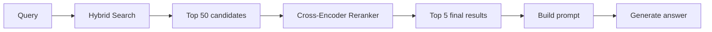
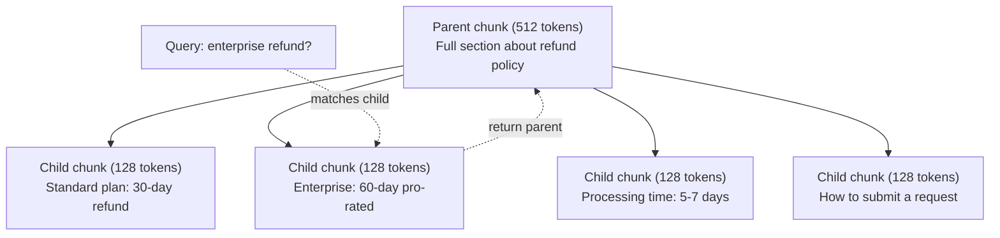

# Advanced RAG (Chunking, Reranking, Hybrid Search)

> Basic RAGはtop-kの最も似たchunksを取得します。単純な質問では動きますが、multi-hop reasoning、ambiguous queries、大規模corporaでは崩れます。Advanced RAGは、10 documentsで動くdemoと10 million documentsで動くsystemの差です。

**種別:** 構築
**言語:** Python
**前提条件:** Phase 11, Lesson 06 (RAG)
**所要時間:** 約90分
**Related:** Phase 5 · 23 (Chunking Strategies for RAG) はrecursive、semantic、sentence、parent-document、late chunking、contextual retrievalの6 algorithmsとbenchmarksを扱います。このlessonはその上にhybrid search、reranking、query transformationを構築します。

## Learning Objectives

- document structureとcontextを保つadvanced chunking strategies（semantic、recursive、parent-child）を実装する
- BM25 keyword matching、semantic vector search、cross-encoder rerankerを組み合わせたhybrid search pipelineを構築する
- HyDE、multi-query、step-backなどのquery transformationで曖昧または複雑な質問のretrievalを改善する
- wrong chunk retrieved、answer not in context、multi-hop reasoning breakdownなどのRAG failureを診断し修正する

## 問題

Lesson 06でbasic RAG pipelineを作りました。小さなcorpusの素直な質問には動きます。では次を試すとどうなるでしょう。

**Ambiguous query**: 「last quarterのrevenueは？」Semantic searchはrevenue strategy、revenue projections、CFOのrevenue growthに関するchunksを返します。どれも「revenue」に意味的に近いですが、実際の数値はありません。正しいchunkは「$47.2M in Q3 2025」と書いており、「revenue」ではなく「earnings」を使っています。

**Multi-hop question**: 「customer satisfaction score improvementが最も高かったteamは？」各teamのscoreを見つけ、比較し、最大を特定する必要があります。単一chunkには答えがありません。

**Large corpus problem**: 2 million chunksがあり、正解はchunk #1,847,293にあります。top-5 retrievalはembedding spaceでは近いが答えを含まないchunksを返します。この規模ではANN searchの誤差もtop-kから関連結果を押し出します。

basic RAGが失敗する理由は、vector similarityがrelevanceと同じではないからです。chunkはqueryに意味的に似ていても、answerに役立たないことがあります。Advanced RAGはhybrid search、reranking、query transformation、better chunkingでこれに対処します。

## The Concept

### Hybrid Search: Semantic + Keyword

semantic searchは意味理解に強く、「cancel my subscription」と「terminate your plan」を結びます。しかし「Error code E-4021」のようなexact matchを落とすことがあります。

keyword search（BM25）は逆です。exact matchに強く、「E-4021」を完璧に拾います。しかしdocumentが「terminate your plan」と書く場合、「cancel my subscription」ではゼロ件になることがあります。

hybrid searchは両方を実行し、結果をmergeします。

**BM25** は標準的なkeyword search algorithmです。query termsを含むdocuments、特にrare termsを含むdocumentsを高くscoreし、同じtermの繰り返しにはdiminishing returnsをかけます。「revenue」が50回出るdocumentは1回出るdocumentの50倍関連するわけではありません。

### Reciprocal Rank Fusion (RRF)

vector searchとBM25から2つのranked listsがあるとき、Reciprocal Rank Fusionで統合できます。

```
RRF_score(d) = sum over rankings R:
    1 / (k + rank_R(d))
```

kは通常60で、top-ranked resultが支配しすぎるのを防ぎます。RRFはraw scoresではなくranksを使うため、score distributionの違いにrobustです。両方のlistで高順位のdocumentが最高scoreになり、一方だけで1位のdocumentは中程度scoreになります。

### Reranking

retrievalは高速ですが粗いです。bi-encoderではqueryとdocumentを別々にembedして比較します。embeddingsは事前計算でき、millions of documentsへscaleします。

rerankingはcross-encoderを使います。queryとcandidate documentを一緒にmodelへ入れ、relevance scoreを出します。modelは両textを同時に見られるため、細かい相互作用を捉えられます。「What were Q3 earnings?」と「$47.2M in Q3」を含むchunkの関連性を、bi-encoderより正確に判断できます。

trade-offは速度です。cross-encoderはquery-document pairを共同処理するためbi-encoderより100-1000x遅く、million documents全件には使えません。解決策は、hybrid searchでtop-50候補を取り、cross-encoderでtop-5へrerankすることです。



common reranking modelsにはCohere Rerank、Voyage rerank、Jina-Reranker、bge-reranker、cross-encoder/ms-marco、ColBERT系があります。

### Query Transformation

問題がretrievalではなくquery自体にあることがあります。「あの新しいpolicy changeの件は？」は検索queryとして悪く、具体語がありません。

**Query rewriting**: LLMでuser queryをより良いsearch queryへ書き換えます。

**HyDE (Hypothetical Document Embeddings)**: queryではなく、LLMが生成したhypothetical answerをembedして検索します。質問と回答は言語構造が違うため、仮のanswerを作ることでquestion spaceとanswer spaceのgapを埋めます。LLM callが1回増えるため500-2000msほどlatencyが増えますが、raw queryのretrieval qualityが悪い場合には価値があります。

### Parent-Child Chunking

standard chunkingは、小チャンクの精密retrievalと大チャンクの十分なcontextのtrade-offを強制します。parent-child chunkingはこれを解消します。

small chunks（例: 128 tokens）をindexしてretrievalに使います。small chunkがhitしたら、そのparent chunk（例: 512 tokens）をpromptへ返します。small chunkはqueryに精密に合い、parent chunkはLLMがanswerする十分な文脈を提供します。



### Metadata Filtering

vector searchの前にmetadataでcorpusをfilterします。date、source、category、author、languageなどです。「先月security policyで何が変わった？」はlast 30 daysかつsecurity categoryだけを検索すべきです。metadata filteringはirrelevant resultsを減らし、大規模corpusでperformanceにも重要です。

### Evaluation

RAG systemが動くかは3つのmetricsで見ます。

**Retrieval relevance (Recall@k)**: known relevant documentsを持つtest questionsで、relevant documentsがtop-kに入る割合。

**Faithfulness**: generated answerがretrieved documentsにgroundedしているか。retrieved chunksが「60-day refund window」と言うのにmodelが「90-day refund window」と答えたらfaithfulness failureです。

**Answer correctness**: generated answerがexpected answerに合うか。retrieval qualityとgeneration qualityを組み合わせたend-to-end metricです。

## 実装

このlessonでは、BM25 implementation、Reciprocal Rank Fusion、hybrid search pipeline、simple reranker、HyDE、parent-child chunking、faithfulness evaluationを実装します。実装は `code/main.py` にあります。Lesson 06のTF-IDF embeddingとsearch関数を再利用し、keyword signal、rank fusion、reranking、query transformationを追加します。

## Use It

productionではsimple rerankerをcross-encoderへ置き換えます。localでは `sentence_transformers.CrossEncoder`、managed APIではCohereやVoyageのrerankerを使えます。HyDEはLLMに「この質問への良いanswerに見える短いparagraphを書け」と依頼し、そのtextをembedします。Weaviateなどのvector DBはhybrid searchをnativeにサポートし、alphaでkeywordとvectorの重みを調整できます。

## Ship It

このlessonは次を生成します。

- `outputs/prompt-advanced-rag-debugger.md` -- RAG quality issuesを診断し修正するprompt
- `outputs/skill-advanced-rag.md` -- hybrid searchとrerankingでproduction-grade RAGを構築するskill

## Exercises

1. sample documentsでBM25、vector search、hybrid searchを比較します。5 test queriesそれぞれでposition #1に最関連chunkを返す手法を記録します。
2. metadata filterを実装します。各documentにcategory（security、billing、api、product）を追加し、vector search前にcategoryでfilterします。
3. Lesson 06のsimple generate functionでfull HyDE pipelineを構築し、direct query searchとHyDE searchのtop-3 relevanceを比較します。
4. sample documentsにparent-child chunkingを実装します。child_size=30、parent_size=100で、searchはchild chunks、promptにはparent chunksを返します。
5. 10 questionsとknown answer chunksのevaluation datasetを作り、vector only、BM25 only、hybrid、hybrid + rerankingでRecall@3、Recall@5、Recall@10を測ります。

## Key Terms

| Term | What people say | What it actually means |
|------|----------------|----------------------|
| BM25 | 「Keyword search」 | term frequency、inverse document frequency、document length normalizationでdocumentsをscoreするranking algorithm |
| Hybrid search | 「両方の良いところ」 | semantic searchとkeyword searchを並列実行し、rank fusionでmergeすること |
| Reciprocal Rank Fusion | 「ranked listsをmergeする」 | 各documentについてlists全体の1/(k + rank)を合計する方法 |
| Reranking | 「second pass scoring」 | initial retrievalのcandidate setを高価だが正確なcross-encoderで再scoreすること |
| Cross-encoder | 「joint query-document model」 | queryとdocumentを単一inputとして受け、relevance scoreを出すmodel |
| Bi-encoder | 「independent embedding model」 | queryとdocumentsを独立にembedするmodel。高速だがcross-encoderより粗い |
| HyDE | 「fake answerでsearchする」 | hypothetical answerを生成し、それをembedして似たreal documentsを検索すること |
| Parent-child chunking | 「小さく検索し、大きくcontextを返す」 | 小chunkをindexし、hit時には大きいparent chunkを返すこと |
| Metadata filtering | 「search前に絞る」 | date、source、categoryなどでdocumentsをfilterしてsearch spaceを減らすこと |
| Faithfulness | 「groundedしているか」 | generated answerがretrieved documentsに支えられているか |

## 参考文献

- Robertson & Zaragoza, "The Probabilistic Relevance Framework: BM25 and Beyond" (2009) -- BM25の基礎
- Cormack et al., "Reciprocal Rank Fusion Outperforms Condorcet and Individual Rank Learning Methods" (2009) -- RRFのoriginal paper
- Gao et al., "Precise Zero-Shot Dense Retrieval without Relevance Labels" (2022) -- HyDE paper
- Nogueira & Cho, "Passage Re-ranking with BERT" (2019) -- BM25上のcross-encoder reranking
- [Khattab et al., "DSPy" (2023)](https://arxiv.org/abs/2310.03714) -- retrieval pipelinesをoptimization problemとして扱う
- [Edge et al., "From Local to Global: A Graph RAG Approach" (2024)](https://arxiv.org/abs/2404.16130) -- GraphRAG paper
- [Asai et al., "Self-RAG" (ICLR 2024)](https://arxiv.org/abs/2310.11511) -- reflection tokensを使うself-evaluating RAG
- [LangChain Query Construction blog](https://blog.langchain.dev/query-construction/) -- natural-language queriesをstructured database queriesへ変換する方法
