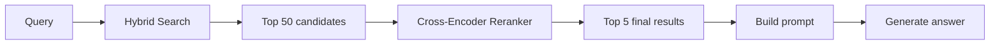
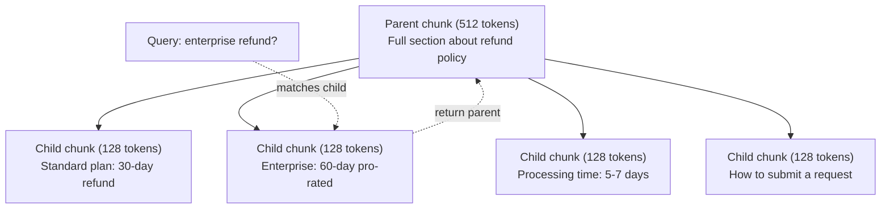
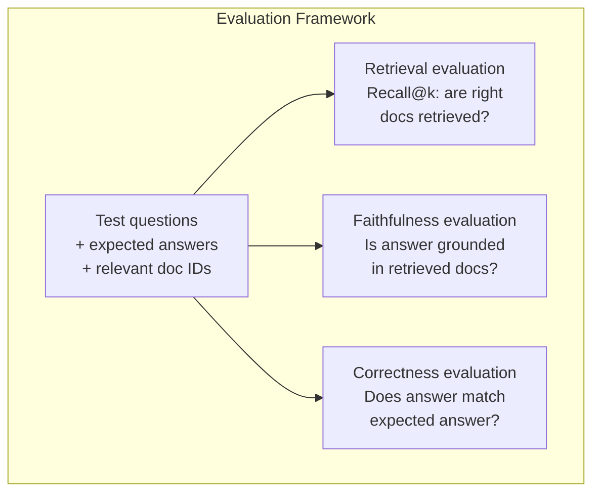

# Gelişmiş RAG (Parçalama, Yeniden Sıralama, Hibrit Arama)

> Temel RAG, en benzer ilk k parçalarını alır. Bu basit sorular için işe yarar. Çok atlamalı akıl yürütme, belirsiz sorgular ve büyük derlemler nedeniyle parçalanıyor. Gelişmiş RAG, 10 belge üzerinde çalışan bir demo ile 10 milyon belge üzerinde çalışan bir sistem arasındaki farktır.

**Tür:** Yapım
**Diller:** Python
**Önkoşullar:** Aşama 11, Ders 06 (RAG)
**Süre:** ~90 dakika
**İlgili:** Aşama 5 · 23 (RAG için Parçalama Stratejileri), Vectara/Antropik benchmark'ler ile altı parçalama algoritmasının tümünü kapsar: özyinelemeli, anlamsal, cümle, ana belge, geç parçalama, bağlamsal erişim. Bu ders şu temellere dayanmaktadır: karma arama, yeniden sıralama, sorgu dönüşümü.

## Öğrenme Hedefleri

- Belge yapısını ve bağlamını koruyan gelişmiş parçalama stratejilerini (anlamsal, özyinelemeli, ebeveyn-çocuk) uygulayın
- BM25 anahtar kelime eşleşmesini semantik vektör arama ve kodlayıcılar arası yeniden sıralamayla birleştiren hibrit bir arama hattı oluşturun
- Belirsiz veya karmaşık sorulara erişimi geliştirmek için sorgu dönüştürme tekniklerini (HyDE, çoklu sorgu, geri adım) uygulayın
- Yaygın RAG hatalarını teşhis edin ve düzeltin: yanlış yığın alındı, bağlamda olmayan yanıt, çok atlamalı akıl yürütme dökümü

## Sorun

Ders 06'da temel bir RAG işlem hattı oluşturdunuz. Küçük bir derlemedeki basit sorular için işe yarar. Şimdi şunları deneyin:

**Belirsiz sorgu**: "Geçen çeyrekte gelir neydi?" Semantik arama, gelir stratejisi, gelir tahminleri ve CFO'nun gelir artışına ilişkin düşünceleri hakkında parçalar getirir. Hepsi anlamsal olarak "gelir" kelimesine benzer. Hiçbiri gerçek sayıyı içermiyor. Doğru parçada "$47.2M in Q3 2025" but uses the word "earnings" instead of "revenue." The embedding model thinks "revenue strategy" is closer to the query than "Q3 earnings were $47.2M" yazıyor.

**Çoklu atlamalı soru**: "Müşteri memnuniyeti puanında en yüksek artışı hangi takım elde etti?" Bu, her takımın memnuniyet puanlarını bulmayı, bunları karşılaştırmayı ve maksimum değeri belirlemeyi gerektirir. Hiçbir parça cevabı içermiyor. Bilgiler ekip raporlarına dağılmıştır.

**Büyük derlem sorunu**: 2 milyon parçanız var. Doğru cevap 1,847,293 numaralı parçadadır. İlk 5'e ulaşmanız #14, #89,201, #1,200,000, #44 ve #901,333 parçalarını çekiyor. embedding alanında kapatın, ancak hiçbiri yanıtı içermiyor. Bu ölçekte, yaklaşık en yakın komşu araması, ilgili sonuçların üst-k'nin dışına itilmesine yetecek kadar hata ortaya çıkarır.

Temel RAG başarısız olur çünkü vektör benzerliği alaka düzeyiyle aynı değildir. Bir yığın, onu yanıtlamak için kullanışlı olmasa da anlamsal olarak bir sorguya benzer olabilir. Gelişmiş RAG bu sorunu dört teknikle ele alır: hibrit arama (anahtar kelime eşleşmesi ekleyin), yeniden sıralama (adayları daha dikkatli puanlayın), sorgu dönüşümü (aramadan önce sorguyu düzeltin) ve daha iyi parçalama (doğru ayrıntı düzeyinde erişim).

## Konsept

### Hibrit Arama: Semantik + Anahtar Kelime

Anlamsal arama (vektör benzerliği) anlamı anlamada iyidir. "Aboneliğimi nasıl iptal edebilirim?" hiçbir kelime paylaşmasalar bile "Planınızı sonlandıracak adımlar" ile eşleşiyor. Ancak tam eşleşmeleri kaçırıyor. embedding modeli bunu gürültü olarak ele alırsa, "Hata kodu E-4021", "E-4021" içeren bir yığınla eşleşmeyebilir.

Anahtar kelime arama (BM25) bunun tam tersidir. Tam eşleşmelerde mükemmeldir. "E-4021" mükemmel bir şekilde eşleşir. Ancak belgede "planınızı sonlandırın" yazıyorsa "aboneliğimi iptal et" sıfır sonuç verir.

Hibrit arama her ikisini de çalıştırır ve ardından sonuçları birleştirir.

**BM25** (En İyi Eşleşen 25), standart anahtar kelime arama algoritmasıdır. 1990'lı yıllardan bu yana arama motorlarının omurgası olmuştur. Formül:

```
BM25(q, d) = sum over terms t in q:
    IDF(t) * (tf(t,d) * (k1 + 1)) / (tf(t,d) + k1 * (1 - b + b * |d| / avgdl))
```

Burada tf(t,d), t'nin d belgesindeki terim frekansıdır, IDF(t) ters belge frekansıdır, |d| belge uzunluğu, avgdl ortalama belge uzunluğu, k1 terim frekansı doygunluğunu kontrol eder (varsayılan 1,2) ve b uzunluk normalizasyonunu kontrol eder (varsayılan 0,75).

Basit bir ifadeyle: BM25, sorgu terimleri (özellikle nadir olanlar) içerdiğinde belgeleri daha yüksek puan alır, ancak tekrarlanan terimlerin getirisi azalır. "Gelir" kelimesini 50 kez içeren bir belge, bu sözcüğün bir kez geçtiği belgeden 50 kat daha alakalı değildir.

### Karşılıklı Sıra Füzyonu (RRF)

İki sıralı listeniz var: biri vektör aramasından, diğeri BM25'ten. Bunları nasıl birleştiriyorsunuz? Karşılıklı Sıra Füzyonu standart yaklaşımdır.

```
RRF_score(d) = sum over rankings R:
    1 / (k + rank_R(d))
```

Burada k, en üst sıradaki sonucun baskın olmasını engelleyen bir sabittir (tipik olarak 60).

Vektör aramada 1. ve BM25'te 5. sırada yer alan bir belge şunu elde eder: 1/(60+1) + 1/(60+5) = 0,0164 + 0,0154 = 0,0318

Vektör aramada 3. ve BM25'te 2. sırada yer alan bir belge şunu elde eder: 1/(60+3) + 1/(60+2) = 0,0159 + 0,0161 = 0,0320

RRF doğal olarak iki sinyali dengeler. Her iki listede de üst sıralarda yer alan belge en iyi puanı alır. Bir listede 1. sırada yer alan ancak diğerinde bulunmayan bir belge orta düzeyde bir puan alır. Bu sağlamdır çünkü ham puanları değil sıralamaları kullanır, dolayısıyla iki sistem arasındaki puan dağılımlarındaki farklılıklar önemli değildir.

### Yeniden sıralama

Erişim (vektör, anahtar kelime veya hibrit) hızlıdır ancak kesin değildir. Çift kodlayıcılar kullanır: sorgu ve her belge bağımsız olarak gömülür ve ardından karşılaştırılır. embedding'ler bir kez hesaplanır ve önbelleğe alınır. Bu milyonlarca belgeye ölçeklenir.

Yeniden sıralamada çapraz kodlayıcılar kullanılır: sorgu ve aday belge, bir uygunluk puanı veren bir modele birlikte beslenir. Model, her iki metni aynı anda görüyor ve aralarındaki ince taneli etkileşimleri yakalayabiliyor. Çapraz kodlayıcı "3. çeyrek kazançları neydi?" sorusunu anlayabilir. bir çift kodlayıcı bağlantıyı kaçırmış olsa bile "3. çeyrekte 47,2 milyon ABD doları" içeren bir yığınla oldukça alakalı.

Takas: Çapraz kodlayıcılar, sorgu-belge çiftini birlikte işledikleri için çift kodlayıcılardan 100-1000 kat daha yavaştır. Bir milyon belge için çapraz kodlayıcı puanlarını önceden hesaplayamazsınız. Çözüm: Daha büyük bir aday kümesi alın (karma aramadan ilk 50'ye ulaşın), ardından son ilk 5'i elde etmek için çapraz kodlayıcıyla yeniden sıralama yapın.



Yaygın yeniden sıralama modelleri (2026 serisi):
- Cohere Rerank 3.5: yönetilen API, çok dilli, karma şirketlerde en iyi hatırlama kazancı
- Voyage rerank-2.5: yönetilen API, barındırılan seçenekler arasında en düşük gecikme süresi
- Jina-Reranker-v2 Çok Dilli: açık ağırlık, 100'den fazla dil
- bge-reranker-v2-m3: açık ağırlık, güçlü temel
- çapraz kodlayıcı/ms-marco-MiniLM-L-6-v2: açık ağırlık, prototip oluşturmak için CPU üzerinde çalışır
- ColBERTv2 / Jina-ColBERT-v2: geç etkileşimli çoklu vektör yeniden sıralamaları — puanlama zamanında O(docs) değil O(tokens)

### Sorgu Dönüşümü

Bazen sorun, erişim değil, sorgunun kendisidir. "Yeni politika değişikliğiyle ilgili şey neydi?" berbat bir arama sorgusu. Belirli bir terim içermez. embedding belirsizdir. Hiçbir erişim sistemi bundan doğru belgeleri bulamaz.

**Sorgunun yeniden yazılması**: Kullanıcının sorgusunu daha iyi bir arama sorgusuna dönüştürün. Bir Yüksek Lisans bunu yapabilir:

```
User: "What was that thing about the new policy change?"
Rewritten: "Recent policy changes and updates"
```

**HyDE (Varsayımsal Belge Embedding'ler)**: sorguyla arama yapmak yerine, varsayımsal bir yanıt oluşturun, bunu ekleyin ve benzer gerçek belgeleri arayın.

```
Query: "What is the refund policy for enterprise?"
Hypothetical answer: "Enterprise customers are eligible for a full refund
within 60 days of purchase. Refunds are pro-rated based on the remaining
subscription period and processed within 5-7 business days."
```

Varsayımsal cevabı ekleyin ve buna benzer gerçek belgeleri arayın. Sezgi: Varsayımsal cevap embedding uzayında gerçek cevaba orijinal sorudan daha yakın yaşar. Sorular ve cevaplar farklı dilsel yapılara sahiptir. Varsayımsal bir cevap oluşturarak embedding'deki "soru alanı" ile "cevap alanı" arasındaki boşluğu doldurursunuz.

HyDE, alımdan önce bir LLM çağrısı ekler. Bu, gecikmeyi 500-2000 ms artırır. Ham sorgularda alma kalitesi zayıf olduğunda buna değer.

### Ebeveyn-Çocuk Parçalama

Standart parçalama bir ödünleşimi zorunlu kılar: hassas erişim için küçük parçalar, yeterli bağlam için büyük parçalar. Ebeveyn-çocuk parçalaması bu ödünleşimi ortadan kaldırır.

Geri alma için küçük parçaları (128 token) dizinleyin. Küçük bir parça alındığında, prompt için ana parçasını (512 token) döndürün. Küçük parça sorguyla tam olarak eşleşir. Ana parça, LLM'nin iyi bir cevap üretmesi için yeterli bağlam sağlar.



"Kurumsal geri ödeme?" sorgusu C2 alt öbeğiyle tam olarak eşleşir. Ancak prompt, işlem süresi ve gönderim süreciyle ilgili bağlamı içeren P ana öbeğinin tamamını alır.

### Meta Veri Filtreleme

Vektör aramasını çalıştırmadan önce, külliyatı meta verilere göre filtreleyin: tarih, kaynak, kategori, yazar, dil. Bu, arama alanını azaltır ve alakasız sonuçları önler.

"Geçen ay güvenlik politikasında ne değişti?" güvenlik kategorisinde yalnızca son 30 güne ait belgeler aranmalıdır. Meta veri filtreleme olmadan, tüm derlemeyi ararsınız ve anlamsal olarak benzer olan 2 yıllık bir güvenlik belgesini alabilirsiniz.

Üretim RAG sistemleri her bir parçanın yanında meta verileri depolar: kaynak belge, oluşturulma tarihi, kategori, yazar, sürüm. Vector database'ler, benzerlik aramasından önce meta verilere göre ön filtrelemeyi destekler; bu, geniş ölçekte performans açısından kritik öneme sahiptir.

### Değerlendirme

Bir RAG sistemi kurdunuz. İşe yarayıp yaramadığını nasıl anlarsınız? Üç metrik:

**Geri alma alaka düzeyi (Recall@k)**: Bilinen ilgili belgelere sahip bir dizi test sorusu için, ilgili belgelerin yüzde kaçı ilk k sonuçlarında görünüyor? Bir sorunun cevabı 47. parçadaysa, 47. parça ilk 5'te mi görünüyor?

**Doğruluk**: Oluşturulan yanıt, alınan belgelere dayanıyor mu? Alınan parçalarda "60 günlük geri ödeme aralığı" yazıyorsa ve modelde "90 günlük geri ödeme aralığı" yazıyorsa bu bir sadakat hatasıdır. Model, doğru bağlama sahip olmasına rağmen halüsinasyon gördü.

**Cevap doğruluğu**: Oluşturulan cevap beklenen cevapla eşleşiyor mu? Bu uçtan uca ölçümdür. Alma kalitesi ile üretim kalitesini birleştirir.

Basit bir doğruluk kontrolü: oluşturulan yanıttaki her bir iddiayı alın ve alınan parçalarda (özünde) göründüğünü doğrulayın. Cevap, alınan herhangi bir parçada olmayan bir gerçeği içeriyorsa, muhtemelen halüsinasyondur.



## İnşa Et

### Adım 1: BM25'in Uygulanması

```python
import math
from collections import Counter

class BM25:
    def __init__(self, k1=1.2, b=0.75):
        self.k1 = k1
        self.b = b
        self.docs = []
        self.doc_lengths = []
        self.avg_dl = 0
        self.doc_freqs = {}
        self.n_docs = 0

    def index(self, documents):
        self.docs = documents
        self.n_docs = len(documents)
        self.doc_lengths = []
        self.doc_freqs = {}

        for doc in documents:
            words = doc.lower().split()
            self.doc_lengths.append(len(words))
            unique_words = set(words)
            for word in unique_words:
                self.doc_freqs[word] = self.doc_freqs.get(word, 0) + 1

        self.avg_dl = sum(self.doc_lengths) / self.n_docs if self.n_docs else 1

    def score(self, query, doc_idx):
        query_words = query.lower().split()
        doc_words = self.docs[doc_idx].lower().split()
        doc_len = self.doc_lengths[doc_idx]
        word_counts = Counter(doc_words)
        score = 0.0

        for term in query_words:
            if term not in word_counts:
                continue
            tf = word_counts[term]
            df = self.doc_freqs.get(term, 0)
            idf = math.log((self.n_docs - df + 0.5) / (df + 0.5) + 1)
            numerator = tf * (self.k1 + 1)
            denominator = tf + self.k1 * (1 - self.b + self.b * doc_len / self.avg_dl)
            score += idf * numerator / denominator

        return score

    def search(self, query, top_k=10):
        scores = [(i, self.score(query, i)) for i in range(self.n_docs)]
        scores.sort(key=lambda x: x[1], reverse=True)
        return scores[:top_k]
```

### Adım 2: Karşılıklı Sıra Füzyonu

```python
def reciprocal_rank_fusion(ranked_lists, k=60):
    scores = {}
    for ranked_list in ranked_lists:
        for rank, (doc_id, _) in enumerate(ranked_list):
            if doc_id not in scores:
                scores[doc_id] = 0.0
            scores[doc_id] += 1.0 / (k + rank + 1)
    fused = sorted(scores.items(), key=lambda x: x[1], reverse=True)
    return fused
```

### Adım 3: Hibrit Arama Hattı

```python
def hybrid_search(query, chunks, vector_embeddings, vocab, idf, bm25_index, top_k=5, fusion_k=60):
    query_emb = tfidf_embed(query, vocab, idf)
    vector_results = search(query_emb, vector_embeddings, top_k=top_k * 3)
    bm25_results = bm25_index.search(query, top_k=top_k * 3)
    fused = reciprocal_rank_fusion([vector_results, bm25_results], k=fusion_k)
    return fused[:top_k]
```

### Adım 4: Basit Yeniden Sıralama

Üretimde çapraz kodlayıcı modelini kullanırsınız. Burada kelime örtüşmesini, terimin önemini ve kelime öbeği eşleştirmeyi kullanarak sorgu-belge alaka düzeyini puanlayan bir yeniden sıralama oluşturucu oluşturuyoruz.

```python
def rerank(query, candidates, chunks):
    query_words = set(query.lower().split())
    stop_words = {"the", "a", "an", "is", "are", "was", "were", "what", "how",
                  "why", "when", "where", "do", "does", "for", "of", "in", "to",
                  "and", "or", "on", "at", "by", "it", "its", "this", "that",
                  "with", "from", "be", "has", "have", "had", "not", "but"}
    query_terms = query_words - stop_words

    scored = []
    for doc_id, initial_score in candidates:
        chunk = chunks[doc_id].lower()
        chunk_words = set(chunk.split())

        term_overlap = len(query_terms & chunk_words)

        query_bigrams = set()
        q_list = [w for w in query.lower().split() if w not in stop_words]
        for i in range(len(q_list) - 1):
            query_bigrams.add(q_list[i] + " " + q_list[i + 1])
        bigram_matches = sum(1 for bg in query_bigrams if bg in chunk)

        position_boost = 0
        for term in query_terms:
            pos = chunk.find(term)
            if pos != -1 and pos < len(chunk) // 3:
                position_boost += 0.5

        rerank_score = (
            term_overlap * 1.0
            + bigram_matches * 2.0
            + position_boost
            + initial_score * 5.0
        )
        scored.append((doc_id, rerank_score))

    scored.sort(key=lambda x: x[1], reverse=True)
    return scored
```

### Adım 5: HyDE (Varsayımsal Belge Embedding'ler)

```python
def hyde_generate_hypothesis(query):
    templates = {
        "what": "The answer to '{query}' is as follows: Based on our documentation, {topic} involves specific policies and procedures that define how the process works.",
        "how": "To address '{query}': The process involves several steps. First, you need to initiate the request. Then, the system processes it according to the defined rules.",
        "default": "Regarding '{query}': Our records indicate specific details and policies related to this topic that provide a comprehensive answer."
    }
    query_lower = query.lower()
    if query_lower.startswith("what"):
        template = templates["what"]
    elif query_lower.startswith("how"):
        template = templates["how"]
    else:
        template = templates["default"]

    topic_words = [w for w in query.lower().split()
                   if w not in {"what", "is", "the", "how", "do", "does", "a", "an",
                                "for", "of", "to", "in", "on", "at", "by", "and", "or"}]
    topic = " ".join(topic_words) if topic_words else "this topic"

    return template.format(query=query, topic=topic)


def hyde_search(query, chunks, vector_embeddings, vocab, idf, top_k=5):
    hypothesis = hyde_generate_hypothesis(query)
    hypothesis_emb = tfidf_embed(hypothesis, vocab, idf)
    results = search(hypothesis_emb, vector_embeddings, top_k)
    return results, hypothesis
```

### Adım 6: Ebeveyn-Çocuk Parçalama

```python
def create_parent_child_chunks(text, parent_size=200, child_size=50):
    words = text.split()
    parents = []
    children = []
    child_to_parent = {}

    parent_idx = 0
    start = 0
    while start < len(words):
        parent_end = min(start + parent_size, len(words))
        parent_text = " ".join(words[start:parent_end])
        parents.append(parent_text)

        child_start = start
        while child_start < parent_end:
            child_end = min(child_start + child_size, parent_end)
            child_text = " ".join(words[child_start:child_end])
            child_idx = len(children)
            children.append(child_text)
            child_to_parent[child_idx] = parent_idx
            child_start += child_size

        parent_idx += 1
        start += parent_size

    return parents, children, child_to_parent
```

### Adım 7: Sadakat Değerlendirmesi

```python
def evaluate_faithfulness(answer, retrieved_chunks):
    answer_sentences = [s.strip() for s in answer.split(".") if len(s.strip()) > 10]
    if not answer_sentences:
        return 1.0, []

    grounded = 0
    ungrounded = []
    context = " ".join(retrieved_chunks).lower()

    for sentence in answer_sentences:
        words = set(sentence.lower().split())
        stop_words = {"the", "a", "an", "is", "are", "was", "were", "and", "or",
                      "to", "of", "in", "for", "on", "at", "by", "it", "this", "that"}
        content_words = words - stop_words
        if not content_words:
            grounded += 1
            continue

        matched = sum(1 for w in content_words if w in context)
        ratio = matched / len(content_words) if content_words else 0

        if ratio >= 0.5:
            grounded += 1
        else:
            ungrounded.append(sentence)

    score = grounded / len(answer_sentences) if answer_sentences else 1.0
    return score, ungrounded


def evaluate_retrieval_recall(queries_with_relevant, retrieval_fn, k=5):
    total_recall = 0.0
    results = []

    for query, relevant_indices in queries_with_relevant:
        retrieved = retrieval_fn(query, k)
        retrieved_indices = set(idx for idx, _ in retrieved)
        relevant_set = set(relevant_indices)
        hits = len(retrieved_indices & relevant_set)
        recall = hits / len(relevant_set) if relevant_set else 1.0
        total_recall += recall
        results.append({
            "query": query,
            "recall": recall,
            "hits": hits,
            "total_relevant": len(relevant_set)
        })

    avg_recall = total_recall / len(queries_with_relevant) if queries_with_relevant else 0
    return avg_recall, results
```

## Kullan onu

Yeniden sıralama için gerçek bir çapraz kodlayıcı ile:

```python
from sentence_transformers import CrossEncoder

reranker = CrossEncoder("cross-encoder/ms-marco-MiniLM-L-6-v2")

def rerank_with_cross_encoder(query, candidates, chunks, top_k=5):
    pairs = [(query, chunks[doc_id]) for doc_id, _ in candidates]
    scores = reranker.predict(pairs)
    scored = list(zip([doc_id for doc_id, _ in candidates], scores))
    scored.sort(key=lambda x: x[1], reverse=True)
    return scored[:top_k]
```

Cohere'in yönetilen yeniden sıralamasıyla:

```python
import cohere

co = cohere.Client()

def rerank_with_cohere(query, candidates, chunks, top_k=5):
    docs = [chunks[doc_id] for doc_id, _ in candidates]
    response = co.rerank(
        model="rerank-english-v3.0",
        query=query,
        documents=docs,
        top_n=top_k
    )
    return [(candidates[r.index][0], r.relevance_score) for r in response.results]
```

Gerçek Yüksek Lisans derecesine sahip HyDE için:

```python
import anthropic

client = anthropic.Anthropic()

def hyde_with_llm(query):
    response = client.messages.create(
        model="claude-sonnet-5",
        max_tokens=256,
        messages=[{
            "role": "user",
            "content": f"Write a short paragraph that would be a good answer to this question. Do not say you don't know. Just write what the answer would look like.\n\nQuestion: {query}"
        }]
    )
    return response.content[0].text
```

Weaviate ile üretim hibrit araması için:

```python
import weaviate

client = weaviate.connect_to_local()

collection = client.collections.get("Documents")
response = collection.query.hybrid(
    query="enterprise refund policy",
    alpha=0.5,
    limit=10
)
```

Alfa parametresi dengeyi kontrol eder: 0,0 = saf anahtar kelime (BM25), 1,0 = saf vektör, 0,5 = eşit ağırlık. Çoğu üretim sistemi 0,3 ile 0,7 arasında alfa kullanır.

## Gönderin

Bu ders şunları üretir:
- `outputs/prompt-advanced-rag-debugger.md` -- RAG kalite sorunlarını tanılamak ve düzeltmek için bir prompt
- `outputs/skill-advanced-rag.md` - hibrit arama ve yeniden sıralama ile üretim düzeyinde RAG oluşturmaya yönelik bir beceri

## Egzersizler

1. Örnek belgelerde BM25 ile vektör aramayı ve hibrit aramayı karşılaştırın. 5 test sorgusunun her biri için, hangi yaklaşımın en alakalı parçayı döndürdüğünü 1 numaralı konuma kaydedin. Hibrit aramanın en az 5 üzerinden 3'ü kazanması gerekir.

2. Bir meta veri filtresi uygulayın. Her belgeye (güvenlik, faturalandırma, API, ürün) bir "kategori" alanı ekleyin. Vektör aramasını çalıştırmadan önce parçaları yalnızca ilgili kategoriye göre filtreleyin. "Hangi şifreleme kullanılıyor?" sorusunu kullanarak test edin. ve yalnızca güvenlik kategorisi parçalarını aradığını doğrulayın.

3. Ders 06'daki basit oluşturma işlevini kullanarak tam bir HyDE hattı oluşturun. 5 test sorgusunun tamamında doğrudan sorgu araması ile HyDE araması arasındaki alma kalitesini (ilk 3 uygunluk) karşılaştırın. HyDE belirsiz sorgular için sonuçları iyileştirmelidir.

4. Ebeveyn-çocuk parçalama stratejisini örnek belgeler üzerinde uygulayın. child_size=30 ve parent_size=100 kullanın. Alt parçalarla arama yapın ancak ana parçaları prompt'de döndürün. Oluşturulan yanıtları chunk_size=50 ile standart parçalamayla karşılaştırın.

5. Bir değerlendirme oluşturun dataset: Cevapları bilinen 10 soru. (a) yalnızca vektör araması, (b) yalnızca BM25, (c) hibrit arama, (d) hibrit + yeniden sıralama için Recall@3, Recall@5 ve Recall@10'u ölçün. Sonuçları çizin ve yeniden sıralamanın en çok nerede yardımcı olacağını belirleyin.

## Anahtar Terimler

| Dönem | İnsanlar ne diyor | Aslında ne anlama geliyor |
|------|----------------|----------------------|
| BM25 | "Anahtar kelime arama" | Belgeleri terim sıklığına, ters belge sıklığına ve belge uzunluğu normalizasyonuna göre puanlayan olasılıksal bir sıralama algoritması |
| Hibrit arama | "Her iki dünyanın da en iyisi" | Semantik (vektör) ve anahtar kelime (BM25) aramasını paralel olarak çalıştırma, ardından sıralama birleştirmeyle sonuçları birleştirme |
| Karşılıklı Sıra Füzyonu | "Sıralı listeleri birleştir" | Tüm listelerdeki her belge için 1/(k + sıra) toplayarak birden çok sıralı listeyi birleştirme |
| Yeniden Sıralama | "İkinci geçiş puanlaması" | Bir aday kümesini ilk erişimden yeniden puanlamak için daha pahalı bir çapraz kodlayıcı modeli kullanma |
| Çapraz kodlayıcı | "Ortak sorgu-belge modeli" | Bir sorguyu ve belgeyi tek bir girdi olarak alan, alaka puanı üreten bir model; çift ​​kodlayıcılardan daha doğru ancak tam derleme araması için çok yavaş |
| Çift kodlayıcı | "Bağımsız embedding modeli" | Sorguları ve belgeleri bağımsız olarak yerleştiren bir model; hızlıdır çünkü embedding'ler önceden hesaplanır ancak çapraz kodlayıcılardan daha az hassastır |
| HyDE | "Sahte yanıtla ara" | Sorguya varsayımsal bir yanıt oluşturun, onu yerleştirin ve buna benzer gerçek belgeleri arayın |
| Ebeveyn-çocuk parçalaması | "Küçük arama, büyük bağlam" | Hassas erişim için küçük parçaları dizinleyin, ancak yeterli bağlam sağlamak için daha büyük ana parçayı döndürün |
| Meta veri filtreleme | "Aramadan önce daraltın" | Arama alanını azaltmak için vektör aramasını çalıştırmadan önce belgeleri niteliklere (tarih, kaynak, kategori) göre filtreleme |
| Sadakat | "Temelde kaldı mı?" | Oluşturulan yanıtın, modelin eğitim verilerinden halüsinasyona uğramasının aksine, alınan belgeler tarafından desteklenip desteklenmediği |

## Daha Fazla Okuma

- Robertson ve Zaragoza, "The Probabilistic Relevance Framework: BM25 and Beyond" (2009) -- BM25 için kesin referans, formülün arkasındaki olasılıksal temelleri açıklıyor
- Cormack ve diğerleri, "Reciprocal Rank Fusion Condorcet ve Bireysel Rank Öğrenme Yöntemlerinden Daha İyi Performans Gösteriyor" (2009) -- daha karmaşık füzyon yöntemlerini geride bıraktığını gösteren orijinal RRF makalesi
- Gao ve diğerleri, "İlgili Etiketler Olmadan Hassas Sıfır Atış Yoğun Alma" (2022) -- varsayımsal belge embedding'lerin herhangi bir eğitim verisi olmadan almayı iyileştirdiğini gösteren HyDE makalesi
- Nogueira ve Cho, "BERT ile Geçit Yeniden Sıralaması" (2019) -- BM25'in üzerinde çapraz kodlayıcı yeniden sıralamanın alma kalitesini önemli ölçüde artırdığını gösterdi
- [Khattab ve diğerleri, "DSPy: Bildirimsel Dil Modeli Çağrılarını Kendini Geliştiren İşlem Hatlarına Derlemek" (2023)](https://arxiv.org/abs/2310.03714) -- prompt yapısını ve ağırlık seçimini, geri alma işlem hatları üzerinde bir optimizasyon sorunu olarak ele alır; bunu "prompt LLM'ler" yerine "program LLM'ler" için okuyun.
- [Edge ve diğerleri, "Yerelden Küresele: Sorgu Odaklı Özetlemeye Grafik RAG Yaklaşımı" (Microsoft Research 2024)](https://arxiv.org/abs/2404.16130) -- GraphRAG makalesi: varlık-ilişki çıkarımı + sorgu odaklı özetleme için Leiden topluluğu tespiti; küresel ve yerel erişim ayrımı.
- [Asai ve diğerleri, "Self-RAG: Kendini Düşünme Yoluyla Alma, Oluşturma ve Eleştirmeyi Öğrenmek" (ICLR 2024)](https://arxiv.org/abs/2310.11511) -- token'lerin yansımasıyla kendi kendini değerlendiren RAG; agentic sınırı, statik al-sonra oluştur'u geçiyor.
- [LangChain Sorgu Oluşturma blogu](https://blog.langchain.dev/query-construction/) -- ön alım adımı olarak doğal dil sorgularının yapılandırılmış veritabanı sorgularına (Metinden SQL'e, Cypher) nasıl çevrileceği.
