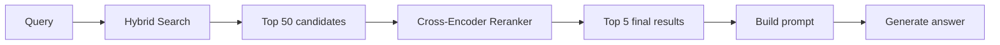
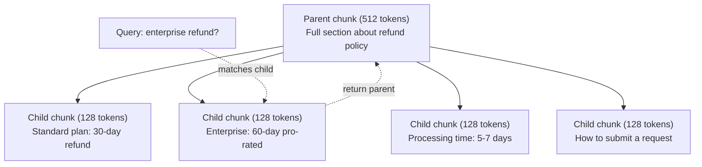
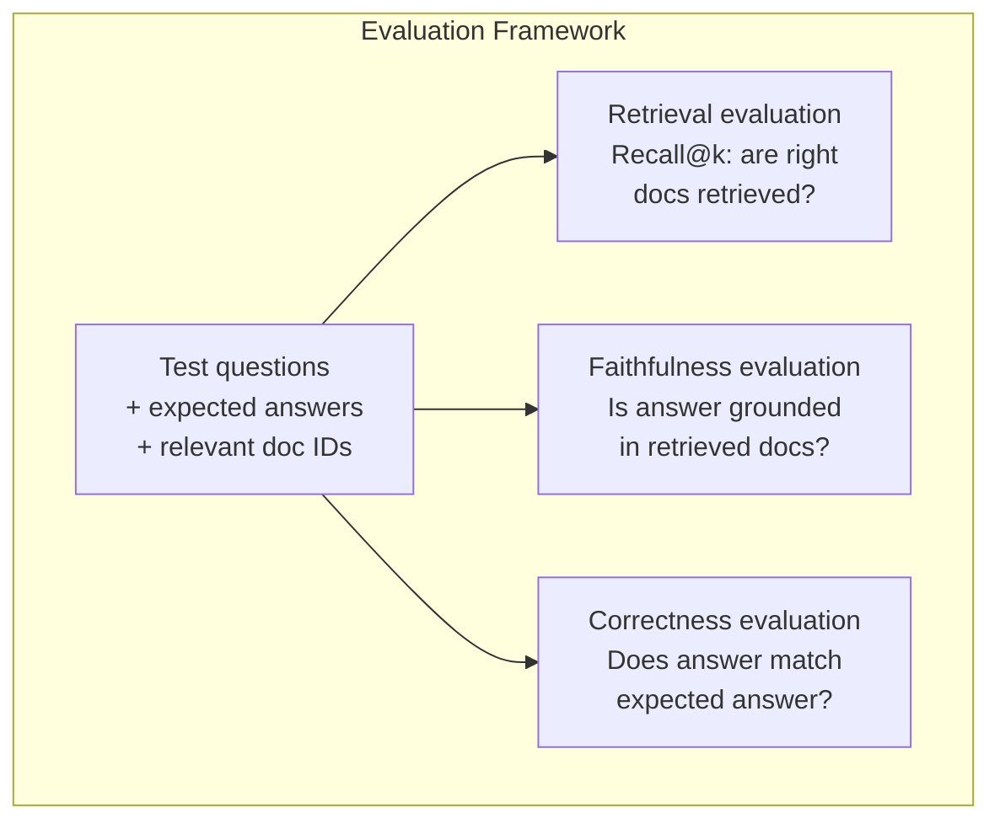

# 高级 RAG（分块、重排序、混合搜索）

> 基础 RAG 检索 top-k 最相似的文本块。这对简单问题有效。但在多跳推理、模糊查询和大型语料库面前会崩溃。高级 RAG 是区分"在 10 份文档上能运行的 demo"和"在 1000 万份文档上能运行的系统"的关键。

**类型：** 构建
**语言：** Python
**前置知识：** Phase 11, Lesson 06 (RAG)
**时间：** ~90 分钟
**相关：** Phase 5 · 23 (Chunking Strategies for RAG) 涵盖了六种分块算法——递归、语义、句子、父文档、late chunking、contextual retrieval——以及 Vectara/Anthropic 的基准测试。本课在此基础上构建：混合搜索、重排序、查询转换。

## 学习目标

- 实现高级分块策略（语义、递归、父子分块），保留文档结构和上下文
- 构建混合搜索管道，结合 BM25 关键词匹配、语义向量搜索和 cross-encoder 重排序器
- 应用查询转换技术（HyDE、多查询、step-back）改善模糊或复杂问题的检索效果
- 诊断并修复常见 RAG 故障：检索到错误文本块、答案不在上下文中、多跳推理断裂

## 问题所在

你在 Lesson 06 中构建了一个基础 RAG 管道。它对小型语料库上的直接问题有效。现在试试这些：

**模糊查询**："上个季度收入是多少？" 语义搜索返回关于收入战略、收入预测和 CFO 对收入增长看法的文本块。它们都与"收入"这个词语义相似。但没有一个包含实际数字。正确的文本块写的是"Q3 2025  earnings 为 $47.2M"，但用的是"earnings"而不是"revenue"。嵌入模型认为"revenue strategy"比"Q3 earnings were $47.2M"更接近查询。

**多跳问题**："哪个团队的客户满意度提升最高？" 这需要查找每个团队的满意度分数，进行比较，并找出最大值。没有单个文本块包含答案。信息分散在团队报告中。

**大型语料库问题**：你有 200 万个文本块。正确答案在第 1,847,293 号文本块中。你的 top-5 检索拉出了第 14、89,201、1,200,000、44 和 901,333 号文本块。在嵌入空间中接近，但没有一个包含答案。在这种规模下，近似最近邻搜索引入的误差足以将相关结果挤出 top-k。

基础 RAG 失败的原因是向量相似度不等于相关性。一个文本块可以与查询语义相似，但对回答查询毫无用处。高级 RAG 用四种技术解决这个问题：混合搜索（添加关键词匹配）、重排序（更仔细地评分候选结果）、查询转换（搜索前修正查询）和更好的分块（以正确的粒度检索）。

## 核心概念

### 混合搜索：语义 + 关键词

语义搜索（向量相似度）擅长理解含义。"How do I cancel my subscription?" 可以匹配 "Steps to terminate your plan"，即使它们没有共享任何单词。但它会漏掉精确匹配。"Error code E-4021" 可能不会匹配包含 "E-4021" 的文本块，如果嵌入模型将其视为噪声。

关键词搜索（BM25）正好相反。它擅长精确匹配。"E-4021" 完美匹配。但 "cancel my subscription" 如果文档说的是 "terminate your plan"，则返回零结果。

混合搜索同时运行两者，然后合并结果。

**BM25**（Best Matching 25）是标准的关键词搜索算法。自 1990 年代以来一直是搜索引擎的支柱。公式：

```
BM25(q, d) = sum over terms t in q:
    IDF(t) * (tf(t,d) * (k1 + 1)) / (tf(t,d) + k1 * (1 - b + b * |d| / avgdl))
```

其中 tf(t,d) 是词项 t 在文档 d 中的词频，IDF(t) 是逆文档频率，|d| 是文档长度，avgdl 是平均文档长度，k1 控制词频饱和度（默认 1.2），b 控制长度归一化（默认 0.75）。

简单说：BM25 对包含查询词项（尤其是罕见词项）的文档评分更高，但重复词项的收益递减。包含"revenue"50 次的文档并不比包含一次的文档相关 50 倍。

### Reciprocal Rank Fusion (RRF)

你有两个排序列表：一个来自向量搜索，一个来自 BM25。如何合并它们？Reciprocal Rank Fusion 是标准方法。

```
RRF_score(d) = sum over rankings R:
    1 / (k + rank_R(d))
```

其中 k 是一个常数（通常为 60），防止排名第一的结果主导。

一个文档在向量搜索中排名第 1、在 BM25 中排名第 5，得分：1/(60+1) + 1/(60+5) = 0.0164 + 0.0154 = 0.0318

一个文档在向量搜索中排名第 3、在 BM25 中排名第 2，得分：1/(60+3) + 1/(60+2) = 0.0159 + 0.0161 = 0.0320

RRF 自然平衡两个信号。在两个列表中都排名高的文档获得最佳分数。在一个列表中排名第 1 但在另一个列表中不存在的文档获得中等分数。这很稳健，因为它使用排名而非原始分数，所以两个系统之间的分数分布差异无关紧要。

### 重排序

检索（无论是向量、关键词还是混合）速度快但不精确。它使用 bi-encoders：查询和每个文档独立嵌入，然后比较。嵌入计算一次并缓存。这可以扩展到数百万文档。

重排序使用 cross-encoders：查询和候选文档一起输入模型，输出相关性分数。模型同时看到两个文本，可以捕捉它们之间的细粒度交互。cross-encoder 可以理解 "What were Q3 earnings?" 与包含 "$47.2M in Q3" 的文本块高度相关，即使 bi-encoder 错过了这种关联。

权衡：cross-encoders 比 bi-encoders 慢 100-1000 倍，因为它们联合处理查询-文档对。你无法为百万文档预计算 cross-encoder 分数。解决方案：检索更大的候选集（混合搜索的 top-50），然后用 cross-encoder 重排序得到最终的 top-5。



常见重排序模型（2026 阵容）：
- Cohere Rerank 3.5：托管 API，多语言，在混合语料库上召回增益最佳
- Voyage rerank-2.5：托管 API，托管选项中延迟最低
- Jina-Reranker-v2 Multilingual：开源权重，100+ 语言
- bge-reranker-v2-m3：开源权重，强劲基线
- cross-encoder/ms-marco-MiniLM-L-6-v2：开源权重，可在 CPU 上运行用于原型设计
- ColBERTv2 / Jina-ColBERT-v2：late-interaction 多向量重排序器——评分时间复杂度为 O(tokens) 而非 O(docs)

### 查询转换

有时问题不在检索而在查询本身。"What was that thing about the new policy change?" 是一个糟糕的搜索查询。它不包含具体词项。嵌入很模糊。没有检索系统能从中找到正确的文档。

**查询重写**：将用户的查询重写成更好的搜索查询。LLM 可以完成：

```
User: "What was that thing about the new policy change?"
Rewritten: "Recent policy changes and updates"
```

**HyDE (Hypothetical Document Embeddings)**：不用查询来搜索，而是生成一个假设答案，嵌入它，然后搜索相似的真实文档。

```
Query: "What is the refund policy for enterprise?"
Hypothetical answer: "Enterprise customers are eligible for a full refund
within 60 days of purchase. Refunds are pro-rated based on the remaining
subscription period and processed within 5-7 business days."
```

嵌入假设答案并搜索与其相似的真实文档。直觉：假设答案在嵌入空间中比原始问题更接近真实答案。问题和答案有不同的语言结构。通过生成假设答案，你架起了"问题空间"和"答案空间"之间的桥梁。

HyDE 在检索前增加一次 LLM 调用。这会增加 500-2000ms 延迟。当原始查询的检索质量较差时值得使用。

### 父子分块

标准分块迫使一种权衡：小块用于精确检索，大块用于充分上下文。父子分块消除了这种权衡。

索引小块（128 tokens）用于检索。当一个小块被检索到时，返回其父块（512 tokens）用于 prompt。小块精确匹配查询。父块为 LLM 生成好答案提供足够的上下文。



查询 "enterprise refund?" 精确匹配子块 C2。但 prompt 收到完整的父块 P，其中包含关于处理时间和提交流程的周围上下文。

### 元数据过滤

在运行向量搜索之前，按元数据过滤语料库：日期、来源、类别、作者、语言。这减少搜索空间并防止不相关结果。

"What changed in the security policy last month?" 应该只搜索过去 30 天内安全类别的文档。没有元数据过滤，你会搜索整个语料库，可能检索到一篇 2 年前的安全文档，只是因为它语义上相似。

生产 RAG 系统为每个文本块存储元数据：源文档、创建日期、类别、作者、版本。向量数据库支持在相似性搜索前按元数据预过滤，这对大规模性能至关重要。

### 评估

你构建了一个 RAG 系统。如何知道它是否有效？三个指标：

**检索相关性 (Recall@k)**：对于一组带有已知相关文档的测试问题，相关文档出现在 top-k 结果中的百分比是多少？如果问题的答案在第 47 号文本块中，第 47 号文本块是否出现在 top-5 中？

**忠实度 (Faithfulness)**：生成的答案是否基于检索到的文档？如果检索到的文本块说"60-day refund window"，而模型说"90-day refund window"，这就是忠实度失败。模型在拥有正确上下文的情况下仍然产生了幻觉。

**答案正确性**：生成的答案是否与预期答案匹配？这是端到端指标。它结合了检索质量和生成质量。

一个简单的忠实度检查：取生成答案中的每个声明，验证它（在实质上）是否出现在检索到的文本块中。如果答案包含任何检索到的文本块中不存在的事实，那很可能是幻觉。



## 动手构建

### Step 1: BM25 实现

```python
import math
from collections import Counter

class BM25:
    def __init__(self, k1=1.2, b=0.75):
        self.k1 = k1
        self.b = b
        self.docs = []
        self.doc_lengths = []
        self.avg_dl = 0
        self.doc_freqs = {}
        self.n_docs = 0

    def index(self, documents):
        self.docs = documents
        self.n_docs = len(documents)
        self.doc_lengths = []
        self.doc_freqs = {}

        for doc in documents:
            words = doc.lower().split()
            self.doc_lengths.append(len(words))
            unique_words = set(words)
            for word in unique_words:
                self.doc_freqs[word] = self.doc_freqs.get(word, 0) + 1

        self.avg_dl = sum(self.doc_lengths) / self.n_docs if self.n_docs else 1

    def score(self, query, doc_idx):
        query_words = query.lower().split()
        doc_words = self.docs[doc_idx].lower().split()
        doc_len = self.doc_lengths[doc_idx]
        word_counts = Counter(doc_words)
        score = 0.0

        for term in query_words:
            if term not in word_counts:
                continue
            tf = word_counts[term]
            df = self.doc_freqs.get(term, 0)
            idf = math.log((self.n_docs - df + 0.5) / (df + 0.5) + 1)
            numerator = tf * (self.k1 + 1)
            denominator = tf + self.k1 * (1 - self.b + self.b * doc_len / self.avg_dl)
            score += idf * numerator / denominator

        return score

    def search(self, query, top_k=10):
        scores = [(i, self.score(query, i)) for i in range(self.n_docs)]
        scores.sort(key=lambda x: x[1], reverse=True)
        return scores[:top_k]
```

### Step 2: Reciprocal Rank Fusion

```python
def reciprocal_rank_fusion(ranked_lists, k=60):
    scores = {}
    for ranked_list in ranked_lists:
        for rank, (doc_id, _) in enumerate(ranked_list):
            if doc_id not in scores:
                scores[doc_id] = 0.0
            scores[doc_id] += 1.0 / (k + rank + 1)
    fused = sorted(scores.items(), key=lambda x: x[1], reverse=True)
    return fused
```

### Step 3: 混合搜索管道

```python
def hybrid_search(query, chunks, vector_embeddings, vocab, idf, bm25_index, top_k=5, fusion_k=60):
    query_emb = tfidf_embed(query, vocab, idf)
    vector_results = search(query_emb, vector_embeddings, top_k=top_k * 3)
    bm25_results = bm25_index.search(query, top_k=top_k * 3)
    fused = reciprocal_rank_fusion([vector_results, bm25_results], k=fusion_k)
    return fused[:top_k]
```

### Step 4: 简单重排序器

在生产环境中，你会使用 cross-encoder 模型。这里我们构建一个重排序器，使用词重叠、词项重要性和短语匹配来评分查询-文档相关性。

```python
def rerank(query, candidates, chunks):
    query_words = set(query.lower().split())
    stop_words = {"the", "a", "an", "is", "are", "was", "were", "what", "how",
                  "why", "when", "where", "do", "does", "for", "of", "in", "to",
                  "and", "or", "on", "at", "by", "it", "its", "this", "that",
                  "with", "from", "be", "has", "have", "had", "not", "but"}
    query_terms = query_words - stop_words

    scored = []
    for doc_id, initial_score in candidates:
        chunk = chunks[doc_id].lower()
        chunk_words = set(chunk.split())

        term_overlap = len(query_terms & chunk_words)

        query_bigrams = set()
        q_list = [w for w in query.lower().split() if w not in stop_words]
        for i in range(len(q_list) - 1):
            query_bigrams.add(q_list[i] + " " + q_list[i + 1])
        bigram_matches = sum(1 for bg in query_bigrams if bg in chunk)

        position_boost = 0
        for term in query_terms:
            pos = chunk.find(term)
            if pos != -1 and pos < len(chunk) // 3:
                position_boost += 0.5

        rerank_score = (
            term_overlap * 1.0
            + bigram_matches * 2.0
            + position_boost
            + initial_score * 5.0
        )
        scored.append((doc_id, rerank_score))

    scored.sort(key=lambda x: x[1], reverse=True)
    return scored
```

### Step 5: HyDE (Hypothetical Document Embeddings)

```python
def hyde_generate_hypothesis(query):
    templates = {
        "what": "The answer to '{query}' is as follows: Based on our documentation, {topic} involves specific policies and procedures that define how the process works.",
        "how": "To address '{query}': The process involves several steps. First, you need to initiate the request. Then, the system processes it according to the defined rules.",
        "default": "Regarding '{query}': Our records indicate specific details and policies related to this topic that provide a comprehensive answer."
    }
    query_lower = query.lower()
    if query_lower.startswith("what"):
        template = templates["what"]
    elif query_lower.startswith("how"):
        template = templates["how"]
    else:
        template = templates["default"]

    topic_words = [w for w in query.lower().split()
                   if w not in {"what", "is", "the", "how", "do", "does", "a", "an",
                                "for", "of", "to", "in", "on", "at", "by", "and", "or"}]
    topic = " ".join(topic_words) if topic_words else "this topic"

    return template.format(query=query, topic=topic)


def hyde_search(query, chunks, vector_embeddings, vocab, idf, top_k=5):
    hypothesis = hyde_generate_hypothesis(query)
    hypothesis_emb = tfidf_embed(hypothesis, vocab, idf)
    results = search(hypothesis_emb, vector_embeddings, top_k)
    return results, hypothesis
```

### Step 6: 父子分块

```python
def create_parent_child_chunks(text, parent_size=200, child_size=50):
    words = text.split()
    parents = []
    children = []
    child_to_parent = {}

    parent_idx = 0
    start = 0
    while start < len(words):
        parent_end = min(start + parent_size, len(words))
        parent_text = " ".join(words[start:parent_end])
        parents.append(parent_text)

        child_start = start
        while child_start < parent_end:
            child_end = min(child_start + child_size, parent_end)
            child_text = " ".join(words[child_start:child_end])
            child_idx = len(children)
            children.append(child_text)
            child_to_parent[child_idx] = parent_idx
            child_start += child_size

        parent_idx += 1
        start += parent_size

    return parents, children, child_to_parent
```

### Step 7: 忠实度评估

```python
def evaluate_faithfulness(answer, retrieved_chunks):
    answer_sentences = [s.strip() for s in answer.split(".") if len(s.strip()) > 10]
    if not answer_sentences:
        return 1.0, []

    grounded = 0
    ungrounded = []
    context = " ".join(retrieved_chunks).lower()

    for sentence in answer_sentences:
        words = set(sentence.lower().split())
        stop_words = {"the", "a", "an", "is", "are", "was", "were", "and", "or",
                      "to", "of", "in", "for", "on", "at", "by", "it", "this", "that"}
        content_words = words - stop_words
        if not content_words:
            grounded += 1
            continue

        matched = sum(1 for w in content_words if w in context)
        ratio = matched / len(content_words) if content_words else 0

        if ratio >= 0.5:
            grounded += 1
        else:
            ungrounded.append(sentence)

    score = grounded / len(answer_sentences) if answer_sentences else 1.0
    return score, ungrounded


def evaluate_retrieval_recall(queries_with_relevant, retrieval_fn, k=5):
    total_recall = 0.0
    results = []

    for query, relevant_indices in queries_with_relevant:
        retrieved = retrieval_fn(query, k)
        retrieved_indices = set(idx for idx, _ in retrieved)
        relevant_set = set(relevant_indices)
        hits = len(retrieved_indices & relevant_set)
        recall = hits / len(relevant_set) if relevant_set else 1.0
        total_recall += recall
        results.append({
            "query": query,
            "recall": recall,
            "hits": hits,
            "total_relevant": len(relevant_set)
        })

    avg_recall = total_recall / len(queries_with_relevant) if queries_with_relevant else 0
    return avg_recall, results
```

## 实际应用

使用真实的 cross-encoder 进行重排序：

```python
from sentence_transformers import CrossEncoder

reranker = CrossEncoder("cross-encoder/ms-marco-MiniLM-L-6-v2")

def rerank_with_cross_encoder(query, candidates, chunks, top_k=5):
    pairs = [(query, chunks[doc_id]) for doc_id, _ in candidates]
    scores = reranker.predict(pairs)
    scored = list(zip([doc_id for doc_id, _ in candidates], scores))
    scored.sort(key=lambda x: x[1], reverse=True)
    return scored[:top_k]
```

使用 Cohere 的托管重排序器：

```python
import cohere

co = cohere.Client()
```
