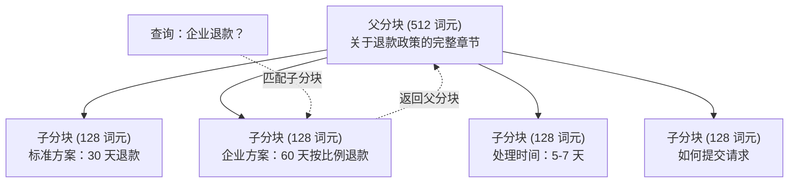
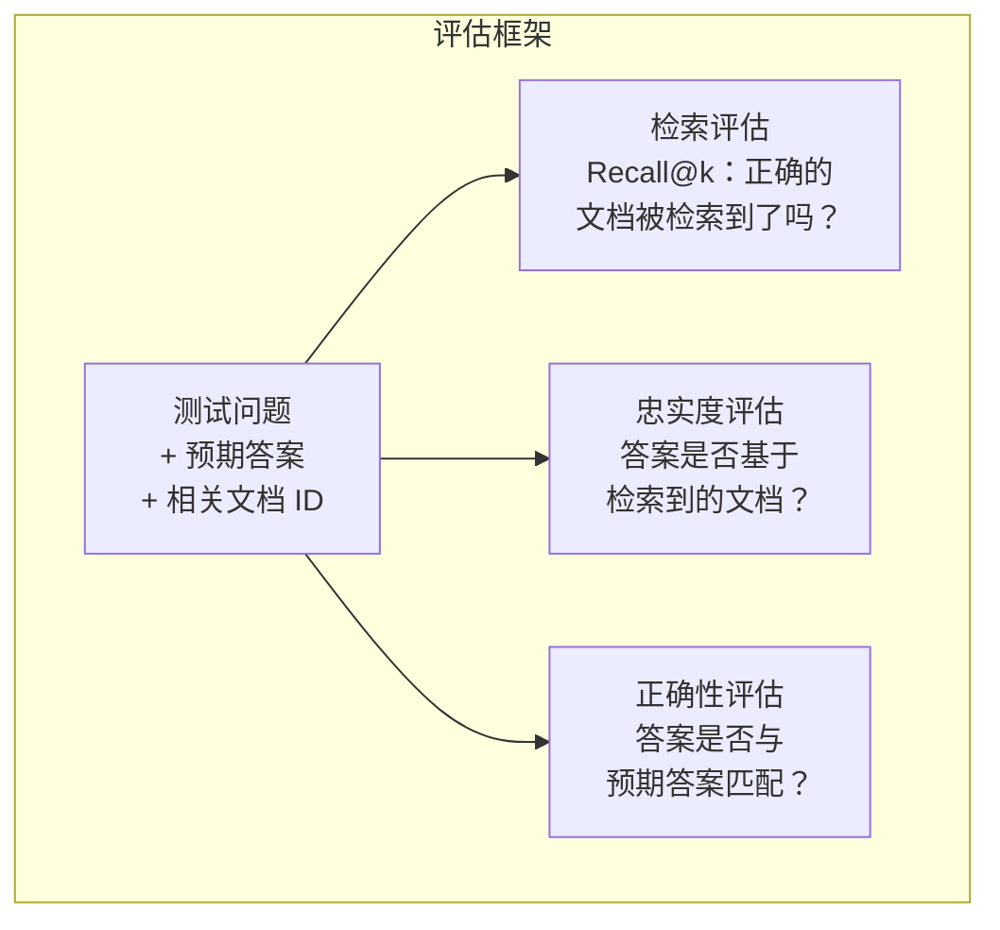

# 高级 RAG（分块、重排序、混合搜索）

> 基础 RAG 检索最相似的 top-k 个分块。这适用于简单问题。但对于多跳推理、模糊查询和大规模语料库，它就会失效。高级 RAG 是能在 10 份文档上运行的演示与能在 1000 万份文档上运行的系统之间的区别。

**类型：** 构建
**语言：** Python
**前置知识：** 阶段 11，第 06 课（RAG）
**时间：** ~90 分钟
**相关：** 阶段 5 · 23（RAG 的分块策略）涵盖了全部六种分块算法——递归、语义、句子、父子、延迟分块、上下文检索——并附带了 Vectara/Anthropic 基准测试。本课在此基础上进行深入：混合搜索、重排序、查询转换。

## 学习目标

- 实现高级分块策略（语义、递归、父子），以保留文档结构和上下文
- 构建结合 BM25 关键词匹配与语义向量搜索以及交叉编码器重排序的混合搜索流水线
- 应用查询转换技术（HyDE、多查询、后退一步）来改善模糊或复杂问题的检索效果
- 诊断并修复常见的 RAG 失败情况：检索到的分块错误、答案不在上下文中、多跳推理失败

## 问题所在

你在第 06 课构建了一个基础 RAG 流水线。它适用于小规模语料库上的简单问题。现在试试这些：

**模糊查询**："上季度营收是多少？" 语义搜索返回的是关于营收策略、营收预测以及 CFO 对营收增长看法的分块。所有这些在语义上都与 "营收" 这个词相似。但没有一个包含实际数字。正确的分块写着 "2025 年第三季度 4720 万美元"，但使用的是 "盈利（earnings）" 一词而非 "营收（revenue）"。嵌入模型认为 "营收策略" 与查询的相似度比 "第三季度盈利为 4720 万美元" 更高。

**多跳问题**："哪个团队的客户满意度分数提升最多？" 这需要找到每个团队的满意度分数，进行比较，并找出最大值。没有单个分块包含答案。信息分散在各团队报告中。

**大规模语料库问题**：你有 200 万个分块。正确答案在 #1,847,293 号分块中。你的 top-5 检索拉取了 #14、#89,201、#1,200,000、#44 和 #901,333 号分块。在嵌入空间中很接近，但没有一个包含答案。在这种规模下，近似最近邻搜索会引入足够多的误差，以至于相关结果被挤出 top-k。

基础 RAG 之所以失败，是因为向量相似度并不等同于相关性。一个分块可能与查询语义相似，但对回答问题却没有帮助。高级 RAG 通过四种技术解决了这个问题：混合搜索（添加关键词匹配）、重排序（更仔细地给候选结果打分）、查询转换（在搜索前修正查询）以及更好的分块（以适当的粒度进行检索）。

## 概念

### 混合搜索：语义 + 关键词

语义搜索（向量相似度）善于理解含义。"如何取消订阅？" 能够匹配 "终止你的计划的步骤"，尽管它们没有共同的词语。但它会错过精确匹配。"错误代码 E-4021" 可能无法匹配包含 "E-4021" 的分块，如果嵌入模型将其视为噪声的话。

关键词搜索（BM25）则相反。它擅长精确匹配。"E-4021" 完美匹配。但如果文档中说的是"终止你的计划"，则"取消我的订阅"会返回零结果。

混合搜索同时运行两者，然后合并结果。

**BM25**（最佳匹配 25）是标准的关键词搜索算法。自 20 世纪 90 年代以来，它一直是搜索引擎的支柱。公式如下：

```
BM25(q, d) = 对 q 中的每个词项 t 求和：
    IDF(t) * (tf(t,d) * (k1 + 1)) / (tf(t,d) + k1 * (1 - b + b * |d| / avgdl))
```

其中 tf(t,d) 是词项 t 在文档 d 中的词频，IDF(t) 是逆文档频率，|d| 是文档长度，avgdl 是平均文档长度，k1 控制词频饱和度（默认 1.2），b 控制长度归一化（默认 0.75）。

通俗地说：BM25 在文档包含查询词项（尤其是罕见词项）时给文档打更高的分，但对于重复词项带来的收益会递减。含有"营收"一词 50 次的文档，其相关度并非只含有该词一次的文档的 50 倍。

### 互惠排名融合（RRF）

你有两个排名列表：一个来自向量搜索，一个来自 BM25。如何合并它们？互惠排名融合（Reciprocal Rank Fusion）是标准方法。

```
RRF_score(d) = 对所有排名 R 求和：
    1 / (k + rank_R(d))
```

其中 k 是一个常数（通常为 60），用于防止排名最高的结果占据主导。

向量搜索中排名 #1、BM25 中排名 #5 的文档得分为：1/(60+1) + 1/(60+5) = 0.0164 + 0.0154 = 0.0318

向量搜索中排名 #3、BM25 中排名 #2 的文档得分为：1/(60+3) + 1/(60+2) = 0.0159 + 0.0161 = 0.0320

RRF 自然而然地平衡了两个信号。在两个列表中排名都靠前的文档获得最佳分数。在一个列表中排名 #1 但在另一个列表中不存在的文档获得中等分数。这种方法很稳健，因为它使用排名而非原始分数，因此两个系统之间分数分布的差异无关紧要。

### 重排序

检索（无论是向量、关键词还是混合方式）速度快但不精确。它使用双编码器（bi-encoder）：查询和每个文档被独立嵌入，然后进行比较。嵌入被计算一次并缓存。这可以扩展到数百万个文档。

重排序使用交叉编码器（cross-encoder）：将查询和候选文档一起输入一个模型，该模型输出相关性分数。该模型同时查看两个文本，可以捕捉它们之间细粒度的交互。交叉编码器能够理解 "第三季度盈利是多少？" 与包含 "第三季度 4720 万美元" 的分块高度相关，即使双编码器错过了这种联系。

权衡：交叉编码器比双编码器慢 100-1000 倍，因为它们联合处理查询-文档对。你无法预先为一百万个文档计算交叉编码器分数。解决方案：检索一个更大的候选集（来自混合搜索的前 50 个），然后使用交叉编码器进行重排序，以获得最终的 top-5。


常见的重排序模型（2026 年阵容）：
- Cohere Rerank 3.5：托管 API，多语言，在混合语料库上召回率提升最佳
- Voyage rerank-2.5：托管 API，托管选项中延迟最低
- Jina-Reranker-v2 Multilingual：开放权重，支持 100 多种语言
- bge-reranker-v2-m3：开放权重，强基线
- cross-encoder/ms-marco-MiniLM-L-6-v2：开放权重，可在 CPU 上运行用于原型开发
- ColBERTv2 / Jina-ColBERT-v2：后期交互多向量重排序器——打分时复杂度为 O（词元）而非 O（文档）

### 查询转换

有时问题不在于检索，而在于查询本身。"关于新的政策变动那件事是什么？" 是一个糟糕的搜索查询。它不包含任何具体的词项。嵌入很模糊。没有任何检索系统能从这种查询中找到正确的文档。

**查询重写**：将用户的查询改写成一个更好的搜索查询。LLM 可以做到这一点：

```
用户："关于新的政策变动那件事是什么？"
重写后："近期政策变动与更新"
```

**HyDE（假设性文档嵌入）**：不直接用查询进行搜索，而是先生成一个假设性的答案，对其进行嵌入，然后搜索与之相似的真实文档。

```
查询："企业客户的退款政策是什么？"
假设性答案："企业客户在购买后 60 天内可以享受全额退款。退款根据剩余订阅期按比例计算，并在 5-7 个工作日内处理完毕。"
```

对假设性答案进行嵌入，然后搜索与之相似的真实文档。直觉是：假设性答案在嵌入空间中比原始问题更接近真实答案。问题和答案具有不同的语言结构。通过生成假设性答案，你弥合了嵌入空间中"问题空间"和"答案空间"之间的差距。

HyDE 在检索之前增加了一次 LLM 调用。这会将延迟增加 500-2000 毫秒。当原始查询的检索质量较差时，这值得付出。

### 父子分块

标准分块迫使你在精确检索的小分块和提供充分上下文的大分块之间做出权衡。父子分块（Parent-Child Chunking）消除了这种权衡。

为检索建立小分块（128 个词元）的索引。当检索到一个小分块时，返回其父分块（512 个词元）用于提示。小分块精确匹配查询。父分块为 LLM 生成良好答案提供足够的上下文。



查询"企业退款？"精确匹配子分块 C2。但提示接收的是完整的父分块 P，其中包含了关于处理时间和提交流程的上下文信息。

### 元数据过滤

在运行向量搜索之前，根据元数据过滤语料库：日期、来源、类别、作者、语言。这减小了搜索空间，并防止了不相关的结果。

"上个月安全策略有什么变化？" 应该只搜索过去 30 天内属于安全类别的文档。没有元数据过滤，你会搜索整个语料库，可能会检索到一个刚好语义相似的 2 年前的安全文档。

生产级 RAG 系统会存储每个分块旁边的元数据：源文档、创建日期、类别、作者、版本。向量数据库支持在相似度搜索之前按元数据进行预过滤，这对于大规模性能至关重要。

### 评估

你构建了一个 RAG 系统。如何知道它是否有效？三个指标：

**检索相关性（Recall@k）**：对于一组已知相关文档的测试问题，top-k 结果中出现的相关文档所占的百分比。如果问题的答案在 #47 号分块中，那么 #47 号分块是否出现在 top-5 中？

**忠实度（Faithfulness）**：生成的答案是否基于检索到的文档？如果检索到的分块说"60 天退款窗口"，而模型说"90 天退款窗口"，那就是忠实度失败。尽管有正确的上下文，模型仍然产生了幻觉。

**答案正确性（Answer correctness）**：生成的答案是否与预期答案匹配？这是端到端指标。它结合了检索质量和生成质量。

一个简单的忠实度检查：提取生成答案中的每个声明，并验证其（实质内容）是否出现在检索到的分块中。如果答案包含一个未在任何检索到的分块中出现的事实，那么它很可能是幻觉。



## 动手构建

### 步骤 1：BM25 实现

```python
import math
from collections import Counter

class BM25:
    def __init__(self, k1=1.2, b=0.75):
        self.k1 = k1
        self.b = b
        self.docs = []
        self.doc_lengths = []
        self.avg_dl = 0
        self.doc_freqs = {}
        self.n_docs = 0

    def index(self, documents):
        self.docs = documents
        self.n_docs = len(documents)
        self.doc_lengths = []
        self.doc_freqs = {}

        for doc in documents:
            words = doc.lower().split()
            self.doc_lengths.append(len(words))
            unique_words = set(words)
            for word in unique_words:
                self.doc_freqs[word] = self.doc_freqs.get(word, 0) + 1

        self.avg_dl = sum(self.doc_lengths) / self.n_docs if self.n_docs else 1

    def score(self, query, doc_idx):
        query_words = query.lower().split()
        doc_words = self.docs[doc_idx].lower().split()
        doc_len = self.doc_lengths[doc_idx]
        word_counts = Counter(doc_words)
        score = 0.0

        for term in query_words:
            if term not in word_counts:
                continue
            tf = word_counts[term]
            df = self.doc_freqs.get(term, 0)
            idf = math.log((self.n_docs - df + 0.5) / (df + 0.5) + 1)
            numerator = tf * (self.k1 + 1)
            denominator = tf + self.k1 * (1 - self.b + self.b * doc_len / self.avg_dl)
            score += idf * numerator / denominator

        return score

    def search(self, query, top_k=10):
        scores = [(i, self.score(query, i)) for i in range(self.n_docs)]
        scores.sort(key=lambda x: x[1], reverse=True)
        return scores[:top_k]
```

### 步骤 2：互惠排名融合

```python
def reciprocal_rank_fusion(ranked_lists, k=60):
    scores = {}
    for ranked_list in ranked_lists:
        for rank, (doc_id, _) in enumerate(ranked_list):
            if doc_id not in scores:
                scores[doc_id] = 0.0
            scores[doc_id] += 1.0 / (k + rank + 1)
    fused = sorted(scores.items(), key=lambda x: x[1], reverse=True)
    return fused
```

### 步骤 3：混合搜索流水线

```python
def hybrid_search(query, chunks, vector_embeddings, vocab, idf, bm25_index, top_k=5, fusion_k=60):
    query_emb = tfidf_embed(query, vocab, idf)
    vector_results = search(query_emb, vector_embeddings, top_k=top_k * 3)
    bm25_results = bm25_index.search(query, top_k=top_k * 3)
    fused = reciprocal_rank_fusion([vector_results, bm25_results], k=fusion_k)
    return fused[:top_k]
```

### 步骤 4：简单的重排序器

在生产环境中，你会使用交叉编码器模型。这里我们构建一个基于词重叠、词项重要性和短语匹配来对查询-文档相关性进行打分的重排序器。

```python
def rerank(query, candidates, chunks):
    query_words = set(query.lower().split())
    stop_words = {"the", "a", "an", "is", "are", "was", "were", "what", "how",
                  "why", "when", "where", "do", "does", "for", "of", "in", "to",
                  "and", "or", "on", "at", "by", "it", "its", "this", "that",
                  "with", "from", "be", "has", "have", "had", "not", "but"}
    query_terms = query_words - stop_words

    scored = []
    for doc_id, initial_score in candidates:
        chunk = chunks[doc_id].lower()
        chunk_words = set(chunk.split())

        term_overlap = len(query_terms & chunk_words)

        query_bigrams = set()
        q_list = [w for w in query.lower().split() if w not in stop_words]
        for i in range(len(q_list) - 1):
            query_bigrams.add(q_list[i] + " " + q_list[i + 1])
        bigram_matches = sum(1 for bg in query_bigrams if bg in chunk)

        position_boost = 0
        for term in query_terms:
            pos = chunk.find(term)
            if pos != -1 and pos < len(chunk) // 3:
                position_boost += 0.5

        rerank_score = (
            term_overlap * 1.0
            + bigram_matches * 2.0
            + position_boost
            + initial_score * 5.0
        )
        scored.append((doc_id, rerank_score))

    scored.sort(key=lambda x: x[1], reverse=True)
    return scored
```

### 步骤 5：HyDE（假设性文档嵌入）

```python
def hyde_generate_hypothesis(query):
    templates = {
        "what": "关于'{query}'的答案如下：根据我们的文档，{topic}涉及