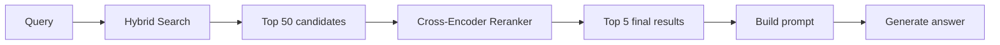
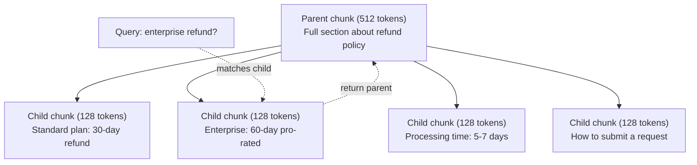
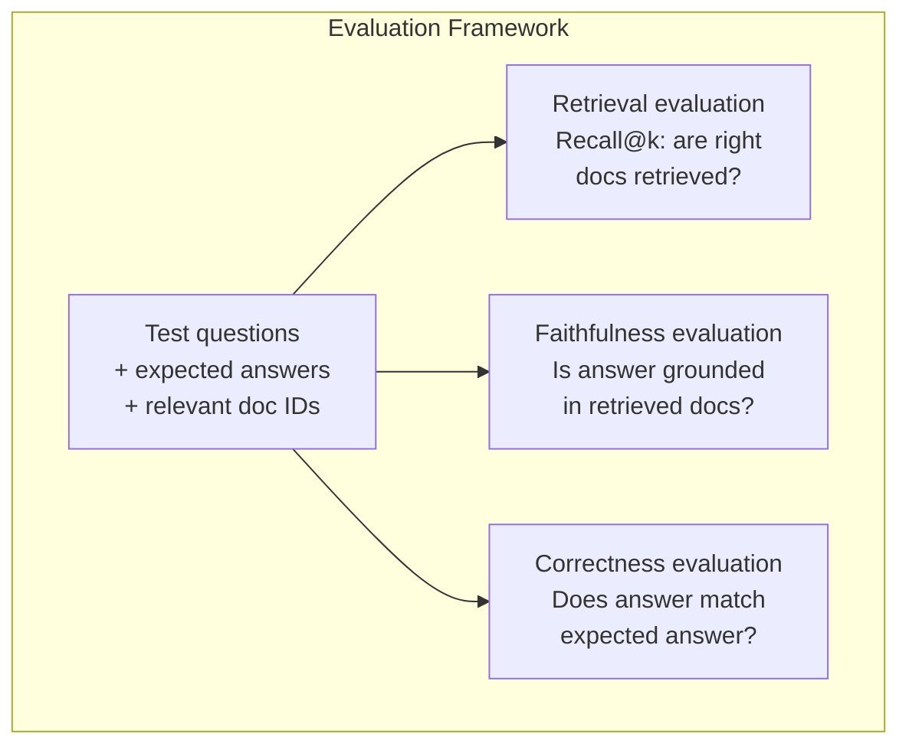

# 07 · 进阶 RAG（分块、重排序、混合检索）

> 基础 RAG 检索出最相似的 top-k 个分块。这对简单问题有效，但在多跳推理、模糊查询和大规模语料库上会彻底失效。进阶 RAG 是「在 10 篇文档上能跑通的 demo」与「在 1000 万篇文档上能工作的系统」之间的差距。

**类型：** 实战构建（Build）
**语言：** Python
**前置：** 第 11 阶段，第 06 课（RAG）
**时长：** 约 90 分钟
**相关：** 第 5 阶段 · 23（RAG 的分块策略）涵盖全部六种分块算法——递归分块、语义分块、句子分块、父文档分块、晚期分块（late chunking）、上下文检索（contextual retrieval）——并附带 Vectara/Anthropic 的基准测试。本课在此基础上构建：混合检索、重排序、查询变换。

## 学习目标

- 实现进阶分块策略（语义、递归、父子结构），保留文档结构与上下文
- 构建一条混合检索流水线，结合 BM25 关键词匹配、语义向量检索和交叉编码器（cross-encoder）重排序器
- 应用查询变换技术（HyDE、多查询、退一步提问），改善模糊或复杂问题的检索效果
- 诊断并修复常见的 RAG 失效：检索到错误分块、答案不在上下文中、多跳推理崩溃

## 问题所在

你在第 06 课中构建了一条基础 RAG 流水线。它在小语料库的直白问题上有效。现在试试这些：

**模糊查询**："上个季度的营收是多少？" 语义检索返回的是关于营收策略、营收预测，以及 CFO 对营收增长看法的分块。它们都与"营收"一词语义相近，却没有一个包含实际数字。正确的分块写的是 "$47.2M in Q3 2025"，但用的词是 "earnings"（盈利）而不是 "revenue"（营收）。嵌入模型认为 "revenue strategy" 比 "Q3 earnings were $47.2M" 更接近查询。

**多跳问题**："哪个团队的客户满意度评分提升最大？" 这需要先找到每个团队的满意度评分，再加以比较，并找出最大值。没有任何单个分块包含答案，信息散落在各个团队报告中。

**大规模语料库问题**：你有 200 万个分块。正确答案在第 1,847,293 号分块里。你的 top-5 检索拉回来的是第 14、89,201、1,200,000、44 和 901,333 号分块。它们在嵌入空间中很接近，但没有一个包含答案。在这种规模下，近似最近邻（approximate nearest neighbor）搜索引入的误差足以把相关结果挤出 top-k。

基础 RAG 之所以失败，是因为向量相似不等于相关。一个分块可以在语义上与查询相似，却对回答问题毫无用处。进阶 RAG 用四种技术来解决这个问题：混合检索（加入关键词匹配）、重排序（更细致地为候选打分）、查询变换（在检索前修正查询），以及更好的分块（在合适的粒度上检索）。

## 核心概念

### 混合检索：语义 + 关键词

语义检索（向量相似度）擅长理解含义。"How do I cancel my subscription?" 能匹配到 "Steps to terminate your plan"，即便两者没有任何共同词。但它会漏掉精确匹配。"Error code E-4021" 可能匹配不到一个包含 "E-4021" 的分块，因为嵌入模型可能把它当作噪声处理。

关键词检索（BM25）则恰恰相反。它擅长精确匹配。"E-4021" 能完美匹配。但如果文档里写的是 "terminate your plan"，"cancel my subscription" 会返回零结果。

混合检索同时跑两者，然后合并结果。

**BM25**（Best Matching 25）是标准的关键词检索算法。自 1990 年代以来它一直是搜索引擎的支柱。公式如下：

```
BM25(q, d) = sum over terms t in q:
    IDF(t) * (tf(t,d) * (k1 + 1)) / (tf(t,d) + k1 * (1 - b + b * |d| / avgdl))
```

其中 tf(t,d) 是词项 t 在文档 d 中的词频，IDF(t) 是逆文档频率，|d| 是文档长度，avgdl 是平均文档长度，k1 控制词频饱和（默认 1.2），b 控制长度归一化（默认 0.75）。

用大白话说：BM25 在文档包含查询词项（尤其是稀有词项）时给更高的分，但对重复出现的词项收益递减。一篇出现 50 次 "revenue" 的文档，并不比出现 1 次的文档相关 50 倍。

### 倒数排名融合（RRF）

你有两个排好序的列表：一个来自向量检索，一个来自 BM25。如何合并它们？倒数排名融合（Reciprocal Rank Fusion，RRF）是标准做法。

```
RRF_score(d) = sum over rankings R:
    1 / (k + rank_R(d))
```

其中 k 是一个常数（通常取 60），用来防止排名最高的结果过度主导。

一篇在向量检索中排第 1、在 BM25 中排第 5 的文档得分为：1/(60+1) + 1/(60+5) = 0.0164 + 0.0154 = 0.0318

一篇在向量检索中排第 3、在 BM25 中排第 2 的文档得分为：1/(60+3) + 1/(60+2) = 0.0159 + 0.0161 = 0.0320

RRF 天然地平衡了两路信号。在两个列表中都排名靠前的文档得到最高分。在一个列表中排第 1 但在另一个列表中缺席的文档则得到中等分数。这种方法之所以稳健，是因为它使用的是排名而非原始分数，所以两个系统之间分数分布的差异无关紧要。

### 重排序

检索（无论是向量、关键词还是混合）速度快但不够精确。它使用双编码器（bi-encoder）：查询和每篇文档各自独立地被嵌入，然后再比较。这些嵌入只需计算一次并缓存下来，因而可以扩展到数百万篇文档。

重排序使用交叉编码器（cross-encoder）：查询和一篇候选文档被一起送入模型，模型输出一个相关性分数。模型同时看到两段文本，能够捕捉它们之间细粒度的交互。交叉编码器能够理解 "What were Q3 earnings?" 与一个包含 "$47.2M in Q3" 的分块高度相关，即便双编码器漏掉了这种关联。

代价在于：交叉编码器比双编码器慢 100-1000 倍，因为它要联合处理查询-文档对。你无法为一百万篇文档预先计算交叉编码器分数。解决方案是：先检索出一个更大的候选集（来自混合检索的 top-50），再用交叉编码器重排序，得到最终的 top-5。



常用的重排序模型（2026 年阵容）：
- Cohere Rerank 3.5：托管 API，多语言，在混合语料库上召回提升最佳
- Voyage rerank-2.5：托管 API，在托管选项中延迟最低
- Jina-Reranker-v2 Multilingual：开放权重，支持 100 多种语言
- bge-reranker-v2-m3：开放权重，强力基线
- cross-encoder/ms-marco-MiniLM-L-6-v2：开放权重，可在 CPU 上运行，适合做原型
- ColBERTv2 / Jina-ColBERT-v2：晚期交互（late-interaction）多向量重排序器——打分时复杂度为 O(tokens) 而非 O(docs)

### 查询变换

有时问题不在于检索，而在于查询本身。"What was that thing about the new policy change?" 是一个糟糕透顶的检索查询。它不含任何具体词项，嵌入很模糊。没有任何检索系统能从这种查询中找到正确的文档。

**查询改写**：把用户的查询重新表述为更好的检索查询。LLM 能做到这一点：

```
User: "What was that thing about the new policy change?"
Rewritten: "Recent policy changes and updates"
```

**HyDE（假设性文档嵌入，Hypothetical Document Embeddings）**：不用查询去检索，而是先生成一个假设性的答案，把它嵌入，然后检索与之相似的真实文档。

```
Query: "What is the refund policy for enterprise?"
Hypothetical answer: "Enterprise customers are eligible for a full refund
within 60 days of purchase. Refunds are pro-rated based on the remaining
subscription period and processed within 5-7 business days."
```

把这个假设性答案嵌入，再检索与之相似的真实文档。其直觉是：假设性答案在嵌入空间中比原始问题更靠近真实答案。问题和答案具有不同的语言结构。通过生成一个假设性答案，你在嵌入空间中弥合了"问题空间"与"答案空间"之间的鸿沟。

HyDE 在检索前增加了一次 LLM 调用，会使延迟增加 500-2000ms。当原始查询的检索质量很差时，这是值得的。

### 父子分块

标准分块迫使你做一个权衡：小分块利于精确检索，大分块利于提供充足上下文。父子分块（parent-child chunking）消除了这一权衡。

为检索而索引小分块（128 tokens）。当某个小分块被检索到时，返回它的父分块（512 tokens）用于构建提示。小分块精确匹配查询，父分块则为 LLM 生成好答案提供了足够的上下文。



查询 "enterprise refund?" 精确匹配子分块 C2。但提示接收到的是完整的父分块 P，其中包含了关于处理时间和提交流程的周边上下文。

### 元数据过滤

在运行向量检索之前，先按元数据过滤语料库：日期、来源、类别、作者、语言。这能缩小搜索空间，避免无关结果。

"上个月安全策略有什么变化？" 应该只检索过去 30 天内、安全类别下的文档。如果没有元数据过滤，你会检索整个语料库，可能拉回一篇两年前、恰好语义相似的安全文档。

生产级 RAG 系统会在每个分块旁存储元数据：来源文档、创建日期、类别、作者、版本。向量数据库支持在相似度检索之前先按元数据进行预过滤（pre-filtering），这对于大规模场景下的性能至关重要。

### 评估

你构建了一个 RAG 系统。怎么知道它有没有用？三个指标：

**检索相关性（Recall@k）**：对于一组已知相关文档的测试问题，有多少比例的相关文档出现在 top-k 结果中？如果某个问题的答案在第 47 号分块里，第 47 号分块是否出现在 top-5 中？

**忠实度（Faithfulness）**：生成的答案是否扎根于检索到的文档？如果检索到的分块说 "60-day refund window"，而模型说 "90-day refund window"，那就是忠实度失败。模型在拥有正确上下文的情况下仍然产生了幻觉。

**答案正确性（Answer correctness）**：生成的答案是否与预期答案一致？这是端到端指标，它综合了检索质量与生成质量。

一个简单的忠实度检查：取生成答案中的每一条主张，核实它（在实质上）出现在检索到的分块中。如果答案包含一个不在任何检索分块中的事实，那它很可能是幻觉。



## 动手构建

### 第 1 步：BM25 实现

```python
import math
from collections import Counter

class BM25:
    def __init__(self, k1=1.2, b=0.75):
        self.k1 = k1
        self.b = b
        self.docs = []
        self.doc_lengths = []
        self.avg_dl = 0
        self.doc_freqs = {}
        self.n_docs = 0

    def index(self, documents):
        self.docs = documents
        self.n_docs = len(documents)
        self.doc_lengths = []
        self.doc_freqs = {}

        for doc in documents:
            words = doc.lower().split()
            self.doc_lengths.append(len(words))
            unique_words = set(words)
            for word in unique_words:
                self.doc_freqs[word] = self.doc_freqs.get(word, 0) + 1

        self.avg_dl = sum(self.doc_lengths) / self.n_docs if self.n_docs else 1

    def score(self, query, doc_idx):
        query_words = query.lower().split()
        doc_words = self.docs[doc_idx].lower().split()
        doc_len = self.doc_lengths[doc_idx]
        word_counts = Counter(doc_words)
        score = 0.0

        for term in query_words:
            if term not in word_counts:
                continue
            tf = word_counts[term]
            df = self.doc_freqs.get(term, 0)
            idf = math.log((self.n_docs - df + 0.5) / (df + 0.5) + 1)
            numerator = tf * (self.k1 + 1)
            denominator = tf + self.k1 * (1 - self.b + self.b * doc_len / self.avg_dl)
            score += idf * numerator / denominator

        return score

    def search(self, query, top_k=10):
        scores = [(i, self.score(query, i)) for i in range(self.n_docs)]
        scores.sort(key=lambda x: x[1], reverse=True)
        return scores[:top_k]
```

### 第 2 步：倒数排名融合

```python
def reciprocal_rank_fusion(ranked_lists, k=60):
    scores = {}
    for ranked_list in ranked_lists:
        for rank, (doc_id, _) in enumerate(ranked_list):
            if doc_id not in scores:
                scores[doc_id] = 0.0
            scores[doc_id] += 1.0 / (k + rank + 1)
    fused = sorted(scores.items(), key=lambda x: x[1], reverse=True)
    return fused
```

### 第 3 步：混合检索流水线

```python
def hybrid_search(query, chunks, vector_embeddings, vocab, idf, bm25_index, top_k=5, fusion_k=60):
    query_emb = tfidf_embed(query, vocab, idf)
    vector_results = search(query_emb, vector_embeddings, top_k=top_k * 3)
    bm25_results = bm25_index.search(query, top_k=top_k * 3)
    fused = reciprocal_rank_fusion([vector_results, bm25_results], k=fusion_k)
    return fused[:top_k]
```

### 第 4 步：简易重排序器

在生产环境中，你会使用一个交叉编码器模型。这里我们构建一个重排序器，它通过词重叠、词项重要性和短语匹配来为查询-文档相关性打分。

```python
def rerank(query, candidates, chunks):
    query_words = set(query.lower().split())
    stop_words = {"the", "a", "an", "is", "are", "was", "were", "what", "how",
                  "why", "when", "where", "do", "does", "for", "of", "in", "to",
                  "and", "or", "on", "at", "by", "it", "its", "this", "that",
                  "with", "from", "be", "has", "have", "had", "not", "but"}
    query_terms = query_words - stop_words

    scored = []
    for doc_id, initial_score in candidates:
        chunk = chunks[doc_id].lower()
        chunk_words = set(chunk.split())

        term_overlap = len(query_terms & chunk_words)

        query_bigrams = set()
        q_list = [w for w in query.lower().split() if w not in stop_words]
        for i in range(len(q_list) - 1):
            query_bigrams.add(q_list[i] + " " + q_list[i + 1])
        bigram_matches = sum(1 for bg in query_bigrams if bg in chunk)

        position_boost = 0
        for term in query_terms:
            pos = chunk.find(term)
            if pos != -1 and pos < len(chunk) // 3:
                position_boost += 0.5

        rerank_score = (
            term_overlap * 1.0
            + bigram_matches * 2.0
            + position_boost
            + initial_score * 5.0
        )
        scored.append((doc_id, rerank_score))

    scored.sort(key=lambda x: x[1], reverse=True)
    return scored
```

### 第 5 步：HyDE（假设性文档嵌入）

```python
def hyde_generate_hypothesis(query):
    templates = {
        "what": "The answer to '{query}' is as follows: Based on our documentation, {topic} involves specific policies and procedures that define how the process works.",
        "how": "To address '{query}': The process involves several steps. First, you need to initiate the request. Then, the system processes it according to the defined rules.",
        "default": "Regarding '{query}': Our records indicate specific details and policies related to this topic that provide a comprehensive answer."
    }
    query_lower = query.lower()
    if query_lower.startswith("what"):
        template = templates["what"]
    elif query_lower.startswith("how"):
        template = templates["how"]
    else:
        template = templates["default"]

    topic_words = [w for w in query.lower().split()
                   if w not in {"what", "is", "the", "how", "do", "does", "a", "an",
                                "for", "of", "to", "in", "on", "at", "by", "and", "or"}]
    topic = " ".join(topic_words) if topic_words else "this topic"

    return template.format(query=query, topic=topic)


def hyde_search(query, chunks, vector_embeddings, vocab, idf, top_k=5):
    hypothesis = hyde_generate_hypothesis(query)
    hypothesis_emb = tfidf_embed(hypothesis, vocab, idf)
    results = search(hypothesis_emb, vector_embeddings, top_k)
    return results, hypothesis
```

### 第 6 步：父子分块

```python
def create_parent_child_chunks(text, parent_size=200, child_size=50):
    words = text.split()
    parents = []
    children = []
    child_to_parent = {}

    parent_idx = 0
    start = 0
    while start < len(words):
        parent_end = min(start + parent_size, len(words))
        parent_text = " ".join(words[start:parent_end])
        parents.append(parent_text)

        child_start = start
        while child_start < parent_end:
            child_end = min(child_start + child_size, parent_end)
            child_text = " ".join(words[child_start:child_end])
            child_idx = len(children)
            children.append(child_text)
            child_to_parent[child_idx] = parent_idx
            child_start += child_size

        parent_idx += 1
        start += parent_size

    return parents, children, child_to_parent
```

### 第 7 步：忠实度评估

```python
def evaluate_faithfulness(answer, retrieved_chunks):
    answer_sentences = [s.strip() for s in answer.split(".") if len(s.strip()) > 10]
    if not answer_sentences:
        return 1.0, []

    grounded = 0
    ungrounded = []
    context = " ".join(retrieved_chunks).lower()

    for sentence in answer_sentences:
        words = set(sentence.lower().split())
        stop_words = {"the", "a", "an", "is", "are", "was", "were", "and", "or",
                      "to", "of", "in", "for", "on", "at", "by", "it", "this", "that"}
        content_words = words - stop_words
        if not content_words:
            grounded += 1
            continue

        matched = sum(1 for w in content_words if w in context)
        ratio = matched / len(content_words) if content_words else 0

        if ratio >= 0.5:
            grounded += 1
        else:
            ungrounded.append(sentence)

    score = grounded / len(answer_sentences) if answer_sentences else 1.0
    return score, ungrounded


def evaluate_retrieval_recall(queries_with_relevant, retrieval_fn, k=5):
    total_recall = 0.0
    results = []

    for query, relevant_indices in queries_with_relevant:
        retrieved = retrieval_fn(query, k)
        retrieved_indices = set(idx for idx, _ in retrieved)
        relevant_set = set(relevant_indices)
        hits = len(retrieved_indices & relevant_set)
        recall = hits / len(relevant_set) if relevant_set else 1.0
        total_recall += recall
        results.append({
            "query": query,
            "recall": recall,
            "hits": hits,
            "total_relevant": len(relevant_set)
        })

    avg_recall = total_recall / len(queries_with_relevant) if queries_with_relevant else 0
    return avg_recall, results
```

## 投入使用

使用真实的交叉编码器做重排序：

```python
from sentence_transformers import CrossEncoder

reranker = CrossEncoder("cross-encoder/ms-marco-MiniLM-L-6-v2")

def rerank_with_cross_encoder(query, candidates, chunks, top_k=5):
    pairs = [(query, chunks[doc_id]) for doc_id, _ in candidates]
    scores = reranker.predict(pairs)
    scored = list(zip([doc_id for doc_id, _ in candidates], scores))
    scored.sort(key=lambda x: x[1], reverse=True)
    return scored[:top_k]
```

使用 Cohere 的托管重排序器：

```python
import cohere

co = cohere.Client()

def rerank_with_cohere(query, candidates, chunks, top_k=5):
    docs = [chunks[doc_id] for doc_id, _ in candidates]
    response = co.rerank(
        model="rerank-english-v3.0",
        query=query,
        documents=docs,
        top_n=top_k
    )
    return [(candidates[r.index][0], r.relevance_score) for r in response.results]
```

使用真实 LLM 做 HyDE：

```python
import anthropic

client = anthropic.Anthropic()

def hyde_with_llm(query):
    response = client.messages.create(
        model="claude-sonnet-4-20250514",
        max_tokens=256,
        messages=[{
            "role": "user",
            "content": f"Write a short paragraph that would be a good answer to this question. Do not say you don't know. Just write what the answer would look like.\n\nQuestion: {query}"
        }]
    )
    return response.content[0].text
```

使用 Weaviate 做生产级混合检索：

```python
import weaviate

client = weaviate.connect_to_local()

collection = client.collections.get("Documents")
response = collection.query.hybrid(
    query="enterprise refund policy",
    alpha=0.5,
    limit=10
)
```

alpha 参数控制平衡：0.0 = 纯关键词（BM25），1.0 = 纯向量，0.5 = 等权重。大多数生产系统使用 0.3 到 0.7 之间的 alpha。

## 交付成果

本课产出：
- `outputs/prompt-advanced-rag-debugger.md` —— 一个用于诊断和修复 RAG 质量问题的提示
- `outputs/skill-advanced-rag.md` —— 一个用于构建生产级 RAG（含混合检索与重排序）的技能

## 练习

1. 在示例文档上比较 BM25、向量检索和混合检索。对于 5 个测试查询中的每一个，记录哪种方法在第 1 位返回了最相关的分块。混合检索应至少在 5 个中赢得 3 个。

2. 实现一个元数据过滤器。为每篇文档添加一个 "category" 字段（security、billing、api、product）。在运行向量检索之前，把分块过滤为只剩相关类别。用 "What encryption is used?" 测试，并验证它只检索 security 类别的分块。

3. 用第 06 课的简易生成函数构建一条完整的 HyDE 流水线。在全部 5 个测试查询上，比较直接查询检索与 HyDE 检索的检索质量（top-3 相关性）。HyDE 应当能改善模糊查询的结果。

4. 在示例文档上实现父子分块策略。使用 child_size=30、parent_size=100。用子分块检索，但在提示中返回父分块。把生成的答案与 chunk_size=50 的标准分块作比较。

5. 创建一个评估数据集：10 个问题，附带已知的答案分块。为以下四种方式测量 Recall@3、Recall@5 和 Recall@10：(a) 仅向量检索，(b) 仅 BM25，(c) 混合检索，(d) 混合 + 重排序。绘制结果，找出重排序在哪里帮助最大。

## 关键术语

| 术语 | 人们怎么说 | 实际含义 |
|------|----------------|----------------------|
| BM25 | "关键词检索" | 一种概率排名算法，依据词频、逆文档频率和文档长度归一化为文档打分 |
| 混合检索（Hybrid search） | "两全其美" | 并行运行语义（向量）和关键词（BM25）检索，然后用排名融合合并结果 |
| 倒数排名融合（Reciprocal Rank Fusion） | "合并排名列表" | 将多个排名列表合并，对每篇文档在所有列表中求和 1/(k + rank) |
| 重排序（Reranking） | "二次打分" | 使用更昂贵的交叉编码器模型，对初次检索得到的候选集重新打分 |
| 交叉编码器（Cross-encoder） | "查询-文档联合模型" | 把查询和文档作为单一输入、输出相关性分数的模型；比双编码器更准确，但对全语料库检索来说太慢 |
| 双编码器（Bi-encoder） | "独立嵌入模型" | 独立地嵌入查询和文档的模型；因嵌入可预先计算而速度快，但不如交叉编码器准确 |
| HyDE | "用假答案去检索" | 为查询生成一个假设性答案，嵌入它，再检索与之相似的真实文档 |
| 父子分块（Parent-child chunking） | "小块检索，大块上下文" | 索引小分块以精确检索，但返回更大的父分块以提供充足上下文 |
| 元数据过滤（Metadata filtering） | "检索前先收窄" | 在运行向量检索前，按属性（日期、来源、类别）过滤文档以缩小搜索空间 |
| 忠实度（Faithfulness） | "有没有守住根据" | 生成的答案是否得到检索文档的支持，而非从模型训练数据中产生的幻觉 |

## 延伸阅读

- Robertson & Zaragoza, "The Probabilistic Relevance Framework: BM25 and Beyond" (2009) —— BM25 的权威参考，阐释公式背后的概率论基础
- Cormack et al., "Reciprocal Rank Fusion Outperforms Condorcet and Individual Rank Learning Methods" (2009) —— RRF 的原始论文，证明它优于更复杂的融合方法
- Gao et al., "Precise Zero-Shot Dense Retrieval without Relevance Labels" (2022) —— HyDE 论文，证明假设性文档嵌入能在无任何训练数据的情况下改善检索
- Nogueira & Cho, "Passage Re-ranking with BERT" (2019) —— 表明在 BM25 之上做交叉编码器重排序能显著提升检索质量
- [Khattab et al., "DSPy: Compiling Declarative Language Model Calls into Self-Improving Pipelines" (2023)](https://arxiv.org/abs/2310.03714) —— 把提示构造与权重选择当作对检索流水线的优化问题来处理；读它是为了"对 LLM 编程"而非"对 LLM 写提示"。
- [Edge et al., "From Local to Global: A Graph RAG Approach to Query-Focused Summarization" (Microsoft Research 2024)](https://arxiv.org/abs/2404.16130) —— GraphRAG 论文：实体-关系抽取 + Leiden 社区发现，用于以查询为中心的摘要；区分了全局检索与局部检索。
- [Asai et al., "Self-RAG: Learning to Retrieve, Generate, and Critique through Self-Reflection" (ICLR 2024)](https://arxiv.org/abs/2310.11511) —— 带反思 token 的自评估 RAG；超越静态"先检索后生成"的智能体前沿。
- [LangChain Query Construction 博客](https://blog.langchain.dev/query-construction/) —— 如何把自然语言查询翻译成结构化数据库查询（Text-to-SQL、Cypher），作为检索前的一步。
