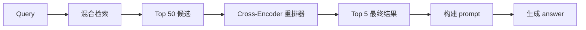
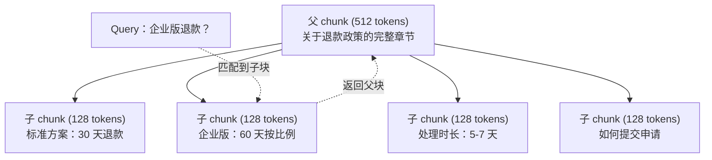
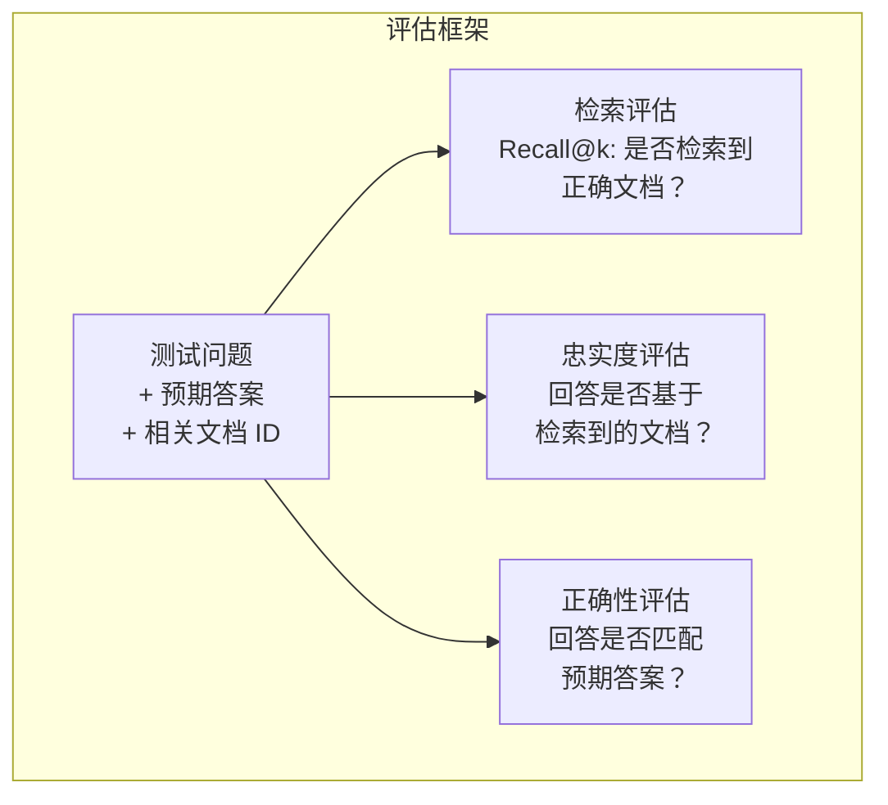

# 进阶 RAG（chunking、重排、混合检索）

> 译注：本文译自同目录 [`en.md`](./en.md)。术语遵循仓根 [TRANSLATION_GUIDE.md](../../../../TRANSLATION_GUIDE.md)。

> 基础 RAG 只检索 top-k 个最相似的 chunk。对简单问题够用，但碰到多跳推理、模糊查询、超大语料库就崩了。进阶 RAG 决定了你做的是一个「在 10 篇文档上跑通的 demo」还是「在 1000 万篇文档上能用的系统」。

**Type:** Build
**Languages:** Python
**Prerequisites:** Phase 11, Lesson 06 (RAG)
**Time:** ~90 minutes
**Related:** Phase 5 · 23（Chunking Strategies for RAG）覆盖了全部六种 chunking 算法 —— recursive、semantic、sentence、parent-document、late chunking、contextual retrieval —— 并附带 Vectara/Anthropic 的基准结果。本课在它之上继续展开：混合检索、重排、查询变换。

## 学习目标（Learning Objectives）

- 实现进阶 chunking 策略（semantic、recursive、parent-child），保留文档结构和上下文
- 搭一条混合检索流水线：BM25 关键词匹配 + 语义向量检索 + cross-encoder reranker
- 用查询变换技巧（HyDE、multi-query、step-back）提升模糊或复杂问题的检索质量
- 诊断并修复常见 RAG 故障：检到错的 chunk、答案不在上下文里、多跳推理崩盘

## 问题（Problem）

你在第 06 课搭了基础 RAG 流水线，对小语料的简单问题表现不错。现在试试这些：

**模糊查询**："上季度的 revenue 是多少？" 语义检索会返回讲 revenue 战略、revenue 预测、CFO 对 revenue 增长看法的一堆 chunk。它们都和 "revenue" 这个词语义相近，但没一个包含真正的数字。正确答案的那段写的是 "$47.2M in Q3 2025"，但用的是 "earnings" 而不是 "revenue"。embedding 模型会觉得 "revenue strategy" 比 "Q3 earnings were $47.2M" 更接近这个查询。

**多跳问题**："哪个团队的客户满意度提升幅度最大？" 这要求先找出每个团队的满意度分数，再比较，最后挑出最大值。没有任何单个 chunk 包含答案，信息散落在各团队的报告里。

**大语料问题**：你有 200 万个 chunk，正确答案在第 1,847,293 个 chunk 里。你的 top-5 检索拉回了 #14、#89,201、#1,200,000、#44、#901,333。在 embedding 空间里离查询很近，但都没包含答案。在这个量级上，approximate nearest neighbor 检索带来的误差足以把相关结果挤出 top-k。

基础 RAG 失败，是因为向量相似不等于相关。一个 chunk 可以语义上很像查询，但对回答问题没用。进阶 RAG 用四招回应：混合检索（加上关键词匹配）、重排（更仔细地给候选打分）、查询变换（在搜之前先改查询）、更好的 chunking（按合适的粒度去检索）。

## 概念（Concept）

### 混合检索：语义 + 关键词（Hybrid Search: Semantic + Keyword）

语义检索（向量相似度）擅长理解含义。"How do I cancel my subscription?" 能匹配到 "Steps to terminate your plan"，哪怕没共享一个词。但它会漏掉精确匹配。"Error code E-4021" 可能匹配不上含 "E-4021" 的 chunk，因为 embedding 模型把它当噪声了。

关键词检索（BM25）正相反，精确匹配是它的强项。"E-4021" 完美命中。但 "cancel my subscription" 在写着 "terminate your plan" 的文档上会返回零结果。

混合检索两边都跑，再合并结果。

**BM25**（Best Matching 25）是关键词检索的标准算法，从 1990 年代起就是搜索引擎的主梁。公式如下：

```
BM25(q, d) = sum over terms t in q:
    IDF(t) * (tf(t,d) * (k1 + 1)) / (tf(t,d) + k1 * (1 - b + b * |d| / avgdl))
```

其中 tf(t,d) 是 t 在文档 d 中的词频，IDF(t) 是逆文档频率，|d| 是文档长度，avgdl 是文档平均长度，k1 控制词频饱和（默认 1.2），b 控制长度归一化（默认 0.75）。

通俗讲：BM25 给包含查询词（尤其是稀有词）的文档打更高分，但对重复出现的词收益递减。一篇出现 50 次 "revenue" 的文档，相关性并不是只出现 1 次的 50 倍。

### Reciprocal Rank Fusion (RRF)

你有两份排好序的列表：一份来自向量检索，一份来自 BM25。怎么合？Reciprocal Rank Fusion 是标准做法。

```
RRF_score(d) = sum over rankings R:
    1 / (k + rank_R(d))
```

其中 k 是常数（通常取 60），用来防止排第一的结果一家独大。

向量检索排第 1、BM25 排第 5 的文档：1/(60+1) + 1/(60+5) = 0.0164 + 0.0154 = 0.0318

向量检索排第 3、BM25 排第 2 的文档：1/(60+3) + 1/(60+2) = 0.0159 + 0.0161 = 0.0320

RRF 自然地平衡两个信号。在两份列表里都靠前的文档拿到最高分；只在一份列表里第 1、另一份缺席的文档拿到中等分。它的鲁棒性来自只看排名、不看原始分数，所以两套系统打分分布的差异完全不影响。

### 重排（Reranking）

检索（无论向量、关键词还是混合）快但不精。它用的是 bi-encoder：query 和每篇文档分别 embed，再做对比。embedding 一次算好缓存住，能扩展到上百万文档。

重排用的是 cross-encoder：query 和某个候选文档一起喂进模型，输出一个相关性分数。模型同时看到两段文本，能捕捉它们之间的细粒度交互。一个 cross-encoder 能理解 "What were Q3 earnings?" 与含 "$47.2M in Q3" 的 chunk 高度相关，哪怕 bi-encoder 漏掉这个联系。

代价是：cross-encoder 比 bi-encoder 慢 100~1000 倍，因为它把 query-文档对联合处理。你没法对一百万文档预先算好 cross-encoder 分数。解决办法：先检索一个更大的候选集（混合检索拿 top-50），再用 cross-encoder 重排得到最终 top-5。



常见的重排模型（2026 年阵容）：
- Cohere Rerank 3.5：托管 API，多语言，混合语料上召回提升最佳
- Voyage rerank-2.5：托管 API，托管选项里延迟最低
- Jina-Reranker-v2 Multilingual：开权重，支持 100+ 语言
- bge-reranker-v2-m3：开权重，扎实基线
- cross-encoder/ms-marco-MiniLM-L-6-v2：开权重，CPU 也能跑，适合原型
- ColBERTv2 / Jina-ColBERT-v2：late-interaction 多向量 reranker —— 评分时复杂度是 O(tokens) 而非 O(docs)

### 查询变换（Query Transformation）

有时候问题不在检索，而在查询本身。"What was that thing about the new policy change?" 是个糟糕的检索 query，没有任何具体词，embedding 模糊不清，没有任何检索系统能从这种 query 里找到正确文档。

**查询改写**（Query rewriting）：把用户的 query 重写成更好的检索 query。一个 LLM 就能干：

```
User: "What was that thing about the new policy change?"
Rewritten: "Recent policy changes and updates"
```

**HyDE**（Hypothetical Document Embeddings）：不用原 query 去搜，而是先生成一段假设性答案，对它做 embed，然后去找与之相似的真实文档。

```
Query: "What is the refund policy for enterprise?"
Hypothetical answer: "Enterprise customers are eligible for a full refund
within 60 days of purchase. Refunds are pro-rated based on the remaining
subscription period and processed within 5-7 business days."
```

把这段假设答案 embed 后去搜与之相似的真实文档。直觉是：在 embedding 空间里，假设答案离真实答案比原始问题更近。问题和答案的语言结构不同，生成假设答案就是在 embedding 中架起 "问题空间" 与 "答案空间" 之间的桥。

HyDE 在检索前多一次 LLM 调用，会增加 500~2000ms 延迟。当原始 query 检索质量很差时，值得。

### Parent-Child Chunking

标准 chunking 会逼你二选一：小 chunk 检索精准，大 chunk 上下文充足。Parent-child chunking 把这个二选一干掉了。

按小 chunk（128 token）建索引检索。当某个小 chunk 命中，就把它的父 chunk（512 token）放进 prompt。小 chunk 精确匹配 query，父 chunk 给 LLM 提供足够上下文写出好答案。



查询 "enterprise refund?" 精确命中子 chunk C2，但 prompt 里收到的是完整父 chunk P，包括处理时间、提交流程这些周边上下文。

### 元数据过滤（Metadata Filtering）

跑向量检索之前，先按元数据过滤语料：日期、来源、分类、作者、语言。这缩小了搜索空间，避免无关结果。

"上个月安全策略改了什么？" 应该只搜过去 30 天、安全分类下的文档。没有元数据过滤的话，你会在整个语料里搜，可能拉回一篇两年前的安全文档，只因它语义相近。

生产 RAG 系统会把元数据和每个 chunk 一起存：来源文档、创建日期、分类、作者、版本号。向量数据库支持在相似度检索之前按元数据预过滤，这对大规模性能至关重要。

### 评估（Evaluation）

你搭了一套 RAG 系统。怎么知道它行不行？三个指标：

**检索相关性（Recall@k）**：对一组带已知相关文档的测试问题，top-k 结果里有多少比例的相关文档？如果某个问题的答案在 chunk #47，那 chunk #47 是否出现在 top-5 里？

**忠实度（Faithfulness）**：生成的答案是否扎根在检索到的文档里？如果检索到的 chunk 写 "60 天退款窗口"，模型却说 "90 天退款窗口"，那就是忠实度故障 —— 即使有正确上下文，模型还是 hallucination（幻觉）了。

**答案正确性（Answer correctness）**：生成的答案是否与期望答案吻合？这是端到端指标，把检索质量和生成质量都包进去。

一个简单的忠实度检查：把生成答案里的每条事实拿出来，验证它（在实质上）出现在了某个检索到的 chunk 里。如果某条事实在所有检索 chunk 里都找不到，那它八成是幻觉。



## 动手实现（Build It）

### Step 1: BM25 Implementation

```python
import math
from collections import Counter

class BM25:
    def __init__(self, k1=1.2, b=0.75):
        self.k1 = k1
        self.b = b
        self.docs = []
        self.doc_lengths = []
        self.avg_dl = 0
        self.doc_freqs = {}
        self.n_docs = 0

    def index(self, documents):
        self.docs = documents
        self.n_docs = len(documents)
        self.doc_lengths = []
        self.doc_freqs = {}

        for doc in documents:
            words = doc.lower().split()
            self.doc_lengths.append(len(words))
            unique_words = set(words)
            for word in unique_words:
                self.doc_freqs[word] = self.doc_freqs.get(word, 0) + 1

        self.avg_dl = sum(self.doc_lengths) / self.n_docs if self.n_docs else 1

    def score(self, query, doc_idx):
        query_words = query.lower().split()
        doc_words = self.docs[doc_idx].lower().split()
        doc_len = self.doc_lengths[doc_idx]
        word_counts = Counter(doc_words)
        score = 0.0

        for term in query_words:
            if term not in word_counts:
                continue
            tf = word_counts[term]
            df = self.doc_freqs.get(term, 0)
            idf = math.log((self.n_docs - df + 0.5) / (df + 0.5) + 1)
            numerator = tf * (self.k1 + 1)
            denominator = tf + self.k1 * (1 - self.b + self.b * doc_len / self.avg_dl)
            score += idf * numerator / denominator

        return score

    def search(self, query, top_k=10):
        scores = [(i, self.score(query, i)) for i in range(self.n_docs)]
        scores.sort(key=lambda x: x[1], reverse=True)
        return scores[:top_k]
```

### Step 2: Reciprocal Rank Fusion

```python
def reciprocal_rank_fusion(ranked_lists, k=60):
    scores = {}
    for ranked_list in ranked_lists:
        for rank, (doc_id, _) in enumerate(ranked_list):
            if doc_id not in scores:
                scores[doc_id] = 0.0
            scores[doc_id] += 1.0 / (k + rank + 1)
    fused = sorted(scores.items(), key=lambda x: x[1], reverse=True)
    return fused
```

### Step 3: Hybrid Search Pipeline

```python
def hybrid_search(query, chunks, vector_embeddings, vocab, idf, bm25_index, top_k=5, fusion_k=60):
    query_emb = tfidf_embed(query, vocab, idf)
    vector_results = search(query_emb, vector_embeddings, top_k=top_k * 3)
    bm25_results = bm25_index.search(query, top_k=top_k * 3)
    fused = reciprocal_rank_fusion([vector_results, bm25_results], k=fusion_k)
    return fused[:top_k]
```

### Step 4: Simple Reranker

生产环境里你会用 cross-encoder 模型。这里我们写个简易 reranker，用词重叠、词项重要性、短语匹配来给 query-文档相关性打分。

```python
def rerank(query, candidates, chunks):
    query_words = set(query.lower().split())
    stop_words = {"the", "a", "an", "is", "are", "was", "were", "what", "how",
                  "why", "when", "where", "do", "does", "for", "of", "in", "to",
                  "and", "or", "on", "at", "by", "it", "its", "this", "that",
                  "with", "from", "be", "has", "have", "had", "not", "but"}
    query_terms = query_words - stop_words

    scored = []
    for doc_id, initial_score in candidates:
        chunk = chunks[doc_id].lower()
        chunk_words = set(chunk.split())

        term_overlap = len(query_terms & chunk_words)

        query_bigrams = set()
        q_list = [w for w in query.lower().split() if w not in stop_words]
        for i in range(len(q_list) - 1):
            query_bigrams.add(q_list[i] + " " + q_list[i + 1])
        bigram_matches = sum(1 for bg in query_bigrams if bg in chunk)

        position_boost = 0
        for term in query_terms:
            pos = chunk.find(term)
            if pos != -1 and pos < len(chunk) // 3:
                position_boost += 0.5

        rerank_score = (
            term_overlap * 1.0
            + bigram_matches * 2.0
            + position_boost
            + initial_score * 5.0
        )
        scored.append((doc_id, rerank_score))

    scored.sort(key=lambda x: x[1], reverse=True)
    return scored
```

### Step 5: HyDE (Hypothetical Document Embeddings)

```python
def hyde_generate_hypothesis(query):
    templates = {
        "what": "The answer to '{query}' is as follows: Based on our documentation, {topic} involves specific policies and procedures that define how the process works.",
        "how": "To address '{query}': The process involves several steps. First, you need to initiate the request. Then, the system processes it according to the defined rules.",
        "default": "Regarding '{query}': Our records indicate specific details and policies related to this topic that provide a comprehensive answer."
    }
    query_lower = query.lower()
    if query_lower.startswith("what"):
        template = templates["what"]
    elif query_lower.startswith("how"):
        template = templates["how"]
    else:
        template = templates["default"]

    topic_words = [w for w in query.lower().split()
                   if w not in {"what", "is", "the", "how", "do", "does", "a", "an",
                                "for", "of", "to", "in", "on", "at", "by", "and", "or"}]
    topic = " ".join(topic_words) if topic_words else "this topic"

    return template.format(query=query, topic=topic)


def hyde_search(query, chunks, vector_embeddings, vocab, idf, top_k=5):
    hypothesis = hyde_generate_hypothesis(query)
    hypothesis_emb = tfidf_embed(hypothesis, vocab, idf)
    results = search(hypothesis_emb, vector_embeddings, top_k)
    return results, hypothesis
```

### Step 6: Parent-Child Chunking

```python
def create_parent_child_chunks(text, parent_size=200, child_size=50):
    words = text.split()
    parents = []
    children = []
    child_to_parent = {}

    parent_idx = 0
    start = 0
    while start < len(words):
        parent_end = min(start + parent_size, len(words))
        parent_text = " ".join(words[start:parent_end])
        parents.append(parent_text)

        child_start = start
        while child_start < parent_end:
            child_end = min(child_start + child_size, parent_end)
            child_text = " ".join(words[child_start:child_end])
            child_idx = len(children)
            children.append(child_text)
            child_to_parent[child_idx] = parent_idx
            child_start += child_size

        parent_idx += 1
        start += parent_size

    return parents, children, child_to_parent
```

### Step 7: Faithfulness Evaluation

```python
def evaluate_faithfulness(answer, retrieved_chunks):
    answer_sentences = [s.strip() for s in answer.split(".") if len(s.strip()) > 10]
    if not answer_sentences:
        return 1.0, []

    grounded = 0
    ungrounded = []
    context = " ".join(retrieved_chunks).lower()

    for sentence in answer_sentences:
        words = set(sentence.lower().split())
        stop_words = {"the", "a", "an", "is", "are", "was", "were", "and", "or",
                      "to", "of", "in", "for", "on", "at", "by", "it", "this", "that"}
        content_words = words - stop_words
        if not content_words:
            grounded += 1
            continue

        matched = sum(1 for w in content_words if w in context)
        ratio = matched / len(content_words) if content_words else 0

        if ratio >= 0.5:
            grounded += 1
        else:
            ungrounded.append(sentence)

    score = grounded / len(answer_sentences) if answer_sentences else 1.0
    return score, ungrounded


def evaluate_retrieval_recall(queries_with_relevant, retrieval_fn, k=5):
    total_recall = 0.0
    results = []

    for query, relevant_indices in queries_with_relevant:
        retrieved = retrieval_fn(query, k)
        retrieved_indices = set(idx for idx, _ in retrieved)
        relevant_set = set(relevant_indices)
        hits = len(retrieved_indices & relevant_set)
        recall = hits / len(relevant_set) if relevant_set else 1.0
        total_recall += recall
        results.append({
            "query": query,
            "recall": recall,
            "hits": hits,
            "total_relevant": len(relevant_set)
        })

    avg_recall = total_recall / len(queries_with_relevant) if queries_with_relevant else 0
    return avg_recall, results
```

## 用起来（Use It）

用真正的 cross-encoder 做重排：

```python
from sentence_transformers import CrossEncoder

reranker = CrossEncoder("cross-encoder/ms-marco-MiniLM-L-6-v2")

def rerank_with_cross_encoder(query, candidates, chunks, top_k=5):
    pairs = [(query, chunks[doc_id]) for doc_id, _ in candidates]
    scores = reranker.predict(pairs)
    scored = list(zip([doc_id for doc_id, _ in candidates], scores))
    scored.sort(key=lambda x: x[1], reverse=True)
    return scored[:top_k]
```

用 Cohere 的托管 reranker：

```python
import cohere

co = cohere.Client()

def rerank_with_cohere(query, candidates, chunks, top_k=5):
    docs = [chunks[doc_id] for doc_id, _ in candidates]
    response = co.rerank(
        model="rerank-english-v3.0",
        query=query,
        documents=docs,
        top_n=top_k
    )
    return [(candidates[r.index][0], r.relevance_score) for r in response.results]
```

用真实 LLM 做 HyDE：

```python
import anthropic

client = anthropic.Anthropic()

def hyde_with_llm(query):
    response = client.messages.create(
        model="claude-sonnet-4-20250514",
        max_tokens=256,
        messages=[{
            "role": "user",
            "content": f"Write a short paragraph that would be a good answer to this question. Do not say you don't know. Just write what the answer would look like.\n\nQuestion: {query}"
        }]
    )
    return response.content[0].text
```

用 Weaviate 跑生产级混合检索：

```python
import weaviate

client = weaviate.connect_to_local()

collection = client.collections.get("Documents")
response = collection.query.hybrid(
    query="enterprise refund policy",
    alpha=0.5,
    limit=10
)
```

alpha 参数控制权重：0.0 = 纯关键词（BM25），1.0 = 纯向量，0.5 = 等权。多数生产系统的 alpha 取在 0.3 到 0.7 之间。

## 上线部署（Ship It）

本课产出：
- `outputs/prompt-advanced-rag-debugger.md` —— 用于诊断和修复 RAG 质量问题的 prompt
- `outputs/skill-advanced-rag.md` —— 用于搭建带混合检索和重排的生产级 RAG 的 skill

## 练习（Exercises）

1. 在样例文档上对比 BM25、向量检索、混合检索。对 5 个测试 query，记录每种方法返回的最相关 chunk 的位置 #1。混合检索在 5 个里至少应该赢 3 个。

2. 实现一个元数据过滤器。给每篇文档加一个 "category" 字段（security、billing、api、product）。跑向量检索之前，先按相关分类过滤 chunk。用 "What encryption is used?" 测试，验证它只搜了 security 分类的 chunk。

3. 用第 06 课里的简易生成函数搭一条完整 HyDE 流水线。在全部 5 个测试 query 上对比直接 query 检索 vs HyDE 检索的检索质量（top-3 相关性）。HyDE 在模糊 query 上应有提升。

4. 在样例文档上实现 parent-child chunking 策略。用 child_size=30、parent_size=100。检索时用子 chunk，但 prompt 里返回父 chunk。把生成的答案与 chunk_size=50 的标准 chunking 做对比。

5. 造一份评估数据集：10 个问题、附带已知答案 chunk。测量 (a) 仅向量检索、(b) 仅 BM25、(c) 混合检索、(d) 混合 + 重排，各自的 Recall@3、Recall@5、Recall@10。把结果画出来，找出重排提升最大的位置。

## 关键术语（Key Terms）

| 术语 | 大家怎么说 | 实际是什么 |
|------|----------------|----------------------|
| BM25 | "关键词检索" | 一种概率排名算法，按词频、逆文档频率、文档长度归一化给文档打分 |
| Hybrid search（混合检索） | "两全其美" | 并行跑语义（向量）与关键词（BM25）检索，再用 rank fusion 合并结果 |
| Reciprocal Rank Fusion | "合并排序列表" | 把多份排好序的列表合起来，对每个文档在所有列表里求和 1/(k + rank) |
| Reranking（重排） | "二轮打分" | 用更贵的 cross-encoder 模型，对初次检索得到的候选集重新打分 |
| Cross-encoder | "联合 query-文档模型" | 把 query 和文档作为单个输入，输出相关性分数；比 bi-encoder 准，但太慢，跑不动全语料检索 |
| Bi-encoder | "独立 embedding 模型" | 分别给 query 和文档做 embedding；因为 embedding 可预先算好，所以快，但不如 cross-encoder 准 |
| HyDE | "用假答案去搜" | 先对 query 生成一段假设答案，对它做 embedding，再去搜与之相似的真实文档 |
| Parent-child chunking | "小 chunk 检索，大 chunk 上文" | 用小 chunk 索引以求精确检索，但返回更大的父 chunk 以提供充足上下文 |
| Metadata filtering（元数据过滤） | "先窄后搜" | 跑向量检索前按属性（日期、来源、分类）过滤文档，缩小搜索空间 |
| Faithfulness（忠实度） | "有没有不跑偏" | 生成的答案是否被检索到的文档支撑，而不是从模型训练数据里 hallucination 出来 |

## 延伸阅读（Further Reading）

- Robertson & Zaragoza, "The Probabilistic Relevance Framework: BM25 and Beyond" (2009) —— BM25 的权威参考，讲清楚公式背后的概率基础
- Cormack et al., "Reciprocal Rank Fusion Outperforms Condorcet and Individual Rank Learning Methods" (2009) —— RRF 原始论文，证明它优于更复杂的融合方法
- Gao et al., "Precise Zero-Shot Dense Retrieval without Relevance Labels" (2022) —— HyDE 论文，证明 hypothetical document embeddings 可以在不依赖任何训练数据的情况下提升检索
- Nogueira & Cho, "Passage Re-ranking with BERT" (2019) —— 展示了在 BM25 之上做 cross-encoder 重排能显著提升检索质量
- [Khattab et al., "DSPy: Compiling Declarative Language Model Calls into Self-Improving Pipelines" (2023)](https://arxiv.org/abs/2310.03714) —— 把 prompt 构造和权重选择当作检索流水线上的优化问题；想从 "prompt LLM" 走向 "program LLM"，看这篇。
- [Edge et al., "From Local to Global: A Graph RAG Approach to Query-Focused Summarization" (Microsoft Research 2024)](https://arxiv.org/abs/2404.16130) —— GraphRAG 论文：实体-关系抽取 + Leiden 社区检测做面向查询的摘要；区分了全局检索 vs 局部检索。
- [Asai et al., "Self-RAG: Learning to Retrieve, Generate, and Critique through Self-Reflection" (ICLR 2024)](https://arxiv.org/abs/2310.11511) —— 带反思 token 的自评估 RAG；超越静态 retrieve-then-generate 的 agentic 前沿。
- [LangChain Query Construction blog](https://blog.langchain.dev/query-construction/) —— 把自然语言 query 翻译成结构化数据库 query（Text-to-SQL、Cypher）作为检索前置步骤。
