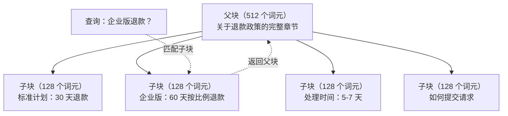
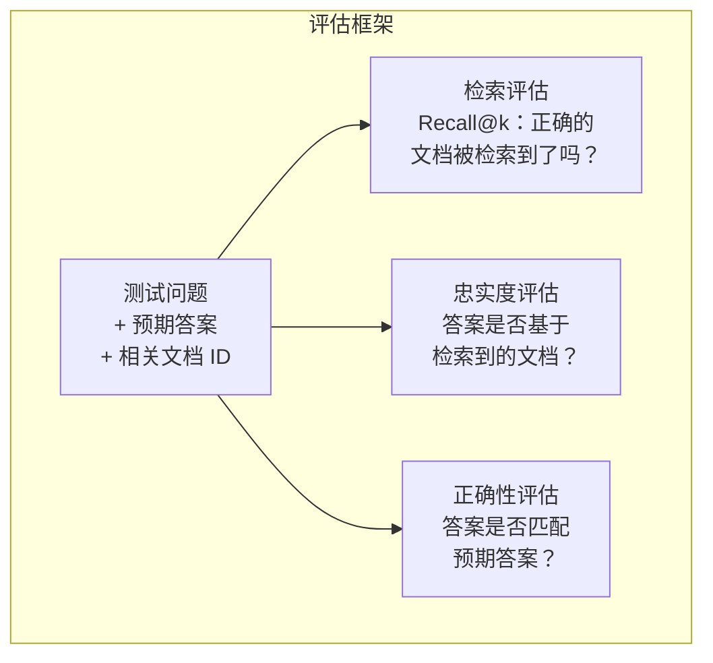

# 高级 RAG（分块、重排序、混合搜索）

> 基础 RAG 检索 top-k 最相似的文本块。这对于简单问题有效，但对于多跳推理、模糊查询和大规模语料库则力不从心。高级 RAG 是区分"能处理 10 份文档的演示"和"能处理 1000 万文档的系统"的关键。

**类型：** 构建
**语言：** Python
**前置条件：** 阶段 11，课程 06（RAG）
**时长：** 约 90 分钟
**相关：** 阶段 5·23（RAG 的分块策略）涵盖全部六种分块算法——递归式、语义式、句级、父子文档、延迟分块、上下文检索——并提供 Vectara/Anthropic 基准测试。本课程在此基础上延伸：混合搜索、重排序、查询转换。

## 学习目标

- 实现高级分块策略（语义式、递归式、父子式），保留文档结构和上下文
- 构建结合 BM25 关键词匹配与语义向量搜索及交叉编码器重排序的混合搜索流水线
- 应用查询转换技术（HyDE、多查询、后退提问）来改善模糊或复杂问题上的检索效果
- 诊断并修复常见 RAG 故障：检索到错误块、答案不在上下文中、多跳推理失败

## 问题

你在课程 06 中构建了一个基本的 RAG 流水线。它在小型语料库上对直截了当的问题表现良好。现在试试这些：

**模糊查询**："上一季度的收入是多少？"语义搜索返回的结果是关于收入策略、收入预测以及 CFO 对收入增长的看法。所有结果在语义上都与"收入"一词相似，但没有一条包含实际数字。正确的块写着"2025 年第三季度 4720 万美元"，但使用的是"盈利"而非"收入"一词。嵌入模型认为"收入策略"比"第三季度盈利为 4720 万美元"更接近查询。

**多跳问题**："哪个团队的客户满意度得分提升最大？"这需要先找到每个团队的满意度得分，进行比较，然后确定最大值。没有任何单个块包含答案。信息分散在各个团队的报告中。

**大规模语料库问题**：你有 200 万个块。正确答案在第 1,847,293 个块中。你的 top-5 检索返回的是第 14、89,201、1,200,000、44 和 901,333 个块。它们在嵌入空间中相近，但没有一个包含正确答案。在此规模下，近似最近邻搜索会引入足够大的误差，导致相关结果被挤出 top-k。

基础 RAG 之所以失败，是因为向量相似性不等于相关性。一个块可能在语义上与查询相似，但对回答问题并无帮助。高级 RAG 通过四种技术解决此问题：混合搜索（增加关键词匹配）、重排序（更仔细地对候选结果评分）、查询转换（在搜索前优化查询）以及更好的分块策略（以合适的粒度进行检索）。

## 概念

### 混合搜索：语义 + 关键词

语义搜索（向量相似性）擅长理解含义。"我如何取消订阅？"能够匹配"终止你的计划的步骤"，即使二者没有共享任何词语。但它会错过精确匹配。"错误代码 E-4021"可能无法匹配包含"E-4021"的块——如果嵌入模型将其当作噪声处理的话。

关键词搜索（BM25）则相反。它擅长精确匹配。"E-4021"完美匹配。但"取消我的订阅"如果文档写的是"终止你的计划"，则会返回零结果。

混合搜索同时运行两者，然后合并结果。

**BM25**（最佳匹配 25）是标准的关键词搜索算法。自 1990 年代以来，它一直是搜索引擎的支柱。公式如下：

```
BM25(q, d) = 对查询 q 中的每个词项 t 求和：
    IDF(t) * (tf(t,d) * (k1 + 1)) / (tf(t,d) + k1 * (1 - b + b * |d| / avgdl))
```

其中，tf(t,d) 是词项 t 在文档 d 中的词频，IDF(t) 是逆文档频率，|d| 是文档长度，avgdl 是平均文档长度，k1 控制词频饱和程度（默认 1.2），b 控制长度归一化（默认 0.75）。

通俗地说：BM25 对包含查询词项（尤其是稀有词项）的文档给出更高的得分，但重复词项的收益递减。一篇文档包含"收入"一词 50 次，并不意味着它的相关性是只出现一次的那篇文档的 50 倍。

### 倒数排名融合（RRF）

你有了两个排序列表：一个来自向量搜索，一个来自 BM25。如何将它们合并？倒数排名融合是标准方法。

```
RRF_score(d) = 对所有排序列表 R 求和：
    1 / (k + rank_R(d))
```

其中 k 是一个常数（通常为 60），用于防止排名第一的结果过于主导。

某文档在向量搜索中排名第 1，在 BM25 中排名第 5，得分为：1/(60+1) + 1/(60+5) = 0.0164 + 0.0154 = 0.0318

某文档在向量搜索中排名第 3，在 BM25 中排名第 2，得分为：1/(60+3) + 1/(60+2) = 0.0159 + 0.0161 = 0.0320

RRF 自然地平衡了两种信号。在两个排序列表中都排名靠前的文档获得最佳分数。在一个列表中排名第一但在另一个列表中不存在的文档获得中等分数。这种方法非常稳健，因为它使用的是排名而非原始分数，因此两个系统之间分数分布的差异无关紧要。

### 重排序

检索（无论是向量、关键词还是混合方式）速度快但不精确。它使用双编码器：查询和每篇文档被独立嵌入，然后进行比较。嵌入被一次性计算并缓存。这可以扩展到数百万篇文档。

重排序使用交叉编码器：查询和候选文档被一起送入一个模型，输出相关性分数。该模型同时看到两段文本，能够捕捉它们之间细粒度的交互。交叉编码器可以理解"第三季度的盈利是多少？"与包含"第三季度 4720 万美元"的块高度相关——即使双编码器错过了这种联系。

**权衡**：交叉编码器比双编码器慢 100-1000 倍，因为它们需要联合处理查询-文档对。你无法为上百万篇文档预先计算交叉编码器分数。解决方案：检索一个更大的候选集（混合搜索的 top-50），然后用交叉编码器重新排序，得到最终的 top-5。


```mermaid
graph LR
    Q["查询"] --> H["混合搜索"]
    H --> C50["前 50 个候选"]
    C50 --> RR["交叉编码器重排序"]
    RR --> C5["前 5 个最终结果"]
    C5 --> P["构建提示"]
    P --> LLM["生成答案"]
```

常见的重排序模型（2026 年阵容）：
- Cohere Rerank 3.5：托管 API，多语言，混合语料库上召回率提升最佳
- Voyage rerank-2.5：托管 API，托管选项中延迟最低
- Jina-Reranker-v2 Multilingual：开源权重，支持 100+ 语言
- bge-reranker-v2-m3：开源权重，强基线
- cross-encoder/ms-marco-MiniLM-L-6-v2：开源权重，可在 CPU 上用于原型设计
- ColBERTv2 / Jina-ColBERT-v2：延迟交互多向量重排序器——评分时复杂度为 O(词元数) 而非 O(文档数)

### 查询转换

有时问题不在于检索，而在于查询本身。"那个关于新政策变化的东西是什么？"是一个非常糟糕的搜索查询。它不包含任何具体词项。嵌入是模糊的。任何检索系统都无法从这个查询中找到正确的文档。

**查询重写**：将用户的查询改写成更好的搜索查询。LLM 可以做到这一点：

```
用户："那个关于新政策变化的东西是什么？"
重写后："近期政策变化与更新"
```

**HyDE（假设性文档嵌入）**：不用查询进行搜索，而是先生成一个假设性答案，将其嵌入，然后搜索与之相似的真实文档。

```
查询："企业版的退款政策是什么？"
假设性答案："企业客户在购买后 60 天内可享受全额退款。退款根据剩余订阅期按比例计算，并在 5-7 个工作日内处理。"
```

将假设性答案嵌入，然后搜索与之相似的真实文档。其直觉是：在嵌入空间中，假设性答案比原始问题更接近真实答案。问题和答案具有不同的语言结构。通过生成一个假设性答案，你弥合了嵌入空间中"问题空间"与"答案空间"之间的差距。

HyDE 在检索前增加了一次 LLM 调用。这会增加 500-2000 毫秒的延迟。在原始查询的检索质量较差时，这是值得的。

### 父子文档分块

标准分块迫使你在两者之间做出取舍：小块用于精确检索，大块用于充足的上下文。父子文档分块消除了这一取舍。

对小块（128 个词元）建立索引用于检索。当一个小块被检索到时，返回其父块（512 个词元）用于提示。小块精确匹配查询。父块为 LLM 提供足够的上下文来生成好的答案。


```mermaid
graph TD
    P["父块（512 个词元）<br/>关于退款政策的完整章节"]
    C1["子块（128 个词元）<br/>标准计划：30 天退款"]
    C2["子块（128 个词元）<br/>企业版：60 天按比例退款"]
    C3["子块（128 个词元）<br/>处理时间：5-7 天"]
    C4["子块（128 个词元）<br/>如何提交请求"]

    P --> C1
    P --> C2
    P --> C3
    P --> C4

    Q["查询：企业版退款？"] -.->|"匹配子块"| C2
    C2 -.->|"返回父块"| P
```

查询"企业版退款？"精确匹配子块 C2。但提示接收到的是完整的父块 P，其中包含关于处理时间和提交流程的周围上下文。

### 元数据过滤

在运行向量搜索之前，先通过元数据过滤语料库：日期、来源、类别、作者、语言。这减少了搜索空间并防止不相关的结果。

"上个月安全策略有什么变化？"应该只搜索安全类别中最近 30 天的文档。没有元数据过滤，你将搜索整个语料库，可能会检索到一份 2 年前的安全文档——仅仅因为它在语义上相似。

生产环境中的 RAG 系统会将元数据与每个块一起存储：来源文档、创建日期、类别、作者、版本。向量数据库支持在相似性搜索之前进行元数据预过滤，这对于大规模性能至关重要。

### 评估

你构建了一个 RAG 系统。如何判断它是否有效？三个指标：

**检索相关性（Recall@k）**：对于一组带有已知相关文档的测试问题，相关文档出现在 top-k 结果中的比例是多少？如果问题的答案在第 47 个块中，第 47 个块是否出现在 top-5 中？

**忠实度**：生成的答案是否基于检索到的文档？如果检索到的块说"60 天退款窗口"，而模型说"90 天退款窗口"，那就是忠实度失败。尽管有正确的上下文，模型还是产生了幻觉。

**答案正确性**：生成的答案是否与预期答案匹配？这是端到端的指标。它结合了检索质量和生成质量。

一个简单的忠实度检查：将生成答案中的每个主张提取出来，验证它（在实质上）是否出现在检索到的块中。如果答案包含任何不在检索块中的事实，则很可能是幻觉。


```mermaid
graph TD
    subgraph "评估框架"
        Q["测试问题<br/>+ 预期答案<br/>+ 相关文档 ID"]
        Q --> Ret["检索评估<br/>Recall@k：正确的<br/>文档被检索到了吗？"]
        Q --> Faith["忠实度评估<br/>答案是否基于<br/>检索到的文档？"]
        Q --> Correct["正确性评估<br/>答案是否匹配<br/>预期答案？"]
    end
```

## 构建

### 步骤 1：BM25 实现

```python
import math
from collections import Counter

class BM25:
    def __init__(self, k1=1.2, b=0.75):
        self.k1 = k1
        self.b = b
        self.docs = []
        self.doc_lengths = []
        self.avg_dl = 0
        self.doc_freqs = {}
        self.n_docs = 0

    def index(self, documents):
        self.docs = documents
        self.n_docs = len(documents)
        self.doc_lengths = []
        self.doc_freqs = {}

        for doc in documents:
            words = doc.lower().split()
            self.doc_lengths.append(len(words))
            unique_words = set(words)
            for word in unique_words:
                self.doc_freqs[word] = self.doc_freqs.get(word, 0) + 1

        self.avg_dl = sum(self.doc_lengths) / self.n_docs if self.n_docs else 1

    def score(self, query, doc_idx):
        query_words = query.lower().split()
        doc_words = self.docs[doc_idx].lower().split()
        doc_len = self.doc_lengths[doc_idx]
        word_counts = Counter(doc_words)
        score = 0.0

        for term in query_words:
            if term not in word_counts:
                continue
            tf = word_counts[term]
            df = self.doc_freqs.get(term, 0)
            idf = math.log((self.n_docs - df + 0.5) / (df + 0.5) + 1)
            numerator = tf * (self.k1 + 1)
            denominator = tf + self.k1 * (1 - self.b + self.b * doc_len / self.avg_dl)
            score += idf * numerator / denominator

        return score

    def search(self, query, top_k=10):
        scores = [(i, self.score(query, i)) for i in range(self.n_docs)]
        scores.sort(key=lambda x: x[1], reverse=True)
        return scores[:top_k]
```

### 步骤 2：倒数排名融合

```python
def reciprocal_rank_fusion(ranked_lists, k=60):
    scores = {}
    for ranked_list in ranked_lists:
        for rank, (doc_id, _) in enumerate(ranked_list):
            if doc_id not in scores:
                scores[doc_id] = 0.0
            scores[doc_id] += 1.0 / (k + rank + 1)
    fused = sorted(scores.items(), key=lambda x: x[1], reverse=True)
    return fused
```

### 步骤 3：混合搜索流水线

```python
def hybrid_search(query, chunks, vector_embeddings, vocab, idf, bm25_index, top_k=5, fusion_k=60):
    query_emb = tfidf_embed(query, vocab, idf)
    vector_results = search(query_emb, vector_embeddings, top_k=top_k * 3)
    bm25_results = bm25_index.search(query, top_k=top_k * 3)
    fused = reciprocal_rank_fusion([vector_results, bm25_results], k=fusion_k)
    return fused[:top_k]
```

### 步骤 4：简易重排序器

在生产环境中，你会使用交叉编码器模型。这里我们构建一个使用词重叠、词项重要性和短语匹配来评分查询-文档相关性的重排序器。

```python
def rerank(query, candidates, chunks):
    query_words = set(query.lower().split())
    stop_words = {"the", "a", "an", "is", "are", "was", "were", "what", "how",
                  "why", "when", "where", "do", "does", "for", "of", "in", "to",
                  "and", "or", "on", "at", "by", "it", "its", "this", "that",
                  "with", "from", "be", "has", "have", "had", "not", "but"}
    query_terms = query_words - stop_words

    scored = []
    for doc_id, initial_score in candidates:
        chunk = chunks[doc_id].lower()
        chunk_words = set(chunk.split())

        term_overlap = len(query_terms & chunk_words)

        query_bigrams = set()
        q_list = [w for w in query.lower().split() if w not in stop_words]
        for i in range(len(q_list) - 1):
            query_bigrams.add(q_list[i] + " " + q_list[i + 1])
        bigram_matches = sum(1 for bg in query_bigrams if bg in chunk)

        position_boost = 0
        for term in query_terms:
            pos = chunk.find(term)
            if pos != -1 and pos < len(chunk) // 3:
                position_boost += 0.5

        rerank_score = (
            term_overlap * 1.0
            + bigram_matches * 2.0
            + position_boost
            + initial_score * 5.0
        )
        scored.append((doc_id, rerank_score))

    scored.sort(key=lambda x: x[1], reverse=True)
    return scored
```

### 步骤 5：HyDE（假设性文档嵌入）

```python
def hyde_generate_hypothesis(query):
    templates = {
        "what": "针对'{query}'的答案如下：根据我们的文档，{topic}涉及定义该流程如何运作的具体政策和程序。",
        "how": "关于'{query}'：该流程涉及多个步骤。首先，你需要发起请求。然后，系统根据定义的规则进行处理。",
        "default": "关于'{query}'：我们的记录显示与这一主题相关的具体细节和政策，可提供全面的解答。"
    }
    query_lower = query.lower()
    if query_lower.startswith("what"):
        template = templates["what"]
    elif query_lower.startswith("how"):
        template = templates["how"]
    else:
        template = templates["default"]

    topic_words = [w for w in query.lower().split()
                   if w not in {"what", "is", "the", "how", "do", "does", "a", "an",
                                "for", "of", "to", "in", "on", "at", "by", "and", "or"}]
    topic = " ".join(topic_words) if topic_words else "this topic"

    return template.format(query=query, topic=topic)


def hyde_search(query, chunks, vector_embeddings, vocab, idf, top_k=5):
    hypothesis = hyde_generate_hypothesis(query)
    hypothesis_emb = tfidf_embed(hypothesis, vocab, idf)
    results = search(hypothesis_emb, vector_embeddings, top_k)
    return results, hypothesis
```

### 步骤 6：父子文档分块

```python
def create_parent_child_chunks(text, parent_size=200, child_size=50):
    words = text.split()
    parents = []
    children = []
    child_to_parent = {}

    parent_idx = 0
    start = 0
    while start < len(words):
        parent_end = min(start + parent_size, len(words))
        parent_text = " ".join(words[start:parent_end])
        parents.append(parent_text)

        child_start = start
        while child_start < parent_end:
            child_end = min(child_start + child_size, parent_end)
            child_text = " ".join(words[child_start:child_end])
            child_idx = len(children)
            children.append(child_text)
            child_to_parent[child_idx] = parent_idx
            child_start += child_size

        parent_idx += 1
        start += parent_size

    return parents, children, child_to_parent
```

### 步骤 7：忠实度评估

```python
def evaluate_faithfulness(answer, retrieved_chunks):
    answer_sentences = [s.strip() for s in answer.split(".") if len(s.strip()) > 10]
    if not answer_sentences:
        return 1.0, []

    grounded = 0
    ungrounded = []
    context = " ".join(retrieved_chunks).lower()

    for sentence in answer_sentences:
        words = set(sentence.lower().split())
        stop_words = {"the", "a", "an", "is", "are", "was", "were", "and", "or",
                      "to", "of", "in", "for", "on", "at", "by", "it", "this", "that"}
        content_words = words - stop_words
        if not content_words:
            grounded += 1
            continue

        matched = sum(1 for w in content_words if w in context)
        ratio = matched / len(content_words) if content_words else 0

        if ratio >= 0.5:
            grounded += 1
        else:
            ungrounded.append(sentence)

    score = grounded / len(answer_sentences) if answer_sentences else 1.0
    return score, ungrounded


def evaluate_retrieval_recall(queries_with_relevant, retrieval_fn, k=5):
    total_recall = 0.0
    results = []

    for query, relevant_indices in queries_with_relevant:
        retrieved = retrieval_fn(query, k)
        retrieved_indices = set(idx for idx, _ in retrieved)
        relevant_set = set(relevant_indices)
        hits = len(retrieved_indices & relevant_set)
        recall = hits / len(relevant_set) if relevant_set else 1.0
        total_recall += recall
        results.append({
            "query": query,
            "recall": recall,
            "hits": hits,
            "total_relevant": len(relevant_set)
        })

    avg_recall = total_recall / len(queries_with_relevant) if queries_with_relevant else 0
    return avg_recall, results
```

## 使用

配合真实的交叉编码器进行重排序：

```python
from sentence_transformers import CrossEncoder

reranker = CrossEncoder("cross-encoder/ms-marco-MiniLM-L-6-v2")

def rerank_with_cross_encoder(query, candidates, chunks, top_k=5):
    pairs = [(query, chunks[doc_id]) for doc_id, _ in candidates]
    scores = reranker.predict(pairs)
    scored = list(zip([doc_id for doc_id, _ in candidates], scores))
    scored.sort(key=lambda x: x[1], reverse=True)
    return scored[:top_k]
```

配合 Cohere 的托管重排序器：

```python
import cohere

co = cohere.Client()

def rerank_with_cohere(query, candidates, chunks, top_k=5):
    docs = [chunks[doc_id] for doc_id, _ in candidates]
    response = co.rerank(
        model="rerank-english-v3.0",
        query=query,
        documents=docs,
        top_n=top_k
    )
    return [(candidates[r.index][0], r.relevance_score) for r in response.results]
```

配合真实 LLM 进行 HyDE：

```python
import anthropic

client = anthropic.Anthropic()

def hyde_with_llm(query):
    response = client.messages.create(
        model="claude-sonnet-4-20250514",
        max_tokens=256,
        messages=[{
            "role": "user",
            "content": f"Write a short paragraph that would be a good answer to this question. Do not say you don't know. Just write what the answer would look like.\n\nQuestion: {query}"
        }]
    )
    return response.content[0].text
```

配合 Weaviate 进行生产级混合搜索：

```python
import weaviate

client = weaviate.connect_to_local()

collection = client.collections.get("Documents")
response = collection.query.hybrid(
    query="enterprise refund policy",
    alpha=0.5,
    limit=10
)
```

alpha 参数控制平衡：0.0 = 纯关键词（BM25），1.0 = 纯向量，0.5 = 等权重。大多数生产系统使用 0.3 到 0.7 之间的 alpha 值。

## 产出

本课程生成：
- `outputs/prompt-advanced-rag-debugger.md` —— 用于诊断和修复 RAG 质量问题的提示
- `outputs/skill-advanced-rag.md` —— 用于构建带有混合搜索和重排序的生产级 RAG 的技能

## 练习

1. 在示例文档上比较 BM25、向量搜索和混合搜索。对 5 个测试查询中的每一个，记录哪种方法在第一位返回了最相关的块。混合搜索应至少在 5 个查询中的 3 个上胜出。

2. 实现元数据过滤器。为每个文档添加一个"类别"字段（security、billing、api、product）。在运行向量搜索之前，将块过滤到仅相关类别。用"使用了什么加密方式？"进行测试，并验证它只搜索安全类别的块。

3. 使用课程 06 中的简单生成函数构建一个完整的 HyDE 流水线。在所有 5 个测试查询上比较直接查询搜索和 HyDE 搜索的检索质量（top-3 相关性）。对于模糊查询，HyDE 应改进结果。

4. 在示例文档上实现父子文档分块策略。使用 child_size=30 和 parent_size=100。用子块进行搜索，但返回父块用于提示。比较生成的答案与使用 chunk_size=50 的标准分块。

5. 创建一个评估数据集：10 个带有已知答案块的问题。分别测量（a）纯向量搜索、（b）纯 BM25、（c）混合搜索、（d）混合搜索 + 重排序的 Recall@3、Recall@5 和 Recall@10。绘制结果并确定重排序在哪种情况下帮助最大。

## 关键术语

| 术语 | 通常说法 | 实际含义 |
|------|---------|---------|
| BM25 | "关键词搜索" | 一种概率排序算法，根据词频、逆文档频率和文档长度归一化对文档进行评分 |
| 混合搜索 | "两全其美" | 并行运行语义（向量）搜索和关键词（BM25）搜索，然后通过排名融合合并结果 |
| 倒数排名融合 | "合并排序列表" | 通过将每个文档在所有列表中的 1/(k + rank) 求和来合并多个排序列表 |
| 重排序 | "二次评分" | 使用更昂贵的交叉编码器模型对初始检索的候选集重新评分 |
| 交叉编码器 | "联合查询-文档模型" | 将查询和文档作为单一输入，输出相关性分数的模型；比双编码器更准确，但速度太慢无法用于全语料库搜索 |
| 双编码器 | "独立嵌入模型" | 独立嵌入查询和文档的模型；由于嵌入可预先计算因此速度快，但准确性不如交叉编码器 |
| HyDE | "用假答案搜索" | 生成查询的假设性答案，将其嵌入，然后搜索与之相似的真实文档 |
| 父子文档分块 | "小粒度搜索，大上下文" | 建立小块索引以实现精确检索，但返回更大的父块以提供充足的上下文 |
| 元数据过滤 | "搜索前先缩小范围" | 在运行向量搜索之前按属性（日期、来源、类别）过滤文档，以减少搜索空间 |
| 忠实度 | "是否忠于原文" | 生成的答案是否被检索到的文档所支持，而非从模型训练数据中产生幻觉 |

## 延伸阅读

- Robertson & Zaragoza，《概率相关性框架：BM25 及其超越》（2009）——BM25 的权威参考，解释公式背后的概率基础
- Cormack 等，《倒数排名融合优于 Condorcet 和个体排名学习方法》（2009）——原始 RRF 论文，证明其优于更复杂的融合方法
- Gao 等，《无需相关性标签的精确零样本稠密检索》（2022）——HyDE 论文，证明假设性文档嵌入无需训练数据即可改善检索效果
- Nogueira & Cho，《基于 BERT 的段落重排序》（2019）——展示了在 BM25 之上使用交叉编码器重排序可显著提高检索质量
- [Khattab 等，《DSPy：将声明式语言模型调用编译为自我改进流水线》（2023）](https://arxiv.org/abs/2310.03714)——将提示构建和权重选择视为检索流水线上的优化问题；阅读此文以了解"编程 LLM"而非"提示 LLM"
- [Edge 等，《从局部到全局：面向查询摘要的图 RAG 方法》（微软研究院 2024）](https://arxiv.org/abs/2404.16130)——GraphRAG 论文：实体关系提取 + Leiden 社区检测用于面向查询摘要；全局与局部检索的区分
- [Asai 等，《Self-RAG：通过自反思学习检索、生成和批判》（ICLR 2024）](https://arxiv.org/abs/2310.11511)——带有反思词元的自评估 RAG；超越静态"检索-生成"的智能体前沿
- [LangChain 查询构建博客](https://blog.langchain.dev/query-construction/)——如何将自然语言查询转换为结构化数据库查询（Text-to-SQL、Cypher），作为检索前步骤
