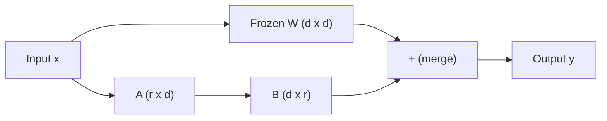
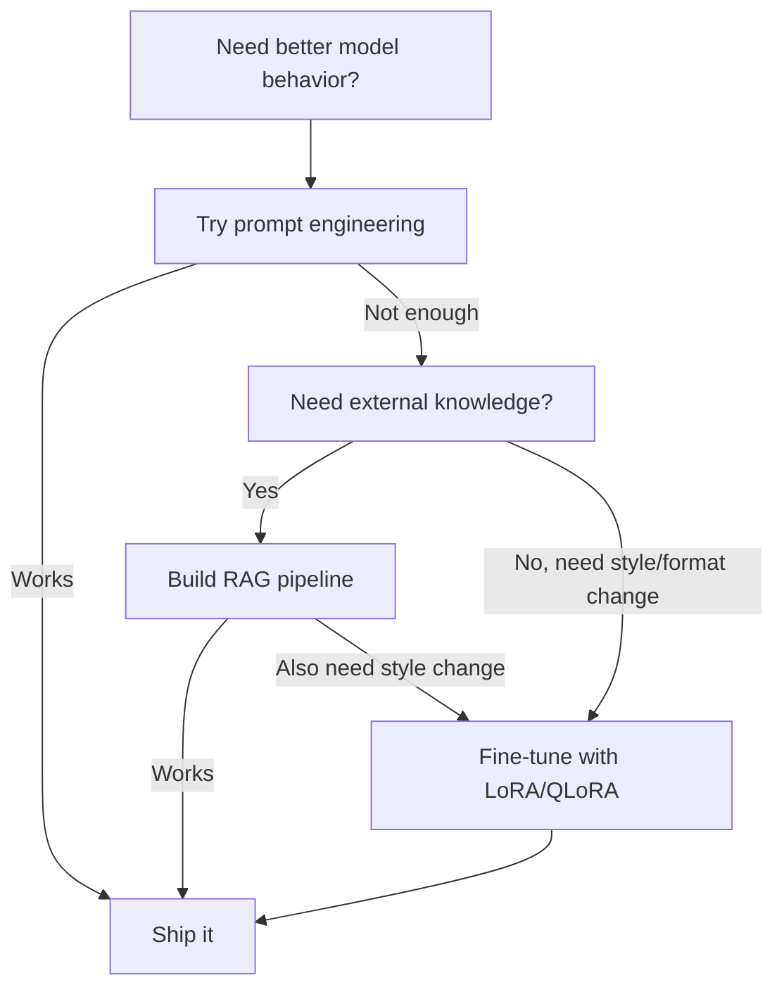

# Fine-Tuning with LoRA & QLoRA

> 7B modelをfull fine-tuningするには56GBのVRAMが必要です。多くの個人や企業にはありません。LoRAはparametersの1%未満だけをtrainingすることで、同じmodelを6GBでfine-tuneできます。これは妥協ではありません。多くのtasksでfull fine-tuning品質に並びます。open-source fine-tuning ecosystemはこの仕組みの上に成り立っています。

**種別:** 構築
**言語:** Python
**前提条件:** Phase 10, Lesson 06 (Instruction Tuning / SFT)
**所要時間:** 約75分
**Related:** Phase 10はSFT/DPO loopsをfrom scratchで扱います。このlessonではそれを2026年のPEFT toolkits（PEFT、TRL、Unsloth、Axolotl、LLaMA-Factory）へ接続します。

## Learning Objectives

- pretrained modelのattention layersへlow-rank adapter matrices（AとB）を注入してLoRAを実装する
- LoRAとfull fine-tuningのparameter savingsを計算する。rank r、d_model dimensionsではd^2ではなく2*r*d parametersをtrainingする
- QLoRA（4-bit quantized base + LoRA adapters）でconsumer GPU memory内に収めてmodelをfine-tuneする
- LoRA weightsをbase modelへmergeしてdeploymentし、adapter有無のinference speedを比較する

## 問題

base modelがあります。たとえばLlama 3 8Bです。会社の声でcustomer support ticketsに答えさせたい。SFTが答えですが、cost problemがあります。

full fine-tuningはmodelの全parametersを更新します。Llama 3 8Bには8 billion parametersがあります。fp16ではweightsのloadだけで16GB。training中はgradients、Adam optimizer states、activationsも必要で、single 8B modelにおよそ56GB VRAMが必要です。

A100 80GBならぎりぎり入りますが、cloudでは高価です。50,000 examplesを3 epochs trainingすると6-10 hours。hyperparametersを探すために10 experimentsを回すと、deploy前に数百ドルかかります。70B modelではさらに現実的でなくなります。

さらに、full fine-tuningはすべてのweightsを変更します。customer support dataでfine-tuneすると、modelのgeneral capabilitiesを劣化させる可能性があります。これはcatastrophic forgettingと呼ばれます。taskでは良くなり、他では悪くなります。

必要なのは、少ないparametersをtrainし、少ないmemoryで済み、modelの既存知識を壊しにくい方法です。

## The Concept

### LoRA: Low-Rank Adaptation

Edward Huらは2021年6月にLoRAを発表しました。洞察は、fine-tuning中のweight updatesにはlow intrinsic rankがあるということです。4096x4096 weight matrixの16.7 million parametersすべてを更新する必要はなく、有用なupdateはrank 16や32のmatrixで捉えられます。

standard linear layerは次を計算します。

```
y = Wx
```

Wはd_out x d_in matrixです。4096x4096 attention projectionなら16,777,216 parametersです。

LoRAはWをfreezeし、low-rank decompositionを追加します。

```
y = Wx + BAx
```

Bは(d_out x r)、Aは(r x d_in)です。rank rはdよりはるかに小さく、通常8、16、32です。

r=16、4096x4096 layerではLoRA parametersは131,072で、元の0.78%です。parametersの0.78%をtrainingして、95-100%の品質に近づきます。



Aはrandom Gaussianで初期化され、Bはzeroで初期化されます。LoRA contributionはzeroから始まるため、modelは元のbehaviorからtrainingを始め、徐々にadaptationを学びます。

### The Scaling Factor: Alpha

LoRAはlow-rank updateの影響を制御するscaling factor alphaを導入します。

```
y = Wx + (alpha / r) * BAx
```

alpha = rならscalingは1xです。alpha = 2rはよく使われるdefaultで2xです。このhyperparameterはbase learning rateとは独立にLoRA pathの学習強度を調整します。

実務目安:

- alpha = 2 * rank は一般的なcommunity convention
- alpha = rank は保守的で安定しやすい
- 高いalphaは収束を速めることも、不安定化することもある

### Where to Apply LoRA

transformerには多くのlinear layersがあります。すべてにLoRAを追加する必要はありません。

| Target Layers | Trainable Params (7B) | Quality |
|--------------|----------------------|---------|
| q_proj only | 4.7M | 良い |
| q_proj + v_proj | 9.4M | より良い |
| q_proj + k_proj + v_proj + o_proj | 18.9M | attentionでは最良 |
| All linear (attention + MLP) | 37.7M | marginal gain、paramsは2倍 |

多くのtasksのsweet spotはq_proj + v_projです。これはself-attentionのquery/value projectionsを対象にし、modelが何に注意し、何を抽出するかに効きます。code generationなど複雑なtasksではMLP layers追加が助けになりますが、単純なtasksではdiminishing returnsです。

### Rank Selection

rank rはadaptationの表現力を決めます。

| Rank | Trainable Params (per layer) | Best For |
|------|---------------------------|----------|
| 4 | 32,768 | simple classification、sentiment |
| 8 | 65,536 | single-domain Q&A、summarization |
| 16 | 131,072 | multi-domain tasks、instruction following |
| 32 | 262,144 | complex reasoning、code generation |
| 64 | 524,288 | 多くのtasksでdiminishing returns |
| 128 | 1,048,576 | まれにしか正当化されない |

simple tasksではr=4でも多くを捉えます。実務ではr=8とr=16が最も一般的です。r=64を超えるとLoRAのmemory advantageが薄れます。

### QLoRA: 4-Bit Quantization + LoRA

Tim Dettmersらは2023年5月にQLoRAを発表しました。frozen base modelを4-bit precisionへquantizeし、その上にfp16 LoRA adaptersを付けます。

| Method | Weight Memory (7B) | Training Memory (7B) | GPU Required |
|--------|-------------------|---------------------|-------------|
| Full fine-tune (fp16) | 14GB | ~56GB | 1x A100 80GB |
| LoRA (fp16 base) | 14GB | ~18GB | 1x A100 40GB |
| QLoRA (4-bit base) | 3.5GB | ~6GB | 1x RTX 3090 24GB |

QLoRAの3つの技術要素です。

**NF4 (Normal Float 4-bit)**: neural network weights向けの4-bit data typeです。weightsはおおよそnormal distributionに従うため、NF4はstandard normal distributionのquantilesに16 levelsを置きます。

**Double quantization**: quantization constants自体もmemoryを取ります。これらをfp8へquantizeしてoverheadを減らします。

**Paged optimizers**: long sequencesでoptimizer statesがGPU memoryを超えるとき、NVIDIA unified memoryでCPU RAMへpage out/inし、OOMを防ぎます。

### The Quality Question

parametersを減らしたりbaseをquantizeしたりすると品質が落ちるのでしょうか。多くのpapersでは、LoRA r=16は多くのbenchmarksでfull fine-tuningの1%以内です。QLoRA r=16はさらにわずかに落ち、QLoRA r=64は90%少ないmemoryでほぼfull fine-tuningに並びます。

### Real-World Costs

Llama 3 8Bを50,000 examples、3 epochsでfine-tuneする場合、full fine-tuningは高価で大きなGPUを要求します。LoRAとQLoRAはsingle GPUで走り、Unslothなどのkernel optimizationを使うと時間とVRAMをさらに削減できます。QLoRA on consumer GPUは、open-weight fine-tuning communityが爆発的に広がった理由です。

### The 2026 PEFT stack

| Framework | What it is | Pick when |
|-----------|-----------|-----------|
| **Hugging Face PEFT** | LoRA/QLoRA/DoRA/IA3の標準library | raw controlが欲しく、training loopが`transformers.Trainer`上にある |
| **TRL** | SFT、DPO、GRPO、PPO、ORPO trainers | SFT後にDPO/GRPOが必要。PEFT上に構築 |
| **Unsloth** | forward/backward passのTriton-kernel rewrite | 精度低下なしで2-5x speedupとVRAM削減が欲しい |
| **Axolotl** | PEFT + TRL + DeepSpeed + UnslothのYAML wrapper | 再現可能でversion-controlledなtraining runsが欲しい |
| **LLaMA-Factory** | PEFT + TRL上のGUI/CLI/API | zero-code fine-tuningが欲しい |
| **torchtune** | native PyTorch recipes | minimal depsでPyTorch標準化したい |

目安: researchやone-off experimentはPEFT。repeatable production pipelineはAxolotl + Unsloth。throwaway prototypingはLLaMA-Factoryです。

### Merging Adapters

training後にはfrozen base modelと小さなLoRA adapter（通常10-100MB）があります。選択肢は2つです。

1. **別々に保持する**: base modelをloadし、adapterを上にloadします。taskごとにadapterをswapできます。
2. **永久にmergeする**: W' = W + (alpha/r) * BAを計算し、新しいfull modelとして保存します。inference overheadはありません。

multiple tasksをserveするならseparate、single specialized modelをdeployするならmergeが向いています。TIES-Merging、DARE、task arithmeticなどで複数adaptersを組み合わせることもできます。

### When NOT to Fine-Tune

fine-tuningは最初の選択肢ではなく、3番目の選択肢です。

**First: prompt engineering.** より良いsystem promptを書き、few-shot examplesを足します。無料で数分です。

**Second: RAG.** specific data（documents、knowledge base、product catalog）が必要なら、weightsへ焼き込むよりretrievalの方が安く保守しやすいです。

**Third: fine-tuning.** promptingでは得られないstyle、format、reasoning patternが必要なとき、一貫したstructured outputが必要なとき、大きなmodelを小さなmodelへdistillしたいとき、few-shot tokensのlatencyを払えないときに使います。



## 実装

このlessonではpure PyTorchでLoRAをfrom scratchに実装します。LoRA layer、LoRA-wrapped linear layer、modelへの注入、parameter counting、weight merging、simulated QLoRA quantization、training loop、full demoを作ります。実装は `code/lora.py` にあります。

中心は、base linear layerをfreezeし、trainableなA/B matricesだけを追加することです。merge時にはLoRA updateを元weightへ加算し、adapter overheadのない通常modelへ戻します。

## Use It

Hugging Face ecosystemでは、real modelへのLoRAはPEFTの `LoraConfig` と `get_peft_model` で数十行です。QLoRAでは `BitsAndBytesConfig` で4-bit quantizationを有効にし、base modelを4-bitでloadし、LoRA adaptersをfp16/BF16でtrainします。training loopとdata pipelineは同じままです。

保存されるadapterは10-100MBです。base modelは変更されません。Hugging Face Hubでadapterだけをshareでき、full modelを再配布する必要がありません。

## Ship It

このlessonは次を生成します。

- `outputs/prompt-lora-advisor.md` -- taskに応じてLoRA rank、target modules、hyperparametersを決めるprompt
- `outputs/skill-fine-tuning-guide.md` -- いつ、どのようにfine-tuneするかのdecision treeをagentsへ教えるskill

## Exercises

1. **Rank ablation study.** ranks 2、4、8、16、32、64でdemoを実行し、final loss vs. rankをplotします。
2. **Target module comparison.** `inject_lora` を変更し、layer "0"のみ、"2"のみ、"4"のみ、全3つをtargetにして比較します。
3. **Quantization error analysis.** `quantize_to_nf4` / `dequantize_from_nf4` 前後のweight matricesでMSE、max absolute error、correlationを測ります。
4. **Multi-adapter serving.** 異なるdata subsetsで2つのLoRA adaptersをtrainし、base modelを1回loadしてadapterをswapし、同じinputで異なるoutputsになることを確認します。
5. **Merge vs. unmerged inference.** `merge_lora_weights` 前後で同じ100 inputsのoutputがfloating-point tolerance 1e-5以内で一致することを確認し、inference speedを比較します。

## Key Terms

| Term | What people say | What it actually means |
|------|----------------|----------------------|
| LoRA | 「efficient fine-tuning」 | base weightsをfreezeし、full weight updateを近似する小さなA/B matricesだけをtrainするLow-Rank Adaptation |
| QLoRA | 「laptopでfine-tune」 | base modelを4-bit NF4でloadし、LoRA adaptersをfp16でtrainするQuantized LoRA |
| Rank (r) | 「modelがどれだけ学べるか」 | A/B matricesの内側dimension。expressivenessとparameter countのtrade-offを制御する |
| Alpha | 「LoRA learning rate」 | LoRA outputへ適用するscaling factor。alpha/rがadaptation contributionをscaleする |
| NF4 | 「4-bit quantization」 | normal distribution quantilesにquantization levelsを置く4-bit data type |
| Adapter | 「小さなtrained part」 | LoRA A/B matricesを別fileとして保存したもの。base model上にloadできる |
| Target modules | 「どのlayersをLoRA化するか」 | q_proj、v_projなどLoRA adaptersを注入するspecific linear layers |
| Merging | 「焼き込む」 | W + (alpha/r) * BAを計算して元weightを置き換え、inference overheadをなくすこと |
| Paged optimizers | 「training中にOOMしない」 | GPU memory不足時にAdam momentum/varianceをCPUへoffloadすること |
| Catastrophic forgetting | 「fine-tuningで他が壊れる」 | 全weights更新によりmodelが以前学んだcapabilitiesを失うこと |

## 参考文献

- Hu et al., "LoRA: Low-Rank Adaptation of Large Language Models" (2021) -- low-rank decomposition methodのoriginal paper
- Dettmers et al., "QLoRA: Efficient Finetuning of Quantized Language Models" (2023) -- NF4、double quantization、paged optimizersを導入
- PEFT library documentation -- Hugging Face ecosystemでのLoRA/QLoRA標準library
- Yadav et al., "TIES-Merging" (2023) -- 複数LoRA adaptersを品質劣化なく組み合わせる技術
- [Rafailov et al., "Direct Preference Optimization" (NeurIPS 2023)](https://arxiv.org/abs/2305.18290) -- SFT後のpreference-tuning stage
- [TRL documentation](https://huggingface.co/docs/trl/) -- `SFTTrainer`、`DPOTrainer`、`KTOTrainer`の公式reference
- [Unsloth documentation](https://docs.unsloth.ai/) -- fine-tuning throughputとmemoryを改善するfused kernels
- [Axolotl documentation](https://axolotl-ai-cloud.github.io/axolotl/) -- YAML-configured multi-GPU SFT/DPO/QLoRA trainer
