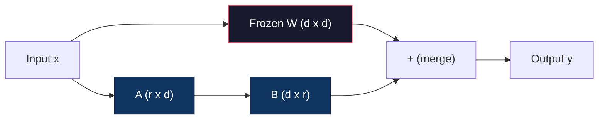
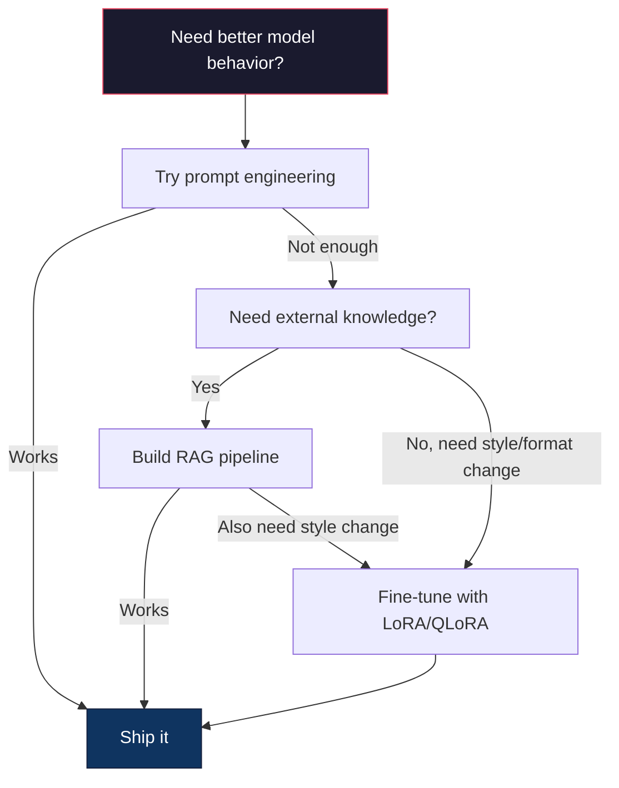

# LoRA ve QLoRA ile Fine-Tuning

> Tam fine-tuning 7B modeli 56 GB VRAM gerektirir. Sende buna sahip değilsin. Çoğu şirket de öyle. LoRA, parametrelerin %1'inden daha azını eğiterek aynı modele 6 GB'ta ince ayar yapmanızı sağlar. Bu bir uzlaşma değildir; çoğu görevde tam fine-tuning kalitesiyle eşleşir. Açık kaynaklı fine-tuning ekosisteminin tamamı bu tek numara üzerinde çalışıyor.

**Tür:** Yapım
**Diller:** Python
**Önkoşullar:** Aşama 10, Ders 06 (Talimat Ayarlama / SFT)
**Süre:** ~75 dakika
**İlgili:** Aşama 10, SFT/DPO döngülerini sıfırdan kapsar. Bu ders bunları 2026 PEFT araç kitlerine (PEFT, TRL, Unsloth, Axolotl, LLaMA-Factory) ekler.

## Öğrenme Hedefleri

- Düşük dereceli adaptör matrislerini (A ve B) önceden eğitilmiş bir modelin dikkat katmanlarına enjekte ederek LoRA'yı uygulayın
- LoRA'nın tam fine-tuning'ye karşı parametre tasarrufunu hesaplayın: d_model boyutları trenleri d^2 yerine 2*r*d parametreleriyle rütbe r
- Tüketici GPU belleğine sığacak şekilde QLoRA (4 bit nicelenmiş taban + LoRA bağdaştırıcıları) kullanarak bir modele ince ayar yapın
- LoRA ağırlıklarını deployment için temel modele geri birleştirin ve inference hızını adaptörlü ve adaptörsüz karşılaştırın

## Sorun

Temel bir modeliniz var. Lama 3 8B. Müşteri destek taleplerine şirketinizin sesiyle yanıt vermesini istiyorsunuz. Cevap SFT'dir. Ancak SFT'nin maliyet sorunu var.

Tam fine-tuning, modeldeki her parametreyi günceller. Llama 3 8B'nin 8 milyar parametresi vardır. Fp16'da her parametre 2 bayt alır. Bu sadece ağırlıkları yüklemek için 16GB'tır. Eğitim sırasında ayrıca gradient'lere (16 GB), Adam için optimize edici durumlarına (momentum + varyans için 32 GB) ve aktivasyonlara da ihtiyacınız vardır. Toplam: Tek bir 8B modeli için yaklaşık 56 GB VRAM.

A100 80GB buna zar zor sığar. İki A100'ün maliyeti deney başına $3-4/hour on cloud providers. Training for 3 epochs on 50,000 examples takes 6-10 hours. That's $30-40'tır. Hiperparametreleri doğru şekilde belirlemek için 10 deney çalıştırın ve herhangi bir şeyi dağıtmadan önce 400 ABD doları harcadınız.

Bunu Llama 3 70B'ye ölçeklendirdiğinizde rakamlar saçma olmaya başlıyor. Yalnızca ağırlıklar için 140 GB. Bir kümeye ihtiyacınız var. Deneme başına 100$+.

Daha derin bir sorun da var. Tam fine-tuning, modeldeki her ağırlığı değiştirir. Müşteri destek verilerine ince ayar yaparsanız modelin genel yeteneklerini düşürebilirsiniz. Buna felaket unutma denir. Model sizin görevinizde daha iyi hale gelirken, diğer her şeyde daha da kötüleşir.

Daha az parametreyi eğiten, daha az bellek kullanan ve modelin mevcut bilgisini yok etmeyen bir yönteme ihtiyacınız var.

## Konsept

### LoRA: Düşük Seviye Uyarlama

Microsoft'tan Edward Hu ve meslektaşları, LoRA'yı Haziran 2021'de yayınladı. Makalenin içgörüsü: fine-tuning sırasındaki ağırlık güncellemelerinin içsel sıralaması düşük. 4096x4096 ağırlık matrisindeki 16,7 milyon parametrenin tamamını güncellemenize gerek yok. Güncellemedeki yararlı bilgiler, 16 veya 32. sıradaki bir matris tarafından yakalanabilir.

İşte matematik. Standart bir doğrusal katman şunları hesaplar:

```
y = Wx
```

Burada W bir d_out x d_in matrisidir. 4096x4096 dikkat projeksiyonu için bu 16.777.216 parametreye karşılık gelir.

LoRA, W'yi dondurur ve düşük dereceli bir ayrıştırma ekler:

```
y = Wx + BAx
```

B'nin (d_out x r) ve A'nın (r x d_in) olduğu yer. R rütbesi d'den çok daha küçüktür - tipik olarak 8, 16 veya 32.

4096x4096 katmanında r=16 için:
- Orijinal parametreler: 4096 x 4096 = 16.777.216
- LoRA parametreleri: (4096 x 16) + (16 x 4096) = 65.536 + 65.536 = 131.072
- Azalma: 131.072 / 16.777.216 = %0,78

Parametrelerin %0,78'ini eğitiyorsunuz ve kalitenin %95-100'ünü alıyorsunuz.



A rastgele bir Gaussian ile başlatılır. B sıfıra başlatıldı. Bu, LoRA katkısının sıfırdan başladığı anlamına gelir; model, eğitime orijinal davranışından başlar ve yavaş yavaş adaptasyonu öğrenir.

### Ölçekleme Faktörü: Alfa

LoRA, düşük dereceli güncellemenin çıktıyı ne kadar etkileyeceğini kontrol eden bir ölçeklendirme faktörü alfa sunar:

```
y = Wx + (alpha / r) * BAx
```

Alfa = r olduğunda ölçeklendirme 1x'tir. Alfa = 2r (ortak varsayılan) olduğunda ölçeklendirme 2x'tir. Bu hiperparametre, temel öğrenme oranından bağımsız olarak LoRA yolunun öğrenme hızını kontrol eder.

Pratik rehberlik:
- alfa = 2 * sıralama ortak bir topluluk kuralıdır (çoğu deneyde kullanılan orijinal makale alfa = sıralama)
- alfa = sıralama 1x ölçeklendirme verir, ihtiyatlı ama kararlı
- Daha yüksek alfa, adım başına daha büyük güncellemeler anlamına gelir; bu da yakınsamayı hızlandırabilir veya kararsızlığa neden olabilir

### LoRA Nereye Uygulanmalı

Bir transformer'nin birçok doğrusal katmanı vardır. Hepsine LoRA eklemenize gerek yok. Orijinal makale farklı kombinasyonları test etti:

| Hedef Katmanları | Eğitilebilir Paramlar (7B) | Kalite |
|--------------|----------------------|---------|
| yalnızca q_proj | 4,7 milyon | İyi |
| q_proj + v_proj | 9,4 milyon | Daha iyi |
| q_proj + k_proj + v_proj + o_proj | 18,9 milyon | Dikkat çekmek için en iyisi |
| Tamamen doğrusal (dikkat + MLP) | 37,7 milyon | Marjinal kazanç, 2x parametre |

Çoğu görev için en uygun nokta: q_proj + v_proj. Bu, modelin neye katıldığını ve hangi bilgiyi çıkardığını kontrol eden öz-dikkatteki sorgu ve değer projeksiyonlarını hedefler. MLP katmanlarının eklenmesi, kod oluşturma gibi karmaşık görevlere yardımcı olur, ancak daha basit görevlerde getirilerin azalması için parametre sayısını iki katına çıkarır.

### Sıra Seçimi

R rütbesi uyarlamanın anlamlılığını kontrol eder:

| Sıra | Eğitilebilir Paramlar (katman başına) | En İyisi |
|------|---------------------------|----------|
| 4 | 32,768 | Basit sınıflandırma, duyarlılık |
| 8 | 65.536 | Tek alanlı Soru-Cevap, özetleme |
| 16 | 131.072 | Çok alanlı görevler, talimatlar takip ediliyor |
| 32 | 262,144 | Karmaşık akıl yürütme, kod oluşturma |
| 64 | 524.288 | Çoğu görev için azalan getiriler |
| 128 | 1.048.576 | Nadiren haklı |

Hu ve ark. r=4'ün basit görevlere yönelik adaptasyonun çoğunu zaten yakaladığını gösterdi. r=8 ve r=16 pratikte en yaygın tercihlerdir. r=64'ün ötesine geçmek nadiren kaliteyi artırır ve LoRA'nın hafıza avantajını kaybetmeye başlar.

### QLoRA: 4-Bit Niceleme + LoRA

Washington Üniversitesi'nden Tim Dettmers ve meslektaşları Mayıs 2023'te QLoRA'yı yayınladılar. Fikir: Dondurulmuş temel modeli 4 bit hassasiyetle nicelemek, ardından fp16'daki LoRA adaptörlerini üstüne eklemek.

Bu, hafıza denklemini önemli ölçüde değiştirir:

| Yöntem | Ağırlık Hafızası (7B) | Eğitim Belleği (7B) | GPU Gerekli |
|--------|-------------------|---------------------|-------------|
| Tam ince ayar (fp16) | 14GB | ~56GB | 1x A100 80GB |
| LoRA (fp16 tabanı) | 14GB | ~18GB | 1x A100 40GB |
| QLoRA (4 bitlik taban) | 3,5GB | ~6GB | 1 adet RTX 3090 24 GB |

QLoRA üç teknik katkı sağlar:

**NF4 (Normal Float 4-bit)**: neural network ağırlıkları için özel olarak tasarlanmış yeni bir veri türü. Neural network ağırlıkları kabaca normal bir dağılım izler. NF4, 16 niceleme seviyesini standart bir normal dağılımın niceliklerine yerleştirir. Bu, normal olarak dağıtılan veriler için teorik olarak en uygun bilgidir. Tek tip 4 bit niceleme (INT4) veya standart Float4'ten daha az bilgi kaybeder.

**Çift niceleme**: Niceleme sabitlerinin kendisi bellek alır. 64 ağırlıktan oluşan her blok, bir fp32 ölçek faktörüne (4 bayt) ihtiyaç duyar. 7B modeli için bu fazladan 0,4 GB demektir. Çift niceleme, bu sabitleri fp8'e nicemleyerek yükü 0,1 GB'a düşürür. Küçük ama ekliyor.

**Sayfalanmış optimize ediciler**: Eğitim sırasında, optimize edici durumları (Adam'ın momentumu ve varyansı) uzun dizilerde GPU belleğini aşabilir. Disk belleği optimize ediciler, GPU belleği tükendiğinde optimize edici durumlarını otomatik olarak CPU RAM'e sayfalamak ve gerektiğinde bunları geri sayfalamak için NVIDIA'nın birleşik belleğini kullanır. Bu, bir miktar verim pahasına OOM'un çökmesini önler.

### Kalite Sorusu

Parametrelerin azaltılması veya bazın nicelendirilmesi kaliteye zarar verir mi? Birden fazla makaleden elde edilen sonuçlar:

| Yöntem | MMLU (5 atış) | MT-Tezgah | İnsan Değerlendirmesi |
|--------|--------------|----------|-----------|
| Tam ince ayar (Llama 2 7B) | 48.3 | 6.72 | 14.6 |
| LoRA r=16 | 47.9 | 6.68 | 14.0 |
| QLoRA r=16 (NF4) | 47,5 | 6.61 | 13.4 |
| QLoRA r=64 (NF4) | 48.1 | 6.70 | 14.2 |

r=16'daki LoRA, çoğu benchmark'de tam fine-tuning'nin %1'i dahilindedir. r=16'daki QLoRA yüzde bir oranında daha kaybeder. r=64'teki QLoRA, %90 daha az bellek kullanırken aslında tam fine-tuning ile eşleşir.

### Gerçek Dünya Maliyetleri

50.000 örnekte Fine-tuning Llama 3 8B (3 dönem):

| Yöntem | GPU | Zaman | Maliyet |
|--------|-----|------|------|
| Tam ince ayar | 2x A100 80GB | 8 saat | ~32$ |
| LoRA r=16 | 1x A100 40GB | 4 saat | ~8$ |
| QLoRA r=16 | 1 adet RTX 4090 24GB | 6 saat | ~5$ |
| QLoRA r=16 (Tembellikten Kurtul) | 1 adet RTX 4090 24GB | 2,5 saat | ~2$ |
| QLoRA r=16 | 1x T4 16GB | 12 saat | ~4$ |

Tek tüketici GPU'sundaki QLoRA'nın maliyeti öğle yemeğinden daha azdır. Açık ağırlıklı fine-tuning topluluğunun 2023'te patlama yaşamasının ve aşağıdaki framework eğitimlerinin 2026'da varsayılan olarak QLoRA göndermesinin nedeni budur.

### 2026 PEFT yığını

| Framework | Nedir | Ne zaman seç |
|-----------|-----------|-----------|
| **Sarılma Yüz PEFT'i** | Standart LoRA/QLoRA/DoRA/IA3 kitaplığı | Ham kontrol istiyorsanız ve eğitim döngünüz zaten `transformers.Trainer` üzerindedir |
| **TL** | HF'nin geri bildirimden takviye eğitmenleri (SFT, DPO, GRPO, PPO, ORPO) | SFT'den sonra DPO/GRPO'ya ihtiyacınız var; PEFT'in üzerine inşa edildi |
| **Tembellikten kurtul** | İleri/geri geçişin Triton çekirdeğiyle yeniden yazılması | Doğruluk kaybı olmadan 2-5 kat hızlanma + yarım VRAM istiyorsunuz; Lama/Mistral/Qwen ailesi |
| **Axolotl** | PEFT + TRL + DeepSpeed ​​+ Unsloth üzerinden YAML yapılandırma sarmalayıcısı | Tekrarlanabilir, sürüm kontrollü eğitim çalışmaları istiyorsunuz |
| **LLaMA Fabrikası** | PEFT + TRL üzerinden GUI/CLI/API | Sıfır kodlu fine-tuning istiyorsunuz; 100'den fazla model ailesi destekleniyor |
| **meşale melodisi** | Yerel PyTorch tarifleri, `transformers` bölümü yok | Minimum düzeyde ayrıntı istiyorsunuz ve kuruluşunuz zaten PyTorch'ta standartlaşıyor |

Temel kural: araştırma kullanımı veya tek seferlik deney → PEFT. Tekrarlanabilir üretim hattı → Unsloth çekirdekleri etkinleştirilmiş Axolotl. Tek kullanımlık prototip oluşturma → LLaMA-Factory.

### Bağdaştırıcıları Birleştirme

Eğitimden sonra iki şeye sahip olursunuz: dondurulmuş temel model ve küçük bir LoRA adaptörü (genellikle 10-100 MB). Şunlardan birini yapabilirsiniz:

1. **Bunları ayrı tutun**: Temel modeli yükleyin, adaptörü üste yükleyin. Farklı görevler için adaptörleri değiştirin. Bu, tek bir temel modelden birden fazla ince ayarlı varyantı bu şekilde sunarsınız.

2. **Onları kalıcı olarak birleştirin**: W' = W + (alfa/r) * BA'yı hesaplayın ve sonucu yeni bir tam model olarak kaydedin. Birleştirilen model orijinaliyle aynı boyuttadır. inference ek yükü yok. Yönetilecek adaptör yok.

Birden fazla göreve (müşteri destek bağdaştırıcısı, kod bağdaştırıcısı, çeviri bağdaştırıcısı) hizmet vermek için bunları ayrı tutun. Tek bir özel modeli dağıtmak için birleştirin.

Birden fazla bağdaştırıcıyı birleştirmek için gelişmiş birleştirme teknikleri:

- **TIES-Birleştirme** (Yadav ve diğerleri 2023): Küçük büyüklükteki parametreleri keser, işaret çakışmalarını çözer ve ardından birleştirir. Adaptörler arasındaki paraziti azaltır.
- **DARE** (Yu ve diğerleri 2023): Birleştirmeden önce bağdaştırıcı parametrelerini rastgele düşürür ve geri kalanını yeniden ölçeklendirir. Yetenekleri birleştirmede şaşırtıcı derecede etkili.
- **Görev aritmetiği**: Bağdaştırıcı ağırlıklarını eklemeniz veya çıkarmanız yeterlidir. Bir "kod" bağdaştırıcısı ve bir "matematik" bağdaştırıcısının eklenmesi genellikle her ikisinde de iyi olan bir model üretir.

### İnce Ayar Yapılmaması Gerektiğinde

Fine-tuning ilk değil üçüncü seçenektir.

**İlk olarak: prompt mühendisliği.** Daha iyi bir sistem olan prompt yazın. Birkaç çekimli örnekler ekleyin. Düşünce zincirini kullanın. Bunun hiçbir maliyeti yoktur ve birkaç dakika sürer. prompting sizi yolun %80'ine ulaştırırsa muhtemelen ince ayar yapmanıza gerek kalmaz.

**İkincisi: RAG.** Modelin belirli verilerinizi (belgeler, bilgi tabanı, ürün kataloğu) bilmesi gerekiyorsa, bunları almak, bunları ağırlıklara dönüştürmekten daha ucuz ve bakımı daha kolaydır. Bkz. Ders 06.

**Üçüncüsü: fine-tuning.** Modelin prompting aracılığıyla elde edilemeyecek belirli bir stil, format veya akıl yürütme modelini benimsemesine ihtiyaç duyduğunuzda bunu kullanın. Tutarlı yapılandırılmış çıktıya ihtiyacınız olduğunda. Daha büyük bir modeli daha küçük bir modele ayırmanız gerektiğinde. Gecikme önemli olduğunda ve birkaç çekimlik prompting ile ekstra token'leri karşılayamayacağınız zaman.



```figure
lora-params
```

## İnşa Et

LoRA'yı saf PyTorch'ta sıfırdan uyguluyoruz. Kütüphane yok. Sihir yok. LoRA katmanını oluşturacak, onu bir modele enjekte edecek, eğitecek ve ağırlıkları yeniden birleştireceksiniz.

### Adım 1: LoRA Katmanı

```python
import torch
import torch.nn as nn
import math

class LoRALayer(nn.Module):
    def __init__(self, in_features, out_features, rank=8, alpha=16):
        super().__init__()
        self.rank = rank
        self.alpha = alpha
        self.scaling = alpha / rank

        self.A = nn.Parameter(torch.randn(in_features, rank) * (1 / math.sqrt(rank)))
        self.B = nn.Parameter(torch.zeros(rank, out_features))

    def forward(self, x):
        return (x @ self.A @ self.B) * self.scaling
```

A, ölçeklendirilmiş rastgele değerlerle başlatılır. B sıfıra başlatıldı. BA çarpımı sıfırdan başlar, dolayısıyla model orijinal davranışıyla başlar.

### Adım 2: LoRA ile Sarılmış Doğrusal Katman

```python
class LinearWithLoRA(nn.Module):
    def __init__(self, linear, rank=8, alpha=16):
        super().__init__()
        self.linear = linear
        self.lora = LoRALayer(
            linear.in_features, linear.out_features, rank, alpha
        )

        for param in self.linear.parameters():
            param.requires_grad = False

    def forward(self, x):
        return self.linear(x) + self.lora(x)
```

Orijinal doğrusal katman dondurulur. Yalnızca LoRA parametreleri (A ve B) eğitilebilir.

### 3. Adım: LoRA'yı bir Modele enjekte edin

```python
def inject_lora(model, target_modules, rank=8, alpha=16):
    for param in model.parameters():
        param.requires_grad = False

    lora_layers = {}
    for name, module in model.named_modules():
        if isinstance(module, nn.Linear):
            if any(t in name for t in target_modules):
                parent_name = ".".join(name.split(".")[:-1])
                child_name = name.split(".")[-1]
                parent = dict(model.named_modules())[parent_name]
                lora_linear = LinearWithLoRA(module, rank, alpha)
                setattr(parent, child_name, lora_linear)
                lora_layers[name] = lora_linear
    return lora_layers
```

Öncelikle modeldeki her parametreyi dondurun. Ardından model ağacında gezinin, hedef adlarınızla eşleşen doğrusal katmanları bulun ve bunları LoRA ile sarılmış sürümlerle değiştirin. LoRA A ve B matrisleri, modelin tamamında eğitilebilir tek parametrelerdir.

### Adım 4: Parametreleri Sayma

```python
def count_parameters(model):
    total = sum(p.numel() for p in model.parameters())
    trainable = sum(p.numel() for p in model.parameters() if p.requires_grad)
    frozen = total - trainable
    return {
        "total": total,
        "trainable": trainable,
        "frozen": frozen,
        "trainable_pct": 100 * trainable / total if total > 0 else 0
    }
```

### Adım 5: Ağırlıkları Geri Birleştir

```python
def merge_lora_weights(model):
    for name, module in model.named_modules():
        if isinstance(module, LinearWithLoRA):
            with torch.no_grad():
                merged = (
                    module.lora.A @ module.lora.B
                ) * module.lora.scaling
                module.linear.weight.data += merged.T
            parent_name = ".".join(name.split(".")[:-1])
            child_name = name.split(".")[-1]
            if parent_name:
                parent = dict(model.named_modules())[parent_name]
            else:
                parent = model
            setattr(parent, child_name, module.linear)
```

Birleştirme sonrasında LoRA katmanları kaybolur. Model, ağırlıklara yapılan uyarlamayla orijinaliyle aynı boyuttadır. inference ek yükü yok.

### Adım 6: Simüle edilmiş QLoRA Nicelemesi

```python
def quantize_to_nf4(tensor, block_size=64):
    blocks = tensor.reshape(-1, block_size)
    scales = blocks.abs().max(dim=1, keepdim=True).values / 7.0
    scales = torch.clamp(scales, min=1e-8)
    quantized = torch.round(blocks / scales).clamp(-8, 7).to(torch.int8)
    return quantized, scales

def dequantize_from_nf4(quantized, scales, original_shape):
    dequantized = quantized.float() * scales
    return dequantized.reshape(original_shape)
```

Bu, ağırlıkları 64'lük bloklar içindeki 16 ayrı seviyeye eşleyerek 4 bit nicelemeyi simüle eder. Üretim QLoRA, GPU'daki gerçek NF4 için bit ve bayt kitaplığını kullanır.

### Adım 7: Eğitim Döngüsü

```python
def train_lora(model, data, epochs=5, lr=1e-3, batch_size=4):
    optimizer = torch.optim.AdamW(
        [p for p in model.parameters() if p.requires_grad], lr=lr
    )
    criterion = nn.MSELoss()

    losses = []
    for epoch in range(epochs):
        epoch_loss = 0.0
        n_batches = 0
        indices = torch.randperm(len(data["inputs"]))

        for i in range(0, len(indices), batch_size):
            batch_idx = indices[i:i + batch_size]
            x = data["inputs"][batch_idx]
            y = data["targets"][batch_idx]

            output = model(x)
            loss = criterion(output, y)

            optimizer.zero_grad()
            loss.backward()
            optimizer.step()

            epoch_loss += loss.item()
            n_batches += 1

        avg_loss = epoch_loss / n_batches
        losses.append(avg_loss)

    return losses
```

### Adım 8: Tam Demo

```python
def demo():
    torch.manual_seed(42)
    d_model = 256
    n_classes = 10

    model = nn.Sequential(
        nn.Linear(d_model, 512),
        nn.ReLU(),
        nn.Linear(512, 512),
        nn.ReLU(),
        nn.Linear(512, n_classes),
    )

    n_samples = 500
    x = torch.randn(n_samples, d_model)
    y = torch.randint(0, n_classes, (n_samples,))
    y_onehot = torch.zeros(n_samples, n_classes).scatter_(1, y.unsqueeze(1), 1.0)

    data = {"inputs": x, "targets": y_onehot}

    params_before = count_parameters(model)

    lora_layers = inject_lora(
        model, target_modules=["0", "2"], rank=8, alpha=16
    )

    params_after = count_parameters(model)

    losses = train_lora(model, data, epochs=20, lr=1e-3)

    merge_lora_weights(model)
    params_merged = count_parameters(model)

    return {
        "params_before": params_before,
        "params_after": params_after,
        "params_merged": params_merged,
        "losses": losses,
    }
```

Demo küçük bir model oluşturuyor, LoRA'yı iki katmana enjekte ediyor, eğitiyor ve ağırlıkları tekrar birleştiriyor. LoRA eğitimi sırasında parametre sayısı tam olarak eğitilebilir düzeyden ~%1 oranında eğitilebilir seviyeye düşer ve birleştirme sonrasında orijinal mimariye geri döner.

## Kullan onu

Hugging Face ekosistemi ile gerçek bir model üzerinde LoRA yaklaşık 20 satır alır:

```python
from transformers import AutoModelForCausalLM, AutoTokenizer
from peft import LoraConfig, get_peft_model, TaskType

model = AutoModelForCausalLM.from_pretrained("meta-llama/Llama-3.1-8B")
tokenizer = AutoTokenizer.from_pretrained("meta-llama/Llama-3.1-8B")

lora_config = LoraConfig(
    task_type=TaskType.CAUSAL_LM,
    r=16,
    lora_alpha=32,
    lora_dropout=0.05,
    target_modules=["q_proj", "v_proj"],
)

model = get_peft_model(model, lora_config)
model.print_trainable_parameters()
```

QLoRA için bit ve bayt nicelemesi ekleyin:

```python
from transformers import BitsAndBytesConfig

bnb_config = BitsAndBytesConfig(
    load_in_4bit=True,
    bnb_4bit_quant_type="nf4",
    bnb_4bit_compute_dtype=torch.bfloat16,
    bnb_4bit_use_double_quant=True,
)

model = AutoModelForCausalLM.from_pretrained(
    "meta-llama/Llama-3.1-8B",
    quantization_config=bnb_config,
    device_map="auto",
)

model = get_peft_model(model, lora_config)
```

İşte bu. Aynı eğitim döngüsü. Aynı veri hattı. Temel model artık 4 bitte, LoRA adaptörleri FP16'da çalışıyor ve her şey 6 GB'a sığıyor.

Hugging Face Trainer ile eğitim için:

```python
from transformers import TrainingArguments, Trainer
from datasets import load_dataset

dataset = load_dataset("tatsu-lab/alpaca", split="train[:5000]")

training_args = TrainingArguments(
    output_dir="./lora-llama",
    num_train_epochs=3,
    per_device_train_batch_size=4,
    gradient_accumulation_steps=4,
    learning_rate=2e-4,
    fp16=True,
    logging_steps=10,
    save_strategy="epoch",
    optim="paged_adamw_8bit",
)

trainer = Trainer(
    model=model,
    args=training_args,
    train_dataset=dataset,
)

trainer.train()

model.save_pretrained("./lora-adapter")
```

Kaydedilen adaptör 10-100 MB'tır. Temel modele dokunulmadan kalır. Tam modeli yeniden dağıtmadan adaptörleri Hugging Face Hub'da paylaşabilirsiniz.

## Gönderin

Bu ders şunları üretir:
- `outputs/prompt-lora-advisor.md` — belirli göreviniz için LoRA sıralamasına, hedef modüllere ve hiper parametrelere karar vermenize yardımcı olan bir prompt
- `outputs/skill-fine-tuning-guide.md` — agent'lere ne zaman ve nasıl ince ayar yapılacağına ilişkin karar ağacını öğreten bir beceri

## Egzersizler

1. **Sıra çıkarma çalışması.** Demoyu 2, 4, 8, 16, 32 ve 64. sıralarla çalıştırın. Son kaybın sıralamaya göre grafiğini çıkarın. Sıralamayı iki katına çıkarmanın artık zararı yarıya indirmediği, azalan getiri noktasını bulun. 256-dim özelliklerinde basit bir sınıflandırma görevi için bunun r=8-16 civarında olması gerekir.

2. **Hedef modül karşılaştırması.** Inject_lora'yı yalnızca "0" katmanını, yalnızca "2" katmanını, yalnızca "4" katmanını ve üçünü de hedefleyecek şekilde değiştirin. Her varyantı 20 dönem boyunca eğitin. Yakınsama hızını ve son kaybı karşılaştırın. Bu, q_proj'a karşı v_proj'a karşı tüm doğrusal katmanları hedefleme konusundaki gerçek kararı yansıtır.

3. **Kuantizasyon hatası analizi.** Eğitilmiş modelin quantize_to_nf4 / dequantize_from_nf4'ten önceki ve sonraki ağırlık matrislerini alın. Ortalama karesel hatayı, maksimum mutlak hatayı ve orijinal ile yeniden oluşturulan ağırlıklar arasındaki korelasyonu hesaplayın. 32, 64, 128 ve 256 blok_size değerleriyle denemeler yapın.

4. **Çoklu adaptör sunumu.** İki LoRA adaptörünü farklı veri alt kümeleri (çift endeksler ve tek endeksler) üzerinde eğitin. Her iki adaptörü de kaydedin. Temel modeli bir kez yükleyin, ardından adaptörleri değiştirin ve her birinin aynı girişte farklı çıkışlar ürettiğini doğrulayın. Üretim sistemleri bu şekilde birden fazla ince ayarlı modele tek bir tabandan hizmet verir.

5. **Birleştirme ve birleşmemiş inference.** Aynı 100 girişte LoRA modelinin merge_lora_weights öncesi ve sonrası çıktısını karşılaştırın. Çıkışların aynı olduğunu doğrulayın (1e-5 kayan nokta toleransı dahilinde). O zaman benchmark inference her ikisinin de hızı - birleştirilmiş, iki yerine tek bir matris çarpımı olduğundan biraz daha hızlı olmalıdır.

## Anahtar Terimler

| Dönem | İnsanlar ne diyor | Aslında ne anlama geliyor |
|------|----------------|----------------------|
| LoRA | "Verimli fine-tuning" | Düşük Dereceli Uyarlama: temel ağırlıkları dondurun, ürünü tam ağırlık güncellemesine yaklaşan iki küçük A ve B matrisini eğitin |
| QLoRA | "Dizüstü bilgisayarda ince ayar yapın" | Ölçülen LoRA: temel modeli 4 bit NF4'e yükleyin, LoRA adaptörlerini en üstte fp16'da eğitin, 6 GB VRAM'de 7B fine-tuning'yi etkinleştirin |
| Sıra (r) | "Model ne kadar öğrenebilir" | A ve B matrislerinin iç boyutu; ifade gücünü ve parametre sayısını kontrol eder |
| Alfa | "LoRA öğrenme oranı" | LoRA çıkışına uygulanan ölçeklendirme faktörü; alpha/r, uyarlamanın nihai çıktıya katkısını ölçeklendiriyor |
| NF4 | "4-bit niceleme" | Normal Float 4: neural network ağırlıkları için ideal, normal dağılım niceliklerinde niceleme düzeylerine sahip 4 bitlik bir veri türü |
| Adaptör | "Eğitimli küçük kısım" | LoRA A ve B matrisleri ayrı bir dosya (10-100 MB) olarak kaydedilir ve temel modelin herhangi bir kopyasının üstüne yüklenebilir |
| Hedef modüller | "LoRA'ya hangi katmanlar" | LoRA adaptörlerinin eklendiği belirli doğrusal katmanlar (q_proj, v_proj vb.) |
| Birleştirme | "Pişirin" | W + (alfa/r) * BA'nın hesaplanması ve orijinal ağırlığın değiştirilmesi, inference |
| Sayfalandırılmış optimize ediciler | "Eğitim sırasında OOM yapmayın" | GPU belleği tükendiğinde optimize edici durumlarının (Adam momentumu, varyans) CPU'ya aktarılması |
| Felaketsel unutma | "Fine-tuning diğer her şeyi bozdu" | Tüm ağırlıkların güncellenmesi modelin daha önce öğrenilen yetenekleri kaybetmesine neden olur |

## Daha Fazla Okuma

- Hu ve diğerleri, "LoRA: Low-Rank Adaptation of Large Language Models" (2021) -- düşük dereceli ayrıştırma yöntemini tanıtan orijinal makale, GPT-3 175B'de 4 gibi düşük bir dereceyle test edilmiştir
- Dettmers ve diğerleri, "QLoRA: Efficient Finetuning of Quantized Language Models" (2023) -- tek bir 48 GB GPU'da 65B fine-tuning'yi etkinleştiren NF4, çift niceleme ve sayfalı optimize edicileri tanıtıyor
- PEFT kitaplığı belgeleri (huggingface.co/docs/peft) - LoRA, QLoRA ve Hugging Face ekosistemindeki diğer parametre açısından verimli yöntemler için standart kitaplık
- Yadav ve diğerleri, "TIES-Merging: Modelleri Birleştirirken Girişimi Çözme" (2023) -- birden fazla LoRA bağdaştırıcısını kalite kaybı olmadan birleştirme teknikleri
- [Rafailov ve diğerleri, "Doğrudan Tercih Optimizasyonu: Dil Modeliniz Gizlice Bir Ödül Modelidir" (NeurIPS 2023)](https://arxiv.org/abs/2305.18290) -- DPO türetme; SFT'den sonra gelen tercih ayarlama aşaması, ödül modeline ihtiyaç duymaz.
- [TRL belgeleri](https://huggingface.co/docs/trl/) -- `SFTTrainer`, `DPOTrainer`, `KTOTrainer` ve PEFT/bitsandbytes/Unsloth ile entegrasyon yüzeyi için resmi referans.
- [Unsloth belgeleri](https://docs.unsloth.ai/) -- fine-tuning verimini ikiye katlayan ve belleği yarıya indiren çekirdekleri birleştirdi; TRL altındaki performans katmanı.
- [Axolotl belgeleri](https://axolotl-ai-cloud.github.io/axolotl/) -- YAML ile yapılandırılmış çoklu GPU SFT/DPO/QLoRA eğiticisi; elle yazılan komut dosyalarına kod olarak yapılandırma alternatifi.
