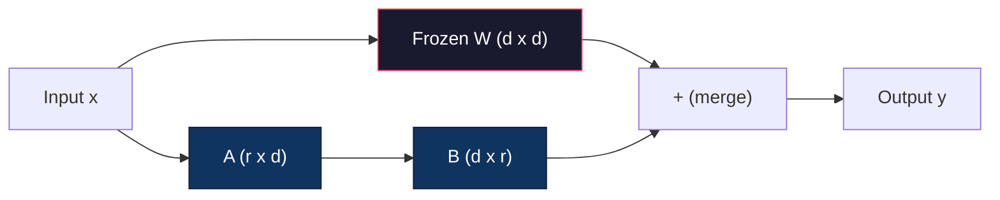
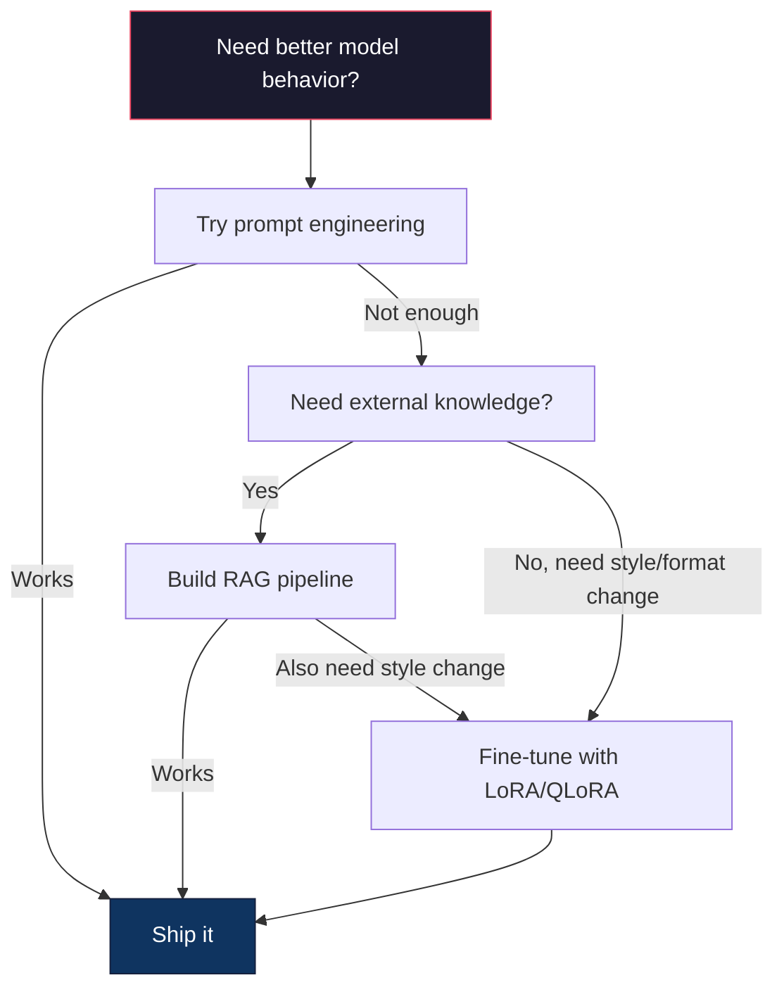

# 08 · 使用 LoRA 与 QLoRA 进行微调

> 对一个 7B 模型做全量微调需要 56GB 显存。你没有那么多显存，大多数公司也没有。LoRA 让你只训练不到 1% 的参数，就能在 6GB 显存里微调同一个模型。这不是一种妥协——在大多数任务上，它的质量与全量微调持平。整个开源微调生态都建立在这一个技巧之上。

**类型：** 实战构建
**语言：** Python
**前置：** 第 10 阶段，第 06 课（指令微调 / SFT）
**时长：** 约 75 分钟
**相关：** 第 10 阶段从零讲解了 SFT/DPO 训练循环。本课把那些循环接入到 2026 年的 PEFT 工具链中（PEFT、TRL、Unsloth、Axolotl、LLaMA-Factory）。

## 学习目标

- 通过把低秩适配矩阵（A 与 B）注入到预训练模型的注意力层中来实现 LoRA
- 计算 LoRA 相比全量微调节省的参数量：在 d_model 维度下使用秩 r，只训练 2*r*d 个参数，而不是 d^2 个
- 使用「QLoRA」（4-bit 量化基座 + LoRA 适配器）微调一个模型，使其能塞进消费级 GPU 的显存
- 把 LoRA 权重合并回基座模型以用于部署，并对比有无适配器时的推理速度

## 问题所在

你有一个基座模型，比如 Llama 3 8B。你希望它能用你公司的口吻回答客服工单。「监督微调（SFT）」就是答案。但 SFT 有一个成本问题。

全量微调会更新模型中的每一个参数。Llama 3 8B 有 80 亿个参数。在 fp16 下，每个参数占 2 字节。光是加载权重就要 16GB。训练期间，你还需要梯度（16GB）、Adam 的优化器状态（动量 + 方差共 32GB）以及激活值。总计：一个 8B 模型大约需要 56GB 显存。

一块 A100 80GB 勉强能塞下。两块 A100 在云服务商上要 3-4 美元/小时。在 50,000 条样本上训练 3 个 epoch 需要 6-10 小时。也就是说每次实验 30-40 美元。跑 10 次实验把超参数调对，部署任何东西之前你就已经花掉了 400 美元。

把规模放大到 Llama 3 70B，数字就荒谬了。光权重就要 140GB。你得用集群。每次实验 100 美元以上。

还有一个更深层的问题。全量微调会修改模型中的每一个权重。如果你在客服数据上微调，可能会损害模型的通用能力。这被称为「灾难性遗忘（catastrophic forgetting）」。模型在你的任务上变好了，却在其他所有事情上变差了。

你需要一种方法：训练更少的参数，使用更少的内存，并且不破坏模型已有的知识。

## 核心概念

### LoRA：低秩适配

微软的 Edward Hu 及其同事于 2021 年 6 月发表了 LoRA。论文的洞见是：微调期间的权重更新具有低「内在秩（intrinsic rank）」。你不需要更新一个 4096x4096 权重矩阵中全部 1670 万个参数。这次更新中有用的信息，可以由一个秩为 16 或 32 的矩阵来捕捉。

数学是这样的。一个标准的线性层计算：

```
y = Wx
```

其中 W 是一个 d_out x d_in 的矩阵。对于一个 4096x4096 的注意力投影，这就是 16,777,216 个参数。

LoRA 冻结 W，并加上一个低秩分解：

```
y = Wx + BAx
```

其中 B 是 (d_out x r)，A 是 (r x d_in)。秩 r 远小于 d——通常为 8、16 或 32。

对于一个 4096x4096 层、r=16 的情况：
- 原始参数：4096 x 4096 = 16,777,216
- LoRA 参数：(4096 x 16) + (16 x 4096) = 65,536 + 65,536 = 131,072
- 缩减比例：131,072 / 16,777,216 = 0.78%

你只训练 0.78% 的参数，却能获得 95-100% 的质量。



A 用一个随机高斯分布初始化。B 初始化为零。这意味着 LoRA 的贡献从零开始——模型从其原始行为开始训练，并逐渐学到这次适配。

### 缩放因子：Alpha

LoRA 引入了一个缩放因子 alpha，用于控制低秩更新对输出的影响程度：

```
y = Wx + (alpha / r) * BAx
```

当 alpha = r 时，缩放为 1 倍。当 alpha = 2r（常见的默认值）时，缩放为 2 倍。这个超参数独立于基础学习率，控制着 LoRA 路径的学习率。

实用指引：
- alpha = 2 * rank 是社区常见约定（原论文在大多数实验中使用 alpha = rank）
- alpha = rank 给出 1 倍缩放，保守但稳定
- 更高的 alpha 意味着每一步的更新更大，这可能加速收敛，也可能导致不稳定

### 在哪里应用 LoRA

一个 transformer 有许多线性层。你不需要给所有层都加上 LoRA。原论文测试了不同的组合：

| 目标层 | 可训练参数 (7B) | 质量 |
|--------------|----------------------|---------|
| 仅 q_proj | 4.7M | 良好 |
| q_proj + v_proj | 9.4M | 更好 |
| q_proj + k_proj + v_proj + o_proj | 18.9M | 注意力部分的最佳选择 |
| 全部线性层（注意力 + MLP） | 37.7M | 增益有限，参数翻倍 |

大多数任务的最佳折中点：q_proj + v_proj。它针对自注意力中的查询（query）和值（value）投影，这两者控制着模型关注什么、以及提取哪些信息。加上 MLP 层对代码生成这类复杂任务有帮助，但会使参数量翻倍，而在更简单的任务上收益递减。

### 秩的选择

秩 r 控制着适配的表达能力：

| 秩 | 可训练参数（每层） | 最适合 |
|------|---------------------------|----------|
| 4 | 32,768 | 简单分类、情感分析 |
| 8 | 65,536 | 单领域问答、摘要 |
| 16 | 131,072 | 多领域任务、指令遵循 |
| 32 | 262,144 | 复杂推理、代码生成 |
| 64 | 524,288 | 对大多数任务收益递减 |
| 128 | 1,048,576 | 极少有必要 |

Hu 等人证明，对于简单任务，r=4 就已经能捕捉大部分适配。r=8 和 r=16 是实践中最常见的选择。超过 r=64 很少能提升质量，反而开始失去 LoRA 的内存优势。

### QLoRA：4-bit 量化 + LoRA

华盛顿大学的 Tim Dettmers 及其同事于 2023 年 5 月发表了 QLoRA。其思路是：把冻结的基座模型量化到 4-bit 精度，然后在其上叠加 fp16 精度的 LoRA 适配器。

这极大地改变了内存方程：

| 方法 | 权重内存 (7B) | 训练内存 (7B) | 所需 GPU |
|--------|-------------------|---------------------|-------------|
| 全量微调 (fp16) | 14GB | ~56GB | 1x A100 80GB |
| LoRA (fp16 基座) | 14GB | ~18GB | 1x A100 40GB |
| QLoRA (4-bit 基座) | 3.5GB | ~6GB | 1x RTX 3090 24GB |

QLoRA 做出了三项技术贡献：

**NF4（Normal Float 4-bit，正态浮点 4-bit）**：一种专为神经网络权重设计的新数据类型。神经网络权重大致服从正态分布。NF4 把它的 16 个量化级别放在标准正态分布的分位点上。对于正态分布的数据，这在信息论意义上是最优的。它比均匀的 4-bit 量化（INT4）或标准的 Float4 丢失更少的信息。

**双重量化（Double quantization）**：量化常数本身也占用内存。每 64 个权重组成的块需要一个 fp32 的缩放因子（4 字节）。对于一个 7B 模型，这就额外多出 0.4GB。双重量化把这些常数量化到 fp8，把开销降到 0.1GB。虽小，但积少成多。

**分页优化器（Paged optimizers）**：训练期间，优化器状态（Adam 的动量与方差）在长序列上可能超出 GPU 内存。分页优化器利用 NVIDIA 的统一内存，在 GPU 内存耗尽时自动把优化器状态分页到 CPU 内存，需要时再分页回来。这能避免 OOM 崩溃，代价是损失一些吞吐量。

### 质量问题

减少参数或量化基座会损害质量吗？多篇论文给出的结果如下：

| 方法 | MMLU (5-shot) | MT-Bench | HumanEval |
|--------|--------------|----------|-----------|
| 全量微调 (Llama 2 7B) | 48.3 | 6.72 | 14.6 |
| LoRA r=16 | 47.9 | 6.68 | 14.0 |
| QLoRA r=16 (NF4) | 47.5 | 6.61 | 13.4 |
| QLoRA r=64 (NF4) | 48.1 | 6.70 | 14.2 |

r=16 的 LoRA 在大多数基准上与全量微调的差距都在 1% 以内。r=16 的 QLoRA 又损失了零点几个百分点。r=64 的 QLoRA 基本与全量微调持平，同时少用 90% 的内存。

### 真实世界的成本

在 50,000 条样本上微调 Llama 3 8B（3 个 epoch）：

| 方法 | GPU | 时间 | 成本 |
|--------|-----|------|------|
| 全量微调 | 2x A100 80GB | 8 小时 | ~$32 |
| LoRA r=16 | 1x A100 40GB | 4 小时 | ~$8 |
| QLoRA r=16 | 1x RTX 4090 24GB | 6 小时 | ~$5 |
| QLoRA r=16 (Unsloth) | 1x RTX 4090 24GB | 2.5 小时 | ~$2 |
| QLoRA r=16 | 1x T4 16GB | 12 小时 | ~$4 |

在单块消费级 GPU 上跑 QLoRA，成本比一顿午饭还便宜。这就是为什么开源权重微调社区在 2023 年爆发式增长，也是为什么到 2026 年下面列出的每一个训练框架都默认内置 QLoRA。

### 2026 年的 PEFT 技术栈

| 框架 | 它是什么 | 何时选用 |
|-----------|-----------|-----------|
| **Hugging Face PEFT** | LoRA/QLoRA/DoRA/IA3 的标准库 | 你想要原始的掌控力，且你的训练循环已经基于 `transformers.Trainer` |
| **TRL** | HF 的「从反馈中强化学习」训练器（SFT、DPO、GRPO、PPO、ORPO） | 你需要在 SFT 之后做 DPO/GRPO；构建于 PEFT 之上 |
| **Unsloth** | 用 Triton 核重写的前向/反向传播 | 你想要 2-5 倍加速 + 一半显存且不损失精度；Llama/Mistral/Qwen 系列 |
| **Axolotl** | 在 PEFT + TRL + DeepSpeed + Unsloth 之上的 YAML 配置封装 | 你想要可复现、版本受控的训练运行 |
| **LLaMA-Factory** | 在 PEFT + TRL 之上的 GUI/CLI/API | 你想要零代码微调；支持 100+ 模型系列 |
| **torchtune** | 原生 PyTorch 配方，不依赖 `transformers` | 你想要最少的依赖，且你的团队已经统一标准化在 PyTorch 上 |

经验法则：研究用途或一次性实验 → PEFT。可重复的生产管线 → 启用 Unsloth 核的 Axolotl。用完即弃的原型验证 → LLaMA-Factory。

### 合并适配器

训练完成后，你有两样东西：冻结的基座模型，以及一个小小的 LoRA 适配器（通常 10-100MB）。你可以：

1. **保持分离**：加载基座模型，再在其上加载适配器。为不同任务切换适配器。这就是你如何用一个基座模型来服务多个微调变体。

2. **永久合并**：计算 W' = W + (alpha/r) * BA，并把结果保存为一个新的完整模型。合并后的模型与原模型大小相同。没有推理开销，也没有需要管理的适配器。

要服务多个任务（客服适配器、代码适配器、翻译适配器），就保持分离。要部署单个专用模型，就合并。

用于组合多个适配器的高级合并技术：

- **TIES-Merging**（Yadav 等人，2023）：裁剪小幅度的参数，解决符号冲突，然后合并。减少适配器之间的相互干扰。
- **DARE**（Yu 等人，2023）：在合并前随机丢弃适配器参数，并对其余参数重新缩放。在组合能力方面出人意料地有效。
- **任务算术（Task arithmetic）**：直接对适配器权重做加减。把一个"代码"适配器和一个"数学"适配器相加，往往能得到一个两者都擅长的模型。

### 何时不该微调

微调是第三选择，不是第一选择。

**第一：提示工程。** 写一个更好的系统提示。加上少样本示例。使用思维链。这不花钱，只要几分钟。如果提示就能让你达到 80% 的效果，你大概率不需要微调。

**第二：RAG。** 如果模型需要了解你的特定数据（文档、知识库、产品目录），检索比把这些知识烘焙进权重更便宜、更易维护。参见第 06 课。

**第三：微调。** 当你需要模型采用某种通过提示无法实现的特定风格、格式或推理模式时，使用它。当你需要一致的结构化输出时。当你需要把一个更大的模型蒸馏成一个更小的模型时。当延迟很重要、而你又承受不起少样本提示带来的额外 token 时。



## 动手构建

我们用纯 PyTorch 从零实现 LoRA。不用任何库，没有魔法。你将构建 LoRA 层、把它注入到模型中、训练它，并把权重合并回去。

### 第 1 步：LoRA 层

```python
import torch
import torch.nn as nn
import math

class LoRALayer(nn.Module):
    def __init__(self, in_features, out_features, rank=8, alpha=16):
        super().__init__()
        self.rank = rank
        self.alpha = alpha
        self.scaling = alpha / rank

        self.A = nn.Parameter(torch.randn(in_features, rank) * (1 / math.sqrt(rank)))
        self.B = nn.Parameter(torch.zeros(rank, out_features))

    def forward(self, x):
        return (x @ self.A @ self.B) * self.scaling
```

A 用经过缩放的随机值初始化。B 初始化为零。乘积 BA 从零开始，因此模型从其原始行为出发。

### 第 2 步：包裹 LoRA 的线性层

```python
class LinearWithLoRA(nn.Module):
    def __init__(self, linear, rank=8, alpha=16):
        super().__init__()
        self.linear = linear
        self.lora = LoRALayer(
            linear.in_features, linear.out_features, rank, alpha
        )

        for param in self.linear.parameters():
            param.requires_grad = False

    def forward(self, x):
        return self.linear(x) + self.lora(x)
```

原始的线性层被冻结。只有 LoRA 参数（A 和 B）是可训练的。

### 第 3 步：把 LoRA 注入模型

```python
def inject_lora(model, target_modules, rank=8, alpha=16):
    for param in model.parameters():
        param.requires_grad = False

    lora_layers = {}
    for name, module in model.named_modules():
        if isinstance(module, nn.Linear):
            if any(t in name for t in target_modules):
                parent_name = ".".join(name.split(".")[:-1])
                child_name = name.split(".")[-1]
                parent = dict(model.named_modules())[parent_name]
                lora_linear = LinearWithLoRA(module, rank, alpha)
                setattr(parent, child_name, lora_linear)
                lora_layers[name] = lora_linear
    return lora_layers
```

首先，冻结模型中的每一个参数。然后遍历模型树，找到匹配你目标名称的线性层，并把它们替换为包裹了 LoRA 的版本。LoRA 的 A 和 B 矩阵是整个模型中唯一可训练的参数。

### 第 4 步：统计参数量

```python
def count_parameters(model):
    total = sum(p.numel() for p in model.parameters())
    trainable = sum(p.numel() for p in model.parameters() if p.requires_grad)
    frozen = total - trainable
    return {
        "total": total,
        "trainable": trainable,
        "frozen": frozen,
        "trainable_pct": 100 * trainable / total if total > 0 else 0
    }
```

### 第 5 步：把权重合并回去

```python
def merge_lora_weights(model):
    for name, module in model.named_modules():
        if isinstance(module, LinearWithLoRA):
            with torch.no_grad():
                merged = (
                    module.lora.A @ module.lora.B
                ) * module.lora.scaling
                module.linear.weight.data += merged.T
            parent_name = ".".join(name.split(".")[:-1])
            child_name = name.split(".")[-1]
            if parent_name:
                parent = dict(model.named_modules())[parent_name]
            else:
                parent = model
            setattr(parent, child_name, module.linear)
```

合并之后，LoRA 层就消失了。模型与原模型大小相同，适配已被烘焙进权重里。没有推理开销。

### 第 6 步：模拟 QLoRA 量化

```python
def quantize_to_nf4(tensor, block_size=64):
    blocks = tensor.reshape(-1, block_size)
    scales = blocks.abs().max(dim=1, keepdim=True).values / 7.0
    scales = torch.clamp(scales, min=1e-8)
    quantized = torch.round(blocks / scales).clamp(-8, 7).to(torch.int8)
    return quantized, scales

def dequantize_from_nf4(quantized, scales, original_shape):
    dequantized = quantized.float() * scales
    return dequantized.reshape(original_shape)
```

这通过把权重映射到每个 64 元素块内的 16 个离散级别，来模拟 4-bit 量化。生产级 QLoRA 使用 bitsandbytes 库在 GPU 上实现真正的 NF4。

### 第 7 步：训练循环

```python
def train_lora(model, data, epochs=5, lr=1e-3, batch_size=4):
    optimizer = torch.optim.AdamW(
        [p for p in model.parameters() if p.requires_grad], lr=lr
    )
    criterion = nn.MSELoss()

    losses = []
    for epoch in range(epochs):
        epoch_loss = 0.0
        n_batches = 0
        indices = torch.randperm(len(data["inputs"]))

        for i in range(0, len(indices), batch_size):
            batch_idx = indices[i:i + batch_size]
            x = data["inputs"][batch_idx]
            y = data["targets"][batch_idx]

            output = model(x)
            loss = criterion(output, y)

            optimizer.zero_grad()
            loss.backward()
            optimizer.step()

            epoch_loss += loss.item()
            n_batches += 1

        avg_loss = epoch_loss / n_batches
        losses.append(avg_loss)

    return losses
```

### 第 8 步：完整演示

```python
def demo():
    torch.manual_seed(42)
    d_model = 256
    n_classes = 10

    model = nn.Sequential(
        nn.Linear(d_model, 512),
        nn.ReLU(),
        nn.Linear(512, 512),
        nn.ReLU(),
        nn.Linear(512, n_classes),
    )

    n_samples = 500
    x = torch.randn(n_samples, d_model)
    y = torch.randint(0, n_classes, (n_samples,))
    y_onehot = torch.zeros(n_samples, n_classes).scatter_(1, y.unsqueeze(1), 1.0)

    data = {"inputs": x, "targets": y_onehot}

    params_before = count_parameters(model)

    lora_layers = inject_lora(
        model, target_modules=["0", "2"], rank=8, alpha=16
    )

    params_after = count_parameters(model)

    losses = train_lora(model, data, epochs=20, lr=1e-3)

    merge_lora_weights(model)
    params_merged = count_parameters(model)

    return {
        "params_before": params_before,
        "params_after": params_after,
        "params_merged": params_merged,
        "losses": losses,
    }
```

这个演示创建了一个小模型，把 LoRA 注入到两个层中，训练它，然后把权重合并回去。在 LoRA 训练期间，参数量从全部可训练降到约 1% 可训练，合并之后又回到原始架构。

## 实际运用

借助 Hugging Face 生态，在真实模型上做 LoRA 大约只需 20 行代码：

```python
from transformers import AutoModelForCausalLM, AutoTokenizer
from peft import LoraConfig, get_peft_model, TaskType

model = AutoModelForCausalLM.from_pretrained("meta-llama/Llama-3.1-8B")
tokenizer = AutoTokenizer.from_pretrained("meta-llama/Llama-3.1-8B")

lora_config = LoraConfig(
    task_type=TaskType.CAUSAL_LM,
    r=16,
    lora_alpha=32,
    lora_dropout=0.05,
    target_modules=["q_proj", "v_proj"],
)

model = get_peft_model(model, lora_config)
model.print_trainable_parameters()
```

对于 QLoRA，加上 bitsandbytes 量化：

```python
from transformers import BitsAndBytesConfig

bnb_config = BitsAndBytesConfig(
    load_in_4bit=True,
    bnb_4bit_quant_type="nf4",
    bnb_4bit_compute_dtype=torch.bfloat16,
    bnb_4bit_use_double_quant=True,
)

model = AutoModelForCausalLM.from_pretrained(
    "meta-llama/Llama-3.1-8B",
    quantization_config=bnb_config,
    device_map="auto",
)

model = get_peft_model(model, lora_config)
```

就这样。相同的训练循环，相同的数据管线。基座模型现在以 4-bit 存在，LoRA 适配器以 fp16 训练，整套东西塞进 6GB。

用 Hugging Face Trainer 进行训练：

```python
from transformers import TrainingArguments, Trainer
from datasets import load_dataset

dataset = load_dataset("tatsu-lab/alpaca", split="train[:5000]")

training_args = TrainingArguments(
    output_dir="./lora-llama",
    num_train_epochs=3,
    per_device_train_batch_size=4,
    gradient_accumulation_steps=4,
    learning_rate=2e-4,
    fp16=True,
    logging_steps=10,
    save_strategy="epoch",
    optim="paged_adamw_8bit",
)

trainer = Trainer(
    model=model,
    args=training_args,
    train_dataset=dataset,
)

trainer.train()

model.save_pretrained("./lora-adapter")
```

保存下来的适配器只有 10-100MB。基座模型保持不变。你可以在 Hugging Face Hub 上分享适配器，而无需重新分发完整模型。

## 交付成果

本课产出：
- `outputs/prompt-lora-advisor.md` —— 一个帮助你为特定任务决定 LoRA 秩、目标模块和超参数的提示
- `outputs/skill-fine-tuning-guide.md` —— 一个向 agent 传授"何时以及如何微调"决策树的技能

## 练习

1. **秩的消融研究。** 用秩 2、4、8、16、32 和 64 运行该演示。绘制最终损失对秩的曲线。找到收益递减的拐点——在那个点上，把秩翻倍不再能让损失减半。对于 256 维特征上的简单分类任务，这个点应该在 r=8-16 附近。

2. **目标模块对比。** 修改 inject_lora，分别只针对层 "0"、只针对层 "2"、只针对层 "4"，以及同时针对这三者。每个变体训练 20 个 epoch。对比收敛速度和最终损失。这映射了现实中关于针对 q_proj、v_proj 还是所有线性层的真实决策。

3. **量化误差分析。** 取训练好的模型在 quantize_to_nf4 / dequantize_from_nf4 前后的权重矩阵。计算均方误差、最大绝对误差，以及原始权重与重建权重之间的相关性。尝试 32、64、128 和 256 的 block_size 取值。

4. **多适配器服务。** 在数据的不同子集（偶数下标 vs 奇数下标）上训练两个 LoRA 适配器。保存这两个适配器。把基座模型加载一次，然后切换适配器，验证它们对同一输入产生不同的输出。这就是生产系统如何用一个基座模型来服务多个微调模型。

5. **合并 vs 未合并的推理。** 在相同的 100 个输入上，对比 merge_lora_weights 前后 LoRA 模型的输出。验证两者的输出一致（在 1e-5 的浮点容差内）。然后对二者的推理速度做基准测试——合并后应该略快一些，因为它是单次矩阵乘法而非两次。

## 关键术语

| 术语 | 人们怎么说 | 它实际的含义 |
|------|----------------|----------------------|
| LoRA | "高效微调" | 低秩适配（Low-Rank Adaptation）：冻结基座权重，训练两个小矩阵 A 和 B，其乘积近似完整的权重更新 |
| QLoRA | "在笔记本上微调" | 量化 LoRA：以 4-bit NF4 加载基座模型，在其上以 fp16 训练 LoRA 适配器，使 7B 微调能在 6GB 显存内完成 |
| 秩 (r) | "模型能学多少" | A 和 B 矩阵的内维度；在表达能力与参数量之间做权衡 |
| Alpha | "LoRA 学习率" | 应用于 LoRA 输出的缩放因子；alpha/r 缩放适配对最终输出的贡献 |
| NF4 | "4-bit 量化" | Normal Float 4：一种 4-bit 数据类型，量化级别位于正态分布的分位点上，对神经网络权重最优 |
| 适配器 (Adapter) | "训练好的那一小块" | 保存为独立文件（10-100MB）的 LoRA A 和 B 矩阵，可加载到基座模型的任意副本之上 |
| 目标模块 (Target modules) | "对哪些层做 LoRA" | 注入 LoRA 适配器的具体线性层（q_proj、v_proj 等） |
| 合并 (Merging) | "把它烘焙进去" | 计算 W + (alpha/r) * BA 并替换原始权重，消除推理时的适配器开销 |
| 分页优化器 (Paged optimizers) | "训练时别 OOM" | 在 GPU 内存耗尽时，把优化器状态（Adam 动量、方差）卸载到 CPU |
| 灾难性遗忘 (Catastrophic forgetting) | "微调把其他一切都搞坏了" | 当更新所有权重导致模型丢失先前学到的能力时 |

## 延伸阅读

- Hu 等人，《LoRA: Low-Rank Adaptation of Large Language Models》(2021) —— 引入低秩分解方法的原始论文，在 GPT-3 175B 上以低至 4 的秩进行了测试
- Dettmers 等人，《QLoRA: Efficient Finetuning of Quantized Language Models》(2023) —— 引入了 NF4、双重量化和分页优化器，使 65B 微调能在单块 48GB GPU 上完成
- PEFT 库文档（huggingface.co/docs/peft）—— Hugging Face 生态中 LoRA、QLoRA 及其他参数高效方法的标准库
- Yadav 等人，《TIES-Merging: Resolving Interference When Merging Models》(2023) —— 在不损失质量的前提下组合多个 LoRA 适配器的技术
- [Rafailov 等人，《Direct Preference Optimization: Your Language Model is Secretly a Reward Model》(NeurIPS 2023)](https://arxiv.org/abs/2305.18290) —— DPO 的推导；紧接在 SFT 之后的偏好微调阶段，无需奖励模型。
- [TRL 文档](https://huggingface.co/docs/trl/) —— `SFTTrainer`、`DPOTrainer`、`KTOTrainer` 以及与 PEFT/bitsandbytes/Unsloth 集成接口的官方参考。
- [Unsloth 文档](https://docs.unsloth.ai/) —— 将微调吞吐量翻倍、内存减半的融合核；TRL 之下的性能层。
- [Axolotl 文档](https://axolotl-ai-cloud.github.io/axolotl/) —— 以 YAML 配置的多 GPU SFT/DPO/QLoRA 训练器；手写脚本的"配置即代码"替代方案。
