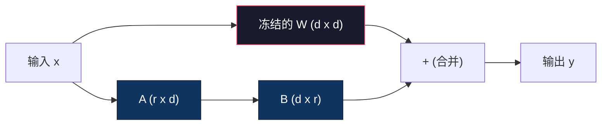
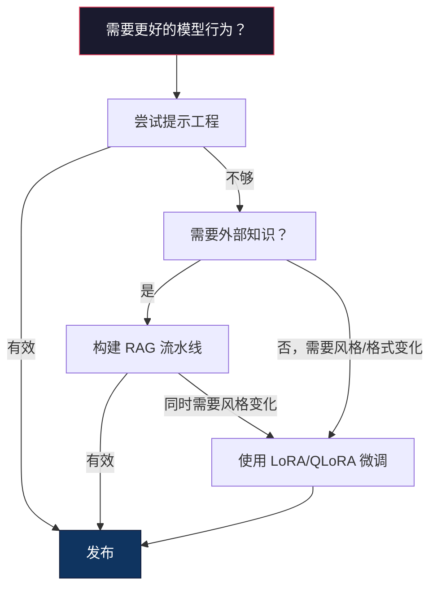

# 使用 LoRA 和 QLoRA 进行微调

> 对一个 7B 模型进行全参数微调需要 56GB 的显存。你不具备这一条件，大多数公司也不具备。LoRA 让你能在 6GB 显存内微调同样的模型，仅训练少于 1% 的参数。这并非妥协——它在大多数任务上能达到与全参数微调相当的质量。整个开源的微调生态系统都依赖于这一技巧。

**类型：** 构建
**语言：** Python
**前置条件：** 阶段 10，第 06 课（指令微调 / SFT）
**预计用时：** 约 75 分钟
**相关：** 阶段 10 从头覆盖了 SFT/DPO 循环。本课将这些内容接入 2026 年的 PEFT 工具包（PEFT、TRL、Unsloth、Axolotl、LLaMA-Factory）。

## 学习目标

- 通过将低秩适配器矩阵（A 和 B）注入预训练模型的自注意力层来实现 LoRA
- 计算 LoRA 与全参数微调相比的参数节省量：维度为 d_model，秩为 r 时，训练 2*r*d 个参数而非 d^2
- 使用 QLoRA（4 位量化基础模型 + LoRA 适配器）微调模型，使其适应消费级 GPU 内存
- 将 LoRA 权重合并回基础模型用于部署，并比较有无适配器时的推理速度

## 问题痛点

你拥有一个基础模型。Llama 3 8B。你希望它能够以你公司的口吻回答客户支持工单。SFT 是解决方案。但 SFT 存在成本问题。

全参数微调会更新模型中的每一个参数。Llama 3 8B 拥有 80 亿个参数。在 fp16 下，每个参数占用 2 字节。仅加载权重就需要 16GB。训练期间，你还需要梯度（16GB）、Adam 优化器状态（动量和方差共 32GB）以及激活值。总计：单个 8B 模型大约需要 56GB 显存。

一块 A100 80GB 勉强能容纳。两块 A100 在云服务商处每小时租金 3-4 美元。在 50,000 个样本上训练 3 个 epoch 需要 6-10 小时。每次实验花费 30-40 美元。为了获得正确的超参数运行 10 次实验，在部署任何东西之前你就已经花掉了 400 美元。

将规模扩大到 Llama 3 70B，数字会变得荒谬。仅权重就需要 140GB。你需要一个集群。每次实验超过 100 美元。

还有一个更深层次的问题。全参数微调会修改模型中的每一个权重。如果你在客户支持数据上微调，可能会降低模型的通用能力。这被称为灾难性遗忘（catastrophic forgetting）。模型在你任务上变得更擅长，而在其他一切上变得更糟糕。

你需要一种方法：训练更少的参数，使用更少的内存，并且不破坏模型已有的知识。

## 核心概念

### LoRA：低秩自适应（Low-Rank Adaptation）

Edward Hu 及其微软同事于 2021 年 6 月发表了 LoRA。论文的洞见在于：微调过程中的权重更新具有低的内部秩。你不需要更新 4096x4096 权重矩阵中的全部 1677 万个参数。更新中有用的信息可以被一个秩为 16 或 32 的矩阵捕获。

以下是数学原理。一个标准线性层计算：

```
y = Wx
```

其中 W 是 d_out x d_in 的矩阵。对于一个 4096x4096 的注意力投影，这有 16,777,216 个参数。

LoRA 冻结 W 并添加一个低秩分解：

```
y = Wx + BAx
```

其中 B 是 (d_out x r)，A 是 (r x d_in)。秩 r 远小于 d——典型值为 8, 16 或 32。

对于 4096x4096 图层且 r=16：
- 原始参数：4096 x 4096 = 16,777,216
- LoRA 参数：(4096 x 16) + (16 x 4096) = 65,536 + 65,536 = 131,072
- 缩减比例：131,072 / 16,777,216 = 0.78%

你仅训练 0.78% 的参数，却获得 95-100% 的质量。



A 用随机高斯初始化，B 初始化为零。这意味着 LoRA 的贡献从零开始——模型从其原始行为开始训练，并逐渐学习自适应。

### 缩放因子：Alpha

LoRA 引入了一个缩放因子 alpha，它控制低秩更新对输出的影响程度：

```
y = Wx + (alpha / r) * BAx
```

当 alpha = r 时，缩放为 1x。当 alpha = 2r（常见默认值）时，缩放为 2x。这个超参数独立于基础学习率来控制 LoRA 路径的学习率。

实践指南：
- alpha = 2 * rank 是一个常见的社区约定（原始论文在大多数实验中使用 alpha = rank）
- alpha = rank 提供 1x 缩放，保守但稳定
- 更高的 alpha 意味着每步更新更大，可能加速收敛或导致不稳定

### 在何处应用 LoRA

一个 Transformer 中有许多线性层。你不必为所有线性层添加 LoRA。原始论文测试了不同的组合：

| 目标层 | 可训练参数量（7B） | 质量 |
|--------------|----------------------|---------|
| 仅 q_proj | 4.7M | 好 |
| q_proj + v_proj | 9.4M | 更好 |
| q_proj + k_proj + v_proj + o_proj | 18.9M | 注意力最佳 |
| 所有线性层（注意力 + MLP） | 37.7M | 边际增益，参数翻倍 |

大多数任务的甜点区间：q_proj + v_proj。这针对自注意力中的查询和值投影，它们控制模型关注什么以及提取什么信息。对于复杂任务如代码生成，添加 MLP 层有帮助，但会在简单任务上因收益递减而将参数量翻倍。

### 秩的选择

秩 r 控制自适应的表达能力：

| 秩 | 可训练参数量（每层） | 最佳适用场景 |
|------|---------------------------|----------|
| 4 | 32,768 | 简单分类、情感分析 |
| 8 | 65,536 | 单领域问答、摘要 |
| 16 | 131,072 | 多领域任务、指令跟随 |
| 32 | 262,144 | 复杂推理、代码生成 |
| 64 | 524,288 | 大多数任务收益递减 |
| 128 | 1,048,576 | 极少有理由使用 |

Hu 等人表明，对于简单任务，r=4 已经能捕获大部分自适应。实践中 r=8 和 r=16 是最常见的选择。超过 r=64 很少能提升质量，并且开始失去 LoRA 的内存优势。

### QLoRA：4 位量化 + LoRA

Tim Dettmers 及其华盛顿大学同事于 2023 年 5 月发表了 QLoRA。思路：将冻结的基础模型量化到 4 位精度，然后在上面附加 fp16 的 LoRA 适配器。

这极大地改变了内存等式：

| 方法 | 权重内存（7B） | 训练内存（7B） | 所需 GPU |
|--------|-------------------|---------------------|-------------|
| 全参数微调（fp16） | 14GB | ~56GB | 1x A100 80GB |
| LoRA（fp16 基础模型） | 14GB | ~18GB | 1x A100 40GB |
| QLoRA（4 位基础模型） | 3.5GB | ~6GB | 1x RTX 3090 24GB |

QLoRA 做出了三项技术贡献：

**NF4（Normal Float 4-bit，标准浮点 4 位）**：一种专为神经网络权重设计的新数据类型。神经网络权重大致服从正态分布。NF4 将其 16 个量化级别置于标准正态分布的分位数上。这在信息论上对于正态分布数据是最优的。它比均匀 4 位量化（INT4）或标准 Float4 丢失的信息更少。

**双重量化（Double quantization）**：量化常数本身也会消耗内存。每 64 个权重的块需要一个 fp32 缩放因子（4 字节）。对于一个 7B 模型，这额外增加了 0.4GB。双重量化将这些常数量化为 fp8，将开销降低到 0.1GB。很小，但积少成多。

**分页优化器（Paged optimizers）**：训练过程中，优化器状态（Adam 的动量和方差）在长序列下可能超出 GPU 内存。分页优化器利用 NVIDIA 的统一内存，在 GPU 内存耗尽时自动将优化器状态分页到 CPU 内存，并在需要时换回。这以一定吞吐量为代价防止了 OOM 崩溃。

### 质量问题

减少参数或量化基础模型是否会影响质量？多篇论文的结果：

| 方法 | MMLU（5-shot） | MT-Bench | HumanEval |
|--------|--------------|----------|-----------|
| 全参数微调（Llama 2 7B） | 48.3 | 6.72 | 14.6 |
| LoRA r=16 | 47.9 | 6.68 | 14.0 |
| QLoRA r=16 (NF4) | 47.5 | 6.61 | 13.4 |
| QLoRA r=64 (NF4) | 48.1 | 6.70 | 14.2 |

LoRA r=16 在大多数基准测试上与全参数微调相差 1% 以内。QLoRA r=16 再损失千分之几。QLoRA r=64 基本与全参数微调相当，同时节省了 90% 的内存。

### 实际成本

在 50,000 个样本（3 个 epoch）上微调 Llama 3 8B：

| 方法 | GPU | 时间 | 成本 |
|--------|-----|------|------|
| 全参数微调 | 2x A100 80GB | 8 小时 | ~$32 |
| LoRA r=16 | 1x A100 40GB | 4 小时 | ~$8 |
| QLoRA r=16 | 1x RTX 4090 24GB | 6 小时 | ~$5 |
| QLoRA r=16（Unsloth） | 1x RTX 4090 24GB | 2.5 小时 | ~$2 |
| QLoRA r=16 | 1x T4 16GB | 12 小时 | ~$4 |

单块消费级 GPU 上的 QLoRA 成本低于一顿午餐。这就是为什么 2023 年开放权重微调社区爆发，以及为什么到 2026 年，下面的每个训练框架都默认提供 QLoRA。

### 2026 年的 PEFT 技术栈

| 框架 | 本质 | 何时选用 |
|-----------|-----------|-----------|
| **Hugging Face PEFT** | 官方的 LoRA/QLoRA/DoRA/IA3 库 | 你需要原始控制，且训练循环已基于 `transformers.Trainer` |
| **TRL** | HF 的强化从反馈中学习训练器（SFT, DPO, GRPO, PPO, ORPO） | 你需要在 SFT 后进行 DPO/GRPO；构建在 PEFT 之上 |
| **Unsloth** | 对前向/反向传播的 Triton 内核重写 | 你需要 2-5 倍加速 + 一半显存且无精度损失；针对 Llama/Mistral/Qwen 系列 |
| **Axolotl** | 基于 YAML 配置的 PEFT + TRL + DeepSpeed + Unsloth 封装 | 你需要可复现、版本控制的训练运行 |
| **LLaMA-Factory** | 基于 PEFT + TRL 的 GUI/CLI/API | 你想要零代码微调；支持 100+ 模型系列 |
| **torchtune** | 原生 PyTorch 配方，无 `transformers` 依赖 | 你希望最小化依赖，且组织已标准化使用 PyTorch |

经验法则：研究用途或一次性实验 → PEFT。可复现的生产 pipeline → Axolotl 并启用 Unsloth 内核。一次性原型 → LLaMA-Factory。

### 合并适配器

训练后，你拥有两样东西：冻结的基础模型和一个小型的 LoRA 适配器（通常 10-100MB）。你可以：

1. **保持分离**：加载基础模型，再加载适配器。为不同任务切换适配器。这就是从一个基础模型提供多个微调变体的方式。

2. **永久合并**：计算 W' = W + (alpha/r) * BA 并将结果保存为新的完整模型。合并后的模型与原始模型大小相同。无推理开销。无需管理适配器。

对于提供多个任务（客户支持适配器、代码适配器、翻译适配器），保持分离。对于部署单一专用模型，合并。

用于组合多个适配器的高级合并技术：

- **TIES-Merging**（Yadav 等人，2023）：修剪小幅度参数，解决符号冲突，然后合并。减少适配器之间的干扰。
- **DARE**（Yu 等人，2023）：在合并前随机丢弃适配器参数并重新缩放其余部分。对于组合能力出奇地有效。
- **任务算术（Task arithmetic）**：简单地对适配器权重进行加减。添加“代码”适配器和“数学”适配器通常能产生两种能力都擅长的模型。

### 何时不要微调

微调是第三选择，而非第一选择。

**首先：提示工程。** 编写更好的系统提示。添加少样本示例。使用思维链。这零成本，几分钟即可完成。如果提示工程能达到 80% 的效果，你可能不需要微调。

**其次：RAG。** 如果模型需要了解你的特定数据（文档、知识库、产品目录），检索比将知识烘焙到权重中更便宜、更易维护。参见第 06 课。

**再次：微调。** 当你需要模型采用无法通过提示实现的特定风格、格式或推理模式时使用。当你需要一致的格式化输出时使用。当你需要将大型模型蒸馏到更小模型时使用。当延迟至关重要且你无法承受少样本提示带来的额外 token 时使用。



## 动手构建

我们仅用纯 PyTorch 从头实现 LoRA。无需库，无需魔法。你将构建 LoRA 层，将其注入模型，训练它，并将权重合并回去。

### 第 1 步：LoRA 层

```python
import torch
import torch.nn as nn
import math

class LoRALayer(nn.Module):
    def __init__(self, in_features, out_features, rank=8, alpha=16):
        super().__init__()
        self.rank = rank
        self.alpha = alpha
        self.scaling = alpha / rank

        self.A = nn.Parameter(torch.randn(in_features, rank) * (1 / math.sqrt(rank)))
        self.B = nn.Parameter(torch.zeros(rank, out_features))

    def forward(self, x):
        return (x @ self.A @ self.B) * self.scaling
```

A 用缩放的随机值初始化。B 初始化为零。乘积 BA 从零开始，因此模型从原始行为开始。

### 第 2 步：LoRA 包装的线性层

```python
class LinearWithLoRA(nn.Module):
    def __init__(self, linear, rank=8, alpha=16):
        super().__init__()
        self.linear = linear
        self.lora = LoRALayer(
            linear.in_features, linear.out_features, rank, alpha
        )

        for param in self.linear.parameters():
            param.requires_grad = False

    def forward(self, x):
        return self.linear(x) + self.lora(x)
```

原始线性