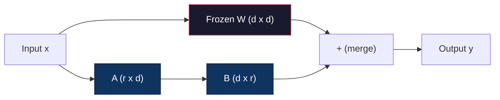
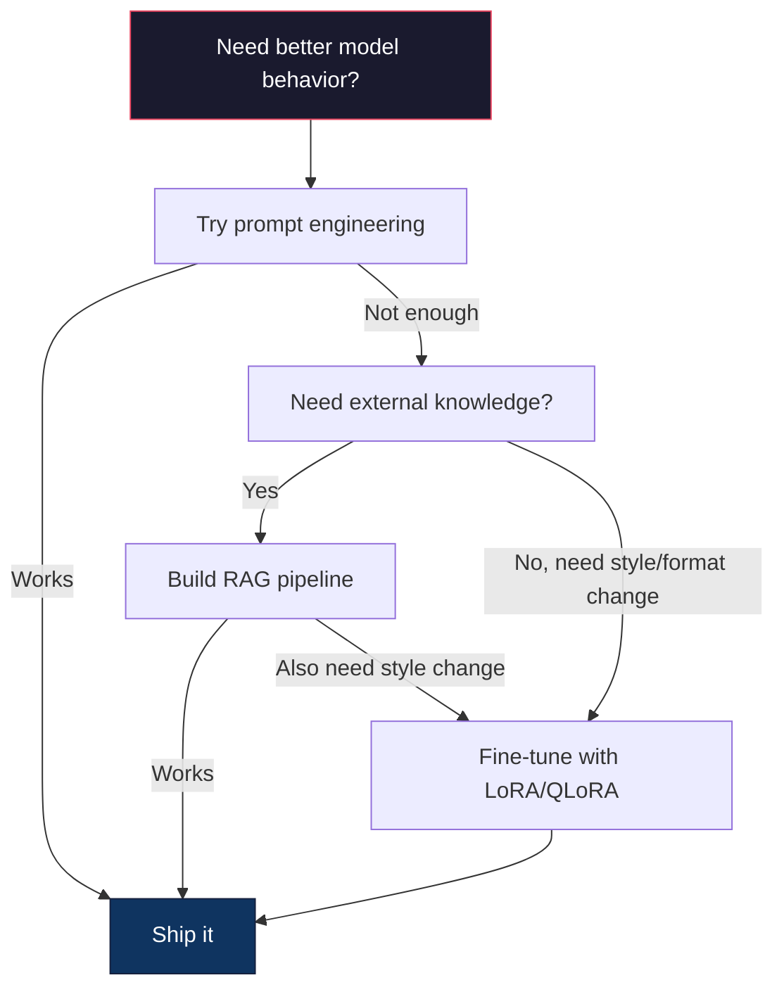

# 使用 LoRA 与 QLoRA 进行微调

> 全量微调一个 7B 模型需要 56GB 显存。你没有那么多显存。大多数公司也没有。LoRA 让你在 6GB 显存下微调同一个模型，只训练不到 1% 的参数。这不是妥协——在大多数任务上它能达到全量微调的质量。整个开源微调生态系统都建立在这个技巧之上。

**类型：** 构建
**语言：** Python
**前置知识：** Phase 10, Lesson 06 (Instruction Tuning / SFT)
**时间：** ~75 分钟
**相关：** Phase 10 涵盖了从零开始的 SFT/DPO 循环。本课将这些接入 2026 年的 PEFT 工具包（PEFT、TRL、Unsloth、Axolotl、LLaMA-Factory）。

## 学习目标

- 通过向预训练模型的注意力层注入低秩适配器矩阵（A 和 B）来实现 LoRA
- 计算 LoRA 相比全量微调的参数节省：秩为 r、维度为 d_model 时，训练 2*r*d 个参数而非 d^2
- 使用 QLoRA（4-bit 量化基座 + LoRA 适配器）在消费级 GPU 显存内微调模型
- 将 LoRA 权重合并回基座模型以进行部署，并比较有/无适配器时的推理速度

## 问题所在

你有一个基座模型。Llama 3 8B。你想让它用你公司的语气回答客户支持工单。SFT 是答案。但 SFT 有一个成本问题。

全量微调更新模型中的每个参数。Llama 3 8B 有 80 亿参数。在 fp16 中，每个参数占 2 字节。仅加载权重就需要 16GB。训练期间，你还需要梯度（16GB）、Adam 优化器状态（动量 + 方差 32GB）和激活值。总计：单个 8B 模型大约需要 56GB 显存。

A100 80GB 勉强能装下。两台 A100 在云服务商处每小时 $3-4。在 50,000 条样本上训练 3 个 epoch 需要 6-10 小时。每次实验 $30-40。运行 10 次实验来调整超参数，在部署任何东西之前你就已经花了 $400。

扩展到 Llama 3 70B，数字变得荒谬。仅权重就需要 140GB。你需要一个集群。每次实验 $100+。

还有一个更深层次的问题。全量微调修改模型中的每个权重。如果你在客户支持数据上微调，可能会降低模型的通用能力。这被称为灾难性遗忘。模型在你的任务上变得更好，但在其他所有事情上变得更差。

你需要一种方法：训练更少的参数、使用更少的显存、并且不破坏模型已有的知识。

## 核心概念

### LoRA: Low-Rank Adaptation

Edward Hu 及其微软同事于 2021 年 6 月发表了 LoRA。论文的核心洞察：微调期间的权重更新具有低内在秩。你不需要更新 4096x4096 权重矩阵中的全部 1670 万个参数。更新中的有用信息可以被一个秩为 16 或 32 的矩阵捕捉。

数学原理如下。标准线性层计算：

```
y = Wx
```

其中 W 是一个 d_out x d_in 矩阵。对于 4096x4096 的注意力投影，这是 16,777,216 个参数。

LoRA 冻结 W 并添加一个低秩分解：

```
y = Wx + BAx
```

其中 B 是 (d_out x r)，A 是 (r x d_in)。秩 r 远小于 d——通常为 8、16 或 32。

对于 4096x4096 层上 r=16：
- 原始参数：4096 x 4096 = 16,777,216
- LoRA 参数：(4096 x 16) + (16 x 4096) = 65,536 + 65,536 = 131,072
- 缩减比例：131,072 / 16,777,216 = 0.78%

你只训练 0.78% 的参数，却获得 95-100% 的质量。



A 用随机高斯初始化。B 初始化为零。这意味着 LoRA 的贡献从零开始——模型从原始行为开始训练，逐渐学习适配。

### 缩放因子：Alpha

LoRA 引入了一个缩放因子 alpha，控制低秩更新对输出的影响程度：

```
y = Wx + (alpha / r) * BAx
```

当 alpha = r 时，缩放为 1x。当 alpha = 2r（常见默认值）时，缩放为 2x。这个超参数独立于基座学习率控制 LoRA 路径的学习率。

实践指导：
- alpha = 2 * rank 是常见的社区惯例（原始论文在大多数实验中使用 alpha = rank）
- alpha = rank 给出 1x 缩放，保守但稳定
- 更高的 alpha 意味着每步更大的更新，可以加速收敛或导致不稳定

### 在哪里应用 LoRA

Transformer 有许多线性层。你不需要给所有层都加上 LoRA。原始论文测试了不同组合：

| 目标层 | 可训练参数 (7B) | 质量 |
|--------------|----------------------|---------|
| q_proj only | 4.7M | 良好 |
| q_proj + v_proj | 9.4M | 更好 |
| q_proj + k_proj + v_proj + o_proj | 18.9M | 注意力层最佳 |
| 所有线性层 (attention + MLP) | 37.7M | 边际收益，2x 参数 |

大多数任务的甜蜜点：q_proj + v_proj。这针对自注意力中的 query 和 value 投影，控制模型关注什么以及提取什么信息。添加 MLP 层对代码生成等复杂任务有帮助，但对简单任务收益递减且参数翻倍。

### 秩的选择

秩 r 控制适配的表达能力：

| 秩 | 可训练参数 (每层) | 最适合 |
|------|---------------------------|----------|
| 4 | 32,768 | 简单分类、情感分析 |
| 8 | 65,536 | 单领域问答、摘要 |
| 16 | 131,072 | 多领域任务、指令遵循 |
| 32 | 262,144 | 复杂推理、代码生成 |
| 64 | 524,288 | 大多数任务收益递减 |
| 128 | 1,048,576 | 很少有必要 |

Hu 等人表明，对于简单任务，r=4 已经能捕捉大部分适配。r=8 和 r=16 是实践中最常见的选择。超过 r=64 很少能改善质量，并开始失去 LoRA 的显存优势。

### QLoRA: 4-Bit 量化 + LoRA

Tim Dettmers 及其华盛顿大学同事于 2023 年 5 月发表了 QLoRA。思路：将冻结的基座模型量化为 4-bit 精度，然后在上面附加 fp16 的 LoRA 适配器。

这极大地改变了显存等式：

| 方法 | 权重显存 (7B) | 训练显存 (7B) | 所需 GPU |
|--------|-------------------|---------------------|-------------|
| 全量微调 (fp16) | 14GB | ~56GB | 1x A100 80GB |
| LoRA (fp16 base) | 14GB | ~18GB | 1x A100 40GB |
| QLoRA (4-bit base) | 3.5GB | ~6GB | 1x RTX 3090 24GB |

QLoRA 做出了三项技术贡献：

**NF4 (Normal Float 4-bit)**：一种专为神经网络权重设计的新数据类型。神经网络权重大致遵循正态分布。NF4 将其 16 个量化级别放在标准正态分布的分位数上。对于正态分布的数据，这在信息论上是最优的。它比均匀 4-bit 量化（INT4）或标准 Float4 损失更少信息。

**Double quantization**：量化常数本身也占用显存。每 64 个权重的块需要一个 fp32 缩放因子（4 字节）。对于 7B 模型，这是额外的 0.4GB。Double quantization 将这些常数量化为 fp8，将开销降低到 0.1GB。虽小，但积少成多。

**Paged optimizers**：训练期间，优化器状态（Adam 的动量和方差）在长序列上可能超过 GPU 显存。Paged optimizers 使用 NVIDIA 的统一内存，在 GPU 显存耗尽时自动将优化器状态分页到 CPU 内存，需要时再分页回来。这以防止 OOM 崩溃为代价，牺牲一些吞吐量。

### 质量问题

减少参数或量化基座会损害质量吗？多篇论文的结果：

| 方法 | MMLU (5-shot) | MT-Bench | HumanEval |
|--------|--------------|----------|-----------|
| 全量微调 (Llama 2 7B) | 48.3 | 6.72 | 14.6 |
| LoRA r=16 | 47.9 | 6.68 | 14.0 |
| QLoRA r=16 (NF4) | 47.5 | 6.61 | 13.4 |
| QLoRA r=64 (NF4) | 48.1 | 6.70 | 14.2 |

r=16 的 LoRA 在大多数基准测试上与全量微调相差不到 1%。r=16 的 QLoRA 又损失零点几个百分点。r=64 的 QLoRA 基本匹配全量微调，同时显存减少 90%。

### 实际成本

在 50,000 条样本上微调 Llama 3 8B（3 个 epoch）：

| 方法 | GPU | 时间 | 成本 |
|--------|-----|------|------|
| 全量微调 | 2x A100 80GB | 8 小时 | ~$32 |
| LoRA r=16 | 1x A100 40GB | 4 小时 | ~$8 |
| QLoRA r=16 | 1x RTX 4090 24GB | 6 小时 | ~$5 |
| QLoRA r=16 (Unsloth) | 1x RTX 4090 24GB | 2.5 小时 | ~$2 |
| QLoRA r=16 | 1x T4 16GB | 12 小时 | ~$4 |

在单张消费级 GPU 上使用 QLoRA 的成本低于一顿午餐。这就是 2023 年开源权重微调社区爆发的原因，也是为什么下面每个训练框架在 2026 年都默认提供 QLoRA。

### 2026 年 PEFT 技术栈

| 框架 | 是什么 | 何时选择 |
|-----------|-----------|-----------|
| **Hugging Face PEFT** | 权威的 LoRA/QLoRA/DoRA/IA3 库 | 你想要原始控制权，且训练循环已经在 `transformers.Trainer` 上 |
| **TRL** | HF 的反馈强化训练器（SFT、DPO、GRPO、PPO、ORPO） | 你需要在 SFT 之后进行 DPO/GRPO；构建在 PEFT 之上 |
| **Unsloth** | 前向/反向传播的 Triton 内核重写 | 你想要 2-5x 加速 + 一半显存且无精度损失；Llama/Mistral/Qwen 家族 |
| **Axolotl** | 基于 PEFT + TRL + DeepSpeed + Unsloth 的 YAML 配置包装器 | 你想要可复现、版本控制的训练运行 |
| **LLaMA-Factory** | PEFT + TRL 的 GUI/CLI/API | 你想要零代码微调；支持 100+ 模型家族 |
| **torchtune** | 原生 PyTorch 配方，不依赖 `transformers` | 你想要最小依赖，且你的组织已标准化使用 PyTorch |

经验法则：研究用途或一次性实验 → PEFT。可重复的生产管道 → 启用 Unsloth 内核的 Axolotl。临时原型 → LLaMA-Factory。

### 合并适配器

训练后，你有两样东西：冻结的基座模型和一个小型 LoRA 适配器（通常 10-100MB）。你可以选择：

1. **保持分离**：加载基座模型，在上面加载适配器。为不同任务切换适配器。这就是你从一个基座模型服务多个微调变体的方式。

2. **永久合并**：计算 W' = W + (alpha/r) * BA 并将结果保存为一个新的完整模型。合并后的模型与原始模型大小相同。没有推理开销。没有适配器需要管理。

对于服务多个任务（客户支持适配器、代码适配器、翻译适配器），保持分离。对于部署单个专用模型，合并。

合并多个适配器的高级技术：

- **TIES-Merging** (Yadav et al. 2023)：修剪小幅值参数，解决符号冲突，然后合并。减少适配器之间的干扰。
- **DARE** (Yu et al. 2023)：在合并前随机丢弃适配器参数并重新缩放其余参数。 surprisingly effective at combining capabilities.
- **Task arithmetic**：简单地加减适配器权重。添加一个"代码"适配器和一个"数学"适配器通常会产生一个两者都擅长的模型。

### 何时不该微调

微调是第三选项，不是第一选项。

**第一：prompt engineering。** 写一个更好的系统提示。添加 few-shot 示例。使用 chain-of-thought。这不需要成本，只需几分钟。如果 prompting 能让你达到 80% 的效果，你可能不需要微调。

**第二：RAG。** 如果模型需要了解你的特定数据（文档、知识库、产品目录），检索比将其烘焙到权重中更便宜、更易维护。参见 Lesson 06。

**第三：微调。** 当你需要模型采用无法通过 prompting 实现的特定风格、格式或推理模式时使用。当你需要一致的结构化输出时。当你需要将大模型蒸馏到小模型时。当延迟很重要且你无法承担 few-shot prompting 的额外 token 时。



## 动手构建

我们在纯 PyTorch 中从零实现 LoRA。没有库。没有魔法。你将构建 LoRA 层，将其注入模型，训练它，然后将权重合并回去。

### Step 1: LoRA 层

```python
import torch
import torch.nn as nn
import math

class LoRALayer(nn.Module):
    def __init__(self, in_features, out_features, rank=8, alpha=16):
        super().__init__()
        self.rank = rank
        self.alpha = alpha
        self.scaling = alpha / rank

        self.A = nn.Parameter(torch.randn(in_features, rank) * (1 / math.sqrt(rank)))
        self.B = nn.Parameter(torch.zeros(rank, out_features))

    def forward(self, x):
        return (x @ self.A @ self.B) * self.scaling
```

A 用缩放的随机值初始化。B 初始化为零。BA 的乘积从零开始，所以模型从原始行为开始。

### Step 2: 带 LoRA 的线性层包装器

```python
class LinearWithLoRA(nn.Module):
    def __init__(self, linear, rank=8, alpha=16):
        super().__init__()
        self.linear = linear
        self.lora = LoRALayer(
            linear.in_features, linear.out_features, rank, alpha
        )

        for param in self.linear.parameters():
            param.requires_grad = False

    def forward(self, x):
        return self.linear(x) + self.lora(x)
```

原始线性层被冻结。只有 LoRA 参数（A 和 B）是可训练的。

### Step 3: 将 LoRA 注入模型

```python
def inject_lora(model, target_modules, rank=8, alpha=16):
    for param in model.parameters():
        param.requires_grad = False

    lora_layers = {}
    for name, module in model.named_modules():
        if isinstance(module, nn.Linear):
            if any(t in name for t in target_modules):
                parent_name = ".".join(name.split(".")[:-1])
                child_name = name.split(".")[-1]
                parent = dict(model.named_modules())[parent_name]
                lora_linear = LinearWithLoRA(module, rank, alpha)
                setattr(parent, child_name, lora_linear)
                lora_layers[name] = lora_linear
    return lora_layers
```

首先，冻结模型中的每个参数。然后遍历模型树，找到匹配目标名称的线性层，并用 LoRA 包装版本替换它们。LoRA A 和 B 矩阵是整个模型中唯一可训练的参数。

### Step 4: 统计参数

```python
def count_parameters(model):
    total = sum(p.numel() for p in model.parameters())
    trainable = sum(p.numel() for p in model.parameters() if p.requires_grad)
    frozen = total - trainable
    return {
        "total": total,
        "trainable": trainable,
        "frozen": frozen,
        "trainable_pct": 100 * trainable / total if total > 0 else 0
    }
```

### Step 5: 合并权重

```python
def merge_lora_weights(model):
    for name, module in model.named_modules():
        if isinstance(module, LinearWithLoRA):
            with torch.no_grad():
                merged = (
                    module.lora.A @ module.lora.B
                ) * module.lora.scaling
                module.linear.weight.data += merged.T
            parent_name = ".".join(name.split(".")[:-1])
            child_name = name.split(".")[-1]
            if parent_name:
                parent = dict(model.named_modules())[parent_name]
            else:
                parent = model
            setattr(parent, child_name, module.linear)
```

合并后，LoRA 层消失。模型与原始模型大小相同，适配被烘焙进权重中。没有推理开销。

### Step 6: 模拟 QLoRA 量化

```python
def quantize_to_nf4(tensor, block_size=64):
    blocks = tensor.reshape(-1, block_size)
    scales = blocks.abs().max(dim=1, keepdim=True).values / 7.0
    scales = torch.clamp(scales, min=1e-8)
    quantized = torch.round(blocks / scales).clamp(-8, 7).to(torch.int8)
    return quantized, scales

def dequantize_from_nf4(quantized, scales, original_shape):
    dequantized = quantized.float() * scales
    return dequantized.reshape(original_shape)
```

这通过将权重映射到 64 个权重的块中的 16 个离散级别来模拟 4-bit 量化。生产环境的 QLoRA 使用 bitsandbytes 库在 GPU 上进行真正的 NF4。

### Step 7: 训练循环

```python
def train_lora(model, data, epochs=5, lr=1e-3, batch_size=4):
    optimizer = torch.optim.AdamW(
        [p for p in model.parameters() if p.requires_grad], lr=lr
    )
    criterion = nn.MSELoss()

    losses = []
    for epoch in range(epochs):
        epoch_loss = 0.0
        n_batches = 0
        indices = torch.randperm(len(data["inputs"]))

        for i in range(0, len(indices), batch_size):
            batch_idx = indices[i:i + batch_size]
            x = data["inputs"][batch_idx]
            y = data["targets"][batch_idx]

            output = model(x)
            loss = criterion(output, y)

            optimizer.zero_grad()
            loss.backward()
            optimizer.step()

            epoch_loss += loss.item()
            n_batches += 1

        avg_loss = epoch_loss / n_batches
        losses.append(avg_loss)

    return losses
```

### Step 8: 完整演示

```python
def demo():
    torch.manual_seed(42)
    d_model = 256
    n_classes = 10

    model = nn.Sequential(
        nn.Linear(d_model, 512),
        nn.ReLU(),
        nn.Linear(512, 512),
        nn.ReLU(),
        nn.Linear(512, n_classes),
    )

    n_samples = 500
    x = torch.randn(n_samples, d_model)
    y = torch.randint(0, n_classes, (n_samples,))
    y_onehot = torch.zeros(n_samples, n_classes).scatter_(1, y.unsqueeze(1), 1.0)

    data = {"inputs": x, "targets": y_onehot}

    params_before = count_parameters(model)

    lora_layers = inject_lora(
        model, target_modules=["0", "2"], rank=8, alpha=16
    )

    params_after = count_parameters(model)

    losses = train_lora(model, data, epochs=20, lr=1e-3)

    merge_lora_weights(model)
    params_merged = count_parameters(model)

    return {
        "params_before": params_before,
        "params_after": params_after,
        "params_merged": params_merged,
        "losses": losses,
    }
```

演示创建一个小模型，将 LoRA 注入两层，训练它，然后将权重合并回去。参数计数从全量可训练下降到 LoRA 训练期间的 ~1%，合并后回到原始架构。

## 实际应用

使用 Hugging Face 生态，在真实模型上使用 LoRA 大约需要 20 行代码：

```python
from transformers import AutoModelForCausalLM, AutoTokenizer
from peft import LoraConfig, get_peft_model, TaskType

model = AutoModelForCausalLM.from_pretrained("meta-llama/Llama-3.1-8B")
tokenizer = AutoTokenizer.from_pretrained("meta-llama/Llama-3.1-8B")

lora_config = LoraConfig(
    task_type=TaskType.CAUSAL_LM,
    r=16,
    lora_alpha=32,
    lora_dropout=0.05,
    target_modules=["q_proj", "v_proj"],
)

model = get_peft_model(model, lora_config)
model.print_trainable_parameters()
```

对于 QLoRA，添加 bitsandbytes 量化：

```python
from transformers import BitsAndBytesConfig

bnb_config = BitsAndBytesConfig(
    load_in_4bit=True,
    bnb_4bit_quant_type="nf4",
    bnb_4bit_compute_dtype=torch.bfloat16,
    bnb_4bit_use_double_quant=True,
)

model = AutoModelForCausalLM.from_pretrained(
    "meta-llama/Llama-3.1-8B",
    quantization_config=bnb_config,
    device_map="auto",
)

model = get_peft_model(model, lora_config)
```

就这些。相同的训练循环。相同的数据管道。基座模型现在以 4-bit 存在，LoRA 适配器以 fp16 训练，整个系统能装进 6GB。

使用 Hugging Face Trainer 进行训练：

```python
from transformers import TrainingArguments, Trainer
from datasets import load_dataset
```
