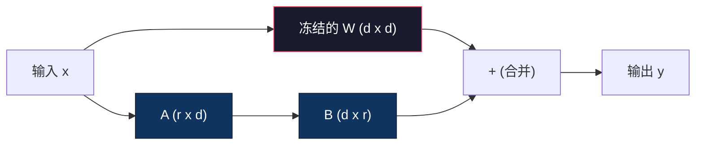
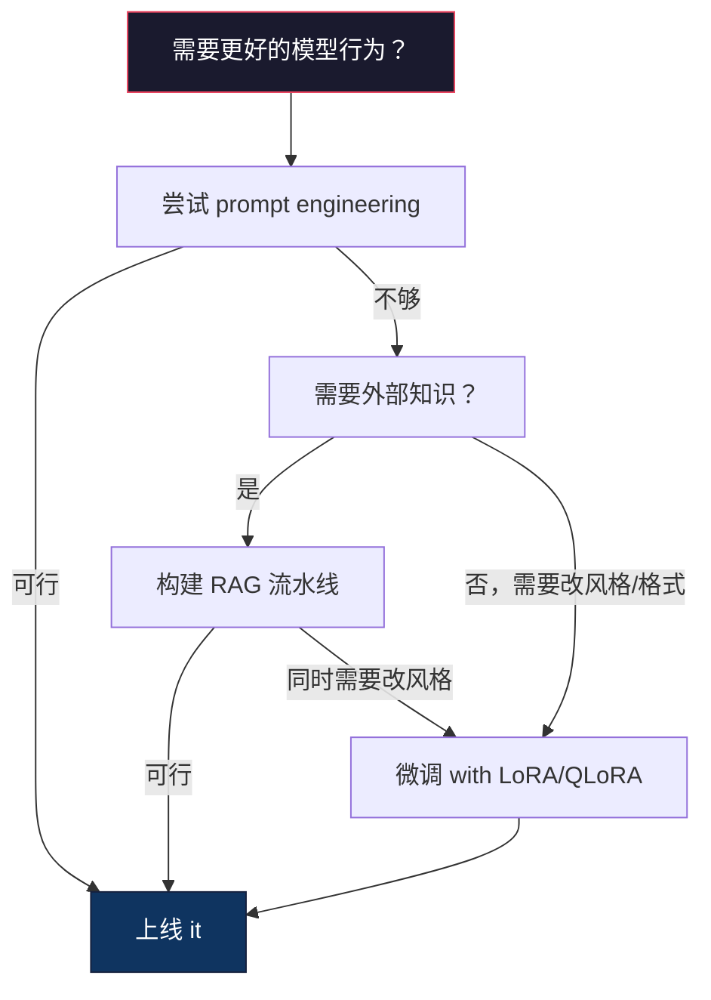

# 用 LoRA 与 QLoRA 做微调

> 译注：本文译自同目录 [`en.md`](./en.md)。术语遵循仓根 [TRANSLATION_GUIDE.md](../../../../TRANSLATION_GUIDE.md)。

> 全量微调（full fine-tune）一个 7B 模型需要 56GB 显存。你没有这么多。大多数公司也没有。LoRA 让你用 6GB 就能微调同一个模型，训练的参数还不到 1%。这不是妥协——在大多数任务上，它的质量与全量微调持平。整个开源微调生态就建立在这一个小技巧上。

**Type:** Build
**Languages:** Python
**Prerequisites:** Phase 10, Lesson 06 (Instruction Tuning / SFT)
**Time:** ~75 minutes
**Related:** Phase 10 从零讲解 SFT/DPO 训练循环。本课把它们接进 2026 年的 PEFT 工具链（PEFT、TRL、Unsloth、Axolotl、LLaMA-Factory）。

## 学习目标（Learning Objectives）

- 实现 LoRA：把低秩 adapter 矩阵（A 和 B）注入预训练模型的 attention（注意力）层
- 计算 LoRA 相对全量微调的参数节省量：在 d_model 维度下，秩 r 训练的是 2*r*d 个参数，而不是 d^2
- 用 QLoRA（4-bit 量化的 base + LoRA adapter）微调一个模型，让它能塞进消费级 GPU 的显存
- 把 LoRA 权重合并回 base 模型用于部署，并对比有无 adapter 时的推理速度

## 问题（The Problem）

你有一个 base 模型——Llama 3 8B。你希望它用你公司的语气回复客服工单。SFT 是答案。但 SFT 有一个成本问题。

全量微调会更新模型里的每一个参数。Llama 3 8B 有 80 亿参数。fp16 下每个参数 2 字节。光加载权重就要 16GB。训练时还要存梯度（gradient，16GB）、Adam 的 optimizer 状态（动量 + 方差共 32GB），再加上 activation。总计：单个 8B 模型大约要 56GB 显存。

一张 A100 80GB 勉强能装下。云上两张 A100 一小时 3-4 美元。在 5 万条样本上训 3 个 epoch 要花 6-10 小时。每次实验 30-40 美元。跑 10 次实验把超参调好，还没部署就花掉 400 美元。

把这个量级换成 Llama 3 70B，数字会荒唐到离谱。光权重就要 140GB。你得搭集群。每次实验 100 美元起。

还有一个更深的问题。全量微调会改动模型里的每一个权重。如果你在客服数据上微调，可能反而损害模型的通用能力。这叫灾难性遗忘（catastrophic forgetting）。模型在你的任务上变好，在其他任务上变差。

你需要一种方法：训练更少的参数、占用更少的显存，又不破坏模型已有的知识。

## 概念（The Concept）

### LoRA：低秩适配（Low-Rank Adaptation）

2021 年 6 月，微软的 Edward Hu 等人发表了 LoRA。论文的核心洞见：微调时的权重更新具有低的内在秩。你不需要更新一个 4096x4096 权重矩阵中的全部 1670 万参数。更新里有用的信息可以用一个秩 16 或 32 的矩阵就抓住。

数学如下。一个标准的线性层计算：

```
y = Wx
```

其中 W 是 d_out x d_in 的矩阵。对于一个 4096x4096 的 attention 投影来说，参数有 16,777,216 个。

LoRA 冻结 W，加上一个低秩分解：

```
y = Wx + BAx
```

其中 B 是 (d_out x r)，A 是 (r x d_in)。秩 r 远小于 d——常见取值是 8、16 或 32。

对于 4096x4096 层、r=16：
- 原始参数：4096 x 4096 = 16,777,216
- LoRA 参数：(4096 x 16) + (16 x 4096) = 65,536 + 65,536 = 131,072
- 缩减比例：131,072 / 16,777,216 = 0.78%

你训练 0.78% 的参数，拿到 95-100% 的质量。



A 用随机高斯初始化，B 初始化为零。这样 LoRA 的贡献从零开始——模型一开始就是它原本的行为，再逐步学到适配。

### 缩放因子 alpha（The Scaling Factor: Alpha）

LoRA 引入一个缩放因子 alpha，用来控制低秩更新对输出的影响大小：

```
y = Wx + (alpha / r) * BAx
```

当 alpha = r 时，缩放是 1 倍。当 alpha = 2r（常见默认值）时，缩放是 2 倍。这个超参可以独立于基础学习率（learning rate）来控制 LoRA 路径的学习速率。

实操建议：
- alpha = 2 * rank 是社区常见约定（原论文大多数实验中用的是 alpha = rank）
- alpha = rank 给出 1 倍缩放，保守但稳定
- alpha 越高，每步更新越大，能加速收敛，也可能引发不稳定

### LoRA 加在哪里（Where to Apply LoRA）

一个 transformer 有很多线性层。你不必给所有层都加 LoRA。原论文测过不同组合：

| 目标层 | 可训练参数（7B） | 质量 |
|--------------|----------------------|---------|
| 仅 q_proj | 4.7M | 好 |
| q_proj + v_proj | 9.4M | 更好 |
| q_proj + k_proj + v_proj + o_proj | 18.9M | attention 部分最佳 |
| 全部线性层（attention + MLP） | 37.7M | 收益边际，参数翻倍 |

大多数任务的甜蜜点：q_proj + v_proj。这覆盖了 self-attention 中的 query 和 value 投影，控制模型关注什么、抽取什么信息。给 MLP 也加 LoRA 在代码生成等复杂任务上有帮助，但参数翻倍换来的收益在简单任务上递减。

### 秩的选择（Rank Selection）

秩 r 控制适配的表达能力：

| 秩 | 可训练参数（每层） | 适合 |
|------|---------------------------|----------|
| 4 | 32,768 | 简单分类、情感分析 |
| 8 | 65,536 | 单领域问答、摘要 |
| 16 | 131,072 | 多领域任务、指令跟随 |
| 32 | 262,144 | 复杂推理、代码生成 |
| 64 | 524,288 | 大多数任务收益递减 |
| 128 | 1,048,576 | 几乎不值得 |

Hu 等人证明，对于简单任务 r=4 已经能覆盖大部分适配。实践中 r=8 和 r=16 是最常见的选择。超过 r=64 几乎不会再提升质量，反而开始失去 LoRA 的显存优势。

### QLoRA：4-bit 量化 + LoRA（QLoRA: 4-Bit Quantization + LoRA）

2023 年 5 月，华盛顿大学的 Tim Dettmers 等人发表了 QLoRA。思路是：把冻结的 base 模型量化到 4-bit 精度，然后在上面挂 fp16 的 LoRA adapter。

这把显存账完全改写：

| 方法 | 权重显存（7B） | 训练显存（7B） | 所需 GPU |
|--------|-------------------|---------------------|-------------|
| 全量微调（fp16） | 14GB | ~56GB | 1x A100 80GB |
| LoRA（fp16 base） | 14GB | ~18GB | 1x A100 40GB |
| QLoRA（4-bit base） | 3.5GB | ~6GB | 1x RTX 3090 24GB |

QLoRA 有三个技术贡献：

**NF4（Normal Float 4-bit）**：一种专门为神经网络权重设计的新数据类型。神经网络权重大致服从正态分布。NF4 把它的 16 个量化级别放在标准正态分布的分位点上。对正态分布的数据来说，这是信息论意义上的最优。它比均匀的 4-bit 量化（INT4）或标准 Float4 损失更少信息。

**Double quantization（双重量化）**：量化常数本身也占显存。每 64 个权重的 block 需要一个 fp32 的 scale（4 字节）。对一个 7B 模型来说，这就多出 0.4GB。Double quantization 把这些常数再量化成 fp8，把开销降到 0.1GB。每一点都是节省。

**Paged optimizer（分页 optimizer）**：训练时，optimizer 状态（Adam 的动量和方差）在长序列下可能超出 GPU 显存。Paged optimizer 利用 NVIDIA 的统一内存，在 GPU 显存耗尽时把 optimizer 状态自动 page 到 CPU 内存，需要时再换回来。代价是少量吞吐损失，但能避免 OOM 崩溃。

### 质量问题（The Quality Question）

减少参数或量化 base 会损害质量吗？多篇论文给出的结果：

| 方法 | MMLU (5-shot) | MT-Bench | HumanEval |
|--------|--------------|----------|-----------|
| 全量微调（Llama 2 7B） | 48.3 | 6.72 | 14.6 |
| LoRA r=16 | 47.9 | 6.68 | 14.0 |
| QLoRA r=16 (NF4) | 47.5 | 6.61 | 13.4 |
| QLoRA r=64 (NF4) | 48.1 | 6.70 | 14.2 |

LoRA r=16 在大多数 benchmark 上离全量微调不到 1%。QLoRA r=16 再损失零点几个百分点。QLoRA r=64 几乎追平全量微调，显存却少了 90%。

### 真实成本（Real-World Costs）

在 5 万样本上微调 Llama 3 8B（3 个 epoch）：

| 方法 | GPU | 时间 | 成本 |
|--------|-----|------|------|
| 全量微调 | 2x A100 80GB | 8 小时 | ~$32 |
| LoRA r=16 | 1x A100 40GB | 4 小时 | ~$8 |
| QLoRA r=16 | 1x RTX 4090 24GB | 6 小时 | ~$5 |
| QLoRA r=16 (Unsloth) | 1x RTX 4090 24GB | 2.5 小时 | ~$2 |
| QLoRA r=16 | 1x T4 16GB | 12 小时 | ~$4 |

单卡消费级 GPU 上的 QLoRA 比一顿午饭还便宜。这就是为什么 2023 年开放权重的微调社区会爆发，也是为什么下面列出的训练框架在 2026 年都默认带 QLoRA。

### 2026 年的 PEFT 技术栈（The 2026 PEFT stack）

| 框架 | 是什么 | 何时选它 |
|-----------|-----------|-----------|
| **Hugging Face PEFT** | 标准的 LoRA/QLoRA/DoRA/IA3 库 | 你想要原生控制，且训练循环已经在 `transformers.Trainer` 上 |
| **TRL** | HF 的人类反馈训练器（SFT、DPO、GRPO、PPO、ORPO） | SFT 之后还需要 DPO/GRPO；它构建在 PEFT 之上 |
| **Unsloth** | 用 Triton kernel 重写了前向/反向传播 | 你想 2-5 倍提速 + 显存减半且不损失精度；适用于 Llama/Mistral/Qwen 系列 |
| **Axolotl** | 用 YAML 配置封装 PEFT + TRL + DeepSpeed + Unsloth | 你想要可复现、版本受控的训练运行 |
| **LLaMA-Factory** | 在 PEFT + TRL 之上的 GUI/CLI/API | 你想零代码微调；支持 100+ 模型族 |
| **torchtune** | 原生 PyTorch recipe（配方），不依赖 `transformers` | 你想最小依赖，且团队已经统一在 PyTorch 上 |

经验法则：科研用或一次性实验 → PEFT。可重复的生产流水线 → 启用 Unsloth kernel 的 Axolotl。一次性原型 → LLaMA-Factory。

### 合并 adapter（Merging Adapters）

训练完之后你有两样东西：冻结的 base 模型和一个小的 LoRA adapter（一般 10-100MB）。你可以选择：

1. **保持分离**：加载 base 模型，再在上面加载 adapter。换不同任务时换 adapter。这就是用一个 base 模型对外服务多个微调变体的做法。

2. **永久合并**：计算 W' = W + (alpha/r) * BA，把结果存成一个新的完整模型。合并后的模型和原模型同样大小。推理无额外开销。也不用管理 adapter。

要同时服务多个任务（客服 adapter、代码 adapter、翻译 adapter），就保持分离。要部署单一专门模型，就合并。

合并多个 adapter 的进阶技术：

- **TIES-Merging**（Yadav et al. 2023）：先裁掉小幅参数、解决符号冲突，再合并。降低 adapter 之间的相互干扰。
- **DARE**（Yu et al. 2023）：合并前随机丢弃 adapter 参数，再对剩下的重新缩放。在能力组合上意外地有效。
- **Task arithmetic（任务算术）**：直接对 adapter 权重做加减。把"代码"和"数学"两个 adapter 加起来，常常能得到一个两者都擅长的模型。

### 什么时候*不要*微调（When NOT to Fine-Tune）

微调是第三个选择，不是第一个。

**第一：prompt engineering（提示工程）。** 写一个更好的 system prompt。加几个 few-shot 示例。用 chain-of-thought（CoT）。这不花钱，几分钟搞定。如果 prompt 已经能搞定 80%，你大概率不需要微调。

**第二：RAG。** 如果模型需要知道你特定的数据（文档、知识库、产品目录），检索比把它烧进权重更便宜也更好维护。见 Lesson 06。

**第三：微调。** 当你需要模型采用某种特定风格、格式或推理模式，而 prompt 做不到时；当你需要稳定的结构化输出时；当你需要把大模型蒸馏（distillation）成小模型时；当延迟（latency）敏感、你又付不起 few-shot prompt 那些额外 token 时。



## 动手实现（Build It）

我们用纯 PyTorch 从零实现 LoRA。不靠库。不耍魔法。你将构建 LoRA 层、把它注入到模型里、训练它，然后把权重合并回去。

### Step 1：LoRA 层（The LoRA Layer）

```python
import torch
import torch.nn as nn
import math

class LoRALayer(nn.Module):
    def __init__(self, in_features, out_features, rank=8, alpha=16):
        super().__init__()
        self.rank = rank
        self.alpha = alpha
        self.scaling = alpha / rank

        self.A = nn.Parameter(torch.randn(in_features, rank) * (1 / math.sqrt(rank)))
        self.B = nn.Parameter(torch.zeros(rank, out_features))

    def forward(self, x):
        return (x @ self.A @ self.B) * self.scaling
```

A 用缩放后的随机值初始化。B 初始化为零。乘积 BA 从零开始，所以模型从原本的行为出发。

### Step 2：包了 LoRA 的线性层（LoRA-Wrapped Linear Layer）

```python
class LinearWithLoRA(nn.Module):
    def __init__(self, linear, rank=8, alpha=16):
        super().__init__()
        self.linear = linear
        self.lora = LoRALayer(
            linear.in_features, linear.out_features, rank, alpha
        )

        for param in self.linear.parameters():
            param.requires_grad = False

    def forward(self, x):
        return self.linear(x) + self.lora(x)
```

原线性层被冻结。只有 LoRA 参数（A 和 B）可训练。

### Step 3：把 LoRA 注入模型（Inject LoRA into a Model）

```python
def inject_lora(model, target_modules, rank=8, alpha=16):
    for param in model.parameters():
        param.requires_grad = False

    lora_layers = {}
    for name, module in model.named_modules():
        if isinstance(module, nn.Linear):
            if any(t in name for t in target_modules):
                parent_name = ".".join(name.split(".")[:-1])
                child_name = name.split(".")[-1]
                parent = dict(model.named_modules())[parent_name]
                lora_linear = LinearWithLoRA(module, rank, alpha)
                setattr(parent, child_name, lora_linear)
                lora_layers[name] = lora_linear
    return lora_layers
```

先把模型里所有参数冻住。再遍历模型树，找到名字匹配目标的线性层，换成包了 LoRA 的版本。整个模型里唯一可训练的就是 LoRA 的 A 和 B 矩阵。

### Step 4：统计参数（Count Parameters）

```python
def count_parameters(model):
    total = sum(p.numel() for p in model.parameters())
    trainable = sum(p.numel() for p in model.parameters() if p.requires_grad)
    frozen = total - trainable
    return {
        "total": total,
        "trainable": trainable,
        "frozen": frozen,
        "trainable_pct": 100 * trainable / total if total > 0 else 0
    }
```

### Step 5：把权重合并回去（Merge Weights Back）

```python
def merge_lora_weights(model):
    for name, module in model.named_modules():
        if isinstance(module, LinearWithLoRA):
            with torch.no_grad():
                merged = (
                    module.lora.A @ module.lora.B
                ) * module.lora.scaling
                module.linear.weight.data += merged.T
            parent_name = ".".join(name.split(".")[:-1])
            child_name = name.split(".")[-1]
            if parent_name:
                parent = dict(model.named_modules())[parent_name]
            else:
                parent = model
            setattr(parent, child_name, module.linear)
```

合并后 LoRA 层就消失了。模型尺寸和原来一样，适配已经被烧进权重。推理无额外开销。

### Step 6：模拟 QLoRA 量化（Simulated QLoRA Quantization）

```python
def quantize_to_nf4(tensor, block_size=64):
    blocks = tensor.reshape(-1, block_size)
    scales = blocks.abs().max(dim=1, keepdim=True).values / 7.0
    scales = torch.clamp(scales, min=1e-8)
    quantized = torch.round(blocks / scales).clamp(-8, 7).to(torch.int8)
    return quantized, scales

def dequantize_from_nf4(quantized, scales, original_shape):
    dequantized = quantized.float() * scales
    return dequantized.reshape(original_shape)
```

这是模拟 4-bit 量化：在 64 个权重一组的 block 内，把权重映射到 16 个离散级别。生产级 QLoRA 用 bitsandbytes 库在 GPU 上做真正的 NF4。

### Step 7：训练循环（Training Loop）

```python
def train_lora(model, data, epochs=5, lr=1e-3, batch_size=4):
    optimizer = torch.optim.AdamW(
        [p for p in model.parameters() if p.requires_grad], lr=lr
    )
    criterion = nn.MSELoss()

    losses = []
    for epoch in range(epochs):
        epoch_loss = 0.0
        n_batches = 0
        indices = torch.randperm(len(data["inputs"]))

        for i in range(0, len(indices), batch_size):
            batch_idx = indices[i:i + batch_size]
            x = data["inputs"][batch_idx]
            y = data["targets"][batch_idx]

            output = model(x)
            loss = criterion(output, y)

            optimizer.zero_grad()
            loss.backward()
            optimizer.step()

            epoch_loss += loss.item()
            n_batches += 1

        avg_loss = epoch_loss / n_batches
        losses.append(avg_loss)

    return losses
```

### Step 8：完整 demo（Full Demo）

```python
def demo():
    torch.manual_seed(42)
    d_model = 256
    n_classes = 10

    model = nn.Sequential(
        nn.Linear(d_model, 512),
        nn.ReLU(),
        nn.Linear(512, 512),
        nn.ReLU(),
        nn.Linear(512, n_classes),
    )

    n_samples = 500
    x = torch.randn(n_samples, d_model)
    y = torch.randint(0, n_classes, (n_samples,))
    y_onehot = torch.zeros(n_samples, n_classes).scatter_(1, y.unsqueeze(1), 1.0)

    data = {"inputs": x, "targets": y_onehot}

    params_before = count_parameters(model)

    lora_layers = inject_lora(
        model, target_modules=["0", "2"], rank=8, alpha=16
    )

    params_after = count_parameters(model)

    losses = train_lora(model, data, epochs=20, lr=1e-3)

    merge_lora_weights(model)
    params_merged = count_parameters(model)

    return {
        "params_before": params_before,
        "params_after": params_after,
        "params_merged": params_merged,
        "losses": losses,
    }
```

这个 demo 创建一个小模型，往两层注入 LoRA，训练，然后把权重合并回去。LoRA 训练阶段，可训练参数从全量降到 ~1%；合并之后又恢复原始结构。

## 用起来（Use It）

借助 Hugging Face 生态，对真实模型做 LoRA 大约 20 行代码：

```python
from transformers import AutoModelForCausalLM, AutoTokenizer
from peft import LoraConfig, get_peft_model, TaskType

model = AutoModelForCausalLM.from_pretrained("meta-llama/Llama-3.1-8B")
tokenizer = AutoTokenizer.from_pretrained("meta-llama/Llama-3.1-8B")

lora_config = LoraConfig(
    task_type=TaskType.CAUSAL_LM,
    r=16,
    lora_alpha=32,
    lora_dropout=0.05,
    target_modules=["q_proj", "v_proj"],
)

model = get_peft_model(model, lora_config)
model.print_trainable_parameters()
```

要做 QLoRA，加上 bitsandbytes 量化：

```python
from transformers import BitsAndBytesConfig

bnb_config = BitsAndBytesConfig(
    load_in_4bit=True,
    bnb_4bit_quant_type="nf4",
    bnb_4bit_compute_dtype=torch.bfloat16,
    bnb_4bit_use_double_quant=True,
)

model = AutoModelForCausalLM.from_pretrained(
    "meta-llama/Llama-3.1-8B",
    quantization_config=bnb_config,
    device_map="auto",
)

model = get_peft_model(model, lora_config)
```

就这样。同样的训练循环，同样的数据流水线。base 模型现在是 4-bit，LoRA adapter 在 fp16 下训练，整套东西塞进 6GB。

用 Hugging Face Trainer 训练：

```python
from transformers import TrainingArguments, Trainer
from datasets import load_dataset

dataset = load_dataset("tatsu-lab/alpaca", split="train[:5000]")

training_args = TrainingArguments(
    output_dir="./lora-llama",
    num_train_epochs=3,
    per_device_train_batch_size=4,
    gradient_accumulation_steps=4,
    learning_rate=2e-4,
    fp16=True,
    logging_steps=10,
    save_strategy="epoch",
    optim="paged_adamw_8bit",
)

trainer = Trainer(
    model=model,
    args=training_args,
    train_dataset=dataset,
)

trainer.train()

model.save_pretrained("./lora-adapter")
```

保存的 adapter 只有 10-100MB。base 模型保持原样。你可以在 Hugging Face Hub 上分享 adapter，而不必重新分发整个模型。

## 上线部署（Ship It）

本课产出：
- `outputs/prompt-lora-advisor.md` —— 一个 prompt，帮你为具体任务决定 LoRA 的 rank、target module 和超参
- `outputs/skill-fine-tuning-guide.md` —— 一个 skill，教 agent 走"何时以及如何微调"的决策树

## 练习（Exercises）

1. **秩的消融实验（rank ablation，括注：消融实验）。** 用秩 2、4、8、16、32、64 各跑一次 demo。画出最终 loss 与 rank 的关系。找出收益递减的拐点：在哪个秩之后，rank 翻倍不再让 loss 减半。对一个 256 维特征的简单分类任务来说，这通常在 r=8-16 附近。

2. **目标层对比。** 修改 inject_lora，分别只针对 layer "0"、只 "2"、只 "4"，再加上三层全选。每个变体训练 20 epoch。比较收敛速度和最终 loss。这映射到真实场景里"加 q_proj、加 v_proj、加全部线性层"的选择。

3. **量化误差分析。** 取训练好的模型权重矩阵，对比 quantize_to_nf4 / dequantize_from_nf4 前后的版本。计算均方误差（MSE）、最大绝对误差，以及原始与重建权重之间的相关性。试 block_size 取 32、64、128、256。

4. **多 adapter 服务。** 在数据的不同子集上（偶数 index vs 奇数 index）训练两个 LoRA adapter。把两个都保存。base 模型只加载一次，然后切换 adapter，验证同一个输入会得到不同输出。这就是生产系统怎么用一个 base 模型对外服务多个微调模型的方式。

5. **合并前后的推理对比。** 在同样 100 个输入上，比较 merge_lora_weights 前后 LoRA 模型的输出。验证两者在浮点容差 1e-5 内一致。然后给两者跑推理基准测试（benchmark）——合并版应该略快，因为是一次矩阵乘法而不是两次。

## 关键术语（Key Terms）

| 术语 | 大家怎么说 | 实际是什么 |
|------|----------------|----------------------|
| LoRA | "高效微调" | Low-Rank Adaptation：冻结 base 权重，训练两个小矩阵 A 和 B，它们的乘积近似完整的权重更新 |
| QLoRA | "在笔记本上微调" | Quantized LoRA：用 4-bit NF4 加载 base 模型，在上面用 fp16 训练 LoRA adapter，让 7B 微调在 6GB 显存里跑 |
| Rank (r) | "模型能学多少" | A 和 B 矩阵的内层维度；控制表达力 vs 参数量的权衡 |
| Alpha | "LoRA 的 learning rate" | 加在 LoRA 输出上的缩放因子；alpha/r 决定适配项对最终输出的贡献比例 |
| NF4 | "4-bit 量化" | Normal Float 4：一种 4-bit 数据类型，量化级别取在正态分布的分位点上，对神经网络权重最优 |
| Adapter | "训出来的那一小块" | 单独保存的 LoRA A、B 矩阵（10-100MB），可以挂在任何一份 base 模型副本上 |
| Target modules | "给哪些层加 LoRA" | 注入 LoRA adapter 的具体线性层（q_proj、v_proj 等） |
| Merging（合并） | "烧进去" | 计算 W + (alpha/r) * BA 并替换原权重，推理时不再有 adapter 开销 |
| Paged optimizer | "训练时别 OOM" | 显存耗尽时把 optimizer 状态（Adam 的动量、方差）卸到 CPU |
| Catastrophic forgetting（灾难性遗忘） | "微调把别的都搞坏了" | 更新所有权重导致模型丢失之前学到的能力 |

## 延伸阅读（Further Reading）

- Hu et al., "LoRA: Low-Rank Adaptation of Large Language Models" (2021) —— 提出低秩分解方法的原论文，在 GPT-3 175B 上测试，秩低至 4 仍然有效
- Dettmers et al., "QLoRA: Efficient Finetuning of Quantized Language Models" (2023) —— 引入 NF4、double quantization 和 paged optimizer，让 65B 模型能在单张 48GB GPU 上微调
- PEFT 库文档（huggingface.co/docs/peft）—— Hugging Face 生态里 LoRA、QLoRA 等参数高效方法的标准库
- Yadav et al., "TIES-Merging: Resolving Interference When Merging Models" (2023) —— 把多个 LoRA adapter 合在一起且不损失质量的技术
- [Rafailov et al., "Direct Preference Optimization: Your Language Model is Secretly a Reward Model" (NeurIPS 2023)](https://arxiv.org/abs/2305.18290) —— DPO 的推导；SFT 之后的偏好微调阶段，不需要 reward model。
- [TRL 文档](https://huggingface.co/docs/trl/) —— `SFTTrainer`、`DPOTrainer`、`KTOTrainer` 的官方参考，以及与 PEFT/bitsandbytes/Unsloth 的集成面。
- [Unsloth 文档](https://docs.unsloth.ai/) —— 把微调吞吐翻倍、显存减半的融合 kernel；TRL 之下的性能层。
- [Axolotl 文档](https://axolotl-ai-cloud.github.io/axolotl/) —— 用 YAML 配置的多 GPU SFT/DPO/QLoRA 训练器；手写脚本之外的"配置即代码"方案。
