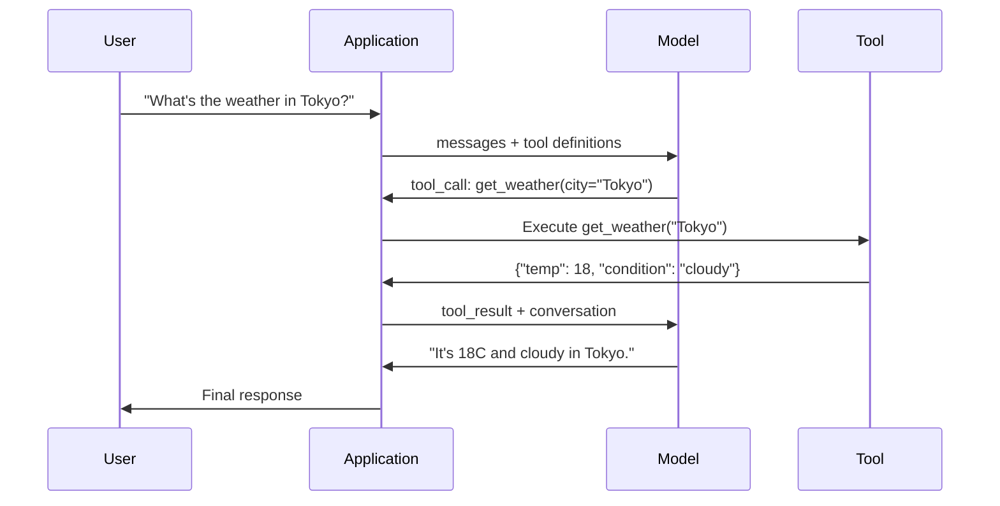

# Function Calling と Tool Use

> LLM 自体は何も実行できません。できるのは text を生成することだけです。天気を確認したり、database に query したり、email を送ったり、code を実行したり、file を読むことはできません。あなたが見てきた「AI agent」の実体は、どの function を呼ぶべきかを示す JSON を LLM が生成し、その後で実際にはあなたの code が呼び出している仕組みです。model は脳、tools は手、function calling はその間をつなぐ神経系です。

**種別:** 構築
**言語:** Python
**前提:** Phase 11 Lesson 03 (Structured Outputs)
**時間:** 約 75 分
**関連:** Phase 11 · 14 (Model Context Protocol) — host をまたいで tool を共有するなら、inline function calling から MCP server に発展させます。この lesson は inline の場合を扱い、MCP は protocol の場合を扱います。

## 学習目標

- tool schema を定義し、model の tool-call JSON を parse し、function を実行して結果を返す function calling loop を実装する
- model が安定して呼び出せるように、明確な description と型付き parameter を持つ tool schema を設計する
- 複数の function call をつなげて複雑な query に答える multi-turn agent loop を構築する
- parallel tool calls、error propagation、無限 tool loop の防止など、function calling の edge case を扱う

## 問題

chatbot を作ったとします。user が「東京の今の天気は？」と尋ねます。

model はこう答えます。「real-time weather data にはアクセスできませんが、季節から考えると東京はおそらく 15 度前後です...」

これは disclaimer をまとった hallucination です。model は天気を知りません。今後も知りません。天気は毎時間変わり、model の training data は何か月も前のものです。

正しい答えには OpenWeatherMap API を呼び、現在の気温を取得し、実際の数値を返す必要があります。model は API を呼べません。あなたの code は呼べます。欠けているのは、model が「この引数で weather API を呼ぶ必要がある」と言え、あなたの code がそれを実行して結果を戻せる structured protocol です。

これが function calling です。model はどの function をどの arguments で呼び出すかを表す structured JSON を出力します。application が function を実行します。結果は conversation に戻されます。model はその結果を使って最終回答を作ります。

function calling がなければ LLM は百科事典です。function calling があれば agent になります。

## コンセプト

### Function Calling Loop

すべての tool-use interaction は同じ 5 step の loop に従います。



Step 1: user が message を送ります。Step 2: model は message と tool definitions (利用可能な functions を表す JSON Schema) を受け取ります。Step 3: text で応答する代わりに、model は function name と arguments を持つ structured JSON object として tool call を出力します。Step 4: あなたの code が function を実行し、result を取得します。Step 5: result が model に戻り、model は実 data を使って最終回答を生成します。

model は何も実行しません。何をどの arguments で呼ぶかを決めるだけです。executor はあなたの code です。

### Tool Definitions: JSON Schema Contract

各 tool は JSON Schema で定義します。これは function が何をするか、どの arguments を取るか、それらの type が何であるべきかを model に伝えます。

```json
{
  "type": "function",
  "function": {
    "name": "get_weather",
    "description": "Get current weather for a city. Returns temperature in Celsius and conditions.",
    "parameters": {
      "type": "object",
      "properties": {
        "city": {
          "type": "string",
          "description": "City name, e.g. 'Tokyo' or 'San Francisco'"
        },
        "units": {
          "type": "string",
          "enum": ["celsius", "fahrenheit"],
          "description": "Temperature units"
        }
      },
      "required": ["city"]
    }
  }
}
```

`description` fields は極めて重要です。model はそれを読んで、いつ、どのように tool を使うかを判断します。"gets weather" のような曖昧な description は、"Get current weather for a city. Returns temperature in Celsius and conditions." より悪い tool selection を生みます。description は tool selection のための prompt です。

### Provider 比較

主要 provider はすべて function calling を support していますが、API surface は異なります。

| Provider | API parameter | Tool call format | Parallel calls | Forced calling |
|----------|--------------|-----------------|---------------|----------------|
| OpenAI (GPT-5, o4) | `tools` | `tool_calls[].function` | Yes (multiple per turn) | `tool_choice="required"` |
| Anthropic (Claude 4.6/4.7) | `tools` | `content[].type="tool_use"` | Yes (multiple blocks) | `tool_choice={"type":"any"}` |
| Google (Gemini 3) | `function_declarations` | `functionCall` | Yes | `function_calling_config` |
| Open-weight (Llama 4, Qwen3, DeepSeek-V3) | Native `tools` on Llama 4; Hermes or ChatML on others | Mixed | Model-dependent | Prompt-based or `tool_choice` if supported |

2026 年時点では、3 つの closed provider はほぼ同一の JSON-Schema-based format に収束しています。Llama 4 は OpenAI の形に合う native `tools` field を備えています。open-weight fine-tune はまだばらつきがあり、third-party fine-tune では Hermes format (NousResearch) が最も一般的です。host をまたいで tool を共有する場合は、inline function calling より MCP (Phase 11 · 14) を優先します。server を共通化できるからです。

### Tool Choice: Auto、Required、Specific

model がいつ tool を使うかは制御できます。

**Auto** (default): tool を呼ぶか直接応答するかを model が決めます。「2+2 は？」なら直接応答し、「天気は？」なら tool を呼びます。

**Required**: model は少なくとも 1 つの tool を呼ばなければなりません。user intent が tool を必要とすることが分かっている場合に使います。実 data を lookup せずに model が推測するのを防ぎます。

**Specific function**: 特定の function を呼ぶよう model に強制します。`tool_choice={"type":"function", "function": {"name": "get_weather"}}` は query に関係なく weather tool を呼ばせます。upstream logic が必要な tool を既に決めている routing に使います。

### Parallel Function Calling

GPT-4o と Claude は 1 turn で複数の function を呼べます。user が「東京とニューヨークの天気は？」と尋ねると、model は 2 つの tool call を同時に出力します。

```json
[
  {"name": "get_weather", "arguments": {"city": "Tokyo"}},
  {"name": "get_weather", "arguments": {"city": "New York"}}
]
```

あなたの code は両方を実行し (理想的には concurrent に)、両方の results を返し、model が 1 つの response に統合します。これにより round trip は 2 回から 1 回になります。1 query あたり 5-10 tool calls を行う agent では、parallel calling により latency を 60-80% 減らせます。

### Structured Outputs と Function Calling

Lesson 03 では structured outputs を扱いました。function calling は同じ JSON Schema machinery を使いますが、目的が違います。

**Structured outputs**: model に特定の形の data を生成させます。output は最終成果物です。例: text から product info を `{name, price, in_stock}` として抽出する。

**Function calling**: model が action を実行したい意図を宣言します。output は intermediate step です。例: `get_weather(city="Tokyo")` は final answer ではなく、model が action を要求している状態です。

data extraction には structured outputs を使います。external systems と model をやり取りさせたい場合は function calling を使います。

### Security: 妥協できない rules

function calling は LLM に与えられる最も危険な capability です。何を実行するかを model が選びます。tool set に database query があれば model が query を組み立てます。shell command があれば model が command を書きます。

**Rule 1: model-generated SQL を database に直接渡さない。** model は DROP TABLE、UNION injection、全 row を返す query を生成し得ます。必ず parameterize し、validate し、operation allowlist を使います。

**Rule 2: functions を allowlist する。** model が呼べるのは明示的に定義した functions だけです。「任意の function name を実行する」汎用 tool は作ってはいけません。internal functions が 50 個あっても、user に必要な 5 個だけ expose します。

**Rule 3: arguments を validate する。** model は city name として `"; DROP TABLE users; --"` を渡すかもしれません。実行前にすべての argument を expected types、ranges、formats に照らして validate します。

**Rule 4: tool results を sanitize する。** tool が sensitive data (API keys、PII、internal errors) を返す場合、model に戻す前に filter します。model は tool results を response にそのまま含める可能性があります。

**Rule 5: tool calls を rate limit する。** loop に入った model は tool を何百回も呼ぶことがあります。最大回数を設定します (conversation あたり 10-20 calls が妥当)。infinite loop を切ります。

### Error Handling

tools は失敗します。API は timeout します。database は落ちます。file は存在しないことがあります。model には tool がいつ、なぜ失敗したかを知らせる必要があります。

error は exception ではなく structured tool result として返します。

```json
{
  "error": true,
  "message": "City 'Toky' not found. Did you mean 'Tokyo'?",
  "code": "CITY_NOT_FOUND"
}
```

model はこれを読み、arguments を調整して retry します。models は structured error messages からの self-correction が得意です。empty response や generic な "something went wrong" error からの復帰は苦手です。

### MCP: Model Context Protocol

MCP は tool interoperability のための Anthropic の open standard です。各 application が独自に tools を定義する代わりに、MCP は universal protocol を提供します。tools は MCP servers から提供され、Claude Code、Cursor、あなたの application のような MCP clients が利用します。

1 つの MCP server は互換 client すべてに tools を expose できます。Postgres MCP server は MCP-compatible agent に database access を与えます。GitHub MCP server は agent に repository access を与えます。tools は一度定義し、どこでも使えます。

function calling における MCP は networking における HTTP のようなものです。transport layer を標準化し、tools を portable にします。

## 実装

### Step 1: Tool Registry を定義する

tool definitions と implementations を保存する registry を作ります。各 tool は JSON Schema definition (model が見るもの) と Python function (code が実行するもの) を持ちます。

```python
import json
import math
import time
import hashlib


TOOL_REGISTRY = {}


def register_tool(name, description, parameters, function):
    TOOL_REGISTRY[name] = {
        "definition": {
            "type": "function",
            "function": {
                "name": name,
                "description": description,
                "parameters": parameters,
            },
        },
        "function": function,
    }
```

### Step 2: 5 つの Tools を実装する

calculator、weather lookup、web search simulator、file reader、code runner を作ります。

```python
def calculator(expression, precision=2):
    allowed = set("0123456789+-*/.() ")
    if not all(c in allowed for c in expression):
        return {"error": True, "message": f"Invalid characters in expression: {expression}"}
    try:
        result = eval(expression, {"__builtins__": {}}, {"math": math})
        return {"result": round(float(result), precision), "expression": expression}
    except Exception as e:
        return {"error": True, "message": str(e)}


WEATHER_DB = {
    "tokyo": {"temp_c": 18, "condition": "cloudy", "humidity": 72, "wind_kph": 14},
    "new york": {"temp_c": 22, "condition": "sunny", "humidity": 45, "wind_kph": 8},
    "london": {"temp_c": 12, "condition": "rainy", "humidity": 88, "wind_kph": 22},
    "san francisco": {"temp_c": 16, "condition": "foggy", "humidity": 80, "wind_kph": 18},
    "sydney": {"temp_c": 25, "condition": "sunny", "humidity": 55, "wind_kph": 10},
}


def get_weather(city, units="celsius"):
    key = city.lower().strip()
    if key not in WEATHER_DB:
        suggestions = [c for c in WEATHER_DB if c.startswith(key[:3])]
        return {
            "error": True,
            "message": f"City '{city}' not found.",
            "suggestions": suggestions,
            "code": "CITY_NOT_FOUND",
        }
    data = WEATHER_DB[key].copy()
    if units == "fahrenheit":
        data["temp_f"] = round(data["temp_c"] * 9 / 5 + 32, 1)
        del data["temp_c"]
    data["city"] = city
    return data


SEARCH_DB = {
    "python function calling": [
        {"title": "OpenAI Function Calling Guide", "url": "https://platform.openai.com/docs/guides/function-calling", "snippet": "Learn how to connect LLMs to external tools."},
        {"title": "Anthropic Tool Use", "url": "https://docs.anthropic.com/en/docs/tool-use", "snippet": "Claude can interact with external tools and APIs."},
    ],
    "MCP protocol": [
        {"title": "Model Context Protocol", "url": "https://modelcontextprotocol.io", "snippet": "An open standard for connecting AI models to data sources."},
    ],
    "weather API": [
        {"title": "OpenWeatherMap API", "url": "https://openweathermap.org/api", "snippet": "Free weather API with current, forecast, and historical data."},
    ],
}


def web_search(query, max_results=3):
    key = query.lower().strip()
    for db_key, results in SEARCH_DB.items():
        if db_key in key or key in db_key:
            return {"query": query, "results": results[:max_results], "total": len(results)}
    return {"query": query, "results": [], "total": 0}


FILE_SYSTEM = {
    "data/config.json": '{"model": "gpt-4o", "temperature": 0.7, "max_tokens": 4096}',
    "data/users.csv": "name,email,role\nAlice,alice@example.com,admin\nBob,bob@example.com,user",
    "README.md": "# My Project\nA tool-use agent built from scratch.",
}


def read_file(path):
    if ".." in path or path.startswith("/"):
        return {"error": True, "message": "Path traversal not allowed.", "code": "FORBIDDEN"}
    if path not in FILE_SYSTEM:
        available = list(FILE_SYSTEM.keys())
        return {"error": True, "message": f"File '{path}' not found.", "available_files": available, "code": "NOT_FOUND"}
    content = FILE_SYSTEM[path]
    return {"path": path, "content": content, "size_bytes": len(content), "lines": content.count("\n") + 1}


def run_code(code, language="python"):
    if language != "python":
        return {"error": True, "message": f"Language '{language}' not supported. Only 'python' is available."}
    forbidden = ["import os", "import sys", "import subprocess", "exec(", "eval(", "__import__", "open("]
    for pattern in forbidden:
        if pattern in code:
            return {"error": True, "message": f"Forbidden operation: {pattern}", "code": "SECURITY_VIOLATION"}
    try:
        local_vars = {}
        exec(code, {"__builtins__": {"print": print, "range": range, "len": len, "str": str, "int": int, "float": float, "list": list, "dict": dict, "sum": sum, "min": min, "max": max, "abs": abs, "round": round, "sorted": sorted, "enumerate": enumerate, "zip": zip, "map": map, "filter": filter, "math": math}}, local_vars)
        result = local_vars.get("result", None)
        return {"success": True, "result": result, "variables": {k: str(v) for k, v in local_vars.items() if not k.startswith("_")}}
    except Exception as e:
        return {"error": True, "message": f"{type(e).__name__}: {e}"}
```

### Step 3: すべての Tools を登録する

```python
def register_all_tools():
    register_tool(
        "calculator", "Evaluate a mathematical expression. Supports +, -, *, /, parentheses, and decimals. Returns the numeric result.",
        {"type": "object", "properties": {"expression": {"type": "string", "description": "Math expression, e.g. '(10 + 5) * 3'"}, "precision": {"type": "integer", "description": "Decimal places in result", "default": 2}}, "required": ["expression"]},
        calculator,
    )
    register_tool(
        "get_weather", "Get current weather for a city. Returns temperature, condition, humidity, and wind speed.",
        {"type": "object", "properties": {"city": {"type": "string", "description": "City name, e.g. 'Tokyo' or 'San Francisco'"}, "units": {"type": "string", "enum": ["celsius", "fahrenheit"], "description": "Temperature units, defaults to celsius"}}, "required": ["city"]},
        get_weather,
    )
    register_tool(
        "web_search", "Search the web for information. Returns a list of results with title, URL, and snippet.",
        {"type": "object", "properties": {"query": {"type": "string", "description": "Search query"}, "max_results": {"type": "integer", "description": "Maximum results to return", "default": 3}}, "required": ["query"]},
        web_search,
    )
    register_tool(
        "read_file", "Read the contents of a file. Returns the file content, size, and line count.",
        {"type": "object", "properties": {"path": {"type": "string", "description": "Relative file path, e.g. 'data/config.json'"}}, "required": ["path"]},
        read_file,
    )
    register_tool(
        "run_code", "Execute Python code in a sandboxed environment. Set a 'result' variable to return output.",
        {"type": "object", "properties": {"code": {"type": "string", "description": "Python code to execute"}, "language": {"type": "string", "enum": ["python"], "description": "Programming language"}}, "required": ["code"]},
        run_code,
    )
```

### Step 4: Function Calling Loop を構築する

ここが core engine です。どの tool を呼ぶかを model が決める流れを simulate し、tool を実行して results を戻します。

```python
def simulate_model_decision(user_message, tools, conversation_history):
    msg = user_message.lower()

    if any(word in msg for word in ["weather", "temperature", "forecast"]):
        cities = []
        for city in WEATHER_DB:
            if city in msg:
                cities.append(city)
        if not cities:
            for word in msg.split():
                if word.capitalize() in [c.title() for c in WEATHER_DB]:
                    cities.append(word)
        if not cities:
            cities = ["tokyo"]
        calls = []
        for city in cities:
            calls.append({"name": "get_weather", "arguments": {"city": city.title()}})
        return calls

    if any(word in msg for word in ["calculate", "compute", "math", "what is", "how much"]):
        for token in msg.split():
            if any(c in token for c in "+-*/"):
                return [{"name": "calculator", "arguments": {"expression": token}}]
        if "+" in msg or "-" in msg or "*" in msg or "/" in msg:
            expr = "".join(c for c in msg if c in "0123456789+-*/.() ")
            if expr.strip():
                return [{"name": "calculator", "arguments": {"expression": expr.strip()}}]
        return [{"name": "calculator", "arguments": {"expression": "0"}}]

    if any(word in msg for word in ["search", "find", "look up", "google"]):
        query = msg.replace("search for", "").replace("look up", "").replace("find", "").strip()
        return [{"name": "web_search", "arguments": {"query": query}}]

    if any(word in msg for word in ["read", "file", "open", "cat", "show"]):
        for path in FILE_SYSTEM:
            if path.split("/")[-1].split(".")[0] in msg:
                return [{"name": "read_file", "arguments": {"path": path}}]
        return [{"name": "read_file", "arguments": {"path": "README.md"}}]

    if any(word in msg for word in ["run", "execute", "code", "python"]):
        return [{"name": "run_code", "arguments": {"code": "result = 'Hello from the sandbox!'", "language": "python"}}]

    return []


def execute_tool_call(tool_call):
    name = tool_call["name"]
    args = tool_call["arguments"]

    if name not in TOOL_REGISTRY:
        return {"error": True, "message": f"Unknown tool: {name}", "code": "UNKNOWN_TOOL"}

    tool = TOOL_REGISTRY[name]
    func = tool["function"]
    start = time.time()

    try:
        result = func(**args)
    except TypeError as e:
        result = {"error": True, "message": f"Invalid arguments: {e}"}

    elapsed_ms = round((time.time() - start) * 1000, 2)
    return {"tool": name, "result": result, "execution_time_ms": elapsed_ms}


def run_function_calling_loop(user_message, max_iterations=5):
    conversation = [{"role": "user", "content": user_message}]
    tool_definitions = [t["definition"] for t in TOOL_REGISTRY.values()]
    all_tool_results = []

    for iteration in range(max_iterations):
        tool_calls = simulate_model_decision(user_message, tool_definitions, conversation)

        if not tool_calls:
            break

        results = []
        for call in tool_calls:
            result = execute_tool_call(call)
            results.append(result)

        conversation.append({"role": "assistant", "content": None, "tool_calls": tool_calls})

        for result in results:
            conversation.append({"role": "tool", "content": json.dumps(result["result"]), "tool_name": result["tool"]})

        all_tool_results.extend(results)
        break

    return {"conversation": conversation, "tool_results": all_tool_results, "iterations": iteration + 1 if tool_calls else 0}
```

### Step 5: Argument Validation

実行前に tool call arguments を JSON Schema と照合する validator を作ります。

```python
def validate_tool_arguments(tool_name, arguments):
    if tool_name not in TOOL_REGISTRY:
        return [f"Unknown tool: {tool_name}"]

    schema = TOOL_REGISTRY[tool_name]["definition"]["function"]["parameters"]
    errors = []

    if not isinstance(arguments, dict):
        return [f"Arguments must be an object, got {type(arguments).__name__}"]

    for required_field in schema.get("required", []):
        if required_field not in arguments:
            errors.append(f"Missing required argument: {required_field}")

    properties = schema.get("properties", {})
    for arg_name, arg_value in arguments.items():
        if arg_name not in properties:
            errors.append(f"Unknown argument: {arg_name}")
            continue

        prop_schema = properties[arg_name]
        expected_type = prop_schema.get("type")

        type_checks = {"string": str, "integer": int, "number": (int, float), "boolean": bool, "array": list, "object": dict}
        if expected_type in type_checks:
            if not isinstance(arg_value, type_checks[expected_type]):
                errors.append(f"Argument '{arg_name}': expected {expected_type}, got {type(arg_value).__name__}")

        if "enum" in prop_schema and arg_value not in prop_schema["enum"]:
            errors.append(f"Argument '{arg_name}': '{arg_value}' not in {prop_schema['enum']}")

    return errors
```

### Step 6: Demo を実行する

```python
def run_demo():
    register_all_tools()

    print("=" * 60)
    print("  Function Calling & Tool Use Demo")
    print("=" * 60)

    print("\n--- Registered Tools ---")
    for name, tool in TOOL_REGISTRY.items():
        desc = tool["definition"]["function"]["description"][:60]
        params = list(tool["definition"]["function"]["parameters"].get("properties", {}).keys())
        print(f"  {name}: {desc}...")
        print(f"    params: {params}")

    print(f"\n--- Argument Validation ---")
    validation_tests = [
        ("get_weather", {"city": "Tokyo"}, "Valid call"),
        ("get_weather", {}, "Missing required arg"),
        ("get_weather", {"city": "Tokyo", "units": "kelvin"}, "Invalid enum value"),
        ("calculator", {"expression": 123}, "Wrong type (int for string)"),
        ("unknown_tool", {"x": 1}, "Unknown tool"),
    ]
    for tool_name, args, label in validation_tests:
        errors = validate_tool_arguments(tool_name, args)
        status = "VALID" if not errors else f"ERRORS: {errors}"
        print(f"  {label}: {status}")

    print(f"\n--- Tool Execution ---")
    direct_tests = [
        {"name": "calculator", "arguments": {"expression": "(10 + 5) * 3 / 2"}},
        {"name": "get_weather", "arguments": {"city": "Tokyo"}},
        {"name": "get_weather", "arguments": {"city": "Mars"}},
        {"name": "web_search", "arguments": {"query": "python function calling"}},
        {"name": "read_file", "arguments": {"path": "data/config.json"}},
        {"name": "read_file", "arguments": {"path": "../etc/passwd"}},
        {"name": "run_code", "arguments": {"code": "result = sum(range(1, 101))"}},
        {"name": "run_code", "arguments": {"code": "import os; os.system('rm -rf /')"}},
    ]
    for call in direct_tests:
        result = execute_tool_call(call)
        print(f"\n  {call['name']}({json.dumps(call['arguments'])})")
        print(f"    -> {json.dumps(result['result'], indent=None)[:100]}")
        print(f"    time: {result['execution_time_ms']}ms")

    print(f"\n--- Full Function Calling Loop ---")
    test_queries = [
        "What's the weather in Tokyo?",
        "Calculate (100 + 250) * 0.15",
        "Search for MCP protocol",
        "Read the config file",
        "Run some Python code",
        "Tell me a joke",
    ]
    for query in test_queries:
        print(f"\n  User: {query}")
        result = run_function_calling_loop(query)
        if result["tool_results"]:
            for tr in result["tool_results"]:
                print(f"    Tool: {tr['tool']} ({tr['execution_time_ms']}ms)")
                print(f"    Result: {json.dumps(tr['result'], indent=None)[:90]}")
        else:
            print(f"    [No tool called -- direct response]")
        print(f"    Iterations: {result['iterations']}")

    print(f"\n--- Parallel Tool Calls ---")
    multi_city_query = "What's the weather in tokyo and london?"
    print(f"  User: {multi_city_query}")
    result = run_function_calling_loop(multi_city_query)
    print(f"  Tool calls made: {len(result['tool_results'])}")
    for tr in result["tool_results"]:
        city = tr["result"].get("city", "unknown")
        temp = tr["result"].get("temp_c", "N/A")
        print(f"    {city}: {temp}C, {tr['result'].get('condition', 'N/A')}")

    print(f"\n--- Security Checks ---")
    security_tests = [
        ("read_file", {"path": "../../etc/passwd"}),
        ("run_code", {"code": "import subprocess; subprocess.run(['ls'])"}),
        ("calculator", {"expression": "__import__('os').system('ls')"}),
    ]
    for tool_name, args in security_tests:
        result = execute_tool_call({"name": tool_name, "arguments": args})
        blocked = result["result"].get("error", False)
        print(f"  {tool_name}({list(args.values())[0][:40]}): {'BLOCKED' if blocked else 'ALLOWED'}")
```

## 使い方

### OpenAI Function Calling

```python
# from openai import OpenAI
#
# client = OpenAI()
#
# tools = [{
#     "type": "function",
#     "function": {
#         "name": "get_weather",
#         "description": "Get current weather for a city",
#         "parameters": {
#             "type": "object",
#             "properties": {
#                 "city": {"type": "string"},
#                 "units": {"type": "string", "enum": ["celsius", "fahrenheit"]}
#             },
#             "required": ["city"]
#         }
#     }
# }]
#
# response = client.chat.completions.create(
#     model="gpt-4o",
#     messages=[{"role": "user", "content": "Weather in Tokyo?"}],
#     tools=tools,
#     tool_choice="auto",
# )
#
# tool_call = response.choices[0].message.tool_calls[0]
# args = json.loads(tool_call.function.arguments)
# result = get_weather(**args)
#
# final = client.chat.completions.create(
#     model="gpt-4o",
#     messages=[
#         {"role": "user", "content": "Weather in Tokyo?"},
#         response.choices[0].message,
#         {"role": "tool", "tool_call_id": tool_call.id, "content": json.dumps(result)},
#     ],
# )
# print(final.choices[0].message.content)
```

OpenAI は tool calls を `response.choices[0].message.tool_calls` として返します。各 call には `id` があり、result を返すときに含める必要があります。model はこの ID で results と calls を対応付けます。GPT-4o は 1 つの response で複数の tool calls を返せるため、iterate してすべて実行します。

### Anthropic Tool Use

```python
# import anthropic
#
# client = anthropic.Anthropic()
#
# response = client.messages.create(
#     model="claude-sonnet-4-20250514",
#     max_tokens=1024,
#     tools=[{
#         "name": "get_weather",
#         "description": "Get current weather for a city",
#         "input_schema": {
#             "type": "object",
#             "properties": {
#                 "city": {"type": "string"},
#                 "units": {"type": "string", "enum": ["celsius", "fahrenheit"]}
#             },
#             "required": ["city"]
#         }
#     }],
#     messages=[{"role": "user", "content": "Weather in Tokyo?"}],
# )
#
# tool_block = next(b for b in response.content if b.type == "tool_use")
# result = get_weather(**tool_block.input)
#
# final = client.messages.create(
#     model="claude-sonnet-4-20250514",
#     max_tokens=1024,
#     tools=[...],
#     messages=[
#         {"role": "user", "content": "Weather in Tokyo?"},
#         {"role": "assistant", "content": response.content},
#         {"role": "user", "content": [{"type": "tool_result", "tool_use_id": tool_block.id, "content": json.dumps(result)}]},
#     ],
# )
```

Anthropic は tool calls を `type: "tool_use"` の content blocks として返します。tool result は `type: "tool_result"` の user message に入れます。重要な違いとして、Anthropic は tool parameter definitions に `input_schema` を使い、OpenAI は `parameters` を使います。

### MCP Integration

```python
# MCP servers expose tools over a standardized protocol.
# Any MCP-compatible client can discover and call these tools.
#
# Example: connecting to a Postgres MCP server
#
# from mcp import ClientSession, StdioServerParameters
# from mcp.client.stdio import stdio_client
#
# server_params = StdioServerParameters(
#     command="npx",
#     args=["-y", "@modelcontextprotocol/server-postgres", "postgresql://localhost/mydb"],
# )
#
# async with stdio_client(server_params) as (read, write):
#     async with ClientSession(read, write) as session:
#         await session.initialize()
#         tools = await session.list_tools()
#         result = await session.call_tool("query", {"sql": "SELECT count(*) FROM users"})
```

MCP は tool implementation と tool consumption を分離します。Postgres server は SQL を知っています。GitHub server は API を知っています。agent は tools を discover して call するだけで、integration ごとに provider-specific code を持つ必要がありません。

## 成果物

この lesson は `outputs/prompt-tool-designer.md` を生成します。これは tool definitions を設計するための reusable prompt template です。tool に何をしてほしいかを description として渡すと、descriptions、types、constraints を含む完全な JSON Schema definition を生成します。

また `outputs/skill-function-calling-patterns.md` も生成します。これは production で function calling を実装するための decision framework で、tool design、error handling、security、provider-specific patterns を扱います。

## 演習

1. **6 つ目の tool: database query を追加する。** in-memory table を使った simulated SQL tool を実装します。tool は table name と filter conditions (raw SQL ではない) を受け取ります。table name が allowlist にあり、filter operators が `=`, `>`, `<`, `>=`, `<=` に制限されていることを validate します。matching rows を JSON として返します。

2. **error feedback 付き retry を実装する。** tool call が失敗した場合 (例: city not found)、error message を model decision function に戻し、arguments を修正させます。各 call が何回 retry したかを track します。tool call ごとの最大 retry 回数を 3 に設定します。

3. **multi-step agent を構築する。** 一部の query は tool calls の連鎖を必要とします。「config file を読んで configured model を教え、その model の pricing を web search して」のような場合です。model がこれ以上 tools は不要と判断するまで loop を回し、accumulated results を各 decision step に渡します。infinite loops を防ぐため 10 iterations に制限します。

4. **tool selection accuracy を測定する。** expected tool names を持つ 30 個の test queries を作成します。全 30 件で decision function を実行し、正しい tool を選んだ割合を測定します。tools 間の混同が最も起きる queries を特定します。

5. **tool call caching を実装する。** 同じ tool が 60 秒以内に同一 arguments で呼ばれた場合、再実行せず cached result を返します。`(tool_name, frozenset(args.items()))` を key にした dictionary を使います。20 queries の conversation で cache hit rate を測定します。

## 重要用語

| 用語 | よくある言い方 | 実際の意味 |
|------|----------------|----------------------|
| Function calling | "Tool use" | model が特定 arguments で呼び出す function を structured JSON として出力し、実行は model ではなくあなたの code が行う仕組み |
| Tool definition | "Function schema" | tool の name、purpose、parameters、types を記述する JSON Schema object。model はこれを読んでいつ、どう tool を使うかを判断する |
| Tool choice | "Calling mode" | model が tool を必ず呼ぶ (required)、呼んでもよい (auto)、特定 tool を必ず呼ぶ (named) の制御 |
| Parallel calling | "Multi-tool" | model が 1 turn で複数の tool calls を出力し、round trip を減らす仕組み。GPT-4o と Claude はどちらも対応 |
| Tool result | "Function output" | tool を実行した return value。message として model に戻し、response で real data を使えるようにする |
| Argument validation | "Input checking" | model-generated arguments が expected types、ranges、constraints に合うかを tool 実行前に検証すること |
| MCP | "Tool protocol" | Model Context Protocol。互換 client が discover/call できる servers 経由で tools を expose する Anthropic の open standard |
| Agent loop | "ReAct loop" | model が tool を決め、code が tool を実行し、result を戻す iterative cycle。model が応答に十分な情報を得るまで続く |
| Tool poisoning | "Prompt injection via tools" | tool results に model behavior を操作する instructions が含まれる攻撃。すべての tool outputs を sanitize する |
| Rate limiting | "Call budget" | infinite loops と runaway API costs を防ぐため、conversation ごとの tool call 最大回数を設定すること |

## 参考資料

- [OpenAI Function Calling Guide](https://platform.openai.com/docs/guides/function-calling) — GPT-4o での tool use の definitive reference。parallel calls、forced calling、structured arguments を含む
- [Anthropic Tool Use Guide](https://docs.anthropic.com/en/docs/tool-use) — `input_schema`、multi-tool responses、`tool_choice` configuration を含む Claude の tool use 実装
- [Model Context Protocol Specification](https://modelcontextprotocol.io) — server/client architecture を持つ、AI applications 間の tool interoperability の open standard
- [Schick et al., 2023 — "Toolformer: Language Models Can Teach Themselves to Use Tools"](https://arxiv.org/abs/2302.04761) — LLM に external tools をいつ、どう呼ぶかを学習させる foundational paper
- [Patil et al., 2023 — "Gorilla: Large Language Model Connected with Massive APIs"](https://arxiv.org/abs/2305.15334) — 1,645 APIs に対する accurate API calls と hallucination reduction のための LLM fine-tuning
- [Berkeley Function Calling Leaderboard](https://gorilla.cs.berkeley.edu/leaderboard.html) — GPT-4o、Claude、Gemini、open models の function calling accuracy を比較する real-time benchmark
- [Yao et al., "ReAct: Synergizing Reasoning and Acting in Language Models" (ICLR 2023)](https://arxiv.org/abs/2210.03629) — すべての tool call の外側にある agent loop である Thought-Action-Observation loop。この lesson の先は Phase 14 で扱う
- [Anthropic — Building effective agents (Dec 2024)](https://www.anthropic.com/research/building-effective-agents) — single tool-use primitive から構成される 5 つの composable patterns (prompt chaining、routing、parallelization、orchestrator-workers、evaluator-optimizer)
