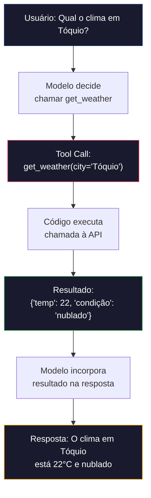

# Function Calling & Tool Use

> LLMs não conseguem fazer nada. Eles geram texto. Essa é toda a capacidade. Não conseguem checar clima, consultar banco de dados, enviar email, rodar código ou ler arquivo. Todo "AI agent" que você já viu é um LLM gerando JSON dizendo qual função chamar — e depois seu código realmente chamando. O modelo é o cérebro. Tools são as mãos. Function calling é o sistema nervoso conectando os dois.

**Tipo:** Construção
**Linguagens:** Python
**Pré-requisitos:** Fase 11 Aula 03 (Structured Outputs)
**Tempo:** ~75 minutos

## Objetivos de Aprendizado

- Implementar um loop de function calling: definir schemas de tools, parsear tool-call JSON do modelo, executar funções e retornar resultados
- Projetar schemas de tools com descrições claras e parâmetros tipados que o modelo consegue invocar de forma confiável
- Construir um loop multi-turno de agent que encadeia múltiplas chamadas de função para responder queries complexas
- Lidar com casos extremos: chamadas paralelas, propagação de erros e prevenção de loops infinitos

## O Problema

Você constrói um chatbot. Um usuário pergunta: "Qual o clima em Tóquio agora?" O LLM não tem como saber — não tem acesso a APIs. Ele gera uma resposta genérica ou inventa dados. Você precisa que o modelo "chame uma função" que busca o clima real.

A solução é function calling: o modelo gera JSON descrevendo qual função chamar com quais argumentos. Seu código executa a função e devolve o resultado. O modelo incorpora o resultado na resposta.

## O Conceito

### O Loop de Function Calling



### Definição de Tools

Cada tool precisa de um schema que o modelo consegue entender:

```python
TOOL_DEFINITIONS = {
    "get_weather": {
        "description": "Obtém o clima atual para uma cidade",
        "parameters": {
            "type": "object",
            "properties": {
                "city": {"type": "string", "description": "Nome da cidade"},
                "units": {"type": "string", "enum": ["celsius", "fahrenheit"]}
            },
            "required": ["city"]
        }
    },
    "calculator": {
        "description": "Calcula expressões matemáticas",
        "parameters": {
            "type": "object",
            "properties": {
                "expression": {"type": "string", "description": "Expressão matemática"}
            },
            "required": ["expression"]
        }
    },
    "web_search": {
        "description": "Busca na web por informação",
        "parameters": {
            "type": "object",
            "properties": {
                "query": {"type": "string", "description": "Termo de busca"}
            },
            "required": ["query"]
        }
    }
}
```

### Tool Choice

Controla como o modelo usa as tools:

- `"auto"`: Modelo decide quando chamar (padrão)
- `"required"`: Modelo deve chamar uma tool sempre
- `"none"`: Modelo não pode chamar tools
- `{"function": {"name": "get_weather"}}`: Força tool específica

## Construa

### Passo 1: Definição de Tools e Execução

```python
import json
import time

def get_weather(city, units="celsius"):
    """Simula chamada de API de clima."""
    mock_data = {
        "Tóquio": {"temp_c": 22, "condition": "Nublado", "humidity": 65},
        "Londres": {"temp_c": 15, "condition": "Chuvoso", "humidity": 80},
        "Nova York": {"temp_c": 28, "condition": "Ensolarado", "humidity": 45},
    }
    data = mock_data.get(city, {"temp_c": 20, "condition": "Desconhecido"})
    if units == "fahrenheit":
        data["temp_f"] = data["temp_c"] * 9/5 + 32
    return {"city": city, **data}

def calculator(expression):
    """Executa expressão matemática de forma segura."""
    allowed_chars = set("0123456789+-*/.(). ")
    if not all(c in allowed_chars for c in expression):
        return {"error": "Expressão contém caracteres não permitidos"}
    try:
        result = eval(expression)
        return {"expression": expression, "result": result}
    except Exception as e:
        return {"error": str(e)}

def execute_tool_call(tool_call):
    """Executa uma chamada de tool e retorna o resultado."""
    name = tool_call["name"]
    args = tool_call["arguments"]
    
    start = time.time()
    
    tools = {
        "get_weather": get_weather,
        "calculator": calculator,
    }
    
    if name not in tools:
        result = {"error": f"Tool desconhecida: {name}"}
    else:
        result = tools[name](**args)
    
    return {
        "tool": name,
        "result": result,
        "execution_time_ms": round((time.time() - start) * 1000, 2),
    }
```

### Passo 2: Simulador de LLM com Tool Calling

```python
def simulate_llm_with_tools(query, available_tools):
    """Simula um LLM que decide quando usar tools."""
    q = query.lower()
    
    if "clima" in q or "tempo" in q or "weather" in q:
        for city in ["Tóquio", "Londres", "Nova York"]:
            if city.lower() in q:
                return {
                    "tool_calls": [{"name": "get_weather", "arguments": {"city": city}}],
                    "text": None
                }
        return {
            "tool_calls": [{"name": "get_weather", "arguments": {"city": "São Paulo"}}],
            "text": None
        }
    
    if "calcul" in q or "quanto é" in q:
        import re
        expr_match = re.search(r'[\d\s+\-*/().]+', q)
        if expr_match:
            return {
                "tool_calls": [{"name": "calculator", "arguments": {"expression": expr_match.group().strip()}}],
                "text": None
            }
    
    return {
        "tool_calls": [],
        "text": f"Com base na sua pergunta sobre '{query}', posso ajudá-la da seguinte forma..."
    }
```

### Passo 3: Loop de Function Calling

```python
def run_function_calling_loop(query, max_iterations=5):
    """Executa o loop completo de function calling."""
    messages = [{"role": "user", "content": query}]
    all_tool_results = []
    
    for i in range(max_iterations):
        llm_response = simulate_llm_with_tools(query, TOOL_DEFINITIONS)
        
        if not llm_response["tool_calls"]:
            return {
                "response": llm_response["text"],
                "tool_results": all_tool_results,
                "iterations": i + 1,
            }
        
        for tool_call in llm_response["tool_calls"]:
            result = execute_tool_call(tool_call)
            all_tool_results.append(result)
            messages.append({
                "role": "tool",
                "tool_call_id": f"call_{i}",
                "content": json.dumps(result["result"])
            })
    
    return {
        "response": "Número máximo de iterações atingido.",
        "tool_results": all_tool_results,
        "iterations": max_iterations,
    }
```

## Use

### OpenAI Function Calling

```python
# from openai import OpenAI
#
# client = OpenAI()
#
# tools = [{
#     "type": "function",
#     "function": {
#         "name": "get_weather",
#         "description": "Obtém o clima atual para uma cidade",
#         "parameters": {
#             "type": "object",
#             "properties": {
#                 "city": {"type": "string"},
#             },
#             "required": ["city"]
#         }
#     }
# }]
#
# response = client.chat.completions.create(
#     model="gpt-4o",
#     messages=[{"role": "user", "content": "Clima em Tóquio?"}],
#     tools=tools,
#     tool_choice="auto",
# )
#
# tool_call = response.choices[0].message.tool_calls[0]
# args = json.loads(tool_call.function.arguments)
# result = get_weather(**args)
```

### Anthropic Tool Use

```python
# import anthropic
#
# client = anthropic.Anthropic()
#
# response = client.messages.create(
#     model="claude-sonnet-4-20250514",
#     max_tokens=1024,
#     tools=[{
#         "name": "get_weather",
#         "description": "Obtém o clima atual para uma cidade",
#         "input_schema": {
#             "type": "object",
#             "properties": {
#                 "city": {"type": "string"},
#             },
#             "required": ["city"]
#         }
#     }],
#     messages=[{"role": "user", "content": "Clima em Tóquio?"}],
# )
```

## Entregue

- `outputs/prompt-tool-designer.md` — template reutilizável para projetar definições de tools
- `outputs/skill-function-calling-patterns.md` — framework de decisão para function calling em produção

## Exercícios

1. Adicione uma 6th tool: consulta ao banco de dados. Implemente com tabela em memória.

2. Implemente retry com feedback de erro. Quando uma tool falhar, devolva o erro ao modelo.

3. Construa um agent multi-step que encadeia chamadas de tools.

4. Meça acurácia de seleção de tools: 30 queries com tools esperadas.

5. Implemente cache de chamadas: mesmo tool + mesmos argumentos em 60 segundos = cache hit.

## Termos-Chave

| Termo | O que o pessoal diz | O que realmente significa |
|-------|--------------------|-----------------------|
| Function calling | "Uso de tools" | Modelo gera JSON descrevendo função a invocar com argumentos específicos |
| Tool definition | "Schema de função" | Objeto JSON Schema descrevendo nome, propósito, parâmetros e tipos da tool |
| Tool choice | "Modo de chamada" | Controla se modelo deve (required), pode (auto) ou não pode (none) chamar tools |
| Parallel calling | "Multi-tool" | Modelo gera múltiplas tool calls em um turno |
| Agent loop | "Loop ReAct" | Ciclo iterativo: modelo decide, código executa, resultado volta |
| Tool poisoning | "Prompt injection via tools" | Ataque onde resultados de tools contêm instruções manipuladoras |
| MCP | "Protocolo de tools" | Model Context Protocol — padrão aberto para expor tools via servers |

## Leitura Adicional

- [OpenAI Function Calling Guide](https://platform.openai.com/docs/guides/function-calling) — referência definitiva
- [Anthropic Tool Use Guide](https://docs.anthropic.com/en/docs/tool-use) — implementação Claude
- [Model Context Protocol Specification](https://modelcontextprotocol.io) — padrão aberto
- [Toolformer: Language Models Can Teach Themselves to Use Tools](https://arxiv.org/abs/2302.04761) — paper fundacional
- [Berkeley Function Calling Leaderboard](https://gorilla.cs.berkeley.edu/leaderboard.html) — benchmark comparativo
