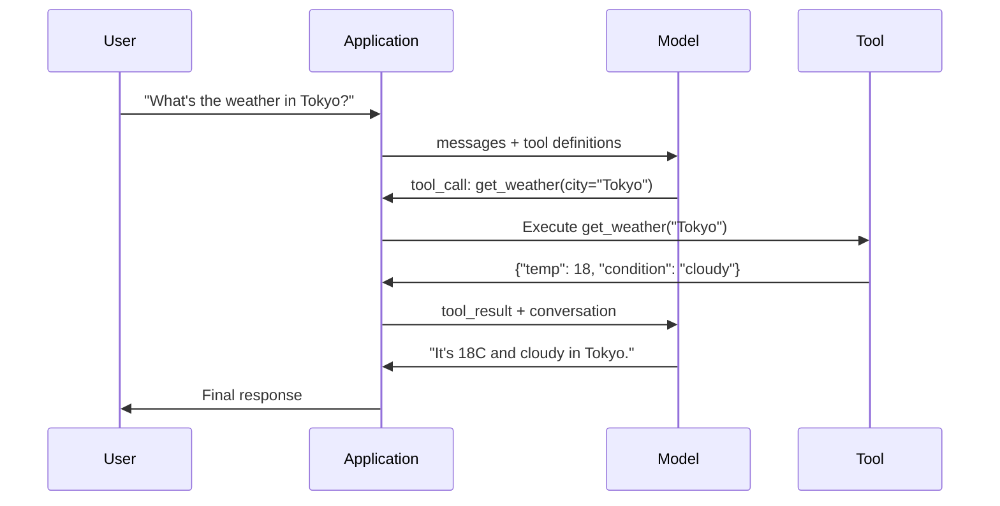

# İşlev Çağırma ve Araç Kullanımı

> LLM'ler hiçbir şey yapamaz. Metin üretirler. Tüm yetenek budur. Hava durumunu kontrol edemez, bir veritabanını sorgulayamaz, e-posta gönderemez, kod çalıştıramaz veya bir dosyayı okuyamazlar. Gördüğünüz her "AI agent", hangi işlevin çağrılacağını söyleyen LLM üreten JSON'dur ve ardından kodunuz onu gerçekten çağırır. Model beyindir. Araçlar ellerdir. Function calling, onları birbirine bağlayan sinir sistemidir.

**Tür:** Yapım
**Diller:** Python
**Önkoşullar:** Aşama 11 Ders 03 (Yapılandırılmış Çıktılar)
**Süre:** ~75 dakika
**İlgili:** Aşama 11 · 14 (Model Bağlam Protokolü) — bir araç ana bilgisayarlar arasında paylaşıldığında, satır içi function callingndan bir MCP sunucusuna geçin. Bu ders satır içi durumu kapsar; MCP protokol durumunu kapsar.

## Öğrenme Hedefleri

- Bir function calling döngüsü uygulayın: araç şemalarını tanımlayın, modelin araç çağrısı JSON'unu ayrıştırın, işlevleri yürütün ve sonuçları döndürün
- Modelin güvenilir bir şekilde çağırabileceği net açıklamalara ve yazılı parametrelere sahip araç şemaları tasarlayın
- Karmaşık sorguları yanıtlamak için birden fazla function callingnı zincirleyen çok dönüşlü bir agent loop oluşturun
- İşlev çağıran uç durumları ele alın: paralel takım çağrıları, hata yayılımı ve sonsuz takım döngülerinin önlenmesi

## Sorun

Bir chatbot inşa edersiniz. Bir kullanıcı şunu soruyor: "Şu anda Tokyo'da hava nasıl?"

Model yanıt veriyor: "Gerçek zamanlı hava durumu verilerine erişimim yok, ancak mevsime göre Tokyo muhtemelen 15 santigrat derece civarında..."

Bu, sorumluluk reddi beyanına bürünmüş bir halüsinasyondur. Model hava durumunu bilmiyor. Asla olmayacak. Hava her saat değişiyor. Modelin eğitim verileri aylardır eskidir.

Doğru cevap, OpenWeatherMap API'sinin çağrılmasını, mevcut sıcaklığın alınmasını ve gerçek sayının döndürülmesini gerektirir. Model API'leri çağıramaz. Kodunuz bunu yapabilir. Eksik parça: modelin "Bu argümanlarla hava durumu API'sini çağırmam gerekiyor" demesine ve kodunuzun bunu yürütmesine ve sonucu geri göndermesine olanak tanıyan yapılandırılmış bir protokol.

Bu function callingdır. Model, hangi işlevin hangi argümanlarla çağrılacağını açıklayan yapılandırılmış JSON çıktısı verir. Uygulamanız işlevi yürütür. Sonuç konuşmaya geri döner. Model, nihai cevabını üretmek için sonucu kullanır.

Function calling olmadan LLM'ler ansiklopedilere dönüşür. Bununla birlikte agents olurlar.

## Konsept

### İşlev Çağırma Döngüsü

Her alet kullanım etkileşimi aynı 5 adımlı döngüyü takip eder.



Adım 1: Kullanıcı bir mesaj gönderir. Adım 2: model, mesajı araç tanımlarıyla birlikte alır (mevcut işlevleri açıklayan JSON Şeması). Adım 3: Model, metinle yanıt vermek yerine bir araç çağrısı (işlev adı ve argümanları içeren yapılandırılmış bir JSON nesnesi) çıkarır. Adım 4: kodunuz işlevi yürütür ve sonucu yakalar. Adım 5: Sonuç, nihai cevabını üretmek için artık gerçek verilere sahip olan modele geri döner.

Model hiçbir zaman hiçbir şeyi yürütmez. Sadece neyi arayacağına ve hangi argümanlarla karar vereceğine karar verir. Kodunuz yürütücüdür.

### Araç Tanımları: JSON Şema Sözleşmesi

Her araç, modele fonksiyonun ne yaptığını, hangi argümanları aldığını ve bu argümanların ne tür olması gerektiğini söyleyen bir JSON Şeması tarafından tanımlanır.

```json
{
  "type": "function",
  "function": {
    "name": "get_weather",
    "description": "Get current weather for a city. Returns temperature in Celsius and conditions.",
    "parameters": {
      "type": "object",
      "properties": {
        "city": {
          "type": "string",
          "description": "City name, e.g. 'Tokyo' or 'San Francisco'"
        },
        "units": {
          "type": "string",
          "enum": ["celsius", "fahrenheit"],
          "description": "Temperature units"
        }
      },
      "required": ["city"]
    }
  }
}
```

`description` alanları kritiktir. Model, aracın ne zaman ve nasıl kullanılacağına karar vermek için bunları okur. "Hava durumunu alır" gibi belirsiz bir açıklama, "Bir şehrin mevcut hava durumunu alın. Sıcaklığı Santigrat cinsinden ve koşulları döndürür" ifadesinden daha kötü bir araç seçimine neden olur. Açıklama, araç seçimi için bir prompt şeklindedir.

### Sağlayıcı Karşılaştırması

Her büyük sağlayıcı function callingnı destekler, ancak API yüzeyi farklıdır.

| Sağlayıcı | API Parametresi | Araç Çağrı Formatı | Paralel Aramalar | Zorla Arama |
|----------|--------------|-----------------|---------------|----------------|
| OpenAI (GPT-5, o4) | `tools` | `tool_calls[].function` | Evet (tur başına birden fazla) | `tool_choice="required"` |
| Anthropic (Claude 4.6/4.7) | `tools` | `content[].type="tool_use"` | Evet (birden fazla blok) | `tool_choice={"type":"any"}` |
| Google (İkizler 3) | `function_declarations` | `functionCall` | Evet | `function_calling_config` |
| Açık ağırlık (Llama 4, Qwen3, DeepSeek-V3) | Lama 4'te yerel `tools`; Diğerlerinde Hermes veya ChatML | Karışık | Modele bağlı | Prompt tabanlı veya destekleniyorsa `tool_choice` |

2026 yılına gelindiğinde kapalı olan üç sağlayıcı, neredeyse aynı JSON-Şema tabanlı formatlarda birleşti. Llama 4, OpenAI'nin şekliyle eşleşen yerel bir `tools` alanıyla birlikte gelir. Açık ağırlıklı ince ayarlar hala farklılık göstermektedir; Hermes formatı (NousResearch), üçüncü taraf ince ayarlar için en yaygın olanıdır. Ana bilgisayarlar arasında paylaşılan araçlar için, satır içi function calling yerine MCP'yi (Aşama 11 · 14) tercih edin; sunucu hepsi için aynıdır.

### Araç Seçimi: Otomatik, Gerekli, Özel

Modelin araçları ne zaman kullanacağını siz kontrol edersiniz.

**Otomatik** (varsayılan): Model, bir aracı mı çağıracağına yoksa doğrudan yanıt mı vereceğine karar verir. "2+2 nedir?" - doğrudan yanıt verir. "Hava nasıl?" -- aracı çağırır.

**Zorunlu**: model en az bir aracı çağırmalıdır. Kullanıcının amacının bir araç gerektirdiğini bildiğinizde bunu kullanın. Modelin gerçek verilere bakmak yerine tahmin yürütmesini engeller.

**Belirli işlev**: modeli belirli bir işlevi çağırmaya zorlayın. `tool_choice={"type":"function", "function": {"name": "get_weather"}}`, sorgudan bağımsız olarak hava durumu aracının çağrılmasını garanti eder. Bunu yönlendirme için kullanın - yukarı akış mantığı zaten hangi aracın gerekli olduğunu belirlediğinde.

### Paralel İşlev Çağrısı

GPT-4o ve Claude tek seferde birden fazla işlevi çağırabilir. Bir kullanıcı şunu soruyor: "Tokyo ve New York'ta hava nasıl?" Model aynı anda iki araç çağrısının çıktısını verir:

```json
[
  {"name": "get_weather", "arguments": {"city": "Tokyo"}},
  {"name": "get_weather", "arguments": {"city": "New York"}}
]
```

Kodunuz her ikisini de (ideal olarak aynı anda) yürütür, her iki sonucu da döndürür ve model tek bir yanıtı sentezler. Bu, gidiş dönüş sayısını 2'den 1'e düşürür. Sorgu başına 5-10 araç çağrısı olan agent'lar için paralel çağrı, gecikmeyi %60-80 oranında azaltır.

### Yapılandırılmış Çıkışlar ve İşlev Çağrısı Karşılaştırması

Ders 03 yapılandırılmış çıktıları kapsıyordu. Function calling aynı JSON Schema mekanizmasını kullanır ancak farklı bir amaç için kullanılır.

**Yapılandırılmış çıktılar**: Modeli belirli bir biçimde veri üretmeye zorlayın. Çıktı nihai üründür. Örnek: ürün bilgilerini metinden `{name, price, in_stock}` olarak çıkarın.

**Function calling**: model, bir eylemi yürütme niyetini bildirir. Çıkış bir ara adımdır. Örnek: `get_weather(city="Tokyo")` -- model bir eylem talep ediyor, nihai yanıtı üretmiyor.

Veri çıkarmak istediğinizde yapılandırılmış çıktıları kullanın. Modelin harici sistemlerle etkileşime girmesini istediğinizde function callingyı kullanın.

### Güvenlik: Pazarlık Edilemez Kurallar

Function calling, LLM'a verebileceğiniz en tehlikeli yetenektir. Model neyin yürütüleceğini seçer. Araç setiniz veritabanı sorguları içeriyorsa, model sorguları oluşturur. Kabuk komutları içeriyorsa model bunları yazar.

**Kural 1: Model tarafından oluşturulan SQL'i asla doğrudan bir veritabanına iletmeyin.** Model, DROP TABLE, UNION enjeksiyonları veya her satırı döndüren sorgular oluşturabilir ve üretecektir. Her zaman parametrelendirin. Her zaman doğrulayın. Her zaman izin verilenler listesini kullanın.

**Kural 2: İzin verilenler listesi işlevleri.** Model yalnızca açıkça tanımladığınız işlevleri çağırabilir. Asla genel bir "herhangi bir işlevi ada göre çalıştır" aracı oluşturmayın. 50 dahili fonksiyonunuz varsa, yalnızca kullanıcının ihtiyaç duyduğu 5 tanesini gösterin.

**Kural 3: Bağımsız değişkenleri doğrulayın.** Model, `"; DROP TABLE users; --"` şehir adını iletebilir. Yürütmeden önce her bağımsız değişkeni beklenen türlere, aralıklara ve biçimlere göre doğrulayın.

**Kural 4: Araç sonuçlarını temizleyin.** Bir araç hassas veriler (API anahtarları, PII, dahili hatalar) döndürürse, onu modele geri göndermeden önce filtreleyin. Model, yanıtında araç sonuçlarını aynen içerecektir.

**Kural 5: Araç çağrılarını oran sınırı.** Döngüdeki bir model, araçları yüzlerce kez çağırabilir. Bir maksimum değer belirleyin (konuşma başına 10-20 çağrı makuldür). Sonsuz döngüleri kırın.

### Hata İşleme

Araçlar başarısız oluyor. API'ler zaman aşımına uğradı. Veritabanları çöküyor. Dosyalar mevcut değil. Modelin, bir takımın ne zaman arızalandığını ve nedenini bilmesi gerekir.

Hataları istisnalar olarak değil, yapılandırılmış araç sonuçları olarak döndürün:

```json
{
  "error": true,
  "message": "City 'Toky' not found. Did you mean 'Tokyo'?",
  "code": "CITY_NOT_FOUND"
}
```

Model bunu okur, argümanlarını ayarlar ve yeniden dener. Modeller, yapılandırılmış hata mesajlarını kendi kendine düzeltme konusunda iyidir. Boş yanıtlardan veya genel "bir şeyler ters gitti" hatalarından kurtulma konusunda başarısızdırlar.

### MCP: Model Bağlam Protokolü

MCP, Anthropic'in araç birlikte çalışabilirliğine yönelik açık standardıdır. Her uygulamanın kendi araçlarını tanımlaması yerine, MCP evrensel bir protokol sağlar: araçlar MCP sunucuları tarafından sunulur ve MCP istemcileri (Claude Code, Cursor veya uygulamanız gibi) tarafından tüketilir.

Bir MCP sunucusu, araçları herhangi bir uyumlu istemciye sunabilir. Postgres MCP sunucusu, MCP uyumlu herhangi bir agent veritabanına erişim sağlar. GitHub MCP sunucusu herhangi bir agent deposuna erişim sağlar. Araçlar bir kez tanımlanır ve her yerde kullanılır.

MCP, ağ bağlantısına HTTP'nin ne olduğunu çağırma işlevi görmektedir. Araçların taşınabilir hale gelmesi için taşıma katmanını standartlaştırır.

## İnşa Et

### Adım 1: Araç Kaydını Tanımlayın

Araç tanımlarını ve bunların uygulamalarını depolayan bir kayıt defteri oluşturun. Her aracın bir JSON Şema tanımı (modelin gördüğü şey) ve bir Python işlevi (kodunuzun yürüttüğü şey) vardır.

```python
import json
import math
import time
import hashlib


TOOL_REGISTRY = {}


def register_tool(name, description, parameters, function):
    TOOL_REGISTRY[name] = {
        "definition": {
            "type": "function",
            "function": {
                "name": name,
                "description": description,
                "parameters": parameters,
            },
        },
        "function": function,
    }
```

### Adım 2: 5 Aracı Uygulayın

Bir hesap makinesi, hava durumu araması, web arama simülatörü, dosya okuyucu ve kod çalıştırıcı oluşturun.

```python
def calculator(expression, precision=2):
    allowed = set("0123456789+-*/.() ")
    if not all(c in allowed for c in expression):
        return {"error": True, "message": f"Invalid characters in expression: {expression}"}
    try:
        result = eval(expression, {"__builtins__": {}}, {"math": math})
        return {"result": round(float(result), precision), "expression": expression}
    except Exception as e:
        return {"error": True, "message": str(e)}


WEATHER_DB = {
    "tokyo": {"temp_c": 18, "condition": "cloudy", "humidity": 72, "wind_kph": 14},
    "new york": {"temp_c": 22, "condition": "sunny", "humidity": 45, "wind_kph": 8},
    "london": {"temp_c": 12, "condition": "rainy", "humidity": 88, "wind_kph": 22},
    "san francisco": {"temp_c": 16, "condition": "foggy", "humidity": 80, "wind_kph": 18},
    "sydney": {"temp_c": 25, "condition": "sunny", "humidity": 55, "wind_kph": 10},
}


def get_weather(city, units="celsius"):
    key = city.lower().strip()
    if key not in WEATHER_DB:
        suggestions = [c for c in WEATHER_DB if c.startswith(key[:3])]
        return {
            "error": True,
            "message": f"City '{city}' not found.",
            "suggestions": suggestions,
            "code": "CITY_NOT_FOUND",
        }
    data = WEATHER_DB[key].copy()
    if units == "fahrenheit":
        data["temp_f"] = round(data["temp_c"] * 9 / 5 + 32, 1)
        del data["temp_c"]
    data["city"] = city
    return data


SEARCH_DB = {
    "python function calling": [
        {"title": "OpenAI Function Calling Guide", "url": "https://platform.openai.com/docs/guides/function-calling", "snippet": "Learn how to connect LLMs to external tools."},
        {"title": "Anthropic Tool Use", "url": "https://docs.anthropic.com/en/docs/tool-use", "snippet": "Claude can interact with external tools and APIs."},
    ],
    "MCP protocol": [
        {"title": "Model Context Protocol", "url": "https://modelcontextprotocol.io", "snippet": "An open standard for connecting AI models to data sources."},
    ],
    "weather API": [
        {"title": "OpenWeatherMap API", "url": "https://openweathermap.org/api", "snippet": "Free weather API with current, forecast, and historical data."},
    ],
}


def web_search(query, max_results=3):
    key = query.lower().strip()
    for db_key, results in SEARCH_DB.items():
        if db_key in key or key in db_key:
            return {"query": query, "results": results[:max_results], "total": len(results)}
    return {"query": query, "results": [], "total": 0}


FILE_SYSTEM = {
    "data/config.json": '{"model": "gpt-4o", "temperature": 0.7, "max_tokens": 4096}',
    "data/users.csv": "name,email,role\nAlice,alice@example.com,admin\nBob,bob@example.com,user",
    "README.md": "# My Project\nA tool-use agent built from scratch.",
}


def read_file(path):
    if ".." in path or path.startswith("/"):
        return {"error": True, "message": "Path traversal not allowed.", "code": "FORBIDDEN"}
    if path not in FILE_SYSTEM:
        available = list(FILE_SYSTEM.keys())
        return {"error": True, "message": f"File '{path}' not found.", "available_files": available, "code": "NOT_FOUND"}
    content = FILE_SYSTEM[path]
    return {"path": path, "content": content, "size_bytes": len(content), "lines": content.count("\n") + 1}


def run_code(code, language="python"):
    if language != "python":
        return {"error": True, "message": f"Language '{language}' not supported. Only 'python' is available."}
    forbidden = ["import os", "import sys", "import subprocess", "exec(", "eval(", "__import__", "open("]
    for pattern in forbidden:
        if pattern in code:
            return {"error": True, "message": f"Forbidden operation: {pattern}", "code": "SECURITY_VIOLATION"}
    try:
        local_vars = {}
        exec(code, {"__builtins__": {"print": print, "range": range, "len": len, "str": str, "int": int, "float": float, "list": list, "dict": dict, "sum": sum, "min": min, "max": max, "abs": abs, "round": round, "sorted": sorted, "enumerate": enumerate, "zip": zip, "map": map, "filter": filter, "math": math}}, local_vars)
        result = local_vars.get("result", None)
        return {"success": True, "result": result, "variables": {k: str(v) for k, v in local_vars.items() if not k.startswith("_")}}
    except Exception as e:
        return {"error": True, "message": f"{type(e).__name__}: {e}"}
```

### Adım 3: Tüm Araçları Kaydedin

```python
def register_all_tools():
    register_tool(
        "calculator", "Evaluate a mathematical expression. Supports +, -, *, /, parentheses, and decimals. Returns the numeric result.",
        {"type": "object", "properties": {"expression": {"type": "string", "description": "Math expression, e.g. '(10 + 5) * 3'"}, "precision": {"type": "integer", "description": "Decimal places in result", "default": 2}}, "required": ["expression"]},
        calculator,
    )
    register_tool(
        "get_weather", "Get current weather for a city. Returns temperature, condition, humidity, and wind speed.",
        {"type": "object", "properties": {"city": {"type": "string", "description": "City name, e.g. 'Tokyo' or 'San Francisco'"}, "units": {"type": "string", "enum": ["celsius", "fahrenheit"], "description": "Temperature units, defaults to celsius"}}, "required": ["city"]},
        get_weather,
    )
    register_tool(
        "web_search", "Search the web for information. Returns a list of results with title, URL, and snippet.",
        {"type": "object", "properties": {"query": {"type": "string", "description": "Search query"}, "max_results": {"type": "integer", "description": "Maximum results to return", "default": 3}}, "required": ["query"]},
        web_search,
    )
    register_tool(
        "read_file", "Read the contents of a file. Returns the file content, size, and line count.",
        {"type": "object", "properties": {"path": {"type": "string", "description": "Relative file path, e.g. 'data/config.json'"}}, "required": ["path"]},
        read_file,
    )
    register_tool(
        "run_code", "Execute Python code in a sandboxed environment. Set a 'result' variable to return output.",
        {"type": "object", "properties": {"code": {"type": "string", "description": "Python code to execute"}, "language": {"type": "string", "enum": ["python"], "description": "Programming language"}}, "required": ["code"]},
        run_code,
    )
```

### Adım 4: İşlev Çağırma Döngüsünü Oluşturun

Bu çekirdek motordur. Hangi aracın çağrılacağına karar veren modeli simüle eder, aracı çalıştırır ve sonuçları geri bildirir.

```python
def simulate_model_decision(user_message, tools, conversation_history):
    msg = user_message.lower()

    if any(word in msg for word in ["weather", "temperature", "forecast"]):
        cities = []
        for city in WEATHER_DB:
            if city in msg:
                cities.append(city)
        if not cities:
            for word in msg.split():
                if word.capitalize() in [c.title() for c in WEATHER_DB]:
                    cities.append(word)
        if not cities:
            cities = ["tokyo"]
        calls = []
        for city in cities:
            calls.append({"name": "get_weather", "arguments": {"city": city.title()}})
        return calls

    if any(word in msg for word in ["calculate", "compute", "math", "what is", "how much"]):
        for token in msg.split():
            if any(c in token for c in "+-*/"):
                return [{"name": "calculator", "arguments": {"expression": token}}]
        if "+" in msg or "-" in msg or "*" in msg or "/" in msg:
            expr = "".join(c for c in msg if c in "0123456789+-*/.() ")
            if expr.strip():
                return [{"name": "calculator", "arguments": {"expression": expr.strip()}}]
        return [{"name": "calculator", "arguments": {"expression": "0"}}]

    if any(word in msg for word in ["search", "find", "look up", "google"]):
        query = msg.replace("search for", "").replace("look up", "").replace("find", "").strip()
        return [{"name": "web_search", "arguments": {"query": query}}]

    if any(word in msg for word in ["read", "file", "open", "cat", "show"]):
        for path in FILE_SYSTEM:
            if path.split("/")[-1].split(".")[0] in msg:
                return [{"name": "read_file", "arguments": {"path": path}}]
        return [{"name": "read_file", "arguments": {"path": "README.md"}}]

    if any(word in msg for word in ["run", "execute", "code", "python"]):
        return [{"name": "run_code", "arguments": {"code": "result = 'Hello from the sandbox!'", "language": "python"}}]

    return []


def execute_tool_call(tool_call):
    name = tool_call["name"]
    args = tool_call["arguments"]

    if name not in TOOL_REGISTRY:
        return {"error": True, "message": f"Unknown tool: {name}", "code": "UNKNOWN_TOOL"}

    tool = TOOL_REGISTRY[name]
    func = tool["function"]
    start = time.time()

    try:
        result = func(**args)
    except TypeError as e:
        result = {"error": True, "message": f"Invalid arguments: {e}"}

    elapsed_ms = round((time.time() - start) * 1000, 2)
    return {"tool": name, "result": result, "execution_time_ms": elapsed_ms}


def run_function_calling_loop(user_message, max_iterations=5):
    conversation = [{"role": "user", "content": user_message}]
    tool_definitions = [t["definition"] for t in TOOL_REGISTRY.values()]
    all_tool_results = []

    for iteration in range(max_iterations):
        tool_calls = simulate_model_decision(user_message, tool_definitions, conversation)

        if not tool_calls:
            break

        results = []
        for call in tool_calls:
            result = execute_tool_call(call)
            results.append(result)

        conversation.append({"role": "assistant", "content": None, "tool_calls": tool_calls})

        for result in results:
            conversation.append({"role": "tool", "content": json.dumps(result["result"]), "tool_name": result["tool"]})

        all_tool_results.extend(results)
        break

    return {"conversation": conversation, "tool_results": all_tool_results, "iterations": iteration + 1 if tool_calls else 0}
```

### Adım 5: Bağımsız Değişken Doğrulaması

Yürütmeden önce araç çağrısı bağımsız değişkenlerini JSON Şemasına göre kontrol eden bir doğrulayıcı oluşturun.

```python
def validate_tool_arguments(tool_name, arguments):
    if tool_name not in TOOL_REGISTRY:
        return [f"Unknown tool: {tool_name}"]

    schema = TOOL_REGISTRY[tool_name]["definition"]["function"]["parameters"]
    errors = []

    if not isinstance(arguments, dict):
        return [f"Arguments must be an object, got {type(arguments).__name__}"]

    for required_field in schema.get("required", []):
        if required_field not in arguments:
            errors.append(f"Missing required argument: {required_field}")

    properties = schema.get("properties", {})
    for arg_name, arg_value in arguments.items():
        if arg_name not in properties:
            errors.append(f"Unknown argument: {arg_name}")
            continue

        prop_schema = properties[arg_name]
        expected_type = prop_schema.get("type")

        type_checks = {"string": str, "integer": int, "number": (int, float), "boolean": bool, "array": list, "object": dict}
        if expected_type in type_checks:
            if not isinstance(arg_value, type_checks[expected_type]):
                errors.append(f"Argument '{arg_name}': expected {expected_type}, got {type(arg_value).__name__}")

        if "enum" in prop_schema and arg_value not in prop_schema["enum"]:
            errors.append(f"Argument '{arg_name}': '{arg_value}' not in {prop_schema['enum']}")

    return errors
```

### Adım 6: Demoyu Çalıştırın

```python
def run_demo():
    register_all_tools()

    print("=" * 60)
    print("  Function Calling & Tool Use Demo")
    print("=" * 60)

    print("\n--- Registered Tools ---")
    for name, tool in TOOL_REGISTRY.items():
        desc = tool["definition"]["function"]["description"][:60]
        params = list(tool["definition"]["function"]["parameters"].get("properties", {}).keys())
        print(f"  {name}: {desc}...")
        print(f"    params: {params}")

    print(f"\n--- Argument Validation ---")
    validation_tests = [
        ("get_weather", {"city": "Tokyo"}, "Valid call"),
        ("get_weather", {}, "Missing required arg"),
        ("get_weather", {"city": "Tokyo", "units": "kelvin"}, "Invalid enum value"),
        ("calculator", {"expression": 123}, "Wrong type (int for string)"),
        ("unknown_tool", {"x": 1}, "Unknown tool"),
    ]
    for tool_name, args, label in validation_tests:
        errors = validate_tool_arguments(tool_name, args)
        status = "VALID" if not errors else f"ERRORS: {errors}"
        print(f"  {label}: {status}")

    print(f"\n--- Tool Execution ---")
    direct_tests = [
        {"name": "calculator", "arguments": {"expression": "(10 + 5) * 3 / 2"}},
        {"name": "get_weather", "arguments": {"city": "Tokyo"}},
        {"name": "get_weather", "arguments": {"city": "Mars"}},
        {"name": "web_search", "arguments": {"query": "python function calling"}},
        {"name": "read_file", "arguments": {"path": "data/config.json"}},
        {"name": "read_file", "arguments": {"path": "../etc/passwd"}},
        {"name": "run_code", "arguments": {"code": "result = sum(range(1, 101))"}},
        {"name": "run_code", "arguments": {"code": "import os; os.system('rm -rf /')"}},
    ]
    for call in direct_tests:
        result = execute_tool_call(call)
        print(f"\n  {call['name']}({json.dumps(call['arguments'])})")
        print(f"    -> {json.dumps(result['result'], indent=None)[:100]}")
        print(f"    time: {result['execution_time_ms']}ms")

    print(f"\n--- Full Function Calling Loop ---")
    test_queries = [
        "What's the weather in Tokyo?",
        "Calculate (100 + 250) * 0.15",
        "Search for MCP protocol",
        "Read the config file",
        "Run some Python code",
        "Tell me a joke",
    ]
    for query in test_queries:
        print(f"\n  User: {query}")
        result = run_function_calling_loop(query)
        if result["tool_results"]:
            for tr in result["tool_results"]:
                print(f"    Tool: {tr['tool']} ({tr['execution_time_ms']}ms)")
                print(f"    Result: {json.dumps(tr['result'], indent=None)[:90]}")
        else:
            print(f"    [No tool called -- direct response]")
        print(f"    Iterations: {result['iterations']}")

    print(f"\n--- Parallel Tool Calls ---")
    multi_city_query = "What's the weather in tokyo and london?"
    print(f"  User: {multi_city_query}")
    result = run_function_calling_loop(multi_city_query)
    print(f"  Tool calls made: {len(result['tool_results'])}")
    for tr in result["tool_results"]:
        city = tr["result"].get("city", "unknown")
        temp = tr["result"].get("temp_c", "N/A")
        print(f"    {city}: {temp}C, {tr['result'].get('condition', 'N/A')}")

    print(f"\n--- Security Checks ---")
    security_tests = [
        ("read_file", {"path": "../../etc/passwd"}),
        ("run_code", {"code": "import subprocess; subprocess.run(['ls'])"}),
        ("calculator", {"expression": "__import__('os').system('ls')"}),
    ]
    for tool_name, args in security_tests:
        result = execute_tool_call({"name": tool_name, "arguments": args})
        blocked = result["result"].get("error", False)
        print(f"  {tool_name}({list(args.values())[0][:40]}): {'BLOCKED' if blocked else 'ALLOWED'}")
```

## Kullan onu

### OpenAI İşlev Çağrısı

```python
# from openai import OpenAI
#
# client = OpenAI()
#
# tools = [{
#     "type": "function",
#     "function": {
#         "name": "get_weather",
#         "description": "Get current weather for a city",
#         "parameters": {
#             "type": "object",
#             "properties": {
#                 "city": {"type": "string"},
#                 "units": {"type": "string", "enum": ["celsius", "fahrenheit"]}
#             },
#             "required": ["city"]
#         }
#     }
# }]
#
# response = client.chat.completions.create(
#     model="gpt-4o",
#     messages=[{"role": "user", "content": "Weather in Tokyo?"}],
#     tools=tools,
#     tool_choice="auto",
# )
#
# tool_call = response.choices[0].message.tool_calls[0]
# args = json.loads(tool_call.function.arguments)
# result = get_weather(**args)
#
# final = client.chat.completions.create(
#     model="gpt-4o",
#     messages=[
#         {"role": "user", "content": "Weather in Tokyo?"},
#         response.choices[0].message,
#         {"role": "tool", "tool_call_id": tool_call.id, "content": json.dumps(result)},
#     ],
# )
# print(final.choices[0].message.content)
```

OpenAI, araç çağrılarını `response.choices[0].message.tool_calls` olarak döndürür. Her çağrının, sonucu döndürürken eklemeniz gereken bir `id` vardır. Model, sonuçları çağrılarla eşleştirmek için bu kimliği kullanır. GPT-4o, tek bir yanıtta birden fazla araç çağrısını geri döndürebilir; hepsini yineleyebilir ve yürütebilir.

### Anthropic Araç Kullanımı

```python
# import anthropic
#
# client = anthropic.Anthropic()
#
# response = client.messages.create(
#     model="claude-sonnet-5",
#     max_tokens=1024,
#     tools=[{
#         "name": "get_weather",
#         "description": "Get current weather for a city",
#         "input_schema": {
#             "type": "object",
#             "properties": {
#                 "city": {"type": "string"},
#                 "units": {"type": "string", "enum": ["celsius", "fahrenheit"]}
#             },
#             "required": ["city"]
#         }
#     }],
#     messages=[{"role": "user", "content": "Weather in Tokyo?"}],
# )
#
# tool_block = next(b for b in response.content if b.type == "tool_use")
# result = get_weather(**tool_block.input)
#
# final = client.messages.create(
#     model="claude-sonnet-5",
#     max_tokens=1024,
#     tools=[...],
#     messages=[
#         {"role": "user", "content": "Weather in Tokyo?"},
#         {"role": "assistant", "content": response.content},
#         {"role": "user", "content": [{"type": "tool_result", "tool_use_id": tool_block.id, "content": json.dumps(result)}]},
#     ],
# )
```

Anthropic, araç çağrılarını `type: "tool_use"` ile içerik blokları olarak döndürür. Araç sonucu, `type: "tool_result"` içeren bir kullanıcı mesajına gider. Temel farklılığa dikkat edin: Anthropic, araç parametre tanımları için `input_schema` kullanırken, OpenAI `parameters` kullanır.

### MCP Entegrasyonu

```python
# MCP servers expose tools over a standardized protocol.
# Any MCP-compatible client can discover and call these tools.
#
# Example: connecting to a Postgres MCP server
#
# from mcp import ClientSession, StdioServerParameters
# from mcp.client.stdio import stdio_client
#
# server_params = StdioServerParameters(
#     command="npx",
#     args=["-y", "@modelcontextprotocol/server-postgres", "postgresql://localhost/mydb"],
# )
#
# async with stdio_client(server_params) as (read, write):
#     async with ClientSession(read, write) as session:
#         await session.initialize()
#         tools = await session.list_tools()
#         result = await session.call_tool("query", {"sql": "SELECT count(*) FROM users"})
```

MCP, takım uygulamasını takım tüketiminden ayırır. Postgres sunucusu SQL'i biliyor. GitHub sunucusu API'yi biliyor. agent cihazınız yalnızca araçları keşfeder ve çağırır; her entegrasyon için sağlayıcıya özel koda ihtiyaç duymaz.

## Gönderin

Bu ders, araç tanımlarını tasarlamak için yeniden kullanılabilir bir prompt şablonu olan `outputs/prompt-tool-designer.md`'yi üretir. Bir aracın ne yapmasını istediğinize dair bir açıklama verin; o da açıklamalar, türler ve kısıtlamalarla birlikte eksiksiz JSON Şeması tanımını üretecektir.

Ayrıca, araç tasarımı, hata işleme, güvenlik ve sağlayıcıya özgü kalıpları kapsayan, üretimde function callingnın uygulanmasına yönelik bir karar olan `outputs/skill-function-calling-patterns.md` - bir karar framework üretir.

## Egzersizler

1. **6. aracı ekleyin: veritabanı sorgusu.** Bellek içi tabloyla simüle edilmiş bir SQL aracı uygulayın. Araç, bir tablo adını ve filtre koşullarını (ham SQL'i değil) kabul eder. Tablo adının izin verilenler listesinde olduğunu ve filtre operatörlerinin `=`, `>`, `<`, `>=`, `<=` ile sınırlı olduğunu doğrulayın. Eşleşen satırları JSON olarak döndürün.

2. **Hata geri bildirimi ile yeniden denemeyi uygulayın.** Bir araç çağrısı başarısız olduğunda (e.g., şehir bulunamadı), hata mesajını model karar fonksiyonuna geri gönderin ve argümanlarını düzeltmesine izin verin. Her aramanın kaç yeniden deneme sürdüğünü takip edin. Araç çağrısı başına maksimum 3 yeniden deneme ayarlayın.

3. **Çok adımlı bir agent oluşturun.** Bazı sorgular zincirleme araç çağrıları gerektirir: "Yapılandırma dosyasını okuyun ve bana hangi modelin yapılandırıldığını söyleyin, ardından bu modelin fiyatını web'de arayın." Model daha fazla araca gerek olmadığına karar verene kadar çalışan bir döngü uygulayın ve birikmiş sonuçları her karar adımına aktarın. Sonsuz döngüleri önlemek için 10 yinelemeyle sınırlayın.

4. **Araç seçiminin doğruluğunu ölçün.** Beklenen araç adlarıyla 30 test sorgusu oluşturun. Karar fonksiyonunuzu 30'un tamamında çalıştırın ve doğru aracı seçme süresinin yüzde kaçının ölçtüğünü görün. Araçlar arasında en fazla karışıklığa hangi sorguların neden olduğunu belirleyin.

5. **Araç çağrısını önbelleğe almayı uygulayın.** Aynı araç 60 saniye içinde aynı argümanlarla çağrılırsa, yeniden çalıştırmak yerine önbelleğe alınan sonucu döndürün. `(tool_name, frozenset(args.items()))` ile anahtarlanmış bir sözlük kullanın. 20 sorgu içeren bir görüşmedeki önbellek isabet oranlarını ölçün.

## Anahtar Terimler

| Dönem | İnsanlar ne diyor | Aslında ne anlama geliyor |
|------|----------------|----------------------|
| Function calling | "Araç kullanımı" | Model, belirli bağımsız değişkenlerle çağrılacak bir işlevi açıklayan yapılandırılmış JSON çıktısı verir; bunu model değil, kodunuz yürütür |
| Araç tanımı | "İşlev şeması" | Bir aracın adını, amacını, parametrelerini ve türlerini açıklayan bir JSON Schema nesnesi; model, aracın ne zaman ve nasıl kullanılacağına karar vermek için bunu okur |
| Araç seçimi | "Arama modu" | Modelin bir aracı mı çağırması gerektiğini (gerekli), bir aracı mı çağıracağını (otomatik) veya belirli bir aracı mı çağırması gerektiğini (adlandırılmış) denetler |
| Paralel arama | "Çoklu alet" | Model, tek bir turda birden fazla takım çağrısı çıkışı sağlayarak gidiş dönüşleri azaltır - GPT-4o ve Claude bunu desteklemektedir |
| Araç sonucu | "Fonksiyon çıkışı" | Bir aracın çalıştırılmasından elde edilen dönüş değeri, modelin yanıtında gerçek verileri kullanabilmesi için modele mesaj olarak geri gönderilir |
| Argüman doğrulama | "Giriş kontrolü" | Aracı çalıştırmadan önce model tarafından oluşturulan bağımsız değişkenlerin beklenen türler, aralıklar ve kısıtlamalarla eşleştiğini doğrulama |
| MCP | "Araç protokolü" | Model Bağlam Protokolü - Anthropic'in, uyumlu herhangi bir istemcinin keşfedip çağırabileceği sunucular aracılığıyla araçları kullanıma sunmaya yönelik açık standardı |
| Agent loop | "ReAct döngüsü" | Model yanıt vermek için yeterli bilgiye sahip olana kadar model-karar-aracı, kod-yürütme-aracı, sonuç-geri bildirimlerinden oluşan yinelemeli döngü |
| Alet zehirlenmesi | "Prompt araçları kullanarak ekleme" | Araç sonuçlarının, modelin davranışını değiştiren talimatları içerdiği ve tüm araç çıktılarını temizlediği bir saldırı |
| Hız sınırlama | "Bütçeyi arayın" | Sonsuz döngüleri ve kontrolden çıkan API maliyetlerini önlemek için görüşme başına maksimum araç çağrısı sayısını ayarlama |

## Daha Fazla Okuma

- [OpenAI İşlev Çağrı Kılavuzu](https://platform.openai.com/docs/guides/function-calling) -- paralel çağrılar, zorunlu çağrılar ve yapılandırılmış bağımsız değişkenler dahil olmak üzere GPT-4o ile araç kullanımına ilişkin kesin referans
- [Anthropic Araç Kullanım Kılavuzu](https://docs.anthropic.com/en/docs/tool-use) -- Claude'un input_schema, çoklu araç yanıtları ve tool_choice yapılandırmasıyla araç kullanımı uygulaması
- [Model Bağlam Protokolü Belirtimi](https://modelcontextprotocol.io) -- sunucu/istemci mimarisiyle yapay zeka uygulamaları genelinde araçların birlikte çalışabilirliği için açık standart
- [Schick ve diğerleri, 2023 -- "Toolformer: Dil Modelleri Araçları Kullanmayı Kendilerine Öğretebilir"](https://arxiv.org/abs/2302.04761) -- LLM'lerın harici araçları ne zaman ve nasıl çağıracaklarına karar verme konusunda eğitilmesine ilişkin temel makale
- [Patil ve diğerleri, 2023 -- "Gorilla: Devasa API'lerle Bağlantılı Büyük Dil Modeli"](https://arxiv.org/abs/2305.15334) -- fine-tuning Halüsinasyonu azaltan 1.645 API genelinde doğru API çağrıları için LLM'ler
- [Berkeley İşlev Çağrısı Skor Tablosu](https://gorilla.cs.berkeley.edu/leaderboard.html) -- GPT-4o, Claude, Gemini ve açık modeller genelinde function calling doğruluğunu karşılaştıran gerçek zamanlı benchmark
- [Yao ve diğerleri, "ReAct: Dil Modellerinde Akıl Yürütme ve Harekete Geçme" (ICLR 2023)](https://arxiv.org/abs/2210.03629) -- her araç çağrısının etrafındaki dış agent loop olan Düşünce-Eylem-Gözlem döngüsü; Bu dersin bittiği yerde 14. Aşama başlıyor.
- [Anthropic — Etkili agent'ler oluşturma (Aralık 2024)](https://www.anthropic.com/research/building-effective-agents) -- tek araç kullanımlı ilkelden oluşturulmuş beş birleştirilebilir model (prompt zincirleme, yönlendirme, paralelleştirme, orkestratör-çalışanlar, değerlendirici-optimizer).
