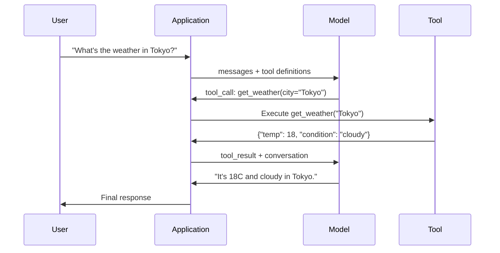

# Function Calling 与 Tool Use

> 译注：本文译自同目录 [`en.md`](./en.md)。术语遵循仓根 [TRANSLATION_GUIDE.md](../../../../TRANSLATION_GUIDE.md)。

> LLM 什么也做不了。它只会生成文本。这就是它全部的能力。它不能查天气、查数据库、发邮件、跑代码、读文件。你见过的每一个「AI agent」，本质上都是一个 LLM 生成一段说「该调用哪个函数」的 JSON——然后由你的代码真正去调用。模型是大脑，工具是手，function calling 是连接两者的神经系统。

**Type:** Build
**Languages:** Python
**Prerequisites:** Phase 11 Lesson 03（结构化输出 Structured Outputs）
**Time:** ~75 分钟
**Related:** Phase 11 · 14（Model Context Protocol）——当一个工具要在多个 host 之间共享时，应当从内联 function-calling 升级到 MCP server。本节讲内联场景，MCP 那节讲协议场景。

## 学习目标（Learning Objectives）

- 实现一条 function calling 循环：定义 tool schema、解析模型的 tool-call JSON、执行函数、把结果回传
- 设计带有清晰描述和类型化参数的 tool schema，让模型可以稳定地调用
- 构建一个多轮 agent loop，把多次 function call 串起来回答复杂问题
- 处理 function calling 的边角情况：并行 tool call、错误传播、防止 tool loop 无限循环

## 问题（The Problem）

你做了一个聊天机器人。用户问：「东京现在天气怎么样？」

模型回答：「我没有实时天气数据的访问权限，但根据季节，东京大约是 15 摄氏度……」

这是披着免责声明外衣的 hallucination（幻觉）。模型不知道天气，也永远不会知道。天气每小时都在变。模型的训练数据是几个月前的。

正确的答案需要调用 OpenWeatherMap API，拿到当前温度，返回真实数字。模型不能调 API，但你的代码可以。缺的那块：一个结构化的协议，让模型说「我需要带这些参数调用 weather API」，再让你的代码执行它，然后把结果喂回去。

这就是 function calling。模型输出一段结构化 JSON，描述要调用哪个函数、用什么参数。你的应用执行函数。结果回到对话里。模型再用这个结果生成最终答案。

没有 function calling，LLM 是百科全书。有了它，LLM 才能成为 agent。

## 概念（The Concept）

### Function Calling 循环（The Function Calling Loop）

每一次 tool-use 交互都遵循同一套五步循环。



第 1 步：用户发消息。第 2 步：模型收到消息以及一份 tool 定义（描述可用函数的 JSON Schema）。第 3 步：模型不再返回文本，而是输出一个 tool call——一个带函数名和参数的结构化 JSON 对象。第 4 步：你的代码执行该函数并捕获结果。第 5 步：结果回到模型，模型现在拿到了真实数据，可以生成最终答案。

模型从不执行任何东西。它只决定「调谁、用什么参数」。你的代码才是执行者。

### Tool 定义：JSON Schema 契约（Tool Definitions: The JSON Schema Contract）

每个工具由一份 JSON Schema 定义，告诉模型这个函数干什么、接什么参数、参数是什么类型。

```json
{
  "type": "function",
  "function": {
    "name": "get_weather",
    "description": "Get current weather for a city. Returns temperature in Celsius and conditions.",
    "parameters": {
      "type": "object",
      "properties": {
        "city": {
          "type": "string",
          "description": "City name, e.g. 'Tokyo' or 'San Francisco'"
        },
        "units": {
          "type": "string",
          "enum": ["celsius", "fahrenheit"],
          "description": "Temperature units"
        }
      },
      "required": ["city"]
    }
  }
}
```

`description` 字段非常关键。模型读它来决定何时、如何使用该工具。一个含糊其辞的「gets weather」要比「Get current weather for a city. Returns temperature in Celsius and conditions.」差得多。description 本身就是一段用于 tool selection 的 prompt。

### 提供方对比（Provider Comparison）

每家主流 provider 都支持 function calling，但 API 形态各有不同。

| Provider | API 参数 | Tool Call 格式 | 并行调用 | 强制调用 |
|----------|--------------|-----------------|---------------|----------------|
| OpenAI（GPT-5、o4） | `tools` | `tool_calls[].function` | 支持（一次多调） | `tool_choice="required"` |
| Anthropic（Claude 4.6/4.7） | `tools` | `content[].type="tool_use"` | 支持（多个 block） | `tool_choice={"type":"any"}` |
| Google（Gemini 3） | `function_declarations` | `functionCall` | 支持 | `function_calling_config` |
| Open-weight（Llama 4、Qwen3、DeepSeek-V3） | Llama 4 原生 `tools`；其余多用 Hermes 或 ChatML | 混合 | 看模型 | 基于 prompt，或在支持时用 `tool_choice` |

到 2026 年，三家闭源 provider 已经收敛到几乎一致的、基于 JSON-Schema 的格式。Llama 4 自带原生 `tools` 字段，形状与 OpenAI 一致。开放权重的 fine-tune 仍五花八门——Hermes 格式（NousResearch）是第三方 fine-tune 中最常见的。如果工具要在多个 host 之间共用，优先选 MCP（Phase 11 · 14）而非内联 function-calling——同一个 server 服务所有人。

### Tool Choice：Auto、Required、Specific（Tool Choice: Auto, Required, Specific）

你来控制模型何时使用工具。

**Auto**（默认）：模型自己决定要不要调工具，还是直接回答。「2+2 等于几？」——直接回答。「天气怎么样？」——调工具。

**Required**：模型必须至少调用一个工具。当你确定用户的意图必须借助工具时使用。能避免模型靠猜代替查真数据。

**Specific function**：强制模型调用某个特定函数。`tool_choice={"type":"function", "function": {"name": "get_weather"}}` 保证 weather 工具一定被调用，不管 query 写了什么。这适合做路由——上游逻辑已经决定了该用哪个工具。

### 并行 Function Calling（Parallel Function Calling）

GPT-4o 和 Claude 可以在一轮里同时调多个函数。用户问：「东京和纽约的天气怎么样？」模型会同时输出两个 tool call：

```json
[
  {"name": "get_weather", "arguments": {"city": "Tokyo"}},
  {"name": "get_weather", "arguments": {"city": "New York"}}
]
```

你的代码并行执行两者（最好真正并发），把两份结果都返回，模型再合成单一回应。这把往返从 2 次降到 1 次。对于一次 query 要 5–10 次 tool call 的 agent，并行调用可以把延迟降低 60–80%。

### 结构化输出 vs Function Calling（Structured Outputs vs Function Calling）

Lesson 03 讲了 structured outputs。Function calling 用的是同一套 JSON Schema 机制，但目的不同。

**Structured outputs**：强制模型按特定形状输出数据。输出本身就是最终产物。例：把一段文本里抽出商品信息为 `{name, price, in_stock}`。

**Function calling**：模型声明一个「要执行某动作」的意图。输出只是中间步骤。例：`get_weather(city="Tokyo")`——模型在请求一次动作，而不是给出最终答案。

要做数据抽取，用 structured outputs。要让模型与外部系统交互，用 function calling。

### 安全：不可妥协的几条铁律（Security: The Non-Negotiable Rules）

Function calling 是你能给一个 LLM 的最危险能力。模型在选择执行什么。如果你的工具集里有数据库查询，模型来构造查询；如果有 shell 命令，模型来写命令。

**铁律 1：永远不要把模型生成的 SQL 直接喂给数据库。** 模型完全可能、且会生成 DROP TABLE、UNION 注入、或者「把每一行都返回」这种查询。永远要参数化、要校验、要用 allowlist（白名单）限定可执行操作。

**铁律 2：函数走 allowlist。** 模型只能调你显式定义的函数。永远不要造一个「按名字执行任意函数」的通用工具。如果你内部有 50 个函数，只暴露用户真正需要的 5 个。

**铁律 3：校验参数。** 模型可能传一个城市名 `"; DROP TABLE users; --"`。在执行之前，对每个参数按预期的类型、范围、格式做校验。

**铁律 4：清洗 tool 结果。** 如果工具返回了敏感数据（API key、PII、内部错误），在送回给模型前先过滤。模型会把 tool 结果原样塞进它的回复里。

**铁律 5：限速 tool call。** 一个进入 loop 的模型可以调上百次工具。设个上限（每段对话 10–20 次比较合理），打破死循环。

### 错误处理（Error Handling）

工具会失败。API 会超时。数据库会挂。文件可能不存在。模型需要知道工具什么时候失败、为什么失败。

把错误作为结构化 tool 结果返回，不要直接抛异常：

```json
{
  "error": true,
  "message": "City 'Toky' not found. Did you mean 'Tokyo'?",
  "code": "CITY_NOT_FOUND"
}
```

模型读到这个，会调整参数并重试。模型很擅长从结构化错误信息里自我纠错；但它不擅长从空响应或者笼统的「something went wrong」里恢复。

### MCP：Model Context Protocol（MCP: Model Context Protocol）

MCP 是 Anthropic 主导的工具互操作开放标准。与其每个应用各自定义一套工具，MCP 提供一个通用协议：工具由 MCP server 提供，由 MCP client（比如 Claude Code、Cursor 或你自己的应用）消费。

一个 MCP server 可以把工具暴露给任何兼容的 client。一个 Postgres MCP server 让任何 MCP 兼容 agent 拥有数据库访问能力。一个 GitHub MCP server 让任何 agent 拥有仓库访问能力。工具定义一次，到处可用。

MCP 之于 function calling，就如 HTTP 之于网络。它把传输层标准化，使工具变成可移植的。

## 动手实现（Build It）

### Step 1：定义 Tool Registry（Define the Tool Registry）

构建一个 registry，存放 tool 定义和它们的实现。每个工具有一个 JSON Schema 定义（模型看到的那一面）和一个 Python 函数（你代码执行的那一面）。

```python
import json
import math
import time
import hashlib


TOOL_REGISTRY = {}


def register_tool(name, description, parameters, function):
    TOOL_REGISTRY[name] = {
        "definition": {
            "type": "function",
            "function": {
                "name": name,
                "description": description,
                "parameters": parameters,
            },
        },
        "function": function,
    }
```

### Step 2：实现 5 个工具（Implement 5 Tools）

构建一个计算器、天气查询、网页搜索模拟器、文件读取器、代码执行器。

```python
def calculator(expression, precision=2):
    allowed = set("0123456789+-*/.() ")
    if not all(c in allowed for c in expression):
        return {"error": True, "message": f"Invalid characters in expression: {expression}"}
    try:
        result = eval(expression, {"__builtins__": {}}, {"math": math})
        return {"result": round(float(result), precision), "expression": expression}
    except Exception as e:
        return {"error": True, "message": str(e)}


WEATHER_DB = {
    "tokyo": {"temp_c": 18, "condition": "cloudy", "humidity": 72, "wind_kph": 14},
    "new york": {"temp_c": 22, "condition": "sunny", "humidity": 45, "wind_kph": 8},
    "london": {"temp_c": 12, "condition": "rainy", "humidity": 88, "wind_kph": 22},
    "san francisco": {"temp_c": 16, "condition": "foggy", "humidity": 80, "wind_kph": 18},
    "sydney": {"temp_c": 25, "condition": "sunny", "humidity": 55, "wind_kph": 10},
}


def get_weather(city, units="celsius"):
    key = city.lower().strip()
    if key not in WEATHER_DB:
        suggestions = [c for c in WEATHER_DB if c.startswith(key[:3])]
        return {
            "error": True,
            "message": f"City '{city}' not found.",
            "suggestions": suggestions,
            "code": "CITY_NOT_FOUND",
        }
    data = WEATHER_DB[key].copy()
    if units == "fahrenheit":
        data["temp_f"] = round(data["temp_c"] * 9 / 5 + 32, 1)
        del data["temp_c"]
    data["city"] = city
    return data


SEARCH_DB = {
    "python function calling": [
        {"title": "OpenAI Function Calling Guide", "url": "https://platform.openai.com/docs/guides/function-calling", "snippet": "Learn how to connect LLMs to external tools."},
        {"title": "Anthropic Tool Use", "url": "https://docs.anthropic.com/en/docs/tool-use", "snippet": "Claude can interact with external tools and APIs."},
    ],
    "MCP protocol": [
        {"title": "Model Context Protocol", "url": "https://modelcontextprotocol.io", "snippet": "An open standard for connecting AI models to data sources."},
    ],
    "weather API": [
        {"title": "OpenWeatherMap API", "url": "https://openweathermap.org/api", "snippet": "Free weather API with current, forecast, and historical data."},
    ],
}


def web_search(query, max_results=3):
    key = query.lower().strip()
    for db_key, results in SEARCH_DB.items():
        if db_key in key or key in db_key:
            return {"query": query, "results": results[:max_results], "total": len(results)}
    return {"query": query, "results": [], "total": 0}


FILE_SYSTEM = {
    "data/config.json": '{"model": "gpt-4o", "temperature": 0.7, "max_tokens": 4096}',
    "data/users.csv": "name,email,role\nAlice,alice@example.com,admin\nBob,bob@example.com,user",
    "README.md": "# My Project\nA tool-use agent built from scratch.",
}


def read_file(path):
    if ".." in path or path.startswith("/"):
        return {"error": True, "message": "Path traversal not allowed.", "code": "FORBIDDEN"}
    if path not in FILE_SYSTEM:
        available = list(FILE_SYSTEM.keys())
        return {"error": True, "message": f"File '{path}' not found.", "available_files": available, "code": "NOT_FOUND"}
    content = FILE_SYSTEM[path]
    return {"path": path, "content": content, "size_bytes": len(content), "lines": content.count("\n") + 1}


def run_code(code, language="python"):
    if language != "python":
        return {"error": True, "message": f"Language '{language}' not supported. Only 'python' is available."}
    forbidden = ["import os", "import sys", "import subprocess", "exec(", "eval(", "__import__", "open("]
    for pattern in forbidden:
        if pattern in code:
            return {"error": True, "message": f"Forbidden operation: {pattern}", "code": "SECURITY_VIOLATION"}
    try:
        local_vars = {}
        exec(code, {"__builtins__": {"print": print, "range": range, "len": len, "str": str, "int": int, "float": float, "list": list, "dict": dict, "sum": sum, "min": min, "max": max, "abs": abs, "round": round, "sorted": sorted, "enumerate": enumerate, "zip": zip, "map": map, "filter": filter, "math": math}}, local_vars)
        result = local_vars.get("result", None)
        return {"success": True, "result": result, "variables": {k: str(v) for k, v in local_vars.items() if not k.startswith("_")}}
    except Exception as e:
        return {"error": True, "message": f"{type(e).__name__}: {e}"}
```

### Step 3：注册全部工具（Register All Tools）

```python
def register_all_tools():
    register_tool(
        "calculator", "Evaluate a mathematical expression. Supports +, -, *, /, parentheses, and decimals. Returns the numeric result.",
        {"type": "object", "properties": {"expression": {"type": "string", "description": "Math expression, e.g. '(10 + 5) * 3'"}, "precision": {"type": "integer", "description": "Decimal places in result", "default": 2}}, "required": ["expression"]},
        calculator,
    )
    register_tool(
        "get_weather", "Get current weather for a city. Returns temperature, condition, humidity, and wind speed.",
        {"type": "object", "properties": {"city": {"type": "string", "description": "City name, e.g. 'Tokyo' or 'San Francisco'"}, "units": {"type": "string", "enum": ["celsius", "fahrenheit"], "description": "Temperature units, defaults to celsius"}}, "required": ["city"]},
        get_weather,
    )
    register_tool(
        "web_search", "Search the web for information. Returns a list of results with title, URL, and snippet.",
        {"type": "object", "properties": {"query": {"type": "string", "description": "Search query"}, "max_results": {"type": "integer", "description": "Maximum results to return", "default": 3}}, "required": ["query"]},
        web_search,
    )
    register_tool(
        "read_file", "Read the contents of a file. Returns the file content, size, and line count.",
        {"type": "object", "properties": {"path": {"type": "string", "description": "Relative file path, e.g. 'data/config.json'"}}, "required": ["path"]},
        read_file,
    )
    register_tool(
        "run_code", "Execute Python code in a sandboxed environment. Set a 'result' variable to return output.",
        {"type": "object", "properties": {"code": {"type": "string", "description": "Python code to execute"}, "language": {"type": "string", "enum": ["python"], "description": "Programming language"}}, "required": ["code"]},
        run_code,
    )
```

### Step 4：构建 Function Calling 循环（Build the Function Calling Loop）

这是核心引擎。它模拟模型决定调用哪个工具、执行工具、把结果喂回去的过程。

```python
def simulate_model_decision(user_message, tools, conversation_history):
    msg = user_message.lower()

    if any(word in msg for word in ["weather", "temperature", "forecast"]):
        cities = []
        for city in WEATHER_DB:
            if city in msg:
                cities.append(city)
        if not cities:
            for word in msg.split():
                if word.capitalize() in [c.title() for c in WEATHER_DB]:
                    cities.append(word)
        if not cities:
            cities = ["tokyo"]
        calls = []
        for city in cities:
            calls.append({"name": "get_weather", "arguments": {"city": city.title()}})
        return calls

    if any(word in msg for word in ["calculate", "compute", "math", "what is", "how much"]):
        for token in msg.split():
            if any(c in token for c in "+-*/"):
                return [{"name": "calculator", "arguments": {"expression": token}}]
        if "+" in msg or "-" in msg or "*" in msg or "/" in msg:
            expr = "".join(c for c in msg if c in "0123456789+-*/.() ")
            if expr.strip():
                return [{"name": "calculator", "arguments": {"expression": expr.strip()}}]
        return [{"name": "calculator", "arguments": {"expression": "0"}}]

    if any(word in msg for word in ["search", "find", "look up", "google"]):
        query = msg.replace("search for", "").replace("look up", "").replace("find", "").strip()
        return [{"name": "web_search", "arguments": {"query": query}}]

    if any(word in msg for word in ["read", "file", "open", "cat", "show"]):
        for path in FILE_SYSTEM:
            if path.split("/")[-1].split(".")[0] in msg:
                return [{"name": "read_file", "arguments": {"path": path}}]
        return [{"name": "read_file", "arguments": {"path": "README.md"}}]

    if any(word in msg for word in ["run", "execute", "code", "python"]):
        return [{"name": "run_code", "arguments": {"code": "result = 'Hello from the sandbox!'", "language": "python"}}]

    return []


def execute_tool_call(tool_call):
    name = tool_call["name"]
    args = tool_call["arguments"]

    if name not in TOOL_REGISTRY:
        return {"error": True, "message": f"Unknown tool: {name}", "code": "UNKNOWN_TOOL"}

    tool = TOOL_REGISTRY[name]
    func = tool["function"]
    start = time.time()

    try:
        result = func(**args)
    except TypeError as e:
        result = {"error": True, "message": f"Invalid arguments: {e}"}

    elapsed_ms = round((time.time() - start) * 1000, 2)
    return {"tool": name, "result": result, "execution_time_ms": elapsed_ms}


def run_function_calling_loop(user_message, max_iterations=5):
    conversation = [{"role": "user", "content": user_message}]
    tool_definitions = [t["definition"] for t in TOOL_REGISTRY.values()]
    all_tool_results = []

    for iteration in range(max_iterations):
        tool_calls = simulate_model_decision(user_message, tool_definitions, conversation)

        if not tool_calls:
            break

        results = []
        for call in tool_calls:
            result = execute_tool_call(call)
            results.append(result)

        conversation.append({"role": "assistant", "content": None, "tool_calls": tool_calls})

        for result in results:
            conversation.append({"role": "tool", "content": json.dumps(result["result"]), "tool_name": result["tool"]})

        all_tool_results.extend(results)
        break

    return {"conversation": conversation, "tool_results": all_tool_results, "iterations": iteration + 1 if tool_calls else 0}
```

### Step 5：参数校验（Argument Validation）

构建一个校验器，在执行前用 JSON Schema 检查 tool call 的参数。

```python
def validate_tool_arguments(tool_name, arguments):
    if tool_name not in TOOL_REGISTRY:
        return [f"Unknown tool: {tool_name}"]

    schema = TOOL_REGISTRY[tool_name]["definition"]["function"]["parameters"]
    errors = []

    if not isinstance(arguments, dict):
        return [f"Arguments must be an object, got {type(arguments).__name__}"]

    for required_field in schema.get("required", []):
        if required_field not in arguments:
            errors.append(f"Missing required argument: {required_field}")

    properties = schema.get("properties", {})
    for arg_name, arg_value in arguments.items():
        if arg_name not in properties:
            errors.append(f"Unknown argument: {arg_name}")
            continue

        prop_schema = properties[arg_name]
        expected_type = prop_schema.get("type")

        type_checks = {"string": str, "integer": int, "number": (int, float), "boolean": bool, "array": list, "object": dict}
        if expected_type in type_checks:
            if not isinstance(arg_value, type_checks[expected_type]):
                errors.append(f"Argument '{arg_name}': expected {expected_type}, got {type(arg_value).__name__}")

        if "enum" in prop_schema and arg_value not in prop_schema["enum"]:
            errors.append(f"Argument '{arg_name}': '{arg_value}' not in {prop_schema['enum']}")

    return errors
```

### Step 6：跑 Demo（Run the Demo）

```python
def run_demo():
    register_all_tools()

    print("=" * 60)
    print("  Function Calling & Tool Use Demo")
    print("=" * 60)

    print("\n--- Registered Tools ---")
    for name, tool in TOOL_REGISTRY.items():
        desc = tool["definition"]["function"]["description"][:60]
        params = list(tool["definition"]["function"]["parameters"].get("properties", {}).keys())
        print(f"  {name}: {desc}...")
        print(f"    params: {params}")

    print(f"\n--- Argument Validation ---")
    validation_tests = [
        ("get_weather", {"city": "Tokyo"}, "Valid call"),
        ("get_weather", {}, "Missing required arg"),
        ("get_weather", {"city": "Tokyo", "units": "kelvin"}, "Invalid enum value"),
        ("calculator", {"expression": 123}, "Wrong type (int for string)"),
        ("unknown_tool", {"x": 1}, "Unknown tool"),
    ]
    for tool_name, args, label in validation_tests:
        errors = validate_tool_arguments(tool_name, args)
        status = "VALID" if not errors else f"ERRORS: {errors}"
        print(f"  {label}: {status}")

    print(f"\n--- Tool Execution ---")
    direct_tests = [
        {"name": "calculator", "arguments": {"expression": "(10 + 5) * 3 / 2"}},
        {"name": "get_weather", "arguments": {"city": "Tokyo"}},
        {"name": "get_weather", "arguments": {"city": "Mars"}},
        {"name": "web_search", "arguments": {"query": "python function calling"}},
        {"name": "read_file", "arguments": {"path": "data/config.json"}},
        {"name": "read_file", "arguments": {"path": "../etc/passwd"}},
        {"name": "run_code", "arguments": {"code": "result = sum(range(1, 101))"}},
        {"name": "run_code", "arguments": {"code": "import os; os.system('rm -rf /')"}},
    ]
    for call in direct_tests:
        result = execute_tool_call(call)
        print(f"\n  {call['name']}({json.dumps(call['arguments'])})")
        print(f"    -> {json.dumps(result['result'], indent=None)[:100]}")
        print(f"    time: {result['execution_time_ms']}ms")

    print(f"\n--- Full Function Calling Loop ---")
    test_queries = [
        "What's the weather in Tokyo?",
        "Calculate (100 + 250) * 0.15",
        "Search for MCP protocol",
        "Read the config file",
        "Run some Python code",
        "Tell me a joke",
    ]
    for query in test_queries:
        print(f"\n  User: {query}")
        result = run_function_calling_loop(query)
        if result["tool_results"]:
            for tr in result["tool_results"]:
                print(f"    Tool: {tr['tool']} ({tr['execution_time_ms']}ms)")
                print(f"    Result: {json.dumps(tr['result'], indent=None)[:90]}")
        else:
            print(f"    [No tool called -- direct response]")
        print(f"    Iterations: {result['iterations']}")

    print(f"\n--- Parallel Tool Calls ---")
    multi_city_query = "What's the weather in tokyo and london?"
    print(f"  User: {multi_city_query}")
    result = run_function_calling_loop(multi_city_query)
    print(f"  Tool calls made: {len(result['tool_results'])}")
    for tr in result["tool_results"]:
        city = tr["result"].get("city", "unknown")
        temp = tr["result"].get("temp_c", "N/A")
        print(f"    {city}: {temp}C, {tr['result'].get('condition', 'N/A')}")

    print(f"\n--- Security Checks ---")
    security_tests = [
        ("read_file", {"path": "../../etc/passwd"}),
        ("run_code", {"code": "import subprocess; subprocess.run(['ls'])"}),
        ("calculator", {"expression": "__import__('os').system('ls')"}),
    ]
    for tool_name, args in security_tests:
        result = execute_tool_call({"name": tool_name, "arguments": args})
        blocked = result["result"].get("error", False)
        print(f"  {tool_name}({list(args.values())[0][:40]}): {'BLOCKED' if blocked else 'ALLOWED'}")
```

## 用起来（Use It）

### OpenAI Function Calling

```python
# from openai import OpenAI
#
# client = OpenAI()
#
# tools = [{
#     "type": "function",
#     "function": {
#         "name": "get_weather",
#         "description": "Get current weather for a city",
#         "parameters": {
#             "type": "object",
#             "properties": {
#                 "city": {"type": "string"},
#                 "units": {"type": "string", "enum": ["celsius", "fahrenheit"]}
#             },
#             "required": ["city"]
#         }
#     }
# }]
#
# response = client.chat.completions.create(
#     model="gpt-4o",
#     messages=[{"role": "user", "content": "Weather in Tokyo?"}],
#     tools=tools,
#     tool_choice="auto",
# )
#
# tool_call = response.choices[0].message.tool_calls[0]
# args = json.loads(tool_call.function.arguments)
# result = get_weather(**args)
#
# final = client.chat.completions.create(
#     model="gpt-4o",
#     messages=[
#         {"role": "user", "content": "Weather in Tokyo?"},
#         response.choices[0].message,
#         {"role": "tool", "tool_call_id": tool_call.id, "content": json.dumps(result)},
#     ],
# )
# print(final.choices[0].message.content)
```

OpenAI 把 tool call 放在 `response.choices[0].message.tool_calls` 里。每次调用都有一个 `id`，你回传结果时必须带上。模型用这个 ID 把结果匹配回对应调用。GPT-4o 可以在一次响应里返回多个 tool call——遍历并全部执行。

### Anthropic Tool Use

```python
# import anthropic
#
# client = anthropic.Anthropic()
#
# response = client.messages.create(
#     model="claude-sonnet-4-20250514",
#     max_tokens=1024,
#     tools=[{
#         "name": "get_weather",
#         "description": "Get current weather for a city",
#         "input_schema": {
#             "type": "object",
#             "properties": {
#                 "city": {"type": "string"},
#                 "units": {"type": "string", "enum": ["celsius", "fahrenheit"]}
#             },
#             "required": ["city"]
#         }
#     }],
#     messages=[{"role": "user", "content": "Weather in Tokyo?"}],
# )
#
# tool_block = next(b for b in response.content if b.type == "tool_use")
# result = get_weather(**tool_block.input)
#
# final = client.messages.create(
#     model="claude-sonnet-4-20250514",
#     max_tokens=1024,
#     tools=[...],
#     messages=[
#         {"role": "user", "content": "Weather in Tokyo?"},
#         {"role": "assistant", "content": response.content},
#         {"role": "user", "content": [{"type": "tool_result", "tool_use_id": tool_block.id, "content": json.dumps(result)}]},
#     ],
# )
```

Anthropic 把 tool call 作为 content block 返回，类型为 `type: "tool_use"`。tool 结果要装在一条 user 消息里，类型为 `type: "tool_result"`。注意一个关键差异：Anthropic 用 `input_schema` 来声明 tool 参数，OpenAI 用 `parameters`。

### MCP 集成（MCP Integration）

```python
# MCP servers expose tools over a standardized protocol.
# Any MCP-compatible client can discover and call these tools.
#
# Example: connecting to a Postgres MCP server
#
# from mcp import ClientSession, StdioServerParameters
# from mcp.client.stdio import stdio_client
#
# server_params = StdioServerParameters(
#     command="npx",
#     args=["-y", "@modelcontextprotocol/server-postgres", "postgresql://localhost/mydb"],
# )
#
# async with stdio_client(server_params) as (read, write):
#     async with ClientSession(read, write) as session:
#         await session.initialize()
#         tools = await session.list_tools()
#         result = await session.call_tool("query", {"sql": "SELECT count(*) FROM users"})
```

MCP 把 tool 实现和 tool 消费解耦。Postgres server 负责懂 SQL，GitHub server 负责懂 API。你的 agent 只管发现并调用工具——不需要为每种集成写 provider 专属代码。

## 上线部署（Ship It）

本节产出 `outputs/prompt-tool-designer.md`——一个用于设计 tool 定义的可复用 prompt 模板。给它一段「这个工具要干什么」的描述，它会产出完整的 JSON Schema 定义，包含 description、类型和约束。

同时还产出 `outputs/skill-function-calling-patterns.md`——一份在生产环境实现 function calling 的决策框架，覆盖 tool 设计、错误处理、安全、各 provider 专属模式。

## 练习（Exercises）

1. **新增第 6 个工具：数据库查询。** 用一个内存表实现一个模拟 SQL 工具。这个工具接收表名和过滤条件（不是裸 SQL）。校验表名在 allowlist 内，过滤运算符限定为 `=`、`>`、`<`、`>=`、`<=`。把匹配到的行作为 JSON 返回。

2. **实现带错误反馈的重试。** 当一次 tool call 失败（例如「city not found」），把错误信息回传给模型决策函数，让它修正参数。统计每次调用经过多少次重试。每个 tool call 最多重试 3 次。

3. **构建一个多步 agent。** 有些 query 需要把多次 tool call 串起来：「读 config 文件，告诉我配的是哪个模型，然后上网搜这个模型的价格。」实现一个循环，跑到模型决定不再需要工具为止，每一步把累积结果传给下一次决策。最多 10 轮，防止死循环。

4. **测量 tool 选择准确率。** 准备 30 个测试 query 并标好期望调用的工具名。在全部 30 个 query 上跑你的决策函数，统计选对工具的比例。识别哪些 query 最容易让多个工具混淆。

5. **实现 tool call 缓存。** 如果同一个工具在 60 秒内被相同参数调用，直接返回缓存结果，不再执行。用一个以 `(tool_name, frozenset(args.items()))` 为 key 的 dict。在一段包含 20 个 query 的对话里测量缓存命中率。

## 关键术语（Key Terms）

| 术语 | 大家怎么说 | 实际是什么 |
|------|----------------|----------------------|
| Function calling | 「Tool use」 | 模型输出一段结构化 JSON，描述要带哪些参数调用哪个函数——执行的是你的代码，不是模型 |
| Tool definition | 「Function schema」 | 一个 JSON Schema 对象，描述 tool 的名字、用途、参数和类型——模型读它来决定何时、如何使用工具 |
| Tool choice | 「Calling mode」 | 控制模型是必须调工具（required）、可以调工具（auto），还是必须调某个特定工具（named） |
| Parallel calling | 「Multi-tool」 | 模型在一轮里输出多个 tool call，减少往返——GPT-4o 和 Claude 都支持 |
| Tool result | 「Function output」 | 工具执行后的返回值，作为消息回传给模型，让它能在回复里用上真实数据 |
| Argument validation | 「Input checking」 | 在执行工具前，校验模型生成的参数是否符合预期类型、范围和约束 |
| MCP | 「Tool 协议」 | Model Context Protocol——Anthropic 主导的开放标准，通过 server 暴露工具，任何兼容 client 都能发现并调用 |
| Agent loop | 「ReAct loop」 | 「模型决定调工具 → 代码执行工具 → 结果回传」的迭代循环，直到模型有足够信息可以回答 |
| Tool poisoning | 「通过 tool 实施的 prompt injection」 | 一种攻击：tool 结果里夹带操控模型行为的指令——所有 tool 输出都要清洗 |
| Rate limiting | 「Call budget」 | 给单段对话设一个 tool call 上限，防止死循环和 API 费用失控 |

## 延伸阅读（Further Reading）

- [OpenAI Function Calling Guide](https://platform.openai.com/docs/guides/function-calling)——使用 GPT-4o 进行 tool use 的权威参考，覆盖并行调用、强制调用、结构化参数
- [Anthropic Tool Use Guide](https://docs.anthropic.com/en/docs/tool-use)——Claude 的 tool use 实现，包括 input_schema、多工具响应、tool_choice 配置
- [Model Context Protocol Specification](https://modelcontextprotocol.io)——跨 AI 应用的工具互操作开放标准，包含 server / client 架构
- [Schick 等，2023——“Toolformer: Language Models Can Teach Themselves to Use Tools”](https://arxiv.org/abs/2302.04761)——训练 LLM 自行决定何时、如何调用外部工具的奠基论文
- [Patil 等，2023——“Gorilla: Large Language Model Connected with Massive APIs”](https://arxiv.org/abs/2305.15334)——在 1645 个 API 上 fine-tune LLM 以提升 API 调用准确率，并降低 hallucination
- [Berkeley Function Calling Leaderboard](https://gorilla.cs.berkeley.edu/leaderboard.html)——对比 GPT-4o、Claude、Gemini 和开源模型的 function calling 准确率的实时基准
- [Yao 等，「ReAct: Synergizing Reasoning and Acting in Language Models」（ICLR 2023）](https://arxiv.org/abs/2210.03629)——围绕每次 tool call 的「Thought-Action-Observation」外层 agent loop；本节止步之处，Phase 14 接力
- [Anthropic — Building effective agents（2024 年 12 月）](https://www.anthropic.com/research/building-effective-agents)——围绕「tool use」这一基础原语组合出的五种模式（prompt chaining、routing、parallelization、orchestrator-workers、evaluator-optimizer）
