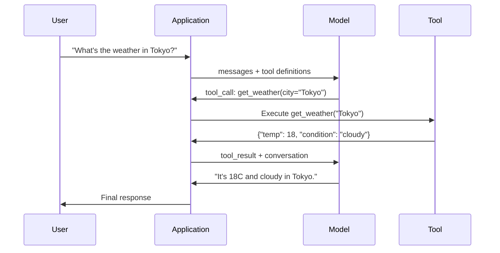

# 函数调用与工具使用

> LLM 什么都做不了。它们生成文本。这就是全部能力。它们不能查天气、查询数据库、发送邮件、运行代码或读取文件。你见过的每一个"AI 智能体"都是一个 LLM 在生成 JSON，说明要调用哪个函数——然后是你的代码实际去调用它。模型是大脑。工具是双手。函数调用是连接它们的神经系统。

**类型：** 构建
**语言：** Python
**前置知识：** Phase 11 Lesson 03 (Structured Outputs)
**时间：** ~75 分钟
**相关：** Phase 11 · 14 (Model Context Protocol) —— 当工具跨主机共享时，从内联函数调用升级到 MCP 服务器。本课涵盖内联情况；MCP 涵盖协议情况。

## 学习目标

- 实现函数调用循环：定义工具 schema、解析模型的 tool-call JSON、执行函数、返回结果
- 设计带有清晰描述和类型化参数的工具 schema，使模型能够可靠地调用
- 构建多轮智能体循环，链式调用多个函数以回答复杂查询
- 处理函数调用边缘情况：并行工具调用、错误传播、防止无限工具循环

## 问题所在

你构建了一个聊天机器人。用户问："东京现在天气怎么样？"

模型回答："我没有实时天气数据的访问权限，但根据季节，东京大约在 15 摄氏度左右……"

这是一个披着免责声明的幻觉。模型不知道天气。它永远也不会知道。天气每小时都在变化。模型的训练数据是几个月前的。

正确答案需要调用 OpenWeatherMap API，获取当前温度，返回真实数字。模型不能调用 API。你的代码可以。缺失的部分是一个结构化协议，让模型说"我需要用这些参数调用天气 API"，然后让你的代码执行它并将结果反馈回来。

这就是函数调用。模型输出结构化 JSON，描述要调用哪个函数以及用什么参数。你的应用程序执行函数。结果回到对话中。模型使用结果生成最终答案。

没有函数调用，LLM 只是百科全书。有了它，它们变成了智能体。

## 核心概念

### 函数调用循环

每个工具使用交互都遵循相同的 5 步循环。



第 1 步：用户发送消息。第 2 步：模型接收消息以及工具定义（描述可用函数的 JSON Schema）。第 3 步：模型不是用文本回应，而是输出一个工具调用——一个带有函数名和参数的结构化 JSON 对象。第 4 步：你的代码执行函数并捕获结果。第 5 步：结果返回给模型，模型现在有真实数据来生成最终答案。

模型从不执行任何东西。它只决定调用什么以及用什么参数。你的代码是执行器。

### 工具定义：JSON Schema 契约

每个工具由 JSON Schema 定义，告诉模型函数做什么、接受什么参数以及这些参数必须是什么类型。

```json
{
  "type": "function",
  "function": {
    "name": "get_weather",
    "description": "Get current weather for a city. Returns temperature in Celsius and conditions.",
    "parameters": {
      "type": "object",
      "properties": {
        "city": {
          "type": "string",
          "description": "City name, e.g. 'Tokyo' or 'San Francisco'"
        },
        "units": {
          "type": "string",
          "enum": ["celsius", "fahrenheit"],
          "description": "Temperature units"
        }
      },
      "required": ["city"]
    }
  }
}
```

`description` 字段至关重要。模型通过它们来决定何时以及如何使用工具。像 "gets weather" 这样模糊的描述比 "Get current weather for a city. Returns temperature in Celsius and conditions." 产生更差的工具选择。描述就是工具选择的 prompt。

### 提供商对比

每个主要提供商都支持函数调用，但 API 表面有所不同。

| 提供商 | API 参数 | 工具调用格式 | 并行调用 | 强制调用 |
|----------|--------------|-----------------|---------------|----------------|
| OpenAI (GPT-5, o4) | `tools` | `tool_calls[].function` | 是（每轮多个） | `tool_choice="required"` |
| Anthropic (Claude 4.6/4.7) | `tools` | `content[].type="tool_use"` | 是（多个块） | `tool_choice={"type":"any"}` |
| Google (Gemini 3) | `function_declarations` | `functionCall` | 是 | `function_calling_config` |
| Open-weight (Llama 4, Qwen3, DeepSeek-V3) | Llama 4 原生 `tools`；其他用 Hermes 或 ChatML | 混合 | 取决于模型 | 基于 prompt 或 `tool_choice`（如果支持） |

到 2026 年，三个闭源提供商已经收敛到几乎相同的基于 JSON Schema 的格式。Llama 4 自带原生 `tools` 字段，与 OpenAI 的形状匹配。开源权重微调仍然各不相同——Hermes 格式（NousResearch）是第三方微调中最常见的。对于跨主机共享工具，优先选择 MCP（Phase 11 · 14）而非内联函数调用——服务器对所有主机都相同。

### 工具选择：Auto、Required、Specific

你控制模型何时使用工具。

**Auto**（默认）：模型决定是调用工具还是直接回应。"2+2 等于多少？"——直接回应。"天气怎么样？"——调用工具。

**Required**：模型必须调用至少一个工具。当你知道用户意图需要工具时使用。防止模型猜测而不是查找真实数据。

**特定函数**：强制模型调用特定函数。`tool_choice={"type":"function", "function": {"name": "get_weather"}}` 保证无论查询是什么都会调用天气工具。用于路由——当上游逻辑已经确定需要哪个工具时。

### 并行函数调用

GPT-4o 和 Claude 可以在单轮中调用多个函数。用户问："东京和纽约的天气怎么样？" 模型同时输出两个工具调用：

```json
[
  {"name": "get_weather", "arguments": {"city": "Tokyo"}},
  {"name": "get_weather", "arguments": {"city": "New York"}}
]
```

你的代码执行两者（理想情况下并发），返回两个结果，模型综合成单一回应。这将往返次数从 2 减少到 1。对于每查询 5-10 次工具调用的智能体，并行调用减少 60-80% 的延迟。

### 结构化输出 vs 函数调用

Lesson 03 涵盖了结构化输出。函数调用使用相同的 JSON Schema 机制，但目的不同。

**结构化输出**：强制模型以特定形状生成数据。输出是最终产品。示例：从文本中提取产品信息为 `{name, price, in_stock}`。

**函数调用**：模型声明执行动作的意图。输出是中间步骤。示例：`get_weather(city="Tokyo")` —— 模型正在请求一个动作，而不是产生最终答案。

当你想要数据提取时使用结构化输出。当你想要模型与外部系统交互时使用函数调用。

### 安全：不可协商的规则

函数调用是你能给 LLM 的最危险的能力。模型选择执行什么。如果你的工具集包含数据库查询，模型就构建查询。如果包含 shell 命令，模型就写命令。

**规则 1：永远不要将模型生成的 SQL 直接传递给数据库。** 模型能够且会生成 DROP TABLE、UNION 注入或返回每一行的查询。始终参数化。始终验证。始终使用操作白名单。

**规则 2：白名单函数。** 模型只能调用你明确定义的函数。永远不要构建一个通用的"按名称执行任何函数"工具。如果你有 50 个内部函数，只暴露用户需要的 5 个。

**规则 3：验证参数。** 模型可能传递城市名为 `"; DROP TABLE users; --"`。在执行前根据预期类型、范围和格式验证每个参数。

**规则 4：清理工具结果。** 如果工具返回敏感数据（API 密钥、PII、内部错误），在将其发送回模型前进行过滤。模型会逐字将工具结果包含在其回应中。

**规则 5：限制工具调用速率。** 循环中的模型可以调用工具数百次。设置最大值（每轮对话 10-20 次调用是合理的）。打破无限循环。

### 错误处理

工具会失败。API 会超时。数据库会宕机。文件不存在。模型需要知道工具何时失败以及为什么失败。

将错误作为结构化工具结果返回，而不是异常：

```json
{
  "error": true,
  "message": "City 'Toky' not found. Did you mean 'Tokyo'?",
  "code": "CITY_NOT_FOUND"
}
```

模型读取这个，调整参数，然后重试。模型擅长从结构化错误消息中自我纠正。它们不擅长从空响应或通用的"出了点问题"错误中恢复。

### MCP: Model Context Protocol

MCP 是 Anthropic 的工具互操作性开放标准。不是每个应用程序定义自己的工具，MCP 提供了一个通用协议：工具由 MCP 服务器提供服务，由 MCP 客户端（如 Claude Code、Cursor 或你的应用程序）消费。

一个 MCP 服务器可以向任何兼容客户端暴露工具。Postgres MCP 服务器给任何 MCP 兼容智能体数据库访问权限。GitHub MCP 服务器给任何智能体仓库访问权限。工具定义一次，到处使用。

MCP 对于函数调用就像 HTTP 对于网络。它标准化了传输层，使工具变得可移植。

## 动手构建

### Step 1: 定义工具注册表

构建一个注册表，存储工具定义及其实现。每个工具有一个 JSON Schema 定义（模型看到的）和一个 Python 函数（你的代码执行的）。

```python
import json
import math
import time
import hashlib


TOOL_REGISTRY = {}


def register_tool(name, description, parameters, function):
    TOOL_REGISTRY[name] = {
        "definition": {
            "type": "function",
            "function": {
                "name": name,
                "description": description,
                "parameters": parameters,
            },
        },
        "function": function,
    }
```

### Step 2: 实现 5 个工具

构建计算器、天气查询、网页搜索模拟器、文件读取器和代码运行器。

```python
def calculator(expression, precision=2):
    allowed = set("0123456789+-*/.() ")
    if not all(c in allowed for c in expression):
        return {"error": True, "message": f"Invalid characters in expression: {expression}"}
    try:
        result = eval(expression, {"__builtins__": {}}, {"math": math})
        return {"result": round(float(result), precision), "expression": expression}
    except Exception as e:
        return {"error": True, "message": str(e)}


WEATHER_DB = {
    "tokyo": {"temp_c": 18, "condition": "cloudy", "humidity": 72, "wind_kph": 14},
    "new york": {"temp_c": 22, "condition": "sunny", "humidity": 45, "wind_kph": 8},
    "london": {"temp_c": 12, "condition": "rainy", "humidity": 88, "wind_kph": 22},
    "san francisco": {"temp_c": 16, "condition": "foggy", "humidity": 80, "wind_kph": 18},
    "sydney": {"temp_c": 25, "condition": "sunny", "humidity": 55, "wind_kph": 10},
}


def get_weather(city, units="celsius"):
    key = city.lower().strip()
    if key not in WEATHER_DB:
        suggestions = [c for c in WEATHER_DB if c.startswith(key[:3])]
        return {
            "error": True,
            "message": f"City '{city}' not found.",
            "suggestions": suggestions,
            "code": "CITY_NOT_FOUND",
        }
    data = WEATHER_DB[key].copy()
    if units == "fahrenheit":
        data["temp_f"] = round(data["temp_c"] * 9 / 5 + 32, 1)
        del data["temp_c"]
    data["city"] = city
    return data


SEARCH_DB = {
    "python function calling": [
        {"title": "OpenAI Function Calling Guide", "url": "https://platform.openai.com/docs/guides/function-calling", "snippet": "Learn how to connect LLMs to external tools."},
        {"title": "Anthropic Tool Use", "url": "https://docs.anthropic.com/en/docs/tool-use", "snippet": "Claude can interact with external tools and APIs."},
    ],
    "MCP protocol": [
        {"title": "Model Context Protocol", "url": "https://modelcontextprotocol.io", "snippet": "An open standard for connecting AI models to data sources."},
    ],
    "weather API": [
        {"title": "OpenWeatherMap API", "url": "https://openweathermap.org/api", "snippet": "Free weather API with current, forecast, and historical data."},
    ],
}


def web_search(query, max_results=3):
    key = query.lower().strip()
    for db_key, results in SEARCH_DB.items():
        if db_key in key or key in db_key:
            return {"query": query, "results": results[:max_results], "total": len(results)}
    return {"query": query, "results": [], "total": 0}


FILE_SYSTEM = {
    "data/config.json": '{"model": "gpt-4o", "temperature": 0.7, "max_tokens": 4096}',
    "data/users.csv": "name,email,role\nAlice,alice@example.com,admin\nBob,bob@example.com,user",
    "README.md": "# My Project\nA tool-use agent built from scratch.",
}


def read_file(path):
    if ".." in path or path.startswith("/"):
        return {"error": True, "message": "Path traversal not allowed.", "code": "FORBIDDEN"}
    if path not in FILE_SYSTEM:
        available = list(FILE_SYSTEM.keys())
        return {"error": True, "message": f"File '{path}' not found.", "available_files": available, "code": "NOT_FOUND"}
    content = FILE_SYSTEM[path]
    return {"path": path, "content": content, "size_bytes": len(content), "lines": content.count("\n") + 1}


def run_code(code, language="python"):
    if language != "python":
        return {"error": True, "message": f"Language '{language}' not supported. Only 'python' is available."}
    forbidden = ["import os", "import sys", "import subprocess", "exec(", "eval(", "__import__", "open("]
    for pattern in forbidden:
        if pattern in code:
            return {"error": True, "message": f"Forbidden operation: {pattern}", "code": "SECURITY_VIOLATION"}
    try:
        local_vars = {}
        exec(code, {"__builtins__": {"print": print, "range": range, "len": len, "str": str, "int": int, "float": float, "list": list, "dict": dict, "sum": sum, "min": min, "max": max, "abs": abs, "round": round, "sorted": sorted, "enumerate": enumerate, "zip": zip, "map": map, "filter": filter, "math": math}}, local_vars)
        result = local_vars.get("result", None)
        return {"success": True, "result": result, "variables": {k: str(v) for k, v in local_vars.items() if not k.startswith("_")}}
    except Exception as e:
        return {"error": True, "message": f"{type(e).__name__}: {e}"}
```

### Step 3: 注册所有工具

```python
def register_all_tools():
    register_tool(
        "calculator", "Evaluate a mathematical expression. Supports +, -, *, /, parentheses, and decimals. Returns the numeric result.",
        {"type": "object", "properties": {"expression": {"type": "string", "description": "Math expression, e.g. '(10 + 5) * 3'"}, "precision": {"type": "integer", "description": "Decimal places in result", "default": 2}}, "required": ["expression"]},
        calculator,
    )
    register_tool(
        "get_weather", "Get current weather for a city. Returns temperature, condition, humidity, and wind speed.",
        {"type": "object", "properties": {"city": {"type": "string", "description": "City name, e.g. 'Tokyo' or 'San Francisco'"}, "units": {"type": "string", "enum": ["celsius", "fahrenheit"], "description": "Temperature units, defaults to celsius"}}, "required": ["city"]},
        get_weather,
    )
    register_tool(
        "web_search", "Search the web for information. Returns a list of results with title, URL, and snippet.",
        {"type": "object", "properties": {"query": {"type": "string", "description": "Search query"}, "max_results": {"type": "integer", "description": "Maximum results to return", "default": 3}}, "required": ["query"]},
        web_search,
    )
    register_tool(
        "read_file", "Read the contents of a file. Returns the file content, size, and line count.",
        {"type": "object", "properties": {"path": {"type": "string", "description": "Relative file path, e.g. 'data/config.json'"}}, "required": ["path"]},
        read_file,
    )
    register_tool(
        "run_code", "Execute Python code in a sandboxed environment. Set a 'result' variable to return output.",
        {"type": "object", "properties": {"code": {"type": "string", "description": "Python code to execute"}, "language": {"type": "string", "enum": ["python"], "description": "Programming language"}}, "required": ["code"]},
        run_code,
    )
```

### Step 4: 构建函数调用循环

这是核心引擎。它模拟模型决定调用哪个工具，执行工具，并将结果反馈回去。

```python
def simulate_model_decision(user_message, tools, conversation_history):
    msg = user_message.lower()

    if any(word in msg for word in ["weather", "temperature", "forecast"]):
        cities = []
        for city in WEATHER_DB:
            if city in msg:
                cities.append(city)
        if not cities:
            for word in msg.split():
                if word.capitalize() in [c.title() for c in WEATHER_DB]:
                    cities.append(word)
        if not cities:
            cities = ["tokyo"]
        calls = []
        for city in cities:
            calls.append({"name": "get_weather", "arguments": {"city": city.title()}})
        return calls

    if any(word in msg for word in ["calculate", "compute", "math", "what is", "how much"]):
        for token in msg.split():
            if any(c in token for c in "+-*/"):
                return [{"name": "calculator", "arguments": {"expression": token}}]
        if "+" in msg or "-" in msg or "*" in msg or "/" in msg:
            expr = "".join(c for c in msg if c in "0123456789+-*/.() ")
            if expr.strip():
                return [{"name": "calculator", "arguments": {"expression": expr.strip()}}]
        return [{"name": "calculator", "arguments": {"expression": "0"}}]

    if any(word in msg for word in ["search", "find", "look up", "google"]):
        query = msg.replace("search for", "").replace("look up", "").replace("find", "").strip()
        return [{"name": "web_search", "arguments": {"query": query}}]

    if any(word in msg for word in ["read", "file", "open", "cat", "show"]):
        for path in FILE_SYSTEM:
            if path.split("/")[-1].split(".")[0] in msg:
                return [{"name": "read_file", "arguments": {"path": path}}]
        return [{"name": "read_file", "arguments": {"path": "README.md"}}]

    if any(word in msg for word in ["run", "execute", "code", "python"]):
        return [{"name": "run_code", "arguments": {"code": "result = 'Hello from the sandbox!'", "language": "python"}}]

    return []


def execute_tool_call(tool_call):
    name = tool_call["name"]
    args = tool_call["arguments"]

    if name not in TOOL_REGISTRY:
        return {"error": True, "message": f"Unknown tool: {name}", "code": "UNKNOWN_TOOL"}

    tool = TOOL_REGISTRY[name]
    func = tool["function"]
    start = time.time()

    try:
        result = func(**args)
    except TypeError as e:
        result = {"error": True, "message": f"Invalid arguments: {e}"}

    elapsed_ms = round((time.time() - start) * 1000, 2)
    return {"tool": name, "result": result, "execution_time_ms": elapsed_ms}


def run_function_calling_loop(user_message, max_iterations=5):
    conversation = [{"role": "user", "content": user_message}]
    tool_definitions = [t["definition"] for t in TOOL_REGISTRY.values()]
    all_tool_results = []
