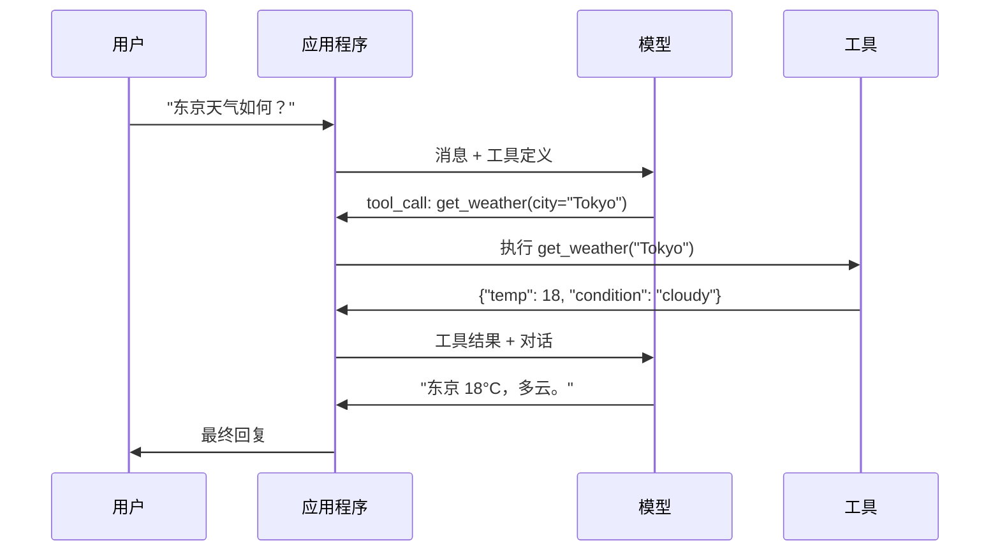

# 函数调用与工具使用

> LLM 本身无法执行任何操作，它们只能生成文本——这是它们全部的能力。它们不能查询天气、检索数据库、发送邮件、运行代码或读取文件。你见过的每一个"AI 智能体"，本质上都是一个 LLM 在生成 JSON，指明要调用哪个函数——然后由你的代码真正去调用它。模型是大脑，工具是双手，而函数调用就是连接二者的神经系统。

**类型：** 构建
**语言：** Python
**前置要求：** 阶段 11 第 03 课（结构化输出）
**时长：** ~75 分钟
**关联：** 阶段 11 · 14（模型上下文协议）——当工具需要在不同主机间共享时，从内联函数调用升级到 MCP 服务器。本课覆盖内联场景；MCP 覆盖协议场景。

## 学习目标

- 实现函数调用循环：定义工具架构、解析模型的工具调用 JSON、执行函数、返回结果
- 设计带有清晰描述和类型化参数的工具架构，使模型能够可靠地调用
- 构建多轮智能体循环，通过链式调用多个函数来处理复杂查询
- 处理函数调用的边界情况：并行工具调用、错误传播、防止无限工具循环

## 问题

你构建了一个聊天机器人。用户问："东京现在的天气如何？"

模型回答："我无法获取实时天气数据，但根据季节判断，东京目前大约 15 摄氏度……"

这是一个披着免责声明的幻觉。模型并不知道实时的天气。它永远也不会知道。天气每小时都在变化，而模型的训练数据已经是几个月前的了。

正确答案需要调用 OpenWeatherMap API，获取当前温度，并返回真实的数据。模型无法调用 API，但你的代码可以。缺失的环节：一个结构化的协议，让模型能够说出"我需要用这些参数调用天气 API"，然后让你的代码执行它并将结果反馈回去。

这就是函数调用。模型输出结构化的 JSON，描述要调用哪个函数以及使用什么参数。你的应用程序执行该函数，结果返回对话中，模型利用该结果生成最终答案。

没有函数调用，LLM 只是百科全书。有了它，LLM 就变成了智能体。

## 概念

### 函数调用循环

每一次工具使用的交互都遵循同样的 5 步循环。


```mermaid
sequenceDiagram
    participant U as 用户
    participant A as 应用程序
    participant M as 模型
    participant T as 工具

    U->>A: "东京天气如何？"
    A->>M: 消息 + 工具定义
    M->>A: tool_call: get_weather(city="Tokyo")
    A->>T: 执行 get_weather("Tokyo")
    T->>A: {"temp": 18, "condition": "cloudy"}
    A->>M: 工具结果 + 对话
    M->>A: "东京 18°C，多云。"
    A->>U: 最终回复
```

第 1 步：用户发送消息。第 2 步：模型接收消息以及工具定义（描述可用函数的 JSON Schema）。第 3 步：模型不直接返回文本，而是输出一个工具调用——包含函数名和参数的结构化 JSON 对象。第 4 步：你的代码执行该函数并捕获结果。第 5 步：结果返回给模型，此时模型拥有了真实数据，可以生成最终答案。

模型从不执行任何操作。它只决定调用什么函数以及使用什么参数。你的代码才是执行者。

### 工具定义：JSON Schema 契约

每个工具都由一个 JSON Schema 定义，它告诉模型该函数的作用、接受哪些参数以及这些参数的类型。

```json
{
  "type": "function",
  "function": {
    "name": "get_weather",
    "description": "获取某个城市的当前天气。返回摄氏温度及天气状况。",
    "parameters": {
      "type": "object",
      "properties": {
        "city": {
          "type": "string",
          "description": "城市名称，例如 'Tokyo' 或 'San Francisco'"
        },
        "units": {
          "type": "string",
          "enum": ["celsius", "fahrenheit"],
          "description": "温度单位"
        }
      },
      "required": ["city"]
    }
  }
}
```

`description` 字段至关重要。模型通过阅读它们来决定何时以及如何使用工具。像"获取天气"这样模糊的描述，效果远不如"获取某个城市的当前天气。返回摄氏温度及天气状况。"。描述本质上是工具选择的提示词。

### 提供商对比

每个主流提供商都支持函数调用，但 API 接口有所不同。

| 提供商 | API 参数 | 工具调用格式 | 并行调用 | 强制调用 |
|----------|--------------|-----------------|---------------|----------------|
| OpenAI (GPT-5, o4) | `tools` | `tool_calls[].function` | 是（每轮多个） | `tool_choice="required"` |
| Anthropic (Claude 4.6/4.7) | `tools` | `content[].type="tool_use"` | 是（多个块） | `tool_choice={"type":"any"}` |
| Google (Gemini 3) | `function_declarations` | `functionCall` | 是 | `function_calling_config` |
| 开放权重 (Llama 4, Qwen3, DeepSeek-V3) | Llama 4 原生 `tools`；其他使用 Hermes 或 ChatML | 混合 | 取决于模型 | 基于提示词或支持 `tool_choice` 的情况 |

到 2026 年，三家闭源提供商已基本统一到近乎相同的基于 JSON Schema 的格式。Llama 4 自带与 OpenAI 形状匹配的原生 `tools` 字段。开放权重的微调模型仍有差异——Hermes 格式（NousResearch）是第三方微调模型中最常见的。对于跨主机的共享工具，推荐使用 MCP（阶段 11 · 14）而非内联函数调用——所有主机使用相同的服务器。

### 工具选择：自动、必选、指定

你可以控制模型何时使用工具。

**自动（Auto）**（默认）：模型自行决定是调用工具还是直接回复。"2+2 等于几？"——直接回复。"天气如何？"——调用工具。

**必选（Required）**：模型必须至少调用一个工具。当你确定用户的意图需要工具时使用。防止模型靠猜测而不是查询真实数据来回答。

**指定函数（Specific function）**：强制模型调用某个特定函数。`tool_choice={"type":"function", "function": {"name": "get_weather"}}` 确保无论查询内容是什么，天气工具都会被调用。在路由场景中使用——当上游逻辑已经确定需要哪个工具时。

### 并行函数调用

GPT-4o 和 Claude 可以在单次响应中调用多个函数。用户问："东京和纽约的天气如何？"模型同时输出两个工具调用：

```json
[
  {"name": "get_weather", "arguments": {"city": "Tokyo"}},
  {"name": "get_weather", "arguments": {"city": "New York"}}
]
```

你的代码执行两者（理想情况下并发执行），返回两个结果，然后模型综合出一个回复。这可将往返次数从 2 次减少到 1 次。对于每次查询需要 5-10 次工具调用的智能体，并行调用可将延迟降低 60-80%。

### 结构化输出 vs 函数调用

第 03 课介绍了结构化输出。函数调用使用同样的 JSON Schema 机制，但目的不同。

**结构化输出**：强制模型以特定形状生成数据。输出就是最终产物。例如：从文本中提取产品信息为 `{name, price, in_stock}`。

**函数调用**：模型声明执行某个动作的意图。输出是一个中间步骤。例如：`get_weather(city="Tokyo")`——模型在请求一个动作，而不是生成最终答案。

当你需要数据提取时使用结构化输出。当你希望模型与外部系统交互时使用函数调用。

### 安全：不可妥协的规则

函数调用是你能给予 LLM 的最危险的能力。模型自行选择要执行什么。如果你的工具集包含数据库查询，模型会构造查询语句。如果包含 shell 命令，模型会编写它们。

**规则 1：永远不要将模型生成的 SQL 直接传给数据库。** 模型会——而且一定会——生成 DROP TABLE、UNION 注入或返回所有行的查询。始终使用参数化查询。始终进行验证。始终使用操作白名单。

**规则 2：白名单化函数。** 模型只能调用你明确定义的函数。永远不要构建通用的"按名称执行任意函数"工具。如果你有 50 个内部函数，只暴露用户需要的 5 个。

**规则 3：验证参数。** 模型可能传入像 `"; DROP TABLE users; --"` 这样的城市名。在执行前，根据预期的类型、范围和格式验证每一个参数。

**规则 4：清理工具结果。** 如果工具返回敏感数据（API 密钥、个人身份信息、内部错误），在返回给模型之前进行过滤。模型会将工具结果原样包含在其回复中。

**规则 5：对工具调用进行速率限制。** 循环中的模型可以调用工具数百次。设置一个上限（每次对话 10-20 次调用是合理的）。打破无限循环。

### 错误处理

工具会失败。API 超时。数据库宕机。文件不存在。模型需要知道工具何时失败以及原因。

将错误作为结构化的工具结果返回，而不是抛出异常：

```json
{
  "error": true,
  "message": "未找到城市 'Toky'。是否指 'Tokyo'？",
  "code": "CITY_NOT_FOUND"
}
```

模型读取这些信息，调整参数并重试。模型擅长从结构化的错误消息中进行自我修正。但它们不擅长应对空响应或泛泛的"出了点问题"错误。

### MCP：模型上下文协议

MCP 是 Anthropic 提出的工具互操作性开放标准。不同于每个应用程序各自定义自己的工具，MCP 提供了一种通用协议：工具由 MCP 服务器提供，由 MCP 客户端（如 Claude Code、Cursor 或你的应用程序）消费。

一个 MCP 服务器可以向任何兼容的客户端暴露工具。Postgres MCP 服务器让任何兼容 MCP 的智能体拥有数据库访问能力。GitHub MCP 服务器让任何智能体拥有仓库访问能力。工具只需定义一次，处处可用。

MCP 之于函数调用，就像 HTTP 之于网络通信。它标准化了传输层，使得工具变得可移植。

## 动手构建

### 第 1 步：定义工具注册表

构建一个存储工具定义及其实现的注册表。每个工具包含一个 JSON Schema 定义（模型看到的内容）和一个 Python 函数（你的代码执行的内容）。

```python
import json
import math
import time
import hashlib


TOOL_REGISTRY = {}


def register_tool(name, description, parameters, function):
    TOOL_REGISTRY[name] = {
        "definition": {
            "type": "function",
            "function": {
                "name": name,
                "description": description,
                "parameters": parameters,
            },
        },
        "function": function,
    }
```

### 第 2 步：实现 5 个工具

构建一个计算器、天气查询、网络搜索模拟器、文件读取器和代码运行器。

```python
def calculator(expression, precision=2):
    allowed = set("0123456789+-*/.() ")
    if not all(c in allowed for c in expression):
        return {"error": True, "message": f"表达式中包含非法字符：{expression}"}
    try:
        result = eval(expression, {"__builtins__": {}}, {"math": math})
        return {"result": round(float(result), precision), "expression": expression}
    except Exception as e:
        return {"error": True, "message": str(e)}


WEATHER_DB = {
    "tokyo": {"temp_c": 18, "condition": "cloudy", "humidity": 72, "wind_kph": 14},
    "new york": {"temp_c": 22, "condition": "sunny", "humidity": 45, "wind_kph": 8},
    "london": {"temp_c": 12, "condition": "rainy", "humidity": 88, "wind_kph": 22},
    "san francisco": {"temp_c": 16, "condition": "foggy", "humidity": 80, "wind_kph": 18},
    "sydney": {"temp_c": 25, "condition": "sunny", "humidity": 55, "wind_kph": 10},
}


def get_weather(city, units="celsius"):
    key = city.lower().strip()
    if key not in WEATHER_DB:
        suggestions = [c for c in WEATHER_DB if c.startswith(key[:3])]
        return {
            "error": True,
            "message": f"未找到城市 '{city}'。",
            "suggestions": suggestions,
            "code": "CITY_NOT_FOUND",
        }
    data = WEATHER_DB[key].copy()
    if units == "fahrenheit":
        data["temp_f"] = round(data["temp_c"] * 9 / 5 + 32, 1)
        del data["temp_c"]
    data["city"] = city
    return data


SEARCH_DB = {
    "python function calling": [
        {"title": "OpenAI 函数调用指南", "url": "https://platform.openai.com/docs/guides/function-calling", "snippet": "了解如何将 LLM 连接到外部工具。"},
        {"title": "Anthropic 工具使用", "url": "https://docs.anthropic.com/en/docs/tool-use", "snippet": "Claude 可以与外部工具和 API 交互。"},
    ],
    "MCP protocol": [
        {"title": "模型上下文协议", "url": "https://modelcontextprotocol.io", "snippet": "用于将 AI 模型连接到数据源的开放标准。"},
    ],
    "weather API": [
        {"title": "OpenWeatherMap API", "url": "https://openweathermap.org/api", "snippet": "提供当前、预报和历史数据的免费天气 API。"},
    ],
}


def web_search(query, max_results=3):
    key = query.lower().strip()
    for db_key, results in SEARCH_DB.items():
        if db_key in key or key in db_key:
            return {"query": query, "results": results[:max_results], "total": len(results)}
    return {"query": query, "results": [], "total": 0}


FILE_SYSTEM = {
    "data/config.json": '{"model": "gpt-4o", "temperature": 0.7, "max_tokens": 4096}',
    "data/users.csv": "name,email,role\nAlice,alice@example.com,admin\nBob,bob@example.com,user",
    "README.md": "# 我的项目\n一个从零构建的工具使用智能体。",
}


def read_file(path):
    if ".." in path or path.startswith("/"):
        return {"error": True, "message": "不允许路径遍历。", "code": "FORBIDDEN"}
    if path not in FILE_SYSTEM:
        available = list(FILE_SYSTEM.keys())
        return {"error": True, "message": f"文件 '{path}' 未找到。", "available_files": available, "code": "NOT_FOUND"}
    content = FILE_SYSTEM[path]
    return {"path": path, "content": content, "size_bytes": len(content), "lines": content.count("\n") + 1}


def run_code(code, language="python"):
    if language != "python":
        return {"error": True, "message": f"不支持语言 '{language}'。仅支持 'python'。"}
    forbidden = ["import os", "import sys", "import subprocess", "exec(", "eval(", "__import__", "open("]
    for pattern in forbidden:
        if pattern in code:
            return {"error": True, "message": f"不允许的语句：{pattern}——已阻止危险操作。", "code": "FORBIDDEN"}
    try:
        local_vars = {}
        exec(code, {"__builtins__": {}}, local_vars)
        return {"result": str(local_vars.get("result", "代码执行成功，无返回结果。"))}
    except Exception as e:
        return {"error": True, "message": f"代码执行错误：{str(e)}", "code": "EXECUTION_ERROR"}


def register_all_tools():
    register_tool(
        "calculator",
        "计算数学表达式。支持 +、-、*、/、括号和 math 函数。返回数值结果。",
        {
            "type": "object",
            "properties": {
                "expression": {
                    "type": "string",
                    "description": "要计算的数学表达式，例如 '(10 + 5) * 3 / 2'",
                },
                "precision": {
                    "type": "integer",
                    "description": "小数精度（小数位数）",
                    "default": 2,
                },
            },
            "required": ["expression"],
        },
        calculator,
    )
    register_tool(
        "get_weather",
        "获取城市的当前天气。返回摄氏温度、天气状况、湿度和风速。",
        {
            "type": "object",
            "properties": {
                "city": {
                    "type": "string",
                    "description": "城市名称，例如 'Tokyo'、'New York'、'London'",
                },
                "units": {
                    "type": "string",
                    "enum": ["celsius", "fahrenheit"],
                    "description": "温度单位（celsius 或 fahrenheit）",
                },
            },
            "required": ["city"],
        },
        get_weather,
    )
    register_tool(
        "web_search",
        "搜索网络。可用于查找文档、教程和指定主题的参考资料。",
        {
            "type": "object",
            "properties": {
                "query": {
                    "type": "string",
                    "description": "搜索查询",
                },
                "max_results": {
                    "type": "integer",
                    "description": "返回的最大结果数",
                    "default": 3,
                },
            },
            "required": ["query"],
        },
        web_search,
    )
    register_tool(
        "read_file",
        "从模拟文件系统中读取文件内容。可访问 data/ 和项目根目录下的文件。",
        {
            "type": "object",
            "properties": {
                "path": {
                    "type": "string",
                    "description": "文件路径，例如 'data/config.json' 或 'README.md'",
                },
            },
            "required": ["path"],
        },
        read_file,
    )
    register_tool(
        "run_code",
        "运行 Python 代码（沙箱环境）。代码应该通过一个名为 'result' 的变量返回结果。危险操作（导入系统模块、文件 I/O）已被阻止。",
        {
            "type": "object",
            "properties": {
                "code": {
                    "type": "string",
                    "description": "要执行的 Python 代码。使用 'result = ...' 来返回结果。",
                },
                "language": {
                    "type": "string",
                    "description": "编程语言（目前仅支持 'python'）",
                    "default": "python",
                },
            },
            "required": ["code"],
        },
        run_code,
    )
```

### 第 3 步：实现执行器

执行器接收模型返回的工具调用 JSON，查找已注册的函数，执行它，并返回结果。它对并行调用进行批处理，测量执行时间，并通过已用工具集追踪以避免无限循环。

```python
def execute_tool_call(tool_call):
    name = tool_call.get("name", "")
    arguments = tool_call.get("arguments", {})

    if name not in TOOL_REGISTRY:
        return {"result": {"error": True, "message": f"未知工具：{name}"}, "execution_time_ms": 0, "tool": name}

    tool = TOOL_REGISTRY[name]
    errors = validate_tool_arguments(name, arguments)
    if errors:
        return {"result": {"error": True, "message": "; ".join(errors)}, "execution_time_ms": 0, "tool": name}

    start = time.time()
    try:
        result = tool["function"](**arguments)
    except Exception as e:
        result = {"error": True, "message": f"工具执行错误：{str(e)}"}
    elapsed = round((time.time() - start) * 1000, 1)

    return {"result": result, "execution_time_ms": elapsed, "tool": name}
```

### 第 4 步：构建函数调用循环

这就是"智能体循环"——模型决定调用哪个工具、你的代码执行它、结果反馈回模型，然后模型决定是否还需要调用另一个工具。

```python
MODEL = None  # 设置为你可用的模型


def model_can_call_tools(messages):
    """检查模型是否支持工具调用。"""
    if MODEL is None:
        return False
    return True


def model_decide_tool_call(messages):
    """向模型发送消息和工具定义，让模型决定要调用哪个函数。返回模型的消息对象。"""
    # 在实际应用中，这会是 OpenAI / Anthropic API 调用
    # 我们根据消息内容模拟模型的决策
    last = messages[-1]["content"].lower()
    user_msg = messages[-1]["content"]

    # 检测并行调用的机会
    if " and " in last and ("weather" in last or "temperature" in last):
        cities = []
        for word in user_msg.split():
            word_clean = word.strip(",.?!")
            if word_clean.lower() in ["tokyo", "london", "new york", "sydney", "san francisco"] or \
               word_clean.lower() in WEATHER_DB:
                cities.append(word_clean)
        cities = list(set(cities))
        if len(cities) >= 2:
            calls = []
            for city in cities:
                calls.append({
                    "id": f"call_{hashlib.md5(city.encode()).hexdigest()[:8]}",
                    "type": "function",
                    "function": {"name": "get_weather", "arguments": json.dumps({"city": city})},
                })
            return {"tool_calls": calls, "content": None}

    # 单个工具检测逻辑
    tool_patterns = [
        ("calculator", ["calculate", "what is", "compute", "=", "+", "-", "*", "/", "math"]),
        ("get_weather", ["weather", "temperature", "forecast", "how cold", "how hot"]),
        ("web_search", ["search for", "find", "look up", "research", "tell me about"]),
        ("read_file", ["read", "open file", "config", "show me"]),
        ("run_code", ["run code", "execute", "python", "script", "compute"]),
    ]

    for tool_name, patterns in tool_patterns:
        if any(p in last for p in patterns):
            args = _generate_args(tool_name, user_msg)
            return {
                "tool_calls": [{
                    "id": f"call_{hashlib.md5(user_msg.encode()).hexdigest()[:8]}",
                    "type": "function",
                    "function": {"name": tool_name, "arguments": json.dumps(args)},
                }],
                "content": None,
            }

    return {"content": "I don't need to call any tools for that."}


def _generate_args(tool_name, user_msg):
    if tool_name == "get_weather":
        for word in user_msg.split():
            w = word.strip(",.?!")
            if w.lower() in WEATHER_DB:
                return {"city": w}
        return {"city": "Tokyo"}
    if tool_name == "calculator":
        import re
        match = re.search(r'[\d\s+\-*/().]+', user_msg)
        return {"expression": match.group().strip() if match else "0"}
    if tool_name == "web_search":
        for prefix in ["search for", "find", "tell me about", "look up"]:
            if prefix in user_msg.lower():
                return {"query": user_msg.lower().split(prefix, 1)[1].strip()}
        return {"query": user_msg}
    if tool_name == "read_file":
        for word in user_msg.split():
            if "/" in word or word.endswith(".json") or word.endswith(".md") or word.endswith(".csv"):
                return {"path": word.strip(",.?!\"'")}
        return {"path": "data/config.json"}
    if tool_name == "run_code":
        for prefix in ["run", "execute", "compute"]:
            if user_msg.lower().startswith(prefix):
                return {"code": user_msg[len(prefix):].strip()}
        return {"code": "result = 42"}


def run_function_calling_loop(user_message, max_iterations=10):
    messages = [{"role": "user", "content": user_message}]
    used_tools = set()
    tool_results = []
    iterations = 0

    while iterations < max_iterations:
        iterations += 1
        model_msg = model_decide_tool_call(messages)

        if not model_msg.get("tool_calls"):
            break

        for tool_call in model_msg["tool_calls"]:
            tool_name = tool_call["function"]["name"]
            if tool_name in used_tools:
                continue
            used_tools.add(tool_name)

            result = execute_tool_call({
                "name": tool_name,
                "arguments": json.loads(tool_call["function"]["arguments"]),
            })
            tool_results.append({"tool": tool_name, "result": result["result"], "execution_time_ms": result["execution_time_ms"]})

        if len(model_msg.get("tool_calls", [])) == 0:
            break

    return {"tool_results": tool_results, "iterations": iterations, "messages": messages}
```

### 第 5 步：验证参数

永远不要信任模型的输出。在执行之前，根据 JSON Schema 验证每个工具的参数。

```python
def validate_tool_arguments(tool_name, arguments):
    if tool_name not in TOOL_REGISTRY:
        return [f"未知工具：{tool_name}"]

    schema = TOOL_REGISTRY[tool_name]["definition"]["function"]["parameters"]
    errors = []

    if not isinstance(arguments, dict):
        return [f"参数必须是一个对象，实际得到的是 {type(arguments).__name__}"]

    for required_field in schema.get("required", []):
        if required_field not in arguments:
            errors.append(f"缺少必需参数：{required_field}")

    properties = schema.get("properties", {})
    for arg_name, arg_value in arguments.items():
        if arg_name not in properties:
            errors.append(f"未知参数：{arg_name}")
            continue

        prop_schema = properties[arg_name]
        expected_type = prop_schema.get("type")

        type_checks = {"string": str, "integer": int, "number": (int, float), "boolean": bool, "array": list, "object": dict}
        if expected_type in type_checks:
            if not isinstance(arg_value, type_checks[expected_type]):
                errors.append(f"参数 '{arg_name}'：期望 {expected_type}，实际得到 {type(arg_value).__name__}")

        if "enum" in prop_schema and arg_value not in prop_schema["enum"]:
            errors.append(f"参数 '{arg_name}'：'{arg_value}' 不在 {prop_schema['enum']} 中")

    return errors
```

### 第 6 步：运行演示

```python
def run_demo():
    register_all_tools()

    print("=" * 60)
    print("  函数调用与工具使用演示")
    print("=" * 60)

    print("\n--- 已注册的工具 ---")
    for name, tool in TOOL_REGISTRY.items():
        desc = tool["definition"]["function"]["description"][:60]
        params = list(tool["definition"]["function"]["parameters"].get("properties", {}).keys())
        print(f"  {name}: {desc}...")
        print(f"    参数: {params}")

    print(f"\n--- 参数验证 ---")
    validation_tests = [
        ("get_weather", {"city": "Tokyo"}, "有效调用"),
        ("get_weather", {}, "缺少必需参数"),
        ("get_weather", {"city": "Tokyo", "units": "kelvin"}, "无效枚举值"),
        ("calculator", {"expression": 123}, "类型错误（整数而非字符串）"),
        ("unknown_tool", {"x": 1}, "未知工具"),
    ]
    for tool_name, args, label in validation_tests:
        errors = validate_tool_arguments(tool_name, args)
        status = "有效" if not errors else f"错误：{errors}"
        print(f"  {label}: {status}")

    print(f"\n--- 工具执行 ---")
    direct_tests = [
        {"name": "calculator", "arguments": {"expression": "(10 + 5) * 3 / 2"}},
        {"name": "get_weather", "arguments": {"city": "Tokyo"}},
        {"name": "get_weather", "arguments": {"city": "Mars"}},
        {"name": "web_search", "arguments": {"query": "python function calling"}},
        {"name": "read_file", "arguments": {"path": "data/config.json"}},
        {"name": "read_file", "arguments": {"path": "../etc/passwd"}},
        {"name": "run_code", "arguments": {"code": "result = sum(range(1, 101))"}},
        {"name": "run_code", "arguments": {"code": "import os; os.system('rm -rf /')"}},
    ]
    for call in direct_tests:
        result = execute_tool_call(call)
        print(f"\n  {call['name']}({json.dumps(call['arguments'])})")
        print(f"    -> {json.dumps(result['result'], indent=None)[:100]}")
        print(f"    耗时: {result['execution_time_ms']}ms")

    print(f"\n--- 完整函数调用循环 ---")
    test_queries = [
        "东京的天气如何？",
        "计算 (100 + 250) * 0.15",
        "搜索 MCP 协议",
        "读取配置文件",
        "运行一些 Python 代码",
        "给我讲个笑话",
    ]
    for query in test_queries:
        print(f"\n  用户: {query}")
        result = run_function_calling_loop(query)
        if result["tool_results"]:
            for tr in result["tool_results"]:
                print(f"    工具: {tr['tool']} ({tr['execution_time_ms']}ms)")
                print(f"    结果: {json.dumps(tr['result'], indent=None)[:90]}")
        else:
            print(f"    [未调用工具——直接回复]")
        print(f"    迭代次数: {result['iterations']}")

    print(f"\n--- 并行工具调用 ---")
    multi_city_query = "东京和伦敦的天气如何？"
    print(f"  用户: {multi_city_query}")
    result = run_function_calling_loop(multi_city_query)
    print(f"  工具调用次数: {len(result['tool_results'])}")
    for tr in result["tool_results"]:
        city = tr["result"].get("city", "unknown")
        temp = tr["result"].get("temp_c", "N/A")
        print(f"    {city}: {temp}°C，{tr['result'].get('condition', 'N/A')}")

    print(f"\n--- 安全检查 ---")
    security_tests = [
        ("read_file", {"path": "../../etc/passwd"}),
        ("run_code", {"code": "import subprocess; subprocess.run(['ls'])"}),
        ("calculator", {"expression": "__import__('os').system('ls')"}),
    ]
    for tool_name, args in security_tests:
        result = execute_tool_call({"name": tool_name, "arguments": args})
        blocked = result["result"].get("error", False)
        print(f"  {tool_name}({list(args.values())[0][:40]}): {'已阻止' if blocked else '已允许'}")
```

## 实际应用

### OpenAI 函数调用

```python
# from openai import OpenAI
#
# client = OpenAI()
#
# tools = [{
#     "type": "function",
#     "function": {
#         "name": "get_weather",
#         "description": "获取某个城市的当前天气",
#         "parameters": {
#             "type": "object",
#             "properties": {
#                 "city": {"type": "string"},
#                 "units": {"type": "string", "enum": ["celsius", "fahrenheit"]}
#             },
#             "required": ["city"]
#         }
#     }
# }]
#
# response = client.chat.completions.create(
#     model="gpt-4o",
#     messages=[{"role": "user", "content": "东京的天气如何？"}],
#     tools=tools,
#     tool_choice="auto",
# )
#
# tool_call = response.choices[0].message.tool_calls[0]
# args = json.loads(tool_call.function.arguments)
# result = get_weather(**args)
#
# final = client.chat.completions.create(
#     model="gpt-4o",
#     messages=[
#         {"role": "user", "content": "东京的天气如何？"},
#         response.choices[0].message,
#         {"role": "tool", "tool_call_id": tool_call.id, "content": json.dumps(result)},
#     ],
# )
# print(final.choices[0].message.content)
```

OpenAI 以 `response.choices[0].message.tool_calls` 的形式返回工具调用。每个调用都有一个 `id`，你在返回结果时必须包含它。模型用这个 ID 将结果与调用匹配。GPT-4o 可以在单次响应中返回多个工具调用——遍历并执行所有这些调用。

### Anthropic 工具使用

```python
# import anthropic
#
# client = anthropic.Anthropic()
#
# response = client.messages.create(
#     model="claude-sonnet-4-20250514",
#     max_tokens=1024,
#     tools=[{
#         "name": "get_weather",
#         "description": "获取某个城市的当前天气",
#         "input_schema": {
#             "type": "object",
#             "properties": {
#                 "city": {"type": "string"},
#                 "units": {"type": "string", "enum": ["celsius", "fahrenheit"]}
#             },
#             "required": ["city"]
#         }
#     }],
#     messages=[{"role": "user", "content": "东京的天气如何？"}],
# )
#
# tool_block = next(b for b in response.content if b.type == "tool_use")
# result = get_weather(**tool_block.input)
#
# final = client.messages.create(
#     model="claude-sonnet-4-20250514",
#     max_tokens=1024,
#     tools=[...],
#     messages=[
#         {"role": "user", "content": "东京的天气如何？"},
#         {"role": "assistant", "content": response.content},
#         {"role": "user", "content": [{"type": "tool_result", "tool_use_id": tool_block.id, "content": json.dumps(result)}]},
#     ],
# )
```

Anthropic 以内容块的形式返回工具调用，其 `type` 为 `"tool_use"`。工具结果放在一个 `type` 为 `"tool_result"` 的用户消息中。注意关键区别：Anthropic 使用 `input_schema` 定义工具参数，而 OpenAI 使用 `parameters`。

### MCP 集成

```python
# MCP 服务器通过标准化的协议暴露工具。
# 任何兼容 MCP 的客户端都可以发现并调用这些工具。
#
# 示例：连接到 Postgres MCP 服务器
#
# from mcp import ClientSession, StdioServerParameters
# from mcp.client.stdio import stdio_client
#
# server_params = StdioServerParameters(
#     command="npx",
#     args=["-y", "@modelcontextprotocol/server-postgres", "postgresql://localhost/mydb"],
# )
#
# async with stdio_client(server_params) as (read, write):
#     async with ClientSession(read, write) as session:
#         await session.initialize()
#         tools = await session.list_tools()
#         result = await session.call_tool("query", {"sql": "SELECT count(*) FROM users"})
```

MCP 将工具的实现与工具的消费解耦。Postgres 服务器懂得 SQL，GitHub 服务器懂得 API。你的智能体只需发现并调用工具——它不需要为每个集成单独编写提供商特定的代码。

## 交付产物

本课产出 `outputs/prompt-tool-designer.md`——一个可复用的提示词模板，用于设计工具定义。给它一段关于你想让工具做什么的描述，它就能生成包含描述、类型和约束的完整 JSON Schema 定义。

同时还产出 `outputs/skill-function-calling-patterns.md`——一个在生产环境中实现函数调用的决策框架，涵盖工具设计、错误处理、安全性和提供商特定模式。

## 练习

1. **添加第 6 个工具：数据库查询。** 实现一个带有内存表的模拟 SQL 工具。该工具接受表名和过滤条件（不是原始 SQL）。验证表名在白名单中，且过滤运算符限制为 `=`、`>`、`<`、`>=`、`<=`。将匹配的行作为 JSON 返回。

2. **实现带错误反馈的重试。** 当工具调用失败时（例如城市未找到），将错误信息反馈给模型决策函数，让它修正参数。追踪每次调用需要的重试次数。每次工具调用最多重试 3 次。

3. **构建多步骤智能体。** 有些查询需要链式调用多个工具："读取配置文件，告诉我配置了哪个模型，然后在网上搜索该模型的价格。"实现一个循环，运行直到模型决定不再需要更多工具，将累积的结果传递到每个决策步骤。限制最多 10 次迭代以防止无限循环。

4. **衡量工具选择准确率。** 创建 30 个带有预期工具名称的测试查询。在所有 30 个查询上运行你的决策函数，并衡量选择正确工具的百分比。找出哪些查询在工具之间造成了最大的混淆。

5. **实现工具调用缓存。** 如果在 60 秒内使用完全相同的参数调用同一工具，则返回缓存的结果而不是重新执行。使用以 `(tool_name, frozenset(args.items()))` 为键的字典。在包含 20 个查询的对话中衡量缓存命中率。

## 关键术语

| 术语 | 通常说法 | 实际含义 |
|------|----------------|----------------------|
| 函数调用 (Function calling) | "工具使用" | 模型输出结构化 JSON，描述要调用哪个函数及参数——由你的代码执行，而非模型 |
| 工具定义 (Tool definition) | "函数架构" | 描述工具名称、用途、参数和类型的 JSON Schema 对象——模型通过阅读它来决定何时及如何使用工具 |
| 工具选择 (Tool choice) | "调用模式" | 控制模型是必须调用工具（required）、可以调用工具（auto）、还是必须调用特定工具（named） |
| 并行调用 (Parallel calling) | "多工具" | 模型在单次响应中输出多个工具调用，减少往返次数——GPT-4o 和 Claude 都支持 |
| 工具结果 (Tool result) | "函数输出" | 执行工具的返回值，作为消息发回给模型，以便模型在回复中使用真实数据 |
| 参数验证 (Argument validation) | "输入检查" | 在执行工具前，验证模型生成的参数是否符合预期的类型、范围和约束 |
| MCP | "工具协议" | 模型上下文协议——Anthropic 的开放标准，通过服务器暴露工具，任何兼容客户端均可发现并调用 |
| 智能体循环 (Agent loop) | "ReAct 循环" | 模型决定工具、代码执行工具、结果反馈的迭代循环，直到模型拥有足够信息进行回复 |
| 工具投毒 (Tool poisoning) | "通过工具的提示注入" | 一种攻击方式，工具结果中包含操纵模型行为的指令——务必清理所有工具输出 |
| 速率限制 (Rate limiting) | "调用预算" | 设置每次对话中工具调用的最大次数，以防止无限循环和失控的 API 费用 |

## 延伸阅读

- [OpenAI 函数调用指南](https://platform.openai.com/docs/guides/function-calling) —— 使用 GPT-4o 进行工具使用的权威参考，涵盖并行调用、强制调用和结构化参数
- [Anthropic 工具使用指南](https://docs.anthropic.com/en/docs/tool-use) —— Claude 的工具使用实现，包含 input_schema、多工具响应和 tool_choice 配置
- [模型上下文协议规范](https://modelcontextprotocol.io) —— 跨 AI 应用工具互操作性的开放标准，包含服务器/客户端架构
- [Schick 等人，2023——"Toolformer：语言模型可以自学使用工具"](https://arxiv.org/abs/2302.04761) —— 关于训练 LLM 决定何时以及如何调用外部工具的基础论文
- [Patil 等人，2023——"Gorilla：连接海量 API 的大语言模型"](https://arxiv.org/abs/2305.15334) —— 对 LLM 进行微调以在 1,645 个 API 上实现准确调用并减少幻觉
- [伯克利函数调用排行榜](https://gorilla.cs.berkeley.edu/leaderboard.html) —— 实时基准测试，比较 GPT-4o、Claude、Gemini 和开放模型的函数调用准确率
- [Yao 等人，"ReAct：在语言模型中协同推理与行动"(ICLR 2023)](https://arxiv.org/abs/2210.03629) —— 思想-行动-观察循环，这是每个工具调用外层的智能体循环；本课结束之处，正是阶段 14 开始的地方
- [Anthropic——构建高效智能体(2024 年 12 月)](https://www.anthropic.com/research/building-effective-agents) —— 基于单一工具使用原语构建的五种可组合模式（提示词链式调用、路由、并行化、编排器-工作者、评估器-优化器）
