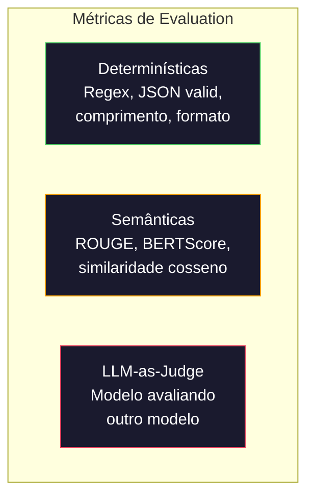

# Evaluation & Testing de Aplicações LLM

> Você nunca implantaria um app web sem testes. Nunca faria uma migração de banco sem plano de rollback. Mas agora, a maioria das equipes entrega aplicações LLM lendo 10 saídas e dizendo "é, parece bom." Isso não é evaluation. É esperança. Esperança não é prática de engenharia. Toda mudança de prompt, toda troca de modelo, todo ajuste de temperatura muda sua distribuição de saída de imprevisíveis. Evaluation é a única coisa entre sua aplicação e degradação silenciosa.

**Tipo:** Construção
**Linguagens:** Python
**Pré-requisitos:** Fase 11 Aula 01 (Prompt Engineering), Aula 09 (Function Calling)
**Tempo:** ~45 minutos

## Objetivos de Aprendizado

- Construir um dataset de evaluation com pares entrada-saída, rubricas e casos extremos eespecificaçãoíficos da sua aplicação
- Implementar pontuação automatizada usando LLM-as-judge, regex matching e assertions determinísticas
- Configurar pipelines de eval com CI/CD, custo-gated runs e dashboards de regressão
- Medir estatisticamente se uma mudança de prompt melhora ou piora a qualidade

## O Problema

Você mudou o system prompt. Rodou 10 testes manuais. Parece bom. Implantou. Três dias depois, ticket de suporte: "O chatbot começou a dar respostas agressivas." Você não tem como provar que a mudança causou o problema porque não tinha baseline.

## O Conceito

### Métricas de Evaluation



### LLM-as-Judge

Usar um modelo forte para avaliar as saídas de outro modelo. Correlaciona 80-85% com julgamento humano.

```python
def score_with_llm_judge(input_text, output, reference=None, criteria=None):
    """Pontua usando LLM como juiz."""
    if criteria is None:
        criteria = ["relevância", "corretude", "utilidade", "segurança"]
    
    scores = []
    for criterion in criteria:
        # Simula pontuação (em produção, usa LLM real)
        score = simulate_judgment(input_text, output, reference, criterion)
        scores.append({"criterion": criterion, "score": score})
    
    return scores
```

### ROUGE-L

Mede sobreposição de subsequência mais longa entre referência e hipótese:

```python
def lcs_length(x, y):
    """Calcula o comprimento da subsequência mais longa."""
    m, n = len(x), len(y)
    dp = [[0] * (n + 1) for _ in range(m + 1)]
    for i in range(1, m + 1):
        for j in range(1, n + 1):
            if x[i-1] == y[j-1]:
                dp[i][j] = dp[i-1][j-1] + 1
            else:
                dp[i][j] = max(dp[i-1][j], dp[i][j-1])
    return dp[m][n]

def rouge_l_score(reference, hypothesis):
    """Pontuação ROUGE-L."""
    ref_tokens = reference.lower().split()
    hyp_tokens = hypothesis.lower().split()
    lcs = lcs_length(ref_tokens, hyp_tokens)
    precision = lcs / len(hyp_tokens) if hyp_tokens else 0
    recall = lcs / len(ref_tokens) if ref_tokens else 0
    if precision + recall == 0:
        return 0
    return 2 * precision * recall / (precision + recall)
```

### Intervalos de Confiança

```python
import statistics
import math

def bootstrap_confidence_interval(scores, n_bootstrap=1000, ci=0.95):
    """Intervalo de confiança por bootstrap."""
    means = []
    for _ in range(n_bootstrap):
        sample = [scores[i] for i in 
                  [__import__('random').randrange(len(scores)) for _ in range(len(scores))]]
        means.append(statistics.mean(sample))
    means.sort()
    lower = means[int((1 - ci) / 2 * n_bootstrap)]
    upper = means[int((1 + ci) / 2 * n_bootstrap)]
    return (round(lower, 4), round(statistics.mean(scores), 4), round(upper, 4))

def wilson_confidence_interval(passes, total, ci=0.95):
    """Intervalo de Wilson para proporções."""
    if total == 0:
        return (0, 0)
    p = passes / total
    z = 1.96  # para 95%
    denominator = 1 + z**2 / total
    center = (p + z**2 / (2 * total)) / denominator
    spread = z * math.sqrt((p * (1 - p) + z**2 / (4 * total)) / total) / denominator
    return (round(max(0, center - spread), 4), round(min(1, center + spread), 4))
```

### Comparação de Runs

```python
def compare_eval_runs(baseline_results, new_results, criteria=None):
    """Compara dois runs de evaluation e detecta regressões."""
    if criteria is None:
        criteria = ["relevância", "corretude", "utilidade", "segurança"]
    
    report = {"criteria": {}, "overall": {}, "regressions": [], "improvements": []}
    
    for criterion in criteria:
        baseline_scores = [s["score"] for r in baseline_results 
                          for s in r["scores"] if s["criterion"] == criterion]
        new_scores = [s["score"] for r in new_results 
                     for s in r["scores"] if s["criterion"] == criterion]
        
        if not baseline_scores or not new_scores:
            continue
        
        baseline_mean = statistics.mean(baseline_scores)
        new_mean = statistics.mean(new_scores)
        diff = new_mean - baseline_mean
        
        if diff < -0.3:
            report["regressions"].append(criterion)
        elif diff > 0.3:
            report["improvements"].append(criterion)
        
        report["criteria"][criterion] = {
            "baseline_mean": round(baseline_mean, 3),
            "new_mean": round(new_mean, 3),
            "diff": round(diff, 3),
        }
    
    report["overall"] = {
        "ship_decision": "SHIP" if not report["regressions"] else "BLOCK",
    }
    
    return report
```

## Use

### promptfoo

```yaml
# promptfooconfig.yaml
prompts:
  - "Responda: {{question}}"
  - "Você é um assistente útil. Pergunta: {{question}}"

providers:
  - openai:gpt-4o
  - anthropic:messages:claude-sonnet-4-20250514

tests:
  - vars:
      question: "Qual a capital da França?"
    assert:
      - type: contains
        value: "Paris"
      - type: llm-rubric
        value: "A resposta deve ser factual e concisa"
```

### DeepEval

```python
# from deepeval import evaluate
# from deepeval.metrics import AnswerRelevancyMetric, FaithfulnessMetric
# from deepeval.test_case import LLMTestCase
#
# test_case = LLMTestCase(
#     input="Qual a capital da França?",
#     actual_output="A capital da França é Paris.",
#     expected_output="Paris",
# )
#
# relevancy = AnswerRelevancyMetric(threshold=0.7)
# faithfulness = FaithfulnessMetric(threshold=0.7)
# evaluate([test_case], [relevancy, faithfulness])
```

### CI/CD Integration

```yaml
# .github/workflows/eval.yml
name: LLM Eval
on:
  pull_request:
    paths: ['prompts/**', 'src/llm/**']
jobs:
  eval:
    runs-on: ubuntu-latest
    steps:
      - uses: actions/checkout@v4
      - run: pip install deepeval
      - run: deepeval test run tests/test_evals.py
```

## Entregue

- `outputs/prompt-eval-designer.md` — template para projetar rubricas de evaluation
- `outputs/skill-eval-patterns.md` — framework de decisão para estratégia de evaluation

## Exercícios

1. Adicione BERTScore com similaridade cosseno de word embeddings.

2. Construa comparação pareada: juiz compara duas saídas lado a lado.

3. Implemente análise estratificada por categoria (factual, técnico, segurança, código).

4. Adicione confiabilidade inter-rater: rode o juiz 3 vezes e calcule kappa de Cohen.

5. Construa rastreador de custo de evaluation: tokens e custo de cada chamada do juiz.

## Termos-Chave

| Termo | O que o pessoal diz | O que realmente significa |
|-------|--------------------|-----------------------|
| Eval | "Teste" | Pontuar sistematicamente saídas LLM contra critérios definidos |
| LLM-as-judge | "IA avaliando" | Usar modelo forte para pontuar saídas contra rubrica |
| Rubric | "Guia de pontuação" | Descrições ancoradas para cada nível de pontuação (1-5) |
| ROUGE-L | "Sobreposição de texto" | Métrica baseada em subsequência mais longa comum |
| Confidence interval | "Barras de erro" | Intervalo que indica quanta incerteza restou |
| Regression testing | "Antes/depois" | Rodar mesmo eval em versões antigas e novas de prompt |
| Golden test set | "Core evals" | Pares entrada-saída curados representando casos mais importantes |

## Leitura Adicional

- [Zheng et al., 2023 — "Judging LLM-as-a-Judge"](https://arxiv.org/abs/2306.05685) — paper fundacional de LLM-as-judge
- [promptfoo Documentation](https://promptfoo.dev/docs/intro) — framework de eval mais prático
- [DeepEval Documentation](https://docs.confident-ai.com) — framework nativo Python com 14+ métricas
- [RAGAS: Automated Evaluation of RAG](https://arxiv.org/abs/2309.15217) — métricas sem rótulos para RAG
- [G-Eval: NLG Evaluation using GPT-4](https://arxiv.org/abs/2303.16634) — chain-of-thought como protocolo de juiz
