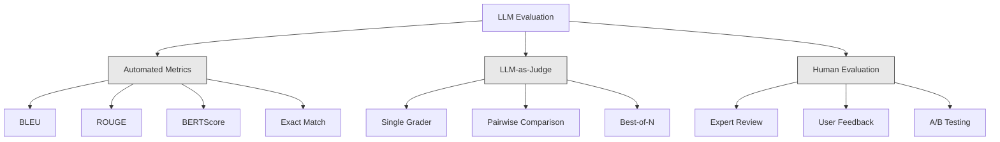

# 评估与测试大语言模型应用

> 你永远不会在没有测试的情况下部署Web应用。你永远不会没有回滚计划就发布数据库迁移。但现在，大多数团队通过阅读10个输出来发布大语言模型应用，然后说"嗯，看起来不错"。那不是评估，那是希望。希望不是一种工程实践。每次提示词更改、每次模型替换、每次温度调整都会改变你的输出分布，而这种变化是你通过阅读少量示例无法预测的。评估是连接你的应用和无声降级之间的唯一屏障。

**类型：** 构建
**语言：** Python
**先决条件：** 第11阶段第1课（提示工程）、第9课（函数调用）
**时间：** 约45分钟
**相关内容：** 第5阶段·27课（大语言模型评估 — RAGAS、DeepEval、G-Eval）涵盖框架级概念（基于NLI的忠实度、评估校准、RAG四个指标）。第5阶段·28课（长上下文评估）涵盖NIAH / RULER / LongBench / MRCR用于上下文长度回归。本课专注于大语言模型工程特有的内容：CI/CD集成、成本限制的评估运行、回归仪表板。

## 学习目标

- 构建一个评估数据集，包含针对你的大语言模型应用的输入-输出对、评分标准和边缘情况
- 使用大语言模型作为评估者、正则表达式匹配和确定性断言检查来实现自动评分
- 建立回归测试，当提示词、模型或参数变化时检测质量下降
- 设计评估指标，以捕捉对你的用例重要的方面（正确性、语气、格式合规性、延迟）

## 问题

你为客户支持构建了一个RAG聊天机器人。在你的演示中它工作得很好。你发布了它。两周后，有人更改了系统提示以减少幻觉。这个更改有效了——幻觉率下降了。但答案完整性也下降了34%，因为模型现在拒绝回答任何它不能100%确定的事情。

11天内没有人注意到。自助服务渠道的收入下降了。支持工单激增。

这就是通过感觉评估时的默认结果。你检查几个例子，它们看起来不错，你就合并了。但大语言模型输出是随机的。在5个测试用例上工作的提示可能在第6个上失败。在你的基准测试中得分为92%的模型，在你的用户实际遇到的边缘情况下可能只得到71%。

解决方案不是"更小心"。解决方案是自动化评估，它在每次更改时运行，根据评分标准对输出进行评分，计算置信区间，并在质量下降时阻止发布。

评估不是可有可无的。这是基本要求。没有评估就发布就像是盲目部署。

## 概念

### 评估分类

大语言模型评估有三个类别。每个都有其作用。单独任何一个都不够。

**自动指标**使用算法将输出文本与参考答案进行比较。BLEU测量n-gram重叠（最初用于机器翻译）。ROUGE测量参考n-gram的召回率（最初用于摘要）。BERTScore使用BERT嵌入来测量语义相似性。这些方法快速且便宜——你可以在几秒钟内对10,000个输出进行评分。但它们忽略了细微差别。两个答案可以没有单词重叠但都是正确的。一个答案可以有很高的ROUGE分数，但在上下文中完全错误。

**大语言模型作为评估者**使用强大的模型（GPT-5、Claude Opus 4.7、Gemini 3 Pro）根据评分标准对输出进行评分。这捕捉了字符串指标所遗漏的语义质量——相关性、正确性、有用性、安全性。它需要花钱（使用GPT-5-mini每1000次评估调用约8美元，使用Claude Opus 4.7约25美元），但在设计良好的评分标准上与人类判断的相关性为82-88%——有关校准方法请参见第5阶段·27课。

**人工评估**是黄金标准，但也是最慢和最昂贵的。保留它用于校准你的自动评估，而不是在每次提交时运行。

| 方法 | 速度 | 每1000次评估成本 | 与人类的相关性 | 最适用于 |
|--------|-------|-------------------|------------------------|----------|
| BLEU/ROUGE | <1秒 | $0 | 40-60% | 翻译、摘要基准 |
| BERTScore | ~30秒 | $0 | 55-70% | 语义相似性筛选 |
| 大语言模型作为评估者（GPT-5-mini） | ~3分钟 | ~$8 | 82-86% | 默认CI评估者；便宜、快速、已校准 |
| 大语言模型