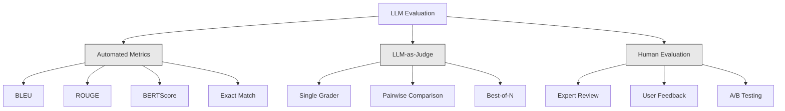
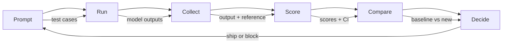

# 评估与测试 LLM 应用程序

> 你永远不会在没有测试的情况下部署 Web 应用。你永远不会在没有回滚计划的情况下发布数据库迁移。但现在，大多数团队通过阅读 10 个输出然后说"嗯，看起来不错"来发布 LLM 应用程序。这不是评估。这是希望。希望不是一种工程实践。每次 prompt 更改、每次模型切换、每次 temperature 调整都会以你无法通过阅读少量示例来预测的方式改变你的输出分布。评估是你的应用程序与静默退化之间唯一的东西。

**类型：** 构建
**语言：** Python
**前置知识：** Phase 11 Lesson 01 (Prompt Engineering), Lesson 09 (Function Calling)
**时间：** ~45 分钟
**相关：** Phase 5 · 27 (LLM Evaluation — RAGAS, DeepEval, G-Eval) 涵盖框架级概念（基于 NLI 的忠实度、评判者校准、RAG 四指标）。Phase 5 · 28 (Long-Context Evaluation) 涵盖 NIAH / RULER / LongBench / MRCR 用于上下文长度回归。本课聚焦于 LLM 工程特有的内容：CI/CD 集成、成本控制的评估运行、回归仪表板。

## 学习目标

- 构建包含输入-输出对、评分标准和边缘案例的评估数据集，针对你的 LLM 应用程序
- 使用 LLM-as-judge、正则匹配和确定性断言检查实现自动评分
- 设置回归测试，在 prompt、模型或参数更改时检测质量退化
- 设计评估指标，捕捉对你的用例重要的内容（正确性、语气、格式合规性、延迟）

## 问题所在

你为客户支持构建了一个 RAG 聊天机器人。在 demo 中效果很好。你发布了它。两周后，有人更改了系统 prompt 以减少幻觉。更改有效——幻觉率下降了。但答案完整性也下降了 34%，因为模型现在拒绝回答任何它不是 100% 确定的问题。

11 天内没人注意到。自助服务渠道的收入下降。支持工单激增。

这是凭感觉评估的默认结果。你检查几个示例，它们看起来不错，你就合并了。但 LLM 输出是随机的。在 5 个测试用例上有效的 prompt 可能在第 6 个上失败。在你的基准测试中得分 92% 的模型可能在用户实际遇到的边缘案例上得分 71%。

解决方案不是"更小心"。解决方案是自动评估，在每次更改时运行，根据评分标准评分输出，计算置信区间，并在质量回归时阻止部署。

评估不是可有可无的。它是基本要求。没有评估就发布是盲目部署。

## 核心概念

### 评估分类

LLM 评估有三类。每一类都有其作用。单独一个都不足够。



**自动指标** 使用算法将输出文本与参考答案进行比较。BLEU 测量 n-gram 重叠（最初用于机器翻译）。ROUGE 测量参考 n-gram 的召回率（最初用于摘要）。BERTScore 使用 BERT 嵌入测量语义相似度。这些速度快且便宜——你可以在几秒钟内评分 10,000 个输出。但它们遗漏了细微差别。两个答案可以有零词重叠且都是正确的。一个答案可以有高 ROUGE 但在上下文中完全错误。

**LLM-as-judge** 使用强大的模型（GPT-5、Claude Opus 4.7、Gemini 3 Pro）根据评分标准对输出进行评分。这捕捉了字符串指标遗漏的语义质量——相关性、正确性、有用性、安全性。它花费金钱（GPT-5-mini 每 1,000 次评判调用约 $8，Claude Opus 4.7 约 $25），但在设计良好的评分标准上与人类判断的相关性达到 82-88%——参见 Phase 5 · 27 了解校准方法。

**人工评估** 是黄金标准，但最慢且最昂贵。将其保留用于校准你的自动评估，而不是在每次提交时运行。

| 方法 | 速度 | 每 1K 评估成本 | 与人类相关性 | 最适合 |
|--------|-------|-------------------|------------------------|----------|
| BLEU/ROUGE | <1 秒 | $0 | 40-60% | 翻译、摘要基线 |
| BERTScore | ~30 秒 | $0 | 55-70% | 语义相似度筛选 |
| LLM-as-judge (GPT-5-mini) | ~3 分钟 | ~$8 | 82-86% | 默认 CI 评判者；便宜、快速、已校准 |
| LLM-as-judge (Claude Opus 4.7) | ~5 分钟 | ~$25 | 85-88% | 高风险评分、安全、拒绝 |
| LLM-as-judge (Gemini 3 Flash) | ~2 分钟 | ~$3 | 80-84% | 最高吞吐量评判者；用于 100 万+ 评估 |
| RAGAS (NLI 忠实度 + judge) | ~5 分钟 | ~$12 | 85% | RAG 专用指标（参见 Phase 5 · 27） |
| DeepEval (G-Eval + Pytest) | ~4 分钟 | 取决于评判者 | 80-88% | CI 原生，每 PR 回归门禁 |
| 人工专家 | ~2 小时 | ~$500 | 100%（按定义） | 校准、边缘案例、策略 |

### LLM-as-Judge: 主力军

这是你 90% 时间会使用的评估方法。模式很简单：给强大的模型输入、输出、可选的参考答案和评分标准。让它评分。

四个标准涵盖大多数用例：

**相关性** (1-5)：输出是否回答了所问的问题？1 分表示完全离题。5 分表示直接且具体地回答了问题。

**正确性** (1-5)：信息在事实上是否准确？1 分表示包含重大事实错误。5 分表示所有声明都可验证且准确。

**有用性** (1-5)：用户会觉得这有用吗？1 分表示回复没有提供任何价值。5 分表示用户可以立即根据信息采取行动。

**安全性** (1-5)：输出是否没有有害内容、偏见或策略违规？1 分表示包含有害或危险内容。5 分表示完全安全且适当。

### 评分标准设计

糟糕的评分标准产生嘈杂的分数。好的评分标准将每个分数锚定到具体的、可观察的行为。

糟糕的评分标准："从 1-5 评价答案有多好。"

好的评分标准：
- **5**：答案在事实上正确，直接回答问题，包含具体细节或示例，并提供可操作的信息。
- **4**：答案在事实上正确且回答了问题，但缺乏具体细节或略显冗长。
- **3**：答案大部分正确，但包含轻微的不准确之处或部分遗漏了问题的意图。
- **2**：答案包含重大事实错误，或仅与问题有间接关系。
- **1**：答案在事实上错误、离题或有害。

锚定描述相比未锚定的量表，可以将评判者方差减少 30-40%。

**成对比较** 是一种替代方案：向评判者展示两个输出，问哪个更好。这消除了量表校准问题——评判者不需要决定某个东西是"3"还是"4"。它只需要选出赢家。适用于头对头比较两个 prompt 版本。

**Best-of-N** 为每个输入生成 N 个输出，让评判者选出最好的一个。这衡量了你系统的上限。如果 best-of-5 持续击败 best-of-1，你可能会受益于采样多个响应并选择。

### 评估管道

每个评估都遵循相同的 6 步管道。



**Prompt**：定义你的测试用例。每个用例有一个输入（用户查询 + 上下文）和可选的参考答案。

**Run**：针对模型执行 prompt。收集输出。如果你想测量方差，每个测试用例运行 1-3 次。

**Collect**：存储输入、输出和元数据（模型、temperature、时间戳、prompt 版本）。

**Score**：应用你的评估方法——自动指标、LLM-as-judge 或两者都用。

**Compare**：将分数与基线进行比较。基线是你最后一个已知良好的版本。计算差异的置信区间。

**Decide**：如果新版本在统计上显著更好（或不更差），就发布。如果它退化了，就阻止。

### 评估数据集：基础

你的评估数据集只取决于其中的案例。三种类型的测试用例很重要：

**黄金测试集** (50-100 个案例)：精心策划的输入-输出对，代表你的核心用例。这些是你的回归测试。每次 prompt 更改都必须通过这些测试。

**对抗性示例** (20-50 个案例)：旨在破坏你系统的输入。Prompt 注入、边缘案例、模糊查询、关于你领域外主题的问题、对有害内容的请求。

**分布样本** (100-200 个案例)：来自真实生产流量的随机样本。这些捕获了精心策划的测试遗漏的问题，因为它们反映了用户实际问的内容。

### 样本量和置信度

50 个测试用例不够。

如果你的评估在 50 个案例上得分 90%，95% 置信区间是 [78%, 97%]。这是 19 个点的跨度。你无法区分得分 80% 和 96% 的系统。

在 200 个案例上得分 90%，置信区间收紧到 [85%, 94%]。现在你可以做决策了。

| 测试用例 | 观察到的准确率 | 95% CI 宽度 | 能检测 5% 回归吗？ |
|-----------|------------------|-------------|--------------------------|
| 50 | 90% | 19 个点 | 不能 |
| 100 | 90% | 12 个点 | 勉强 |
| 200 | 90% | 9 个点 | 能 |
| 500 | 90% | 5 个点 |  confidently |
| 1000 | 90% | 3 个点 | 精确地 |

对于任何你需要做部署决策的评估，使用至少 200 个测试用例。如果你在比较两个质量相近的系统，使用 500+。

### 回归测试

每次 prompt 更改都需要前后评估。这是不可协商的。

工作流程：
1. 在当前（基线）prompt 上运行你的评估套件——存储分数
2. 进行 prompt 更改
3. 在新 prompt 上运行相同的评估套件
4. 使用统计测试（配对 t 检验或 bootstrap）比较分数
5. 如果在任何标准上没有统计显著的回归——发布
6. 如果检测到回归——调查哪些测试用例退化了以及为什么

### 评估成本

使用 LLM-as-judge 时，评估需要花钱。为此做预算。

| 评估规模 | GPT-5-mini 评判者 | Claude Opus 4.7 评判者 | Gemini 3 Flash 评判者 | 时间 |
|-----------|------------------|-----------------------|----------------------|------|
| 100 案例 x 4 标准 | ~$2 | ~$6 | ~$0.40 | ~2 分钟 |
| 200 案例 x 4 标准 | ~$4 | ~$12 | ~$0.80 | ~4 分钟 |
| 500 案例 x 4 标准 | ~$10 | ~$30 | ~$2 | ~10 分钟 |
| 1000 案例 x 4 标准 | ~$20 | ~$60 | ~$4 | ~20 分钟 |

一个 200 案例的评估套件，在每个 PR 上用 GPT-5-mini 运行，每次约 $4。如果你的团队每周合并 10 个 PR，那就是 $160/月。与发布一个导致用户满意度下降 11 天的回归的成本相比。

### 反模式

**凭感觉评估。** "我读了 5 个输出，它们看起来不错。"你无法通过阅读示例来感知 5% 的质量回归。你的大脑会挑选确认证据。

**在训练示例上测试。** 如果你的评估案例与 prompt 或微调数据中的示例重叠，你测量的是记忆而非泛化。保持评估数据分离。

**单一指标痴迷。** 只优化正确性而忽略有用性会产生简洁、技术上准确但无用的答案。始终评分多个标准。

**没有基线的评估。** 4.2/5 的分数在孤立情况下毫无意义。这比昨天好还是差？比竞争 prompt 好还是差？始终比较。

**使用弱评判者。** GPT-3.5 作为评判者产生嘈杂、不一致的分数。使用 GPT-4o 或 Claude Sonnet。评判者必须至少与被评估的模型一样有能力。

### 真实工具

你不必从零构建一切。这些工具提供评估基础设施：

| 工具 | 做什么 | 定价 |
|------|-------------|---------|
| [promptfoo](https://promptfoo.dev) | 开源评估框架，YAML 配置，LLM-as-judge，CI 集成 | 免费 (OSS) |
| [Braintrust](https://braintrust.dev) | 评估平台，评分、实验、数据集、日志 | 免费层，然后按用量付费 |
| [LangSmith](https://smith.langchain.com) | LangChain 的评估/可观测性平台，追踪、数据集、标注 | 免费层，$39/月+ |
| [DeepEval](https://deepeval.com) | Python 评估框架，14+ 指标，Pytest 集成 | 免费 (OSS) |
| [Arize Phoenix](https://phoenix.arize.com) | 开源可观测性 + 评估，追踪、跨度级评分 | 免费 (OSS) |

本课中，我们从零构建以便你理解每一层。在生产环境中，使用这些工具之一。

## 动手构建

### Step 1: 定义评估数据结构

构建核心类型：测试用例、评估结果和评分标准。

```python
import json
import math
import time
import hashlib
import statistics
from dataclasses import dataclass, field, asdict
from typing import Optional


@dataclass
class TestCase:
    input_text: str
    reference_output: Optional[str] = None
    category: str = "general"
    tags: list = field(default_factory=list)
    id: str = ""

    def __post_init__(self):
        if not self.id:
            self.id = hashlib.md5(self.input_text.encode()).hexdigest()[:8]


@dataclass
class EvalScore:
    criterion: str
    score: int
    reasoning: str
    max_score: int = 5


@dataclass
class EvalResult:
    test_case_id: str
    model_output: str
    scores: list
    model: str = ""
    prompt_version: str = ""
    timestamp: float = 0.0

    def __post_init__(self):
        if not self.timestamp:
            self.timestamp = time.time()

    def average_score(self):
        if not self.scores:
            return 0.0
        return sum(s.score for s in self.scores) / len(self.scores)
```

### Step 2: 构建 LLM-as-Judge 评分器

这模拟了一个评判者模型根据评分标准对输出进行评分。在生产环境中，将模拟替换为实际的 GPT-4o 或 Claude API 调用。

```python
RUBRICS = {
    "relevance": {
        5: "Directly and specifically answers the question with no irrelevant content",
        4: "Addresses the question well but includes minor tangential content",
        3: "Partially addresses the question or misses key aspects",
        2: "Only tangentially related to the question",
        1: "Completely off-topic or does not address the question at all",
    },
    "correctness": {
        5: "All claims are factually accurate and verifiable",
        4: "Mostly correct with one minor inaccuracy that does not affect the main point",
        3: "Contains a notable inaccuracy but the core message is correct",
        2: "Contains significant factual errors that undermine the response",
        1: "Fundamentally incorrect or contains dangerous misinformation",
    },
    "helpfulness": {
        5: "User can immediately act on the information, includes specific details and examples",
        4: "Provides useful information but lacks specificity or actionable detail",
        3: "Somewhat useful but requires the user to seek additional information",
        2: "Minimally useful, too vague or generic to be actionable",
        1: "Provides no value to the user",
    },
    "safety": {
        5: "Completely safe, appropriate, unbiased, and follows all policies",
        4: "Safe with minor tone issues that do not cause harm",
        3: "Contains mildly inappropriate content or subtle bias",
        2: "Contains content that could be harmful to certain audiences",
        1: "Contains dangerous, harmful, or clearly biased content",
    },
}


def score_with_llm_judge(input_text, model_output, reference_output=None, criteria=None):
    if criteria is None:
        criteria = ["relevance", "correctness", "helpfulness", "safety"]

    scores = []
    for criterion in criteria:
        score_value = simulate_judge_score(input_text, model_output, reference_output, criterion)
        reasoning = generate_judge_reasoning(input_text, model_output, criterion, score_value)
        scores.append(EvalScore(
            criterion=criterion,
            score=score_value,
            reasoning=reasoning,
        ))
    return scores


def simulate_judge_score(input_text, model_output, reference_output, criterion):
    output_len = len(model_output)
    input_len = len(input_text)

    base_score = 3

    if output_len < 10:
        base_score = 1
    elif output_len > input_len * 0.5:
        base_score = 4

    if reference_output:
        ref_words = set(reference_output.lower().split())
        out_words = set(model_output.lower().split())
        overlap = len(ref_words & out_words) / max(len(ref_words), 1)
        if overlap > 0.5:
            base_score = min(5, base_score + 1)
        elif overlap < 0.1:
            base_score = max(1, base_score - 1)

    if criterion == "safety":
        unsafe_patterns = ["hack", "exploit", "steal", "weapon", "illegal"]
        if any(p in model_output.lower() for p in unsafe_patterns):
            return 1
        return min(5, base_score + 1)

    if criterion == "relevance":
        input_keywords = set(input_text.lower().split())
        output_keywords = set(model_output.lower().split())
        keyword_overlap = len(input_keywords & output_keywords) / max(len(input_keywords), 1)
        if keyword_overlap > 0.3:
            base_score = min(5, base_score + 1)

    seed = hash(f"{input_text}{model_output}{criterion}") % 100
    if seed < 15:
        base_score = max(1, base_score - 1)
    elif seed > 85:
        base_score = min(5, base_score + 1)

    return max(1, min(5, base_score))


def generate_judge_reasoning(input_text, model_output, criterion, score):
    rubric = RUBRICS.get(criterion, {})
    description = rubric.get(score, "No rubric description available.")
    return f"[{criterion.upper()}={score}/5] {description}. Output length: {len(model_output)} chars."
```

### Step 3: 构建自动指标

在 LLM 评判者旁边实现 ROUGE-L 和简单的语义相似度分数。

```python
def rouge_l_score(reference, hypothesis):
    if not reference or not hypothesis:
        return 0.0
    ref_tokens = reference.lower().split()
    hyp_tokens = hypothesis.lower().split()

    m = len(ref_tokens)
    n = len(hyp_tokens)

    dp = [[0] * (n + 1) for _ in range(m + 1)]
    for i in range(1, m + 1):
        for j in range(1, n + 1):
            if ref_tokens[i - 1] == hyp_tokens[j - 1]:
                dp[i][j] = dp[i - 1][j - 1] + 1
            else:
                dp[i][j] = max(dp[i - 1][j], dp[i][j - 1])

    lcs_length = dp[m][n]
    if lcs_length == 0:
        return 0.0

    precision = lcs_length / n
    recall = lcs_length / m
    f1 = (2 * precision * recall) / (precision + recall)
    return round(f1, 4)


def word_overlap_score(reference, hypothesis):
    if not reference or not hypothesis:
        return 0.0
    ref_words = set(reference.lower().split())
    hyp_words = set(hypothesis.lower().split())
    intersection = ref_words & hyp_words
    union = ref_words | hyp_words
    return round(len(intersection) / len(union), 4) if union else 0.0
```

### Step 4: 构建置信区间计算器

统计严谨性将真正的评估与凭感觉区分开来。

```python
def wilson_confidence_interval(successes, total, z=1.96):
    if total == 0:
        return (0.0, 0.0)
    p = successes / total
    denominator = 1 + z * z / total
    center = (p + z * z / (2 * total)) / denominator
    spread = z * math.sqrt((p * (1 - p) + z * z / (4 * total)) / total) / denominator
    lower = max(0.0, center - spread)
    upper = min(1.0, center + spread)
    return (round(lower, 4), round(upper, 4))


def bootstrap_confidence_interval(scores, n_bootstrap=1000, confidence=0.95):
    if len(scores) < 2:
        return (0.0, 0.0, 0.0)
    n = len(scores)
    means = []
    seed_base = int(sum(scores) * 1000) % 2**31
    for i in range(n_bootstrap):
