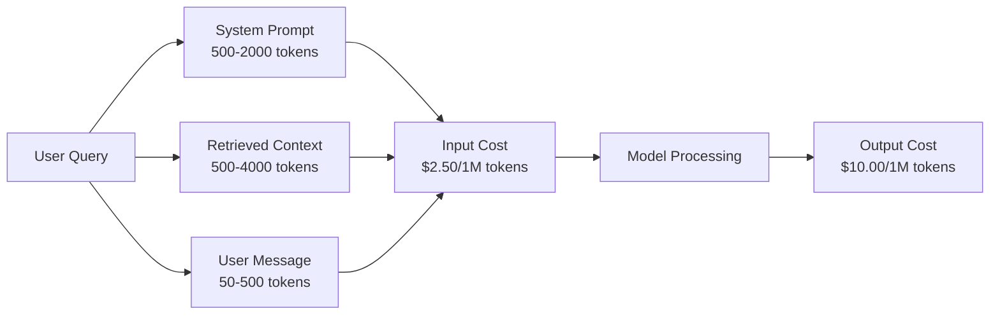
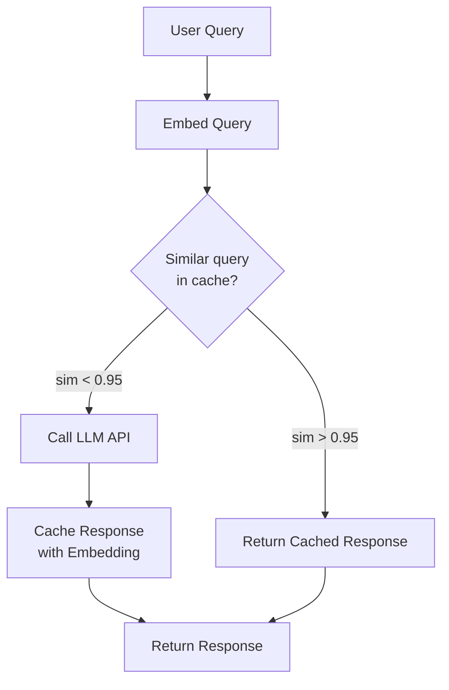
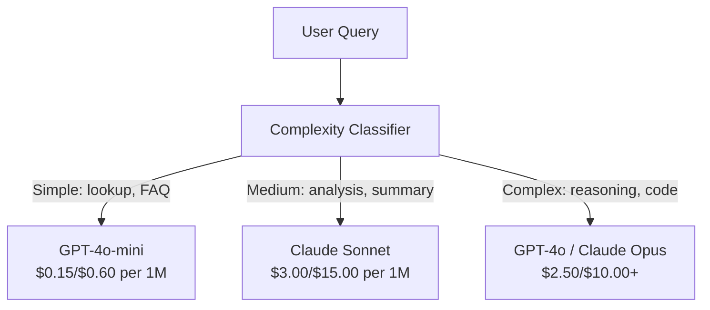

# Caching、Rate Limiting、Cost Optimization

> 多くの AI startups は bad models で死ぬのではありません。bad unit economics で死にます。1 回の GPT-4o call は 1 cent 未満に見えます。1 万 users が 1 日 10 calls すると、1 ドルも課金する前に input tokens だけで $250 かかります。生き残る companies は、すべての API call を function call ではなく financial transaction として扱う companies です。

**種別:** 構築
**言語:** Python
**前提:** Phase 11 Lesson 09 (Function Calling)
**時間:** 約 45 分
**関連:** Phase 11 · 15 (Prompt Caching) — この lesson は application-layer caching (semantic cache、exact hash cache、model routing) を扱います。Lesson 15 は provider-layer prompt caching (Anthropic cache_control、OpenAI automatic、Gemini CachedContent) を扱います。両方を組み合わせると 50-95% の cost reduction が可能です。

## 学習目標

- repeated または similar queries を new API call ではなく cache から serve する semantic caching を実装する
- providers across で per-request costs を計算し、token-aware rate limiting と budget alerts を実装する
- prompt compression、model routing (expensive vs cheap)、response caching を持つ cost optimization layer を構築する
- query type ごとに exact match、semantic similarity、prefix caching を使う tiered caching strategy を設計する

## 問題

RAG chatbot を作ったとします。美しく動きます。users も気に入ります。

そして invoice が届きます。

GPT-5 は 1M input tokens あたり $5、1M output tokens あたり $15 です。Claude Opus 4.7 は input $15 / output $75。Gemini 3 Pro は input $1.25 / output $5。GPT-5-mini は $0.25/$2。以下の prices は illustrative です。必ず provider の current pricing page を確認してください。

startups を殺す計算はこうです。

- 10,000 daily active users
- 10 queries per user per day
- 1,000 input tokens per query (system prompt + context + user message)
- 500 output tokens per response

**Daily input cost:** 10,000 x 10 x 1,000 / 1,000,000 x $2.50 = **$250/day**
**Daily output cost:** 10,000 x 10 x 500 / 1,000,000 x $10.00 = **$500/day**
**Monthly total:** **$22,500/month**

これは LLM だけです。embeddings、vector database hosting、infrastructure を加えると、chatbot に月 $30,000 かかる計算になります。

厳しいのは、その queries の 40-60% が near-duplicates であることです。users は同じ質問を少し違う言葉で聞きます。system prompt は every request で identical なのに毎回 bill されます。同じ topic を聞く users across で、RAG が retrieve する context documents も繰り返されます。

あなたは redundant computation に full price を払っています。

## コンセプト

### LLM Call の Cost Anatomy

すべての API call には 5 つの cost components があります。



system prompts は silent killer です。1,500-token system prompt を every request で送ると、その prefix だけで 1M requests あたり $3.75 かかります。1 日 100K requests なら $375/day、つまり $11,250/month です。しかもその text は変わりません。

### Provider Caching: Built-in Discounts

2026 年時点で主要 3 providers は provider-side prompt caching を提供していますが、mechanics は異なります。deep dive は Phase 11 · 15 を参照してください。

| Provider | Mechanism | Discount | Minimum | Cache Duration |
|----------|-----------|----------|---------|----------------|
| Anthropic | Explicit cache_control markers | 90% on cache hits (pay 25% extra on write) | 1,024 tokens (Sonnet/Opus), 2,048 (Haiku) | 5 min default; 1h extended (2x write premium) |
| OpenAI | Automatic prefix matching | 50% on cache hits | 1,024 tokens | Best-effort up to 1 hour |
| Google Gemini | Explicit CachedContent API | ~75% reduction (plus storage) | 4,096 (Flash) / 32,768 (Pro) | User-configurable TTL |

**Anthropic の approach** は explicit です。prompt の sections に `cache_control: {"type": "ephemeral"}` を mark します。最初の request は 25% write premium を払います。同じ prefix の subsequent requests は 90% discount になります。通常 $0.005 かかる 2,000-token system prompt は cache hit では $0.000625 になります。100K requests では $437.50/day の節約です。

**OpenAI の approach** は automatic です。previous request と match する prompt prefix は 50% discount になります。markers は不要です。tradeoff は discount が小さく control も少ない一方、implementation effort が zero であることです。

### Semantic Caching: Custom Layer

provider caching は identical prefixes にしか効きません。semantic caching はより難しい case、つまり意味は同じだが異なる queries を扱います。

"What is the return policy?" と "How do I return an item?" は異なる strings ですが intent は identical です。semantic cache は両方の queries を embed し、cosine similarity を計算し、similarity が threshold (通常 0.92-0.95) を超えたら cached response を返します。



embedding costs は negligible です。OpenAI の text-embedding-3-small は 1M tokens あたり $0.02 です。cache check は full LLM call と比べるとほぼ無料です。

### Exact Caching: Hash and Match

deterministic calls (temperature=0、same model、same prompt) では、exact caching の方が simple で fast です。full prompt を hash し、cache を check し、見つかれば返します。

これは次に非常によく効きます。
- system prompt + fixed context + identical user queries
- identical tool definitions を使う function calling
- same document が multiple times 処理される batch processing

### Rate Limiting: Budget を守る

rate limiting は fairness だけの話ではありません。survival の話です。

**Token bucket algorithm:** 各 user は N tokens の bucket を持ち、毎秒 rate R で refill されます。request は bucket から tokens を消費します。bucket が空なら request は reject されます。これにより burst (bucket 全量を一度に使う) を許しつつ average rate を enforce できます。

**Per-user quotas:** user tier ごとに daily/monthly token limits を設定します。

| Tier | Daily Token Limit | Max Requests/min | Model Access |
|------|------------------|------------------|-------------|
| Free | 50,000 | 10 | GPT-4o-mini only |
| Pro | 500,000 | 60 | GPT-4o, Claude Sonnet |
| Enterprise | 5,000,000 | 300 | All models |

### Model Routing: Right Model for the Right Job

すべての query に GPT-4o が必要なわけではありません。

"What time does the store close?" に $10/M-output model は不要です。$0.60/M output の GPT-4o-mini で十分です。$1.25/M output の Claude Haiku でも十分です。simple classifier が cheap queries を cheap models へ、complex queries を expensive models へ route します。



よく tuned された router は model costs だけで 40-70% 節約します。

### Cost Tracking: お金の流れを知る

測っていないものは optimize できません。すべての API call を次の項目で log します。

- Timestamp
- Model name
- Input tokens
- Output tokens
- Latency (ms)
- Computed cost ($)
- User ID
- Cache hit/miss
- Request category

この data は、どの features が expensive か、どの users が heavy consumers か、どこで caching が最も効くかを明らかにします。

### Batching: Bulk Discounts

OpenAI の Batch API は requests を asynchronous に処理し、50% discount を提供します。最大 50,000 requests の batch を submit し、results は 24 時間以内に返ります。

batching を使う用途:
- nightly document processing
- bulk classification
- evaluation runs
- data enrichment pipelines

向かない用途: real-time user-facing queries (latency が重要)。

### Budget Alerts と Circuit Breakers

circuit breaker は limit に達したときに spending を止めます。これがないと bug や abuse によって monthly budget が数時間で燃え尽きます。

3 つの thresholds を設定します。
1. **Warning** (budget の 70%): alert を送る
2. **Throttle** (budget の 85%): cheaper models のみに切り替える
3. **Stop** (budget の 95%): new requests を reject し、cached responses のみ返す

### Optimization Stack

これらの techniques を順番に適用します。各 layer は前の layer に積み上がります。

| Layer | Technique | Typical Savings | Implementation Effort |
|-------|-----------|----------------|----------------------|
| 1 | Provider prompt caching | 30-50% | Low (add cache markers) |
| 2 | Exact caching | 10-20% | Low (hash + dict) |
| 3 | Semantic caching | 15-30% | Medium (embeddings + similarity) |
| 4 | Model routing | 40-70% | Medium (classifier) |
| 5 | Rate limiting | Budget protection | Low (token bucket) |
| 6 | Prompt compression | 10-30% | Medium (rewrite prompts) |
| 7 | Batching | 50% on eligible | Low (batch API) |

layers 1-5 を適用した RAG app は、通常 costs を $22,500/month から $4,000-6,000/month に減らせます。これは runway を燃やすか、business を作るかの差です。

### Real Savings: Before and After

10,000 DAU を serve する RAG chatbot の実例 breakdown です。

| Metric | Before Optimization | After Optimization | Savings |
|--------|--------------------|--------------------|---------|
| Monthly LLM cost | $22,500 | $5,200 | 77% |
| Avg cost per query | $0.0075 | $0.0017 | 77% |
| Cache hit rate | 0% | 52% | -- |
| Queries routed to mini | 0% | 65% | -- |
| P95 latency | 2,800ms | 900ms (cache hits: 50ms) | 68% |
| Monthly embedding cost | $0 | $180 | (new cost) |
| Total monthly cost | $22,500 | $5,380 | 76% |

semantic caching の embedding cost ($180/month) は、cache hits の最初の 1 時間で元が取れます。

## 実装

### Step 1: Cost Calculator

major models の current pricing を知っている token cost calculator を作ります。

```python
import hashlib
import time
import json
import math
from dataclasses import dataclass, field


MODEL_PRICING = {
    "gpt-4o": {"input": 2.50, "output": 10.00, "cached_input": 1.25},
    "gpt-4o-mini": {"input": 0.15, "output": 0.60, "cached_input": 0.075},
    "gpt-4.1": {"input": 2.00, "output": 8.00, "cached_input": 0.50},
    "gpt-4.1-mini": {"input": 0.40, "output": 1.60, "cached_input": 0.10},
    "gpt-4.1-nano": {"input": 0.10, "output": 0.40, "cached_input": 0.025},
    "o3": {"input": 2.00, "output": 8.00, "cached_input": 0.50},
    "o3-mini": {"input": 1.10, "output": 4.40, "cached_input": 0.55},
    "o4-mini": {"input": 1.10, "output": 4.40, "cached_input": 0.275},
    "claude-opus-4": {"input": 15.00, "output": 75.00, "cached_input": 1.50},
    "claude-sonnet-4": {"input": 3.00, "output": 15.00, "cached_input": 0.30},
    "claude-haiku-3.5": {"input": 0.80, "output": 4.00, "cached_input": 0.08},
    "gemini-2.5-pro": {"input": 1.25, "output": 10.00, "cached_input": 0.3125},
    "gemini-2.5-flash": {"input": 0.15, "output": 0.60, "cached_input": 0.0375},
}


def calculate_cost(model, input_tokens, output_tokens, cached_input_tokens=0):
    if model not in MODEL_PRICING:
        return {"error": f"Unknown model: {model}"}
    pricing = MODEL_PRICING[model]
    non_cached = input_tokens - cached_input_tokens
    input_cost = (non_cached / 1_000_000) * pricing["input"]
    cached_cost = (cached_input_tokens / 1_000_000) * pricing["cached_input"]
    output_cost = (output_tokens / 1_000_000) * pricing["output"]
    total = input_cost + cached_cost + output_cost
    return {
        "model": model,
        "input_tokens": input_tokens,
        "output_tokens": output_tokens,
        "cached_input_tokens": cached_input_tokens,
        "input_cost": round(input_cost, 6),
        "cached_input_cost": round(cached_cost, 6),
        "output_cost": round(output_cost, 6),
        "total_cost": round(total, 6),
    }
```

### Step 2: Exact Cache

full prompt を hash し、identical requests には cached responses を返します。

```python
class ExactCache:
    def __init__(self, max_size=1000, ttl_seconds=3600):
        self.cache = {}
        self.max_size = max_size
        self.ttl = ttl_seconds
        self.hits = 0
        self.misses = 0

    def _hash(self, model, messages, temperature):
        key_data = json.dumps({"model": model, "messages": messages, "temperature": temperature}, sort_keys=True)
        return hashlib.sha256(key_data.encode()).hexdigest()

    def get(self, model, messages, temperature=0.0):
        if temperature > 0:
            self.misses += 1
            return None
        key = self._hash(model, messages, temperature)
        if key in self.cache:
            entry = self.cache[key]
            if time.time() - entry["timestamp"] < self.ttl:
                self.hits += 1
                entry["access_count"] += 1
                return entry["response"]
            del self.cache[key]
        self.misses += 1
        return None

    def put(self, model, messages, temperature, response):
        if temperature > 0:
            return
        if len(self.cache) >= self.max_size:
            oldest_key = min(self.cache, key=lambda k: self.cache[k]["timestamp"])
            del self.cache[oldest_key]
        key = self._hash(model, messages, temperature)
        self.cache[key] = {
            "response": response,
            "timestamp": time.time(),
            "access_count": 1,
        }

    def stats(self):
        total = self.hits + self.misses
        return {
            "hits": self.hits,
            "misses": self.misses,
            "hit_rate": round(self.hits / total, 4) if total > 0 else 0,
            "cache_size": len(self.cache),
        }
```

### Step 3: Semantic Cache

queries を embed し、similarity が threshold を超えたら cached responses を返します。

```python
def simple_embed(text):
    words = text.lower().split()
    vocab = {}
    for w in words:
        vocab[w] = vocab.get(w, 0) + 1
    norm = math.sqrt(sum(v * v for v in vocab.values()))
    if norm == 0:
        return {}
    return {k: v / norm for k, v in vocab.items()}


def cosine_similarity(a, b):
    if not a or not b:
        return 0.0
    all_keys = set(a) | set(b)
    dot = sum(a.get(k, 0) * b.get(k, 0) for k in all_keys)
    return dot


class SemanticCache:
    def __init__(self, similarity_threshold=0.85, max_size=500, ttl_seconds=3600):
        self.entries = []
        self.threshold = similarity_threshold
        self.max_size = max_size
        self.ttl = ttl_seconds
        self.hits = 0
        self.misses = 0

    def get(self, query):
        query_embedding = simple_embed(query)
        now = time.time()
        best_match = None
        best_sim = 0.0
        for entry in self.entries:
            if now - entry["timestamp"] > self.ttl:
                continue
            sim = cosine_similarity(query_embedding, entry["embedding"])
            if sim > best_sim:
                best_sim = sim
                best_match = entry
        if best_match and best_sim >= self.threshold:
            self.hits += 1
            best_match["access_count"] += 1
            return {"response": best_match["response"], "similarity": round(best_sim, 4), "original_query": best_match["query"]}
        self.misses += 1
        return None

    def put(self, query, response):
        if len(self.entries) >= self.max_size:
            self.entries.sort(key=lambda e: e["timestamp"])
            self.entries.pop(0)
        self.entries.append({
            "query": query,
            "embedding": simple_embed(query),
            "response": response,
            "timestamp": time.time(),
            "access_count": 1,
        })

    def stats(self):
        total = self.hits + self.misses
        return {
            "hits": self.hits,
            "misses": self.misses,
            "hit_rate": round(self.hits / total, 4) if total > 0 else 0,
            "cache_size": len(self.entries),
        }
```

### Step 4: Rate Limiter

per-user quotas を持つ token bucket rate limiter です。

```python
class TokenBucketRateLimiter:
    def __init__(self):
        self.buckets = {}
        self.tiers = {
            "free": {"capacity": 50_000, "refill_rate": 500, "max_requests_per_min": 10},
            "pro": {"capacity": 500_000, "refill_rate": 5_000, "max_requests_per_min": 60},
            "enterprise": {"capacity": 5_000_000, "refill_rate": 50_000, "max_requests_per_min": 300},
        }

    def _get_bucket(self, user_id, tier="free"):
        if user_id not in self.buckets:
            tier_config = self.tiers.get(tier, self.tiers["free"])
            self.buckets[user_id] = {
                "tokens": tier_config["capacity"],
                "capacity": tier_config["capacity"],
                "refill_rate": tier_config["refill_rate"],
                "last_refill": time.time(),
                "request_timestamps": [],
                "max_rpm": tier_config["max_requests_per_min"],
                "tier": tier,
                "total_tokens_used": 0,
            }
        return self.buckets[user_id]

    def _refill(self, bucket):
        now = time.time()
        elapsed = now - bucket["last_refill"]
        refill = int(elapsed * bucket["refill_rate"])
        if refill > 0:
            bucket["tokens"] = min(bucket["capacity"], bucket["tokens"] + refill)
            bucket["last_refill"] = now

    def check(self, user_id, tokens_needed, tier="free"):
        bucket = self._get_bucket(user_id, tier)
        self._refill(bucket)
        now = time.time()
        bucket["request_timestamps"] = [t for t in bucket["request_timestamps"] if now - t < 60]
        if len(bucket["request_timestamps"]) >= bucket["max_rpm"]:
            return {"allowed": False, "reason": "rate_limit", "retry_after_seconds": 60 - (now - bucket["request_timestamps"][0])}
        if bucket["tokens"] < tokens_needed:
            deficit = tokens_needed - bucket["tokens"]
            wait = deficit / bucket["refill_rate"]
            return {"allowed": False, "reason": "token_limit", "tokens_available": bucket["tokens"], "retry_after_seconds": round(wait, 1)}
        return {"allowed": True, "tokens_available": bucket["tokens"]}

    def consume(self, user_id, tokens_used, tier="free"):
        bucket = self._get_bucket(user_id, tier)
        bucket["tokens"] -= tokens_used
        bucket["request_timestamps"].append(time.time())
        bucket["total_tokens_used"] += tokens_used

    def get_usage(self, user_id):
        if user_id not in self.buckets:
            return {"error": "User not found"}
        b = self.buckets[user_id]
        return {
            "user_id": user_id,
            "tier": b["tier"],
            "tokens_remaining": b["tokens"],
            "capacity": b["capacity"],
            "total_tokens_used": b["total_tokens_used"],
            "utilization": round(b["total_tokens_used"] / b["capacity"], 4) if b["capacity"] else 0,
        }
```

### Step 5: Cost Tracker

すべての call を log し、running totals を計算します。

```python
class CostTracker:
    def __init__(self, monthly_budget=1000.0):
        self.logs = []
        self.monthly_budget = monthly_budget
        self.alerts = []

    def log_call(self, model, input_tokens, output_tokens, cached_input_tokens=0, latency_ms=0, user_id="anonymous", cache_status="miss"):
        cost = calculate_cost(model, input_tokens, output_tokens, cached_input_tokens)
        entry = {
            "timestamp": time.time(),
            "model": model,
            "input_tokens": input_tokens,
            "output_tokens": output_tokens,
            "cached_input_tokens": cached_input_tokens,
            "latency_ms": latency_ms,
            "cost": cost["total_cost"],
            "user_id": user_id,
            "cache_status": cache_status,
        }
        self.logs.append(entry)
        self._check_budget()
        return entry

    def _check_budget(self):
        total = self.total_cost()
        pct = total / self.monthly_budget if self.monthly_budget > 0 else 0
        if pct >= 0.95 and not any(a["level"] == "stop" for a in self.alerts):
            self.alerts.append({"level": "stop", "message": f"Budget 95% consumed: ${total:.2f}/${self.monthly_budget:.2f}", "timestamp": time.time()})
        elif pct >= 0.85 and not any(a["level"] == "throttle" for a in self.alerts):
            self.alerts.append({"level": "throttle", "message": f"Budget 85% consumed: ${total:.2f}/${self.monthly_budget:.2f}", "timestamp": time.time()})
        elif pct >= 0.70 and not any(a["level"] == "warning" for a in self.alerts):
            self.alerts.append({"level": "warning", "message": f"Budget 70% consumed: ${total:.2f}/${self.monthly_budget:.2f}", "timestamp": time.time()})

    def total_cost(self):
        return round(sum(e["cost"] for e in self.logs), 6)

    def cost_by_model(self):
        by_model = {}
        for e in self.logs:
            m = e["model"]
            if m not in by_model:
                by_model[m] = {"calls": 0, "cost": 0, "input_tokens": 0, "output_tokens": 0}
            by_model[m]["calls"] += 1
            by_model[m]["cost"] = round(by_model[m]["cost"] + e["cost"], 6)
            by_model[m]["input_tokens"] += e["input_tokens"]
            by_model[m]["output_tokens"] += e["output_tokens"]
        return by_model

    def cache_savings(self):
        cache_hits = [e for e in self.logs if e["cache_status"] == "hit"]
        if not cache_hits:
            return {"saved": 0, "cache_hits": 0}
        saved = 0
        for e in cache_hits:
            full_cost = calculate_cost(e["model"], e["input_tokens"], e["output_tokens"])
            saved += full_cost["total_cost"]
        return {"saved": round(saved, 4), "cache_hits": len(cache_hits)}

    def summary(self):
        if not self.logs:
            return {"total_calls": 0, "total_cost": 0}
        total_latency = sum(e["latency_ms"] for e in self.logs)
        cache_hits = sum(1 for e in self.logs if e["cache_status"] == "hit")
        return {
            "total_calls": len(self.logs),
            "total_cost": self.total_cost(),
            "avg_cost_per_call": round(self.total_cost() / len(self.logs), 6),
            "avg_latency_ms": round(total_latency / len(self.logs), 1),
            "cache_hit_rate": round(cache_hits / len(self.logs), 4),
            "cost_by_model": self.cost_by_model(),
            "cache_savings": self.cache_savings(),
            "budget_remaining": round(self.monthly_budget - self.total_cost(), 2),
            "budget_utilization": round(self.total_cost() / self.monthly_budget, 4) if self.monthly_budget > 0 else 0,
            "alerts": self.alerts,
        }
```

### Step 6: Model Router

query を処理できる最も安い model に route します。

```python
SIMPLE_KEYWORDS = ["what time", "hours", "address", "phone", "price", "return policy", "hello", "hi", "thanks", "yes", "no"]
COMPLEX_KEYWORDS = ["analyze", "compare", "explain why", "write code", "debug", "architect", "design", "trade-off", "evaluate"]


def classify_complexity(query):
    q = query.lower()
    if len(q.split()) <= 5 or any(kw in q for kw in SIMPLE_KEYWORDS):
        return "simple"
    if any(kw in q for kw in COMPLEX_KEYWORDS):
        return "complex"
    return "medium"


def route_model(query, tier="pro"):
    complexity = classify_complexity(query)
    routing_table = {
        "simple": {"free": "gpt-4.1-nano", "pro": "gpt-4o-mini", "enterprise": "gpt-4o-mini"},
        "medium": {"free": "gpt-4o-mini", "pro": "claude-sonnet-4", "enterprise": "claude-sonnet-4"},
        "complex": {"free": "gpt-4o-mini", "pro": "gpt-4o", "enterprise": "claude-opus-4"},
    }
    model = routing_table[complexity].get(tier, "gpt-4o-mini")
    return {"query": query, "complexity": complexity, "model": model, "tier": tier}
```

### Step 7: Demo を実行する

```python
def simulate_llm_call(model, query):
    input_tokens = len(query.split()) * 4 + 500
    output_tokens = 150 + (len(query.split()) * 2)
    latency = 200 + (output_tokens * 2)
    return {
        "model": model,
        "response": f"[Simulated {model} response to: {query[:50]}...]",
        "input_tokens": input_tokens,
        "output_tokens": output_tokens,
        "latency_ms": latency,
    }


def run_demo():
    print("=" * 60)
    print("  Caching, Rate Limiting & Cost Optimization Demo")
    print("=" * 60)

    print("\n--- Model Pricing ---")
    for model, pricing in list(MODEL_PRICING.items())[:6]:
        cost_1k = calculate_cost(model, 1000, 500)
        print(f"  {model}: ${cost_1k['total_cost']:.6f} per 1K in + 500 out")

    print("\n--- Cost Comparison: 100K Requests ---")
    for model in ["gpt-4o", "gpt-4o-mini", "claude-sonnet-4", "claude-haiku-3.5"]:
        cost = calculate_cost(model, 1000 * 100_000, 500 * 100_000)
        print(f"  {model}: ${cost['total_cost']:.2f}")

    print("\n--- Anthropic Cache Savings ---")
    no_cache = calculate_cost("claude-sonnet-4", 2000, 500, 0)
    with_cache = calculate_cost("claude-sonnet-4", 2000, 500, 1500)
    saving = no_cache["total_cost"] - with_cache["total_cost"]
    print(f"  Without cache: ${no_cache['total_cost']:.6f}")
    print(f"  With 1500 cached tokens: ${with_cache['total_cost']:.6f}")
    print(f"  Savings per call: ${saving:.6f} ({saving/no_cache['total_cost']*100:.1f}%)")

    exact_cache = ExactCache(max_size=100, ttl_seconds=300)
    semantic_cache = SemanticCache(similarity_threshold=0.75, max_size=100)
    rate_limiter = TokenBucketRateLimiter()
    tracker = CostTracker(monthly_budget=100.0)

    print("\n--- Exact Cache ---")
    messages_1 = [{"role": "user", "content": "What is the return policy?"}]
    result = exact_cache.get("gpt-4o-mini", messages_1, 0.0)
    print(f"  First lookup: {'HIT' if result else 'MISS'}")
    exact_cache.put("gpt-4o-mini", messages_1, 0.0, "You can return items within 30 days.")
    result = exact_cache.get("gpt-4o-mini", messages_1, 0.0)
    print(f"  Second lookup: {'HIT' if result else 'MISS'} -> {result}")
    result = exact_cache.get("gpt-4o-mini", messages_1, 0.7)
    print(f"  With temp=0.7: {'HIT' if result else 'MISS (non-deterministic, skip cache)'}")
    print(f"  Stats: {exact_cache.stats()}")

    print("\n--- Semantic Cache ---")
    test_queries = [
        ("What is the return policy?", "Items can be returned within 30 days with receipt."),
        ("How do I return an item?", None),
        ("What are your store hours?", "We are open 9am-9pm Monday through Saturday."),
        ("When does the store open?", None),
        ("Tell me about quantum computing", "Quantum computers use qubits..."),
        ("Explain quantum mechanics", None),
    ]
    for query, response in test_queries:
        cached = semantic_cache.get(query)
        if cached:
            print(f"  '{query[:40]}' -> CACHE HIT (sim={cached['similarity']}, original='{cached['original_query'][:40]}')")
        elif response:
            semantic_cache.put(query, response)
            print(f"  '{query[:40]}' -> MISS (stored)")
        else:
            print(f"  '{query[:40]}' -> MISS (no match)")
    print(f"  Stats: {semantic_cache.stats()}")

    print("\n--- Rate Limiting ---")
    for i in range(12):
        check = rate_limiter.check("user_1", 1000, "free")
        if check["allowed"]:
            rate_limiter.consume("user_1", 1000, "free")
        status = "OK" if check["allowed"] else f"BLOCKED ({check['reason']})"
        if i < 5 or not check["allowed"]:
            print(f"  Request {i+1}: {status}")
    print(f"  Usage: {rate_limiter.get_usage('user_1')}")

    print("\n--- Model Routing ---")
    routing_queries = [
        "What time do you close?",
        "Summarize this quarterly earnings report",
        "Analyze the trade-offs between microservices and monoliths",
        "Hello",
        "Write code for a binary search tree with deletion",
    ]
    for q in routing_queries:
        route = route_model(q, "pro")
        print(f"  '{q[:50]}' -> {route['model']} ({route['complexity']})")

    print("\n--- Full Pipeline: Before vs After Optimization ---")
    queries = [
        "What is the return policy?",
        "How do I return something?",
        "What are your hours?",
        "When do you open?",
        "Explain the difference between TCP and UDP",
        "Compare TCP vs UDP protocols",
        "Hello",
        "What is your phone number?",
        "Write a Python function to sort a list",
        "Analyze the pros and cons of serverless architecture",
    ]

    print("\n  [Before: no caching, single model (gpt-4o)]")
    tracker_before = CostTracker(monthly_budget=1000.0)
    for q in queries:
        result = simulate_llm_call("gpt-4o", q)
        tracker_before.log_call("gpt-4o", result["input_tokens"], result["output_tokens"], latency_ms=result["latency_ms"], cache_status="miss")
    before = tracker_before.summary()
    print(f"  Total cost: ${before['total_cost']:.6f}")
    print(f"  Avg cost/call: ${before['avg_cost_per_call']:.6f}")
    print(f"  Avg latency: {before['avg_latency_ms']}ms")

    print("\n  [After: caching + routing + rate limiting]")
    exact_c = ExactCache()
    semantic_c = SemanticCache(similarity_threshold=0.75)
    tracker_after = CostTracker(monthly_budget=1000.0)

    for q in queries:
        messages = [{"role": "user", "content": q}]
        cached = exact_c.get("gpt-4o", messages, 0.0)
        if cached:
            tracker_after.log_call("gpt-4o-mini", 0, 0, latency_ms=5, cache_status="hit")
            continue
        sem_cached = semantic_c.get(q)
        if sem_cached:
            tracker_after.log_call("gpt-4o-mini", 0, 0, latency_ms=15, cache_status="hit")
            continue
        route = route_model(q)
        result = simulate_llm_call(route["model"], q)
        tracker_after.log_call(route["model"], result["input_tokens"], result["output_tokens"], latency_ms=result["latency_ms"], cache_status="miss")
        exact_c.put(route["model"], messages, 0.0, result["response"])
        semantic_c.put(q, result["response"])

    after = tracker_after.summary()
    print(f"  Total cost: ${after['total_cost']:.6f}")
    print(f"  Avg cost/call: ${after['avg_cost_per_call']:.6f}")
    print(f"  Avg latency: {after['avg_latency_ms']}ms")
    print(f"  Cache hit rate: {after['cache_hit_rate']:.0%}")

    if before["total_cost"] > 0:
        savings_pct = (1 - after["total_cost"] / before["total_cost"]) * 100
        print(f"\n  SAVINGS: {savings_pct:.1f}% cost reduction")
        print(f"  Latency improvement: {(1 - after['avg_latency_ms'] / before['avg_latency_ms']) * 100:.1f}% faster")

    print("\n--- Budget Alerts Demo ---")
    alert_tracker = CostTracker(monthly_budget=0.01)
    for i in range(5):
        alert_tracker.log_call("gpt-4o", 5000, 2000, latency_ms=500)
    print(f"  Total spent: ${alert_tracker.total_cost():.6f} / ${alert_tracker.monthly_budget}")
    for alert in alert_tracker.alerts:
        print(f"  ALERT [{alert['level'].upper()}]: {alert['message']}")

    print("\n--- Cost Breakdown by Model ---")
    multi_tracker = CostTracker(monthly_budget=500.0)
    for _ in range(50):
        multi_tracker.log_call("gpt-4o-mini", 800, 200, latency_ms=150)
    for _ in range(30):
        multi_tracker.log_call("claude-sonnet-4", 1500, 500, latency_ms=400)
    for _ in range(10):
        multi_tracker.log_call("gpt-4o", 2000, 800, latency_ms=600)
    for _ in range(10):
        multi_tracker.log_call("claude-opus-4", 3000, 1000, latency_ms=1200)
    breakdown = multi_tracker.cost_by_model()
    for model, data in sorted(breakdown.items(), key=lambda x: x[1]["cost"], reverse=True):
        print(f"  {model}: {data['calls']} calls, ${data['cost']:.6f}, {data['input_tokens']:,} in / {data['output_tokens']:,} out")
    print(f"  Total: ${multi_tracker.total_cost():.6f}")

    print("\n" + "=" * 60)
    print("  Demo complete.")
    print("=" * 60)


if __name__ == "__main__":
    run_demo()
```

## 使い方

### Anthropic Prompt Caching

```python
# import anthropic
#
# client = anthropic.Anthropic()
#
# response = client.messages.create(
#     model="claude-sonnet-4-20250514",
#     max_tokens=1024,
#     system=[
#         {
#             "type": "text",
#             "text": "You are a helpful customer support agent for Acme Corp...",
#             "cache_control": {"type": "ephemeral"},
#         }
#     ],
#     messages=[{"role": "user", "content": "What is the return policy?"}],
# )
#
# print(f"Input tokens: {response.usage.input_tokens}")
# print(f"Cache creation tokens: {response.usage.cache_creation_input_tokens}")
# print(f"Cache read tokens: {response.usage.cache_read_input_tokens}")
```

最初の call は cache に書き込みます (25% premium)。同じ system prompt prefix の subsequent calls は cache から読みます (90% discount)。cache は 5 分持続し、hit するたびに timer が reset されます。

### OpenAI Automatic Caching

```python
# from openai import OpenAI
#
# client = OpenAI()
#
# response = client.chat.completions.create(
#     model="gpt-4o",
#     messages=[
#         {"role": "system", "content": "You are a helpful customer support agent..."},
#         {"role": "user", "content": "What is the return policy?"},
#     ],
# )
#
# print(f"Prompt tokens: {response.usage.prompt_tokens}")
# print(f"Cached tokens: {response.usage.prompt_tokens_details.cached_tokens}")
# print(f"Completion tokens: {response.usage.completion_tokens}")
```

OpenAI は automatic に cache します。recent request と match する 1,024+ tokens の prompt prefix は 50% discount になります。code change は不要です。動作確認は response の `prompt_tokens_details.cached_tokens` を見ればできます。

### OpenAI Batch API

```python
# import json
# from openai import OpenAI
#
# client = OpenAI()
#
# requests = []
# for i, query in enumerate(queries):
#     requests.append({
#         "custom_id": f"request-{i}",
#         "method": "POST",
#         "url": "/v1/chat/completions",
#         "body": {
#             "model": "gpt-4o-mini",
#             "messages": [{"role": "user", "content": query}],
#         },
#     })
#
# with open("batch_input.jsonl", "w") as f:
#     for r in requests:
#         f.write(json.dumps(r) + "\n")
#
# batch_file = client.files.create(file=open("batch_input.jsonl", "rb"), purpose="batch")
# batch = client.batches.create(input_file_id=batch_file.id, endpoint="/v1/chat/completions", completion_window="24h")
# print(f"Batch ID: {batch.id}, Status: {batch.status}")
```

Batch API はすべての tokens に flat 50% discount を提供します。results は 24 時間以内に届きます。evaluations、data labeling、bulk summarization など non-real-time workloads に最適です。

### Production Semantic Cache with Redis

```python
# import redis
# import numpy as np
# from openai import OpenAI
#
# r = redis.Redis()
# client = OpenAI()
#
# def get_embedding(text):
#     response = client.embeddings.create(model="text-embedding-3-small", input=text)
#     return response.data[0].embedding
#
# def semantic_cache_lookup(query, threshold=0.95):
#     query_emb = np.array(get_embedding(query))
#     keys = r.keys("cache:emb:*")
#     best_sim, best_key = 0, None
#     for key in keys:
#         stored_emb = np.frombuffer(r.get(key), dtype=np.float32)
#         sim = np.dot(query_emb, stored_emb) / (np.linalg.norm(query_emb) * np.linalg.norm(stored_emb))
#         if sim > best_sim:
#             best_sim, best_key = sim, key
#     if best_sim >= threshold and best_key:
#         response_key = best_key.decode().replace("cache:emb:", "cache:resp:")
#         return r.get(response_key).decode()
#     return None
```

production では linear scan を vector index (Redis Vector Search、Pinecone、pgvector) に置き換えます。linear scan は <1,000 entries なら動きます。それ以上では O(log n) lookup のため ANN (approximate nearest neighbor) を使います。

## 成果物

この lesson は `outputs/prompt-cost-optimizer.md` を生成します。これは LLM application を分析し、projected savings 付きの specific cost optimizations を提案する reusable prompt です。

また `outputs/skill-cost-patterns.md` も生成します。これは use case に合った caching strategy、rate limiting configuration、model routing rules を選ぶための decision framework です。

## 演習

1. **semantic cache に LRU eviction を実装する。** oldest-first eviction を least-recently-used に置き換えます。各 entry の last access time を track し、cache が full のとき oldest access time の entry を evict します。100 queries で 2 strategies の hit rates を比較します。

2. **cost projection tool を構築する。** API calls の log (CostTracker logs) が与えられたら、trailing 7-day average に基づいて monthly cost を予測します。weekday/weekend patterns を考慮します。projected monthly cost が budget を 20% 超過する場合に alert を trigger します。

3. **tiered semantic caching を実装する。** 2 つの similarity thresholds を使います。0.98 は high-confidence hits (すぐ返す)、0.90 は medium-confidence hits ("Based on a similar previous question..." という disclaimer 付きで返す) です。各 hit がどの tier から来たかを track し、user satisfaction differences を測定します。

4. **model routing classifier を構築する。** keyword-based classifier を embedding-based なものに置き換えます。50 labeled queries (simple/medium/complex) を embed し、nearest labeled example を見つけて new queries を classify します。20 queries の test set に対する classification accuracy を測定します。

5. **degradation levels 付き circuit breaker を実装する。** budget 70% で warning を log します。85% で all routing を cheapest model (gpt-4o-mini) に自動切替します。95% で cached responses のみ serve し、new queries を reject します。$1.00 budget に対して 1,000 requests を simulate し、各 threshold が正しく trigger することを検証します。

## 重要用語

| 用語 | よくある言い方 | 実際の意味 |
|------|----------------|----------------------|
| Prompt caching | "Cache the system prompt" | repeated prompt prefixes が discount される provider-level caching (Anthropic 90%、OpenAI 50%)。OpenAI は code changes 不要、Anthropic は explicit markers |
| Semantic caching | "Smart caching" | query を embed し、past queries との similarity を計算し、threshold を超えたら cached response を返す。exact matching が見逃す paraphrases を捉える |
| Exact caching | "Hash caching" | full prompt (model + messages + temperature) を hash し、identical inputs に cached response を返す。temperature=0 deterministic calls でのみ有効 |
| Token bucket | "Rate limiter" | 各 user が rate R per second で refill される N tokens の bucket を持つ algorithm。N までの bursts を許しつつ average rate R を enforce |
| Model routing | "Cheapskate routing" | classifier で simple queries を cheap models (GPT-4o-mini、Haiku) に、complex queries を expensive models (GPT-4o、Opus) に送る。model costs を 40-70% 節約 |
| Cost tracking | "Metering" | model、tokens、latency、cost、user ID を含めて全 API call を log し、お金がどこに流れどの features が expensive かを把握すること |
| Circuit breaker | "Kill switch" | spending が budget limit に近づいたときに service を自動 degrade (cheaper models、cached-only) または requests を停止する仕組み |
| Batch API | "Bulk discount" | OpenAI の asynchronous processing を 50% discount で使う仕組み。最大 50,000 requests を submit し、24 時間以内に results を得る |
| Prompt compression | "Token diet" | meaning を保ちながら system prompts と context を少ない tokens に書き換えること。短い prompts は安く、多くの場合 performance も良い |
| Cache hit rate | "Cache efficiency" | LLM を呼ぶ代わりに cache から serve された requests の割合。production chatbots では 40-60% が典型で、cost が比例して下がる |

## 参考資料

- [Anthropic Prompt Caching Guide](https://docs.anthropic.com/en/docs/build-with-claude/prompt-caching) — Anthropic の explicit `cache_control` markers、pricing、cache lifetime behavior の公式 docs
- [OpenAI Prompt Caching](https://platform.openai.com/docs/guides/prompt-caching) — OpenAI の automatic caching、usage fields による cache hits の確認方法、minimum prefix lengths
- [OpenAI Batch API](https://platform.openai.com/docs/guides/batch) — asynchronous processing の 50% discount、JSONL format、24-hour completion window、50K request limits
- [GPTCache](https://github.com/zilliztech/GPTCache) — multiple embedding backends、vector stores、eviction policies を support する open-source semantic caching library
- [Martian Model Router](https://docs.withmartian.com) — 各 query を処理できる cheapest model を自動選択する production model routing
- [Not Diamond](https://www.notdiamond.ai) — traffic patterns から学習し、providers across の cost/quality tradeoffs を optimize する ML-based model router
- [Helicone](https://www.helicone.ai) — proxy layer として cost tracking、caching、rate limiting、budget alerts を提供する LLM observability platform
- [Dean & Barroso, "The Tail at Scale" (CACM 2013)](https://research.google/pubs/the-tail-at-scale/) — latency、throughput、TTFT/TPOT percentiles、hedged requests。"P95 を満たす最安 model を選ぶ" ための cost model
- [Kwon et al., "Efficient Memory Management for Large Language Model Serving with PagedAttention" (SOSP 2023)](https://arxiv.org/abs/2309.06180) — vLLM paper。paged KV-cache + continuous batching が naive servers に対して throughput 24x を出す理由。caching and cost の infra layer
- [Dao et al., "FlashAttention-2: Faster Attention with Better Parallelism and Work Partitioning" (ICLR 2024)](https://arxiv.org/abs/2307.08691) — prompt caching と直交する kernel-level cost reduction。full cost-curve picture には speculative decoding と GQA とあわせて読む
