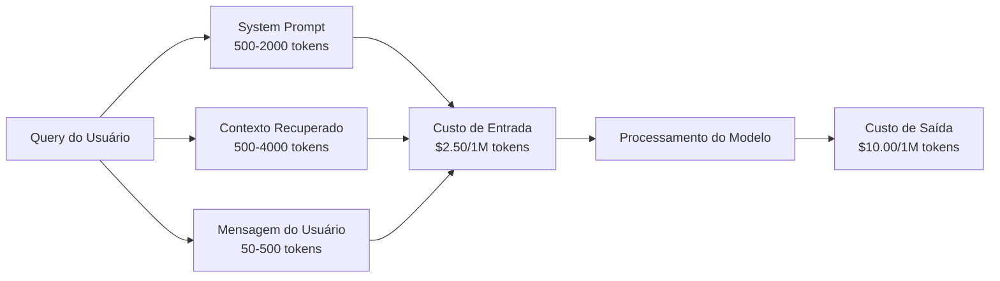

# Caching, Rate Limiting & Otimização de Custo

> A maioria das startups de IA não morre de modelos ruins. Morre de econologia de unidade ruim. Uma única chamada GPT-4o custa frações de centavo. Dez mil usuários fazendo dez chamadas por dia custam $250 só em tokens de entrada — antes de cobrar um dólar. As empresas que sobrevivem tratam cada chamada de API como transação financeira, não chamada de função.

**Tipo:** Construção
**Linguagens:** Python
**Pré-requisitos:** Fase 11 Aula 09 (Function Calling)
**Tempo:** ~45 minutos

## Objetivos de Aprendizado

- Implementar cache semântico que atende queries repetidas ou similares do cache em vez de fazer nova chamada de API
- Calcular custos por requisição entre provedores e implementar rate limiting consciente de token e alertas de orçamento
- Construir camada de otimização de custo com compressão de prompt, roteamento de modelo (caro vs barato) e cache de resposta
- Projetar estratégia de cache em camadas usando match exato, similaridade semântica e prefix cache

## O Problema

GPT-5 custa $5 por milhão de tokens de entrada e $15 por milhão de saída. Claude Opus 4 custa $15/$75. Gemini 3 Pro custa $1,25/$5.

A matemática que mata startups:
- 10.000 usuários ativos diários
- 10 queries por usuário por dia
- 1.000 tokens de entrada por query
- 500 tokens de saída por resposta

**Custo diário de entrada:** $250/dia
**Custo diário de saída:** $500/dia
**Total mensal:** $22.500/mês

E 40-60% dessas queries são quase-duplicadas. Usuários fazem as mesmas perguntas com palavras diferentes. Seu system prompt — idêntico em toda requisição — é cobrado toda vez.

## O Conceito

### Anatomia de Custo de uma Chamada LLM



### Cache de Provedor

| Provedor | Mecanismo | Desconto | Mínimo | Duração |
|----------|-----------|----------|--------|---------|
| Anthropic | Marcadores `cache_control` explícitos | 90% em hits | 1.024 tokens | 5 min padrão |
| OpenAI | Detecção de prefixo automática | 50% em hits | 1.024 tokens | Até 1 hora |
| Google Gemini | API `CachedContent` explícita | ~75% redução | 4.096 tokens | Configurável |

### Cache Semântico

```python
def simple_embed(text):
    """Embedding simplificado baseado em palavras."""
    words = text.lower().split()
    vocab = {}
    for w in words:
        vocab[w] = vocab.get(w, 0) + 1
    norm = math.sqrt(sum(v * v for v in vocab.values()))
    if norm == 0:
        return {}
    return {k: v / norm for k, v in vocab.items()}

def cosine_similarity(a, b):
    if not a or not b:
        return 0.0
    all_keys = set(a) | set(b)
    dot = sum(a.get(k, 0) * b.get(k, 0) for k in all_keys)
    return dot

class SemanticCache:
    def __init__(self, threshold=0.85, max_size=500):
        self.entries = []
        self.threshold = threshold
        self.max_size = max_size
        self.hits = 0
        self.misses = 0

    def get(self, query):
        query_emb = simple_embed(query)
        best_match = None
        best_sim = 0.0
        for entry in self.entries:
            sim = cosine_similarity(query_emb, entry["embedding"])
            if sim > best_sim:
                best_sim = sim
                best_match = entry
        if best_match and best_sim >= self.threshold:
            self.hits += 1
            return {"response": best_match["response"], "similarity": round(best_sim, 4)}
        self.misses += 1
        return None

    def put(self, query, response):
        if len(self.entries) >= self.max_size:
            self.entries.pop(0)
        self.entries.append({
            "query": query,
            "embedding": simple_embed(query),
            "response": response,
        })
```

### Roteamento de Modelo

```python
SIMPLE_KEYWORDS = ["que horas", "endereço", "telefone", "preço", "olá", "obrigado"]
COMPLEX_KEYWORDS = ["analisar", "comparar", "explicar por quê", "escrever código", "debugar"]

def classify_complexity(query):
    q = query.lower()
    if len(q.split()) <= 5 or any(kw in q for kw in SIMPLE_KEYWORDS):
        return "simple"
    if any(kw in q for kw in COMPLEX_KEYWORDS):
        return "complex"
    return "medium"

def route_model(query):
    complexity = classify_complexity(query)
    routing = {
        "simple": "gpt-4o-mini",
        "medium": "claude-sonnet-4",
        "complex": "gpt-4o",
    }
    return routing[complexity]
```

### Rate Limiting com Token Bucket

```python
class TokenBucketRateLimiter:
    def __init__(self):
        self.buckets = {}

    def check(self, user_id, tokens_needed, capacity=50000, refill_rate=500):
        if user_id not in self.buckets:
            self.buckets[user_id] = {"tokens": capacity, "capacity": capacity}
        
        bucket = self.buckets[user_id]
        if bucket["tokens"] >= tokens_needed:
            bucket["tokens"] -= tokens_needed
            return {"allowed": True, "tokens_available": bucket["tokens"]}
        
        return {"allowed": False, "tokens_available": bucket["tokens"]}
```

### Alertas de Orçamento e Circuit Breaker

```python
class CostTracker:
    def __init__(self, monthly_budget=1000.0):
        self.total_cost = 0
        self.monthly_budget = monthly_budget
        self.alerts = []

    def record(self, cost):
        self.total_cost += cost
        pct = self.total_cost / self.monthly_budget
        
        if pct >= 0.95 and not any(a["level"] == "stop" for a in self.alerts):
            self.alerts.append({"level": "stop", "message": "Orçamento 95% consumido"})
        elif pct >= 0.85 and not any(a["level"] == "throttle" for a in self.alerts):
            self.alerts.append({"level": "throttle", "message": "Orçamento 85% consumido"})
        elif pct >= 0.70 and not any(a["level"] == "warning" for a in self.alerts):
            self.alerts.append({"level": "warning", "message": "Orçamento 70% consumido"})
```

### Stack de Otimização

| Camada | Técnica | Economia Típica | Esforço |
|--------|---------|----------------|---------|
| 1 | Cache de provedor | 30-50% | Baixo |
| 2 | Cache exato | 10-20% | Baixo |
| 3 | Cache semântico | 15-30% | Médio |
| 4 | Roteamento de modelo | 40-70% | Médio |
| 5 | Rate limiting | Proteção de orçamento | Baixo |
| 6 | Compressão de prompt | 10-30% | Médio |
| 7 | Batch API | 50% em elegíveis | Baixo |

Uma aplicação RAG aplicando camadas 1-5 tipicamente reduz custos de $22.500/mês para $4.000-6.000/mês.

## Use

### OpenAI Batch API

```python
# import json
# from openai import OpenAI
#
# client = OpenAI()
#
# requests = []
# for i, query in enumerate(queries):
#     requests.append({
#         "custom_id": f"request-{i}",
#         "method": "POST",
#         "url": "/v1/chat/completions",
#         "body": {
#             "model": "gpt-4o-mini",
#             "messages": [{"role": "user", "content": query}],
#         },
#     })
#
# with open("batch_input.jsonl", "w") as f:
#     for r in requests:
#         f.write(json.dumps(r) + "\n")
#
# batch_file = client.files.create(file=open("batch_input.jsonl", "rb"), purpose="batch")
# batch = client.batches.create(input_file_id=batch_file.id, endpoint="/v1/chat/completions", completion_window="24h")
```

### Anthropic Cache

```python
# import anthropic
#
# client = anthropic.Anthropic()
#
# response = client.messages.create(
#     model="claude-sonnet-4-20250514",
#     max_tokens=1024,
#     system=[{
#         "type": "text",
#         "text": "Você é um assistente de suporte da Acme Corp...",
#         "cache_control": {"type": "ephemeral"},
#     }],
#     messages=[{"role": "user", "content": "Qual a política de reembolso?"}],
# )
```

## Entregue

- `outputs/prompt-cost-optimizer.md` — prompt reutilizável que analisa sua aplicação LLM e recomenda otimizações de custo
- `outputs/skill-cost-patterns.md` — framework de decisão para estratégia de cache, configuração de rate limiting e regras de roteamento

## Exercícios

1. Implemente evição LRU para cache semântico. Compare taxas de hit com evição mais antiga.

2. Construa ferramenta de projeção de custo baseada em média dos últimos 7 dias.

3. Implemente cache semântico em camadas: 0,98 para alta confiança, 0,90 para média.

4. Construa classificador de roteamento baseado em embedding em vez de keywords.

5. Implemente circuit breaker com níveis de degradação: 70% aviso, 85% modelo barato, 95% apenas cache.

## Termos-Chave

| Termo | O que o pessoal diz | O que realmente significa |
|-------|--------------------|-----------------------|
| Prompt caching | "Cache o system prompt" | Cache de nível de provedor com desconto em prefixos repetidos |
| Semantic caching | "Cache inteligente" | Embedding da query e retorno de resposta cacheada por similaridade |
| Exact caching | "Cache por hash" | Hash do prompt completo e retorno para entradas idênticas |
| Token bucket | "Rate limiter" | Algoritmo com balde de N tokens que recarrega a R tokens/segundo |
| Model routing | "Roteamento econômico" | Classificador que manda queries simples para modelos baratos |
| Circuit breaker | "Desligar emergência" | Degradação automática quando gasto se aproxima do limite |
| Batch API | "Desconto atacado" | Processamento assíncrono da OpenAI com 50% de desconto |

## Leitura Adicional

- [Anthropic Prompt Caching Guide](https://docs.anthropic.com/en/docs/build-with-claude/prompt-caching) — docs oficiais
- [OpenAI Prompt Caching](https://platform.openai.com/docs/guides/prompt-caching) — caching automático
- [OpenAI Batch API](https://platform.openai.com/docs/guides/batch) — processamento em lote
- [GPTCache](https://github.com/zilliztech/GPTCache) — biblioteca open-source de cache semântico
- [Helicone](https://www.helicone.ai) — plataforma de observabilidade LLM
