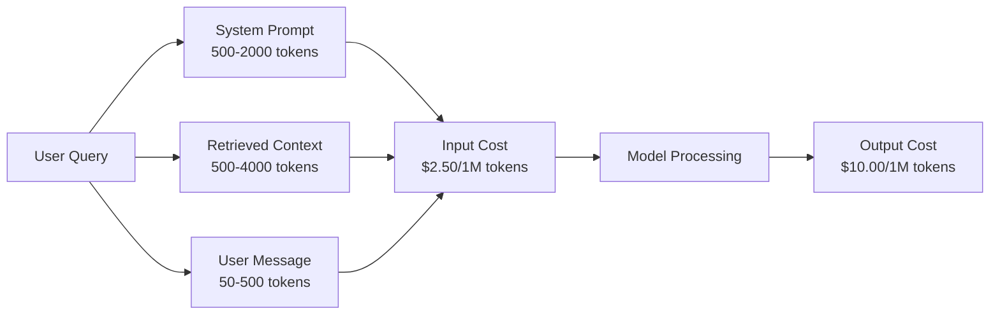
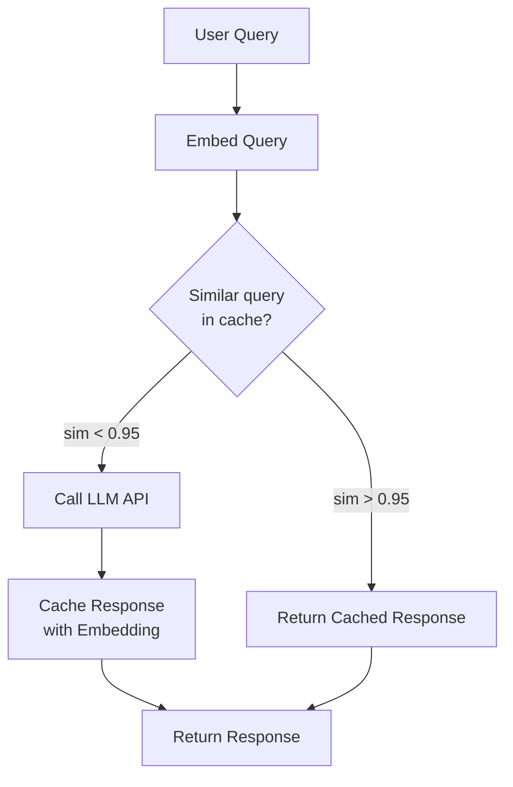
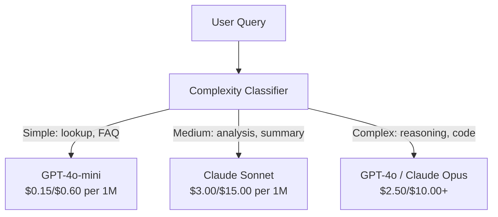

# Önbelleğe Alma, Hız Sınırlama ve Maliyet Optimizasyonu

> Yapay zeka girişimlerinin çoğu kötü modellerden ölmez. Kötü birim ekonomisinden ölüyorlar. Tek bir GPT-4o çağrısının maliyeti bir kuruşun çok altındadır. Günde on arama yapan on bin kullanıcının, siz tek bir dolar ödemeden önce yalnızca tokengiriş ücreti 250 ABD dolarıdır. Hayatta kalan şirketler, her API çağrısını bir function calling olarak değil, finansal bir işlem olarak ele alan şirketlerdir.

**Tür:** Yapım
**Diller:** Python
**Önkoşullar:** Aşama 11 Ders 09 (İşlev Çağırma)
**Süre:** ~45 dakika
**İlgili:** Aşama 11 · 15 (Prompt Önbelleğe Alma) — bu ders, uygulama katmanı önbelleğe almayı (anlamsal önbellek, tam karma önbellek, model yönlendirme) kapsar. Ders 15, sağlayıcı katmanı prompt önbelleğe almayı (Anthropic önbellek_kontrol, OpenAI otomatik, Gemini CachedContent) kapsar. Maliyeti %50-95 oranında azaltmak için her ikisini de birleştirin.

## Öğrenme Hedefleri

- Yeni bir API çağrısı yapmak yerine önbellekten tekrarlanan veya benzer sorgular sunan anlamsal önbelleğe alma uygulayın
- Sağlayıcılar genelinde istek başına maliyetleri hesaplayın ve token bilinçli hız sınırlaması ve bütçe uyarıları uygulayın
- prompt sıkıştırma, model yönlendirme (pahalı vs ucuz) ve yanıt önbelleğe alma ile bir maliyet optimizasyon katmanı oluşturun
- Farklı sorgu türleri için tam eşleşme, anlamsal benzerlik ve önek önbelleğe almayı kullanarak katmanlı bir önbellekleme stratejisi tasarlayın

## Sorun

Bir RAG sohbet robotu oluşturursunuz. Çok güzel çalışıyor. Kullanıcılar bunu seviyor.

Daha sonra fatura geliyor.

GPT-5'in maliyeti milyon çıktı başına $5 per million input tokens and $15'tir. Claude Opus 4.7'nin maliyeti $15 input / $75 çıktı. Gemini 3 Pro'nun maliyeti $1.25 input / $5 çıktıdır. GPT-5-mini $0.25/$2'dir. Aşağıdaki fiyatlar örnek niteliğindedir; her zaman sağlayıcının mevcut fiyatlandırma sayfasını kontrol edin.

İşte startupları öldüren matematik:

- 10.000 günlük aktif kullanıcı
- Kullanıcı başına günde 10 sorgu
- Sorgu başına 1.000 giriş token (sistem prompt + bağlam + kullanıcı mesajı)
- Yanıt başına 500 çıkış token

**Günlük girdi maliyeti:** 10.000 x 10 x 1.000 / 1.000.000 x $2.50 = **$250/gün**
**Günlük çıktı maliyeti:** 10.000 x 10 x 500 / 1.000.000 x $10.00 = **$500/gün**
**Aylık toplam:** **22.500$/ay**

Bu sadece LLM. embedding'ları, vector database barındırmayı, altyapıyı ekleyin. Bir chatbot için ayda 30.000 dolara bakıyorsunuz.

Acımasız kısım: Bu sorguların %40-60'ı neredeyse kopyalardır. Kullanıcılar aynı soruları biraz farklı kelimelerle soruyorlar. Her istekte aynı olan prompt sisteminiz her seferinde faturalandırılır. RAG tarafından alınan bağlam belgeleri, aynı konuyu soran kullanıcılar arasında tekrarlanır.

Gereksiz hesaplamanın tam bedelini ödüyorsunuz.

## Konsept

### LLM Çağrısının Maliyet Anatomisi

Her API çağrısının beş maliyet bileşeni vardır.



Sistem prompt'ler sessiz katillerdir. Her istekle birlikte gönderilen 1.500-token'lik bir sistem prompt, hiç değişmeyen metin için $3.75 per million requests just for that prefix. At 100K requests per day, that is $375/gün -- 11.250 $/ay -- maliyete sahiptir.

### Sağlayıcı Önbelleğe Alma: Yerleşik İndirimler

Üç büyük sağlayıcının tümü, 2026'da sağlayıcı tarafında prompt önbelleğe alma olanağı sunuyor, ancak mekanizmalar farklı. Ayrıntılı bilgi için Aşama 11 · 15'e bakınız.

| Sağlayıcı | Mekanizma | İndirim | Asgari | Önbellek Süresi |
|----------|-----------|----------|---------|----------------|
| Anthropic | Açık önbellek_kontrol işaretleri | Önbellek isabetlerinde %90 (yazma sırasında ekstra %25 ödeyin) | 1.024 tokens (Sonnet/Opus), 2.048 (Haiku) | 5 dakikalık varsayılan; 1 saat uzatılmış (2 kat yazma primi) |
| OpenAI | Otomatik önek eşleştirme | Önbellek isabetlerinde %50 | 1.024 tokens | 1 saate kadar en iyi çaba |
| Google İkizler | Açık Önbelleğe Alınmış İçerik API'si | ~%75 indirim (artı depolama) | 4.096 (Flaş) / 32.768 (Pro) | Kullanıcı tarafından yapılandırılabilir TTL |

**Anthropic'in yaklaşımı** açıktır. prompt'nızın bölümlerini `cache_control: {"type": "ephemeral"}` ile işaretlersiniz. İlk istek %25 yazma primi öder. Aynı önekle yapılan sonraki talepler %90 indirim alır. Önbellek isabetlerinde maliyeti $0.005 normally costs $0,000625 olan 2.000-token sistem prompt. 100.000'den fazla istek, günde 437,50 ABD doları tasarruf sağlar.

**OpenAI'nin yaklaşımı** otomatiktir. Önceki bir istekle eşleşen herhangi bir prompt öneki %50 indirim alır. İşaretçiye gerek yok. Takas: daha az indirim, daha az kontrol, ancak sıfır uygulama çabası.

### Anlamsal Önbelleğe Alma: Özel Katmanınız

Sağlayıcının önbelleğe alması yalnızca aynı önekler için çalışır. Anlamsal önbelleğe alma daha zor olan durumu ele alır: aynı anlama sahip farklı sorgular.

"İade politikası nedir?" ve "Bir ürünü nasıl iade edebilirim?" farklı dizelerdir ancak aynı amaçtır. Anlamsal bir önbellek her iki sorguyu da gömer, kosinüs benzerliğini hesaplar ve benzerlik bir eşiği (genellikle 0,92-0,95) aşarsa önbelleğe alınan yanıtı döndürür.



embedding maliyetleri ihmal edilebilir düzeydedir. OpenAI'nin text-embedding-3-smale maliyeti milyon token başına 0,02 ABD dolarıdır. Önbelleği kontrol etmenin tam bir LLM çağrısıyla karşılaştırıldığında neredeyse hiçbir maliyeti yoktur.

### Tam Önbelleğe Alma: Karma ve Eşleştirme

Deterministik çağrılar için (sıcaklık=0, aynı model, aynı prompt), tam önbelleğe alma daha basit ve daha hızlıdır. prompt'nin tamamını karma yapın, önbelleği kontrol edin, bulunursa geri gönderin.

Bu aşağıdakiler için mükemmel çalışır:
- Sistem prompt + sabit içerik + aynı kullanıcı sorguları
- Aynı araç tanımlarıyla function calling
- Aynı belgenin birden çok kez işlendiği toplu işleme

### Oran Sınırlaması: Bütçenizi Korumak

Hız sınırlaması sadece adaletle ilgili değildir. Bu hayatta kalmayla ilgili.

**Token paket algoritması:** her kullanıcı, saniyede R hızıyla yeniden doldurulan N token'lik bir paket alır. Bir istek paketteki token'leri tüketir. Kova boşsa istek reddedilir. Bu, ortalama bir hızı uygularken patlamalara (tüm kovayı bir kerede kullanın) izin verir.

**Kullanıcı başına kotalar:** Kullanıcı katmanı başına günlük/aylık token limitleri ayarlayın.

| Seviye | Günlük Token Limiti | Maksimum İstek/dak | Model Erişimi |
|------|------------------|------------------|-------------|
| Ücretsiz | 50.000 | 10 | Yalnızca GPT-4o-mini |
| Profesyonel | 500.000 | 60 | GPT-4o, Claude Sonnet |
| Kurumsal | 5.000.000 | 300 | Tüm modeller |

### Model Yönlendirme: Doğru İş için Doğru Model

Her sorgunun GPT-4o'ya ihtiyacı yoktur.

"Mağaza saat kaçta kapanıyor?" $10/M-output model. GPT-4o-mini at $0,60/M çıkışı gerektirmez, bunu mükemmel bir şekilde halleder. Claude Haiku 1,25$/milyon çıkışla bunu hallediyor. Basit bir sınıflandırıcı, ucuz sorguları ucuz modellere, karmaşık sorguları ise pahalı modellere yönlendirir.



İyi ayarlanmış bir yönlendirici, yalnızca model maliyetlerinde %40-70 oranında tasarruf sağlar.

### Maliyet Takibi: Paranın Nereye Gittiğini Bilin

Ölçmediğiniz şeyi optimize edemezsiniz. Her API çağrısını şununla günlüğe kaydedin:

- Zaman damgası
- Model adı
- token'ları girin
- Çıkış tokens
- Gecikme (ms)
- Hesaplanan maliyet ($)
- Kullanıcı kimliği
- Önbellek isabeti/kaçırması
- Talep kategorisi

Bu veriler hangi özelliklerin pahalı olduğunu, hangi kullanıcıların yoğun tüketici olduğunu ve önbelleğe almanın en fazla etkiye sahip olduğu yerleri ortaya çıkarır.

### Toplu İşleme: Toplu İndirimler

OpenAI'nin Batch API'si, istekleri eşzamansız olarak %50 indirimle işler. 50.000'e kadar istekten oluşan bir grup gönderirsiniz ve sonuçlar 24 saat içinde geri gelir.

Toplu işlemi şunun için kullanın:
- Gecelik belge işleme
- Toplu sınıflandırma
- Değerlendirme çalıştırmaları
- Veri zenginleştirme hatları

Şunlar için uygun değildir: kullanıcıya yönelik gerçek zamanlı sorgular (gecikme önemlidir).

### Bütçe Uyarıları ve Devre Kesiciler

Bir limite ulaştığınızda devre kesici harcamayı durdurur. Biri olmadan, bir hata veya kötüye kullanım, aylık bütçenizi saatler içinde tüketebilir.

Üç eşik belirleyin:
1. **Uyarı** (bütçenin %70'i): bir uyarı gönderin
2. **Kısma** (bütçenin %85'i): yalnızca daha ucuz modellere geçiş yapın
3. **Durdur** (bütçenin %95'i): yeni istekleri reddet, yalnızca önbelleğe alınmış yanıtları döndür

### Optimizasyon Yığını

Bu teknikleri sırasıyla uygulayın. Her katman öncekilerle birleşir.

| Katman | Tekniği | Tipik Tasarruflar | Uygulama Çabası |
|-------|-----------|----------------|----------------------|
| 1 | Sağlayıcı prompt önbelleğe alma | %30-50 | Düşük (önbellek işaretçileri ekleyin) |
| 2 | Tam önbelleğe alma | %10-20 | Düşük (hash + dict) |
| 3 | Anlamsal önbelleğe alma | %15-30 | Orta (embedding'lar + benzerlik) |
| 4 | Model yönlendirme | %40-70 | Orta (sınıflandırıcı) |
| 5 | Hız sınırlama | Bütçe koruması | Düşük (token paket) |
| 6 | Prompt sıkıştırma | %10-30 | Orta (prompt'ları yeniden yazın) |
| 7 | Gruplama | Uygunluk oranlarında %50 | Düşük (toplu API) |

1-5. katmanları uygulayan bir RAG uygulaması genellikle maliyetleri ayda $22,500/month to $4.000-6.000'den azaltır. Pist yakmak ile iş kurmak arasındaki fark budur.

### Gerçek Tasarruf: Öncesi ve Sonrası

İşte 10.000 DAU'ya hizmet veren bir RAG sohbet robotunun gerçek bir dökümü.

| Metrik | Optimizasyondan Önce | Optimizasyondan Sonra | Tasarruf |
|--------|--------------------|--------------------|---------|
| Aylık LLM maliyeti | $22,500 | $5.200 | %77 |
| Sorgu başına ortalama maliyet | $0.0075 | $0,0017 | %77 |
| Önbellek isabet oranı | %0 | %52 | -- |
| Mini'ye yönlendirilen sorgular | %0 | %65 | -- |
| P95 gecikmesi | 2.800ms | 900 ms (önbellek isabeti: 50 ms) | %68 |
| Aylık embedding maliyet | $0 | $180 | (yeni maliyet) |
| Toplam aylık maliyet | $22,500 | $5,380 | %76 |

Anlamsal önbelleğe almanın embedding maliyeti (ayda 180 ABD doları), önbellek isabetlerinden sonraki ilk saat içinde kendini amorti eder.

## İnşa Et

### Adım 1: Maliyet Hesaplayıcı

Başlıca modellerin mevcut fiyatlarını bilen bir token maliyet hesaplayıcısı oluşturun.

```python
import hashlib
import time
import json
import math
from dataclasses import dataclass, field


MODEL_PRICING = {
    "gpt-4o": {"input": 2.50, "output": 10.00, "cached_input": 1.25},
    "gpt-4o-mini": {"input": 0.15, "output": 0.60, "cached_input": 0.075},
    "gpt-4.1": {"input": 2.00, "output": 8.00, "cached_input": 0.50},
    "gpt-4.1-mini": {"input": 0.40, "output": 1.60, "cached_input": 0.10},
    "gpt-4.1-nano": {"input": 0.10, "output": 0.40, "cached_input": 0.025},
    "o3": {"input": 2.00, "output": 8.00, "cached_input": 0.50},
    "o3-mini": {"input": 1.10, "output": 4.40, "cached_input": 0.55},
    "o4-mini": {"input": 1.10, "output": 4.40, "cached_input": 0.275},
    "claude-opus-4": {"input": 15.00, "output": 75.00, "cached_input": 1.50},
    "claude-sonnet-4": {"input": 3.00, "output": 15.00, "cached_input": 0.30},
    "claude-haiku-3.5": {"input": 0.80, "output": 4.00, "cached_input": 0.08},
    "gemini-2.5-pro": {"input": 1.25, "output": 10.00, "cached_input": 0.3125},
    "gemini-2.5-flash": {"input": 0.15, "output": 0.60, "cached_input": 0.0375},
}


def calculate_cost(model, input_tokens, output_tokens, cached_input_tokens=0):
    if model not in MODEL_PRICING:
        return {"error": f"Unknown model: {model}"}
    pricing = MODEL_PRICING[model]
    non_cached = input_tokens - cached_input_tokens
    input_cost = (non_cached / 1_000_000) * pricing["input"]
    cached_cost = (cached_input_tokens / 1_000_000) * pricing["cached_input"]
    output_cost = (output_tokens / 1_000_000) * pricing["output"]
    total = input_cost + cached_cost + output_cost
    return {
        "model": model,
        "input_tokens": input_tokens,
        "output_tokens": output_tokens,
        "cached_input_tokens": cached_input_tokens,
        "input_cost": round(input_cost, 6),
        "cached_input_cost": round(cached_cost, 6),
        "output_cost": round(output_cost, 6),
        "total_cost": round(total, 6),
    }
```

### Adım 2: Tam Önbellek

prompt'nin tamamını karma hale getirin ve aynı istekler için önbelleğe alınmış yanıtları döndürün.

```python
class ExactCache:
    def __init__(self, max_size=1000, ttl_seconds=3600):
        self.cache = {}
        self.max_size = max_size
        self.ttl = ttl_seconds
        self.hits = 0
        self.misses = 0

    def _hash(self, model, messages, temperature):
        key_data = json.dumps({"model": model, "messages": messages, "temperature": temperature}, sort_keys=True)
        return hashlib.sha256(key_data.encode()).hexdigest()

    def get(self, model, messages, temperature=0.0):
        if temperature > 0:
            self.misses += 1
            return None
        key = self._hash(model, messages, temperature)
        if key in self.cache:
            entry = self.cache[key]
            if time.time() - entry["timestamp"] < self.ttl:
                self.hits += 1
                entry["access_count"] += 1
                return entry["response"]
            del self.cache[key]
        self.misses += 1
        return None

    def put(self, model, messages, temperature, response):
        if temperature > 0:
            return
        if len(self.cache) >= self.max_size:
            oldest_key = min(self.cache, key=lambda k: self.cache[k]["timestamp"])
            del self.cache[oldest_key]
        key = self._hash(model, messages, temperature)
        self.cache[key] = {
            "response": response,
            "timestamp": time.time(),
            "access_count": 1,
        }

    def stats(self):
        total = self.hits + self.misses
        return {
            "hits": self.hits,
            "misses": self.misses,
            "hit_rate": round(self.hits / total, 4) if total > 0 else 0,
            "cache_size": len(self.cache),
        }
```

### Adım 3: Anlamsal Önbellek

Benzerlik bir eşiği aştığında sorguları ekleyin ve önbelleğe alınmış yanıtları döndürün.

```python
def simple_embed(text):
    words = text.lower().split()
    vocab = {}
    for w in words:
        vocab[w] = vocab.get(w, 0) + 1
    norm = math.sqrt(sum(v * v for v in vocab.values()))
    if norm == 0:
        return {}
    return {k: v / norm for k, v in vocab.items()}


def cosine_similarity(a, b):
    if not a or not b:
        return 0.0
    all_keys = set(a) | set(b)
    dot = sum(a.get(k, 0) * b.get(k, 0) for k in all_keys)
    return dot


class SemanticCache:
    def __init__(self, similarity_threshold=0.85, max_size=500, ttl_seconds=3600):
        self.entries = []
        self.threshold = similarity_threshold
        self.max_size = max_size
        self.ttl = ttl_seconds
        self.hits = 0
        self.misses = 0

    def get(self, query):
        query_embedding = simple_embed(query)
        now = time.time()
        best_match = None
        best_sim = 0.0
        for entry in self.entries:
            if now - entry["timestamp"] > self.ttl:
                continue
            sim = cosine_similarity(query_embedding, entry["embedding"])
            if sim > best_sim:
                best_sim = sim
                best_match = entry
        if best_match and best_sim >= self.threshold:
            self.hits += 1
            best_match["access_count"] += 1
            return {"response": best_match["response"], "similarity": round(best_sim, 4), "original_query": best_match["query"]}
        self.misses += 1
        return None

    def put(self, query, response):
        if len(self.entries) >= self.max_size:
            self.entries.sort(key=lambda e: e["timestamp"])
            self.entries.pop(0)
        self.entries.append({
            "query": query,
            "embedding": simple_embed(query),
            "response": response,
            "timestamp": time.time(),
            "access_count": 1,
        })

    def stats(self):
        total = self.hits + self.misses
        return {
            "hits": self.hits,
            "misses": self.misses,
            "hit_rate": round(self.hits / total, 4) if total > 0 else 0,
            "cache_size": len(self.entries),
        }
```

### Adım 4: Hız Sınırlayıcı

Kullanıcı başına kotalara sahip Token paket hızı sınırlayıcısı.

```python
class TokenBucketRateLimiter:
    def __init__(self):
        self.buckets = {}
        self.tiers = {
            "free": {"capacity": 50_000, "refill_rate": 500, "max_requests_per_min": 10},
            "pro": {"capacity": 500_000, "refill_rate": 5_000, "max_requests_per_min": 60},
            "enterprise": {"capacity": 5_000_000, "refill_rate": 50_000, "max_requests_per_min": 300},
        }

    def _get_bucket(self, user_id, tier="free"):
        if user_id not in self.buckets:
            tier_config = self.tiers.get(tier, self.tiers["free"])
            self.buckets[user_id] = {
                "tokens": tier_config["capacity"],
                "capacity": tier_config["capacity"],
                "refill_rate": tier_config["refill_rate"],
                "last_refill": time.time(),
                "request_timestamps": [],
                "max_rpm": tier_config["max_requests_per_min"],
                "tier": tier,
                "total_tokens_used": 0,
            }
        return self.buckets[user_id]

    def _refill(self, bucket):
        now = time.time()
        elapsed = now - bucket["last_refill"]
        refill = int(elapsed * bucket["refill_rate"])
        if refill > 0:
            bucket["tokens"] = min(bucket["capacity"], bucket["tokens"] + refill)
            bucket["last_refill"] = now

    def check(self, user_id, tokens_needed, tier="free"):
        bucket = self._get_bucket(user_id, tier)
        self._refill(bucket)
        now = time.time()
        bucket["request_timestamps"] = [t for t in bucket["request_timestamps"] if now - t < 60]
        if len(bucket["request_timestamps"]) >= bucket["max_rpm"]:
            return {"allowed": False, "reason": "rate_limit", "retry_after_seconds": 60 - (now - bucket["request_timestamps"][0])}
        if bucket["tokens"] < tokens_needed:
            deficit = tokens_needed - bucket["tokens"]
            wait = deficit / bucket["refill_rate"]
            return {"allowed": False, "reason": "token_limit", "tokens_available": bucket["tokens"], "retry_after_seconds": round(wait, 1)}
        return {"allowed": True, "tokens_available": bucket["tokens"]}

    def consume(self, user_id, tokens_used, tier="free"):
        bucket = self._get_bucket(user_id, tier)
        bucket["tokens"] -= tokens_used
        bucket["request_timestamps"].append(time.time())
        bucket["total_tokens_used"] += tokens_used

    def get_usage(self, user_id):
        if user_id not in self.buckets:
            return {"error": "User not found"}
        b = self.buckets[user_id]
        return {
            "user_id": user_id,
            "tier": b["tier"],
            "tokens_remaining": b["tokens"],
            "capacity": b["capacity"],
            "total_tokens_used": b["total_tokens_used"],
            "utilization": round(b["total_tokens_used"] / b["capacity"], 4) if b["capacity"] else 0,
        }
```

### Adım 5: Maliyet Takibi

Her aramayı günlüğe kaydedin ve devam eden toplamları hesaplayın.

```python
class CostTracker:
    def __init__(self, monthly_budget=1000.0):
        self.logs = []
        self.monthly_budget = monthly_budget
        self.alerts = []

    def log_call(self, model, input_tokens, output_tokens, cached_input_tokens=0, latency_ms=0, user_id="anonymous", cache_status="miss"):
        cost = calculate_cost(model, input_tokens, output_tokens, cached_input_tokens)
        entry = {
            "timestamp": time.time(),
            "model": model,
            "input_tokens": input_tokens,
            "output_tokens": output_tokens,
            "cached_input_tokens": cached_input_tokens,
            "latency_ms": latency_ms,
            "cost": cost["total_cost"],
            "user_id": user_id,
            "cache_status": cache_status,
        }
        self.logs.append(entry)
        self._check_budget()
        return entry

    def _check_budget(self):
        total = self.total_cost()
        pct = total / self.monthly_budget if self.monthly_budget > 0 else 0
        if pct >= 0.95 and not any(a["level"] == "stop" for a in self.alerts):
            self.alerts.append({"level": "stop", "message": f"Budget 95% consumed: ${total:.2f}/${self.monthly_budget:.2f}", "timestamp": time.time()})
        elif pct >= 0.85 and not any(a["level"] == "throttle" for a in self.alerts):
            self.alerts.append({"level": "throttle", "message": f"Budget 85% consumed: ${total:.2f}/${self.monthly_budget:.2f}", "timestamp": time.time()})
        elif pct >= 0.70 and not any(a["level"] == "warning" for a in self.alerts):
            self.alerts.append({"level": "warning", "message": f"Budget 70% consumed: ${total:.2f}/${self.monthly_budget:.2f}", "timestamp": time.time()})

    def total_cost(self):
        return round(sum(e["cost"] for e in self.logs), 6)

    def cost_by_model(self):
        by_model = {}
        for e in self.logs:
            m = e["model"]
            if m not in by_model:
                by_model[m] = {"calls": 0, "cost": 0, "input_tokens": 0, "output_tokens": 0}
            by_model[m]["calls"] += 1
            by_model[m]["cost"] = round(by_model[m]["cost"] + e["cost"], 6)
            by_model[m]["input_tokens"] += e["input_tokens"]
            by_model[m]["output_tokens"] += e["output_tokens"]
        return by_model

    def cache_savings(self):
        cache_hits = [e for e in self.logs if e["cache_status"] == "hit"]
        if not cache_hits:
            return {"saved": 0, "cache_hits": 0}
        saved = 0
        for e in cache_hits:
            full_cost = calculate_cost(e["model"], e["input_tokens"], e["output_tokens"])
            saved += full_cost["total_cost"]
        return {"saved": round(saved, 4), "cache_hits": len(cache_hits)}

    def summary(self):
        if not self.logs:
            return {"total_calls": 0, "total_cost": 0}
        total_latency = sum(e["latency_ms"] for e in self.logs)
        cache_hits = sum(1 for e in self.logs if e["cache_status"] == "hit")
        return {
            "total_calls": len(self.logs),
            "total_cost": self.total_cost(),
            "avg_cost_per_call": round(self.total_cost() / len(self.logs), 6),
            "avg_latency_ms": round(total_latency / len(self.logs), 1),
            "cache_hit_rate": round(cache_hits / len(self.logs), 4),
            "cost_by_model": self.cost_by_model(),
            "cache_savings": self.cache_savings(),
            "budget_remaining": round(self.monthly_budget - self.total_cost(), 2),
            "budget_utilization": round(self.total_cost() / self.monthly_budget, 4) if self.monthly_budget > 0 else 0,
            "alerts": self.alerts,
        }
```

### Adım 6: Yönlendiriciyi Modelleyin

Sorguları, bunları işleyebilecek en ucuz modele yönlendirin.

```python
SIMPLE_KEYWORDS = ["what time", "hours", "address", "phone", "price", "return policy", "hello", "hi", "thanks", "yes", "no"]
COMPLEX_KEYWORDS = ["analyze", "compare", "explain why", "write code", "debug", "architect", "design", "trade-off", "evaluate"]


def classify_complexity(query):
    q = query.lower()
    if len(q.split()) <= 5 or any(kw in q for kw in SIMPLE_KEYWORDS):
        return "simple"
    if any(kw in q for kw in COMPLEX_KEYWORDS):
        return "complex"
    return "medium"


def route_model(query, tier="pro"):
    complexity = classify_complexity(query)
    routing_table = {
        "simple": {"free": "gpt-4.1-nano", "pro": "gpt-4o-mini", "enterprise": "gpt-4o-mini"},
        "medium": {"free": "gpt-4o-mini", "pro": "claude-sonnet-4", "enterprise": "claude-sonnet-4"},
        "complex": {"free": "gpt-4o-mini", "pro": "gpt-4o", "enterprise": "claude-opus-4"},
    }
    model = routing_table[complexity].get(tier, "gpt-4o-mini")
    return {"query": query, "complexity": complexity, "model": model, "tier": tier}
```

### Adım 7: Demoyu Çalıştırın

```python
def simulate_llm_call(model, query):
    input_tokens = len(query.split()) * 4 + 500
    output_tokens = 150 + (len(query.split()) * 2)
    latency = 200 + (output_tokens * 2)
    return {
        "model": model,
        "response": f"[Simulated {model} response to: {query[:50]}...]",
        "input_tokens": input_tokens,
        "output_tokens": output_tokens,
        "latency_ms": latency,
    }


def run_demo():
    print("=" * 60)
    print("  Caching, Rate Limiting & Cost Optimization Demo")
    print("=" * 60)

    print("\n--- Model Pricing ---")
    for model, pricing in list(MODEL_PRICING.items())[:6]:
        cost_1k = calculate_cost(model, 1000, 500)
        print(f"  {model}: ${cost_1k['total_cost']:.6f} per 1K in + 500 out")

    print("\n--- Cost Comparison: 100K Requests ---")
    for model in ["gpt-4o", "gpt-4o-mini", "claude-sonnet-4", "claude-haiku-3.5"]:
        cost = calculate_cost(model, 1000 * 100_000, 500 * 100_000)
        print(f"  {model}: ${cost['total_cost']:.2f}")

    print("\n--- Anthropic Cache Savings ---")
    no_cache = calculate_cost("claude-sonnet-4", 2000, 500, 0)
    with_cache = calculate_cost("claude-sonnet-4", 2000, 500, 1500)
    saving = no_cache["total_cost"] - with_cache["total_cost"]
    print(f"  Without cache: ${no_cache['total_cost']:.6f}")
    print(f"  With 1500 cached tokens: ${with_cache['total_cost']:.6f}")
    print(f"  Savings per call: ${saving:.6f} ({saving/no_cache['total_cost']*100:.1f}%)")

    exact_cache = ExactCache(max_size=100, ttl_seconds=300)
    semantic_cache = SemanticCache(similarity_threshold=0.75, max_size=100)
    rate_limiter = TokenBucketRateLimiter()
    tracker = CostTracker(monthly_budget=100.0)

    print("\n--- Exact Cache ---")
    messages_1 = [{"role": "user", "content": "What is the return policy?"}]
    result = exact_cache.get("gpt-4o-mini", messages_1, 0.0)
    print(f"  First lookup: {'HIT' if result else 'MISS'}")
    exact_cache.put("gpt-4o-mini", messages_1, 0.0, "You can return items within 30 days.")
    result = exact_cache.get("gpt-4o-mini", messages_1, 0.0)
    print(f"  Second lookup: {'HIT' if result else 'MISS'} -> {result}")
    result = exact_cache.get("gpt-4o-mini", messages_1, 0.7)
    print(f"  With temp=0.7: {'HIT' if result else 'MISS (non-deterministic, skip cache)'}")
    print(f"  Stats: {exact_cache.stats()}")

    print("\n--- Semantic Cache ---")
    test_queries = [
        ("What is the return policy?", "Items can be returned within 30 days with receipt."),
        ("How do I return an item?", None),
        ("What are your store hours?", "We are open 9am-9pm Monday through Saturday."),
        ("When does the store open?", None),
        ("Tell me about quantum computing", "Quantum computers use qubits..."),
        ("Explain quantum mechanics", None),
    ]
    for query, response in test_queries:
        cached = semantic_cache.get(query)
        if cached:
            print(f"  '{query[:40]}' -> CACHE HIT (sim={cached['similarity']}, original='{cached['original_query'][:40]}')")
        elif response:
            semantic_cache.put(query, response)
            print(f"  '{query[:40]}' -> MISS (stored)")
        else:
            print(f"  '{query[:40]}' -> MISS (no match)")
    print(f"  Stats: {semantic_cache.stats()}")

    print("\n--- Rate Limiting ---")
    for i in range(12):
        check = rate_limiter.check("user_1", 1000, "free")
        if check["allowed"]:
            rate_limiter.consume("user_1", 1000, "free")
        status = "OK" if check["allowed"] else f"BLOCKED ({check['reason']})"
        if i < 5 or not check["allowed"]:
            print(f"  Request {i+1}: {status}")
    print(f"  Usage: {rate_limiter.get_usage('user_1')}")

    print("\n--- Model Routing ---")
    routing_queries = [
        "What time do you close?",
        "Summarize this quarterly earnings report",
        "Analyze the trade-offs between microservices and monoliths",
        "Hello",
        "Write code for a binary search tree with deletion",
    ]
    for q in routing_queries:
        route = route_model(q, "pro")
        print(f"  '{q[:50]}' -> {route['model']} ({route['complexity']})")

    print("\n--- Full Pipeline: Before vs After Optimization ---")
    queries = [
        "What is the return policy?",
        "How do I return something?",
        "What are your hours?",
        "When do you open?",
        "Explain the difference between TCP and UDP",
        "Compare TCP vs UDP protocols",
        "Hello",
        "What is your phone number?",
        "Write a Python function to sort a list",
        "Analyze the pros and cons of serverless architecture",
    ]

    print("\n  [Before: no caching, single model (gpt-4o)]")
    tracker_before = CostTracker(monthly_budget=1000.0)
    for q in queries:
        result = simulate_llm_call("gpt-4o", q)
        tracker_before.log_call("gpt-4o", result["input_tokens"], result["output_tokens"], latency_ms=result["latency_ms"], cache_status="miss")
    before = tracker_before.summary()
    print(f"  Total cost: ${before['total_cost']:.6f}")
    print(f"  Avg cost/call: ${before['avg_cost_per_call']:.6f}")
    print(f"  Avg latency: {before['avg_latency_ms']}ms")

    print("\n  [After: caching + routing + rate limiting]")
    exact_c = ExactCache()
    semantic_c = SemanticCache(similarity_threshold=0.75)
    tracker_after = CostTracker(monthly_budget=1000.0)

    for q in queries:
        messages = [{"role": "user", "content": q}]
        cached = exact_c.get("gpt-4o", messages, 0.0)
        if cached:
            tracker_after.log_call("gpt-4o-mini", 0, 0, latency_ms=5, cache_status="hit")
            continue
        sem_cached = semantic_c.get(q)
        if sem_cached:
            tracker_after.log_call("gpt-4o-mini", 0, 0, latency_ms=15, cache_status="hit")
            continue
        route = route_model(q)
        result = simulate_llm_call(route["model"], q)
        tracker_after.log_call(route["model"], result["input_tokens"], result["output_tokens"], latency_ms=result["latency_ms"], cache_status="miss")
        exact_c.put(route["model"], messages, 0.0, result["response"])
        semantic_c.put(q, result["response"])

    after = tracker_after.summary()
    print(f"  Total cost: ${after['total_cost']:.6f}")
    print(f"  Avg cost/call: ${after['avg_cost_per_call']:.6f}")
    print(f"  Avg latency: {after['avg_latency_ms']}ms")
    print(f"  Cache hit rate: {after['cache_hit_rate']:.0%}")

    if before["total_cost"] > 0:
        savings_pct = (1 - after["total_cost"] / before["total_cost"]) * 100
        print(f"\n  SAVINGS: {savings_pct:.1f}% cost reduction")
        print(f"  Latency improvement: {(1 - after['avg_latency_ms'] / before['avg_latency_ms']) * 100:.1f}% faster")

    print("\n--- Budget Alerts Demo ---")
    alert_tracker = CostTracker(monthly_budget=0.01)
    for i in range(5):
        alert_tracker.log_call("gpt-4o", 5000, 2000, latency_ms=500)
    print(f"  Total spent: ${alert_tracker.total_cost():.6f} / ${alert_tracker.monthly_budget}")
    for alert in alert_tracker.alerts:
        print(f"  ALERT [{alert['level'].upper()}]: {alert['message']}")

    print("\n--- Cost Breakdown by Model ---")
    multi_tracker = CostTracker(monthly_budget=500.0)
    for _ in range(50):
        multi_tracker.log_call("gpt-4o-mini", 800, 200, latency_ms=150)
    for _ in range(30):
        multi_tracker.log_call("claude-sonnet-4", 1500, 500, latency_ms=400)
    for _ in range(10):
        multi_tracker.log_call("gpt-4o", 2000, 800, latency_ms=600)
    for _ in range(10):
        multi_tracker.log_call("claude-opus-4", 3000, 1000, latency_ms=1200)
    breakdown = multi_tracker.cost_by_model()
    for model, data in sorted(breakdown.items(), key=lambda x: x[1]["cost"], reverse=True):
        print(f"  {model}: {data['calls']} calls, ${data['cost']:.6f}, {data['input_tokens']:,} in / {data['output_tokens']:,} out")
    print(f"  Total: ${multi_tracker.total_cost():.6f}")

    print("\n" + "=" * 60)
    print("  Demo complete.")
    print("=" * 60)


if __name__ == "__main__":
    run_demo()
```

## Kullan onu

### Anthropic Prompt Önbelleğe Alma

```python
# import anthropic
#
# client = anthropic.Anthropic()
#
# response = client.messages.create(
#     model="claude-sonnet-5",
#     max_tokens=1024,
#     system=[
#         {
#             "type": "text",
#             "text": "You are a helpful customer support agent for Acme Corp...",
#             "cache_control": {"type": "ephemeral"},
#         }
#     ],
#     messages=[{"role": "user", "content": "What is the return policy?"}],
# )
#
# print(f"Input tokens: {response.usage.input_tokens}")
# print(f"Cache creation tokens: {response.usage.cache_creation_input_tokens}")
# print(f"Cache read tokens: {response.usage.cache_read_input_tokens}")
```

İlk çağrı önbelleğe yazar (%25 premium). Aynı sistem prompt önekine sahip sonraki her çağrı, önbellekten okunur (%90 indirim). Önbellek 5 dakika sürer ve her vuruşta zamanlayıcıyı sıfırlar.

### OpenAI Otomatik Önbelleğe Alma

```python
# from openai import OpenAI
#
# client = OpenAI()
#
# response = client.chat.completions.create(
#     model="gpt-4o",
#     messages=[
#         {"role": "system", "content": "You are a helpful customer support agent..."},
#         {"role": "user", "content": "What is the return policy?"},
#     ],
# )
#
# print(f"Prompt tokens: {response.usage.prompt_tokens}")
# print(f"Cached tokens: {response.usage.prompt_tokens_details.cached_tokens}")
# print(f"Completion tokens: {response.usage.completion_tokens}")
```

OpenAI otomatik olarak önbelleğe alınır. Son istekle eşleşen 1.024+ token'den oluşan herhangi bir prompt öneki %50 indirim alır. Kod değişikliğine gerek yok -- çalıştığını doğrulamak için yanıtta `prompt_tokens_details.cached_tokens` öğesini kontrol etmeniz yeterli.

### OpenAI Toplu API'si

```python
# import json
# from openai import OpenAI
#
# client = OpenAI()
#
# requests = []
# for i, query in enumerate(queries):
#     requests.append({
#         "custom_id": f"request-{i}",
#         "method": "POST",
#         "url": "/v1/chat/completions",
#         "body": {
#             "model": "gpt-4o-mini",
#             "messages": [{"role": "user", "content": query}],
#         },
#     })
#
# with open("batch_input.jsonl", "w") as f:
#     for r in requests:
#         f.write(json.dumps(r) + "\n")
#
# batch_file = client.files.create(file=open("batch_input.jsonl", "rb"), purpose="batch")
# batch = client.batches.create(input_file_id=batch_file.id, endpoint="/v1/chat/completions", completion_window="24h")
# print(f"Batch ID: {batch.id}, Status: {batch.status}")
```

Toplu API, tüm token'larda sabit %50 indirim sağlar. Sonuçlar 24 saat içinde ulaşıyor. Gerçek zamanlı olmayan iş yükleri için mükemmeldir: değerlendirmeler, veri etiketleme, toplu özetleme.

### Redis ile Üretim Semantik Önbelleği

```python
# import redis
# import numpy as np
# from openai import OpenAI
#
# r = redis.Redis()
# client = OpenAI()
#
# def get_embedding(text):
#     response = client.embeddings.create(model="text-embedding-3-small", input=text)
#     return response.data[0].embedding
#
# def semantic_cache_lookup(query, threshold=0.95):
#     query_emb = np.array(get_embedding(query))
#     keys = r.keys("cache:emb:*")
#     best_sim, best_key = 0, None
#     for key in keys:
#         stored_emb = np.frombuffer(r.get(key), dtype=np.float32)
#         sim = np.dot(query_emb, stored_emb) / (np.linalg.norm(query_emb) * np.linalg.norm(stored_emb))
#         if sim > best_sim:
#             best_sim, best_key = sim, key
#     if best_sim >= threshold and best_key:
#         response_key = best_key.decode().replace("cache:emb:", "cache:resp:")
#         return r.get(response_key).decode()
#     return None
```

Üretimde doğrusal taramayı bir vektör dizini (Redis Vektör Araması, Çam Kozalağı veya pgvector) ile değiştirin. Doğrusal tarama 1.000'den az giriş için çalışır. Bunun ötesinde, O(log n) araması için ANN'yi (yaklaşık en yakın komşu) kullanın.

## Gönderin

Bu ders, LLM başvurunuzu analiz eden ve öngörülen tasarruflarla birlikte belirli maliyet optimizasyonları öneren yeniden kullanılabilir bir prompt olan `outputs/prompt-cost-optimizer.md`'ı üretir.

Aynı zamanda, kullanım durumunuz için doğru önbellekleme stratejisini, hız sınırlama yapılandırmasını ve model yönlendirme kurallarını seçmek için bir karar framework olan `outputs/skill-cost-patterns.md` üretir.

## Egzersizler

1. **Anlamsal önbellek için LRU tahliyesini uygulayın.** En eski-ilk tahliyeyi en az kullanılanla değiştirin. Her giriş için son erişim zamanını takip edin ve önbellek dolduğunda en eski erişim zamanına sahip girişi çıkarın. 100 sorgu üzerinden iki strateji arasındaki isabet oranlarını karşılaştırın.

2. **Bir maliyet tahmin aracı oluşturun.** API çağrılarının bir günlüğü (CostTracker günlükleri) göz önüne alındığında, aylık maliyeti son 7 günlük ortalamaya göre tahmin edin. Hafta içi/hafta sonu kalıplarını hesaba katın. Tahmini aylık maliyet bütçeyi %20'den fazla aşarsa bir uyarı tetikleyin.

3. **Kademeli anlamsal önbelleğe alma uygulayın.** İki benzerlik eşiği kullanın: Yüksek güvenirliğe sahip isabetler için 0,98 (hemen geri dönün) ve orta güvenirliğe sahip isabetler için 0,90 (sorumluluk reddi beyanıyla geri dönün: "Önceki benzer bir soruya dayanarak..."). Her bir isabetin hangi seviyeden geldiğini takip edin ve kullanıcı memnuniyeti farklılıklarını ölçün.

4. **Bir model yönlendirme sınıflandırıcısı oluşturun.** Anahtar kelime tabanlı sınıflandırıcıyı embedding tabanlı bir sınıflandırıcıyla değiştirin. 50 etiketli sorgu ekleyin (basit/orta/karmaşık), ardından en yakın etiketli örneği bularak yeni sorguları sınıflandırın. 20 sorgudan oluşan bir test kümesine göre sınıflandırma doğruluğunu ölçün.

5. **Bozulma seviyelerine sahip bir devre kesici uygulayın.** Bütçenin %70'inde bir uyarı kaydedin. %85'te tüm yönlendirmeyi otomatik olarak en ucuz modele (gpt-4o-mini) geçirin. %95'te yalnızca önbelleğe alınmış yanıtları sunar ve yeni sorguları reddeder. 1,00 ABD Doları tutarındaki bir bütçeye göre 1.000 isteği simüle ederek test edin ve her bir eşiğin doğru şekilde tetiklendiğini doğrulayın.

## Anahtar Terimler

| Dönem | İnsanlar ne diyor | Aslında ne anlama geliyor |
|------|----------------|----------------------|
| Prompt önbelleğe alma | "prompt sistemini önbelleğe al" | Tekrarlanan prompt öneklerinin indirim aldığı sağlayıcı düzeyinde önbelleğe alma (%90 Anthropic, %50 OpenAI) - OpenAI için kod değişikliği yok, Anthropic için açık işaretler |
| Anlamsal önbelleğe alma | "Akıllı önbelleğe alma" | Embedding sorgu, geçmiş sorgularla benzerliği hesaplama ve benzerlik bir eşiği aşarsa önbelleğe alınmış yanıtı döndürme - tam eşleşmenin kaçırdığı açıklamaları yakalar |
| Tam önbelleğe alma | "Karma önbelleğe alma" | Tam prompt (model + mesajlar + sıcaklık) karma işlemi yapmak ve aynı girişler için önbelleğe alınmış yanıtı döndürmek -- yalnızca sıcaklık=0 deterministik çağrılar için işe yarar |
| Token paket | "Hız sınırlayıcı" | Her kullanıcının saniyede R hızıyla yeniden doldurulan N token'lik bir kümesine sahip olduğu bir algoritma, ortalama R | oranını uygularken N'ye kadar patlamalara izin verir.
| Model yönlendirme | "Ucuz Skate yönlendirme" | Basit sorguları ucuz modellere (GPT-4o-mini, Haiku) ve karmaşık sorguları pahalı modellere (GPT-4o, Opus) göndermek için bir sınıflandırıcı kullanmak - model maliyetlerinde %40-70 tasarruf sağlar |
| Maliyet takibi | "Ölçüm" | Her API çağrısını model, token'ler, gecikme, maliyet ve kullanıcı kimliğiyle günlüğe kaydediyor; böylece paranın tam olarak nereye gittiğini ve hangi özelliklerin pahalı olduğunu biliyorsunuz |
| Devre kesici | "Anahtarı sonlandır" | Harcama bütçe sınırına yaklaştığında hizmeti otomatik olarak düşürme (daha ucuz modeller, yalnızca önbelleğe alınmış) veya istekleri tamamen durdurma |
| Toplu API | "Toplu indirim" | OpenAI'nin eşzamansız işlemesi %50 indirimli - 50.000'e kadar istek gönderin, sonuçları 24 saat içinde alın |
| Prompt sıkıştırma | "Token diyet" | Anlamı korurken sistem prompt'leri ve bağlamı daha az token kullanacak şekilde yeniden yazmak - daha kısa prompt'ler daha az maliyetlidir ve genellikle daha iyi performans gösterir |
| Önbellek isabet oranı | "Önbellek verimliliği" | LLM'yi çağırmak yerine önbellekten sunulan isteklerin yüzdesi - %40-60, üretim sohbet robotları için tipiktir, orantılı olarak maliyetten tasarruf sağlar |

## Daha Fazla Okuma

- [Anthropic Prompt Önbelleğe Alma Kılavuzu](https://docs.anthropic.com/en/docs/build-with-claude/prompt-caching) -- Anthropic'in açık önbellek_kontrol işaretleyicileri, fiyatlandırması ve önbellek kullanım ömrü davranışına ilişkin resmi belgeler
- [OpenAI Prompt Önbelleğe Alma](https://platform.openai.com/docs/guides/prompt-caching) -- OpenAI'nin otomatik önbelleğe alması, kullanım alanları aracılığıyla önbellek isabetlerinin nasıl doğrulanacağı ve minimum önek uzunlukları
- [OpenAI Batch API](https://platform.openai.com/docs/guides/batch) -- Eşzamansız işleme, JSONL biçimi, 24 saatlik tamamlanma aralığı ve 50.000 istek limiti için %50 indirim
- [GPTCache](https://github.com/zilliztech/GPTCache) -- birden fazla embedding arka ucu, vektör deposunu ve tahliye politikasını destekleyen açık kaynaklı anlamsal önbelleğe alma kitaplığı
- [Martian Model Router](https://docs.withmartian.com) -- her sorguyu işleyebilecek en ucuz modeli otomatik olarak seçen üretim modeli yönlendirmesi
- [Not Diamond](https://www.notdiamond.ai) -- Sağlayıcılar arasındaki maliyet/kalite değişimlerini optimize etmek için trafik modellerinizden öğrenen makine öğrenimi tabanlı model yönlendirici
- [Helicone](https://www.helicone.ai) -- Proxy katmanı olarak maliyet izleme, önbelleğe alma, hız sınırlama ve bütçe uyarıları içeren LLM observability platformu
- [Dean ve Barroso, "The Tail at Scale" (CACM 2013)](https://research.google/pubs/the-tail-at-scale/) -- gecikme, aktarım hızı, TTFT/TPOT yüzdelikleri ve korunan istekler; "Hala P95'i karşılayan en ucuz modeli seçin"in arkasındaki maliyet modeli.
- [Kwon ve diğerleri, "PagedAttention ile Hizmet Veren Büyük Dil Modeli için Verimli Bellek Yönetimi" (SOSP 2023)](https://arxiv.org/abs/2309.06180) -- vLLM makalesi; Disk belleğine alınan KV-önbellek + sürekli toplu işlem, "önbellekleme ve maliyet" altındaki alt katman olan verim açısından neden saf sunucuları 24 kat geride bırakıyor?
- [Dao ve diğerleri, "FlashAttention-2: Daha İyi Paralellik ve İş Bölümlendirmeyle Daha Hızlı Dikkat" (ICLR 2024)](https://arxiv.org/abs/2307.08691) -- prompt önbelleğe almaya dik çekirdek düzeyinde maliyet düşüşü; Tam maliyet eğrisi resmi için spekülatif kod çözme ve GQA ile birlikte okuyun.
