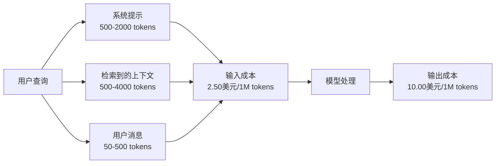
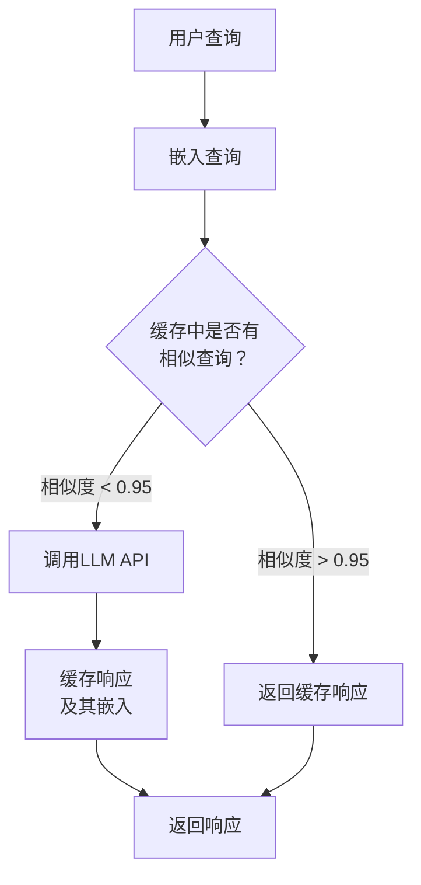
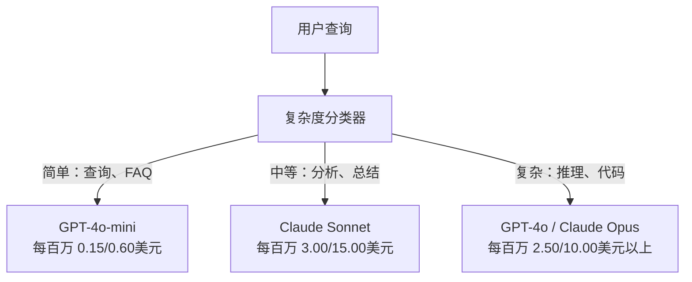

# 缓存、速率限制与成本优化

> 大多数AI初创公司并非死于糟糕的模型，而是死于糟糕的单位经济模型。一次GPT-4o调用仅需几分之一美分。但一万名用户每天发起十次调用，仅输入token每月就要花费250美元——而你尚未收取一分钱。能够存活下来的公司，是把每次API调用当作金融交易，而非普通函数调用的公司。

**类型：** 构建
**语言：** Python
**前置要求：** 第11阶段第9课（函数调用）
**时长：** 约45分钟
**关联内容：** 第11阶段·第15课（提示缓存）——本课涵盖应用层缓存（语义缓存、精确哈希缓存、模型路由）。第15课涵盖提供商层提示缓存（Anthropic的`cache_control`、OpenAI自动缓存、Gemini的`CachedContent`）。两者结合可实现50%-95%的成本降低。

## 学习目标

- 实现语义缓存，从缓存中响应重复或相似查询，而非发起新的API调用
- 计算各提供商的每次请求成本，并实现基于token的速率限制与预算告警
- 构建包含提示压缩、模型路由（昂贵vs廉价）和响应缓存的成本优化层
- 针对不同类型的查询，设计基于精确匹配、语义相似度和前缀缓存的分层缓存策略

## 问题所在

你构建了一个RAG聊天机器人。运行完美，用户喜爱。

然后，账单来了。

GPT-5输入token每百万个5美元，输出每百万个15美元。Claude Opus 4.7输入15美元，输出75美元。Gemini 3 Pro输入1.25美元，输出5美元。GPT-5-mini输入0.25美元，输出2美元。以下价格为示意，请始终查看提供商的最新定价页面。

下面这个计算方式能杀死初创公司：

- 10,000名日活跃用户
- 每人每天10次查询
- 每次查询1,000个输入token（系统提示 + 上下文 + 用户消息）
- 每次响应500个输出token

**每日输入成本：** 10,000 × 10 × 1,000 / 1,000,000 × 2.50美元 = **250美元/天**
**每日输出成本：** 10,000 × 10 × 500 / 1,000,000 × 10.00美元 = **500美元/天**
**月度总计：** **22,500美元/月**

这仅仅是LLM的费用。再加上嵌入、向量数据库托管、基础设施。你面对的是一个每月3万美元的聊天机器人。

残酷之处在于：其中40%-60%的查询几乎是重复的。用户用略微不同的措辞问相同的问题。你的系统提示——在每次请求中完全一致——每次都要收费。RAG检索到的上下文文档，在询问同一主题的不同用户间重复出现。

你正在为冗余计算支付全价。

## 概念

### LLM调用的成本构成

每次API调用包含五个成本组成部分。



系统提示是隐形杀手。每次请求发送一个1500 token的系统提示，仅前缀部分每百万次请求就要花费3.75美元。每日10万次请求，即375美元/天——11,250美元/月——只为了一段从未改变过的文本。

### 提供商缓存：内置折扣

截至2026年，三大主要提供商均提供提供商端提示缓存，但机制各异。详见第11阶段第15课。

| 提供商    | 机制                  | 折扣               | 最小token数                                    | 缓存时长               |
|-----------|-----------------------|--------------------|------------------------------------------------|------------------------|
| Anthropic | 显式cache_control标记 | 缓存命中90%（写入时额外支付25%） | Sonnet/Opus 1,024 tokens，Haiku 2,048 tokens | 默认5分钟；可延长至1小时（写入费用加倍） |
| OpenAI    | 自动前缀匹配          | 缓存命中50%        | 1,024 tokens                                  | 尽力服务，最长1小时    |
| Google Gemini | 显式CachedContent API | 约75%降低（含存储费） | Flash 4,096 / Pro 32,768 tokens              | 用户可配置TTL           |

**Anthropic的方式**是显式的。你使用`cache_control: {"type": "ephemeral"}`标记提示中的某些部分。第一次请求支付25%的写入溢价。后续使用相同前缀的请求获得90%的折扣。一个2000 token的系统提示正常情况下花费0.005美元，缓存命中时只需0.000625美元。10万次请求，每天可节省437.50美元。

**OpenAI的方式**是自动的。任何与之前请求匹配的提示前缀都能获得50%折扣。无需标记。权衡：折扣较少，控制力较低，但零实现成本。

### 语义缓存：你的自定义层

提供商缓存仅适用于相同的前缀。语义缓存处理更棘手的情况：不同查询但含义相同。

“退货政策是什么？”和“我如何退货？”是不同的字符串，但意图相同。语义缓存对两个查询进行嵌入，计算余弦相似度，如果相似度超过阈值（通常为0.92-0.95），则返回缓存的响应。



嵌入成本微乎其微。OpenAI的text-embedding-3-small每百万token仅0.02美元。与完整的LLM调用相比，检查缓存的成本几乎可以忽略不计。

### 精确缓存：哈希与匹配

对于确定性调用（temperature=0、相同模型、相同提示），精确缓存更简单、更快。对整个提示进行哈希，检查缓存，找到则返回。

这完美适用于：
- 系统提示 + 固定上下文 + 完全相同的用户查询
- 使用相同工具定义的函数调用
- 同一文档被多次处理的批量处理

### 速率限制：保护你的预算

速率限制不仅仅关乎公平，更关乎生存。

**令牌桶算法：** 每个用户拥有一个容量为N token的桶，以每秒R的速率填充。一次请求从桶中消耗token。如果桶为空，请求被拒绝。这允许突发放纵（一次用完整个桶），同时强制平均速率。

**按用户配额：** 针对不同用户等级设置每日/每月token限制。

| 等级       | 每日Token限制 | 最大请求数/分钟 | 可访问模型           |
|------------|--------------|----------------|----------------------|
| 免费       | 50,000      | 10             | 仅GPT-4o-mini        |
| Pro        | 500,000     | 60             | GPT-4o、Claude Sonnet|
| 企业       | 5,000,000   | 300            | 所有模型              |

### 模型路由：为合适的工作选择合适的模型

并非每次查询都需要GPT-4o。

“商店几点关门？”不需要一个每百万输出token 10美元的模型。GPT-4o-mini（每百万输出0.60美元）即可完美处理。Claude Haiku（每百万输出1.25美元）也能胜任。一个简单的分类器将廉价查询路由到廉价模型，将复杂查询路由到昂贵模型。



一个调优良好的路由器仅模型成本就能节省40%-70%。

### 成本追踪：知道钱花在哪里

不衡量就无法优化。记录每次API调用，包含：
- 时间戳
- 模型名称
- 输入token数
- 输出token数
- 延迟（毫秒）
- 计算成本（美元）
- 用户ID
- 缓存命中/未命中
- 请求类别

这些数据能揭示哪些功能昂贵，哪些用户消耗量大，以及缓存在哪里效果最显著。

### 批处理：批量折扣

OpenAI的批处理API以异步方式处理请求，享受50%折扣。你可以提交最多50,000个请求的批次，结果将在24小时内返回。

适合批处理的场景：
- 夜间文档处理
- 批量分类
- 评估运行
- 数据增强流水线

不适合：面向用户的实时查询（延迟至关重要）。

### 预算告警与断路器

断路器在达到限制时停止支出。没有它，一个bug或滥用可能在几小时内烧光你的月度预算。

设置三个阈值：
1. **警告**（预算的70%）：发出告警
2. **节流**（预算的85%）：仅切换到廉价模型
3. **停止**（预算的95%）：拒绝新请求，仅返回缓存响应

### 优化堆栈

按顺序应用这些技术。每一层都叠加在前一层之上。

| 层 | 技术 | 典型节省 | 实现工作量 |
|----|------|----------|------------|
| 1  | 提供商提示缓存 | 30-50%   | 低（添加缓存标记） |
| 2  | 精确缓存       | 10-20%   | 低（哈希+字典） |
| 3  | 语义缓存       | 15-30%   | 中（嵌入+相似度） |
| 4  | 模型路由       | 40-70%   | 中（分类器） |
| 5  | 速率限制       | 预算保护 | 低（令牌桶） |
| 6  | 提示压缩       | 10-30%   | 中（重写提示） |
| 7  | 批处理         | 符合条件则50% | 低（批处理API） |

一个RAG应用应用第1-5层后，通常能将成本从每月22,500美元降至4,000-6,000美元。这正是烧钱与构建可持续业务之间的区别。

### 真实节省：优化前后

以下是一个服务于10,000 DAU的RAG聊天机器人的真实分解。

| 指标 | 优化前 | 优化后 | 节省 |
|------|--------|--------|------|
| 月度LLM成本 | $22,500 | $5,200 | 77% |
| 每次查询平均成本 | $0.0075 | $0.0017 | 77% |
| 缓存命中率 | 0% | 52% | -- |
| 路由到mini模型的查询比例 | 0% | 65% | -- |
| P95延迟 | 2,800ms | 900ms（缓存命中：50ms） | 68% |
| 月度嵌入成本 | $0 | $180 | （新增成本） |
| 月度总成本 | $22,500 | $5,380 | 76% |

用于语义缓存的嵌入成本（每月180美元）在缓存命中的第一个小时内即可收回。

## 构建

### 第一步：成本计算器

构建一个token成本计算器，了解主要模型的最新定价。

```python
import hashlib
import time
import json
import math
from dataclasses import dataclass, field


MODEL_PRICING = {
    "gpt-4o": {"input": 2.50, "output": 10.00, "cached_input": 1.25},
    "gpt-4o-mini": {"input": 0.15, "output": 0.60, "cached_input": 0.075},
    "gpt-4.1": {"input": 2.00, "output": 8.00, "cached_input": 0.50},
    "gpt-4.1-mini": {"input": 0.40, "output": 1.60, "cached_input": 0.10},
    "gpt-4.1-nano": {"input": 0.10, "output": 0.40, "cached_input": 0.025},
    "o3": {"input": 2.00, "output": 8.00, "cached_input": 0.50},
    "o3-mini": {"input": 1.10, "output": 4.40, "cached_input": 0.55},
    "o4-mini": {"input": 1.10, "output": 4.40, "cached_input": 0.275},
    "claude-opus-4": {"input": 15.00, "output": 75.00, "cached_input": 1.50},
    "claude-sonnet-4": {"input": 3.00, "output": 15.00, "cached_input": 0.30},
    "claude-haiku-3.5": {"input": 0.80, "output": 4.00, "cached_input": 0.08},
    "gemini-2.5-pro": {"input": 1.25, "output": 10.00, "cached_input": 0.3125},
    "gemini-2.5-flash": {"input": 0.15, "output": 0.60, "cached_input": 0.0375},
}


def calculate_cost(model, input_tokens, output_tokens, cached_input_tokens=0):
    if model not in MODEL_PRICING:
        return {"error": f"Unknown model: {model}"}
    pricing = MODEL_PRICING[model]
    non_cached = input_tokens - cached_input_tokens
    input_cost = (non_cached / 1_000_000) * pricing["input"]
    cached_cost = (cached_input_tokens / 1_000_000) * pricing["cached_input"]
    output_cost = (output_tokens / 1_000_000) * pricing["output"]
    total = input_cost + cached_cost + output_cost
    return {
        "model": model,
        "input_tokens": input_tokens,
        "output_tokens": output_tokens,
        "cached_input_tokens": cached_input_tokens,
        "input_cost": round(input_cost, 6),
        "cached_input_cost": round(cached_cost, 6),
        "output_cost": round(output_cost, 6),
        "total_cost": round(total, 6),
    }
```

### 第二步：精确缓存

对整个提示进行哈希，为完全相同的请求返回缓存响应。

```python
class ExactCache:
    def __init__(self, max_size=1000, ttl_seconds=3600):
        self.cache = {}
        self.max_size = max_size
        self.ttl = ttl_seconds
        self.hits = 0
        self.misses = 0

    def _hash(self, model, messages, temperature):
        key_data = json.dumps({"model": model, "messages": messages, "temperature": temperature}, sort_keys=True)
        return hashlib.sha256(key_data.encode()).hexdigest()

    def get(self, model, messages, temperature=0.0):
        if temperature > 0:
            self.misses += 1
            return None
        key = self._hash(model, messages, temperature)
        if key in self.cache:
            entry = self.cache[key]
            if time.time() - entry["timestamp"] < self.ttl:
                self.hits += 1
                entry["access_count"] += 1
                return entry["response"]
            del self.cache[key]
        self.misses += 1
        return None

    def put(self, model, messages, temperature, response):
        if temperature > 0:
            return
        if len(self.cache) >= self.max_size:
            oldest_key = min(self.cache, key=lambda k: self.cache[k]["timestamp"])
            del self.cache[oldest_key]
        key = self._hash(model, messages, temperature)
        self.cache[key] = {
            "response": response,
            "timestamp": time.time(),
            "access_count": 1,
        }

    def stats(self):
        total = self.hits + self.misses
        return {
            "hits": self.hits,
            "misses": self.misses,
            "hit_rate": round(self.hits / total, 4) if total > 0 else 0,
            "cache_size": len(self.cache),
        }
```

### 第三步：语义缓存

对查询进行嵌入，当相似度超过阈值时返回缓存的响应。

```python
def simple_embed(text):
    words = text.lower().split()
    vocab = {}
    for w in words:
        vocab[w] = vocab.get(w, 0) + 1
    norm = math.sqrt(sum(v * v for v in vocab.values()))
    if norm == 0:
        return {}
    return {k: v / norm for k, v in vocab.items()}


def cosine_similarity(a, b):
    if not a or not b:
        return 0.0
    all_keys = set(a) | set(b)
    dot = sum(a.get(k, 0) * b.get(k, 0) for k in all_keys)
   