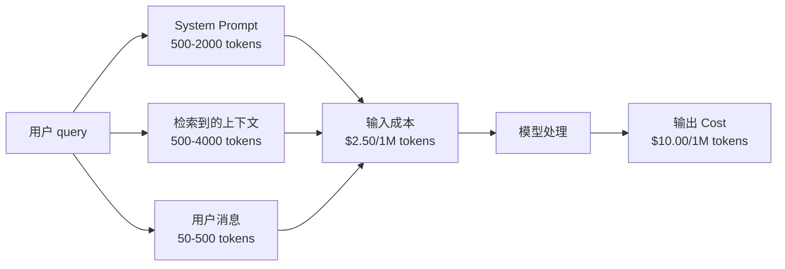
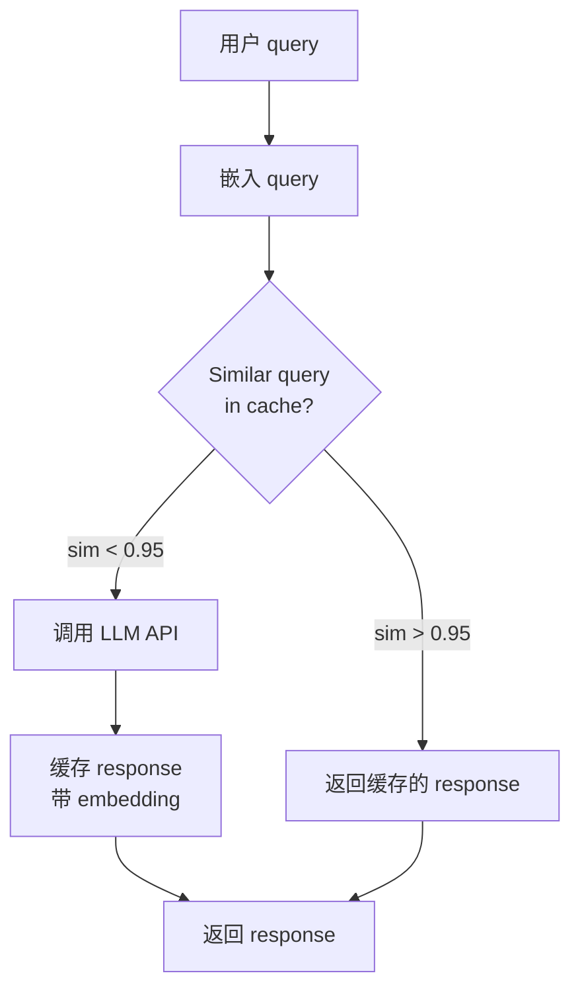
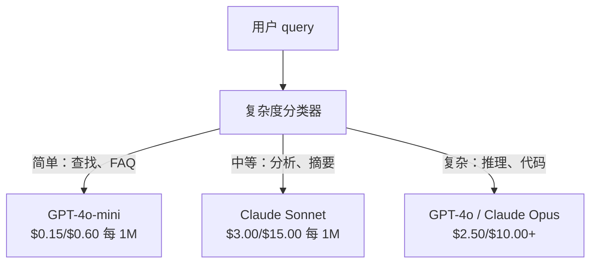

# 缓存、限流与成本优化（Caching, Rate Limiting & Cost Optimization）

> 译注：本文译自同目录 [`en.md`](./en.md)。术语遵循仓根 [TRANSLATION_GUIDE.md](../../../../TRANSLATION_GUIDE.md)。

> 大多数 AI 创业公司不是死于模型不行，而是死于单位经济模型（unit economics）算不过账。一次 GPT-4o 调用只花几分之一美分，可一万用户每天调十次，光 input token 就是 $250，连一块钱收入都还没到账呢。能活下来的公司，是把每一次 API 调用当成金融交易来对待的，不是当成一次普通函数调用。

**Type:** Build
**Languages:** Python
**Prerequisites:** Phase 11 Lesson 09 (Function Calling)
**Time:** ~45 minutes
**Related:** Phase 11 · 15 (Prompt Caching) — 本课讲应用层缓存（语义缓存、精确哈希缓存、模型路由）；第 15 课讲 provider 层 prompt caching（Anthropic 的 cache_control、OpenAI 自动模式、Gemini 的 CachedContent）。两层叠加可以拿到 50–95% 的成本下降。

## 学习目标（Learning Objectives）

- 实现语义缓存：让重复或相似的查询直接命中缓存，而不是再发一次 API 调用
- 计算各 provider 的单次请求成本，落地基于 token 的限流与预算告警
- 搭一层成本优化栈：prompt 压缩、模型路由（贵模型 vs 便宜模型）、响应缓存
- 设计分层缓存策略：精确匹配、语义相似、前缀缓存，针对不同类型的查询各司其职

## 问题（The Problem）

你做了个 RAG 聊天机器人，用得很爽，用户也很爱。

然后账单就来了。

GPT-5 是 input $5/百万 token，output $15/百万。Claude Opus 4.7 是 $15 input / $75 output。Gemini 3 Pro 是 $1.25 input / $5 output。GPT-5-mini 是 $0.25/$2。下文价格仅作示意，实际请查 provider 当前的 pricing 页。

下面这道算术题就是创业公司的杀手：

- 日活 10,000
- 每人每天 10 次查询
- 每次 1,000 个 input token（system prompt + 上下文 + 用户消息）
- 每次 500 个 output token

**每日 input 成本：** 10,000 x 10 x 1,000 / 1,000,000 x $2.50 = **$250/天**
**每日 output 成本：** 10,000 x 10 x 500 / 1,000,000 x $10.00 = **$500/天**
**月度合计：** **$22,500/月**

这还只是 LLM。再加 embedding、向量数据库托管、基础设施，一个聊天机器人轻松奔着 $30,000/月去了。

最残酷的是：这些查询里 40–60% 都是近重复。用户用稍微不同的措辞问着同一个问题。你的 system prompt——每次请求都一模一样——每次都被收一遍钱。RAG 检索回来的上下文文档，在问同类话题的不同用户之间反复出现。

你在为冗余计算支付全价。

## 概念（The Concept）

### 一次 LLM 调用的成本解剖（The Cost Anatomy of an LLM Call）

每次 API 调用都有五个成本组成部分。



System prompt 是隐形的杀手。一个 1,500 token 的 system prompt 跟着每个请求发一遍，光这段前缀，每百万次请求就要烧掉 $3.75。日请求量 100K 就是 $375/天——$11,250/月——而这段文本根本就不变。

### Provider 缓存：内置折扣（Provider Caching: Built-in Discounts）

到 2026 年，三家主要 provider 都提供了 provider 侧的 prompt caching，但机制各不相同。深入细节看 Phase 11 · 15。

| Provider | 机制 | 折扣 | 最低要求 | 缓存有效期 |
|----------|-----------|----------|---------|----------------|
| Anthropic | 显式 cache_control 标记 | cache 命中 90% off（写入时多付 25%） | 1,024 token（Sonnet/Opus），2,048（Haiku） | 默认 5 分钟；扩展到 1 小时（写入溢价 2x） |
| OpenAI | 自动前缀匹配 | cache 命中 50% off | 1,024 token | 尽力而为，最长 1 小时 |
| Google Gemini | 显式 CachedContent API | 约 75% 下降（外加存储费） | 4,096（Flash）/ 32,768（Pro） | 用户可配置 TTL |

**Anthropic 的方式**是显式的。你用 `cache_control: {"type": "ephemeral"}` 标记 prompt 中要缓存的片段。第一次请求多付 25% 写入溢价；后续相同前缀的请求享受 90% 折扣。一段 2,000 token 的 system prompt 平时要 $0.005，命中缓存只要 $0.000625。100K 次请求一天就省下 $437.50。

**OpenAI 的方式**是自动的。任何与最近请求匹配的 prompt 前缀，自动享受 50% 折扣。不用加任何标记。代价是：折扣小一些、控制权小一些，但实现成本是零。

### 语义缓存：你自己的那一层（Semantic Caching: Your Custom Layer）

provider 缓存只对完全相同的前缀生效。语义缓存负责更难的情形：不同写法、相同意图。

"What is the return policy?" 和 "How do I return an item?" 是不同的字符串，但意图完全一致。语义缓存把两条查询都做 embedding，算 cosine 相似度，相似度超过阈值（通常 0.92–0.95）就返回缓存的响应。



embedding 的开销可以忽略。OpenAI 的 text-embedding-3-small 是 $0.02/百万 token。比起一次完整的 LLM 调用，查一次缓存几乎不花钱。

### 精确缓存：哈希一下匹配一下（Exact Caching: Hash and Match）

对于确定性调用（temperature=0、同模型、同 prompt），精确缓存更简单也更快。把整段 prompt 哈希一下，去缓存里查，命中就返回。

它适用于：

- system prompt + 固定上下文 + 完全相同的用户查询
- 工具定义完全相同的 function calling
- 同一文档被多次处理的批处理场景

### 限流：保护你的预算（Rate Limiting: Protecting Your Budget）

限流不只是为了公平，更是为了活下去。

**令牌桶（token bucket）算法：** 每个用户分一个容量为 N 的桶，按每秒 R 的速率续杯。一次请求消耗若干 token；桶空了就拒绝。这样既允许突发（一次性把桶用光），又强制平均速率。

**按用户配额：** 给不同用户档位设定每日/每月 token 上限。

| 档位 | 每日 token 上限 | 每分钟最大请求数 | 模型权限 |
|------|------------------|------------------|-------------|
| Free | 50,000 | 10 | 仅限 GPT-4o-mini |
| Pro | 500,000 | 60 | GPT-4o、Claude Sonnet |
| Enterprise | 5,000,000 | 300 | 全部模型 |

### 模型路由：好钢用在刀刃上（Model Routing: Right Model for the Right Job）

不是每个查询都需要 GPT-4o。

"What time does the store close?" 根本用不到 $10/M-output 的模型，GPT-4o-mini（$0.60/M output）完全搞得定，Claude Haiku（$1.25/M output）也能搞定。一个简单的分类器就能把便宜的查询路由给便宜模型，把复杂的查询路由给贵模型。



调好的路由器单单在模型成本上就能省 40–70%。

### 成本追踪：知道钱花在哪儿（Cost Tracking: Know Where the Money Goes）

不能度量的东西就没法优化。每次 API 调用都要记录：

- 时间戳
- 模型名
- input token 数
- output token 数
- 延迟（ms）
- 计算出的成本（$）
- 用户 ID
- 缓存命中/未命中
- 请求类别

这些数据能告诉你：哪些功能贵、哪些用户是重度消费者、缓存在哪里收益最大。

### 批处理：批量折扣（Batching: Bulk Discounts）

OpenAI 的 Batch API 异步处理请求，给 50% 折扣。一次最多提交 50,000 个请求，结果会在 24 小时内回来。

适合用 batch 的场景：

- 夜间批量文档处理
- 批量分类
- 评估跑批
- 数据增强流水线

**不适合：** 实时面向用户的查询（延迟很关键）。

### 预算告警与熔断器（Budget Alerts and Circuit Breakers）

熔断器（circuit breaker）的作用是：到达阈值就停止花钱。没有它的话，一个 bug 或一次滥用就能在几小时内烧光月预算。

设三道阈值：

1. **Warning**（70% 预算）：发告警
2. **Throttle**（85% 预算）：只切到便宜模型
3. **Stop**（95% 预算）：拒绝新请求，只回缓存

### 优化栈（The Optimization Stack）

按以下顺序应用，每一层都在前一层基础上叠加收益。

| 层 | 技术 | 典型节省 | 实现成本 |
|-------|-----------|----------------|----------------------|
| 1 | provider prompt caching | 30–50% | 低（加 cache 标记） |
| 2 | 精确缓存 | 10–20% | 低（哈希 + 字典） |
| 3 | 语义缓存 | 15–30% | 中（embedding + 相似度） |
| 4 | 模型路由 | 40–70% | 中（分类器） |
| 5 | 限流 | 预算保护 | 低（令牌桶） |
| 6 | prompt 压缩 | 10–30% | 中（重写 prompt） |
| 7 | 批处理 | 适用部分 50% off | 低（Batch API） |

一个 RAG 应用应用 1–5 层，通常能把成本从 $22,500/月降到 $4,000–6,000/月。这就是「烧光跑道」和「能成生意」之间的差距。

### 真实节省：优化前 vs 优化后（Real Savings: Before and After）

下面是一个 10,000 DAU 的 RAG 聊天机器人的真实拆解。

| 指标 | 优化前 | 优化后 | 节省 |
|--------|--------------------|--------------------|---------|
| 月度 LLM 成本 | $22,500 | $5,200 | 77% |
| 平均每次查询成本 | $0.0075 | $0.0017 | 77% |
| 缓存命中率 | 0% | 52% | -- |
| 路由到 mini 的比例 | 0% | 65% | -- |
| P95 延迟 | 2,800ms | 900ms（缓存命中：50ms） | 68% |
| 月度 embedding 成本 | $0 | $180 | （新增成本） |
| 月度总成本 | $22,500 | $5,380 | 76% |

语义缓存的 embedding 成本（$180/月），命中缓存的第一个小时就把自己赚回来了。

## 动手实现（Build It）

### Step 1：成本计算器（Cost Calculator）

写一个 token 成本计算器，里面塞上主要模型的当前价格。

```python
import hashlib
import time
import json
import math
from dataclasses import dataclass, field


MODEL_PRICING = {
    "gpt-4o": {"input": 2.50, "output": 10.00, "cached_input": 1.25},
    "gpt-4o-mini": {"input": 0.15, "output": 0.60, "cached_input": 0.075},
    "gpt-4.1": {"input": 2.00, "output": 8.00, "cached_input": 0.50},
    "gpt-4.1-mini": {"input": 0.40, "output": 1.60, "cached_input": 0.10},
    "gpt-4.1-nano": {"input": 0.10, "output": 0.40, "cached_input": 0.025},
    "o3": {"input": 2.00, "output": 8.00, "cached_input": 0.50},
    "o3-mini": {"input": 1.10, "output": 4.40, "cached_input": 0.55},
    "o4-mini": {"input": 1.10, "output": 4.40, "cached_input": 0.275},
    "claude-opus-4": {"input": 15.00, "output": 75.00, "cached_input": 1.50},
    "claude-sonnet-4": {"input": 3.00, "output": 15.00, "cached_input": 0.30},
    "claude-haiku-3.5": {"input": 0.80, "output": 4.00, "cached_input": 0.08},
    "gemini-2.5-pro": {"input": 1.25, "output": 10.00, "cached_input": 0.3125},
    "gemini-2.5-flash": {"input": 0.15, "output": 0.60, "cached_input": 0.0375},
}


def calculate_cost(model, input_tokens, output_tokens, cached_input_tokens=0):
    if model not in MODEL_PRICING:
        return {"error": f"Unknown model: {model}"}
    pricing = MODEL_PRICING[model]
    non_cached = input_tokens - cached_input_tokens
    input_cost = (non_cached / 1_000_000) * pricing["input"]
    cached_cost = (cached_input_tokens / 1_000_000) * pricing["cached_input"]
    output_cost = (output_tokens / 1_000_000) * pricing["output"]
    total = input_cost + cached_cost + output_cost
    return {
        "model": model,
        "input_tokens": input_tokens,
        "output_tokens": output_tokens,
        "cached_input_tokens": cached_input_tokens,
        "input_cost": round(input_cost, 6),
        "cached_input_cost": round(cached_cost, 6),
        "output_cost": round(output_cost, 6),
        "total_cost": round(total, 6),
    }
```

### Step 2：精确缓存（Exact Cache）

把整段 prompt 哈希一下，相同请求直接返回缓存。

```python
class ExactCache:
    def __init__(self, max_size=1000, ttl_seconds=3600):
        self.cache = {}
        self.max_size = max_size
        self.ttl = ttl_seconds
        self.hits = 0
        self.misses = 0

    def _hash(self, model, messages, temperature):
        key_data = json.dumps({"model": model, "messages": messages, "temperature": temperature}, sort_keys=True)
        return hashlib.sha256(key_data.encode()).hexdigest()

    def get(self, model, messages, temperature=0.0):
        if temperature > 0:
            self.misses += 1
            return None
        key = self._hash(model, messages, temperature)
        if key in self.cache:
            entry = self.cache[key]
            if time.time() - entry["timestamp"] < self.ttl:
                self.hits += 1
                entry["access_count"] += 1
                return entry["response"]
            del self.cache[key]
        self.misses += 1
        return None

    def put(self, model, messages, temperature, response):
        if temperature > 0:
            return
        if len(self.cache) >= self.max_size:
            oldest_key = min(self.cache, key=lambda k: self.cache[k]["timestamp"])
            del self.cache[oldest_key]
        key = self._hash(model, messages, temperature)
        self.cache[key] = {
            "response": response,
            "timestamp": time.time(),
            "access_count": 1,
        }

    def stats(self):
        total = self.hits + self.misses
        return {
            "hits": self.hits,
            "misses": self.misses,
            "hit_rate": round(self.hits / total, 4) if total > 0 else 0,
            "cache_size": len(self.cache),
        }
```

### Step 3：语义缓存（Semantic Cache）

把查询做 embedding，相似度超过阈值就返回缓存的响应。

```python
def simple_embed(text):
    words = text.lower().split()
    vocab = {}
    for w in words:
        vocab[w] = vocab.get(w, 0) + 1
    norm = math.sqrt(sum(v * v for v in vocab.values()))
    if norm == 0:
        return {}
    return {k: v / norm for k, v in vocab.items()}


def cosine_similarity(a, b):
    if not a or not b:
        return 0.0
    all_keys = set(a) | set(b)
    dot = sum(a.get(k, 0) * b.get(k, 0) for k in all_keys)
    return dot


class SemanticCache:
    def __init__(self, similarity_threshold=0.85, max_size=500, ttl_seconds=3600):
        self.entries = []
        self.threshold = similarity_threshold
        self.max_size = max_size
        self.ttl = ttl_seconds
        self.hits = 0
        self.misses = 0

    def get(self, query):
        query_embedding = simple_embed(query)
        now = time.time()
        best_match = None
        best_sim = 0.0
        for entry in self.entries:
            if now - entry["timestamp"] > self.ttl:
                continue
            sim = cosine_similarity(query_embedding, entry["embedding"])
            if sim > best_sim:
                best_sim = sim
                best_match = entry
        if best_match and best_sim >= self.threshold:
            self.hits += 1
            best_match["access_count"] += 1
            return {"response": best_match["response"], "similarity": round(best_sim, 4), "original_query": best_match["query"]}
        self.misses += 1
        return None

    def put(self, query, response):
        if len(self.entries) >= self.max_size:
            self.entries.sort(key=lambda e: e["timestamp"])
            self.entries.pop(0)
        self.entries.append({
            "query": query,
            "embedding": simple_embed(query),
            "response": response,
            "timestamp": time.time(),
            "access_count": 1,
        })

    def stats(self):
        total = self.hits + self.misses
        return {
            "hits": self.hits,
            "misses": self.misses,
            "hit_rate": round(self.hits / total, 4) if total > 0 else 0,
            "cache_size": len(self.entries),
        }
```

### Step 4：限流器（Rate Limiter）

带按用户配额的令牌桶限流器。

```python
class TokenBucketRateLimiter:
    def __init__(self):
        self.buckets = {}
        self.tiers = {
            "free": {"capacity": 50_000, "refill_rate": 500, "max_requests_per_min": 10},
            "pro": {"capacity": 500_000, "refill_rate": 5_000, "max_requests_per_min": 60},
            "enterprise": {"capacity": 5_000_000, "refill_rate": 50_000, "max_requests_per_min": 300},
        }

    def _get_bucket(self, user_id, tier="free"):
        if user_id not in self.buckets:
            tier_config = self.tiers.get(tier, self.tiers["free"])
            self.buckets[user_id] = {
                "tokens": tier_config["capacity"],
                "capacity": tier_config["capacity"],
                "refill_rate": tier_config["refill_rate"],
                "last_refill": time.time(),
                "request_timestamps": [],
                "max_rpm": tier_config["max_requests_per_min"],
                "tier": tier,
                "total_tokens_used": 0,
            }
        return self.buckets[user_id]

    def _refill(self, bucket):
        now = time.time()
        elapsed = now - bucket["last_refill"]
        refill = int(elapsed * bucket["refill_rate"])
        if refill > 0:
            bucket["tokens"] = min(bucket["capacity"], bucket["tokens"] + refill)
            bucket["last_refill"] = now

    def check(self, user_id, tokens_needed, tier="free"):
        bucket = self._get_bucket(user_id, tier)
        self._refill(bucket)
        now = time.time()
        bucket["request_timestamps"] = [t for t in bucket["request_timestamps"] if now - t < 60]
        if len(bucket["request_timestamps"]) >= bucket["max_rpm"]:
            return {"allowed": False, "reason": "rate_limit", "retry_after_seconds": 60 - (now - bucket["request_timestamps"][0])}
        if bucket["tokens"] < tokens_needed:
            deficit = tokens_needed - bucket["tokens"]
            wait = deficit / bucket["refill_rate"]
            return {"allowed": False, "reason": "token_limit", "tokens_available": bucket["tokens"], "retry_after_seconds": round(wait, 1)}
        return {"allowed": True, "tokens_available": bucket["tokens"]}

    def consume(self, user_id, tokens_used, tier="free"):
        bucket = self._get_bucket(user_id, tier)
        bucket["tokens"] -= tokens_used
        bucket["request_timestamps"].append(time.time())
        bucket["total_tokens_used"] += tokens_used

    def get_usage(self, user_id):
        if user_id not in self.buckets:
            return {"error": "User not found"}
        b = self.buckets[user_id]
        return {
            "user_id": user_id,
            "tier": b["tier"],
            "tokens_remaining": b["tokens"],
            "capacity": b["capacity"],
            "total_tokens_used": b["total_tokens_used"],
            "utilization": round(b["total_tokens_used"] / b["capacity"], 4) if b["capacity"] else 0,
        }
```

### Step 5：成本追踪器（Cost Tracker）

记录每次调用，计算累计开销。

```python
class CostTracker:
    def __init__(self, monthly_budget=1000.0):
        self.logs = []
        self.monthly_budget = monthly_budget
        self.alerts = []

    def log_call(self, model, input_tokens, output_tokens, cached_input_tokens=0, latency_ms=0, user_id="anonymous", cache_status="miss"):
        cost = calculate_cost(model, input_tokens, output_tokens, cached_input_tokens)
        entry = {
            "timestamp": time.time(),
            "model": model,
            "input_tokens": input_tokens,
            "output_tokens": output_tokens,
            "cached_input_tokens": cached_input_tokens,
            "latency_ms": latency_ms,
            "cost": cost["total_cost"],
            "user_id": user_id,
            "cache_status": cache_status,
        }
        self.logs.append(entry)
        self._check_budget()
        return entry

    def _check_budget(self):
        total = self.total_cost()
        pct = total / self.monthly_budget if self.monthly_budget > 0 else 0
        if pct >= 0.95 and not any(a["level"] == "stop" for a in self.alerts):
            self.alerts.append({"level": "stop", "message": f"Budget 95% consumed: ${total:.2f}/${self.monthly_budget:.2f}", "timestamp": time.time()})
        elif pct >= 0.85 and not any(a["level"] == "throttle" for a in self.alerts):
            self.alerts.append({"level": "throttle", "message": f"Budget 85% consumed: ${total:.2f}/${self.monthly_budget:.2f}", "timestamp": time.time()})
        elif pct >= 0.70 and not any(a["level"] == "warning" for a in self.alerts):
            self.alerts.append({"level": "warning", "message": f"Budget 70% consumed: ${total:.2f}/${self.monthly_budget:.2f}", "timestamp": time.time()})

    def total_cost(self):
        return round(sum(e["cost"] for e in self.logs), 6)

    def cost_by_model(self):
        by_model = {}
        for e in self.logs:
            m = e["model"]
            if m not in by_model:
                by_model[m] = {"calls": 0, "cost": 0, "input_tokens": 0, "output_tokens": 0}
            by_model[m]["calls"] += 1
            by_model[m]["cost"] = round(by_model[m]["cost"] + e["cost"], 6)
            by_model[m]["input_tokens"] += e["input_tokens"]
            by_model[m]["output_tokens"] += e["output_tokens"]
        return by_model

    def cache_savings(self):
        cache_hits = [e for e in self.logs if e["cache_status"] == "hit"]
        if not cache_hits:
            return {"saved": 0, "cache_hits": 0}
        saved = 0
        for e in cache_hits:
            full_cost = calculate_cost(e["model"], e["input_tokens"], e["output_tokens"])
            saved += full_cost["total_cost"]
        return {"saved": round(saved, 4), "cache_hits": len(cache_hits)}

    def summary(self):
        if not self.logs:
            return {"total_calls": 0, "total_cost": 0}
        total_latency = sum(e["latency_ms"] for e in self.logs)
        cache_hits = sum(1 for e in self.logs if e["cache_status"] == "hit")
        return {
            "total_calls": len(self.logs),
            "total_cost": self.total_cost(),
            "avg_cost_per_call": round(self.total_cost() / len(self.logs), 6),
            "avg_latency_ms": round(total_latency / len(self.logs), 1),
            "cache_hit_rate": round(cache_hits / len(self.logs), 4),
            "cost_by_model": self.cost_by_model(),
            "cache_savings": self.cache_savings(),
            "budget_remaining": round(self.monthly_budget - self.total_cost(), 2),
            "budget_utilization": round(self.total_cost() / self.monthly_budget, 4) if self.monthly_budget > 0 else 0,
            "alerts": self.alerts,
        }
```

### Step 6：模型路由器（Model Router）

把查询路由到能搞定它的最便宜模型。

```python
SIMPLE_KEYWORDS = ["what time", "hours", "address", "phone", "price", "return policy", "hello", "hi", "thanks", "yes", "no"]
COMPLEX_KEYWORDS = ["analyze", "compare", "explain why", "write code", "debug", "architect", "design", "trade-off", "evaluate"]


def classify_complexity(query):
    q = query.lower()
    if len(q.split()) <= 5 or any(kw in q for kw in SIMPLE_KEYWORDS):
        return "simple"
    if any(kw in q for kw in COMPLEX_KEYWORDS):
        return "complex"
    return "medium"


def route_model(query, tier="pro"):
    complexity = classify_complexity(query)
    routing_table = {
        "simple": {"free": "gpt-4.1-nano", "pro": "gpt-4o-mini", "enterprise": "gpt-4o-mini"},
        "medium": {"free": "gpt-4o-mini", "pro": "claude-sonnet-4", "enterprise": "claude-sonnet-4"},
        "complex": {"free": "gpt-4o-mini", "pro": "gpt-4o", "enterprise": "claude-opus-4"},
    }
    model = routing_table[complexity].get(tier, "gpt-4o-mini")
    return {"query": query, "complexity": complexity, "model": model, "tier": tier}
```

### Step 7：跑 demo（Run the Demo）

```python
def simulate_llm_call(model, query):
    input_tokens = len(query.split()) * 4 + 500
    output_tokens = 150 + (len(query.split()) * 2)
    latency = 200 + (output_tokens * 2)
    return {
        "model": model,
        "response": f"[Simulated {model} response to: {query[:50]}...]",
        "input_tokens": input_tokens,
        "output_tokens": output_tokens,
        "latency_ms": latency,
    }


def run_demo():
    print("=" * 60)
    print("  Caching, Rate Limiting & Cost Optimization Demo")
    print("=" * 60)

    print("\n--- Model Pricing ---")
    for model, pricing in list(MODEL_PRICING.items())[:6]:
        cost_1k = calculate_cost(model, 1000, 500)
        print(f"  {model}: ${cost_1k['total_cost']:.6f} per 1K in + 500 out")

    print("\n--- Cost Comparison: 100K Requests ---")
    for model in ["gpt-4o", "gpt-4o-mini", "claude-sonnet-4", "claude-haiku-3.5"]:
        cost = calculate_cost(model, 1000 * 100_000, 500 * 100_000)
        print(f"  {model}: ${cost['total_cost']:.2f}")

    print("\n--- Anthropic Cache Savings ---")
    no_cache = calculate_cost("claude-sonnet-4", 2000, 500, 0)
    with_cache = calculate_cost("claude-sonnet-4", 2000, 500, 1500)
    saving = no_cache["total_cost"] - with_cache["total_cost"]
    print(f"  Without cache: ${no_cache['total_cost']:.6f}")
    print(f"  With 1500 cached tokens: ${with_cache['total_cost']:.6f}")
    print(f"  Savings per call: ${saving:.6f} ({saving/no_cache['total_cost']*100:.1f}%)")

    exact_cache = ExactCache(max_size=100, ttl_seconds=300)
    semantic_cache = SemanticCache(similarity_threshold=0.75, max_size=100)
    rate_limiter = TokenBucketRateLimiter()
    tracker = CostTracker(monthly_budget=100.0)

    print("\n--- Exact Cache ---")
    messages_1 = [{"role": "user", "content": "What is the return policy?"}]
    result = exact_cache.get("gpt-4o-mini", messages_1, 0.0)
    print(f"  First lookup: {'HIT' if result else 'MISS'}")
    exact_cache.put("gpt-4o-mini", messages_1, 0.0, "You can return items within 30 days.")
    result = exact_cache.get("gpt-4o-mini", messages_1, 0.0)
    print(f"  Second lookup: {'HIT' if result else 'MISS'} -> {result}")
    result = exact_cache.get("gpt-4o-mini", messages_1, 0.7)
    print(f"  With temp=0.7: {'HIT' if result else 'MISS (non-deterministic, skip cache)'}")
    print(f"  Stats: {exact_cache.stats()}")

    print("\n--- Semantic Cache ---")
    test_queries = [
        ("What is the return policy?", "Items can be returned within 30 days with receipt."),
        ("How do I return an item?", None),
        ("What are your store hours?", "We are open 9am-9pm Monday through Saturday."),
        ("When does the store open?", None),
        ("Tell me about quantum computing", "Quantum computers use qubits..."),
        ("Explain quantum mechanics", None),
    ]
    for query, response in test_queries:
        cached = semantic_cache.get(query)
        if cached:
            print(f"  '{query[:40]}' -> CACHE HIT (sim={cached['similarity']}, original='{cached['original_query'][:40]}')")
        elif response:
            semantic_cache.put(query, response)
            print(f"  '{query[:40]}' -> MISS (stored)")
        else:
            print(f"  '{query[:40]}' -> MISS (no match)")
    print(f"  Stats: {semantic_cache.stats()}")

    print("\n--- Rate Limiting ---")
    for i in range(12):
        check = rate_limiter.check("user_1", 1000, "free")
        if check["allowed"]:
            rate_limiter.consume("user_1", 1000, "free")
        status = "OK" if check["allowed"] else f"BLOCKED ({check['reason']})"
        if i < 5 or not check["allowed"]:
            print(f"  Request {i+1}: {status}")
    print(f"  Usage: {rate_limiter.get_usage('user_1')}")

    print("\n--- Model Routing ---")
    routing_queries = [
        "What time do you close?",
        "Summarize this quarterly earnings report",
        "Analyze the trade-offs between microservices and monoliths",
        "Hello",
        "Write code for a binary search tree with deletion",
    ]
    for q in routing_queries:
        route = route_model(q, "pro")
        print(f"  '{q[:50]}' -> {route['model']} ({route['complexity']})")

    print("\n--- Full Pipeline: Before vs After Optimization ---")
    queries = [
        "What is the return policy?",
        "How do I return something?",
        "What are your hours?",
        "When do you open?",
        "Explain the difference between TCP and UDP",
        "Compare TCP vs UDP protocols",
        "Hello",
        "What is your phone number?",
        "Write a Python function to sort a list",
        "Analyze the pros and cons of serverless architecture",
    ]

    print("\n  [Before: no caching, single model (gpt-4o)]")
    tracker_before = CostTracker(monthly_budget=1000.0)
    for q in queries:
        result = simulate_llm_call("gpt-4o", q)
        tracker_before.log_call("gpt-4o", result["input_tokens"], result["output_tokens"], latency_ms=result["latency_ms"], cache_status="miss")
    before = tracker_before.summary()
    print(f"  Total cost: ${before['total_cost']:.6f}")
    print(f"  Avg cost/call: ${before['avg_cost_per_call']:.6f}")
    print(f"  Avg latency: {before['avg_latency_ms']}ms")

    print("\n  [After: caching + routing + rate limiting]")
    exact_c = ExactCache()
    semantic_c = SemanticCache(similarity_threshold=0.75)
    tracker_after = CostTracker(monthly_budget=1000.0)

    for q in queries:
        messages = [{"role": "user", "content": q}]
        cached = exact_c.get("gpt-4o", messages, 0.0)
        if cached:
            tracker_after.log_call("gpt-4o-mini", 0, 0, latency_ms=5, cache_status="hit")
            continue
        sem_cached = semantic_c.get(q)
        if sem_cached:
            tracker_after.log_call("gpt-4o-mini", 0, 0, latency_ms=15, cache_status="hit")
            continue
        route = route_model(q)
        result = simulate_llm_call(route["model"], q)
        tracker_after.log_call(route["model"], result["input_tokens"], result["output_tokens"], latency_ms=result["latency_ms"], cache_status="miss")
        exact_c.put(route["model"], messages, 0.0, result["response"])
        semantic_c.put(q, result["response"])

    after = tracker_after.summary()
    print(f"  Total cost: ${after['total_cost']:.6f}")
    print(f"  Avg cost/call: ${after['avg_cost_per_call']:.6f}")
    print(f"  Avg latency: {after['avg_latency_ms']}ms")
    print(f"  Cache hit rate: {after['cache_hit_rate']:.0%}")

    if before["total_cost"] > 0:
        savings_pct = (1 - after["total_cost"] / before["total_cost"]) * 100
        print(f"\n  SAVINGS: {savings_pct:.1f}% cost reduction")
        print(f"  Latency improvement: {(1 - after['avg_latency_ms'] / before['avg_latency_ms']) * 100:.1f}% faster")

    print("\n--- Budget Alerts Demo ---")
    alert_tracker = CostTracker(monthly_budget=0.01)
    for i in range(5):
        alert_tracker.log_call("gpt-4o", 5000, 2000, latency_ms=500)
    print(f"  Total spent: ${alert_tracker.total_cost():.6f} / ${alert_tracker.monthly_budget}")
    for alert in alert_tracker.alerts:
        print(f"  ALERT [{alert['level'].upper()}]: {alert['message']}")

    print("\n--- Cost Breakdown by Model ---")
    multi_tracker = CostTracker(monthly_budget=500.0)
    for _ in range(50):
        multi_tracker.log_call("gpt-4o-mini", 800, 200, latency_ms=150)
    for _ in range(30):
        multi_tracker.log_call("claude-sonnet-4", 1500, 500, latency_ms=400)
    for _ in range(10):
        multi_tracker.log_call("gpt-4o", 2000, 800, latency_ms=600)
    for _ in range(10):
        multi_tracker.log_call("claude-opus-4", 3000, 1000, latency_ms=1200)
    breakdown = multi_tracker.cost_by_model()
    for model, data in sorted(breakdown.items(), key=lambda x: x[1]["cost"], reverse=True):
        print(f"  {model}: {data['calls']} calls, ${data['cost']:.6f}, {data['input_tokens']:,} in / {data['output_tokens']:,} out")
    print(f"  Total: ${multi_tracker.total_cost():.6f}")

    print("\n" + "=" * 60)
    print("  Demo complete.")
    print("=" * 60)


if __name__ == "__main__":
    run_demo()
```

## 用起来（Use It）

### Anthropic Prompt Caching

```python
# import anthropic
#
# client = anthropic.Anthropic()
#
# response = client.messages.create(
#     model="claude-sonnet-4-20250514",
#     max_tokens=1024,
#     system=[
#         {
#             "type": "text",
#             "text": "You are a helpful customer support agent for Acme Corp...",
#             "cache_control": {"type": "ephemeral"},
#         }
#     ],
#     messages=[{"role": "user", "content": "What is the return policy?"}],
# )
#
# print(f"Input tokens: {response.usage.input_tokens}")
# print(f"Cache creation tokens: {response.usage.cache_creation_input_tokens}")
# print(f"Cache read tokens: {response.usage.cache_read_input_tokens}")
```

第一次调用是写入缓存（多付 25%）。之后每个带相同 system prompt 前缀的请求都从缓存读（90% 折扣）。缓存有效期 5 分钟，每次命中都会重置计时器。

### OpenAI 自动缓存（OpenAI Automatic Caching）

```python
# from openai import OpenAI
#
# client = OpenAI()
#
# response = client.chat.completions.create(
#     model="gpt-4o",
#     messages=[
#         {"role": "system", "content": "You are a helpful customer support agent..."},
#         {"role": "user", "content": "What is the return policy?"},
#     ],
# )
#
# print(f"Prompt tokens: {response.usage.prompt_tokens}")
# print(f"Cached tokens: {response.usage.prompt_tokens_details.cached_tokens}")
# print(f"Completion tokens: {response.usage.completion_tokens}")
```

OpenAI 会自动缓存。任何 1,024 token 以上、与最近请求匹配的 prompt 前缀，都自动享受 50% 折扣。不需要改代码——只需检查响应里的 `prompt_tokens_details.cached_tokens` 来确认它生效了。

### OpenAI Batch API

```python
# import json
# from openai import OpenAI
#
# client = OpenAI()
#
# requests = []
# for i, query in enumerate(queries):
#     requests.append({
#         "custom_id": f"request-{i}",
#         "method": "POST",
#         "url": "/v1/chat/completions",
#         "body": {
#             "model": "gpt-4o-mini",
#             "messages": [{"role": "user", "content": query}],
#         },
#     })
#
# with open("batch_input.jsonl", "w") as f:
#     for r in requests:
#         f.write(json.dumps(r) + "\n")
#
# batch_file = client.files.create(file=open("batch_input.jsonl", "rb"), purpose="batch")
# batch = client.batches.create(input_file_id=batch_file.id, endpoint="/v1/chat/completions", completion_window="24h")
# print(f"Batch ID: {batch.id}, Status: {batch.status}")
```

Batch API 对所有 token 一律打 5 折，结果在 24 小时内回来。非实时工作流的最佳搭档：评估、数据打标、批量摘要。

### 用 Redis 上线的语义缓存（Production Semantic Cache with Redis）

```python
# import redis
# import numpy as np
# from openai import OpenAI
#
# r = redis.Redis()
# client = OpenAI()
#
# def get_embedding(text):
#     response = client.embeddings.create(model="text-embedding-3-small", input=text)
#     return response.data[0].embedding
#
# def semantic_cache_lookup(query, threshold=0.95):
#     query_emb = np.array(get_embedding(query))
#     keys = r.keys("cache:emb:*")
#     best_sim, best_key = 0, None
#     for key in keys:
#         stored_emb = np.frombuffer(r.get(key), dtype=np.float32)
#         sim = np.dot(query_emb, stored_emb) / (np.linalg.norm(query_emb) * np.linalg.norm(stored_emb))
#         if sim > best_sim:
#             best_sim, best_key = sim, key
#     if best_sim >= threshold and best_key:
#         response_key = best_key.decode().replace("cache:emb:", "cache:resp:")
#         return r.get(response_key).decode()
#     return None
```

上线时把这种线性扫描换成向量索引（Redis Vector Search、Pinecone、pgvector）。线性扫对 <1,000 条还行；再多就上 ANN（approximate nearest neighbor，近似最近邻），查询复杂度 O(log n)。

## 上线部署（Ship It）

本课产出 `outputs/prompt-cost-optimizer.md`——一段可复用的 prompt，用来分析你的 LLM 应用并给出具体的成本优化建议（含预估节省）。

还产出 `outputs/skill-cost-patterns.md`——一份决策框架，帮你为自己的场景挑对缓存策略、限流配置、模型路由规则。

## 练习（Exercises）

1. **给语义缓存加上 LRU 淘汰。** 把现在的「最旧优先」换成 least-recently-used。给每个条目记录最后访问时间，缓存满时淘汰访问时间最旧的条目。在 100 次查询里对比两种策略的命中率。

2. **写一个成本预估工具。** 给定一段 API 调用日志（CostTracker 的 logs），用过去 7 天滑动均值预估下个月的成本，把工作日/周末模式考虑进去。如果预估月成本超过预算 20% 以上就触发告警。

3. **实现分层语义缓存。** 用两个相似度阈值：0.98 是高置信命中（直接返回）；0.90 是中等置信命中（返回时附带一句免责声明："Based on a similar previous question..."）。记录每次命中来自哪一层，测一下用户满意度的差异。

4. **写一个模型路由分类器。** 把基于关键词的分类器换成基于 embedding 的：先 embedding 50 条带标签的查询（simple/medium/complex），新查询就找最近的那个标注样本。在一个 20 条的测试集上测分类准确率。

5. **实现带降级档位的熔断器。** 70% 预算时记一条 warning；85% 时把所有路由强制切到最便宜的模型（gpt-4o-mini）；95% 时只回缓存、新查询直接拒。模拟一个 $1.00 预算下跑 1,000 个请求，验证三道阈值都按预期触发。

## 关键术语（Key Terms）

| 术语 | 大家嘴上怎么说 | 实际是什么意思 |
|------|----------------|----------------------|
| Prompt caching | "缓存 system prompt" | provider 层缓存：相同 prompt 前缀重复时享受折扣（Anthropic 90%，OpenAI 50%）。OpenAI 不用改代码；Anthropic 要显式打标记 |
| Semantic caching | "智能缓存" | 把查询做 embedding，算与历史查询的相似度，相似度过阈值就返回缓存的响应——能抓住精确匹配漏掉的同义改写 |
| Exact caching | "哈希缓存" | 把整段 prompt（model + messages + temperature）哈希一下，相同输入返回缓存的响应——只对 temperature=0 的确定性调用有效 |
| Token bucket | "限流器" | 一种算法：每个用户分一个容量为 N 的桶，按每秒 R 的速率续杯——既允许最多 N 的突发，又强制平均速率 R |
| Model routing | "抠门式路由" | 用一个分类器把简单查询发给便宜模型（GPT-4o-mini、Haiku），复杂查询发给贵模型（GPT-4o、Opus）——单单模型成本就能省 40–70% |
| Cost tracking | "计量" | 每次 API 调用都记下 model、token、延迟、成本、用户 ID，这样你就清楚钱花在哪儿、哪些功能贵 |
| Circuit breaker | "断路开关" | 当花费逼近预算上限时自动降级（切便宜模型、只回缓存）或彻底停掉请求 |
| Batch API | "批量折扣" | OpenAI 的异步处理通道，5 折——一次最多 50,000 请求，24 小时内拿到结果 |
| Prompt compression | "token 减肥" | 把 system prompt 和上下文重写得更短同时保留语义——更短的 prompt 更便宜，常常效果还更好 |
| Cache hit rate | "缓存效率" | 命中缓存而不是去调 LLM 的请求占比——生产聊天机器人通常 40–60%，省下的成本与命中率成正比 |

## 延伸阅读（Further Reading）

- [Anthropic Prompt Caching Guide](https://docs.anthropic.com/en/docs/build-with-claude/prompt-caching) —— Anthropic 官方文档，讲显式 cache_control 标记、定价、缓存生命周期
- [OpenAI Prompt Caching](https://platform.openai.com/docs/guides/prompt-caching) —— OpenAI 自动缓存机制，怎么看 usage 字段确认命中、最低前缀长度等
- [OpenAI Batch API](https://platform.openai.com/docs/guides/batch) —— 异步处理 5 折、JSONL 格式、24 小时完成窗口、5 万请求上限
- [GPTCache](https://github.com/zilliztech/GPTCache) —— 开源语义缓存库，支持多种 embedding 后端、向量存储、淘汰策略
- [Martian Model Router](https://docs.withmartian.com) —— 生产级模型路由，自动选出能搞定每个查询的最便宜模型
- [Not Diamond](https://www.notdiamond.ai) —— 基于 ML 的模型路由器，从你的真实流量里学习，跨 provider 优化成本/质量平衡
- [Helicone](https://www.helicone.ai) —— LLM 可观测性平台，把成本追踪、缓存、限流、预算告警以代理层的形式提供
- [Dean & Barroso, "The Tail at Scale" (CACM 2013)](https://research.google/pubs/the-tail-at-scale/) —— 延迟、吞吐、TTFT/TPOT 分位数、对冲请求；这就是「挑能满足 P95 的最便宜模型」背后的成本模型
- [Kwon et al., "Efficient Memory Management for Large Language Model Serving with PagedAttention" (SOSP 2023)](https://arxiv.org/abs/2309.06180) —— vLLM 论文；为什么分页 KV cache + 连续批处理能在吞吐上把朴素服务器吊打 24 倍，"缓存与成本"底下的基础设施层
- [Dao et al., "FlashAttention-2: Faster Attention with Better Parallelism and Work Partitioning" (ICLR 2024)](https://arxiv.org/abs/2307.08691) —— kernel 层的成本下降，与 prompt caching 正交；和 speculative decoding、GQA 一起读，能拼出完整的成本曲线图景
