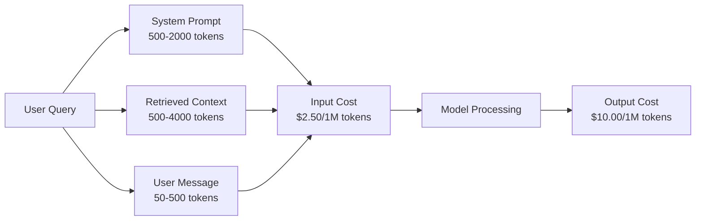
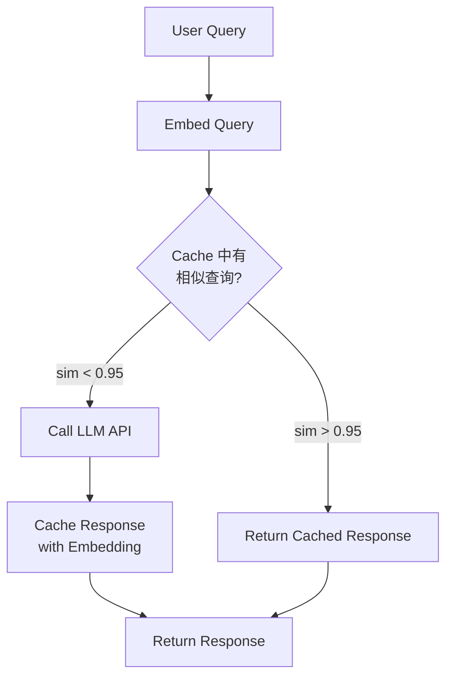
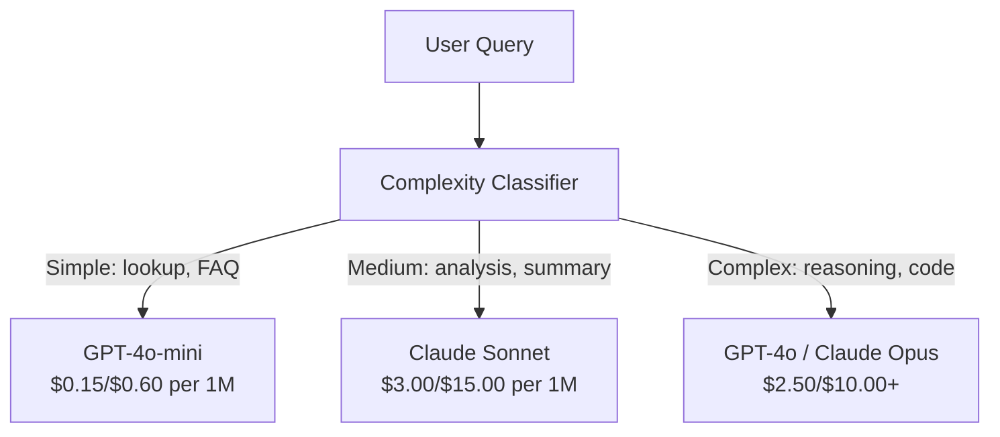

# 缓存、速率限制与成本优化

> 大多数 AI 初创公司不是死于模型不好，而是死于糟糕的单位经济。一次 GPT-4o 调用只花几分钱。但一万个用户每天调用十次，仅输入 token 就要花费 250 美元——在你收到一分钱之前。能活下来的公司，是把每一次 API 调用当作金融交易，而不是函数调用。

**类型：** Build
**语言：** Python
**前置知识：** Phase 11 Lesson 09（Function Calling）
**时间：** ~45 分钟
**相关：** Phase 11 · 15（Prompt Caching）——本课覆盖应用层缓存（语义缓存、精确哈希缓存、模型路由）。第 15 课覆盖提供商层 prompt 缓存（Anthropic cache_control、OpenAI automatic、Gemini CachedContent）。两者结合可实现 50-95% 的成本降低。

## 学习目标

- 实现语义缓存，将重复或相似查询从缓存中直接返回，而不是发起新的 API 调用
- 计算跨提供商的每次请求成本，并实现基于 token 的速率限制和预算告警
- 构建成本优化层，包括 prompt 压缩、模型路由（昂贵 vs 便宜模型）和响应缓存
- 为不同查询类型设计分层缓存策略：精确匹配、语义相似度和前缀缓存

## 问题所在

你构建了一个 RAG 聊天机器人。效果很好。用户很喜欢。

然后账单来了。

GPT-5 每百万输入 token 收费 5 美元，输出 15 美元。Claude Opus 4.7 收费 15/75 美元。Gemini 3 Pro 收费 1.25/5 美元。GPT-5-mini 是 0.25/2 美元。以下价格为示意，请以提供商当前定价页面为准。

以下是杀死初创公司的数学：

- 10,000 日活用户
- 每个用户每天 10 次查询
- 每次查询 1,000 输入 token（系统 prompt + 上下文 + 用户消息）
- 每次响应 500 输出 token

**每日输入成本：** 10,000 x 10 x 1,000 / 1,000,000 x $2.50 = **$250/天**
**每日输出成本：** 10,000 x 10 x 500 / 1,000,000 x $10.00 = **$500/天**
**月度总计：** **$22,500/月**

这还只是 LLM。再加上 embeddings、向量数据库托管、基础设施，你一个月要为这个聊天机器人花 $30,000。

更残酷的是：40-60% 的查询是近似重复的。用户用略微不同的措辞问同样的问题。你的系统 prompt——每次请求都一样——却每次都全额计费。RAG 检索到的上下文文档在不同用户问同一主题时反复出现。

你在为冗余计算付全价。

## 核心概念

### LLM 调用的成本构成

每次 API 调用有五个成本组成部分。



系统 prompt 是隐形杀手。一个 1,500 token 的系统 prompt 随每次请求发送，仅这个前缀每百万次请求就要花费 $3.75。每天 10 万次请求，就是 $375/天——$11,250/月——而这段文本从不改变。

### 提供商缓存：内置折扣

2026 年，三大主流提供商都提供提供商侧 prompt 缓存，但机制不同。详见 Phase 11 · 15 的深入讲解。

| Provider | 机制 | 折扣 | 最低要求 | 缓存时长 |
|----------|------|------|----------|----------|
| Anthropic | 显式 cache_control 标记 | 缓存命中 90% 折扣（写入时多付 25%） | 1,024 tokens（Sonnet/Opus），2,048（Haiku） | 默认 5 分钟；扩展 1 小时（写入费 2 倍） |
| OpenAI | 自动前缀匹配 | 缓存命中 50% 折扣 | 1,024 tokens | 尽力而为，最长 1 小时 |
| Google Gemini | 显式 CachedContent API | ~75% 折扣（另加存储费） | 4,096（Flash）/ 32,768（Pro） | 用户可配置 TTL |

**Anthropic 的方式**是显式的。你用 `cache_control: {"type": "ephemeral"}` 标记 prompt 的某些部分。第一次请求支付 25% 的写入溢价。后续具有相同前缀的请求获得 90% 折扣。一个 2,000 token 的系统 prompt 正常花费 $0.005，缓存命中时只需 $0.000625。10 万次请求每天节省 $437.50。

**OpenAI 的方式**是自动的。任何与之前请求匹配的 prompt 前缀获得 50% 折扣。无需标记。权衡：折扣较少、控制较少，但零实现成本。

### 语义缓存：你的自定义层

提供商缓存只对完全相同的前缀有效。语义缓存处理更难的情况：不同查询但意图相同。

"What is the return policy?" 和 "How do I return an item?" 是不同字符串但意图相同。语义缓存将两个查询嵌入，计算余弦相似度，如果相似度超过阈值（通常 0.92-0.95）则返回缓存的响应。



嵌入成本可以忽略不计。OpenAI 的 text-embedding-3-small 每百万 token 收费 $0.02。检查缓存的成本与完整 LLM 调用相比几乎为零。

### 精确缓存：哈希与匹配

对于确定性调用（temperature=0、相同模型、相同 prompt），精确缓存更简单更快。对完整 prompt 做哈希，检查缓存，命中则返回。

这完美适用于：
- 系统 prompt + 固定上下文 + 相同用户查询
- 工具定义相同的函数调用
- 同一文档被多次处理的批处理

### 速率限制：保护你的预算

速率限制不只是为了公平。它是为了生存。

**Token bucket 算法：** 每个用户获得一个容量为 N 的桶，以每秒 R 个 token 的速率补充。每次请求从桶中消耗 token。如果桶空了，请求被拒绝。这允许突发（一次性用完整个桶），同时强制执行平均速率。

**每用户配额：** 按用户层级设置每日/月度 token 限制。

| Tier | 每日 Token 限制 | 最大请求数/分钟 | 模型访问权限 |
|------|----------------|----------------|-------------|
| Free | 50,000 | 10 | 仅 GPT-4o-mini |
| Pro | 500,000 | 60 | GPT-4o、Claude Sonnet |
| Enterprise | 5,000,000 | 300 | 所有模型 |

### 模型路由：为合适的工作选择合适的模型

不是所有查询都需要 GPT-4o。

"What time does the store close?" 不需要 $10/M-output 的模型。GPT-4o-mini 以 $0.60/M output 就能完美处理。Claude Haiku 以 $1.25/M output 也能处理。一个简单的分类器将简单查询路由到便宜模型，复杂查询路由到昂贵模型。



一个调优良好的路由器仅模型成本就能节省 40-70%。

### 成本追踪：知道钱花在哪

你无法优化你不测量的东西。记录每次 API 调用：

- 时间戳
- 模型名称
- 输入 token 数
- 输出 token 数
- 延迟（毫秒）
- 计算成本（美元）
- 用户 ID
- 缓存命中/未命中
- 请求类别

这些数据揭示了哪些功能昂贵、哪些用户是重度消费者、以及缓存在哪里影响最大。

### 批处理：批量折扣

OpenAI 的 Batch API 以 50% 折扣异步处理请求。你提交最多 50,000 个请求的批次，结果在 24 小时内返回。

适用于：
- 夜间文档处理
- 批量分类
- 评估运行
- 数据增强管道

不适用于：实时面向用户的查询（延迟很重要）。

### 预算告警与熔断器

熔断器在你达到限制时停止消费。没有它，一个 bug 或滥用可能在几小时内烧完你的月度预算。

设置三个阈值：
1. **警告**（预算的 70%）：发送告警
2. **限流**（预算的 85%）：仅切换到更便宜的模型
3. **停止**（预算的 95%）：拒绝新请求，仅返回缓存响应

### 优化技术栈

按顺序应用这些技术。每一层都在前一层之上叠加。

| 层级 | 技术 | 典型节省 | 实现工作量 |
|------|------|----------|-----------|
| 1 | 提供商 prompt 缓存 | 30-50% | 低（添加缓存标记） |
| 2 | 精确缓存 | 10-20% | 低（哈希 + 字典） |
| 3 | 语义缓存 | 15-30% | 中（embeddings + 相似度） |
| 4 | 模型路由 | 40-70% | 中（分类器） |
| 5 | 速率限制 | 预算保护 | 低（token bucket） |
| 6 | Prompt 压缩 | 10-30% | 中（重写 prompts） |
| 7 | 批处理 | 符合条件的 50% | 低（batch API） |

一个应用了 1-5 层的 RAG 应用通常能将成本从 $22,500/月 降至 $4,000-6,000/月。这就是烧钱和建立生意之间的区别。

### 实际节省：优化前后对比

以下是一个服务 10,000 DAU 的 RAG 聊天机器人的真实分解。

| 指标 | 优化前 | 优化后 | 节省 |
|------|--------|--------|------|
| 月度 LLM 成本 | $22,500 | $5,200 | 77% |
| 平均每次查询成本 | $0.0075 | $0.0017 | 77% |
| 缓存命中率 | 0% | 52% | -- |
| 路由到 mini 的查询比例 | 0% | 65% | -- |
| P95 延迟 | 2,800ms | 900ms（缓存命中: 50ms） | 68% |
| 月度 embedding 成本 | $0 | $180 | （新增成本） |
| 月度总成本 | $22,500 | $5,380 | 76% |

语义缓存的 embedding 成本（$180/月）在缓存命中的第一个小时内就能回本。

## 动手实现

### 步骤 1：成本计算器

构建一个了解主流模型当前定价的 token 成本计算器。

```python
import hashlib
import time
import json
import math
from dataclasses import dataclass, field


MODEL_PRICING = {
    "gpt-4o": {"input": 2.50, "output": 10.00, "cached_input": 1.25},
    "gpt-4o-mini": {"input": 0.15, "output": 0.60, "cached_input": 0.075},
    "gpt-4.1": {"input": 2.00, "output": 8.00, "cached_input": 0.50},
    "gpt-4.1-mini": {"input": 0.40, "output": 1.60, "cached_input": 0.10},
    "gpt-4.1-nano": {"input": 0.10, "output": 0.40, "cached_input": 0.025},
    "o3": {"input": 2.00, "output": 8.00, "cached_input": 0.50},
    "o3-mini": {"input": 1.10, "output": 4.40, "cached_input": 0.55},
    "o4-mini": {"input": 1.10, "output": 4.40, "cached_input": 0.275},
    "claude-opus-4": {"input": 15.00, "output": 75.00, "cached_input": 1.50},
    "claude-sonnet-4": {"input": 3.00, "output": 15.00, "cached_input": 0.30},
    "claude-haiku-3.5": {"input": 0.80, "output": 4.00, "cached_input": 0.08},
    "gemini-2.5-pro": {"input": 1.25, "output": 10.00, "cached_input": 0.3125},
    "gemini-2.5-flash": {"input": 0.15, "output": 0.60, "cached_input": 0.0375},
}


def calculate_cost(model, input_tokens, output_tokens, cached_input_tokens=0):
    if model not in MODEL_PRICING:
        return {"error": f"Unknown model: {model}"}
    pricing = MODEL_PRICING[model]
    non_cached = input_tokens - cached_input_tokens
    input_cost = (non_cached / 1_000_000) * pricing["input"]
    cached_cost = (cached_input_tokens / 1_000_000) * pricing["cached_input"]
    output_cost = (output_tokens / 1_000_000) * pricing["output"]
    total = input_cost + cached_cost + output_cost
    return {
        "model": model,
        "input_tokens": input_tokens,
        "output_tokens": output_tokens,
        "cached_input_tokens": cached_input_tokens,
        "input_cost": round(input_cost, 6),
        "cached_input_cost": round(cached_cost, 6),
        "output_cost": round(output_cost, 6),
        "total_cost": round(total, 6),
    }
```

### 步骤 2：精确缓存

对完整 prompt 做哈希，对相同请求返回缓存的响应。

```python
class ExactCache:
    def __init__(self, max_size=1000, ttl_seconds=3600):
        self.cache = {}
        self.max_size = max_size
        self.ttl = ttl_seconds
        self.hits = 0
        self.misses = 0

    def _hash(self, model, messages, temperature):
        key_data = json.dumps({"model": model, "messages": messages, "temperature": temperature}, sort_keys=True)
        return hashlib.sha256(key_data.encode()).hexdigest()

    def get(self, model, messages, temperature=0.0):
        if temperature > 0:
            self.misses += 1
            return None
        key = self._hash(model, messages, temperature)
        if key in self.cache:
            entry = self.cache[key]
            if time.time() - entry["timestamp"] < self.ttl:
                self.hits += 1
                entry["access_count"] += 1
                return entry["response"]
            del self.cache[key]
        self.misses += 1
        return None

    def put(self, model, messages, temperature, response):
        if temperature > 0:
            return
        if len(self.cache) >= self.max_size:
            oldest_key = min(self.cache, key=lambda k: self.cache[k]["timestamp"])
            del self.cache[oldest_key]
        key = self._hash(model, messages, temperature)
        self.cache[key] = {
            "response": response,
            "timestamp": time.time(),
            "access_count": 1,
        }

    def stats(self):
        total = self.hits + self.misses
        return {
            "hits": self.hits,
            "misses": self.misses,
            "hit_rate": round(self.hits / total, 4) if total > 0 else 0,
            "cache_size": len(self.cache),
        }
```

### 步骤 3：语义缓存

嵌入查询，当相似度超过阈值时返回缓存的响应。

```python
def simple_embed(text):
    words = text.lower().split()
    vocab = {}
    for w in words:
        vocab[w] = vocab.get(w, 0) + 1
    norm = math.sqrt(sum(v * v for v in vocab.values()))
    if norm == 0:
        return {}
    return {k: v / norm for k, v in vocab.items()}


def cosine_similarity(a, b):
    if not a or not b:
        return 0.0
    all_keys = set(a) | set(b)
    dot = sum(a.get(k, 0) * b.get(k, 0) for k in all_keys)
    return dot


class SemanticCache:
    def __init__(self, similarity_threshold=0.85, max_size=500, ttl_seconds=3600):
        self.entries = []
        self.threshold = similarity_threshold
        self.max_size = max_size
        self.ttl = ttl_seconds
        self.hits = 0
        self.misses = 0

    def get(self, query):
        query_embedding = simple_embed(query)
        now = time.time()
        best_match = None
        best_sim = 0.0
        for entry in self.entries:
            if now - entry["timestamp"] > self.ttl:
                continue
            sim = cosine_similarity(query_embedding, entry["embedding"])
            if sim > best_sim:
                best_sim = sim
                best_match = entry
        if best_match and best_sim >= self.threshold:
            self.hits += 1
            best_match["access_count"] += 1
            return {"response": best_match["response"], "similarity": round(best_sim, 4), "original_query": best_match["query"]}
        self.misses += 1
        return None

    def put(self, query, response):
        if len(self.entries) >= self.max_size:
            self.entries.sort(key=lambda e: e["timestamp"])
            self.entries.pop(0)
        self.entries.append({
            "query": query,
            "embedding": simple_embed(query),
            "response": response,
            "timestamp": time.time(),
            "access_count": 1,
        })

    def stats(self):
        total = self.hits + self.misses
        return {
            "hits": self.hits,
            "misses": self.misses,
            "hit_rate": round(self.hits / total, 4) if total > 0 else 0,
            "cache_size": len(self.entries),
        }
```

### 步骤 4：速率限制器

基于 token bucket 的速率限制器，带每用户配额。

```python
class TokenBucketRateLimiter:
    def __init__(self):
        self.buckets = {}
        self.tiers = {
            "free": {"capacity": 50_000, "refill_rate": 500, "max_requests_per_min": 10},
            "pro": {"capacity": 500_000, "refill_rate": 5_000, "max_requests_per_min": 60},
            "enterprise": {"capacity": 5_000_000, "refill_rate": 50_000, "max_requests_per_min": 300},
        }

    def _get_bucket(self, user_id, tier="free"):
        if user_id not in self.buckets:
            tier_config = self.tiers.get(tier, self.tiers["free"])
            self.buckets[user_id] = {
                "tokens": tier_config["capacity"],
                "capacity": tier_config["capacity"],
                "refill_rate": tier_config["refill_rate"],
                "last_refill": time.time(),
                "request_timestamps": [],
                "max_rpm": tier_config["max_requests_per_min"],
                "tier": tier,
                "total_tokens_used": 0,
            }
        return self.buckets[user_id]

    def _refill(self, bucket):
        now = time.time()
        elapsed = now - bucket["last_refill"]
        refill = int(elapsed * bucket["refill_rate"])
        if refill > 0:
            bucket["tokens"] = min(bucket["capacity"], bucket["tokens"] + refill)
            bucket["last_refill"] = now

    def check(self, user_id, tokens_needed, tier="free"):
        bucket = self._get_bucket(user_id, tier)
        self._refill(bucket)
        now = time.time()
        bucket["request_timestamps"] = [t for t in bucket["request_timestamps"] if now - t < 60]
        if len(bucket["request_timestamps"]) >= bucket["max_rpm"]:
            return {"allowed": False, "reason": "rate_limit", "retry_after_seconds": 60 - (now - bucket["request_timestamps"][0])}
        if bucket["tokens"] < tokens_needed:
            deficit = tokens_needed - bucket["tokens"]
            wait = deficit / bucket["refill_rate"]
            return {"allowed": False, "reason": "token_limit", "tokens_available": bucket["tokens"], "retry_after_seconds": round(wait, 1)}
        return {"allowed": True, "tokens_available": bucket["tokens"]}

    def consume(self, user_id, tokens_used, tier="free"):
        bucket = self._get_bucket(user_id, tier)
        bucket["tokens"] -= tokens_used
        bucket["request_timestamps"].append(time.time())
        bucket["total_tokens_used"] += tokens_used

    def get_usage(self, user_id):
        if user_id not in self.buckets:
            return {"error": "User not found"}
        b = self.buckets[user_id]
        return {
            "user_id": user_id,
            "tier": b["tier"],
            "tokens_remaining": b["tokens"],
            "capacity": b["capacity"],
            "total_tokens_used": b["total_tokens_used"],
            "utilization": round(b["total_tokens_used"] / b["capacity"], 4) if b["capacity"] else 0,
        }
```

### 步骤 5：成本追踪器

记录每次调用并计算累计总额。

```python
class CostTracker:
    def __init__(self, monthly_budget=1000.0):
        self.logs = []
        self.monthly_budget = monthly_budget
        self.alerts = []

    def log_call(self, model, input_tokens, output_tokens, cached_input_tokens=0, latency_ms=0, user_id="anonymous", cache_status="miss"):
        cost = calculate_cost(model, input_tokens, output_tokens, cached_input_tokens)
        entry = {
            "timestamp": time.time(),
            "model": model,
            "input_tokens": input_tokens,
            "output_tokens": output_tokens,
            "cached_input_tokens": cached_input_tokens,
            "latency_ms": latency_ms,
            "cost": cost["total_cost"],
            "user_id": user_id,
            "cache_status": cache_status,
        }
        self.logs.append(entry)
        self._check_budget()
        return entry

    def _check_budget(self):
        total = self.total_cost()
        pct = total / self.monthly_budget if self.monthly_budget > 0 else 0
        if pct >= 0.95 and not any(a["level"] == "stop" for a in self.alerts):
            self.alerts.append({"level": "stop", "message": f"Budget 95% consumed: ${total:.2f}/${self.monthly_budget:.2f}", "timestamp": time.time()})
        elif pct >= 0.85 and not any(a["level"] == "throttle" for a in self.alerts):
            self.alerts.append({"level": "throttle", "message": f"Budget 85% consumed: ${total:.2f}/${self.monthly_budget:.2f}", "timestamp": time.time()})
        elif pct >= 0.70 and not any(a["level"] == "warning" for a in self.alerts):
            self.alerts.append({"level": "warning", "message": f"Budget 70% consumed: ${total:.2f}/${self.monthly_budget:.2f}", "timestamp": time.time()})

    def total_cost(self):
        return sum(entry["cost"] for entry in self.logs)

    def stats(self):
        if not self.logs:
            return {"total_cost": 0, "total_calls": 0, "avg_cost": 0}
        return {
            "total_cost": round(self.total_cost(), 4),
            "total_calls": len(self.logs),
            "avg_cost": round(self.total_cost() / len(self.logs), 6),
            "budget": self.monthly_budget,
            "budget_used_pct": round(self.total_cost() / self.monthly_budget, 4) if self.monthly_budget > 0 else 0,
            "alerts": self.alerts,
        }

    def by_model(self):
        model_stats = {}
        for entry in self.logs:
            m = entry["model"]
            if m not in model_stats:
                model_stats[m] = {"calls": 0, "cost": 0.0, "input_tokens": 0, "output_tokens": 0}
            model_stats[m]["calls"] += 1
            model_stats[m]["cost"] += entry["cost"]
            model_stats[m]["input_tokens"] += entry["input_tokens"]
            model_stats[m]["output_tokens"] += entry["output_tokens"]
        return {k: {**v, "cost": round(v["cost"], 4)} for k, v in model_stats.items()}

    def by_user(self):
        user_stats = {}
        for entry in self.logs:
            u = entry["user_id"]
            if u not in user_stats:
                user_stats[u] = {"calls": 0, "cost": 0.0}
            user_stats[u]["calls"] += 1
            user_stats[u]["cost"] += entry["cost"]
        return {k: {**v, "cost": round(v["cost"], 4)} for k, v in sorted(user_stats.items(), key=lambda x: x[1]["cost"], reverse=True)}
```

### 步骤 6：模型路由器

基于查询复杂度将请求路由到不同模型。

```python
class ModelRouter:
    def __init__(self):
        self.complexity_keywords = {
            "simple": ["what", "when", "where", "how much", "price", "hours", "location", "contact"],
            "complex": ["explain", "analyze", "compare", "why", "code", "debug", "optimize", "design"],
        }

    def classify(self, query):
        q = query.lower()
        simple_score = sum(1 for kw in self.complexity_keywords["simple"] if kw in q)
        complex_score = sum(1 for kw in self.complexity_keywords["complex"] if kw in q)
        if complex_score > simple_score:
            return "complex"
        elif simple_score > 0:
            return "simple"
        return "medium"

    def route(self, query, tier="pro"):
        complexity = self.classify(query)
        if complexity == "simple":
            return "gpt-4o-mini" if tier != "free" else "gpt-4o-mini"
        elif complexity == "complex":
            return "claude-sonnet-4" if tier == "enterprise" else "gpt-4o"
        return "claude-sonnet-4" if tier in ["pro", "enterprise"] else "gpt-4o-mini"
```

### 步骤 7：完整优化管道

将所有组件组合在一起。

```python
class OptimizedLLMClient:
    def __init__(self, api_client, monthly_budget=1000.0):
        self.client = api_client
        self.exact_cache = ExactCache()
        self.semantic_cache = SemanticCache()
        self.rate_limiter = TokenBucketRateLimiter()
        self.cost_tracker = CostTracker(monthly_budget)
        self.router = ModelRouter()

    def chat(self, messages, user_id="anonymous", tier="free", temperature=0.0, force_model=None):
        # 1. 速率限制检查
        estimated_tokens = sum(len(m["content"].split()) for m in messages) + 500
        rate_check = self.rate_limiter.check(user_id, estimated_tokens, tier)
        if not rate_check["allowed"]:
            return {"error": rate_check["reason"], "details": rate_check}

        # 2. 模型路由
        user_query = messages[-1]["content"] if messages else ""
        model = force_model or self.router.route(user_query, tier)

        # 3. 精确缓存检查（仅 temperature=0）
        if temperature == 0:
            cached = self.exact_cache.get(model, messages, temperature)
            if cached:
                self.cost_tracker.log_call(model, 0, 0, cache_status="exact_hit", user_id=user_id)
                return {"response": cached, "cached": True, "cache_type": "exact", "model": model}

        # 4. 语义缓存检查
        semantic = self.semantic_cache.get(user_query)
        if semantic:
            self.cost_tracker.log_call(model, 0, 0, cache_status="semantic_hit", user_id=user_id)
            return {"response": semantic["response"], "cached": True, "cache_type": "semantic", "similarity": semantic["similarity"], "model": model}

        # 5. 预算熔断器
        budget_pct = self.cost_tracker.total_cost() / self.cost_tracker.monthly_budget
        if budget_pct >= 0.95:
            return {"error": "budget_exceeded", "message": "Monthly budget 95% consumed. No new API calls allowed."}
        if budget_pct >= 0.85:
            model = "gpt-4o-mini"  # 强制降级到便宜模型

        # 6. 调用 API
        start = time.time()
        response = self.client.chat.completions.create(
            model=model,
            messages=messages,
            temperature=temperature,
        )
        latency_ms = round((time.time() - start) * 1000, 2)

        # 7. 记录成本
        input_tokens = response.usage.prompt_tokens
        output_tokens = response.usage.completion_tokens
        self.cost_tracker.log_call(model, input_tokens, output_tokens, latency_ms=latency_ms, user_id=user_id)
        self.rate_limiter.consume(user_id, input_tokens + output_tokens, tier)

        # 8. 缓存响应
        text = response.choices[0].message.content
        if temperature == 0:
            self.exact_cache.put(model, messages, temperature, text)
        self.semantic_cache.put(user_query, text)

        return {
            "response": text,
            "cached": False,
            "model": model,
            "input_tokens": input_tokens,
            "output_tokens": output_tokens,
            "latency_ms": latency_ms,
        }

    def get_stats(self):
        return {
            "exact_cache": self.exact_cache.stats(),
            "semantic_cache": self.semantic_cache.stats(),
            "cost_tracker": self.cost_tracker.stats(),
            "by_model": self.cost_tracker.by_model(),
            "by_user": self.cost_tracker.by_user(),
        }
```

## 验证

运行以下测试验证所有组件。

```python
def test_cost_calculator():
    cost = calculate_cost("gpt-4o", 1000, 500)
    assert cost["total_cost"] == 0.0075
    cached = calculate_cost("gpt-4o", 1000, 500, cached_input_tokens=500)
    assert cached["total_cost"] < cost["total_cost"]
    print("✓ Cost calculator")


def test_exact_cache():
    cache = ExactCache()
    messages = [{"role": "user", "content": "Hello"}]
    cache.put("gpt-4o", messages, 0.0, "Hi there")
    assert cache.get("gpt-4o", messages, 0.0) == "Hi there"
    assert cache.stats()["hit_rate"] == 1.0
    print("✓ Exact cache")


def test_semantic_cache():
    cache = SemanticCache()
    cache.put("What is the return policy?", "You can return within 30 days.")
    result = cache.get("How do I return an item?")
    assert result is not None
    assert result["similarity"] > 0.8
    print("✓ Semantic cache")


def test_rate_limiter():
    rl = TokenBucketRateLimiter()
    assert rl.check("user1", 1000, "free")["allowed"] is True
    rl.consume("user1", 50_000, "free")
    assert rl.check("user1", 1000, "free")["allowed"] is False
    print("✓ Rate limiter")


def test_router():
    router = ModelRouter()
    assert router.route("What time do you close?") == "gpt-4o-mini"
    assert router.route("Explain quantum computing") == "gpt-4o"
    print("✓ Model router")


def test_full_pipeline():
    class FakeClient:
        class FakeUsage:
            prompt_tokens = 100
            completion_tokens = 50
        class FakeChoice:
            class FakeMessage:
                content = "Test response"
            message = FakeMessage()
        class FakeResponse:
            usage = FakeUsage()
            choices = [FakeChoice()]
        def chat_completions_create(self, **kwargs):
            return self.FakeResponse()

    client = OptimizedLLMClient(FakeClient(), monthly_budget=100)
    result = client.chat([{"role": "user", "content": "Hello"}], user_id="test", tier="pro")
    assert "response" in result
    stats = client.get_stats()
    assert stats["cost_tracker"]["total_calls"] >= 1
    print("✓ Full pipeline")


if __name__ == "__main__":
    test_cost_calculator()
    test_exact_cache()
    test_semantic_cache()
    test_rate_limiter()
    test_router()
    test_full_pipeline()
    print("\nAll tests passed!")
```

## 关键要点

- **系统 prompt 是最大隐藏成本。** 一个 1,500 token 的系统 prompt 在 100K 日请求下每月花费 $11,250。提供商缓存（Anthropic 90%、OpenAI 50%）是首要优化。
- **语义缓存处理近似重复。** 40-60% 的用户查询是语义重复的。一个 $180/月的 embedding 层可节省数千美元。
- **模型路由节省 40-70%。** 不是所有查询都需要 GPT-4o。简单查询用 GPT-4o-mini（便宜 15 倍）。
- **速率限制是生存机制。** 没有它，一个 bug 或滥用可在数小时内烧完月度预算。
- **测量一切。** 记录每次调用的模型、token、成本、延迟、用户。你无法优化你不测量的东西。
- **分层缓存叠加。** 提供商缓存 + 精确缓存 + 语义缓存 + 模型路由 + 速率限制 = 典型 RAG 应用 76% 的成本降低。
- **批处理用于离线工作。** OpenAI Batch API 提供 50% 折扣，适用于非实时工作负载。
- **熔断器防止灾难。** 在 70%、85%、95% 预算阈值设置警告、限流和停止。

## 延伸阅读

- Phase 11 · 15（Prompt Caching）——提供商层缓存机制（Anthropic cache_control、OpenAI automatic prefix、Gemini CachedContent）
- Phase 11 · 07（Advanced RAG）——查询转换和重排序技术，影响缓存策略
- Phase 11 · 09（Function Calling）——工具调用成本更高（更长的系统 prompt），缓存收益更大
- OpenAI Pricing: https://openai.com/pricing
- Anthropic Pricing: https://www.anthropic.com/pricing
- Google Gemini Pricing: https://ai.google.dev/pricing
