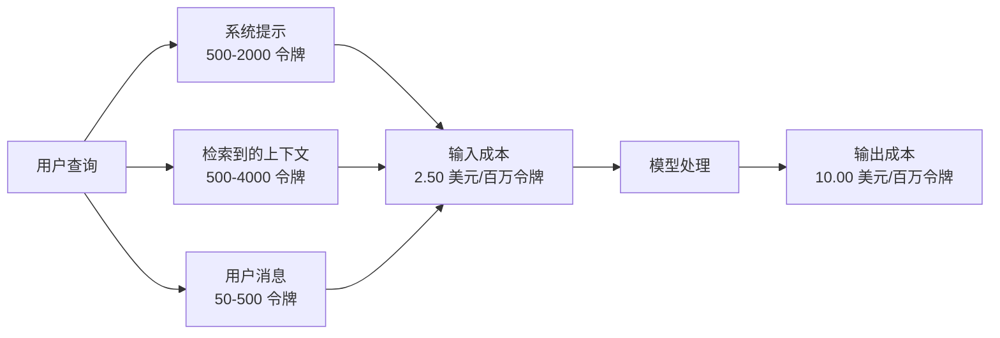
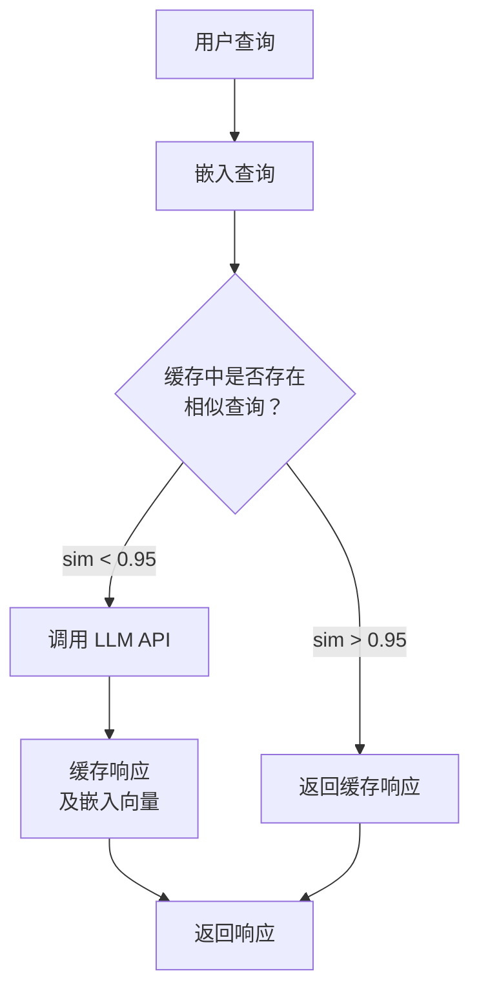
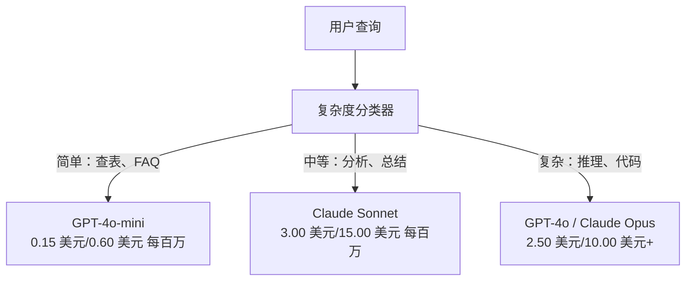

# 缓存、速率限制与成本优化

> 大多数 AI 初创公司并非死于糟糕的模型，而是死于糟糕的单位经济。一次 GPT-4o 调用只需几分之一美分。一万个用户每天调用十次，仅输入令牌一项就需要 250 美元——在你收取一美元之前。那些存活下来的公司，是把每一次 API 调用当作金融交易，而不是函数调用。

**类型：** 构建
**语言：** Python
**前置要求：** 第 11 阶段第 09 课（函数调用）
**时间：** ~45 分钟
**相关课程：** 第 11 阶段 · 第 15 课（提示缓存）——本课涵盖应用层缓存（语义缓存、精确哈希缓存、模型路由）。第 15 课涵盖供应商层提示缓存（Anthropic cache_control、OpenAI 自动缓存、Gemini CachedContent）。两者结合可实现 50-95% 的成本降低。

## 学习目标

- 实现语义缓存，将重复或相似的查询从缓存中返回，而无需发起新的 API 调用
- 计算各供应商的每次请求成本，并实现令牌感知的速率限制和预算告警
- 构建包含提示压缩、模型路由（昂贵 vs 廉价）和响应缓存的成本优化层
- 设计分层缓存策略，针对不同查询类型使用精确匹配、语义相似度和前缀缓存

## 问题

你构建了一个 RAG 聊天机器人。它运行完美。用户很喜欢。

然后账单来了。

GPT-5 每百万输入令牌收费 5 美元，每百万输出令牌收费 15 美元。Claude Opus 4.7 输入 15 美元/输出 75 美元。Gemini 3 Pro 输入 1.25 美元/输出 5 美元。GPT-5-mini 是 0.25 美元/2 美元。以下价格为示意价格；请始终查看供应商当前的定价页面。

以下是让初创公司倒闭的数学：

- 10,000 日活跃用户
- 每个用户每天 10 次查询
- 每次查询 1,000 输入令牌（系统提示 + 上下文 + 用户消息）
- 每次响应 500 输出令牌

**每日输入成本：** 10,000 x 10 x 1,000 / 1,000,000 x 2.50 美元 = **250 美元/天**
**每日输出成本：** 10,000 x 10 x 500 / 1,000,000 x 10.00 美元 = **500 美元/天**
**月总计：** **22,500 美元/月**

这还只是 LLM。再加上嵌入、向量数据库托管、基础设施。一个聊天机器人每月要花费 30,000 美元。

残酷的地方在于：40-60% 的查询几乎是重复的。用户用稍有不同的词语问同样的问题。你的系统提示——每次请求都完全相同——每次都产生费用。RAG 检索到的上下文文档在不同用户间重复出现，只要他们询问相同的话题。

你正在为冗余计算支付全价。

## 概念

### LLM 调用的成本解剖

每次 API 调用有五个成本组成部分。


```mermaid
graph LR
    A[用户查询] --> B[系统提示<br/>500-2000 令牌]
    A --> C[检索到的上下文<br/>500-4000 令牌]
    A --> D[用户消息<br/>50-500 令牌]
    B --> E[输入成本<br/>2.50 美元/百万令牌]
    C --> E
    D --> E
    E --> F[模型处理]
    F --> G[输出成本<br/>10.00 美元/百万令牌]
```

系统提示是隐形杀手。一个 1,500 令牌的系统提示随每次请求发送，仅这一前缀每百万次请求就花费 3.75 美元。每天 100K 次请求，那就是 375 美元/天——11,250 美元/月——为从未改变过的文本付费。

### 供应商缓存：内置折扣

2026 年，三大主要供应商都提供供应商侧的提示缓存，但机制不同。详见第 11 阶段 · 第 15 课。

| 供应商 | 机制 | 折扣 | 最短长度 | 缓存时长 |
|--------|------|------|----------|----------|
| Anthropic | 显式 cache_control 标记 | 缓存命中优惠 90%（写入时多付 25%） | 1,024 令牌（Sonnet/Opus），2,048（Haiku） | 默认 5 分钟；可延长至 1 小时（2 倍写入溢价） |
| OpenAI | 自动前缀匹配 | 缓存命中优惠 50% | 1,024 令牌 | 尽力达到 1 小时 |
| Google Gemini | 显式 CachedContent API | 约 75% 降低（另加存储费） | 4,096（Flash）/ 32,768（Pro） | 用户可配置 TTL |

**Anthropic 的方式**是显式的。你用 `cache_control: {"type": "ephemeral"}` 标记提示的各个部分。第一次请求支付 25% 的写入溢价。后续具有相同前缀的请求享受 90% 的折扣。一个通常花费 0.005 美元的 2,000 令牌系统提示在缓存命中时只需 0.000625 美元。在 100K 次请求中，每天节省 437.50 美元。

**OpenAI 的方式**是自动的。任何与先前请求匹配的提示前缀都能获得 50% 的折扣。无需标记。权衡之处在于：折扣较少，控制较少，但零实现成本。

### 语义缓存：你的自定义层

供应商缓存仅适用于相同的前缀。语义缓存处理更困难的情况：含义不同但意图相同的查询。

"什么是退货政策？"和"我该如何退货？"是不同的字符串，但意图相同。语义缓存对两个查询进行嵌入，计算余弦相似度，如果相似度超过阈值（通常为 0.92-0.95），则返回缓存的响应。


```mermaid
flowchart TD
    A[用户查询] --> B[嵌入查询]
    B --> C{缓存中是否存在<br/>相似查询？}
    C -->|sim > 0.95| D[返回缓存响应]
    C -->|sim < 0.95| E[调用 LLM API]
    E --> F[缓存响应<br/>及嵌入向量]
    F --> G[返回响应]
    D --> G
```

嵌入成本微乎其微。OpenAI 的 text-embedding-3-small 每百万令牌仅需 0.02 美元。与一次完整的 LLM 调用相比，检查缓存的成本几乎可以忽略不计。

### 精确缓存：哈希匹配

对于确定性调用（temperature=0，相同模型，相同提示），精确缓存更简单、更快。对完整提示进行哈希，检查缓存，找到则返回。

这完美适用于：
- 系统提示 + 固定上下文 + 相同的用户查询
- 具有相同工具定义的函数调用
- 同一文档被多次处理的批量处理

### 速率限制：保护你的预算

速率限制不仅仅关乎公平性，更关乎生存。

**令牌桶算法：** 每个用户有一个容量为 N 个令牌的桶，以每秒 R 个令牌的速率补充。一个请求消耗桶中的令牌。如果桶为空，请求被拒绝。这种方式允许突发流量（一次性用完整个桶），同时强制执行平均速率。

**每用户配额：** 按用户层级设定每日/每月令牌限制。

| 层级 | 每日令牌限制 | 最大请求数/分钟 | 模型访问 |
|------|-------------|----------------|---------|
| 免费 | 50,000 | 10 | 仅 GPT-4o-mini |
| 专业 | 500,000 | 60 | GPT-4o、Claude Sonnet |
| 企业 | 5,000,000 | 300 | 所有模型 |

### 模型路由：为合适的任务选择合适的模型

并非每次查询都需要 GPT-4o。

"商店几点关门？"不需要一个 10 美元/百万输出的模型。GPT-4o-mini 以 0.60 美元/百万输出的成本就能完美处理。Claude Haiku 以 1.25 美元/百万输出也能处理。一个简单的分类器将廉价查询路由到廉价模型，将复杂查询路由到昂贵模型。


```mermaid
flowchart TD
    A[用户查询] --> B[复杂度分类器]
    B -->|简单：查表、FAQ| C[GPT-4o-mini<br/>0.15 美元/0.60 美元 每百万]
    B -->|中等：分析、总结| D[Claude Sonnet<br/>3.00 美元/15.00 美元 每百万]
    B -->|复杂：推理、代码| E[GPT-4o / Claude Opus<br/>2.50 美元/10.00 美元+]
```

一个调优良好的路由器仅在模型成本上就能节省 40-70%。

### 成本追踪：知道钱花在哪里

你无法优化你无法度量的东西。记录每次 API 调用，包含：

- 时间戳
- 模型名称
- 输入令牌数
- 输出令牌数
- 延迟（毫秒）
- 计算成本（美元）
- 用户 ID
- 缓存命中/未命中
- 请求类别

这些数据揭示了哪些功能昂贵、哪些用户消耗量大、以及缓存在哪里影响最大。

### 批处理：批量折扣

OpenAI 的批处理 API 以异步方式处理请求，享受 50% 的折扣。你可以提交最多 50,000 个请求的批次，结果在 24 小时内返回。

批处理适用于：
- 夜间文档处理
- 批量分类
- 评估运行
- 数据增强管道

不适用于：实时面向用户的查询（延迟至关重要）。

### 预算告警与断路器

断路器会在达到限制时停止支出。如果没有断路器，一个 bug 或滥用可能在几小时内烧掉你整个月的预算。

设置三个阈值：
1. **警告**（预算的 70%）：发送告警
2. **限流**（预算的 85%）：仅切换到更便宜的模型
3. **停止**（预算的 95%）：拒绝新请求，仅返回缓存的响应

### 优化堆栈

按顺序应用这些技术。每一层在前一层的基础上叠加效果。

| 层 | 技术 | 典型节省 | 实现投入 |
|-------|------|---------|---------|
| 1 | 供应商提示缓存 | 30-50% | 低（添加缓存标记） |
| 2 | 精确缓存 | 10-20% | 低（哈希 + 字典） |
| 3 | 语义缓存 | 15-30% | 中（嵌入 + 相似度） |
| 4 | 模型路由 | 40-70% | 中（分类器） |
| 5 | 速率限制 | 预算保护 | 低（令牌桶） |
| 6 | 提示压缩 | 10-30% | 中（重写提示） |
| 7 | 批处理 | 符合条件的享 50% | 低（批处理 API） |

应用第 1-5 层的 RAG 应用通常可将成本从每月 22,500 美元降低到 4,000-6,000 美元/月。这就是烧钱维持和建设业务之间的区别。

### 实际节省：优化前后对比

以下是一个服务 10,000 日活跃用户的 RAG 聊天机器人的实际数据。

| 指标 | 优化前 | 优化后 | 节省 |
|------|--------|--------|------|
| 每月 LLM 成本 | 22,500 美元 | 5,200 美元 | 77% |
| 每次查询平均成本 | 0.0075 美元 | 0.0017 美元 | 77% |
| 缓存命中率 | 0% | 52% | -- |
| 路由到 mini 的查询 | 0% | 65% | -- |
| P95 延迟 | 2,800ms | 900ms（缓存命中：50ms） | 68% |
| 每月嵌入成本 | 0 美元 | 180 美元 | （新增成本） |
| 月度总成本 | 22,500 美元 | 5,380 美元 | 76% |

语义缓存的嵌入成本（180 美元/月）在缓存命中的第一个小时内即可收回。

## 构建

### 步骤 1：成本计算器

构建一个令牌成本计算器，了解主要模型的当前定价。

```python
import hashlib
import time
import json
import math
from dataclasses import dataclass, field


MODEL_PRICING = {
    "gpt-4o": {"input": 2.50, "output": 10.00, "cached_input": 1.25},
    "gpt-4o-mini": {"input": 0.15, "output": 0.60, "cached_input": 0.075},
    "gpt-4.1": {"input": 2.00, "output": 8.00, "cached_input": 0.50},
    "gpt-4.1-mini": {"input": 0.40, "output": 1.60, "cached_input": 0.10},
    "gpt-4.1-nano": {"input": 0.10, "output": 0.40, "cached_input": 0.025},
    "o3": {"input": 2.00, "output": 8.00, "cached_input": 0.50},
    "o3-mini": {"input": 1.10, "output": 4.40, "cached_input": 0.55},
    "o4-mini": {"input": 1.10, "output": 4.40, "cached_input": 0.275},
    "claude-opus-4": {"input": 15.00, "output": 75.00, "cached_input": 1.50},
    "claude-sonnet-4": {"input": 3.00, "output": 15.00, "cached_input": 0.30},
    "claude-haiku-3.5": {"input": 0.80, "output": 4.00, "cached_input": 0.08},
    "gemini-2.5-pro": {"input": 1.25, "output": 10.00, "cached_input": 0.3125},
    "gemini-2.5-flash": {"input": 0.15, "output": 0.60, "cached_input": 0.0375},
}


def calculate_cost(model, input_tokens, output_tokens, cached_input_tokens=0):
    if model not in MODEL_PRICING:
        return {"error": f"未知模型: {model}"}
    pricing = MODEL_PRICING[model]
    non_cached = input_tokens - cached_input_tokens
    input_cost = (non_cached / 1_000_000) * pricing["input"]
    cached_cost = (cached_input_tokens / 1_000_000) * pricing["cached_input"]
    output_cost = (output_tokens / 1_000_000) * pricing["output"]
    total = input_cost + cached_cost + output_cost
    return {
        "model": model,
        "input_tokens": input_tokens,
        "output_tokens": output_tokens,
        "cached_input_tokens": cached_input_tokens,
        "input_cost": round(input_cost, 6),
        "cached_input_cost": round(cached_cost, 6),
        "output_cost": round(output_cost, 6),
        "total_cost": round(total, 6),
    }
```

### 步骤 2：精确缓存

对完整提示进行哈希，为相同请求返回缓存的响应。

```python
class ExactCache:
    def __init__(self, max_size=1000, ttl_seconds=3600):
        self.cache = {}
        self.max_size = max_size
        self.ttl = ttl_seconds
        self.hits = 0
        self.misses = 0

    def _hash(self, model, messages, temperature):
        key_data = json.dumps({"model": model, "messages": messages, "temperature": temperature}, sort_keys=True)
        return hashlib.sha256(key_data.encode()).hexdigest()

    def get(self, model, messages, temperature=0.0):
        if temperature > 0:
            self.misses += 1
            return None
        key = self._hash(model, messages, temperature)
        if key in self.cache:
            entry = self.cache[key]
            if time.time() - entry["timestamp"] < self.ttl:
                self.hits += 1
                entry["access_count"] += 1
                return entry["response"]
            del self.cache[key]
        self.misses += 1
        return None

    def put(self, model, messages, temperature, response):
        if temperature > 0:
            return
        if len(self.cache) >= self.max_size:
            oldest_key = min(self.cache, key=lambda k: self.cache[k]["timestamp"])
            del self.cache[oldest_key]
        key = self._hash(model, messages, temperature)
        self.cache[key] = {
            "response": response,
            "timestamp": time.time(),
            "access_count": 1,
        }

    def stats(self):
        total = self.hits + self.misses
        return {
            "hits": self.hits,
            "misses": self.misses,
            "hit_rate": round(self.hits / total, 4) if total > 0 else 0,
            "cache_size": len(self.cache),
        }
```

### 步骤 3：语义缓存

嵌入查询，当相似度超过阈值时返回缓存的响应。

```python
def simple_embed(text):
    words = text.lower().split()
    vocab = {}
    for w in words:
        vocab[w] = vocab.get(w, 0) + 1
    norm = math.sqrt(sum(v * v for v in vocab.values()))
    if norm == 0:
        return {}
    return {k: v / norm for k, v in vocab.items()}


def cosine_similarity(a, b):
    if not a or not b:
        return 0.0
    all_keys = set(a) | set(b)
    dot = sum(a.get(k, 0) * b.get(k, 0) for k in all_keys)
    return dot


class SemanticCache:
    def __init__(self, similarity_threshold=0.85, max_size=500, ttl_seconds=3600):
        self.entries = []
        self.similarity_threshold = similarity_threshold
        self.max_size = max_size
        self.ttl = ttl_seconds
        self.hits = 0
        self.misses = 0

    def get(self, query):
        query_emb = simple_embed(query)
        now = time.time()
        self.entries = [e for e in self.entries if now - e["timestamp"] < self.ttl]
        for entry in self.entries:
            sim = cosine_similarity(query_emb, entry["embedding"])
            if sim >= self.similarity_threshold:
                self.hits += 1
                entry["access_count"] = entry.get("access_count", 0) + 1
                entry["timestamp"] = now
                return entry["response"]
        self.misses += 1
        return None

    def put(self, query, response):
        query_emb = simple_embed(query)
        self.entries = [e for e in self.entries if e["embedding"] != query_emb]
        if len(self.entries) >= self.max_size:
            oldest = min(self.entries, key=lambda e: e["timestamp"])
            self.entries.remove(oldest)
        self.entries.append({
            "query": query,
            "embedding": query_emb,
            "response": response,
            "timestamp": time.time(),
            "access_count": 1,
        })

    def stats(self):
        total = self.hits + self.misses
        return {
            "hits": self.hits,
            "misses": self.misses,
            "hit_rate": round(self.hits / total, 4) if total > 0 else 0,
            "cache_size": len(self.entries),
        }
```

### 步骤 4：模型路由器

一个简单的基于关键词的分类器，用于将查询路由到合适的模型。

```python
COMPLEXITY_PATTERNS = {
    "简单": {
        "keywords": ["什么", "何时", "何处", "谁", "如何", "是", "做", "有", "你好", "嗨", "谢谢"],
        "max_tokens": 100,
    },
    "中等": {
        "keywords": ["总结", "解释", "描述", "比较", "对比", "分析", "概述", "回顾", "讨论"],
        "max_tokens": 300,
    },
    "复杂": {
        "keywords": ["实现", "编码", "调试", "优化", "架构", "设计模式", "算法", "权衡", "分解", "重构"],
        "max_tokens": 1000,
    },
}

MODEL_ROUTES = {
    "简单": {"model": "gpt-4o-mini", "reason": "简单查询 — 使用最便宜的模型"},
    "中等": {"model": "claude-sonnet-4", "reason": "中等复杂查询 — 需要良好的推理能力"},
    "复杂": {"model": "gpt-4o", "reason": "复杂查询 — 需要最强的模型"},
}


def classify_complexity(query):
    query_lower = query.lower()
    for complexity, patterns in COMPLEXITY_PATTERNS.items():
        for keyword in patterns["keywords"]:
            if keyword.lower() in query_lower:
                return complexity
    return "简单"


def route_model(query, user_tier="pro"):
    complexity = classify_complexity(query)
    route = MODEL_ROUTES[complexity]
    return {
        "query": query,
        "complexity": complexity,
        "model": route["model"],
        "reason": route["reason"],
    }
```

### 步骤 5：速率限制器

令牌桶实现，配有用户层级和每日限额。

```python
import time
import threading


TIER_LIMITS = {
    "free": {"requests_per_minute": 10, "daily_token_limit": 50_000, "models": ["gpt-4o-mini"]},
    "pro": {"requests_per_minute": 60, "daily_token_limit": 500_000, "models": ["gpt-4o", "claude-sonnet-4", "gpt-4o-mini"]},
    "enterprise": {"requests_per_minute": 300, "daily_token_limit": 5_000_000, "models": ["gpt-4o", "claude-opus-4", "claude-sonnet-4", "gpt-4o-mini"]},
}


class RateLimiter:
    def __init__(self):
        self.buckets = {}
        self.daily_usage = {}
        self.lock = threading.Lock()

    def check(self, user_id, tokens, tier="free"):
        with self.lock:
            now = time.time()
            limits = TIER_LIMITS.get(tier, TIER_LIMITS["free"])
            if user_id not in self.buckets:
                self.buckets[user_id] = {
                    "tokens": limits["requests_per_minute"],
                    "max_tokens": limits["requests_per_minute"],
                    "refill_rate": limits["requests_per_minute"] / 60.0,
                    "last_refill": now,
                }
            bucket = self.buckets[user_id]
            elapsed = now - bucket["last_refill"]
            bucket["tokens"] = min(bucket["max_tokens"], bucket["tokens"] + elapsed * bucket["refill_rate"])
            bucket["last_refill"] = now
            if bucket["tokens"] < 1:
                return {"allowed": False, "reason": "速率限制已到 — 每分钟请求数上限"}
            if user_id not in self.daily_usage:
                self.daily_usage[user_id] = {"tokens": 0, "date": time.strftime("%Y-%m-%d")}
            usage = self.daily_usage[user_id]
            if usage["date"] != time.strftime("%Y-%m-%d"):
                usage["tokens"] = 0
                usage["date"] = time.strftime("%Y-%m-%d")
            if usage["tokens"] + tokens > limits["daily_token_limit"]:
                return {"allowed": False, "reason": "每日令牌限额已到"}
            return {"allowed": True, "reason": "OK"}

    def consume(self, user_id, tokens, tier="free"):
        with self.lock:
            limits = TIER_LIMITS.get(tier, TIER_LIMITS["free"])
            if user_id in self.buckets:
                self.buckets[user_id]["tokens"] -= 1
            if user_id not in self.daily_usage:
                self.daily_usage[user_id] = {"tokens": 0, "date": time.strftime("%Y-%m-%d")}
            self.daily_usage[user_id]["tokens"] += tokens

    def get_usage(self, user_id):
        with self.lock:
            usage = self.daily_usage.get(user_id, {"tokens": 0})
            limits = TIER_LIMITS.get("free")
            for tier, tier_limits in TIER_LIMITS.items():
                pass
            daily_limit = next(
                (tl["daily_token_limit"] for tl in TIER_LIMITS.values()
                 if usage.get("tokens", 0) <= tl["daily_token_limit"]),
                TIER_LIMITS["free"]["daily_token_limit"]
            )
            return {
                "used_today": usage["tokens"],
                "daily_limit": daily_limit,
                "percent_used": round(usage["tokens"] / daily_limit * 100, 1) if daily_limit > 0 else 0,
            }
```

### 步骤 6：成本追踪器

记录每次 API 调用及其成本，必要时触发告警。

```python
@dataclass
class CostTracker:
    monthly_budget: float = 1000.0
    entries: list = field(default_factory=list)
    alerts: list = field(default_factory=list)
    warning_pct: float = 0.70
    throttle_pct: float = 0.85
    stop_pct: float = 0.95

    def log_call(self, model, input_tokens, output_tokens, cached_input_tokens=0, latency_ms=0, user_id="", cache_status="miss"):
        cost_info = calculate_cost(model, input_tokens, output_tokens, cached_input_tokens)
        entry = {
            "timestamp": time.time(),
            "model": model,
            "input_tokens": input_tokens,
            "output_tokens": output_tokens,
            "cached_input_tokens": cached_input_tokens,
            "cost": cost_info["total_cost"],
            "latency_ms": latency_ms,
            "user_id": user_id,
            "cache_status": cache_status,
        }
        self.entries.append(entry)
        self._check_budget()

    def total_cost(self):
        return sum(e["cost"] for e in self.entries)

    def _check_budget(self):
        total = self.total_cost()
        if total >= self.monthly_budget * self.stop_pct:
            self.alerts.append({
                "level": "critical",
                "message": f"停止：${total:.2f} 已达预算 ${self.monthly_budget:.2f} 的 {self.stop_pct*100:.0f}%",
                "threshold": "stop",
                "total": total,
            })
        elif total >= self.monthly_budget * self.throttle_pct:
            self.alerts.append({
                "level": "warning",
                "message": f"限流：${total:.2f} 已达预算 ${self.monthly_budget:.2f} 的 {self.throttle_pct*100:.0f}% — 切换到更便宜的模型",
                "threshold": "throttle",
                "total": total,
            })
        elif total >= self.monthly_budget * self.warning_pct:
            self.alerts.append({
                "level": "info",
                "message": f"警告：${total:.2f} 已达预算 ${self.monthly_budget:.2f} 的 {self.warning_pct*100:.0f}%",
                "threshold": "warning",
                "total": total,
            })

    def summary(self):
        n = len(self.entries)
        if n == 0:
            return {"total_cost": 0, "total_calls": 0, "avg_cost_per_call": 0, "avg_latency_ms": 0, "cache_hit_rate": 0}
        total_cost = sum(e["cost"] for e in self.entries)
        total_latency = sum(e["latency_ms"] for e in self.entries)
        cache_hits = sum(1 for e in self.entries if e["cache_status"] == "hit")
        return {
            "total_cost": round(total_cost, 6),
            "total_calls": n,
            "avg_cost_per_call": round(total_cost / n, 8),
            "avg_latency_ms": round(total_latency / n, 1),
            "cache_hit_rate": round(cache_hits / n, 4) if n > 0 else 0,
        }

    def cost_by_model(self):
        breakdown = {}
        for e in self.entries:
            model = e["model"]
            if model not in breakdown:
                breakdown[model] = {"calls": 0, "cost": 0.0, "input_tokens": 0, "output_tokens": 0}
            breakdown[model]["calls"] += 1
            breakdown[model]["cost"] += e["cost"]
            breakdown[model]["input_tokens"] += e["input_tokens"]
            breakdown[model]["output_tokens"] += e["output_tokens"]
        for m in breakdown:
            breakdown[m]["cost"] = round(breakdown[m]["cost"], 6)
        return breakdown
```

### 步骤 7：演示

以下是一个端到端的演示，展示了所有组件如何协同工作。

```python
import random

def simulate_llm_call(model, query):
    input_tokens = len(query.split()) * 2 + 500
    output_tokens = random.randint(50, 300)
    latency_ms = random.randint(100, 2000)
    response = f"这是对'{query[:40]}...'的模拟{model}响应"
    return {"input_tokens": input_tokens, "output_tokens": output_tokens, "latency_ms": latency_ms, "response": response}

def run_demo():
    print("=" * 60)
    print("  LLM 成本优化演示")
    print("=" * 60)

    print("\n--- 成本计算器 ---")
    scenarios = [
        ("gpt-4o", 500, 200, 0),
        ("gpt-4o", 5000, 1000, 4000),
        ("gpt-4o-mini", 1000, 300, 0),
        ("claude-opus-4", 2000, 500, 0),
        ("gemini-2.5-flash", 1500, 400, 0),
    ]
    for model, inp, out, cached in scenarios:
        result = calculate_cost(model, inp, out, cached)
        print(f"  {model}: ${result['total_cost']:.6f} (输入: ${result['input_cost']:.6f}, "
              f"缓存: ${result['cached_input_cost']:.6f}, 输出: ${result['output_cost']:.6f})")

    print("\n--- 精确缓存 ---")
    exact_cache = ExactCache(max_size=100, ttl_seconds=3600)
    test_messages = [{"role": "user", "content": "退货政策是什么？"}]
    print(f"  首次调用（应未命中）: {exact_cache.get('gpt-4o', test_messages, 0.0)}")
    exact_cache.put("gpt-4o", test_messages, 0.0, "30 天退货政策")
    print(f"  第二次调用（应命中）: {exact_cache.get('gpt-4o', test_messages, 0.0)}")
    print(f"  不同 temperature 调用（应未命中）: {exact_cache.get('gpt-4o', test_messages, 0.5)}")
    print(f"  统计信息: {exact_cache.stats()}")

    print("\n--- 语义缓存 ---")
    semantic_cache = SemanticCache(similarity_threshold=0.75, max_size=100)
    test_queries = [
        "退货政策是什么？",
        "我该如何退货？",
        "你们几点开门？",
    ]
    semantic_cache.put("退货政策是什么？", "我们提供 30 天无理由退货。")
    for q in test_queries:
        result = semantic_cache.get(q)
        if result:
            print(f"  '{q[:40]}' -> 命中: {result[:50]}...")
        else:
            print(f"  '{q[:40]}' -> 未命中（无匹配）")
    print(f"  统计信息: {semantic_cache.stats()}")

    print("\n--- 速率限制 ---")
    rate_limiter = RateLimiter()
    for i in range(12):
        check = rate_limiter.check("user_1", 1000, "free")
        if check["allowed"]:
            rate_limiter.consume("user_1", 1000, "free")
        status = "OK" if check["allowed"] else f"已阻止 ({check['reason']})"
        if i < 5 or not check["allowed"]:
            print(f"  请求 {i+1}: {status}")
    print(f"  用量: {rate_limiter.get_usage('user_1')}")

    print("\n--- 模型路由 ---")
    routing_queries = [
        "你们几点关门？",
        "总结这份季度收益报告",
        "分析微服务与单体架构之间的权衡取舍",
        "你好",
        "编写带删除功能的二叉搜索树代码",
    ]
    for q in routing_queries:
        route = route_model(q, "pro")
        print(f"  '{q[:50]}' -> {route['model']} ({route['complexity']})")

    print("\n--- 完整流程：优化前后对比 ---")
    queries = [
        "退货政策是什么？",
        "我该如何退货？",
        "你们的营业时间是？",
        "你们几点开门？",
        "解释 TCP 和 UDP 的区别",
        "比较 TCP 和 UDP 协议",
        "你好",
        "你们的电话号码是多少？",
        "编写一个对列表进行排序的 Python 函数",
        "分析无服务器架构的优缺点",
    ]

    print("\n  [优化前：无缓存，单一模型（gpt-4o）]")
    tracker_before = CostTracker(monthly_budget=1000.0)
    for q in queries:
        result = simulate_llm_call("gpt-4o", q)
        tracker_before.log_call("gpt-4o", result["input_tokens"], result["output_tokens"], latency_ms=result["latency_ms"], cache_status="miss")
    before = tracker_before.summary()
    print(f"  总成本: ${before['total_cost']:.6f}")
    print(f"  平均成本/调用: ${before['avg_cost_per_call']:.6f}")
    print(f"  平均延迟: {before['avg_latency_ms']}ms")

    print("\n  [优化后：缓存 + 路由 + 速率限制]")
    exact_c = ExactCache()
    semantic_c = SemanticCache(similarity_threshold=0.75)
    tracker_after = CostTracker(monthly_budget=1000.0)

    for q in queries:
        messages = [{"role": "user", "content": q}]
        cached = exact_c.get("gpt-4o", messages, 0.0)
        if cached:
            tracker_after.log_call("gpt-4o-mini", 0, 0, latency_ms=5, cache_status="hit")
            continue
        sem_cached = semantic_c.get(q)
        if sem_cached:
            tracker_after.log_call("gpt-4o-mini", 0, 0, latency_ms=15, cache_status="hit")
            continue
        route = route_model(q)
        result = simulate_llm_call(route["model"], q)
        tracker_after.log_call(route["model"], result["input_tokens"], result["output_tokens"], latency_ms=result["latency_ms"], cache_status="miss")
        exact_c.put(route["model"], messages, 0.0, result["response"])
        semantic_c.put(q, result["response"])

    after = tracker_after.summary()
    print(f"  总成本: ${after['total_cost']:.6f}")
    print(f"  平均成本/调用: ${after['avg_cost_per_call']:.6f}")
    print(f"  平均延迟: {after['avg_latency_ms']}ms")
    print(f"  缓存命中率: {after['cache_hit_rate']:.0%}")

    if before["total_cost"] > 0:
        savings_pct = (1 - after["total_cost"] / before["total_cost"]) * 100
        print(f"\n  节省: 成本降低 {savings_pct:.1f}%")
        print(f"  延迟改善: 速度提升 {(1 - after['avg_latency_ms'] / before['avg_latency_ms']) * 100:.1f}%")

    print("\n--- 预算告警演示 ---")
    alert_tracker = CostTracker(monthly_budget=0.01)
    for i in range(5):
        alert_tracker.log_call("gpt-4o", 5000, 2000, latency_ms=500)
    print(f"  总花费: ${alert_tracker.total_cost():.6f} / ${alert_tracker.monthly_budget}")
    for alert in alert_tracker.alerts:
        print(f"  告警 [{alert['level'].upper()}]: {alert['message']}")

    print("\n--- 按模型分类的成本明细 ---")
    multi_tracker = CostTracker(monthly_budget=500.0)
    for _ in range(50):
        multi_tracker.log_call("gpt-4o-mini", 800, 200, latency_ms=150)
    for _ in range(30):
        multi_tracker.log_call("claude-sonnet-4", 1500, 500, latency_ms=400)
    for _ in range(10):
        multi_tracker.log_call("gpt-4o", 2000, 800, latency_ms=600)
    for _ in range(10):
        multi_tracker.log_call("claude-opus-4", 3000, 1000, latency_ms=1200)
    breakdown = multi_tracker.cost_by_model()
    for model, data in sorted(breakdown.items(), key=lambda x: x[1]["cost"], reverse=True):
        print(f"  {model}: {data['calls']} 次调用, ${data['cost']:.6f}, {data['input_tokens']:,} 入 / {data['output_tokens']:,} 出")
    print(f"  总计: ${multi_tracker.total_cost():.6f}")

    print("\n" + "=" * 60)
    print("  演示完成。")
    print("=" * 60)


if __name__ == "__main__":
    run_demo()
```

## 使用

### Anthropic 提示缓存

```python
# import anthropic
#
# client = anthropic.Anthropic()
#
# response = client.messages.create(
#     model="claude-sonnet-4-20250514",
#     max_tokens=1024,
#     system=[
#         {
#             "type": "text",
#             "text": "你是一名 Acme Corp 的客服支持代理...",
#             "cache_control": {"type": "ephemeral"},
#         }
#     ],
#     messages=[{"role": "user", "content": "退货政策是什么？"}],
# )
#
# print(f"输入令牌: {response.usage.input_tokens}")
# print(f"缓存创建令牌: {response.usage.cache_creation_input_tokens}")
# print(f"缓存读取令牌: {response.usage.cache_read_input_tokens}")
```

第一次调用写入缓存（25% 溢价）。后续每次使用相同系统提示前缀的调用从缓存读取（90% 折扣）。缓存持续 5 分钟，每次命中重置计时器。

### OpenAI 自动缓存

```python
# from openai import OpenAI
#
# client = OpenAI()
#
# response = client.chat.completions.create(
#     model="gpt-4o",
#     messages=[
#         {"role": "system", "content": "你是一名乐于助人的客服支持代理..."},
#         {"role": "user", "content": "退货政策是什么？"},
#     ],
# )
#
# print(f"提示令牌: {response.usage.prompt_tokens}")
# print(f"缓存令牌: {response.usage.prompt_tokens_details.cached_tokens}")
# print(f"补全令牌: {response.usage.completion_tokens}")
```

OpenAI 自动缓存。任何长度超过 1,024 令牌且与近期请求匹配的提示前缀均可享受 50% 的折扣。无需更改代码——只需检查响应中的 `prompt_tokens_details.cached_tokens` 来确认其是否生效。

### OpenAI 批处理 API

```python
# import json
# from openai import OpenAI
#
# client = OpenAI()
#
# requests = []
# for i, query in enumerate(queries):
#     requests.append({
#         "custom_id": f"request-{i}",
#         "method": "POST",
#         "url": "/v1/chat/completions",
#         "body": {
#             "model": "gpt-4o-mini",
#             "messages": [{"role": "user", "content": query}],
#         },
#     })
#
# with open("batch_input.jsonl", "w") as f:
#     for r in requests:
#         f.write(json.dumps(r) + "\n")
#
# batch_file = client.files.create(file=open("batch_input.jsonl", "rb"), purpose="batch")
# batch = client.batches.create(input_file_id=batch_file.id, endpoint="/v1/chat/completions", completion_window="24h")
# print(f"批次 ID: {batch.id}, 状态: {batch.status}")
```

批处理 API 对所有令牌提供固定 50% 的折扣。结果在 24 小时内到达。非常适合非实时工作负载：评估、数据标注、批量摘要。

### 使用 Redis 的生产级语义缓存

```python
# import redis
# import numpy as np
# from openai import OpenAI
#
# r = redis.Redis()
# client = OpenAI()
#
# def get_embedding(text):
#     response = client.embeddings.create(model="text-embedding-3-small", input=text)
#     return response.data[0].embedding
#
# def semantic_cache_lookup(query, threshold=0.95):
#     query_emb = np.array(get_embedding(query))
#     keys = r.keys("cache:emb:*")
#     best_sim, best_key = 0, None
#     for key in keys:
#         stored_emb = np.frombuffer(r.get(key), dtype=np.float32)
#         sim = np.dot(query_emb, stored_emb) / (np.linalg.norm(query_emb) * np.linalg.norm(stored_emb))
#         if sim > best_sim:
#             best_sim, best_key = sim, key
#     if best_sim >= threshold and best_key:
#         response_key = best_key.decode().replace("cache:emb:", "cache:resp:")
#         return r.get(response_key).decode()
#     return None
```

在生产环境中，用向量索引（Redis Vector Search、Pinecone 或 pgvector）替换线性扫描。线性扫描适用于少于 1,000 条记录。超过这个数量，使用 ANN（近似最近邻）实现 O(log n) 查找。

## 交付

本课程生成 `outputs/prompt-cost-optimizer.md`——一个可复用的提示，用于分析你的 LLM 应用并推荐具体成本优化方案及预计节省金额。

还生成 `outputs/skill-cost-patterns.md`——一个决策框架，帮助你针对用例选择合适的缓存策略、速率限制配置和模型路由规则。

## 练习

1. **为语义缓存实现 LRU 驱逐策略。** 将最早优先的驱逐替换为最近最少使用策略。跟踪每个条目的最后访问时间，当缓存满时驱逐访问时间最早的条目。在 100 次查询中比较两种策略的命中率。

2. **构建成本预测工具。** 给定 API 调用日志（CostTracker 日志），基于最近 7 天平均值预测月度成本。考虑工作日/周末模式。如果预测的月度成本超出预算 20% 以上，触发告警。

3. **实现分层语义缓存。** 使用两个相似度阈值：0.98 用于高置信度命中（立即返回），0.90 用于中置信度命中（附带免责声明返回："基于之前一个相似的问题..."）。追踪每个命中来自哪个层级，并衡量用户满意度差异。

4. **构建模型路由分类器。** 用基于嵌入的分类器替换基于关键词的分类器。对 50 个带标签的查询（简单/中等/复杂）进行嵌入，然后通过查找最近的带标签样本来对新查询进行分类。针对 20 个查询的测试集衡量分类准确率。

5. **实现带降级级别的断路器。** 在预算使用 70% 时，记录警告。在 85% 时，自动将所有路由切换到最便宜的模型（gpt-4o-mini）。在 95% 时，仅提供缓存的响应并拒绝新查询。通过模拟在 1.00 美元预算下处理 1,000 个请求来测试，验证每个阈值是否正确触发。

## 关键术语

| 术语 | 人们说的 | 实际含义 |
|------|---------|---------|
| 提示缓存（Prompt caching） | "缓存系统提示" | 供应商级缓存，重复的提示前缀可获得折扣（Anthropic 90%，OpenAI 50%）——OpenAI 无需代码更改，Anthropic 需要显式标记 |
| 语义缓存（Semantic caching） | "智能缓存" | 对查询进行嵌入，计算与历史查询的相似度，如果相似度超过阈值则返回缓存的响应——捕获精确匹配无法发现的同义改写 |
| 精确缓存（Exact caching） | "哈希缓存" | 对完整提示（模型 + 消息 + temperature）进行哈希，为相同输入返回缓存的响应——仅适用于 temperature=0 的确定性调用 |
| 令牌桶（Token bucket） | "速率限制器" | 一种算法，每个用户有一个容量为 N 个令牌的桶，以每秒 R 个令牌的速率补充——允许最多 N 的突发流量，同时强制执行平均速率 R |
| 模型路由（Model routing） | "省钱路由" | 使用分类器将简单查询发送到廉价模型（GPT-4o-mini、Haiku），将复杂查询发送到昂贵模型（GPT-4o、Opus）——节省 40-70% 的模型成本 |
| 成本追踪（Cost tracking） | "计量" | 记录每次 API 调用的模型、令牌、延迟、成本和用户 ID，让你确切知道钱花在哪里以及哪些功能昂贵 |
| 断路器（Circuit breaker） | "紧急开关" | 当支出接近预算限制时，自动降级服务（更便宜的模型、仅缓存）或完全停止请求 |
| 批处理 API（Batch API） | "批量折扣" | OpenAI 的异步处理，享受 50% 折扣——最多提交 50,000 个请求，24 小时内获得结果 |
| 提示压缩（Prompt compression） | "令牌节食" | 重写系统提示和上下文，使用更少的令牌同时保留含义——更短的提示成本更低，且通常表现更好 |
| 缓存命中率（Cache hit rate） | "缓存效率" | 从缓存服务而非调用 LLM 的请求百分比——生产级聊天机器人通常为 40-60%，按比例节省成本 |

## 扩展阅读

- [Anthropic 提示缓存指南](https://docs.anthropic.com/en/docs/build-with-claude/prompt-caching)——Anthropic 显式 cache_control 标记、定价和缓存生命周期行为的官方文档
- [OpenAI 提示缓存](https://platform.openai.com/docs/guides/prompt-caching)——OpenAI 的自动缓存，如何通过 usage 字段验证缓存命中，以及最小前缀长度
- [OpenAI 批处理 API](https://platform.openai.com/docs/guides/batch)——异步处理 50% 折扣、JSONL 格式、24 小时完成窗口和 50K 请求限制
- [GPTCache](https://github.com/zilliztech/GPTCache)——开源语义缓存库，支持多种嵌入后端、向量存储和驱逐策略
- [Martian 模型路由器](https://docs.withmartian.com)——生产级模型路由，自动选择能够处理每个查询的最便宜模型
- [Not Diamond](https://www.notdiamond.ai)——基于机器学习的模型路由器，从你的流量模式中学习，优化各供应商间的成本/质量权衡
- [Helicone](https://www.helicone.ai)——LLM 可观测性平台，以代理层形式提供成本追踪、缓存、速率限制和预算告警
- [Dean & Barroso, "The Tail at Scale" (CACM 2013)](https://research.google/pubs/the-tail-at-scale/)——延迟、吞吐量、TTFT/TPOT 百分位数和对冲请求；"选择仍能满足 P95 的最便宜模型"背后的成本模型
- [Kwon 等人, "Efficient Memory Management for Large Language Model Serving with PagedAttention" (SOSP 2023)](https://arxiv.org/abs/2309.06180)——vLLM 论文；为什么分页 KV 缓存 + 连续批处理在吞吐量上比朴素服务器高出 24 倍，"缓存和成本"背后的基础设施层
- [Dao 等人, "FlashAttention-2: Faster Attention with Better Parallelism and Work Partitioning" (ICLR 2024)](https://arxiv.org/abs/2307.08691)——与提示缓存正交的内核级成本降低；建议与推测性解码和 GQA 一起阅读，以了解完整的成本曲线图景
