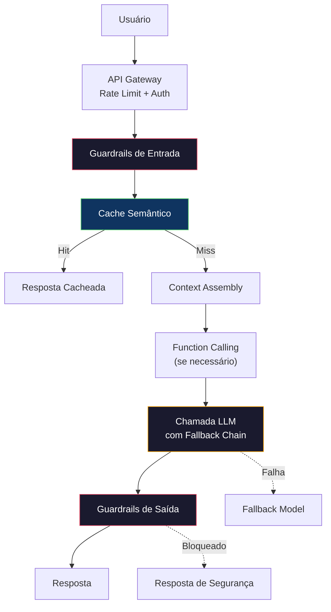

# Construindo uma Aplicação LLM em Produção

> Você construiu prompts, embeddings, pipelines RAG, function calling, camadas de cache e guardrails. Separadamente. Em isolamento. Como praticar escalas de guitarra sem nunca tocar uma música. Esta aula é a música. Você vai conectar cada componente das Aulas 01-12 em um único serviço pronto para produção. Não é um brinquedo. Não é um demo. É um sistema que lida com tráfego real, falha graciosamente, faz streaming de tokens, rastreia custos e sobrevive aos seus primeiros 10.000 usuários.

**Tipo:** Construção (Capstone)
**Linguagens:** Python
**Pré-requisitos:** Fase 11 Aulas 01-15
**Tempo:** ~120 minutos

## Objetivos de Aprendizado

- Conectar todos os componentes da Fase 11 (prompts, RAG, function calling, cache, guardrails) em um único serviço pronto para produção
- Implementar streaming de tokens, tratamento gracioso de erros e gerenciamento de timeout de requisições
- Construir observabilidade na aplicação: log de requisições, rastreamento de custo, percentis de latência e dashboards de taxa de erro
- Implantar com health checks, rate limiting e estratégia de fallback para indisponibilidade de provedores

## O Problema

Construir um app LLM funcional para demo é fácil. Construir um que funcione para 10.000 usuários reais com diferentes dispositivos, conexões lentas, queries maliciosas e provedores que caem no meio da madrugada — isso é engenharia.

## O Conceito

### A Arquitetura Completa



### Pipeline de Requisição

```python
import uuid
import time
from datetime import datetime, timezone

class RequestLog:
    def __init__(self, request_id, user_id, model, input_tokens, output_tokens,
                 latency_ms, cache_hit=False, cost=0.0, error=None):
        self.request_id = request_id
        self.user_id = user_id
        self.model = model
        self.input_tokens = input_tokens
        self.output_tokens = output_tokens
        self.latency_ms = latency_ms
        self.cache_hit = cache_hit
        self.cost = cost
        self.error = error
        self.timestamp = datetime.now(timezone.utc).isoformat()
```

### Chamada LLM com Retry e Fallback

```python
import asyncio
import random

async def call_with_retry_and_fallback(prompt, models, max_retries=3):
    """Tenta múltiplos modelos com retry exponencial."""
    for model in models:
        for attempt in range(max_retries):
            try:
                # Simula chamada (substituir por API real)
                await asyncio.sleep(random.uniform(0.1, 0.3))
                return {
                    "text": f"Resposta simulada do {model}",
                    "model": model,
                    "input_tokens": len(prompt.split()) * 4,
                    "output_tokens": 100,
                }
            except Exception as e:
                if attempt < max_retries:
                    backoff = min(2 ** attempt + random.uniform(0, 1), 10)
                    await asyncio.sleep(backoff)
                continue
    
    return {
        "text": "Desculpe, estou temporariamente indisponível.",
        "model": "fallback",
        "input_tokens": 0,
        "output_tokens": 20,
        "error": "Todos os modelos falharam",
    }
```

### Streaming

```python
async def stream_response(text):
    """Simula streaming token a token."""
    words = text.split()
    for i, word in enumerate(words):
        token = word if i == 0 else " " + word
        yield token
        await asyncio.sleep(random.uniform(0.02, 0.08))
```

### Health Check

```python
def health_check(service):
    """Verifica saúde do serviço."""
    return {
        "status": "healthy",
        "timestamp": datetime.now(timezone.utc).isoformat(),
        "total_requests": len(service.request_logs),
        "cache_hit_rate": calculate_cache_hit_rate(service),
        "avg_latency_ms": calculate_avg_latency(service),
        "error_rate": calculate_error_rate(service),
    }
```

### APLICAÇÃO COMPLETA

```python
class ProductionLLMService:
    def __init__(self):
        self.request_logs = []
        self.cache = {}  # Simplificado
        self.total_cost = 0
        self.models = ["gpt-4o", "claude-sonnet-4", "gpt-4o-mini"]
    
    async def handle_request(self, user_id, query):
        request_id = str(uuid.uuid4())[:12]
        start_time = time.time()
        
        # 1. Guardrails de entrada
        if detect_injection(query)[0]:
            return {"blocked": True, "reason": "Prompt injection detectado"}
        
        # 2. Cache check
        cache_key = hash(query)
        if cache_key in self.cache:
            return {"response": self.cache[cache_key], "cache_hit": True}
        
        # 3. Montar prompt e chamar LLM
        result = await call_with_retry_and_fallback(query, self.models)
        
        # 4. Guardrails de saída
        safe, reason = check_output_safety(result["text"])
        if not safe:
            result["text"] = "Não posso fornecer essa resposta."
        
        # 5. Cache store
        self.cache[cache_key] = result["text"]
        
        # 6. Log
        latency_ms = round((time.time() - start_time) * 1000, 2)
        self.request_logs.append(RequestLog(
            request_id=request_id, user_id=user_id,
            model=result["model"], input_tokens=result["input_tokens"],
            output_tokens=result["output_tokens"], latency_ms=latency_ms,
        ))
        
        return {"response": result["text"], "model": result["model"],
                "latency_ms": latency_ms, "request_id": request_id}
```

## Use

### Padrões de Deploy

```python
# Health check endpoint
# GET /health → {"status": "healthy", ...}

# Rate limiting
# Middleware que aplica token bucket por usuário

# Fallback chain
# gpt-4o → claude-sonnet-4 → gpt-4o-mini → resposta estática

# Observabilidade
# Log de cada request com: id, user, model, tokens, latency, cost, cache_hit
```

## Entregue

Esta aula é o capstone que integra todos os componentes das aulas anteriores em um sistema coeso de produção.

## Exercícios

1. Adicione streaming real: implemente SSE (Server-Sent Events) para enviar tokens ao frontend conforme chegam.

2. Implemente A/B testing de prompts: divida tráfego 50/50 entre duas versões de system prompt.

3. Adicione circuit breaker: se o modelo primário falhar 3 vezes seguidas, pare de tentar por 60 segundos.

4. Implemente logging estruturado com campos: request_id, user_id, model, tokens_in, tokens_out, latency_ms, cache_hit, cost_usd.

5. Construa dashboard de métricas: requests/min, latência p50/p95/p99, taxa de cache hit, custo acumulado.

## Termos-Chave

| Termo | O que o pessoal diz | O que realmente significa |
|-------|--------------------|-----------------------|
| Production-ready | "Pronto pra produção" | Sistema que lida com tráfego real, falhas, segurança e observabilidade |
| Health check | "Verificação de saúde" | Endpoint que reporta status, métricas e capacidade do serviço |
| Fallback chain | "Cadeia de fallback" | Lista ordenada de modelos alternativos quando o primário falha |
| Circuit breaker | "Disjuntor" | Padrão que pausa chamadas a um serviço que está falhando |
| Observability | "Observabilidade" | Capacidade de entender o estado interno do sistema por outputs externos |
| Streaming | "Streaming" | Enviar tokens incrementalmente ao cliente em vez de esperar a resposta completa |

## Leitura Adicional

- [Anthropic — Building effective agents](https://www.anthropic.com/research/building-effective-agents) — padrões de agentes
- [OpenAI Production Best Practices](https://platform.openai.com/docs/guides/production-best-practices) — guias de produção
- [LangSmith Documentation](https://docs.smith.langchain.com/) — observabilidade LLM
- [Helicone](https://www.helicone.ai) — proxy de observabilidade com caching e rate limiting
- [Dean & Barroso, "The Tail at Scale"](https://research.google/pubs/the-tail-at-scale/) — latência e throughput em escala
