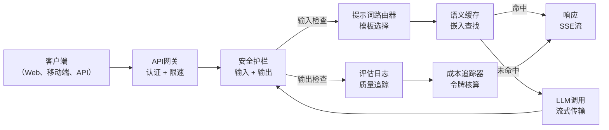
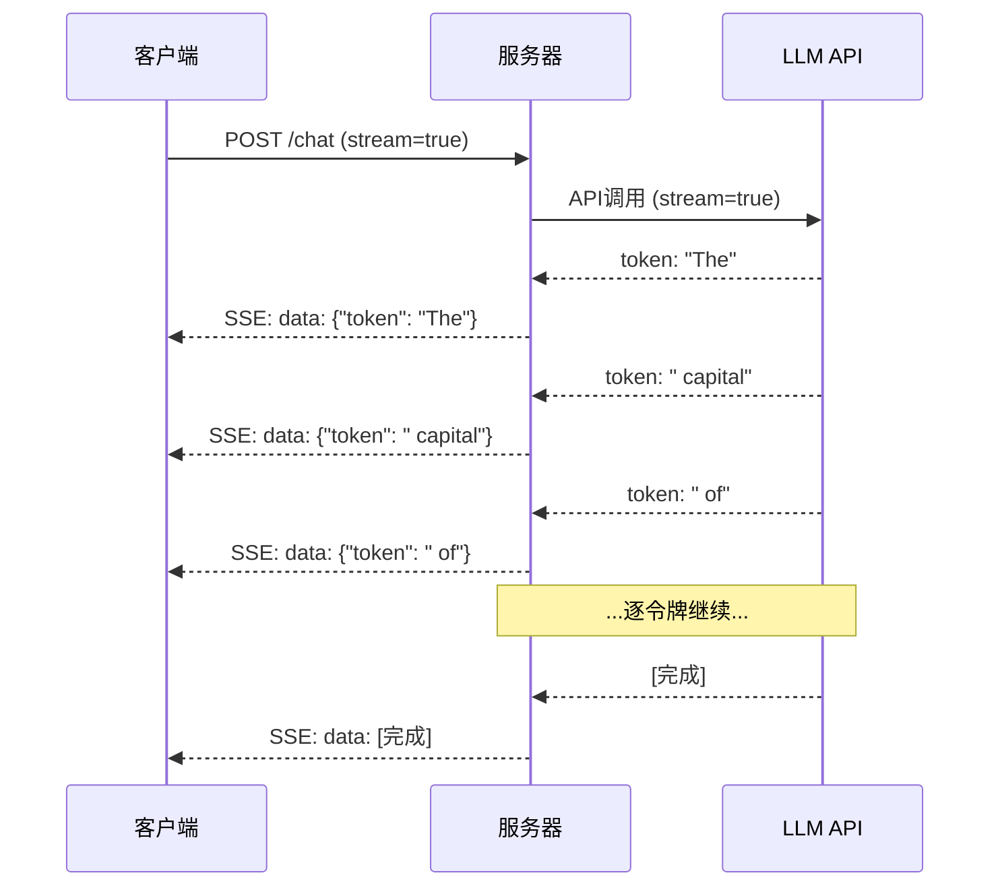
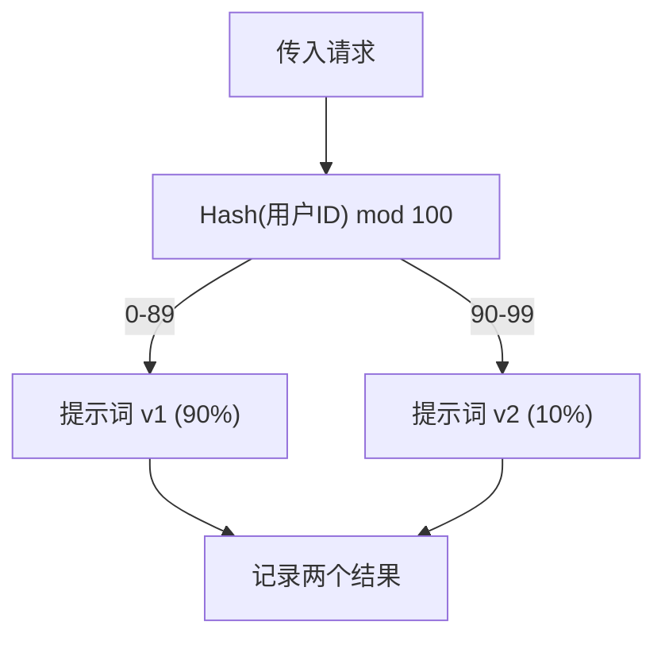

# 构建生产级LLM应用

> 你已经构建了提示词、嵌入、RAG流水线、函数调用、缓存层和安全护栏。分开构建的，孤立的。就像练习吉他音阶却从未演奏过一首曲子。这节课就是那首曲子。你将把第01-12课的所有组件连接到一个完整的、可投入生产的服务中。不是玩具，不是演示。这是一个能够处理真实流量、优雅降级、流式传输令牌、追踪成本，并能在前10,000个用户下生存的系统。

**类型：** 构建（毕业设计）
**语言：** Python
**前置条件：** 阶段11 第01-15课
**时间：** 约120分钟
**相关：** 阶段11 · 14（MCP）用于用共享协议替换自定义工具模式；阶段11 · 15（提示词缓存）用于在稳定前缀上降低50-90%的成本。这两者在每一个严肃的2026年生产栈中都是必备的。

## 学习目标

- 将阶段11的所有组件（提示词、RAG、函数调用、缓存、安全护栏）连接成一个完整的、可投入生产的服务
- 实现流式令牌传输、优雅错误处理和请求超时管理
- 为应用构建可观测性：请求日志、成本追踪、延迟百分位数和错误率仪表盘
- 部署带有健康检查、限速和提供商宕机回退策略的应用

## 问题

构建一个LLM功能需要一个下午。交付一个LLM产品需要数月。

差距不在于智能，而在于基础设施。你的原型调用OpenAI，获得响应，打印出来。在你的笔记本上能运行。然后现实来了：

- 用户发送了一个50,000令牌的文档。你的上下文窗口溢出了。
- 两个用户在4秒内问了同一个问题。你为两者都付了费。
- API在凌晨2点返回500错误。你的服务崩溃了。
- 用户让模型生成SQL。模型输出了`DROP TABLE users`。
- 你的月度账单达到12,000美元，而你完全不知道是哪个功能导致的。
- 响应时间平均8秒。用户在3秒后离开了。

如今生产中每个LLM应用——Perplexity、Cursor、ChatGPT、Notion AI——都解决了这些问题。不是靠更聪明的提示词，而是靠严谨的工程。

这是毕业设计。你将构建一个完整的生产级LLM服务，集成了提示词管理（L01-02）、嵌入和向量搜索（L04-07）、函数调用（L09）、评估（L10）、缓存（L11）、安全护栏（L12）、流式传输、错误处理、可观测性和成本追踪。一个服务，所有组件连接在一起。

## 概念

### 生产架构

每一个严肃的LLM应用都遵循相同的流程。细节不同，但结构不变。



请求通过API网关进入，该网关处理认证和限速。输入安全护栏在提示词路由器选择正确模板之前检查提示词注入和禁止内容。语义缓存检查类似问题是否最近被回答过。缓存未命中时，启用流式传输调用LLM。输出安全护栏验证响应。评估日志记录质量指标。成本追踪器核算每个令牌。响应流式传输回客户端。

七个组件。每一个都是你已经完成的一课。工程在于连接。

### 技术栈

| 组件 | 课程 | 技术 | 目的 |
|-----------|--------|------------|---------|
| API服务器 | -- | FastAPI + Uvicorn | HTTP端点、SSE流式传输、健康检查 |
| 提示词模板 | L01-02 | Jinja2 / 字符串模板 | 带变量注入的版本化管理提示词 |
| 嵌入 | L04 | text-embedding-3-small | 语义相似度用于缓存和RAG |
| 向量存储 | L06-07 | 内存中（生产：Pinecone/Qdrant） | 最近邻搜索用于上下文检索 |
| 函数调用 | L09 | 工具注册表 + JSON Schema | 外部数据访问、结构化操作 |
| 评估 | L10 | 自定义指标 + 日志 | 响应质量、延迟、准确性追踪 |
| 缓存 | L11 | 语义缓存（基于嵌入） | 避免冗余LLM调用，降低成本和延迟 |
| 安全护栏 | L12 | 正则表达式 + 分类器规则 | 阻止提示词注入、个人身份信息（PII）、不安全内容 |
| 成本追踪器 | L11 | 令牌计数器 + 定价表 | 每次请求和聚合成本核算 |
| 流式传输 | -- | 服务器发送事件（SSE） | 逐令牌交付，首个令牌亚秒级 |

### 流式传输：为什么重要

一个包含500个输出令牌的GPT-5响应需要3-8秒完全生成。没有流式传输，用户在这段时间内只能看着转圈。有了流式传输，第一个令牌在200-500毫秒内到达。总时间相同，但感知延迟降低了90%。



三种流式传输协议：

| 协议 | 延迟 | 复杂度 | 何时使用 |
|----------|---------|------------|-------------|
| 服务器发送事件（SSE） | 低 | 低 | 大多数LLM应用。单向、基于HTTP，无处不在 |
| WebSockets | 低 | 中 | 双向需求：语音、实时协作 |
| 长轮询 | 高 | 低 | 无法处理SSE或WebSockets的遗留客户端 |

SSE是默认选择。OpenAI、Anthropic和Google都通过SSE进行流式传输。你的服务器从LLM API接收数据块，并作为SSE事件转发给客户端。客户端使用`EventSource`（浏览器）或`httpx`（Python）来消费流。

### 错误处理：三个层次

生产级LLM应用以三种不同的方式失败。每种都需要不同的恢复策略。

**第1层：API失败。** LLM提供商返回429（限速）、500（服务端错误）或超时。解决方案：带抖动的指数退避。从1秒开始，每次重试时间加倍，添加随机抖动以防止惊群效应。最多重试3次。

```
第1次尝试：立即
第2次尝试：1秒 + 随机(0, 0.5秒)
第3次尝试：2秒 + 随机(0, 1.0秒)
第4次尝试：4秒 + 随机(0, 2.0秒)
放弃：返回回退响应
```

**第2层：模型失败。** 模型返回格式错误的JSON，虚构了一个函数名，或产生了未通过验证的输出。解决方案：使用修正后的提示词重试。在重试消息中包含错误，以便模型自我纠正。

**第3层：应用失败。** 下游服务不可达，向量存储响应慢，安全护栏抛出异常。解决方案：优雅降级。如果RAG上下文不可用，则无上下文继续。如果缓存宕机，则绕过它。绝不让次要系统使主流程崩溃。

| 失败类型 | 重试？ | 回退策略 | 用户影响 |
|---------|--------|----------|-------------|
| API 429（限速） | 是，带退避 | 将请求排队 | "正在处理，请稍候..." |
| API 500（服务端错误） | 是，尝试3次 | 切换到回退模型 | 对用户透明 |
| API 超时（>30秒） | 是，尝试1次 | 更短的提示词，更小的模型 | 质量略低 |
| 格式错误的输出 | 是，带错误上下文 | 返回原始文本 | 轻微格式问题 |
| 安全护栏阻止 | 否 | 解释为何请求被阻止 | 明确的错误消息 |
| 向量存储宕机 | 不在向量存储上重试 | 跳过RAG上下文 | 质量较低，但仍可运行 |
| 缓存宕机 | 不在缓存上重试 | 直接调用LLM | 延迟更高，成本更高 |

**回退模型链。** 当你的主模型不可用时，沿链回退：

```
claude-sonnet-4-20250514 -> gpt-4o -> gpt-4o-mini -> 缓存的响应 -> "服务暂时不可用"
```

每一步都在质量和可用性之间权衡。用户总能得到一些东西。

### 可观测性：度量什么

你无法改进你看不到的东西。每个生产级LLM应用都需要可观测性的三大支柱。

**结构化日志。** 每个请求产生一个JSON日志条目，包含：请求ID、用户ID、提示词模板名称、使用的模型、输入令牌数、输出令牌数、延迟（毫秒）、缓存命中/未命中、安全护栏通过/未通过、成本（美元）以及任何错误。

**链路追踪。** 单个用户请求会触及5-8个组件。OpenTelemetry追踪让你看到完整旅程：嵌入花了多长时间？是缓存命中吗？LLM调用用了多久？安全护栏增加了延迟吗？没有追踪，调试生产问题就是猜测。

**指标仪表盘。** 每个LLM团队关注的五个数字：

| 指标 | 目标 | 原因 |
|--------|--------|-----|
| P50延迟 | < 2秒 | 中位数用户体验 |
| P99延迟 | < 10秒 | 尾部延迟导致用户流失 |
| 缓存命中率 | > 30% | 直接节省成本 |
| 安全护栏阻止率 | < 5% | 太高意味着假阳性惹恼用户 |
| 每次请求成本 | < $0.01 | 单位经济可行性 |

### 生产中A/B测试提示词

当你的提示词能工作时，它还没有完成。当你拥有数据证明它优于替代方案时，才算完成。

**影子模式。** 在100%的流量上运行新提示词，但只记录结果——不向用户展示。与当前提示词比较质量指标。没有用户风险，完整数据。

**百分比发布。** 将10%的流量路由到新提示词。监控指标。如果质量保持，增加到25%，然后50%，最后100%。如果质量下降，立即回滚。



使用用户ID的确定性哈希，而不是随机选择。这确保每个用户在同一个实验中的不同请求中获得一致的体验。

### 真实架构示例

**Perplexity。** 用户查询进入。搜索引擎检索10-20个网页。页面被分块、嵌入并重排序。前5个块成为RAG上下文。LLM生成带有引用的答案，实时流式传输回客户端。两个模型：一个快的用于搜索查询重写，一个强的用于答案合成。估计每天超过5000万次查询。

**Cursor。** 打开的文件、周围文件、最近的编辑和终端输出构成上下文。提示词路由器决定：小模型用于自动补全（Cursor-small，约20毫秒），大模型用于聊天（Claude Sonnet 4.6 / GPT-5，约3秒）。上下文被积极压缩——只包含相关代码段，而不是整个文件。代码库嵌入提供长距离上下文。推测性编辑流式传输差异，而不是完整文件。MCP集成让第三方工具无需针对每个工具修改代码即可接入。

**ChatGPT。** 插件、函数调用和MCP服务器让模型能够访问网络、运行代码、生成图像和查询数据库。路由层决定调用哪些能力。记忆在会话之间保持用户偏好。系统提示词包含1500多个令牌的行为规则，通过提示词缓存进行缓存。多个模型服务于不同功能：GPT-5用于聊天、GPT-Image用于图像、Whisper用于语音、o4-mini用于深度推理。

### 扩展

| 规模 | 架构 | 基础设施 |
|-------|-------------|-------|
| 0-1K 日活跃用户 | 单个FastAPI服务器，同步调用 | 1台虚拟机，50美元/月 |
| 1K-10K 日活跃用户 | 异步FastAPI，语义缓存，队列 | 2-4台虚拟机 + Redis，500美元/月 |
| 10K-100K 日活跃用户 | 水平扩展，负载均衡，异步工作器 | Kubernetes，5,000美元/月 |
| 100K+ 日活跃用户 | 多区域，模型路由，专用推理 | 自定义基础设施，50,000美元以上/月 |

关键扩展模式：

- **处处异步。** 永远不要阻塞Web服务器线程等待LLM调用。使用`asyncio`和`httpx.AsyncClient`。
- **基于队列的处理。** 对于非实时任务（摘要、分析），推送到队列（Redis、SQS）并使用工作器处理。返回作业ID，让客户端轮询。
- **连接池化。** 复用与LLM提供商的HTTP连接。每次请求新建TLS连接会增加100-200毫秒。
- **水平扩展。** LLM应用是I/O密集型，而非CPU密集型。单个异步服务器可以处理100多个并发请求。扩展服务器，而不是核心。

### 成本预估

在发布之前，预估你的月度成本。这个电子表格决定了你的商业模式是否可行。

| 变量 | 值 | 来源 |
|----------|-------|--------|
| 日活跃用户（DAU） | 10,000 | 分析 |
| 每个用户每日查询数 | 5 | 产品分析 |
| 平均每次查询输入令牌数 | 1,500 | 实际测量（系统 + 上下文 + 用户） |
| 平均每次查询输出令牌数 | 400 | 实际测量 |
| 每百万输入令牌价格 | $5.00 | OpenAI GPT-5 定价 |
| 每百万输出令牌价格 | $15.00 | OpenAI GPT-5 定价 |
| 缓存命中率 | 35% | 根据缓存指标实际测量 |
| 有效每日查询数 | 32,500 | 50,000 * (1 - 0.35) |

**月度LLM成本：**
- 输入：32,500 查询/天 x 1,500 令牌 x 30 天 / 1M x $2.50 = **$3,656**
- 输出：32,500 查询/天 x 400 令牌 x 30 天 / 1M x $10.00 = **$3,900**
- **总计：$7,556/月**（缓存节省约$4,070/月）

没有缓存，相同流量成本为$11,625/月。35%的缓存命中率节省了35%的LLM成本。这就是为什么存在第11课。

### 部署清单

15项。在每一项都勾选