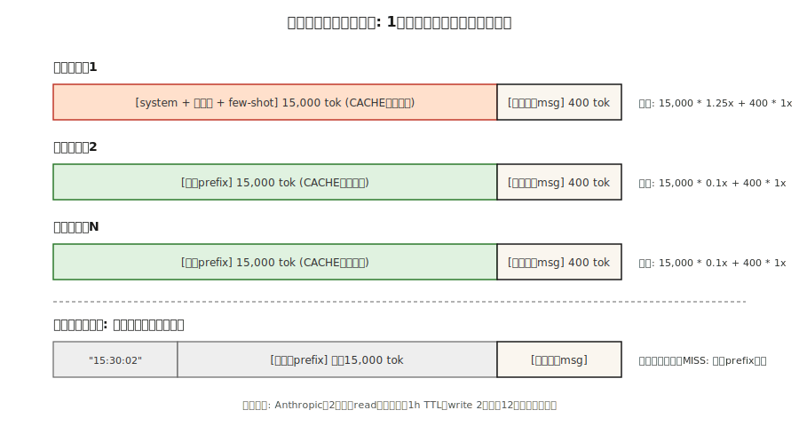

# 提示缓存（Prompt Caching）与上下文缓存（Context Caching）

> 你的系统提示（system prompt）有 4,000 token。你的 RAG 上下文有 20,000 token。每次请求你都要发送这两者，并且每次都要支付费用。提示缓存（Prompt caching）让提供商在它们那边保持该前缀（prefix）的“预热”状态，并在重复使用时按正常费率的 10% 收费。使用得当，可将推理成本降低 50–90%，并将首 token 延迟降低 40–85%。

**类型：** 构建
**语言：** Python
**前置条件：** 阶段 11 · 01（提示工程，Prompt Engineering）、阶段 11 · 05（上下文工程，Context Engineering）、阶段 11 · 11（缓存与成本，Caching and Cost）
**时间：** 约 60 分钟

## 问题

一个编码代理在对话的每一轮都向 Claude 发送相同的 15,000 token 系统提示。以 $3/M 输入 token 计算，20 轮对话仅输入成本就是 $0.90——这还不包括用户实际的消息。乘以每天 10,000 次对话，仅从未改变过的文本就产生了 $9,000/天的账单。

你无法在不损害质量的情况下缩减提示。你无法避免发送它——模型每一轮都需要它。唯一的办法是停止为提供商已经见过的前缀支付全价。

这个办法就是提示缓存（Prompt caching）。Anthropic 于 2024 年 8 月推出了该功能（2025 年推出了 1 小时扩展 TTL 变体），OpenAI 于同年晚些时候自动实现了该功能，Google 随 Gemini 1.5 推出了显式上下文缓存（Context Caching），如今三者都将它作为前沿模型的一等特性提供。

## 概念



**机制。** 当请求的前缀与最近某个请求的前缀匹配时，提供商提供上一次运行的 KV 缓存（KV-cache），而不是重新编码 token。你第一次支付少量写入溢价（write premium），之后每次支付大量读取折扣（read discount）。

**2026 年三大提供商的风格。**

| 提供商 | API 风格 | 命中折扣 | 写入溢价 | 默认 TTL | 最小可缓存长度 |
|---------|-----------|--------------|---------------|-------------|---------------|
| Anthropic | 内容块上显式的 `cache_control` 标记 | 输入 90% 折扣 | 25% 附加费 | 5 分钟（可延长至 1 小时） | 1,024 token（Sonnet/Opus），2,048（Haiku） |
| OpenAI | 自动前缀检测 | 输入 50% 折扣 | 无 | 最长 1 小时（尽力而为） | 1,024 token |
| Google (Gemini) | 显式 `CachedContent` API | 按存储计费；读取约为正常费率的 25% | 按 token·小时计存储费 | 用户设定（默认 1 小时） | 4,096 token（Flash），32,768（Pro） |

**不变规则。** 三者都只缓存前缀。如果请求之间有任何 token 不同，第一个不同 token 之后的所有内容都是未命中。将*稳定*部分放在顶部，*可变*部分放在底部。

### 缓存友好的布局

```
[系统提示]          <-- 缓存此部分
[工具定义]           <-- 缓存此部分
[少样本示例]         <-- 缓存此部分
[检索到的文档]       <-- 如果复用则缓存，否则不缓存
[对话历史]           <-- 缓存到上一轮
[当前用户消息]       <-- 从不缓存（每次不同）
```

违反顺序——将用户消息放在系统提示之上，在少样本示例之间插入动态检索内容——缓存永远不会命中。

### 盈亏平衡计算

Anthropic 的 25% 写入溢价意味着一个缓存块必须至少被读取两次才能净省钱。1 次写入 + 1 次读取平均每次请求成本为 0.675 倍（节省 32%）；1 次写入 + 10 次读取平均为 0.205 倍（节省 80%）。经验法则：缓存任何你预期在 TTL 内至少复用 3 次的内容。

## 构建

### 第 1 步：使用显式标记的 Anthropic 提示缓存

```python
import anthropic

client = anthropic.Anthropic()

SYSTEM = [
    {
        "type": "text",
        "text": "你是一位高级 Python 审查员。请严格遵循评分标准。\n\n" + RUBRIC_15K_TOKENS,
        "cache_control": {"type": "ephemeral"},
    }
]

def review(code: str):
    return client.messages.create(
        model="claude-opus-4-7",
        max_tokens=1024,
        system=SYSTEM,
        messages=[{"role": "user", "content": code}],
    )
```

`cache_control` 标记告诉 Anthropic 将该块存储 5 分钟。在此窗口内重复使用会命中；过期后重复使用则会再次写入。

**响应使用量字段：**

```python
response = review(code_a)
response.usage
# InputTokensUsage(
#     input_tokens=120,
#     cache_creation_input_tokens=15023,   # 按 1.25 倍付费
#     cache_read_input_tokens=0,
#     output_tokens=340,
# )

response_b = review(code_b)
response_b.usage
# cache_creation_input_tokens=0
# cache_read_input_tokens=15023           # 按 0.1 倍付费
```

在 CI 中检查这两个字段——如果 `cache_read_input_tokens` 在多次请求中一直为零，说明你的缓存键正在漂移。

### 第 2 步：1 小时扩展 TTL

对于长时间运行的批量任务，5 分钟的默认值会在任务之间过期。设置 `ttl`：

```python
{"type": "text", "text": RUBRIC, "cache_control": {"type": "ephemeral", "ttl": "1h"}}
```

1 小时 TTL 的写入溢价翻倍（比基线高 50% 而不是 25%），但任何重复使用前缀超过 5 次的批量任务都能迅速收回成本。

### 第 3 步：OpenAI 自动缓存

OpenAI 无需配置。任何超过 1,024 token 且与最近请求匹配的前缀都会自动获得 50% 折扣。

```python
from openai import OpenAI
client = OpenAI()

resp = client.chat.completions.create(
    model="gpt-5",
    messages=[
        {"role": "system", "content": SYSTEM_PROMPT},   # 长且稳定
        {"role": "user", "content": user_msg},
    ],
)
resp.usage.prompt_tokens_details.cached_tokens  # 打折部分
```

同样适用缓存友好布局规则。有两件事会破坏 OpenAI 的缓存（但不会影响 Anthropic 的）：更改 `user` 字段（用作缓存键的一部分）以及重新排列工具。

### 第 4 步：Gemini 显式上下文缓存

Gemini 将缓存视为一个一等对象，你可以创建并命名：

```python
from google import genai
from google.genai import types

client = genai.Client()

cache = client.caches.create(
    model="gemini-3-pro",
    config=types.CreateCachedContentConfig(
        display_name="rubric-v3",
        system_instruction=RUBRIC,
        contents=[FEW_SHOT_EXAMPLES],
        ttl="3600s",
    ),
)

resp = client.models.generate_content(
    model="gemini-3-pro",
    contents=["Review this code:\n" + code],
    config=types.GenerateContentConfig(cached_content=cache.name),
)
```

Gemini 按 token·小时收取存储费，只要缓存存在就计费，读取费率约为正常输入费率的 25%。当你在几天内跨多个会话复用同一个巨大提示时，这种模式是正确的选择。

### 第 5 步：在生产中测量命中率

请参见 `code/main.py`，这是一个模拟的三提供商计算器，跟踪写入/读取/未命中次数，并计算每 1K 请求的混合成本。对目标命中率进行部署门控——大多数生产环境的 Anthropic 设置应在预热后达到 >80% 的读取比例。

## 2026 年仍然会出现的陷阱

- **顶部的动态时间戳。** 系统提示顶部放置 `"Current time: 2026-04-22 15:30:02"`。每次请求都会未命中。将时间戳移至缓存断点下方。
- **工具重新排序。** 以稳定顺序序列化工具——部署之间的字典重排会破坏所有命中。
- **自由文本的近似重复。** "You are helpful." 与 "You are a helpful assistant."——一个字节的差异就会导致完全未命中。
- **块太小。** Anthropic 要求至少 1,024 token（Haiku 为 2,048）。更小的块悄无声息地不会被缓存。
- **盲目的成本仪表板。** 将“输入 token”拆分为已缓存和未缓存。否则流量下降会看起来像是缓存胜出。

## 使用

2026 年的缓存堆栈：

| 场景 | 选择 |
|-----------|------|
| 具有稳定 10k+ 系统提示、多轮对话的代理 | Anthropic `cache_control` 搭配 5 分钟 TTL |
| 在 30 分钟以上复用前缀的批量任务 | Anthropic 搭配 `ttl: "1h"` |
| GPT-5 上的无服务器端点，无自定义基础设施 | OpenAI 自动（只需让前缀稳定且足够长） |
| 多天内复用大型代码/文档语料库 | Gemini 显式 `CachedContent` |
| 跨提供商回退 | 在所有提供商之间保持可缓存前缀布局一致，以便任何命中都能生效 |

将提示缓存与语义缓存（阶段 11 · 11）结合用于用户消息层：提示缓存处理*token 相同*的复用，语义缓存处理*语义相同*的复用。

## 发布

保存 `outputs/skill-prompt-caching-planner.md`：

```markdown
---
name: prompt-caching-planner
description: 设计缓存友好的提示布局，并选择合适的提供商缓存模式。
version: 1.0.0
phase: 11
lesson: 15
tags: [llm-engineering, caching, cost]
---

给定一个提示（系统提示 + 工具 + 少样本 + 检索 + 历史 + 用户）和使用概况（每小时请求数、所需 TTL、提供商），输出：

1. 布局。重新排序的部分，标记一个缓存断点；解释哪些部分是稳定的，哪些是易变的。
2. 提供商模式。Anthropic cache_control、OpenAI 自动或 Gemini CachedContent。根据 TTL 和复用模式说明理由。
3. 盈亏平衡。在 TTL 内每次写入的预期读取次数；与无缓存相比的净成本及数学计算。
4. 验证计划。CI 断言第二个相同请求上的 cache_read_input_tokens > 0；仪表板按已缓存与未缓存 token 拆分。
5. 故障模式。列出在此设置中缓存最可能未命中的三个原因（动态时间戳、工具重排、近似重复文本），以及你将如何预防每种情况。

拒绝发布将动态字段放在断点之上的缓存方案。拒绝启用 1 小时 TTL，除非复用次数足以让 2 倍写入溢价回本。
```

## 练习

1. **简单。** 对一个 10 轮对话，使用 5,000 token 系统提示针对 Claude 运行。先不使用 `cache_control`，然后使用。报告每次的输入 token 账单。
2. **中等。** 编写一个测试框架，给定一个提示模板和一个请求日志，计算每个提供商的预期命中率和节省金额（Anthropic 5 分钟、Anthropic 1 小时、OpenAI 自动、Gemini 显式）。
3. **困难。** 构建一个布局优化器：给定一个提示和一个字段列表（标记为 `stable=True/False`），重写提示，在不丢失信息的情况下，将单个缓存断点放置在最大缓存友好位置。在真实的 Anthropic 端点上验证。

## 关键术语

| 术语 | 人们常说的意思 | 实际含义 |
|------|-----------------|-----------------------|
| 提示缓存（Prompt caching） | “让长提示变得便宜” | 复用提供商端的 KV 缓存以匹配前缀；重复输入 token 可享受 50-90% 折扣。 |
| `cache_control` | “Anthropic 的标记” | 内容块属性，声明“到此为止的所有内容都可缓存”；`{"type": "ephemeral"}`。 |
| 缓存写入（Cache write） | “支付溢价” | 第一次填充缓存的请求；Anthropic 按约 1.25 倍输入费率计费，OpenAI 免费。 |
| 缓存读取（Cache read） | “折扣” | 后续匹配前缀的请求；按 10%（Anthropic）、50%（OpenAI）、~25%（Gemini）计费。 |
| TTL | “存活时间” | 缓存保持热状态的秒数；Anthropic 默认 5 分钟（可延长至 1 小时），OpenAI 尽力而为最长 1 小时，Gemini 用户设定。 |
| 扩展 TTL（Extended TTL） | “1 小时 Anthropic 缓存” | `{"type": "ephemeral", "ttl": "1h"}`；写入溢价翻倍，但对批量复用值得。 |
| 前缀匹配（Prefix match） | “为什么我的缓存未命中” | 只有当从开头到断点的每个 token 都字节完全相同时缓存才会命中。 |
| 上下文缓存（Context caching，Gemini） | “显式的那一种” | Google 已命名、按存储计费的缓存对象；最适合多天复用大型语料库。 |

## 延伸阅读

- [Anthropic — 提示缓存](https://docs.anthropic.com/en/docs/build-with-claude/prompt-caching) — `cache_control`、1 小时 TTL、盈亏平衡表。
- [OpenAI — 提示缓存](https://platform.openai.com/docs/guides/prompt-caching) — 自动前缀匹配。
- [Google — 上下文缓存](https://ai.google.dev/gemini-api/docs/caching) — `CachedContent` API 和存储定价。
- [Anthropic engineering — 长上下文工作负载的提示缓存](https://www.anthropic.com/news/prompt-caching) — 原始发布文章，包含延迟数据。
- 阶段 11 · 05（上下文工程，Context Engineering）—— 如何分割提示以使缓存生效。
- 阶段 11 · 11（缓存与成本，Caching and Cost）—— 将提示缓存与用户消息上的语义缓存配对。
- [Pope 等人，“Efficiently Scaling Transformer Inference”（2022）](https://arxiv.org/abs/2211.05102) — KV 缓存内存模型，提示缓存将其暴露给用户；解释了为什么缓存前缀的重新读取比重新计算便宜约 10 倍。
- [Agrawal 等人，“SARATHI: Efficient LLM Inference by Piggybacking Decodes with Chunked Prefills”（2023）](https://arxiv.org/abs/2308.16369) — 预填充（prefill）是提示缓存加速的阶段；本文解释了为什么命中缓存时 TTFT 会大幅下降，而 TPOT 不受影响。
- [Leviathan 等人，“Fast Inference from Transformers via Speculative Decoding”（2023）](https://arxiv.org/abs/2211.17192) — 提示缓存与推测性解码、Flash Attention 和 MQA/GQA 并列，都是降低推理成本曲线的杠杆；阅读此文了解另外三种技术。